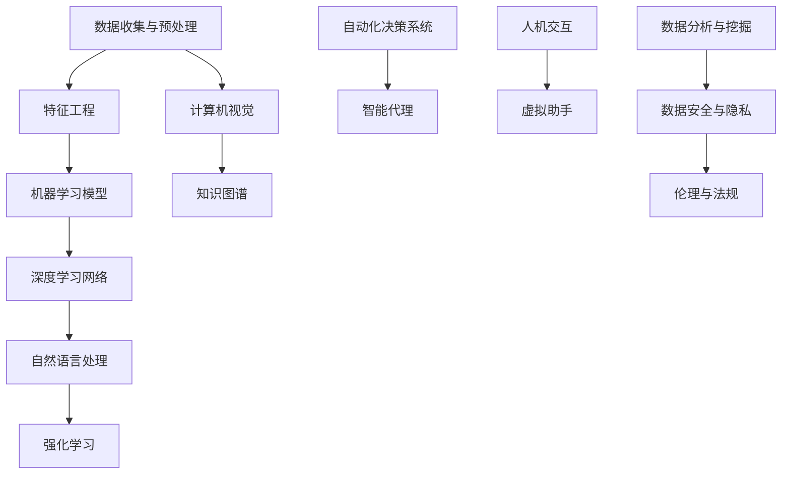

                 

### 1. 背景介绍

人工智能（AI）作为计算机科学的一个重要分支，已经经历了多个发展阶段。从最初的规则驱动（Rule-Based）系统，到基于知识的系统（Knowledge-Based Systems），再到机器学习（Machine Learning）和深度学习（Deep Learning），人工智能不断进化，影响力也越来越大。然而，随着技术的不断进步，我们正迎来人工智能2.0（AI 2.0）时代，这是一个更加智能、更加自主、更加广泛应用的阶段。

李开复博士，作为世界著名的人工智能专家，连续创业家，曾担任微软亚洲研究院创始人及首席科学家，创新工场的创始人，他在人工智能领域的研究和实践具有广泛而深远的影响。李开复对人工智能2.0时代的理解和洞察，为我们提供了宝贵的参考和指导。

AI 2.0时代，不同于传统的AI时代，它不再仅仅依赖于大量数据和强大计算能力，而是更加强调智能化、自动化和通用性。在这一时代，开发者不仅需要具备扎实的技术基础，还需要具备创新思维和跨学科的综合能力。

本文将围绕AI 2.0时代的开发者这一主题，深入探讨以下几个方面的内容：

1. **AI 2.0时代的定义与特点**
2. **核心概念与联系**
3. **核心算法原理与具体操作步骤**
4. **数学模型与公式讲解**
5. **项目实践：代码实例和详细解释**
6. **实际应用场景**
7. **未来应用展望**
8. **工具和资源推荐**
9. **总结与展望**

通过本文的阅读，开发者可以更好地理解AI 2.0时代的核心技术和发展趋势，为自己的职业发展做好准备。

---

### 2. 核心概念与联系

在AI 2.0时代，我们需要理解一系列核心概念，这些概念不仅相互联系，而且构成了整个AI系统的基石。为了更直观地展示这些概念之间的关系，我们可以使用Mermaid流程图来描述。

下面是一个Mermaid流程图示例，展示了AI 2.0时代的一些关键概念：



#### 数据收集与预处理

数据收集与预处理是AI系统的第一步，也是至关重要的一步。有效的数据收集和预处理可以显著提高模型的性能和准确性。这个过程包括数据清洗、去噪、归一化等步骤。

#### 特征工程

特征工程是指从原始数据中提取出对模型训练有用的特征。一个好的特征工程可以大大提升模型的泛化能力。

#### 机器学习模型

机器学习模型是AI系统的核心，它们通过学习数据中的规律来做出预测或决策。常见的机器学习模型包括线性回归、决策树、支持向量机等。

#### 深度学习网络

深度学习网络是机器学习模型的一个分支，通过多层神经网络的堆叠，能够自动提取出数据中的复杂特征。

#### 自然语言处理

自然语言处理（NLP）是AI的一个重要分支，旨在使计算机能够理解、生成和翻译自然语言。

#### 强化学习

强化学习是一种通过试错和奖励机制来学习策略的机器学习技术。它常用于需要连续决策的应用场景，如自动驾驶、游戏等。

#### 计算机视觉

计算机视觉是指使计算机能够“看”和理解视觉信息的技术。它广泛应用于图像识别、人脸识别等领域。

#### 知识图谱

知识图谱是一种用于表示实体和它们之间关系的数据结构，广泛应用于语义搜索、推荐系统等。

#### 自动化决策系统

自动化决策系统是指利用AI技术来自动化决策过程的系统。它可以用于金融、医疗、物流等多个领域。

#### 智能代理

智能代理是一种能够代表用户执行任务、与外部系统交互的软件实体。

#### 人机交互

人机交互是指人与计算机之间的交互，包括图形用户界面、语音交互等。

#### 虚拟助手

虚拟助手是利用AI技术构建的模拟人类交互的软件程序，如聊天机器人、语音助手等。

#### 数据分析与挖掘

数据分析和挖掘是指从大量数据中提取有价值的信息和知识。

#### 数据安全与隐私

数据安全和隐私是AI系统面临的一个重要挑战，需要采取有效的措施来保护用户数据的安全和隐私。

#### 伦理与法规

伦理与法规是AI系统在社会应用中必须考虑的因素，包括数据隐私、算法公平性等。

通过上述核心概念的介绍，我们可以更深入地理解AI 2.0时代的各个方面。接下来，我们将探讨这些概念背后的核心算法原理和具体操作步骤。

#### 3. 核心算法原理 & 具体操作步骤

在AI 2.0时代，核心算法的作用至关重要，它们决定了AI系统的性能和应用范围。以下是对几种关键算法的原理及其具体操作步骤的详细介绍。

### 3.1 算法原理概述

#### 数据预处理算法

数据预处理算法包括数据清洗、归一化、特征选择和特征提取等步骤。这些步骤的目的是提高数据质量，为后续的机器学习模型训练提供更好的输入。

**原理：**
- **数据清洗：** 去除重复数据、处理缺失值和异常值。
- **归一化：** 将数据缩放到相同的尺度，以便模型可以更好地学习。
- **特征选择：** 选择对模型训练有显著贡献的特征，去除无关或冗余特征。
- **特征提取：** 从原始数据中提取更高层次的特征，以便模型可以学习更复杂的模式。

**具体操作步骤：**
1. **数据清洗：** 使用Python的Pandas库进行数据预处理，例如：
   ```python
   import pandas as pd
   df = pd.read_csv('data.csv')
   df.drop_duplicates(inplace=True)
   df.fillna(method='ffill', inplace=True)
   ```
2. **归一化：** 使用Scikit-learn库中的MinMaxScaler进行归一化：
   ```python
   from sklearn.preprocessing import MinMaxScaler
   scaler = MinMaxScaler()
   df_scaled = scaler.fit_transform(df)
   ```
3. **特征选择：** 使用特征重要性评估方法，例如随机森林，选择重要特征：
   ```python
   from sklearn.ensemble import RandomForestClassifier
   rf = RandomForestClassifier()
   rf.fit(df_scaled, labels)
   importances = rf.feature_importances_
   selected_features = df.columns[importances > 0.5]
   ```
4. **特征提取：** 使用主成分分析（PCA）提取新特征：
   ```python
   from sklearn.decomposition import PCA
   pca = PCA(n_components=5)
   new_features = pca.fit_transform(df[selected_features])
   ```

#### 机器学习算法

机器学习算法包括监督学习、无监督学习和半监督学习。以下以决策树为例，介绍监督学习算法的原理和操作步骤。

**原理：**
- **决策树：** 通过一系列if-else判断来对数据进行分类或回归。
- **ID3算法：** 使用信息增益作为分割标准。
- **C4.5算法：** 优化了ID3算法，使用了增益比作为分割标准。

**具体操作步骤：**
1. **数据准备：** 使用预处理后的数据。
2. **构建决策树：** 使用Scikit-learn库中的DecisionTreeClassifier：
   ```python
   from sklearn.tree import DecisionTreeClassifier
   clf = DecisionTreeClassifier(criterion='gini')
   clf.fit(new_features, labels)
   ```
3. **可视化决策树：** 使用Graphviz库可视化决策树：
   ```python
   from sklearn.tree import export_graphviz
   import graphviz
   dot_data = export_graphviz(clf, out_file=None, feature_names=selected_features, class_names=['Class 0', 'Class 1'], filled=True, rounded=True, special_characters=True)
   graph = graphviz.Source(dot_data)
   graph.render("tree")
   ```

#### 深度学习算法

深度学习算法是AI 2.0时代的关键技术之一，以下以卷积神经网络（CNN）为例，介绍其原理和操作步骤。

**原理：**
- **CNN：** 利用卷积操作提取图像特征。
- **卷积层：** 应用卷积核在输入数据上滑动，提取局部特征。
- **池化层：** 减小特征图的尺寸，提高模型泛化能力。
- **全连接层：** 将卷积层提取的特征映射到输出。

**具体操作步骤：**
1. **数据准备：** 使用预处理后的图像数据。
2. **构建CNN模型：** 使用TensorFlow和Keras库：
   ```python
   from tensorflow.keras.models import Sequential
   from tensorflow.keras.layers import Conv2D, MaxPooling2D, Flatten, Dense
   model = Sequential([
       Conv2D(32, (3, 3), activation='relu', input_shape=(64, 64, 3)),
       MaxPooling2D((2, 2)),
       Conv2D(64, (3, 3), activation='relu'),
       MaxPooling2D((2, 2)),
       Flatten(),
       Dense(128, activation='relu'),
       Dense(1, activation='sigmoid')
   ])
   model.compile(optimizer='adam', loss='binary_crossentropy', metrics=['accuracy'])
   ```
3. **训练模型：** 使用训练数据训练模型：
   ```python
   model.fit(train_images, train_labels, epochs=10, validation_split=0.2)
   ```

通过上述算法原理和操作步骤的介绍，开发者可以更好地理解AI 2.0时代的关键算法，并在实际项目中应用这些技术。

### 3.2 算法步骤详解

在了解了核心算法的基本原理后，接下来我们将详细讨论这些算法的具体步骤，以便开发者能够更好地在项目中应用。

#### 数据预处理算法

数据预处理是机器学习项目的第一步，它直接影响模型的性能。以下是一个详细的数据预处理流程：

1. **数据清洗：**
   - **去除重复数据：** 使用Pandas库中的`drop_duplicates()`方法去除重复数据。
   - **处理缺失值：** 根据缺失值的比例和数据的特性，选择填充或删除缺失值。常用的填充方法有均值填充、中值填充、前值填充等。例如：
     ```python
     df.fillna(df.mean(), inplace=True)
     ```
   - **处理异常值：** 使用统计方法或可视化方法（如箱线图）检测异常值，然后选择删除或调整异常值。

2. **归一化：**
   - **数值特征归一化：** 使用MinMaxScaler将数值特征缩放到[0, 1]之间，或使用StandardScaler将特征缩放到均值为0，标准差为1的分布上。例如：
     ```python
     from sklearn.preprocessing import MinMaxScaler
     scaler = MinMaxScaler()
     df_scaled = scaler.fit_transform(df)
     ```

3. **特征选择：**
   - **特征重要性评估：** 使用随机森林等模型评估特征的重要性，然后选择重要性较高的特征。例如：
     ```python
     from sklearn.ensemble import RandomForestClassifier
     rf = RandomForestClassifier()
     rf.fit(df_scaled, labels)
     importances = rf.feature_importances_
     selected_features = df.columns[importances > 0.5]
     ```

4. **特征提取：**
   - **主成分分析（PCA）：** 使用PCA提取新的特征，减少数据的维度，同时保留主要的信息。例如：
     ```python
     from sklearn.decomposition import PCA
     pca = PCA(n_components=5)
     new_features = pca.fit_transform(df[selected_features])
     ```

通过上述步骤，我们可以确保输入数据的质量，从而提高模型的性能。

#### 机器学习算法

以决策树为例，下面详细描述其具体步骤：

1. **选择分割标准：**
   - **信息增益（ID3算法）：** 选择能够最大化信息增益的特征进行分割。
   - **增益比（C4.5算法）：** 选择能够最大化增益比的特

