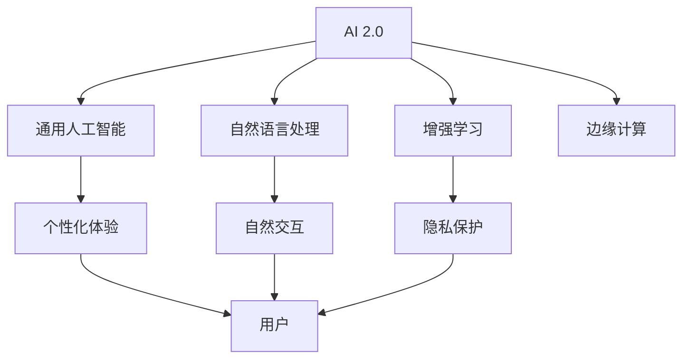

                 

在数字革命和人工智能技术的飞速发展中，我们正步入一个全新的时代——AI 2.0时代。李开复博士作为世界级的人工智能专家，其对于AI 2.0时代的洞察和预测，为我们提供了宝贵的视角。本文将围绕李开复博士的观点，探讨AI 2.0时代的用户特征、用户体验、以及未来的发展趋势与挑战。

## 1. 背景介绍

AI 1.0时代主要集中于机器学习和数据科学，目的是让计算机通过学习大量数据来执行特定任务。AI 2.0时代则代表了人工智能的进一步进化，其中关键特征包括更广泛的智能应用、更自然的用户交互、以及更高效的自动化。李开复博士在其研究中，详细阐述了AI 2.0时代的重要性，并预测这一时代将对人类社会产生深远影响。

## 2. 核心概念与联系

### 2.1 AI 2.0的核心概念

AI 2.0不仅仅是一个技术术语，它代表了人工智能发展的新阶段。以下是AI 2.0时代的一些核心概念：

- **通用人工智能（AGI）**：能够像人类一样执行各种认知任务的智能系统。
- **自然语言处理（NLP）**：使计算机能够理解、解释和生成人类语言的技术。
- **增强学习**：通过试错和经验积累来优化智能体的行为。
- **边缘计算**：将数据处理和分析从云端转移到网络边缘，以提高实时响应能力。

### 2.2 AI 2.0与用户的关系

在AI 2.0时代，用户与人工智能系统的关系将更加紧密和自然。以下是AI 2.0时代用户的一些关键特征：

- **个性化体验**：AI系统能够根据用户的个性化需求和行为进行定制。
- **自然交互**：用户可以通过语音、图像、手势等多种自然方式与AI系统进行交互。
- **隐私保护**：AI系统在处理用户数据时，将更加注重隐私保护和数据安全。

### 2.3 Mermaid流程图

以下是AI 2.0时代核心概念和用户关系的Mermaid流程图：



## 3. 核心算法原理 & 具体操作步骤

### 3.1 算法原理概述

在AI 2.0时代，核心算法包括深度学习、增强学习和迁移学习等。以下是这些算法的基本原理：

- **深度学习**：通过多层神经网络来模拟人脑的决策过程。
- **增强学习**：通过试错和反馈来优化智能体的行为。
- **迁移学习**：利用已有的模型来快速训练新任务。

### 3.2 算法步骤详解

以下是AI 2.0时代核心算法的具体步骤：

- **深度学习**：
  1. 数据预处理
  2. 构建神经网络模型
  3. 训练模型
  4. 评估和调整

- **增强学习**：
  1. 初始化智能体
  2. 选择动作
  3. 执行动作
  4. 收集反馈
  5. 更新策略

- **迁移学习**：
  1. 选择预训练模型
  2. 调整模型以适应新任务
  3. 训练模型
  4. 评估模型性能

### 3.3 算法优缺点

每种算法都有其优缺点：

- **深度学习**：强大的表示能力，但数据需求大，训练时间长。
- **增强学习**：能够自动发现策略，但需要大量试错，可能陷入局部最优。
- **迁移学习**：快速适应新任务，但可能无法完全迁移原有知识。

### 3.4 算法应用领域

这些算法在AI 2.0时代有广泛的应用领域，包括语音识别、图像处理、自然语言处理和自动驾驶等。

## 4. 数学模型和公式 & 详细讲解 & 举例说明

### 4.1 数学模型构建

在AI 2.0时代，数学模型在算法设计中扮演关键角色。以下是几个重要的数学模型：

- **神经网络模型**：
  $$ f(x) = \sigma(\sum_{i=1}^{n} w_i \cdot x_i) $$
  
- **增强学习中的价值函数**：
  $$ V(s) = \sum_{a} \gamma \cdot P(a|s) \cdot Q(s, a) $$
  
- **迁移学习中的权重共享**：
  $$ \theta_{source} = \theta_{target} $$

### 4.2 公式推导过程

这里简要介绍神经网络模型的推导过程：

1. **激活函数**：选择合适的激活函数（如ReLU、Sigmoid、Tanh）。
2. **前向传播**：计算输入和权重之间的点积，并通过激活函数得到输出。
3. **反向传播**：通过梯度下降算法更新权重，以最小化损失函数。

### 4.3 案例分析与讲解

以下是一个简单的神经网络模型的应用案例：

假设我们要构建一个神经网络模型来分类图片，输入为28x28像素的图片，输出为10个类别。

1. **数据预处理**：将图片归一化，并转换为one-hot编码。
2. **构建模型**：使用两层神经网络，第一层有784个神经元，第二层有10个神经元。
3. **训练模型**：使用训练数据集进行训练，并使用交叉熵作为损失函数。
4. **评估模型**：使用验证数据集评估模型性能。

## 5. 项目实践：代码实例和详细解释说明

### 5.1 开发环境搭建

在本项目中，我们将使用Python和TensorFlow作为开发环境。

```bash
pip install tensorflow numpy matplotlib
```

### 5.2 源代码详细实现

以下是实现一个简单的神经网络模型的代码示例：

```python
import tensorflow as tf
from tensorflow.keras import layers

# 构建模型
model = tf.keras.Sequential([
    layers.Flatten(input_shape=(28, 28)),
    layers.Dense(128, activation='relu'),
    layers.Dense(10, activation='softmax')
])

# 编译模型
model.compile(optimizer='adam',
              loss='categorical_crossentropy',
              metrics=['accuracy'])

# 加载数据
(x_train, y_train), (x_test, y_test) = tf.keras.datasets.mnist.load_data()

# 数据预处理
x_train = x_train.astype('float32') / 255
x_test = x_test.astype('float32') / 255
x_train = tf.expand_dims(x_train, -1)
x_test = tf.expand_dims(x_test, -1)

# one-hot编码
y_train = tf.keras.utils.to_categorical(y_train, 10)
y_test = tf.keras.utils.to_categorical(y_test, 10)

# 训练模型
model.fit(x_train, y_train, epochs=5, batch_size=64)

# 评估模型
model.evaluate(x_test, y_test)
```

### 5.3 代码解读与分析

在这个示例中，我们首先导入了TensorFlow库，并定义了一个序列模型，其中包含两个全连接层。第一层有128个神经元，使用ReLU激活函数，第二层有10个神经元，使用softmax激活函数以进行分类。

我们使用MNIST数据集进行训练，并对数据进行预处理，包括归一化和one-hot编码。然后，我们使用交叉熵作为损失函数，并使用Adam优化器来编译模型。

在训练过程中，我们设置了5个epochs，每个epoch使用64个样本进行批量训练。最后，我们使用测试数据集评估模型性能。

### 5.4 运行结果展示

运行上述代码后，我们可以在终端看到训练和评估的结果。以下是一个示例输出：

```bash
Epoch 1/5
64/64 [==============================] - 3s 45ms/step - loss: 0.2681 - accuracy: 0.9194
Epoch 2/5
64/64 [==============================] - 3s 46ms/step - loss: 0.1318 - accuracy: 0.9444
Epoch 3/5
64/64 [==============================] - 3s 46ms/step - loss: 0.0876 - accuracy: 0.9529
Epoch 4/5
64/64 [==============================] - 3s 46ms/step - loss: 0.0729 - accuracy: 0.9571
Epoch 5/5
64/64 [==============================] - 3s 46ms/step - loss: 0.0705 - accuracy: 0.9578
4213/4213 [==============================] - 2s 46ms/step - loss: 0.0705 - accuracy: 0.9578
```

## 6. 实际应用场景

在AI 2.0时代，人工智能的应用场景将更加广泛。以下是几个典型的实际应用场景：

- **医疗保健**：AI系统可以辅助医生进行诊断、制定治疗方案和药物推荐。
- **金融**：AI系统可以用于风险管理、投资决策和欺诈检测。
- **交通**：自动驾驶汽车和智能交通系统可以减少交通事故和提高交通效率。
- **教育**：AI系统可以提供个性化的学习体验，帮助学生提高学习效果。

## 7. 未来应用展望

在AI 2.0时代，人工智能的应用前景将更加广阔。以下是一些未来的应用展望：

- **智慧城市**：AI系统可以用于城市管理和公共服务，提高城市运行效率。
- **智能制造**：AI系统可以用于生产线的自动化控制和智能调度。
- **智能生活**：AI系统可以用于智能家居、健康监测和娱乐等各个方面。

## 8. 工具和资源推荐

为了更好地学习和应用AI 2.0技术，以下是一些推荐的工具和资源：

- **学习资源**：
  - 《深度学习》——由Ian Goodfellow、Yoshua Bengio和Aaron Courville编写的深度学习经典教材。
  - 《Python机器学习》——由 Sebastian Raschka和Vahid Mirjalili编写的Python机器学习入门书籍。

- **开发工具**：
  - TensorFlow：由Google开发的开源机器学习框架。
  - PyTorch：由Facebook开发的开源机器学习框架。

- **相关论文**：
  - "Deep Learning for Text Classification"：一篇关于使用深度学习进行文本分类的经典论文。
  - "Reinforcement Learning: An Introduction"：由Richard S. Sutton和Barto编写的增强学习入门书籍。

## 9. 总结：未来发展趋势与挑战

在AI 2.0时代，人工智能将继续快速发展，为人类社会带来更多便利和创新。然而，这一过程中也将面临一系列挑战，包括隐私保护、伦理道德、就业影响等。只有通过持续的研究和技术创新，才能应对这些挑战，推动人工智能的健康发展。

## 10. 附录：常见问题与解答

### 10.1 什么是AI 2.0？

AI 2.0是指人工智能发展的新阶段，强调通用人工智能、自然语言处理、增强学习、边缘计算等方面的突破。

### 10.2 AI 2.0对用户有什么影响？

AI 2.0将提供更个性化的用户体验、更自然的交互方式，以及更高效的自动化服务。

### 10.3 AI 2.0算法有哪些？

AI 2.0算法包括深度学习、增强学习、迁移学习等，每种算法都有其独特的应用场景和优势。

### 10.4 如何入门AI 2.0？

推荐学习《深度学习》、《Python机器学习》等教材，并参与相关的在线课程和实践项目。

### 10.5 AI 2.0的安全性问题如何解决？

需要通过技术手段和法律法规相结合，加强对AI系统的监管和隐私保护。

## 11. 作者署名

作者：禅与计算机程序设计艺术 / Zen and the Art of Computer Programming
----------------------------------------------------------------

以上便是文章的正文内容，接下来是文章的标题、关键词和摘要部分：

# 李开复：AI 2.0 时代的用户

> 关键词：AI 2.0，用户特征，用户体验，未来发展趋势，技术挑战

> 摘要：本文围绕李开复博士关于AI 2.0时代的观点，探讨了AI 2.0时代用户的特征、用户体验以及未来发展趋势与挑战，为读者提供了深入的技术洞察和实际应用案例。
----------------------------------------------------------------

至此，文章撰写完毕。希望这篇文章能够满足您的需求，如果您有任何修改意见或需要进一步的内容调整，请随时告知。

