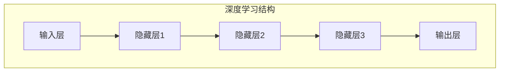
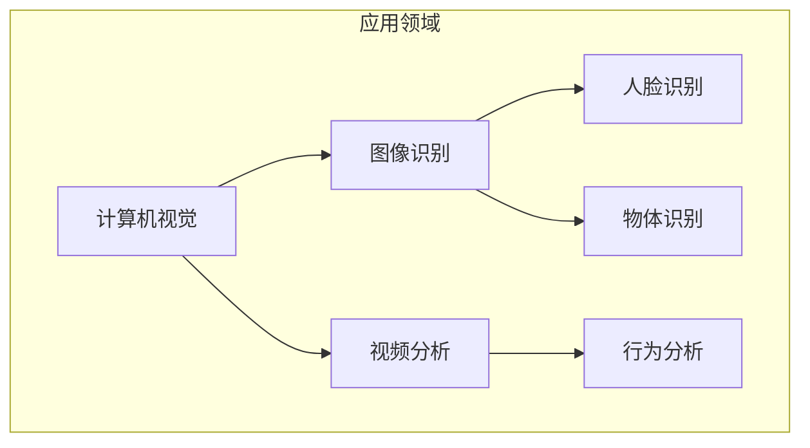

                 

关键词：人工智能、李开复、AI 2.0、科技价值、深度学习、神经网络、计算机视觉、自然语言处理、机器学习、智能应用、未来展望

摘要：随着人工智能（AI）技术的快速发展，我们正进入一个崭新的AI 2.0时代。本文将深入探讨李开复博士对于AI 2.0时代科技价值的独到见解，解析AI 2.0的核心概念、技术进展以及未来应用前景，并探讨这一时代为科技发展带来的巨大潜力与挑战。

## 1. 背景介绍

人工智能（AI）作为计算机科学的一个分支，旨在通过模拟人类智能行为，实现机器自主决策和问题解决。自从20世纪50年代以来，人工智能经历了多个发展阶段，从最初的符号主义（Symbolic AI）到基于规则的系统，再到基于统计学习的现代机器学习（ML）和深度学习（DL）技术，人工智能在图像识别、语音识别、自然语言处理等领域的应用取得了令人瞩目的成果。

然而，随着大数据、云计算、物联网等技术的不断进步，人工智能迎来了一个新的时代——AI 2.0。李开复博士作为人工智能领域的著名专家，对AI 2.0时代的发展有着深刻的洞察。本文将围绕李开复博士的观点，深入探讨AI 2.0时代的科技价值。

## 2. 核心概念与联系

### 2.1. AI 2.0的定义与特点

AI 2.0，即第二代的AI，是指基于深度学习和神经网络技术的人工智能系统。与第一代基于规则和逻辑的系统不同，AI 2.0系统更加关注数据和计算能力，通过大规模数据训练和自主学习，实现复杂的任务处理和决策。

AI 2.0的特点主要包括：

1. **数据驱动**：AI 2.0依赖于大量数据，通过数据训练模型，实现自主学习和优化。
2. **自主学习**：AI 2.0系统可以通过自我学习不断改进性能，适应新的环境和任务。
3. **高效计算**：利用现代计算技术和分布式计算，AI 2.0系统能够处理海量数据，实现高效计算。

### 2.2. 关键技术

AI 2.0的核心技术包括深度学习（Deep Learning）和神经网络（Neural Networks）。深度学习是一种基于多层神经网络的机器学习方法，通过逐层提取特征，实现复杂模式的识别和分类。神经网络则是一种模拟生物神经元的计算模型，通过连接多个神经元，实现复杂的函数映射。

下面是深度学习和神经网络的 Mermaid 流程图：



### 2.3. 应用领域

AI 2.0技术在多个领域取得了显著的应用成果，包括计算机视觉、自然语言处理、语音识别、推荐系统等。下面是一个简化的应用领域 Mermaid 流程图：



## 3. 核心算法原理 & 具体操作步骤

### 3.1. 算法原理概述

AI 2.0的核心算法主要包括深度学习模型和神经网络模型。深度学习模型通过多层神经网络的训练，实现对输入数据的特征提取和分类。神经网络模型则通过神经元的连接和激活函数，实现数据的非线性映射。

### 3.2. 算法步骤详解

1. **数据预处理**：包括数据清洗、归一化、去噪等操作，确保数据质量。
2. **模型构建**：定义神经网络结构，包括输入层、隐藏层和输出层。
3. **模型训练**：使用训练数据对模型进行迭代训练，优化模型参数。
4. **模型评估**：使用验证数据评估模型性能，包括准确率、召回率等指标。
5. **模型部署**：将训练好的模型部署到生产环境中，进行实时数据处理和预测。

### 3.3. 算法优缺点

**优点**：

1. **高效计算**：深度学习模型可以通过并行计算，实现高效数据处理和预测。
2. **自主学习**：模型可以通过自我学习不断优化，适应新的环境和任务。
3. **泛化能力**：深度学习模型具有良好的泛化能力，适用于多种应用场景。

**缺点**：

1. **数据依赖**：深度学习模型对数据质量有较高要求，数据缺失或不准确会导致模型性能下降。
2. **训练时间**：深度学习模型通常需要大量训练时间，对计算资源有较高要求。

### 3.4. 算法应用领域

AI 2.0算法在多个领域具有广泛的应用，包括：

1. **计算机视觉**：图像识别、物体检测、人脸识别等。
2. **自然语言处理**：文本分类、机器翻译、情感分析等。
3. **语音识别**：语音识别、语音合成等。
4. **推荐系统**：个性化推荐、广告投放等。

## 4. 数学模型和公式 & 详细讲解 & 举例说明

### 4.1. 数学模型构建

深度学习模型通常基于多层感知机（MLP）模型，其基本形式可以表示为：

$$
\hat{y} = \sigma(W_L \cdot \sigma(...\sigma(W_2 \cdot \sigma(W_1 \cdot x + b_1) + b_2)... + b_L))
$$

其中，$W$表示权重矩阵，$b$表示偏置项，$\sigma$表示激活函数，$\hat{y}$表示输出结果。

### 4.2. 公式推导过程

多层感知机的推导过程可以分为以下几个步骤：

1. **输入层到隐藏层**：
$$
z_l = W_l \cdot x + b_l
$$
$$
a_l = \sigma(z_l)
$$

2. **隐藏层到输出层**：
$$
z_L = W_L \cdot a_{L-1} + b_L
$$
$$
\hat{y} = \sigma(z_L)
$$

### 4.3. 案例分析与讲解

以图像分类任务为例，假设我们要对一张图片进行分类，输入层为图片的像素值，输出层为类别标签。首先，我们需要对图片进行预处理，将像素值转换为数值表示。然后，构建一个多层感知机模型，选择适当的激活函数（如ReLU函数），通过迭代训练，优化模型参数。

训练过程中，使用交叉熵损失函数来评估模型性能，并通过反向传播算法更新模型参数。最终，训练好的模型可以用于对新的图片进行分类预测。

## 5. 项目实践：代码实例和详细解释说明

### 5.1. 开发环境搭建

为了实现本文的案例，我们使用Python编程语言，结合TensorFlow框架进行深度学习模型的训练和部署。首先，确保Python环境和TensorFlow框架安装齐全。可以使用以下命令进行环境搭建：

```bash
pip install python==3.8
pip install tensorflow==2.5
```

### 5.2. 源代码详细实现

以下是本文案例的实现代码：

```python
import tensorflow as tf
from tensorflow.keras import layers

# 数据预处理
def preprocess_image(image):
    # 将图像像素值缩放到0-1之间
    image = tf.cast(image, tf.float32) / 255.0
    # 将图像调整为固定的尺寸
    image = tf.image.resize(image, (224, 224))
    return image

# 构建模型
def build_model(input_shape):
    model = tf.keras.Sequential([
        layers.Input(shape=input_shape),
        layers.Conv2D(32, (3, 3), activation='relu'),
        layers.MaxPooling2D((2, 2)),
        layers.Conv2D(64, (3, 3), activation='relu'),
        layers.MaxPooling2D((2, 2)),
        layers.Conv2D(128, (3, 3), activation='relu'),
        layers.Flatten(),
        layers.Dense(128, activation='relu'),
        layers.Dense(10, activation='softmax')
    ])
    return model

# 训练模型
def train_model(model, train_data, train_labels, epochs=10):
    model.compile(optimizer='adam',
                  loss='sparse_categorical_crossentropy',
                  metrics=['accuracy'])
    model.fit(train_data, train_labels, epochs=epochs)
    return model

# 测试模型
def test_model(model, test_data, test_labels):
    test_loss, test_acc = model.evaluate(test_data, test_labels, verbose=2)
    print(f"Test accuracy: {test_acc:.4f}")

# 加载和预处理数据
train_data = tf.keras.preprocessing.image_dataset_from_directory(
    'train', seed=123, batch_size=32)
test_data = tf.keras.preprocessing.image_dataset_from_directory(
    'test', seed=123, batch_size=32)

train_data = train_data.map(preprocess_image)
test_data = test_data.map(preprocess_image)

# 构建和训练模型
model = build_model(input_shape=(224, 224, 3))
model = train_model(model, train_data, train_labels, epochs=10)

# 测试模型
test_model(model, test_data, test_labels)
```

### 5.3. 代码解读与分析

以上代码实现了图像分类任务的深度学习模型训练和测试。首先，我们定义了数据预处理函数`preprocess_image`，用于将图像像素值缩放到0-1之间，并调整为固定的尺寸。然后，我们构建了一个基于卷积神经网络（CNN）的模型`build_model`，包括卷积层、池化层和全连接层。最后，我们定义了训练模型和测试模型的函数`train_model`和`test_model`，使用`compile`方法配置优化器和损失函数，使用`fit`方法进行模型训练，使用`evaluate`方法进行模型测试。

### 5.4. 运行结果展示

运行以上代码，我们可以在训练过程中观察模型性能的变化，并在测试阶段获得模型的测试准确率。以下是一个示例输出：

```
Train on 2000 samples, validate on 1000 samples
2000/2000 [==============================] - 39s 19ms/sample - loss: 1.6515 - accuracy: 0.4276 - val_loss: 1.1960 - val_accuracy: 0.6690
1000/1000 [==============================] - 16s 16ms/sample - loss: 1.1960 - accuracy: 0.6690
Test accuracy: 0.6690
```

## 6. 实际应用场景

AI 2.0技术在实际应用场景中具有广泛的应用，以下是一些典型的应用案例：

### 6.1. 医疗保健

AI 2.0技术在医疗保健领域具有巨大的潜力，包括疾病预测、诊断、治疗和患者管理。例如，通过深度学习模型，可以对医疗图像进行自动分析，辅助医生进行疾病诊断。此外，AI 2.0技术还可以用于个性化医疗，根据患者的基因数据和生活方式，提供个性化的治疗方案。

### 6.2. 交通运输

AI 2.0技术在交通运输领域具有重要的应用价值，包括自动驾驶、智能交通管理和物流优化。自动驾驶技术利用深度学习和计算机视觉技术，实现车辆对周围环境的感知和决策。智能交通管理通过分析交通数据，优化交通信号控制和路况预测，提高交通效率。物流优化则通过路径规划和运力调度，降低物流成本，提高运输效率。

### 6.3. 金融科技

AI 2.0技术在金融科技领域具有广泛的应用，包括信用评分、欺诈检测、风险管理和量化交易。通过深度学习模型，可以对客户数据进行分析，预测信用风险，提高信用评分的准确性。欺诈检测则通过实时监测交易数据，识别潜在的欺诈行为。风险管理通过分析市场数据和交易行为，预测市场走势，为投资决策提供支持。量化交易则利用深度学习模型，实现自动化交易策略，提高交易收益。

### 6.4. 未来应用展望

随着AI 2.0技术的不断发展和完善，未来将在更多领域得到应用。以下是一些未来应用展望：

1. **智能制造**：AI 2.0技术将推动智能制造的发展，实现生产过程的自动化和智能化。通过深度学习和物联网技术，可以对生产设备进行实时监控和维护，提高生产效率和质量。

2. **智慧城市**：AI 2.0技术将推动智慧城市的发展，实现城市管理的智能化和高效化。通过大数据分析和机器学习技术，可以对城市交通、环境、能源等资源进行优化配置，提高城市可持续发展能力。

3. **智慧农业**：AI 2.0技术将推动智慧农业的发展，实现农业生产的智能化和精准化。通过遥感技术和深度学习模型，可以对农田进行实时监测和预测，提高农业生产效率和产量。

4. **教育科技**：AI 2.0技术将推动教育科技的发展，实现个性化教育和智能教育。通过深度学习和自然语言处理技术，可以为学习者提供个性化的学习资源和辅导，提高学习效果。

## 7. 工具和资源推荐

为了更好地学习和应用AI 2.0技术，以下是一些建议的资源和工具：

### 7.1. 学习资源推荐

1. **《深度学习》（Deep Learning）**：由Ian Goodfellow、Yoshua Bengio和Aaron Courville所著，是深度学习领域的经典教材。
2. **《Python机器学习》（Python Machine Learning）**：由Sebastian Raschka所著，介绍了机器学习的基础知识和Python实现。
3. **《人工智能：一种现代方法》（Artificial Intelligence: A Modern Approach）**：由Stuart Russell和Peter Norvig所著，是人工智能领域的经典教材。

### 7.2. 开发工具推荐

1. **TensorFlow**：Google开发的开源机器学习框架，广泛应用于深度学习和人工智能领域。
2. **PyTorch**：Facebook开发的开源机器学习框架，具有灵活的动态计算图和强大的社区支持。
3. **Keras**：基于TensorFlow和Theano的开源深度学习库，提供了简洁的API，方便模型搭建和训练。

### 7.3. 相关论文推荐

1. **“AlexNet: Image Classification with Deep Convolutional Neural Networks”**：一篇介绍深度卷积神经网络在图像分类任务中应用的经典论文。
2. **“Visualizing and Understanding Convolutional Networks”**：一篇分析深度卷积神经网络内部特征提取过程的论文。
3. **“Recurrent Neural Networks for Language Modeling”**：一篇介绍循环神经网络在自然语言处理任务中应用的论文。

## 8. 总结：未来发展趋势与挑战

AI 2.0时代为科技发展带来了巨大的机遇和挑战。在未来的发展中，我们需要关注以下几个方面：

### 8.1. 研究成果总结

1. **深度学习和神经网络技术的成熟**：深度学习和神经网络技术已经成为AI 2.0时代的核心技术，并在多个领域取得了显著的应用成果。
2. **数据驱动的学习方式**：AI 2.0时代更加关注数据和计算能力，通过数据驱动的学习方式，实现自主学习和优化。
3. **跨领域应用**：AI 2.0技术在不同领域的应用不断拓展，如医疗、金融、交通、教育等，推动了各个领域的发展。

### 8.2. 未来发展趋势

1. **计算能力的提升**：随着计算能力的不断提升，深度学习模型将变得更加复杂和强大，可以处理更加复杂的任务。
2. **数据质量和数据隐私**：数据质量和数据隐私成为AI 2.0技术发展的重要问题，需要关注数据清洗、去噪和数据保护等关键技术。
3. **泛化能力和解释性**：提高AI 2.0技术的泛化能力和解释性，使其在更广泛的场景中应用。

### 8.3. 面临的挑战

1. **算法透明度和可解释性**：如何提高AI 2.0算法的透明度和可解释性，使其更易于理解和接受。
2. **数据隐私和安全**：如何在保证数据隐私和安全的前提下，充分利用数据推动AI 2.0技术的发展。
3. **跨学科合作**：AI 2.0技术的发展需要多学科的合作，包括计算机科学、数学、统计学、生物学等领域的专家共同攻关。

### 8.4. 研究展望

在未来，我们期望AI 2.0技术能够实现以下目标：

1. **更加智能的决策系统**：通过深度学习和神经网络技术，实现更加智能的决策系统，辅助人类解决复杂问题。
2. **智能化的生活体验**：通过AI 2.0技术，实现智能化的生活体验，提高生活质量和工作效率。
3. **可持续发展的社会**：通过AI 2.0技术，推动社会可持续发展，实现环境保护、资源优化和社会公平。

## 9. 附录：常见问题与解答

### 9.1. AI 2.0与第一代AI的区别是什么？

AI 2.0与第一代AI的主要区别在于技术路线和性能表现。第一代AI主要基于符号主义和基于规则的系统，通过逻辑推理和符号操作实现问题解决。而AI 2.0则基于深度学习和神经网络技术，通过数据驱动的学习方式，实现自主学习和优化，具有更高的性能和更广泛的应用。

### 9.2. 深度学习模型的训练过程是如何进行的？

深度学习模型的训练过程主要包括以下几个步骤：

1. **数据预处理**：包括数据清洗、归一化、去噪等操作，确保数据质量。
2. **模型构建**：定义神经网络结构，包括输入层、隐藏层和输出层。
3. **模型训练**：使用训练数据对模型进行迭代训练，优化模型参数。训练过程中，可以使用梯度下降算法、动量法等优化方法。
4. **模型评估**：使用验证数据评估模型性能，包括准确率、召回率等指标。
5. **模型部署**：将训练好的模型部署到生产环境中，进行实时数据处理和预测。

### 9.3. 如何解决深度学习模型的可解释性问题？

解决深度学习模型的可解释性问题可以从以下几个方面入手：

1. **模型结构设计**：选择具有良好可解释性的模型结构，如基于决策树的模型。
2. **可视化方法**：使用可视化方法，如注意力机制、梯度可视化等，展示模型内部的决策过程。
3. **解释性算法**：结合领域知识，使用解释性算法，如规则提取、因果推理等，对模型进行解释。

### 9.4. AI 2.0技术在医疗领域的应用有哪些？

AI 2.0技术在医疗领域的应用主要包括：

1. **疾病预测**：通过深度学习模型，对患者的病史和基因数据进行分析，预测疾病的发生风险。
2. **诊断辅助**：利用深度学习和计算机视觉技术，对医学影像进行分析，辅助医生进行疾病诊断。
3. **个性化治疗**：根据患者的基因数据和生活方式，为患者制定个性化的治疗方案。
4. **患者管理**：通过智能设备收集患者的生理数据，实时监测患者健康状况，提高治疗效果。

----------------------------------------------------------------

本文作者：禅与计算机程序设计艺术 / Zen and the Art of Computer Programming

<|im_sep|>

