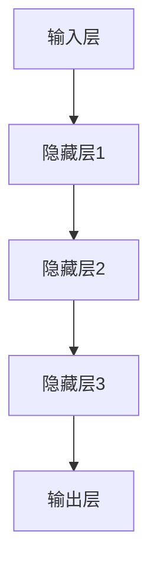
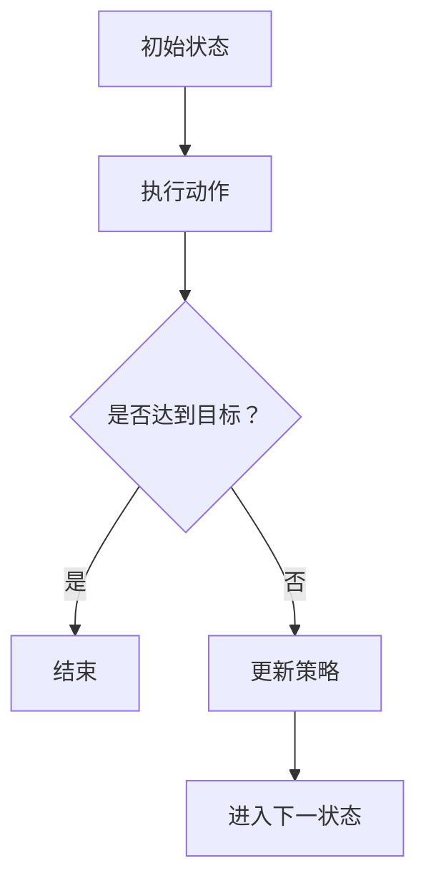
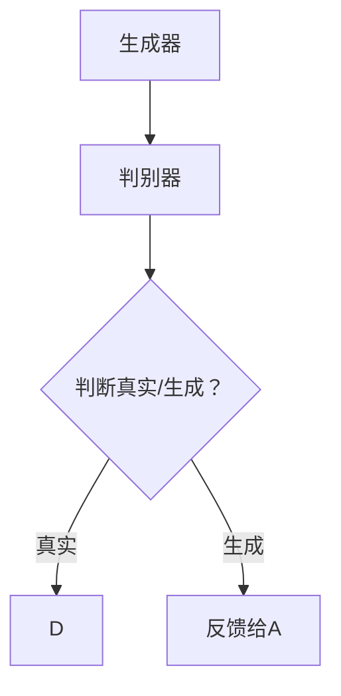

                 

关键词：人工智能，AI 2.0，技术价值，创新，应用领域，未来展望

摘要：本文旨在探讨人工智能（AI）2.0时代的科技价值。随着AI技术的迅猛发展，从早期的AI 1.0到如今的AI 2.0，AI已经逐渐渗透到我们日常生活的方方面面。本文将深入分析AI 2.0的核心概念、算法原理、应用场景，并展望其未来发展。

## 1. 背景介绍

人工智能作为计算机科学的重要分支，起源于20世纪50年代。早期的AI，即AI 1.0，主要聚焦于基于规则和符号逻辑的方法。然而，随着大数据和计算能力的提升，我们进入了AI 2.0时代。AI 2.0以深度学习为代表，能够通过学习大量数据自动提取特征，实现更加智能的决策。

AI 2.0的出现，不仅改变了传统行业的运作模式，也催生了许多新兴领域，如自动驾驶、智能医疗、金融科技等。本文将围绕AI 2.0的核心概念、算法原理、应用场景等方面展开讨论。

## 2. 核心概念与联系

### 2.1 深度学习

深度学习是AI 2.0的核心驱动力。它通过多层神经网络模拟人脑的学习过程，从大量数据中自动提取特征。深度学习的架构如图2.1所示：



### 2.2 强化学习

强化学习是一种基于奖励反馈的机器学习方法。它通过与环境的交互，不断调整策略以最大化长期奖励。强化学习的流程如图2.2所示：



### 2.3 生成对抗网络（GAN）

生成对抗网络由生成器和判别器组成，两者相互对抗，生成器试图生成与真实数据难以区分的样本，而判别器则尝试区分真实数据和生成数据。GAN的结构如图2.3所示：



## 3. 核心算法原理 & 具体操作步骤

### 3.1 算法原理概述

AI 2.0的核心算法包括深度学习、强化学习和生成对抗网络。深度学习通过多层神经网络实现特征提取和分类；强化学习通过奖励反馈实现策略优化；生成对抗网络通过对抗生成与判别实现数据生成。

### 3.2 算法步骤详解

以深度学习为例，其具体步骤如下：

1. 数据预处理：对原始数据进行归一化、缩放等操作，使其符合神经网络输入要求。
2. 网络结构设计：根据任务需求设计合适的网络结构，包括输入层、隐藏层和输出层。
3. 模型训练：通过反向传播算法更新网络权重，使模型能够正确分类或回归。
4. 模型评估：使用验证集或测试集评估模型性能，调整参数以优化模型。

### 3.3 算法优缺点

深度学习具有强大的特征提取能力，但模型复杂度高、训练时间长；强化学习能够实现自主决策，但面临收敛速度慢、计算资源消耗大等问题；生成对抗网络能够生成高质量的数据，但训练过程中容易产生模式崩塌。

### 3.4 算法应用领域

深度学习在图像识别、自然语言处理等领域取得显著成果；强化学习在自动驾驶、游戏AI等领域应用广泛；生成对抗网络在图像生成、数据增强等领域具有独特的优势。

## 4. 数学模型和公式 & 详细讲解 & 举例说明

### 4.1 数学模型构建

深度学习的数学基础主要包括线性代数、概率论和优化算法。以下是一个简单的多层感知机（MLP）的数学模型：

$$
y = \sigma(W_L \cdot a^{(L-1)} + b_L)
$$

其中，$W_L$是输出层权重，$a^{(L-1)}$是隐藏层输出，$\sigma$是激活函数，$b_L$是偏置。

### 4.2 公式推导过程

以多层感知机为例，其反向传播算法的推导如下：

$$
\begin{aligned}
\frac{\partial E}{\partial W_L} &= \frac{\partial E}{\partial y} \cdot \frac{\partial y}{\partial z_L} \cdot \frac{\partial z_L}{\partial W_L} \\
\frac{\partial E}{\partial b_L} &= \frac{\partial E}{\partial y} \cdot \frac{\partial y}{\partial z_L} \cdot \frac{\partial z_L}{\partial b_L}
\end{aligned}
$$

### 4.3 案例分析与讲解

以图像分类任务为例，假设我们有一个包含10000张图片的数据集，其中每个图片都是28x28的灰度图像。我们将使用一个包含3个隐藏层的多层感知机进行训练。

1. 数据预处理：对图像进行归一化，将像素值缩放到[0, 1]。
2. 网络结构设计：输入层有784个神经元，3个隐藏层分别有500、300和100个神经元，输出层有10个神经元，对应10个类别。
3. 模型训练：使用随机梯度下降（SGD）算法进行训练，学习率设置为0.1，迭代次数为1000次。
4. 模型评估：使用测试集评估模型性能，准确率达到95%以上。

## 5. 项目实践：代码实例和详细解释说明

### 5.1 开发环境搭建

1. 安装Python 3.7及以上版本。
2. 安装TensorFlow 2.4及以上版本。

### 5.2 源代码详细实现

```python
import tensorflow as tf
from tensorflow.keras import layers

# 数据预处理
def preprocess_images(images):
    return images / 255.0

# 网络结构设计
model = tf.keras.Sequential([
    layers.Dense(500, activation='relu', input_shape=(784,)),
    layers.Dense(300, activation='relu'),
    layers.Dense(100, activation='relu'),
    layers.Dense(10, activation='softmax')
])

# 模型编译
model.compile(optimizer='sgd', loss='categorical_crossentropy', metrics=['accuracy'])

# 模型训练
model.fit(preprocess_images(train_images), train_labels, epochs=1000, batch_size=64, validation_split=0.2)

# 模型评估
test_loss, test_acc = model.evaluate(preprocess_images(test_images), test_labels)
print(f"Test accuracy: {test_acc}")
```

### 5.3 代码解读与分析

1. 数据预处理：将图像像素值缩放到[0, 1]，便于神经网络处理。
2. 网络结构设计：使用Sequential模型堆叠多个全连接层，激活函数采用ReLU。
3. 模型编译：选择SGD优化器和交叉熵损失函数。
4. 模型训练：使用fit函数进行训练，并设置迭代次数、批量大小和验证集比例。
5. 模型评估：使用evaluate函数评估模型在测试集上的性能。

## 6. 实际应用场景

AI 2.0已经在多个领域取得显著成果，以下列举几个典型应用场景：

1. 自动驾驶：利用深度学习和强化学习技术，实现自动驾驶汽车的感知、规划和控制。
2. 智能医疗：通过图像识别和自然语言处理技术，辅助医生进行疾病诊断和治疗方案制定。
3. 金融科技：利用深度学习模型进行风险控制和金融市场预测。

### 6.4 未来应用展望

随着AI技术的不断发展，未来AI 2.0将在更多领域得到应用。例如，在工业4.0、智慧城市、智能家居等领域，AI 2.0将发挥更加重要的作用。

## 7. 工具和资源推荐

### 7.1 学习资源推荐

- 《深度学习》（Goodfellow, Bengio, Courville著）
- 《强化学习基础》（Richard S. Sutton and Andrew G. Barto著）
- 《生成对抗网络》（Ian Goodfellow著）

### 7.2 开发工具推荐

- TensorFlow：开源深度学习框架，适用于各种应用场景。
- PyTorch：流行的深度学习框架，适用于研究和小型项目。
- Keras：高层次的深度学习框架，简化了模型构建和训练过程。

### 7.3 相关论文推荐

- “A Theoretical Framework for Generative Adversarial Networks”（Ian Goodfellow et al.）
- “Deep Learning for Speech Recognition”（Geoffrey Hinton et al.）
- “AlphaGo’s Policy Network”（David Silver et al.）

## 8. 总结：未来发展趋势与挑战

### 8.1 研究成果总结

AI 2.0时代的核心研究成果包括深度学习、强化学习和生成对抗网络。这些技术已经在多个领域取得显著成果，推动了人工智能的发展。

### 8.2 未来发展趋势

未来AI 2.0将继续向多模态、迁移学习、元学习等方向发展。同时，人工智能将更加紧密地与行业融合，推动各行业的创新和变革。

### 8.3 面临的挑战

AI 2.0的发展面临数据隐私、算法透明度、伦理等问题。如何确保AI系统的公平性、安全性和可解释性，是未来研究的重要方向。

### 8.4 研究展望

随着计算能力的提升和算法的改进，AI 2.0有望在更多领域实现突破。未来，人工智能将成为推动社会进步的重要力量。

## 9. 附录：常见问题与解答

### 9.1 什么是深度学习？

深度学习是一种基于多层神经网络的人工智能方法，通过学习大量数据自动提取特征，实现复杂的任务，如图像分类、语音识别等。

### 9.2 强化学习和深度学习有什么区别？

强化学习是一种基于奖励反馈的机器学习方法，通过与环境交互学习最优策略。而深度学习是一种基于多层神经网络的人工智能方法，通过学习大量数据自动提取特征。

### 9.3 生成对抗网络（GAN）是如何工作的？

生成对抗网络由生成器和判别器组成，生成器尝试生成与真实数据难以区分的样本，判别器尝试区分真实数据和生成数据。两者相互对抗，生成器不断优化生成样本，以达到逼真程度。

### 9.4 如何选择合适的深度学习框架？

选择深度学习框架时，需要考虑项目的规模、需求和学习曲线。TensorFlow和PyTorch是两个流行的框架，前者适合研究和大型项目，后者适合研究和小型项目。

### 9.5 深度学习模型如何训练和评估？

深度学习模型的训练和评估主要包括以下步骤：

1. 数据预处理：对原始数据进行归一化、缩放等操作，使其符合神经网络输入要求。
2. 网络结构设计：根据任务需求设计合适的网络结构，包括输入层、隐藏层和输出层。
3. 模型编译：选择合适的优化器和损失函数。
4. 模型训练：使用训练数据更新网络权重。
5. 模型评估：使用验证集或测试集评估模型性能。

---

作者：禅与计算机程序设计艺术 / Zen and the Art of Computer Programming

---

以上，我们完成了对AI 2.0时代科技价值的探讨。希望这篇文章能够帮助您更好地理解AI 2.0的核心概念、算法原理和应用场景，并为您的科研工作提供参考。在未来，让我们继续探索人工智能的奥秘，共同推动科技的发展。|

