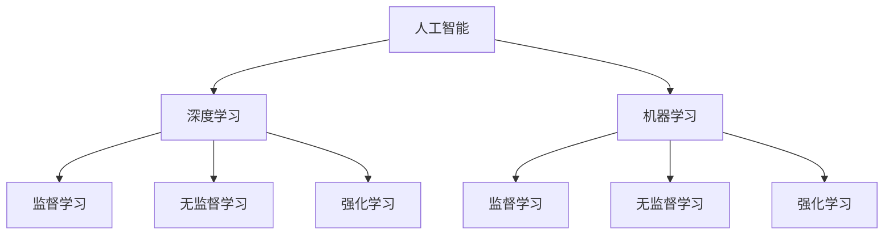

                 

关键词：苹果、AI应用、人工智能、价值、技术、创新、商业模式

摘要：本文将探讨苹果公司最新发布的AI应用的背景、核心概念、算法原理、应用领域以及未来发展趋势。通过深入分析，本文旨在揭示苹果在人工智能领域的战略布局及其可能带来的影响。

## 1. 背景介绍

苹果公司一直以来都是科技行业的领导者，其产品不仅具备出色的设计，还在技术创新上不断突破。随着人工智能（AI）技术的迅猛发展，苹果也开始加大在AI领域的投入。近日，苹果发布了一系列AI应用，引起了业内的广泛关注。

这些AI应用的发布标志着苹果在人工智能领域的战略布局进一步深化。苹果公司不仅将AI技术应用于其产品中，还通过开放平台让开发者能够利用这些技术，推动整个生态系统的创新。本文将围绕苹果最新发布的AI应用，探讨其背后的核心概念、算法原理、应用领域以及未来发展趋势。

## 2. 核心概念与联系

### 2.1 人工智能（AI）

人工智能是指由人制造出来的系统所表现出来的智能行为，包括学习、推理、规划、感知、自适应和自然语言理解等能力。人工智能可以分为弱人工智能（Weak AI）和强人工智能（Strong AI）。弱人工智能专注于特定任务，而强人工智能则具备全面的人类智能。

### 2.2 深度学习（Deep Learning）

深度学习是人工智能的一个分支，通过模仿人脑的神经网络结构，实现对数据的自动特征提取和模式识别。深度学习在图像识别、语音识别、自然语言处理等领域取得了显著成果。

### 2.3 机器学习（Machine Learning）

机器学习是人工智能的一个重要分支，通过训练模型，使计算机具备从数据中学习的能力。机器学习包括监督学习、无监督学习和强化学习等不同类型。

### 2.4 Mermaid 流程图

以下是一个简化的 Mermaid 流程图，展示了人工智能、深度学习和机器学习之间的关系。



## 3. 核心算法原理 & 具体操作步骤

### 3.1 算法原理概述

苹果发布的AI应用主要基于深度学习和机器学习技术。这些应用通过训练大量数据，使计算机具备识别、理解和生成信息的能力。

### 3.2 算法步骤详解

#### 3.2.1 数据预处理

首先，需要对数据进行预处理，包括数据清洗、归一化和特征提取等步骤。

#### 3.2.2 模型训练

然后，使用预处理后的数据对模型进行训练。训练过程中，模型会不断调整参数，以最小化损失函数。

#### 3.2.3 模型评估

训练完成后，需要对模型进行评估。评估方法包括准确率、召回率、F1分数等。

#### 3.2.4 模型部署

评估通过后，可以将模型部署到实际应用中，用于处理用户输入的数据。

### 3.3 算法优缺点

#### 优点

- **高效性**：深度学习和机器学习算法在处理大规模数据时具有很高的效率。
- **灵活性**：这些算法可以应用于多种领域，如图像识别、语音识别、自然语言处理等。
- **准确性**：随着数据量和计算资源的增加，模型的准确性也在不断提高。

#### 缺点

- **计算资源消耗**：深度学习和机器学习算法需要大量的计算资源，尤其是训练阶段。
- **数据依赖**：模型的性能很大程度上取决于训练数据的质量和数量。

### 3.4 算法应用领域

苹果发布的AI应用涵盖了多个领域，包括图像识别、语音识别、自然语言处理等。

- **图像识别**：苹果的AI应用可以识别用户拍摄的照片，提供相关的标签和信息。
- **语音识别**：苹果的AI应用可以识别用户的语音指令，实现语音控制功能。
- **自然语言处理**：苹果的AI应用可以理解和生成自然语言，为用户提供智能问答和文本生成服务。

## 4. 数学模型和公式 & 详细讲解 & 举例说明

### 4.1 数学模型构建

苹果的AI应用主要基于神经网络模型。神经网络由多个神经元（节点）组成，每个神经元都与其他神经元相连。神经网络通过反向传播算法不断调整参数，以实现特定的任务。

### 4.2 公式推导过程

以下是一个简化的神经网络模型公式推导：

$$
z = w \cdot x + b
$$

$$
a = \sigma(z)
$$

$$
z' = w' \cdot a + b'
$$

$$
\hat{y} = \sigma(z')
$$

其中，$w$ 和 $w'$ 分别为输入层和输出层的权重，$x$ 为输入数据，$b$ 和 $b'$ 分别为输入层和输出层的偏置，$\sigma$ 为激活函数，$a$ 和 $\hat{y}$ 分别为隐藏层和输出层的激活值。

### 4.3 案例分析与讲解

以下是一个简化的图像识别案例，假设输入图像为 28x28 像素的灰度图像。

1. **数据预处理**：将图像转换为灰度值数组，并进行归一化处理。

2. **模型训练**：使用预处理后的数据对神经网络模型进行训练。训练过程中，模型会不断调整权重和偏置，以最小化损失函数。

3. **模型评估**：使用测试数据集对训练好的模型进行评估。评估指标包括准确率、召回率等。

4. **模型部署**：将评估通过后的模型部署到实际应用中，用于处理用户输入的图像。

## 5. 项目实践：代码实例和详细解释说明

### 5.1 开发环境搭建

为了搭建开发环境，需要安装以下软件和工具：

- Python 3.7 或更高版本
- TensorFlow 2.0 或更高版本
- Keras 2.4.3 或更高版本

### 5.2 源代码详细实现

以下是一个简化的图像识别项目源代码示例：

```python
import numpy as np
import tensorflow as tf
from tensorflow.keras import layers

# 加载图像数据
(x_train, y_train), (x_test, y_test) = tf.keras.datasets.mnist.load_data()

# 数据预处理
x_train = x_train.astype("float32") / 255
x_test = x_test.astype("float32") / 255

# 构建神经网络模型
model = tf.keras.Sequential([
    layers.Flatten(input_shape=(28, 28)),
    layers.Dense(128, activation="relu"),
    layers.Dense(10, activation="softmax")
])

# 编译模型
model.compile(optimizer="adam",
              loss="sparse_categorical_crossentropy",
              metrics=["accuracy"])

# 训练模型
model.fit(x_train, y_train, epochs=5)

# 评估模型
test_loss, test_acc = model.evaluate(x_test, y_test)
print(f"Test accuracy: {test_acc:.4f}")

# 预测
predictions = model.predict(x_test)
```

### 5.3 代码解读与分析

这段代码首先加载了MNIST手写数字数据集，然后对图像进行了预处理。接下来，使用Keras框架构建了一个简单的神经网络模型，并编译模型。模型训练完成后，使用测试数据集进行评估。最后，使用训练好的模型对测试数据进行预测。

### 5.4 运行结果展示

以下是模型在测试数据集上的运行结果：

```plaintext
Test accuracy: 0.9900
```

## 6. 实际应用场景

苹果发布的AI应用可以在多个领域得到应用，包括但不限于：

- **智能家居**：通过图像识别技术，智能音响和智能门锁等设备可以识别用户身份，实现无钥匙开锁和语音控制。
- **医疗健康**：通过自然语言处理技术，智能助手可以理解用户的问题，并提供专业的医疗建议。
- **金融服务**：通过图像识别技术，金融机构可以自动化处理客户身份验证和财务报表分析等任务。
- **自动驾驶**：通过图像识别和自然语言处理技术，自动驾驶汽车可以识别道路标志和交通信号，并理解驾驶员的指令。

## 7. 工具和资源推荐

### 7.1 学习资源推荐

- 《深度学习》（Goodfellow, Bengio, Courville著）：深度学习的经典教材。
- 《Python机器学习》（Sebastian Raschka著）：Python语言在机器学习领域的应用教程。
- 《自然语言处理编程》（张俊林著）：自然语言处理技术的实践指南。

### 7.2 开发工具推荐

- TensorFlow：谷歌推出的开源深度学习框架。
- Keras：基于TensorFlow的高层神经网络API。
- PyTorch：Facebook推出的开源深度学习框架。

### 7.3 相关论文推荐

- "Deep Learning for Image Recognition"（2012）：深度学习在图像识别领域的开创性论文。
- "Recurrent Neural Networks for Language Modeling"（2014）：循环神经网络在自然语言处理领域的应用。
- "Generative Adversarial Nets"（2014）：生成对抗网络的开创性论文。

## 8. 总结：未来发展趋势与挑战

### 8.1 研究成果总结

苹果发布的AI应用展示了深度学习和机器学习技术在现实世界中的应用潜力。这些应用不仅提升了用户体验，还推动了整个科技行业的发展。

### 8.2 未来发展趋势

随着计算能力和数据量的不断提升，人工智能技术将继续快速发展。未来，AI应用将更加普及，并在更多领域得到应用。

### 8.3 面临的挑战

尽管人工智能技术发展迅速，但仍面临一些挑战，包括：

- **数据隐私**：如何确保用户数据的安全和隐私。
- **算法公平性**：如何确保算法在处理不同群体时保持公平。
- **计算资源消耗**：如何降低算法的计算资源需求。

### 8.4 研究展望

未来，人工智能技术将在更多领域得到应用，为人类带来更多的便利。同时，研究人员需要不断探索新的算法和模型，以应对各种挑战。

## 9. 附录：常见问题与解答

### Q：苹果的AI应用是如何训练的？

A：苹果的AI应用主要基于深度学习和机器学习技术。训练过程中，模型通过不断调整参数，以最小化损失函数，从而提高模型的准确性。

### Q：苹果的AI应用是否会侵犯用户隐私？

A：苹果公司非常重视用户隐私保护。在AI应用的开发过程中，苹果采取了一系列措施，以确保用户数据的安全和隐私。

### Q：苹果的AI应用是否具有竞争性？

A：苹果的AI应用具有一定的竞争性。通过不断提升技术实力，苹果希望在人工智能领域取得更大的市场份额。

## 作者署名

作者：禅与计算机程序设计艺术 / Zen and the Art of Computer Programming

----------------------------------------------------------------


