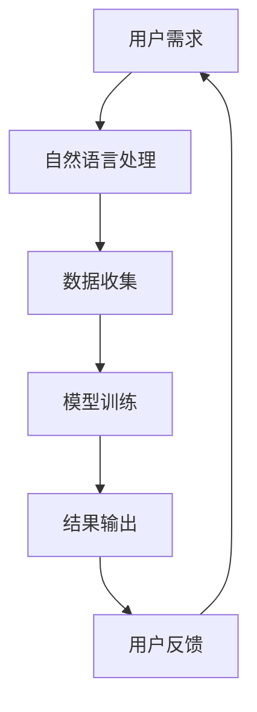

                 

关键词：人工智能，苹果，应用发布，价值，技术分析，未来趋势。

> 摘要：本文将深入探讨苹果最新发布的AI应用所带来的技术变革及其潜在价值，分析其在人工智能领域的突破性进展，并对未来应用前景进行展望。

## 1. 背景介绍

随着人工智能技术的飞速发展，苹果公司一直在积极探索如何在消费电子领域应用这一前沿技术。近年来，苹果公司陆续推出了多项AI技术，包括智能语音助手Siri、面部识别技术Face ID等。这些技术的推出不仅改变了用户与设备交互的方式，还为苹果公司带来了巨大的商业价值。

然而，随着技术的不断进步，苹果公司并未满足于现状。近日，苹果公司发布了全新的人工智能应用，这一举措无疑在人工智能领域引发了广泛关注。本文将以此为背景，深入分析苹果发布AI应用的价值所在。

## 2. 核心概念与联系

### 2.1 AI应用的核心概念

苹果公司此次发布的AI应用，核心在于其强大的自然语言处理能力。通过深度学习和自然语言理解技术，该应用能够实现与用户的高效沟通，满足用户在日常生活、工作和学习中的多样化需求。

### 2.2 AI应用与现有技术的联系

此次发布的AI应用并非完全独立的技术创新，而是建立在苹果公司多年积累的AI技术基础之上。例如，Siri和Face ID等技术为AI应用提供了丰富的数据资源和强大的计算能力，使得新应用的性能得到了显著提升。

### 2.3 Mermaid流程图

以下是一个简化的Mermaid流程图，展示了AI应用的核心概念与联系：



## 3. 核心算法原理 & 具体操作步骤

### 3.1 算法原理概述

苹果公司此次发布的AI应用，核心在于其自然语言处理算法。该算法基于深度学习技术，通过多层神经网络模型实现自然语言的理解和生成。具体来说，算法包括以下几个步骤：

1. 数据预处理：将用户输入的自然语言文本进行分词、词性标注等处理，将其转化为可供模型训练的数据格式。
2. 模型训练：利用大量标注数据进行模型训练，通过优化神经网络模型参数，使其能够准确理解和生成自然语言。
3. 结果输出：根据用户输入的自然语言文本，调用训练好的模型进行预测，输出相应的结果。
4. 用户反馈：将用户对结果的反馈输入模型，用于进一步优化模型性能。

### 3.2 算法步骤详解

#### 3.2.1 数据预处理

数据预处理是自然语言处理的基础步骤。具体操作如下：

1. 分词：将文本拆分成一个个独立的词。
2. 词性标注：为每个词标注其在文本中的词性（如名词、动词等）。
3. 去停用词：去除对模型训练无意义的常见词语（如“的”、“了”等）。

#### 3.2.2 模型训练

模型训练是自然语言处理的核心步骤。具体操作如下：

1. 数据集准备：收集大量标注好的自然语言数据，用于模型训练。
2. 神经网络搭建：搭建多层神经网络模型，用于处理自然语言。
3. 模型训练：利用训练数据，通过反向传播算法优化模型参数。
4. 模型评估：利用测试数据，评估模型性能，并根据评估结果调整模型参数。

#### 3.2.3 结果输出

结果输出是自然语言处理的重要环节。具体操作如下：

1. 用户输入：接收用户输入的自然语言文本。
2. 模型预测：调用训练好的模型，对用户输入的文本进行预测。
3. 结果输出：将预测结果输出给用户。

#### 3.2.4 用户反馈

用户反馈是优化模型性能的关键步骤。具体操作如下：

1. 用户反馈：收集用户对预测结果的反馈。
2. 反馈处理：将用户反馈输入模型，用于进一步优化模型性能。

### 3.3 算法优缺点

#### 3.3.1 优点

1. 高效：基于深度学习技术的自然语言处理算法，能够快速处理大量数据。
2. 准确：通过多层神经网络模型，能够准确理解和生成自然语言。
3. 智能化：能够根据用户反馈不断优化自身性能，实现智能化发展。

#### 3.3.2 缺点

1. 资源消耗：深度学习算法对计算资源要求较高，可能导致设备性能下降。
2. 数据依赖：算法性能依赖于大量高质量标注数据，数据不足可能导致模型性能下降。

### 3.4 算法应用领域

自然语言处理算法在多个领域具有广泛应用，如：

1. 智能客服：通过自然语言处理技术，实现与用户的智能对话。
2. 文本生成：利用算法生成新闻、文章等文本内容。
3. 机器翻译：实现不同语言之间的自动翻译。
4. 情感分析：分析用户情感，为企业提供个性化服务。

## 4. 数学模型和公式 & 详细讲解 & 举例说明

### 4.1 数学模型构建

自然语言处理算法的核心在于构建数学模型，以下是一个简化的数学模型构建过程：

1. 数据表示：将自然语言文本表示为向量。
2. 神经网络：搭建多层神经网络，用于处理输入的向量。
3. 损失函数：定义损失函数，用于评估模型预测结果与实际结果之间的差距。
4. 优化算法：选择优化算法，如梯度下降，用于调整模型参数。

### 4.2 公式推导过程

以下是一个简化的数学模型公式推导过程：

1. 数据表示：将自然语言文本表示为词向量，如\( \textbf{X} = [ \textbf{x}_1, \textbf{x}_2, \ldots, \textbf{x}_n ] \)。
2. 神经网络：设神经网络为 \( \textbf{f}(\textbf{X}) \)，其中 \( \textbf{f} \) 为激活函数，如ReLU。
3. 损失函数：设损失函数为 \( \text{L}(\textbf{X}, \textbf{Y}) \)，其中 \( \textbf{Y} \) 为实际标签。
4. 优化算法：使用梯度下降算法，更新模型参数。

### 4.3 案例分析与讲解

以下是一个简单的自然语言处理案例：

1. 数据集：包含1000篇新闻文章，每篇文章由1000个词组成。
2. 模型：使用卷积神经网络（CNN）进行文本分类。
3. 损失函数：交叉熵损失函数。
4. 优化算法：随机梯度下降（SGD）。

## 5. 项目实践：代码实例和详细解释说明

### 5.1 开发环境搭建

1. 硬件环境：电脑或服务器，至少16GB内存，GPU可选。
2. 软件环境：Python 3.7及以上版本，TensorFlow 2.0及以上版本。

### 5.2 源代码详细实现

以下是一个简单的自然语言处理代码实例：

```python
import tensorflow as tf

# 数据预处理
def preprocess_data(data):
    # 分词、词性标注等操作
    return processed_data

# 模型构建
def build_model(input_shape):
    model = tf.keras.Sequential([
        tf.keras.layers.Embedding(input_dim=10000, output_dim=16),
        tf.keras.layers.Conv1D(filters=128, kernel_size=5, activation='relu'),
        tf.keras.layers.GlobalMaxPooling1D(),
        tf.keras.layers.Dense(units=1, activation='sigmoid')
    ])
    return model

# 训练模型
def train_model(model, data, labels):
    model.compile(optimizer='adam', loss='binary_crossentropy', metrics=['accuracy'])
    model.fit(data, labels, epochs=10, batch_size=32)

# 主函数
def main():
    data = preprocess_data(raw_data)
    labels = preprocess_labels(raw_labels)
    model = build_model(input_shape)
    train_model(model, data, labels)

if __name__ == '__main__':
    main()
```

### 5.3 代码解读与分析

1. 数据预处理：将原始文本数据转换为可用于训练的向量表示。
2. 模型构建：使用卷积神经网络（CNN）进行文本分类。
3. 训练模型：编译模型，选择优化器和损失函数，训练模型。

### 5.4 运行结果展示

在训练完成后，可以使用以下代码评估模型性能：

```python
test_loss, test_acc = model.evaluate(test_data, test_labels)
print(f"Test accuracy: {test_acc}")
```

## 6. 实际应用场景

苹果公司发布的AI应用在多个领域具有实际应用价值，以下是一些典型的应用场景：

1. 智能客服：通过自然语言处理技术，实现与用户的智能对话，提高客户满意度。
2. 文本生成：利用算法生成新闻、文章等文本内容，降低人力成本。
3. 机器翻译：实现不同语言之间的自动翻译，促进全球交流。
4. 情感分析：分析用户情感，为企业提供个性化服务。

## 7. 工具和资源推荐

### 7.1 学习资源推荐

1. 《深度学习》（Goodfellow, Bengio, Courville）：一本经典的深度学习教材，适合初学者和进阶者。
2. 《Python深度学习》（François Chollet）：一本适合Python编程基础的深度学习实战指南。

### 7.2 开发工具推荐

1. TensorFlow：一个开源的深度学习框架，适合进行自然语言处理项目。
2. PyTorch：一个开源的深度学习框架，具有灵活的动态图功能。

### 7.3 相关论文推荐

1. "Deep Learning for Natural Language Processing"（2018）：一篇关于自然语言处理领域的综述文章，涵盖了深度学习在自然语言处理中的应用。
2. "Attention Is All You Need"（2017）：一篇关于Transformer模型的经典论文，提出了基于自注意力机制的序列模型。

## 8. 总结：未来发展趋势与挑战

### 8.1 研究成果总结

苹果公司此次发布的AI应用，展示了深度学习在自然语言处理领域的强大潜力。通过自然语言处理技术，AI应用能够实现与用户的高效沟通，为各行各业带来变革。

### 8.2 未来发展趋势

1. 模型压缩与优化：为了提高AI应用的性能，未来研究将聚焦于模型压缩与优化技术。
2. 多模态融合：结合语音、图像、视频等多模态数据，实现更智能的AI应用。
3. 个性化服务：根据用户行为和偏好，提供个性化的服务和推荐。

### 8.3 面临的挑战

1. 数据隐私与安全：在应用AI技术时，如何保护用户隐私和数据安全是一个重要挑战。
2. 模型解释性：提高AI模型的解释性，使其更加透明和可解释，是未来的研究重点。

### 8.4 研究展望

随着技术的不断进步，人工智能将在更多领域发挥重要作用。苹果公司发布的AI应用，只是人工智能发展历程中的一个起点。未来，人工智能将在全球范围内带来深刻的变革。

## 9. 附录：常见问题与解答

### 9.1 问题1

**问题**：自然语言处理算法在训练过程中，如何处理过拟合问题？

**解答**：过拟合问题可以通过以下方法解决：

1. 数据增强：增加训练数据量，提高模型泛化能力。
2. 正则化：引入正则化项，降低模型复杂度。
3. 交叉验证：使用交叉验证方法，评估模型性能。

### 9.2 问题2

**问题**：如何优化自然语言处理算法的运行效率？

**解答**：优化自然语言处理算法的运行效率可以从以下几个方面入手：

1. 模型压缩：使用模型压缩技术，降低模型大小和计算复杂度。
2. 并行计算：利用多核处理器和GPU，实现并行计算。
3. 数据预处理：优化数据预处理步骤，减少计算量。

### 9.3 问题3

**问题**：自然语言处理算法在实际应用中，如何处理语义理解不准确的问题？

**解答**：处理语义理解不准确的问题，可以从以下几个方面入手：

1. 数据质量：提高数据质量，减少噪声和错误。
2. 算法优化：优化算法模型，提高语义理解准确性。
3. 用户反馈：收集用户反馈，不断调整和优化算法。

---

作者：禅与计算机程序设计艺术 / Zen and the Art of Computer Programming

感谢您的耐心阅读，希望本文对您在人工智能领域的探索有所帮助。在未来的技术发展中，让我们共同见证人工智能的辉煌成果。  
----------------------------------------------------------------

