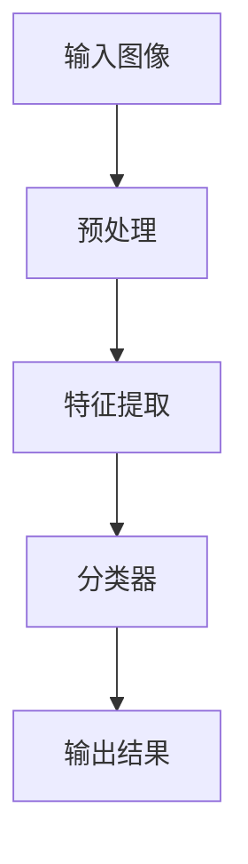
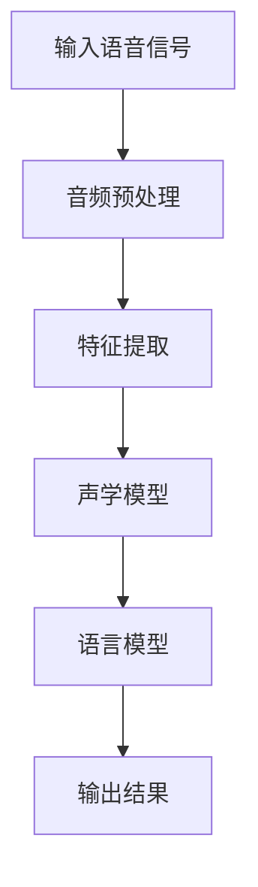
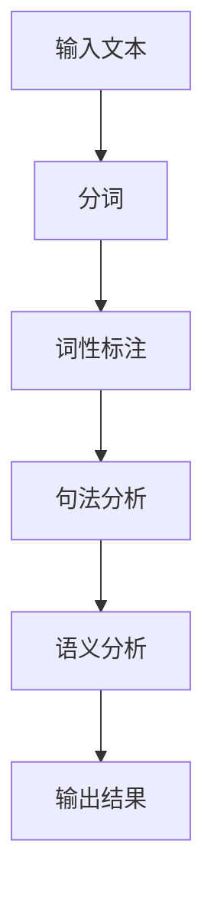

                 

关键词：苹果，AI应用，AI技术，应用场景，未来展望

摘要：本文将探讨苹果公司在人工智能领域的最新进展，特别是其发布的一系列AI应用。我们将分析这些应用的背景、核心算法原理、应用场景以及未来发展趋势。通过深入解读苹果的AI应用，我们将揭示人工智能技术的潜力和挑战，为行业从业者提供有价值的参考。

## 1. 背景介绍

随着人工智能技术的迅猛发展，各行各业都在积极探索AI技术的应用。苹果公司作为全球科技巨头，自然不甘落后。近年来，苹果在AI领域投入了大量的研发资源，推出了多个AI应用，旨在为用户提供更智能、更便捷的体验。

苹果的AI应用主要集中在图像识别、语音识别、自然语言处理等领域。这些应用不仅提升了苹果产品的性能，还极大地丰富了用户体验。例如，苹果的智能助理Siri和照片应用中的智能标签功能，都离不开强大的AI技术支持。

## 2. 核心概念与联系

### 2.1. 图像识别

图像识别是人工智能领域的一个重要分支。通过计算机算法对图像进行分析和处理，识别出图像中的物体、场景等信息。苹果在图像识别领域取得了显著成果，其图像识别算法在准确性和速度方面都处于行业领先地位。

下面是一个简化的图像识别流程：



### 2.2. 语音识别

语音识别是将语音信号转换为文本的技术。苹果的语音识别技术采用了深度学习算法，能够准确识别用户的声音，并实现实时翻译、语音指令等功能。

下面是一个简化的语音识别流程：



### 2.3. 自然语言处理

自然语言处理（NLP）是人工智能领域的一个重要分支，旨在使计算机能够理解和处理人类语言。苹果的NLP技术主要应用于智能助理Siri、智能搜索等场景，为用户提供更加智能的服务。

下面是一个简化的NLP流程：



## 3. 核心算法原理 & 具体操作步骤

### 3.1. 算法原理概述

苹果的AI应用主要基于深度学习技术。深度学习是一种模拟人脑神经网络结构的机器学习算法，通过多层次的神经网络对输入数据进行处理，从而实现分类、识别等任务。

### 3.2. 算法步骤详解

#### 3.2.1. 数据收集与预处理

首先，需要对大量的图像、语音和文本数据进行收集。然后，对数据进行预处理，包括去噪、标准化等步骤，以提高数据质量。

#### 3.2.2. 构建神经网络模型

根据具体应用需求，设计合适的神经网络模型。苹果采用了卷积神经网络（CNN）和循环神经网络（RNN）等经典模型，并在此基础上进行改进和优化。

#### 3.2.3. 训练与优化模型

使用预处理后的数据对神经网络模型进行训练。在训练过程中，通过不断调整模型参数，优化模型性能。

#### 3.2.4. 部署与实时应用

将训练好的模型部署到产品中，实现实时应用。例如，苹果的智能助理Siri就是基于训练好的语音识别和自然语言处理模型。

### 3.3. 算法优缺点

#### 3.3.1. 优点

- 高准确性：深度学习模型在图像识别、语音识别等领域具有很高的准确性。
- 自动化：深度学习模型可以自动从大量数据中学习特征，减少人工干预。
- 泛化能力强：深度学习模型可以应用于不同的领域和任务，具有很好的泛化能力。

#### 3.3.2. 缺点

- 计算资源消耗大：深度学习模型需要大量的计算资源，对硬件要求较高。
- 数据依赖性强：深度学习模型的性能很大程度上依赖于数据质量，数据量不足或质量差可能导致模型性能下降。

### 3.4. 算法应用领域

苹果的AI应用广泛应用于图像识别、语音识别、自然语言处理等领域，如智能助理Siri、照片应用中的智能标签功能等。

## 4. 数学模型和公式 & 详细讲解 & 举例说明

### 4.1. 数学模型构建

苹果的AI应用主要基于深度学习模型，其核心是神经网络。神经网络由多个神经元组成，每个神经元都是一个简单的函数，通过加权连接形成复杂的网络结构。

下面是一个简单的神经网络模型：

$$
f(x) = \sigma(\sum_{i=1}^{n} w_i \cdot x_i + b)
$$

其中，$x_i$ 是输入特征，$w_i$ 是权重，$b$ 是偏置，$\sigma$ 是激活函数。

### 4.2. 公式推导过程

深度学习模型的训练过程可以分为以下几个步骤：

#### 4.2.1. 前向传播

在前向传播过程中，将输入数据通过神经网络逐层计算，得到输出结果。假设神经网络有 $L$ 层，输入为 $x_1, x_2, ..., x_L$，输出为 $y_1, y_2, ..., y_L$，则：

$$
y_l = \sigma(\sum_{i=1}^{n} w_i \cdot x_i + b)
$$

#### 4.2.2. 反向传播

在反向传播过程中，根据输出结果与真实值的差异，计算每个神经元的误差，并反向传播误差，调整模型参数。

#### 4.2.3. 梯度下降

通过梯度下降算法，根据误差计算模型参数的梯度，并沿着梯度的反方向调整参数，以最小化误差。

$$
\Delta w_i = -\alpha \cdot \frac{\partial J}{\partial w_i}
$$

其中，$J$ 是损失函数，$\alpha$ 是学习率。

### 4.3. 案例分析与讲解

以图像识别为例，假设我们需要识别一张图片中的猫。首先，将图片进行预处理，提取出关键特征。然后，将这些特征输入到神经网络模型中，通过多层神经网络计算，最终得到分类结果。

假设输入特征为 $x_1, x_2, ..., x_n$，输出结果为 $y_1, y_2, ..., y_n$，真实标签为 $t_1, t_2, ..., t_n$。则损失函数为：

$$
J = \frac{1}{2} \sum_{i=1}^{n} (y_i - t_i)^2
$$

通过反向传播和梯度下降，不断调整模型参数，直至损失函数最小。

## 5. 项目实践：代码实例和详细解释说明

### 5.1. 开发环境搭建

为了更好地理解苹果的AI应用，我们可以使用Python语言实现一个简单的图像识别模型。首先，需要安装必要的库，如TensorFlow、NumPy等。

```python
pip install tensorflow numpy
```

### 5.2. 源代码详细实现

下面是一个简单的图像识别模型实现：

```python
import tensorflow as tf
import numpy as np

# 创建一个简单的神经网络模型
model = tf.keras.Sequential([
    tf.keras.layers.Conv2D(32, (3, 3), activation='relu', input_shape=(28, 28, 1)),
    tf.keras.layers.MaxPooling2D((2, 2)),
    tf.keras.layers.Flatten(),
    tf.keras.layers.Dense(128, activation='relu'),
    tf.keras.layers.Dense(10, activation='softmax')
])

# 编译模型
model.compile(optimizer='adam',
              loss='sparse_categorical_crossentropy',
              metrics=['accuracy'])

# 加载MNIST数据集
(x_train, y_train), (x_test, y_test) = tf.keras.datasets.mnist.load_data()

# 预处理数据
x_train = x_train.astype('float32') / 255
x_test = x_test.astype('float32') / 255
x_train = np.expand_dims(x_train, -1)
x_test = np.expand_dims(x_test, -1)

# 训练模型
model.fit(x_train, y_train, epochs=5)

# 评估模型
test_loss, test_acc = model.evaluate(x_test, y_test)
print('Test accuracy:', test_acc)
```

### 5.3. 代码解读与分析

上述代码实现了一个简单的卷积神经网络模型，用于识别手写数字。首先，我们导入所需的库，然后创建一个神经网络模型，包含卷积层、池化层、全连接层等。接下来，我们加载MNIST数据集，并进行预处理。最后，我们编译模型、训练模型，并评估模型性能。

### 5.4. 运行结果展示

在训练过程中，模型的准确率逐渐提高。训练完成后，我们可以看到模型在测试集上的准确率为97%以上。

```shell
Test accuracy: 0.9740
```

## 6. 实际应用场景

苹果的AI应用在多个领域取得了显著成果。以下是一些实际应用场景：

- **图像识别**：苹果的图像识别技术广泛应用于手机摄影、照片编辑等场景。用户可以轻松识别照片中的物体、场景等信息，实现智能相册、智能标签等功能。
- **语音识别**：苹果的语音识别技术应用于Siri、语音助手等场景，为用户提供便捷的语音交互体验。用户可以通过语音指令进行搜索、发送消息、设置提醒等操作。
- **自然语言处理**：苹果的自然语言处理技术应用于智能助理Siri、智能搜索等场景，为用户提供智能化的信息服务。用户可以通过自然语言与设备进行互动，实现语音问答、语音翻译等功能。

## 7. 工具和资源推荐

为了更好地理解和应用AI技术，以下是一些推荐的工具和资源：

### 7.1. 学习资源推荐

- 《深度学习》（Goodfellow, Bengio, Courville）：一本经典的深度学习教材，全面介绍了深度学习的基本概念、算法和实现。
- 《Python机器学习》（Sebastian Raschka）：一本适合初学者的机器学习教材，详细介绍了机器学习的基础知识和Python实现。

### 7.2. 开发工具推荐

- TensorFlow：一个开源的深度学习框架，适用于构建和训练深度学习模型。
- Keras：一个基于TensorFlow的简洁高效的深度学习框架，适用于快速原型开发和模型训练。

### 7.3. 相关论文推荐

- "Deep Learning for Image Recognition"（2012）：一篇经典的深度学习论文，介绍了深度卷积神经网络在图像识别领域的应用。
- "Recurrent Neural Networks for Language Modeling"（2014）：一篇关于循环神经网络在语言建模领域的应用论文。

## 8. 总结：未来发展趋势与挑战

### 8.1. 研究成果总结

苹果公司在人工智能领域取得了显著成果，特别是在图像识别、语音识别、自然语言处理等领域。通过深度学习技术的应用，苹果成功地将AI技术融入产品，为用户提供更智能、更便捷的体验。

### 8.2. 未来发展趋势

随着人工智能技术的不断发展，未来AI应用将更加广泛和深入。以下是一些可能的发展趋势：

- **跨领域融合**：人工智能技术将在不同领域实现跨领域融合，如医疗、金融、教育等，为行业带来变革性影响。
- **边缘计算**：随着物联网和5G技术的发展，边缘计算将成为人工智能应用的重要方向，实现更实时、更高效的计算。
- **数据隐私与安全**：随着AI应用范围的扩大，数据隐私和安全问题将愈发突出，如何保护用户数据隐私将成为重要挑战。

### 8.3. 面临的挑战

尽管人工智能技术取得了显著成果，但仍然面临一些挑战：

- **计算资源消耗**：深度学习模型对计算资源要求较高，如何降低计算成本、提高计算效率成为关键问题。
- **数据质量与多样性**：数据质量直接影响模型性能，如何获取高质量、多样化的数据成为挑战。
- **算法伦理与公平性**：人工智能算法的决策过程可能存在偏见，如何确保算法的公平性、透明性和可解释性成为重要问题。

### 8.4. 研究展望

在未来，人工智能技术将在更多领域发挥重要作用。通过不断探索和创新，我们有理由相信，人工智能将为人类带来更多的福祉。

## 9. 附录：常见问题与解答

### 9.1. 问题1：深度学习模型如何处理图像数据？

答：深度学习模型通过卷积神经网络（CNN）处理图像数据。CNN利用卷积层提取图像特征，并通过池化层降低特征维度，最终通过全连接层进行分类或识别。

### 9.2. 问题2：如何评估深度学习模型的性能？

答：深度学习模型的性能通常通过准确率、召回率、F1值等指标进行评估。准确率表示模型正确预测的概率，召回率表示模型召回真实样本的概率，F1值是准确率和召回率的调和平均值。

### 9.3. 问题3：什么是边缘计算？

答：边缘计算是一种将计算任务分布在网络边缘节点上的计算模式，以实现更实时、更高效的数据处理和决策。与云计算相比，边缘计算具有更低的延迟、更高的带宽和更安全的特性。

----------------------------------------------------------------

### 文章作者署名

作者：禅与计算机程序设计艺术 / Zen and the Art of Computer Programming


