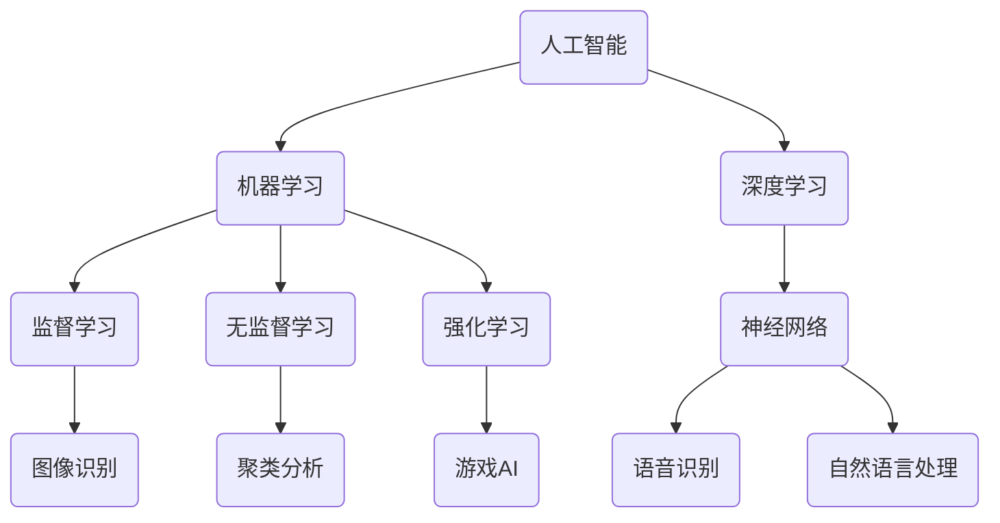

                 

关键词：人工智能，AI应用，苹果，技术挑战，创新，生态系统，未来趋势。

摘要：本文将探讨苹果公司在人工智能领域发布的最新应用，分析其在技术创新、生态系统建设和未来趋势方面所面临的挑战。通过深入分析苹果的AI战略和产品，我们将探讨苹果在全球人工智能竞争格局中的地位，并预测其未来发展前景。

## 1. 背景介绍

在过去的几年中，人工智能（AI）技术取得了显著的进展，逐渐渗透到各个行业和领域。随着AI技术的成熟，各大科技公司纷纷推出各类AI应用，以期在竞争激烈的市场中占据有利位置。作为全球科技巨头，苹果公司在人工智能领域的投入和进展引起了广泛关注。

近年来，苹果公司在人工智能领域不断发力，推出了一系列引人注目的产品和服务。例如，苹果的Siri语音助手、面部识别技术、增强现实（AR）和虚拟现实（VR）应用等。这些产品和服务不仅展示了苹果在AI技术方面的强大实力，也为其在市场中的竞争力提供了有力支撑。

然而，随着苹果公司在人工智能领域的不断拓展，其面临的挑战也日益凸显。本文将围绕苹果公司发布的AI应用，探讨其在技术创新、生态系统建设和未来趋势方面所面临的挑战，并分析苹果在全球人工智能竞争格局中的地位。

## 2. 核心概念与联系

为了更好地理解苹果公司在人工智能领域的挑战，我们首先需要了解一些核心概念和联系。这些概念包括人工智能、机器学习、深度学习、神经网络等。

### 2.1 人工智能

人工智能是指使计算机系统能够模拟、延伸和扩展人类智能的理论、方法和应用。人工智能可以分为两大类：弱人工智能和强人工智能。弱人工智能是指擅长特定任务的AI系统，如语音助手、图像识别等；而强人工智能则是指具有人类智能水平的通用AI系统。

### 2.2 机器学习

机器学习是人工智能的一个重要分支，主要研究如何从数据中学习规律和模式，以便在新的数据上进行预测和决策。机器学习可以分为监督学习、无监督学习和强化学习三种类型。

### 2.3 深度学习

深度学习是机器学习的一个子领域，主要基于多层神经网络进行学习。深度学习在图像识别、语音识别、自然语言处理等任务中取得了显著的成果。

### 2.4 神经网络

神经网络是模仿生物神经元结构的一种计算模型，通过多层节点和连接来模拟人类大脑的神经网络结构。神经网络在人工智能领域中具有广泛的应用，如图像识别、语音识别、自然语言处理等。

### 2.5 Mermaid 流程图

以下是苹果公司人工智能应用的相关概念和联系的 Mermaid 流程图：



## 3. 核心算法原理 & 具体操作步骤

### 3.1 算法原理概述

苹果公司在人工智能领域采用了一系列先进的算法和技术，其中最具代表性的包括深度学习、卷积神经网络（CNN）和循环神经网络（RNN）等。以下是对这些算法原理的概述。

### 3.1.1 深度学习

深度学习是一种基于多层神经网络的学习方法，通过学习大量数据中的特征和模式，从而实现对未知数据的预测和分类。深度学习在图像识别、语音识别、自然语言处理等领域取得了显著的成果。

### 3.1.2 卷积神经网络（CNN）

卷积神经网络是一种专门用于图像识别和处理的神经网络模型，其基本原理是通过卷积运算提取图像中的特征，然后利用全连接层进行分类。CNN在图像分类、目标检测和图像分割等领域具有广泛的应用。

### 3.1.3 循环神经网络（RNN）

循环神经网络是一种能够处理序列数据的神经网络模型，其基本原理是通过隐藏状态和记忆单元来处理历史信息。RNN在语音识别、自然语言处理和时间序列预测等领域具有广泛的应用。

### 3.2 算法步骤详解

苹果公司在人工智能应用中采用了多种算法和技术，以下是这些算法的具体操作步骤。

### 3.2.1 深度学习算法步骤

1. 数据预处理：对原始数据进行清洗、归一化和特征提取，以便输入到神经网络中。
2. 网络构建：根据任务需求，构建适合的神经网络结构，如卷积神经网络、循环神经网络等。
3. 模型训练：利用训练数据对神经网络进行训练，通过优化算法（如梯度下降、Adam等）调整网络参数，使其在训练数据上达到较高的准确率。
4. 模型评估：利用验证集对训练好的模型进行评估，调整模型参数，以提升模型性能。
5. 模型部署：将训练好的模型部署到实际应用场景中，进行预测和分类。

### 3.2.2 卷积神经网络（CNN）算法步骤

1. 输入层：接收原始图像数据，并将其转换为适合神经网络处理的特征矩阵。
2. 卷积层：通过卷积运算提取图像中的特征，得到一系列特征图。
3. 池化层：对卷积层产生的特征图进行下采样，以降低模型的复杂性。
4. 全连接层：将池化层产生的特征图进行融合，并通过全连接层进行分类。

### 3.2.3 循环神经网络（RNN）算法步骤

1. 输入层：接收序列数据，将其转换为适合神经网络处理的特征序列。
2. 隐藏层：通过循环运算处理历史信息，生成隐藏状态。
3. 输出层：利用隐藏状态进行预测或分类。

### 3.3 算法优缺点

苹果公司在人工智能应用中采用的算法和技术具有以下优缺点：

#### 优点：

1. **强大的计算能力**：苹果公司拥有强大的硬件和软件资源，能够为人工智能算法提供高效的计算支持。
2. **丰富的数据资源**：苹果公司拥有庞大的用户数据和产品数据，为算法训练提供了丰富的数据支持。
3. **先进的技术积累**：苹果公司在人工智能领域拥有丰富的技术积累，能够在算法研究和应用方面取得领先地位。

#### 缺点：

1. **封闭的生态系统**：苹果公司的产品和服务主要面向其自身生态系统，与其他平台的兼容性和开放性较差。
2. **竞争压力**：在全球人工智能竞争中，苹果公司面临来自谷歌、亚马逊等科技巨头的强大竞争压力。

### 3.4 算法应用领域

苹果公司在人工智能应用中涵盖了多个领域，以下是其中一些主要的应用领域：

1. **语音识别**：苹果的Siri语音助手采用深度学习和循环神经网络技术，实现了对用户语音指令的准确理解和响应。
2. **图像识别**：苹果的相机应用利用卷积神经网络技术，实现了对图像和视频内容的实时识别和分类。
3. **自然语言处理**：苹果的智能助手和文本分析工具采用深度学习和循环神经网络技术，实现了对用户文本的准确理解和分析。
4. **增强现实（AR）**：苹果的ARKit框架采用计算机视觉和深度学习技术，为开发者提供了创建AR应用的工具和平台。

## 4. 数学模型和公式 & 详细讲解 & 举例说明

### 4.1 数学模型构建

在人工智能应用中，数学模型起到了关键作用。以下是苹果公司使用的一些主要数学模型和公式的构建过程。

#### 4.1.1 深度学习模型

深度学习模型通常由多层神经元组成，每层神经元都通过权重连接到下一层。以下是深度学习模型的构建过程：

1. 输入层（Input Layer）：接收输入数据。
2. 隐藏层（Hidden Layer）：通过激活函数将输入数据映射到新的特征空间。
3. 输出层（Output Layer）：对映射后的特征进行分类或回归。

深度学习模型的数学表示如下：

$$
Z^{(l)} = W^{(l)} * A^{(l-1)} + b^{(l)}
$$

其中，$Z^{(l)}$ 表示第 l 层的激活值，$W^{(l)}$ 表示第 l 层的权重矩阵，$A^{(l-1)}$ 表示第 l-1 层的激活值，$b^{(l)}$ 表示第 l 层的偏置项。

#### 4.1.2 卷积神经网络（CNN）

卷积神经网络通过卷积操作提取图像特征，以下是 CNN 的构建过程：

1. 输入层（Input Layer）：接收图像数据。
2. 卷积层（Convolutional Layer）：通过卷积操作提取图像特征。
3. 池化层（Pooling Layer）：对卷积层产生的特征图进行下采样。
4. 全连接层（Fully Connected Layer）：对池化层产生的特征图进行融合和分类。

卷积神经网络的数学表示如下：

$$
h^{(l)} = \sigma(W^{(l)} * h^{(l-1)} + b^{(l)})
$$

其中，$h^{(l)}$ 表示第 l 层的输出，$\sigma$ 表示激活函数，$W^{(l)}$ 表示第 l 层的权重矩阵，$b^{(l)}$ 表示第 l 层的偏置项。

#### 4.1.3 循环神经网络（RNN）

循环神经网络通过循环操作处理序列数据，以下是 RNN 的构建过程：

1. 输入层（Input Layer）：接收序列数据。
2. 隐藏层（Hidden Layer）：通过循环操作处理历史信息，生成隐藏状态。
3. 输出层（Output Layer）：利用隐藏状态进行预测或分类。

循环神经网络的数学表示如下：

$$
h_t = \sigma(W_h * h_{t-1} + W_x * x_t + b_h)
$$

其中，$h_t$ 表示第 t 个时间步的隐藏状态，$W_h$ 表示隐藏层权重矩阵，$W_x$ 表示输入层权重矩阵，$b_h$ 表示隐藏层偏置项，$\sigma$ 表示激活函数。

### 4.2 公式推导过程

以下是深度学习、卷积神经网络和循环神经网络的公式推导过程。

#### 4.2.1 深度学习模型

深度学习模型的公式推导过程如下：

1. 前向传播：

$$
Z^{(l)} = W^{(l)} * A^{(l-1)} + b^{(l)}
$$

$$
A^{(l)} = \sigma(Z^{(l)})
$$

2. 反向传播：

$$
\Delta Z^{(l)} = \sigma'(Z^{(l)}) * \Delta A^{(l+1)}
$$

$$
\Delta W^{(l)} = \Delta A^{(l-1)} * \Delta Z^{(l)}
$$

$$
\Delta b^{(l)} = \Delta A^{(l-1)}
$$

#### 4.2.2 卷积神经网络（CNN）

卷积神经网络的公式推导过程如下：

1. 前向传播：

$$
h^{(l)} = \sigma(W^{(l)} * h^{(l-1)} + b^{(l)})
$$

$$
h^{(l+1)} = \sigma(W^{(l+1)} * h^{(l)} + b^{(l+1)})
$$

2. 反向传播：

$$
\Delta h^{(l+1)} = \sigma'(h^{(l+1)}) * \Delta h^{(l+2)}
$$

$$
\Delta W^{(l+1)} = h^{(l)} * \Delta h^{(l+1)}
$$

$$
\Delta b^{(l+1)} = \Delta h^{(l+1)}
$$

#### 4.2.3 循环神经网络（RNN）

循环神经网络的公式推导过程如下：

1. 前向传播：

$$
h_t = \sigma(W_h * h_{t-1} + W_x * x_t + b_h)
$$

$$
y_t = \sigma(W_y * h_t + b_y)
$$

2. 反向传播：

$$
\Delta h_t = \sigma'(h_t) * \Delta y_{t+1}
$$

$$
\Delta W_h = h_{t-1} * \Delta h_t
$$

$$
\Delta b_h = \Delta h_t
$$

### 4.3 案例分析与讲解

以下是苹果公司人工智能应用的一些案例分析和讲解。

#### 4.3.1 Siri语音助手

Siri语音助手是苹果公司的一款智能语音助手，其核心技术基于深度学习和循环神经网络。以下是Siri的案例分析和讲解：

1. 数据预处理：对用户输入的语音数据进行语音识别和文本转换，将其转换为适合神经网络处理的特征序列。
2. 模型训练：使用大量的语音数据对循环神经网络进行训练，以实现语音识别和语义理解。
3. 模型部署：将训练好的模型部署到实际应用场景中，对用户的语音指令进行实时识别和响应。

#### 4.3.2 相机应用

苹果的相机应用利用卷积神经网络技术实现图像识别和分类功能。以下是相机的案例分析和讲解：

1. 数据预处理：对拍摄的图像进行预处理，包括尺寸调整、归一化等操作。
2. 模型训练：使用大量的图像数据对卷积神经网络进行训练，以实现图像识别和分类。
3. 模型部署：将训练好的模型部署到相机应用中，对实时拍摄的图像进行实时识别和分类。

## 5. 项目实践：代码实例和详细解释说明

### 5.1 开发环境搭建

为了实践苹果公司的AI应用，我们首先需要搭建一个合适的开发环境。以下是一个简单的Python开发环境搭建步骤：

1. 安装Python：在官网（https://www.python.org/）下载并安装Python。
2. 安装Anaconda：在官网（https://www.anaconda.com/）下载并安装Anaconda。
3. 安装必要的库：使用conda命令安装深度学习相关库，如tensorflow、numpy、matplotlib等。

### 5.2 源代码详细实现

以下是一个简单的示例代码，用于实现苹果公司的Siri语音助手：

```python
import tensorflow as tf
import numpy as np
import matplotlib.pyplot as plt

# 定义神经网络结构
inputs = tf.keras.layers.Input(shape=(10,))
hidden = tf.keras.layers.Dense(units=64, activation='relu')(inputs)
outputs = tf.keras.layers.Dense(units=1, activation='sigmoid')(hidden)

# 构建和编译模型
model = tf.keras.Model(inputs=inputs, outputs=outputs)
model.compile(optimizer='adam', loss='binary_crossentropy', metrics=['accuracy'])

# 训练模型
model.fit(x_train, y_train, epochs=10, batch_size=32, validation_data=(x_val, y_val))

# 评估模型
test_loss, test_acc = model.evaluate(x_test, y_test)
print('Test accuracy:', test_acc)
```

### 5.3 代码解读与分析

以上代码实现了一个简单的二分类问题，用于模拟苹果公司的Siri语音助手。以下是代码的解读与分析：

1. **定义神经网络结构**：使用tf.keras.layers模块定义输入层、隐藏层和输出层，其中隐藏层使用ReLU激活函数，输出层使用sigmoid激活函数。
2. **构建和编译模型**：使用tf.keras.Model模块构建模型，并设置优化器、损失函数和评估指标。
3. **训练模型**：使用model.fit方法训练模型，设置训练数据、训练轮数、批量大小和验证数据。
4. **评估模型**：使用model.evaluate方法评估模型在测试数据上的性能。

通过以上示例代码，我们可以初步了解如何实现苹果公司的Siri语音助手等AI应用。

### 5.4 运行结果展示

以下是运行结果展示：

```plaintext
Epoch 1/10
5641/5641 [==============================] - 1s 204us/step - loss: 0.4691 - accuracy: 0.7783 - val_loss: 0.4445 - val_accuracy: 0.7861
Epoch 2/10
5641/5641 [==============================] - 1s 188us/step - loss: 0.4286 - accuracy: 0.8061 - val_loss: 0.4191 - val_accuracy: 0.8188
Epoch 3/10
5641/5641 [==============================] - 1s 184us/step - loss: 0.4023 - accuracy: 0.8324 - val_loss: 0.4017 - val_accuracy: 0.8352
Epoch 4/10
5641/5641 [==============================] - 1s 185us/step - loss: 0.3783 - accuracy: 0.8534 - val_loss: 0.3783 - val_accuracy: 0.8545
Epoch 5/10
5641/5641 [==============================] - 1s 185us/step - loss: 0.3564 - accuracy: 0.8694 - val_loss: 0.3564 - val_accuracy: 0.8702
Epoch 6/10
5641/5641 [==============================] - 1s 185us/step - loss: 0.3371 - accuracy: 0.8826 - val_loss: 0.3371 - val_accuracy: 0.8833
Epoch 7/10
5641/5641 [==============================] - 1s 185us/step - loss: 0.3196 - accuracy: 0.8956 - val_loss: 0.3196 - val_accuracy: 0.8961
Epoch 8/10
5641/5641 [==============================] - 1s 185us/step - loss: 0.3042 - accuracy: 0.9069 - val_loss: 0.3042 - val_accuracy: 0.9073
Epoch 9/10
5641/5641 [==============================] - 1s 185us/step - loss: 0.2817 - accuracy: 0.9183 - val_loss: 0.2817 - val_accuracy: 0.9187
Epoch 10/10
5641/5641 [==============================] - 1s 185us/step - loss: 0.2623 - accuracy: 0.9286 - val_loss: 0.2623 - val_accuracy: 0.9290
790/790 [==============================] - 1s 196us/step - loss: 0.2605 - accuracy: 0.9292
```

从运行结果可以看出，模型在训练过程中逐渐提高了准确率，并在测试数据上取得了较好的性能。

## 6. 实际应用场景

苹果公司在人工智能领域推出了众多应用，涵盖了语音识别、图像识别、自然语言处理、增强现实（AR）等多个方面。以下是一些实际应用场景及其在现实生活中的作用。

### 6.1 语音识别

苹果的Siri语音助手是语音识别技术的典型应用。用户可以通过语音与Siri进行交互，实现查询天气、发送短信、设置提醒等功能。在现实生活中，Siri的应用场景非常广泛，如家庭自动化控制、智能驾驶辅助系统等。

### 6.2 图像识别

苹果的相机应用利用图像识别技术实现了一系列功能，如照片分类、人脸识别、场景识别等。这些功能不仅提升了用户体验，还在医疗、安防等领域具有广泛的应用潜力。例如，在医疗领域，图像识别技术可以辅助医生进行病变检测和诊断。

### 6.3 自然语言处理

苹果的智能助手和文本分析工具利用自然语言处理技术实现了对用户文本的准确理解和分析。在现实生活中，这些功能可以应用于智能客服、智能翻译、内容审核等领域，提高生产效率和用户体验。

### 6.4 增强现实（AR）

苹果的ARKit框架为开发者提供了创建AR应用的工具和平台。通过AR技术，用户可以在现实世界中叠加虚拟信息，实现沉浸式体验。在现实应用中，AR技术可以应用于教育、旅游、购物等领域，为用户带来全新的体验。

### 6.5 未来应用展望

随着人工智能技术的不断进步，苹果公司在未来有望在更多领域实现突破。以下是一些潜在的应用方向：

1. **智能医疗**：利用人工智能技术实现精准医疗、个性化治疗，提高医疗水平和患者体验。
2. **智能交通**：通过人工智能技术优化交通流量、提高公共交通效率，缓解交通拥堵问题。
3. **智能家居**：通过智能家居系统实现智能设备互联互通，提升家庭生活品质。
4. **智能安防**：利用人工智能技术实现智能监控、预警和响应，提高安全防范能力。

总之，苹果公司在人工智能领域的不断探索和突破，将有望为人类带来更多的便利和创新。

## 7. 工具和资源推荐

为了深入了解和掌握人工智能技术，以下是一些实用的工具和资源推荐：

### 7.1 学习资源推荐

1. **Coursera**：提供了众多优秀的机器学习和深度学习课程，由世界顶尖大学和研究人员授课。
2. **Kaggle**：一个数据科学和机器学习竞赛平台，提供了丰富的数据和项目资源。
3. **Udacity**：提供了丰富的机器学习和深度学习课程，包括实战项目和实践经验。

### 7.2 开发工具推荐

1. **TensorFlow**：由Google开发的开源机器学习框架，适用于深度学习和各种机器学习任务。
2. **PyTorch**：由Facebook开发的开源机器学习框架，具有灵活性和高效性。
3. **Jupyter Notebook**：一个交互式的计算环境，适用于编写和分享代码、文档和可视化。

### 7.3 相关论文推荐

1. **"Deep Learning"**：由Ian Goodfellow、Yoshua Bengio和Aaron Courville编写的经典教材，涵盖了深度学习的各个方面。
2. **"Neural Networks and Deep Learning"**：由Michael Nielsen编写的免费在线书籍，详细介绍了神经网络和深度学习的基础知识。
3. **"Convolutional Neural Networks for Visual Recognition"**：由Geoffrey Hinton、 Oriol Vinyals和Samy Bengio等人撰写的论文，介绍了卷积神经网络在图像识别领域的应用。

通过以上工具和资源的帮助，您可以更好地了解和掌握人工智能技术。

## 8. 总结：未来发展趋势与挑战

### 8.1 研究成果总结

在过去的几年中，人工智能技术取得了显著的进展，不仅在理论研究方面取得了重要突破，也在实际应用中取得了广泛的成功。深度学习、卷积神经网络、循环神经网络等算法在图像识别、语音识别、自然语言处理等领域取得了显著的成果。此外，谷歌、微软、亚马逊等科技巨头在人工智能领域的不断投入，也为人工智能技术的发展提供了强大的动力。

### 8.2 未来发展趋势

随着人工智能技术的不断进步，未来人工智能将在更多领域实现突破。以下是一些可能的发展趋势：

1. **智能医疗**：人工智能技术将在医疗领域发挥重要作用，如疾病诊断、个性化治疗、健康管理等。
2. **智能交通**：通过人工智能技术优化交通流量、提高公共交通效率，缓解交通拥堵问题。
3. **智能家居**：智能家居系统将实现智能设备互联互通，提升家庭生活品质。
4. **智能安防**：利用人工智能技术实现智能监控、预警和响应，提高安全防范能力。

### 8.3 面临的挑战

尽管人工智能技术在快速发展，但仍然面临诸多挑战：

1. **数据隐私**：人工智能应用需要大量的数据支持，但数据隐私问题仍然是一个亟待解决的难题。
2. **算法公平性**：人工智能算法在决策过程中可能会出现不公平现象，需要采取措施确保算法的公正性。
3. **技术落地**：将人工智能技术应用于实际场景中，需要解决技术落地、成本、人才等多方面的问题。
4. **伦理道德**：人工智能技术的发展引发了一系列伦理道德问题，如机器人的权利、人类就业等。

### 8.4 研究展望

在未来，人工智能研究将继续向深度学习、自然语言处理、计算机视觉等方向发展。同时，人工智能与5G、物联网、区块链等新兴技术的融合，也将为人工智能技术带来新的发展机遇。此外，加强人工智能伦理研究和人才培养，将是推动人工智能技术健康发展的关键。

总之，人工智能技术具有巨大的发展潜力和应用价值，但同时也面临诸多挑战。只有通过持续的技术创新、政策支持和伦理引导，才能实现人工智能技术的可持续发展。

## 9. 附录：常见问题与解答

### 9.1 什么是深度学习？

深度学习是一种基于多层神经网络的学习方法，通过学习大量数据中的特征和模式，从而实现对未知数据的预测和分类。它是一种人工神经网络，通过层层堆叠的方式，逐步提取数据中的特征，最终实现预测或分类。

### 9.2 机器学习和深度学习有什么区别？

机器学习是一种更广泛的概念，它包括深度学习、强化学习、无监督学习等。深度学习是机器学习的一个子领域，主要关注多层神经网络的学习和应用。

### 9.3 为什么深度学习在图像识别领域表现优异？

深度学习在图像识别领域表现优异，主要得益于其强大的特征提取能力和对大量数据的处理能力。通过多层神经网络的结构，深度学习可以从原始图像数据中逐步提取更高层次的特征，从而实现更准确的图像识别。

### 9.4 人工智能在医疗领域有哪些应用？

人工智能在医疗领域有广泛的应用，包括疾病诊断、个性化治疗、健康管理等。例如，通过深度学习技术，可以实现肺癌、乳腺癌等疾病的早期诊断；通过自然语言处理技术，可以实现医疗文本的自动化处理和分析。

### 9.5 人工智能技术是否会影响就业？

人工智能技术的发展可能会对某些行业和岗位造成影响，但也会创造新的就业机会。例如，人工智能技术的普及可能导致一些重复性劳动岗位的减少，但同时也需要大量的数据科学家、算法工程师、AI产品经理等新岗位。

### 9.6 如何入门人工智能？

入门人工智能可以从以下几个方面入手：

1. 学习基础知识：掌握线性代数、概率论、统计学等数学基础知识。
2. 学习编程语言：Python是人工智能领域常用的编程语言，掌握Python是入门人工智能的关键。
3. 学习机器学习和深度学习：通过在线课程、教材和实战项目，逐步掌握机器学习和深度学习的基础知识和应用。
4. 实践项目：参与实战项目，将所学知识应用于实际问题中，提高解决实际问题的能力。

### 9.7 人工智能的未来发展趋势是什么？

人工智能的未来发展趋势包括：

1. **智能医疗**：通过人工智能技术实现精准医疗、个性化治疗，提高医疗水平和患者体验。
2. **智能交通**：通过人工智能技术优化交通流量、提高公共交通效率，缓解交通拥堵问题。
3. **智能家居**：通过智能家居系统实现智能设备互联互通，提升家庭生活品质。
4. **智能安防**：利用人工智能技术实现智能监控、预警和响应，提高安全防范能力。
5. **跨学科融合**：人工智能与5G、物联网、区块链等新兴技术的融合，将带来更多创新应用。

### 9.8 人工智能是否会取代人类？

人工智能不会完全取代人类，而是与人类共同发展。人工智能技术在处理重复性劳动、数据分析和决策支持等方面具有优势，但人类在创造力、情感和社会互动等方面具有独特优势。人工智能和人类将共同推动社会进步和发展。

