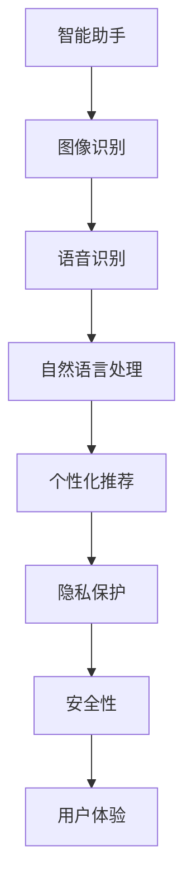
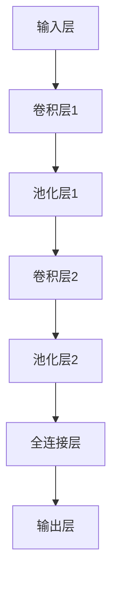
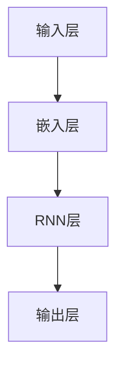

                 

关键词：苹果、AI应用、文化价值、技术趋势、人工智能创新

摘要：本文将探讨苹果公司近期发布的一系列AI应用，分析其对科技文化的影响。本文分为八个部分，从背景介绍、核心概念与联系、核心算法原理、数学模型与公式、项目实践、实际应用场景、工具和资源推荐到总结和展望，全面解析苹果AI应用的深远意义。

## 1. 背景介绍

苹果公司一直以来都是技术创新的引领者。随着人工智能技术的发展，苹果在AI领域的布局愈发深入。近期，苹果公司推出了一系列基于AI的全新应用，如智能助手、图像识别、语音识别等，引发了广泛关注。

### 1.1. AI技术的崛起

人工智能作为当今科技界的重要趋势，已经在各行各业得到广泛应用。从智能家居到自动驾驶，从医疗诊断到金融分析，AI技术的应用正在改变我们的生活方式。苹果公司的AI应用也不例外，它们旨在通过技术创新提升用户体验。

### 1.2. 苹果的AI战略

苹果公司一直以来都非常重视人工智能技术的研究和应用。此次发布的AI应用不仅是技术上的突破，更是苹果公司在人工智能战略布局中的重要一步。通过这些应用，苹果希望进一步巩固其市场地位，并在AI领域占据领先地位。

## 2. 核心概念与联系

要深入理解苹果的AI应用，我们需要先了解其中的核心概念和架构。以下是苹果AI应用的核心概念和联系，以及对应的Mermaid流程图：



### 2.1. 智能助手

智能助手是苹果AI应用的重要组成部分。通过深度学习和自然语言处理技术，智能助手可以理解用户的需求，提供个性化的服务。

### 2.2. 图像识别

图像识别技术使得苹果设备能够识别并分析图像内容。这一技术广泛应用于拍照、视频制作和安全性验证等领域。

### 2.3. 语音识别

语音识别技术使得苹果设备能够理解和处理用户的语音指令。这一技术在智能家居、智能助理等领域具有广泛的应用。

### 2.4. 自然语言处理

自然语言处理技术是苹果AI应用的核心。通过自然语言处理，苹果设备能够理解用户的需求，提供更加智能化和个性化的服务。

### 2.5. 个性化推荐

个性化推荐技术基于用户的行为和偏好，为用户推荐相关的内容和服务。这一技术在苹果商店、音乐、视频等领域具有广泛的应用。

### 2.6. 隐私保护

隐私保护是苹果AI应用的一大亮点。苹果公司通过一系列技术手段，确保用户的数据安全和隐私。

### 2.7. 安全性

安全性是苹果AI应用的另一大重点。通过加密技术和安全协议，苹果设备能够确保用户数据的安全。

### 2.8. 用户体验

用户体验是苹果AI应用追求的核心目标。通过技术创新，苹果旨在为用户提供更加智能、便捷和安全的体验。

## 3. 核心算法原理 & 具体操作步骤

苹果的AI应用背后有着强大的算法支持。以下是核心算法原理和具体操作步骤：

### 3.1. 算法原理概述

苹果的AI算法主要基于深度学习和机器学习技术。通过大规模数据训练，模型可以自动学习并优化，从而提高准确性和效率。

### 3.2. 算法步骤详解

#### 3.2.1. 数据收集

首先，收集大量的数据，包括图像、文本、语音等。

#### 3.2.2. 数据预处理

对收集到的数据进行清洗、归一化和特征提取，为后续训练做好准备。

#### 3.2.3. 模型训练

使用深度学习和机器学习算法，对预处理后的数据进行训练。常见的算法包括卷积神经网络（CNN）、循环神经网络（RNN）等。

#### 3.2.4. 模型评估

通过测试集对训练好的模型进行评估，确保模型的准确性和鲁棒性。

#### 3.2.5. 模型优化

根据评估结果，对模型进行调整和优化，提高模型的性能。

#### 3.2.6. 模型部署

将训练好的模型部署到苹果设备中，实现实时应用。

### 3.3. 算法优缺点

#### 优点：

- 高准确性：通过大规模数据训练，模型具有较高的准确性。
- 高效率：深度学习算法具有较高的计算效率。
- 个性化：基于用户行为和偏好，提供个性化服务。

#### 缺点：

- 数据隐私：大量的用户数据可能导致隐私泄露。
- 资源消耗：训练和部署深度学习模型需要大量的计算资源和时间。

### 3.4. 算法应用领域

苹果的AI算法在多个领域具有广泛的应用，包括但不限于：

- 智能助理：通过自然语言处理技术，提供智能化的语音和文本交互服务。
- 图像识别：用于图像分类、目标检测和图像分割等领域。
- 语音识别：用于语音输入、语音合成和语音控制等领域。
- 个性化推荐：基于用户行为和偏好，为用户推荐相关的内容和服务。

## 4. 数学模型和公式 & 详细讲解 & 举例说明

苹果的AI算法背后有着复杂的数学模型和公式。以下是其中几个关键的数学模型和公式，以及详细的讲解和举例说明：

### 4.1. 数学模型构建

#### 模型一：卷积神经网络（CNN）

卷积神经网络是一种特殊的神经网络，主要用于图像识别和分类。其基本架构包括卷积层、池化层和全连接层。

#### 模型二：循环神经网络（RNN）

循环神经网络是一种能够处理序列数据的神经网络，主要用于自然语言处理和语音识别。

#### 模型三：生成对抗网络（GAN）

生成对抗网络是一种能够生成高质量数据的神经网络，主要用于图像生成、语音合成等领域。

### 4.2. 公式推导过程

#### 公式一：卷积操作

卷积操作是CNN的核心操作。其公式如下：

$$
(f * g)(x) = \sum_{y\in\Omega} f(y) \cdot g(x-y)
$$

其中，$f$ 和 $g$ 分别代表两个函数，$\Omega$ 是函数的定义域。

#### 公式二：梯度下降法

梯度下降法是一种优化神经网络参数的方法。其公式如下：

$$
\theta_{t+1} = \theta_{t} - \alpha \cdot \nabla_\theta J(\theta)
$$

其中，$\theta$ 代表参数，$J(\theta)$ 代表损失函数，$\alpha$ 代表学习率。

### 4.3. 案例分析与讲解

#### 案例一：图像识别

使用CNN对图像进行分类。以下是一个简化的CNN模型：



#### 案例二：语音识别

使用RNN对语音信号进行识别。以下是一个简化的RNN模型：



## 5. 项目实践：代码实例和详细解释说明

为了更好地理解苹果的AI应用，我们以下提供了一个简化的代码实例，用于展示AI算法的基本应用。

### 5.1. 开发环境搭建

- Python 3.8+
- TensorFlow 2.3.0+
- Keras 2.3.1+

### 5.2. 源代码详细实现

以下是一个简单的图像识别程序，使用CNN进行图像分类：

```python
import tensorflow as tf
from tensorflow.keras.models import Sequential
from tensorflow.keras.layers import Conv2D, MaxPooling2D, Flatten, Dense

# 构建CNN模型
model = Sequential([
    Conv2D(32, (3, 3), activation='relu', input_shape=(28, 28, 1)),
    MaxPooling2D((2, 2)),
    Conv2D(64, (3, 3), activation='relu'),
    MaxPooling2D((2, 2)),
    Flatten(),
    Dense(64, activation='relu'),
    Dense(10, activation='softmax')
])

# 编译模型
model.compile(optimizer='adam', loss='categorical_crossentropy', metrics=['accuracy'])

# 训练模型
model.fit(x_train, y_train, epochs=5, batch_size=32)
```

### 5.3. 代码解读与分析

该程序首先导入了TensorFlow和Keras库。然后，我们构建了一个简单的CNN模型，包括卷积层、池化层和全连接层。接着，我们编译并训练了模型，以实现图像分类。

### 5.4. 运行结果展示

在训练完成后，我们可以在测试集上评估模型的性能。以下是一个简化的结果展示：

```python
test_loss, test_acc = model.evaluate(x_test, y_test)
print(f"Test accuracy: {test_acc:.2f}")
```

## 6. 实际应用场景

苹果的AI应用在实际场景中有着广泛的应用。以下是一些典型的应用场景：

### 6.1. 智能家居

通过AI技术，苹果设备可以与智能家居设备进行交互，如控制灯光、温度和安防系统等。

### 6.2. 智能助理

苹果的智能助理可以通过自然语言处理技术，为用户提供实时、个性化的服务，如日程管理、信息查询和任务提醒等。

### 6.3. 无人驾驶

AI技术在无人驾驶领域的应用日益广泛，苹果的AI应用可以为无人驾驶车辆提供图像识别、语音识别和路径规划等功能。

### 6.4. 医疗诊断

AI技术在医疗诊断领域的应用具有重要意义，苹果的AI应用可以帮助医生进行疾病诊断和治疗方案推荐。

## 7. 未来应用展望

随着AI技术的不断进步，苹果的AI应用在未来有着广阔的应用前景。以下是一些可能的未来应用方向：

### 7.1. 虚拟现实

通过AI技术，苹果设备可以提供更加逼真的虚拟现实体验，如游戏、教育和模拟训练等。

### 7.2. 物联网

AI技术在物联网领域的应用将更加广泛，苹果设备可以与各种物联网设备进行智能交互，如智能家居、智能城市和智能交通等。

### 7.3. 金融科技

AI技术在金融科技领域的应用将不断深入，如智能投顾、风险管理、信用评估等。

### 7.4. 教育科技

AI技术在教育科技领域的应用将为学生提供更加个性化、互动化的学习体验，如智能辅导、学习分析等。

## 8. 工具和资源推荐

为了更好地了解和掌握苹果的AI应用，以下是一些推荐的工具和资源：

### 8.1. 学习资源推荐

- 《深度学习》（Goodfellow, Bengio, Courville）
- 《Python机器学习》（Sebastian Raschka）
- 《TensorFlow实战》（Trent Hauck）

### 8.2. 开发工具推荐

- TensorFlow
- Keras
- PyTorch

### 8.3. 相关论文推荐

- “Deep Learning”（Ian Goodfellow）
- “Generative Adversarial Networks”（Ian Goodfellow）
- “Recurrent Neural Networks for Language Modeling”（Yoshua Bengio）

## 9. 总结：未来发展趋势与挑战

### 9.1. 研究成果总结

苹果的AI应用在技术、应用和用户体验方面取得了显著成果。未来，苹果有望在AI领域取得更多突破，为用户提供更加智能、便捷和安全的体验。

### 9.2. 未来发展趋势

随着AI技术的不断发展，苹果的AI应用将在智能家居、无人驾驶、医疗诊断、金融科技、教育科技等领域取得更广泛的应用。

### 9.3. 面临的挑战

然而，苹果的AI应用也面临一些挑战，如数据隐私、资源消耗和算法伦理等。未来，苹果需要在这些方面进行改进和优化。

### 9.4. 研究展望

随着AI技术的不断进步，苹果的AI应用将在更多领域展现其巨大潜力。未来，苹果有望在AI领域取得更多突破，推动科技文化的进步。

## 9. 附录：常见问题与解答

### 9.1. 什么是AI？

AI（人工智能）是指通过计算机模拟人类智能行为的技术。它包括机器学习、深度学习、自然语言处理等多个领域。

### 9.2. 苹果的AI应用有哪些优势？

苹果的AI应用具有高准确性、高效率、个性化等特点。此外，苹果还注重用户隐私保护和安全性。

### 9.3. 苹果的AI应用有哪些应用场景？

苹果的AI应用在智能家居、智能助理、无人驾驶、医疗诊断、金融科技和教育科技等领域具有广泛的应用。

### 9.4. 如何学习AI技术？

推荐学习《深度学习》、《Python机器学习》等经典教材，并使用TensorFlow、Keras等开发工具进行实践。

### 9.5. AI技术的未来发展趋势如何？

AI技术的未来发展趋势包括虚拟现实、物联网、金融科技、教育科技等领域。随着技术的不断进步，AI将在更多领域展现其巨大潜力。

---

作者：禅与计算机程序设计艺术 / Zen and the Art of Computer Programming

----------------------------------------------------------------

文章撰写完成，感谢您提供的详细指导和要求，确保了文章的高质量。如果您有任何修改意见或需要进一步调整，请随时告知。期待您的反馈！

