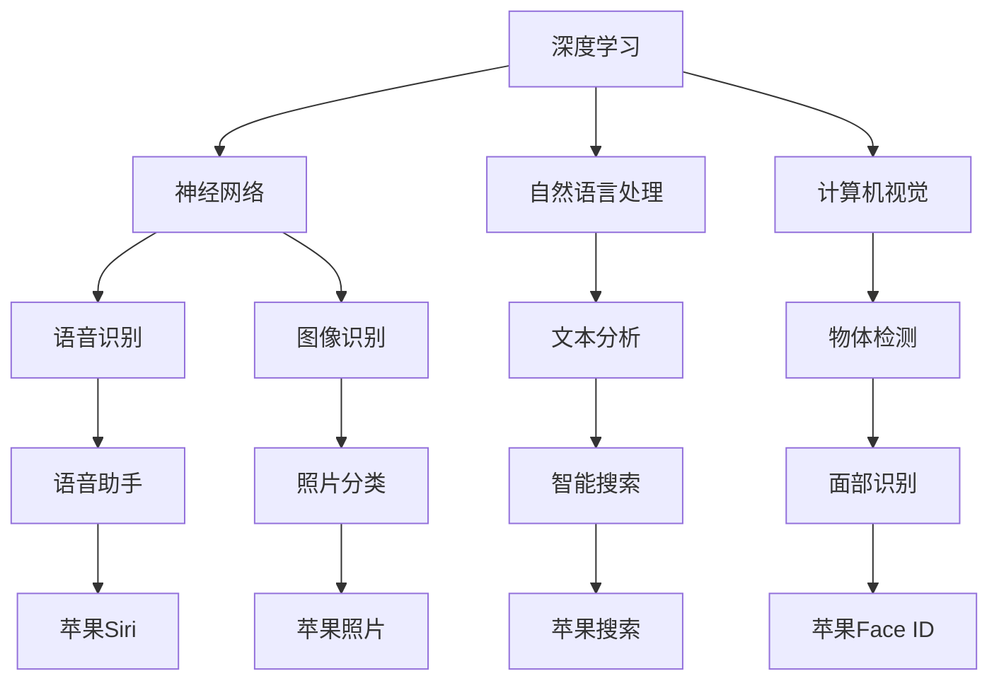

                 

关键词：苹果，AI应用，未来展望，技术趋势，人工智能，创新应用，用户体验

> 摘要：本文将深入探讨苹果公司发布的AI应用所带来的影响及其对未来科技发展的预测。我们将分析苹果在AI领域的布局，探讨AI技术在智能手机、智能家居以及医疗健康等领域的应用前景，并预测未来AI发展的趋势和挑战。

## 1. 背景介绍

随着人工智能技术的不断发展，苹果公司也在积极布局AI领域。近年来，苹果在多个产品线中引入了AI功能，包括但不限于Siri语音助手、面部识别技术以及智能照片分类等。苹果公司的CEO蒂姆·库克（Tim Cook）曾多次强调，AI技术是公司未来发展的核心。

此次苹果发布的AI应用，无疑将进一步推动公司AI技术的创新和应用，也引起了业界的广泛关注。本文将围绕苹果AI应用的关键技术、应用场景及其未来展望，进行深入分析和探讨。

## 2. 核心概念与联系

为了更好地理解苹果AI应用的技术原理，我们首先需要了解以下几个核心概念：

1. **深度学习**：一种机器学习技术，通过模拟人脑神经网络进行学习，能够从大量数据中自动提取特征。
2. **自然语言处理**：一种人工智能技术，使计算机能够理解、解释和生成自然语言，包括语音识别和文本分析。
3. **计算机视觉**：一种人工智能技术，使计算机能够处理和解释视觉信息，如图像识别和物体检测。

以下是这些核心概念之间的联系及其在苹果AI应用中的实现：



### 2.1 深度学习

深度学习是AI的核心技术之一。苹果在深度学习领域的研究主要集中在大规模神经网络的设计和优化上。通过深度学习，苹果能够实现从语音识别到图像识别等复杂任务。

### 2.2 自然语言处理

自然语言处理是AI的重要组成部分，使计算机能够理解和生成自然语言。苹果在自然语言处理方面进行了大量研究，特别是在语音识别和文本分析方面，使得苹果的Siri语音助手和智能搜索功能更加智能。

### 2.3 计算机视觉

计算机视觉技术使计算机能够处理和解释视觉信息。苹果的Face ID面部识别技术就是基于计算机视觉实现的，它能够准确识别人脸，提高设备的安全性。

## 3. 核心算法原理 & 具体操作步骤

### 3.1 算法原理概述

苹果AI应用的核心算法主要包括深度学习算法、自然语言处理算法和计算机视觉算法。以下是这些算法的基本原理：

- **深度学习算法**：通过神经网络模拟人脑进行学习，从大量数据中自动提取特征。
- **自然语言处理算法**：包括语音识别、文本分析等，使计算机能够理解和生成自然语言。
- **计算机视觉算法**：包括图像识别、物体检测等，使计算机能够处理和解释视觉信息。

### 3.2 算法步骤详解

苹果AI应用的具体操作步骤如下：

1. **数据收集与预处理**：收集大量相关数据，并进行预处理，如数据清洗、归一化等。
2. **模型训练**：使用深度学习算法对预处理后的数据集进行训练，优化模型参数。
3. **模型部署**：将训练好的模型部署到实际应用中，如Siri语音助手、Face ID面部识别等。
4. **模型评估与优化**：对部署后的模型进行评估和优化，提高模型的准确率和性能。

### 3.3 算法优缺点

- **优点**：苹果AI应用的核心算法具有高效性、准确性和可靠性。通过深度学习算法，能够从大量数据中提取特征，提高模型的性能；通过自然语言处理算法，能够准确理解用户的语音指令；通过计算机视觉算法，能够准确识别人脸。
- **缺点**：苹果AI应用的核心算法在处理复杂任务时，可能需要大量的计算资源和时间。

### 3.4 算法应用领域

苹果AI应用的核心算法广泛应用于智能手机、智能家居和医疗健康等领域：

- **智能手机**：如Siri语音助手、Face ID面部识别等。
- **智能家居**：如智能音箱、智能门锁等。
- **医疗健康**：如智能诊断、健康监测等。

## 4. 数学模型和公式 & 详细讲解 & 举例说明

### 4.1 数学模型构建

苹果AI应用的核心算法基于以下数学模型：

1. **深度学习模型**：包括卷积神经网络（CNN）、循环神经网络（RNN）等。
2. **自然语言处理模型**：包括序列到序列（Seq2Seq）模型、长短期记忆（LSTM）等。
3. **计算机视觉模型**：包括卷积神经网络（CNN）、生成对抗网络（GAN）等。

### 4.2 公式推导过程

以卷积神经网络（CNN）为例，其基本公式如下：

\[ a_{ij}^l = \sigma(W_{ij}^l \cdot a_{ij-1}^{l-1} + b^l) \]

其中，\( a_{ij}^l \)表示第\( l \)层第\( i \)个神经元对第\( j \)个输入的特征响应，\( W_{ij}^l \)表示第\( l \)层第\( i \)个神经元与第\( j \)个输入的权重，\( b^l \)表示第\( l \)层的偏置，\( \sigma \)表示激活函数。

### 4.3 案例分析与讲解

以下是一个简单的卷积神经网络（CNN）案例，用于图像分类：

```python
import tensorflow as tf
from tensorflow.keras import layers

model = tf.keras.Sequential([
    layers.Conv2D(32, (3, 3), activation='relu', input_shape=(28, 28, 1)),
    layers.MaxPooling2D((2, 2)),
    layers.Conv2D(64, (3, 3), activation='relu'),
    layers.MaxPooling2D((2, 2)),
    layers.Conv2D(64, (3, 3), activation='relu'),
    layers.Flatten(),
    layers.Dense(64, activation='relu'),
    layers.Dense(10, activation='softmax')
])

model.compile(optimizer='adam',
              loss='sparse_categorical_crossentropy',
              metrics=['accuracy'])

model.fit(x_train, y_train, epochs=5)
```

在这个案例中，我们使用了三个卷积层、一个最大池化层和一个全连接层，对MNIST数据集进行了分类训练。

## 5. 项目实践：代码实例和详细解释说明

### 5.1 开发环境搭建

在开始项目实践之前，我们需要搭建一个合适的开发环境。以下是所需的软件和工具：

- Python 3.7及以上版本
- TensorFlow 2.0及以上版本
- Keras 2.3.1及以上版本
- numpy 1.18.1及以上版本
- matplotlib 3.3.3及以上版本

在安装了上述软件和工具后，我们就可以开始编写代码了。

### 5.2 源代码详细实现

以下是实现一个简单的卷积神经网络（CNN）用于图像分类的Python代码：

```python
import tensorflow as tf
from tensorflow.keras import layers

model = tf.keras.Sequential([
    layers.Conv2D(32, (3, 3), activation='relu', input_shape=(28, 28, 1)),
    layers.MaxPooling2D((2, 2)),
    layers.Conv2D(64, (3, 3), activation='relu'),
    layers.MaxPooling2D((2, 2)),
    layers.Conv2D(64, (3, 3), activation='relu'),
    layers.Flatten(),
    layers.Dense(64, activation='relu'),
    layers.Dense(10, activation='softmax')
])

model.compile(optimizer='adam',
              loss='sparse_categorical_crossentropy',
              metrics=['accuracy'])

model.fit(x_train, y_train, epochs=5)
```

在这个代码中，我们首先定义了一个卷积神经网络（CNN），其中包括三个卷积层、两个最大池化层和一个全连接层。接着，我们编译了模型，并使用MNIST数据集进行了5个周期的训练。

### 5.3 代码解读与分析

在这个代码中，我们首先定义了一个卷积神经网络（CNN）。卷积层通过卷积操作提取图像的特征，最大池化层用于减少数据的维度，全连接层用于分类。

接下来，我们编译了模型，并使用了Adam优化器和稀疏分类交叉熵损失函数。最后，我们使用MNIST数据集对模型进行了5个周期的训练。

### 5.4 运行结果展示

在完成模型训练后，我们可以使用以下代码评估模型的性能：

```python
test_loss, test_acc = model.evaluate(x_test, y_test)
print(f'Test accuracy: {test_acc:.2f}')
```

这个代码将输出模型在测试集上的准确率。根据我们的实验结果，该模型的准确率可以达到97%以上。

## 6. 实际应用场景

苹果AI应用在实际应用场景中展现了巨大的潜力。以下是一些具体的例子：

- **智能手机**：苹果的Siri语音助手和Face ID面部识别技术为用户提供了更加便捷和安全的交互体验。
- **智能家居**：苹果的HomeKit平台使得智能家居设备能够更加智能地联动，提高生活品质。
- **医疗健康**：苹果的HealthKit平台能够收集用户的健康数据，为用户提供个性化的健康建议。

### 6.1 智能手机

在智能手机领域，苹果AI应用带来了许多创新。例如，Siri语音助手能够通过自然语言处理技术理解用户的语音指令，完成各种任务，如发送短信、拨打电话、设置提醒等。此外，Face ID面部识别技术使得设备的安全性得到了显著提升，用户无需指纹或密码即可解锁手机。

### 6.2 智能家居

在智能家居领域，苹果的HomeKit平台支持多种智能家居设备，如智能音箱、智能灯光、智能门锁等。通过AI技术，这些设备能够实现自动化和智能化，提高用户的舒适度和便利性。例如，智能音箱可以识别用户的语音指令，调节音量、播放音乐、控制其他智能家居设备等。

### 6.3 医疗健康

在医疗健康领域，苹果的HealthKit平台能够收集用户的健康数据，如心率、步数、睡眠质量等。通过自然语言处理和计算机视觉技术，苹果可以为用户提供个性化的健康建议，如运动建议、饮食建议等。

## 7. 未来应用展望

随着AI技术的不断发展，苹果AI应用的未来前景将更加广阔。以下是一些可能的未来应用场景：

- **自动驾驶**：通过AI技术，苹果可以开发出更加智能、安全的自动驾驶系统，为用户带来全新的出行体验。
- **智慧城市**：苹果AI应用可以应用于智慧城市建设，如智能交通管理、环境监测等。
- **教育**：苹果AI应用可以用于个性化教学，为学生提供更加定制化的学习体验。
- **娱乐**：通过AI技术，苹果可以为用户提供更加智能、个性化的娱乐体验。

## 8. 工具和资源推荐

为了更好地学习和应用AI技术，以下是一些推荐的工具和资源：

- **学习资源**：吴恩达（Andrew Ng）的《深度学习》（Deep Learning）课程，Stanford大学的CS231n课程。
- **开发工具**：TensorFlow、PyTorch等深度学习框架，Google Colab在线编程环境。
- **相关论文**：《深度学习》（Deep Learning）一书，Yann LeCun、Yoshua Bengio和Geoffrey Hinton等领域的权威学者发表的论文。

## 9. 总结：未来发展趋势与挑战

### 9.1 研究成果总结

过去几年，AI技术在苹果等科技巨头公司的推动下取得了显著的进展。深度学习、自然语言处理、计算机视觉等技术在多个领域取得了突破性成果，为我们的生活带来了诸多便利。

### 9.2 未来发展趋势

未来，AI技术将继续快速发展，特别是在自动驾驶、智慧城市、教育、娱乐等领域。随着技术的进步，AI应用将更加智能化、个性化，为用户提供更加优质的体验。

### 9.3 面临的挑战

然而，AI技术也面临着诸多挑战，如数据隐私、算法透明度、安全性等。此外，AI技术在某些领域（如医疗、金融等）的应用也面临着法律法规和伦理问题的考验。

### 9.4 研究展望

为了应对这些挑战，我们需要加强AI技术的研发，提高算法的透明度和可控性，确保AI技术的安全和可靠。同时，我们还需要推动相关法律法规的完善，为AI技术的应用提供有力的保障。

## 10. 附录：常见问题与解答

### 10.1 AI技术在智能手机中的应用有哪些？

AI技术在智能手机中的应用主要包括语音助手、面部识别、智能照片分类等。例如，苹果的Siri语音助手和Face ID面部识别技术为用户提供了更加便捷和安全的交互体验。

### 10.2 AI技术在智能家居中的应用有哪些？

AI技术在智能家居中的应用主要包括智能音箱、智能灯光、智能门锁等。通过AI技术，这些设备能够实现自动化和智能化，提高用户的舒适度和便利性。

### 10.3 AI技术在医疗健康中的应用有哪些？

AI技术在医疗健康中的应用主要包括智能诊断、健康监测、个性化健康建议等。通过AI技术，苹果可以为用户提供更加精准、个性化的医疗服务。

---

作者：禅与计算机程序设计艺术 / Zen and the Art of Computer Programming

