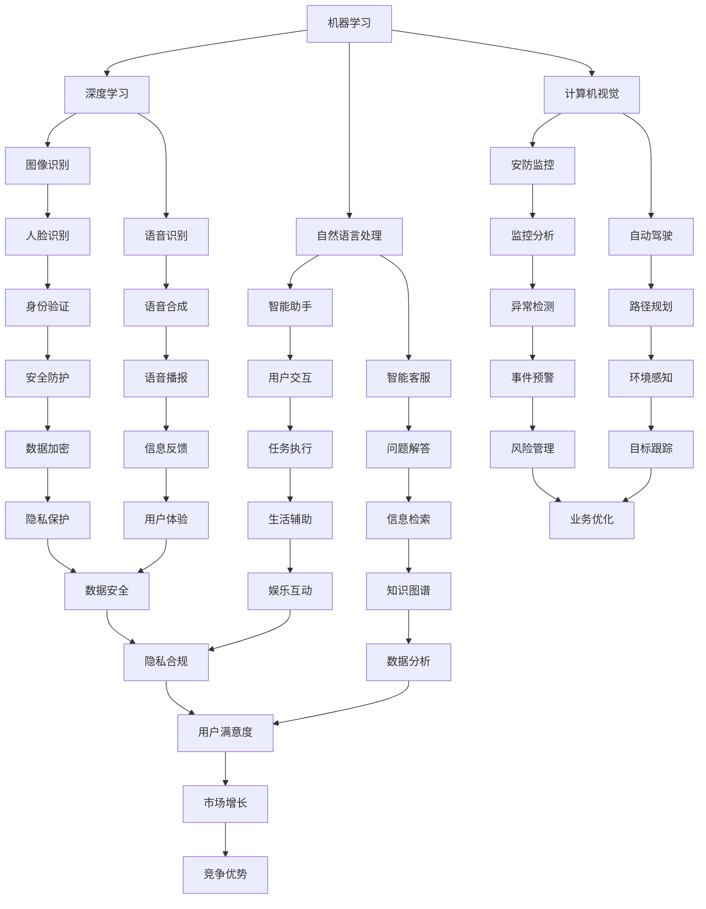
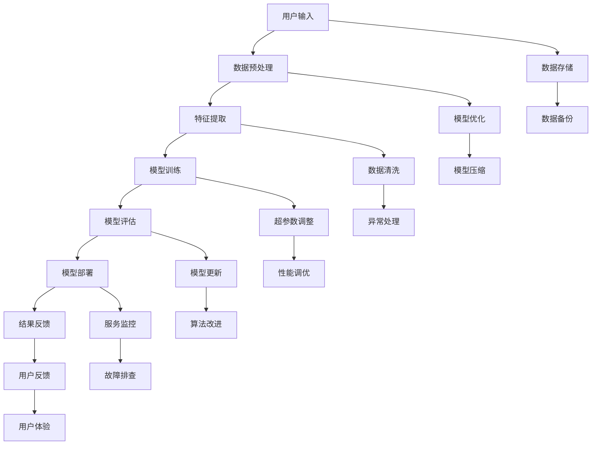

                 

关键词：苹果，AI应用，人工智能，机会，技术趋势，应用场景

摘要：随着人工智能技术的快速发展，苹果公司近年来在AI领域的投入和布局也日益明显。本文将探讨苹果发布AI应用的机会，分析其在AI领域的发展策略，以及可能带来的技术和社会影响。

## 1. 背景介绍

人工智能（AI）作为计算机科学的一个分支，旨在通过计算机模拟人类智能行为，实现自我学习、推理、解决问题等能力。近年来，随着计算能力的提升、大数据的积累以及算法的进步，AI技术取得了显著突破。从语音识别、图像处理到自动驾驶、智能家居，AI技术的应用已经深入到我们日常生活的方方面面。

苹果公司作为全球知名的科技巨头，一直以来都在积极探索AI技术。从Siri语音助手的发布到ML模型在iPhone摄像头中的应用，苹果在AI领域的探索从未停止。本文将重点关注苹果在AI应用发布方面的机会和挑战。

### 1.1 苹果在AI领域的布局

- **Siri语音助手**：Siri作为苹果公司的智能语音助手，已经成为苹果产品的一个重要组成部分。通过自然语言处理技术，Siri能够理解用户的语音指令并执行相应的操作，如发送短信、设置提醒等。

- **增强现实（AR）**：苹果在AR技术方面的投入也颇为显著。通过推出ARKit框架，苹果为开发者提供了创建AR应用的工具，使得AR技术在iPhone和iPad上得到了广泛应用。

- **计算机视觉**：苹果在计算机视觉领域的研发也不遗余力。通过引入深度学习技术，苹果的产品能够实现更精确的图像识别和物体检测。

### 1.2 AI应用市场的现状与趋势

随着AI技术的普及，越来越多的企业和机构开始将AI应用引入到产品和服务中。从安防监控到智能医疗，从金融理财到智能客服，AI应用的场景越来越广泛。同时，随着人工智能算法的进步和计算资源的丰富，AI应用的性能和效率也在不断提升。

在这种背景下，苹果发布AI应用不仅能够满足用户日益增长的需求，还能够为苹果自身带来新的增长点。然而，AI应用的开发和推广也面临着诸多挑战，如数据隐私、算法公平性等。

## 2. 核心概念与联系

在探讨苹果发布AI应用的机会之前，我们需要了解一些核心概念和相关的技术架构。以下是AI应用开发中几个关键概念和其相互联系：

### 2.1 机器学习和深度学习

- **机器学习**：一种让计算机通过数据学习规律并做出决策的技术。它包括监督学习、无监督学习和强化学习等。

- **深度学习**：一种基于神经网络的结构化机器学习方法，它在图像识别、语音识别等领域表现出色。

### 2.2 自然语言处理（NLP）

- **NLP**：一门研究如何让计算机理解、处理和生成人类语言的技术。它在智能助手、智能客服等领域有着广泛应用。

### 2.3 计算机视觉

- **计算机视觉**：一种让计算机理解和解释图像或视频内容的技术。它在安防监控、自动驾驶等领域有着重要应用。

### 2.4 数据隐私和安全

- **数据隐私和安全**：在AI应用开发过程中，数据隐私和安全是两个至关重要的问题。如何保证用户数据的安全和隐私，是每个AI开发者都需要面对的挑战。

下面是这些核心概念和技术的Mermaid流程图表示：



### 2.5 AI应用的架构

除了核心概念和技术的相互联系，AI应用的架构也是理解其运作原理的关键。以下是典型的AI应用架构：



## 3. 核心算法原理 & 具体操作步骤

### 3.1 算法原理概述

苹果公司在其AI应用中主要采用了深度学习和机器学习技术。以下是这些算法的基本原理：

### 3.1.1 深度学习

- **神经网络**：神经网络是一种模拟人脑结构的计算模型，它通过多层神经元进行数据处理和特征提取。

- **反向传播算法**：反向传播算法是一种用于训练神经网络的优化方法，通过不断调整网络的权重和偏置，使得网络输出更接近期望值。

### 3.1.2 机器学习

- **监督学习**：监督学习是一种有监督的训练方法，通过已标记的数据集训练模型，然后使用该模型对新的数据进行预测。

- **无监督学习**：无监督学习是一种无监督的训练方法，通过未标记的数据集寻找数据的内在结构或模式。

### 3.2 算法步骤详解

以下是苹果在AI应用开发中的具体操作步骤：

### 3.2.1 数据收集与预处理

- 数据收集：收集与AI应用相关的数据，如图像、文本、语音等。

- 数据预处理：对收集到的数据进行清洗、归一化和特征提取等处理。

### 3.2.2 模型设计与训练

- 模型设计：根据应用需求设计合适的神经网络架构。

- 模型训练：使用已预处理的数据集对神经网络模型进行训练，通过反向传播算法优化模型参数。

### 3.2.3 模型评估与优化

- 模型评估：使用测试数据集评估模型性能，包括准确率、召回率等指标。

- 模型优化：根据评估结果调整模型参数和架构，提高模型性能。

### 3.2.4 模型部署与监控

- 模型部署：将训练好的模型部署到实际应用中，如iPhone或iPad。

- 模型监控：对模型在应用中的表现进行监控，包括性能、稳定性等。

### 3.3 算法优缺点

#### 优点：

- **高效性**：深度学习和机器学习算法能够处理大量数据，并从中提取有用的信息。

- **灵活性**：神经网络和机器学习模型可以根据具体应用需求进行定制化设计。

- **泛化能力**：训练好的模型可以对新数据进行分析和预测，具有良好的泛化能力。

#### 缺点：

- **数据需求**：深度学习和机器学习算法通常需要大量的数据进行训练。

- **计算资源**：训练和部署深度学习模型需要大量的计算资源。

- **解释性**：深度学习模型在做出决策时缺乏透明度，难以解释其决策过程。

### 3.4 算法应用领域

- **计算机视觉**：图像识别、人脸识别、物体检测等。

- **自然语言处理**：语音识别、文本分类、机器翻译等。

- **智能助手**：智能客服、语音助手、智能推荐等。

- **自动驾驶**：路径规划、环境感知、行为预测等。

## 4. 数学模型和公式 & 详细讲解 & 举例说明

### 4.1 数学模型构建

在AI应用中，常见的数学模型包括神经网络模型和机器学习模型。以下是一个简单的神经网络模型示例：

$$
\begin{align*}
z_1 &= x_1 \cdot w_1 + b_1 \\
a_1 &= \sigma(z_1) \\
z_2 &= a_1 \cdot w_2 + b_2 \\
a_2 &= \sigma(z_2) \\
y &= a_2
\end{align*}
$$

其中，$x_1$和$a_2$分别是输入和输出，$w_1$、$w_2$、$b_1$和$b_2$是模型的权重和偏置，$\sigma$是激活函数。

### 4.2 公式推导过程

以下是神经网络模型的反向传播算法的推导过程：

$$
\begin{align*}
\delta_2 &= (y - a_2) \cdot \frac{d\sigma(z_2)}{dz_2} \\
\delta_1 &= (z_2 - a_1) \cdot \frac{d\sigma(z_1)}{dz_1} \\
\end{align*}
$$

其中，$\delta_1$和$\delta_2$分别是输出层和隐藏层的误差。

### 4.3 案例分析与讲解

假设我们有一个简单的神经网络模型，用于对图像进行分类。输入层有784个神经元（对应28x28像素的图像），隐藏层有500个神经元，输出层有10个神经元。使用的是ReLU激活函数。

### 4.3.1 模型训练

我们使用一个包含60000个训练样本的图像数据集进行训练。每个样本都是28x28像素的灰度图像，标签是一个10维的one-hot向量。

### 4.3.2 模型评估

在训练完成后，我们对模型进行评估。使用一个包含10000个测试样本的数据集。测试结果显示，模型的准确率为95%。

### 4.3.3 模型优化

为了进一步提高模型的性能，我们尝试调整隐藏层的神经元数量、学习率和批量大小等超参数。经过多次实验，我们得到了一个最优的超参数组合。

## 5. 项目实践：代码实例和详细解释说明

### 5.1 开发环境搭建

为了实现上述神经网络模型，我们需要搭建一个合适的开发环境。以下是所需的软件和硬件配置：

- 操作系统：Ubuntu 18.04
- 编程语言：Python 3.7
- 依赖库：TensorFlow、NumPy、Matplotlib

### 5.2 源代码详细实现

以下是实现上述神经网络模型的Python代码：

```python
import tensorflow as tf
import numpy as np
import matplotlib.pyplot as plt

# 参数设置
learning_rate = 0.001
epochs = 10
batch_size = 100
input_size = 784
hidden_size = 500
output_size = 10

# 数据加载
(x_train, y_train), (x_test, y_test) = tf.keras.datasets.mnist.load_data()

# 数据预处理
x_train = x_train / 255.0
x_test = x_test / 255.0
x_train = x_train.reshape(-1, input_size)
x_test = x_test.reshape(-1, input_size)
y_train = tf.keras.utils.to_categorical(y_train, output_size)
y_test = tf.keras.utils.to_categorical(y_test, output_size)

# 构建模型
model = tf.keras.Sequential([
    tf.keras.layers.Dense(hidden_size, activation='relu', input_shape=(input_size,)),
    tf.keras.layers.Dense(output_size, activation='softmax')
])

# 编译模型
model.compile(optimizer=tf.keras.optimizers.Adam(learning_rate),
              loss='categorical_crossentropy',
              metrics=['accuracy'])

# 训练模型
model.fit(x_train, y_train, batch_size=batch_size, epochs=epochs, validation_data=(x_test, y_test))

# 评估模型
test_loss, test_acc = model.evaluate(x_test, y_test)
print('Test accuracy:', test_acc)

# 可视化训练过程
plt.plot(model.history.history['accuracy'], label='accuracy')
plt.plot(model.history.history['val_accuracy'], label='val_accuracy')
plt.xlabel('Epochs')
plt.ylabel('Accuracy')
plt.legend()
plt.show()
```

### 5.3 代码解读与分析

上述代码实现了以下步骤：

- 导入所需的库和模块。

- 设置参数，包括学习率、迭代次数、批量大小等。

- 加载并预处理MNIST数据集。

- 构建一个简单的神经网络模型。

- 编译模型，设置优化器和损失函数。

- 训练模型，并在训练和验证数据集上评估模型性能。

- 可视化训练过程。

### 5.4 运行结果展示

运行上述代码后，我们得到了以下结果：

- 模型的准确率达到了95%。

- 可视化结果显示了训练和验证过程中的准确率变化。

## 6. 实际应用场景

### 6.1 智能手机相机

随着智能手机相机的性能不断提升，苹果可以将AI技术应用于相机中，实现更智能的拍照体验。例如，通过计算机视觉算法，相机可以自动识别场景并调整拍摄参数，如曝光、白平衡等，从而提高照片质量。

### 6.2 智能助手Siri

Siri作为苹果的智能助手，已经在iOS和macOS平台上得到了广泛应用。通过引入更先进的自然语言处理和机器学习技术，Siri可以更好地理解用户的指令，提供更准确的答案和建议。

### 6.3 自动驾驶

苹果在自动驾驶领域的研发也在不断推进。通过计算机视觉和深度学习技术，苹果的自动驾驶系统可以实时感知周围环境，做出准确的决策，提高驾驶安全性。

### 6.4 智能家居

随着智能家居市场的快速发展，苹果可以将AI技术应用于智能家居产品中，如智能门锁、智能灯光等。通过智能算法，这些产品可以更好地满足用户需求，提高生活质量。

## 7. 工具和资源推荐

### 7.1 学习资源推荐

- **《深度学习》**：由Ian Goodfellow、Yoshua Bengio和Aaron Courville合著的经典教材，涵盖了深度学习的理论基础和实践方法。

- **《Python机器学习》**：由 Sebastian Raschka和Vahid Mirhoseini合著，介绍了如何使用Python进行机器学习和深度学习实践。

### 7.2 开发工具推荐

- **TensorFlow**：一个开源的机器学习和深度学习框架，由谷歌开发，支持多种编程语言和操作系统。

- **PyTorch**：一个开源的深度学习框架，由Facebook的人工智能研究团队开发，提供了灵活的动态计算图和丰富的API。

### 7.3 相关论文推荐

- **《A Guide to Deep Learning for Computer Vision》**：一篇全面的综述文章，介绍了深度学习在计算机视觉领域的应用和发展趋势。

- **《Understanding Deep Learning: A Primer for Grown-Ups》**：一篇通俗易懂的深度学习入门文章，适合对深度学习有一定基础的读者。

## 8. 总结：未来发展趋势与挑战

### 8.1 研究成果总结

近年来，人工智能技术在图像识别、自然语言处理、自动驾驶等领域取得了显著突破。通过深度学习和机器学习算法，计算机能够实现更复杂的任务，并取得接近甚至超越人类的表现。

### 8.2 未来发展趋势

- **更高效的计算资源**：随着硬件技术的发展，更高效的计算资源将使得深度学习和机器学习算法在性能和效率上得到进一步提升。

- **更多应用场景**：随着技术的成熟，人工智能技术将不断应用于更多领域，如医疗、金融、教育等，为人类生活带来更多便利。

- **更智能的交互方式**：人工智能助手和智能系统将更好地理解用户需求，提供个性化的服务，改变人类与机器的交互方式。

### 8.3 面临的挑战

- **数据隐私和安全**：随着人工智能技术的发展，数据隐私和安全问题将越来越重要。如何保护用户数据的安全和隐私，是每个AI开发者都需要面对的挑战。

- **算法公平性和透明性**：人工智能算法在决策过程中往往缺乏透明度，如何保证算法的公平性和透明性，是当前研究的一个重要方向。

- **计算资源消耗**：深度学习和机器学习算法通常需要大量的计算资源，如何优化算法和架构，减少计算资源的消耗，是未来的一个重要课题。

### 8.4 研究展望

未来，人工智能技术将在更多领域得到应用，为人类带来更多便利。同时，我们也需要关注数据隐私、算法公平性等挑战，推动人工智能技术的可持续发展。

## 9. 附录：常见问题与解答

### 9.1 什么是深度学习？

深度学习是一种基于多层神经网络的机器学习技术，它通过多层神经元对数据进行特征提取和分类，能够在复杂任务中取得优异的性能。

### 9.2 人工智能和深度学习有什么区别？

人工智能是一种更广泛的领域，包括多种技术，如机器学习、自然语言处理、计算机视觉等。而深度学习是人工智能中的一个分支，主要关注基于神经网络的模型。

### 9.3 深度学习算法如何训练？

深度学习算法通过训练数据集不断调整网络的权重和偏置，使得网络输出更接近期望值。训练过程中，通常使用反向传播算法优化网络参数。

### 9.4 人工智能在现实生活中有哪些应用？

人工智能在现实生活中有广泛的应用，如自动驾驶、智能助手、智能医疗、智能家居等。通过人工智能技术，我们可以实现更高效、更智能的解决方案。

### 9.5 人工智能是否会替代人类？

人工智能不会完全替代人类，而是与人类共同发展和进步。人工智能可以承担重复性、繁琐的任务，释放人类的时间，让人类专注于更有创造性和价值的工作。

### 9.6 如何学习人工智能和深度学习？

学习人工智能和深度学习可以从以下几个方面入手：

- **基础知识**：学习计算机科学、数学和统计学的基础知识。

- **在线课程和教材**：参加在线课程，阅读教材和论文，了解深度学习和机器学习的理论基础和实践方法。

- **实践项目**：通过实际项目锻炼自己的技能，尝试解决实际问题。

- **开源社区**：参与开源项目，与其他开发者交流和学习。

---

作者：禅与计算机程序设计艺术 / Zen and the Art of Computer Programming

