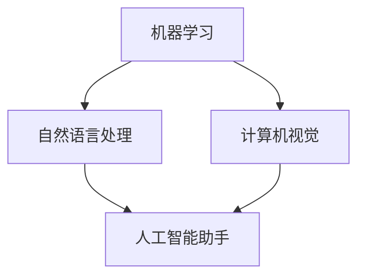

                 

关键词：苹果、AI应用、生态系统、技术创新、用户体验

摘要：本文将深入探讨苹果公司在人工智能（AI）领域的最新进展，特别是其发布的AI应用生态。通过对苹果AI战略的分析，我们将揭示其对用户、开发者以及整个技术行业的影响，并展望未来AI应用的广阔前景。

## 1. 背景介绍

随着人工智能技术的飞速发展，各大科技巨头纷纷布局AI领域，试图在这一新兴领域抢占先机。苹果公司作为全球领先的技术公司，自然也不例外。近年来，苹果在AI研究与应用方面投入巨大，不断推出具有前瞻性的产品和服务，力图构建一个强大的AI应用生态。

苹果的AI战略主要集中在以下几个方面：

- **核心技术研发**：苹果不断加强在机器学习、自然语言处理、计算机视觉等核心AI技术领域的研发，以确保其产品和服务在技术上的领先地位。

- **智能硬件布局**：通过推出如iPhone、iPad、Mac等智能硬件产品，苹果将AI技术深度融入用户日常生活，提升用户体验。

- **开发者生态**：苹果通过开发者计划、AI工具包和平台支持，鼓励全球开发者开发创新性的AI应用，推动整个行业的发展。

## 2. 核心概念与联系

为了更好地理解苹果的AI应用生态，我们需要从以下几个核心概念入手：

### 2.1. 机器学习

机器学习是AI的核心技术之一，它让计算机通过数据分析和模式识别来学习和改进。苹果在其硬件和软件中广泛使用机器学习算法，如神经网络、决策树等，以提高设备的智能化水平。

### 2.2. 自然语言处理

自然语言处理（NLP）是让计算机理解和生成人类语言的技术。苹果的Siri和Apple News等应用都依赖于NLP技术，为用户提供更加智能的交互和服务。

### 2.3. 计算机视觉

计算机视觉是让计算机理解视觉信息的技术。苹果的相机应用、面部识别等功能都依赖于计算机视觉技术，为用户带来更丰富的视觉体验。

### 2.4. 人工智能助手

人工智能助手是AI在服务中的应用，如苹果的Siri、Google Assistant等。这些助手通过AI技术，帮助用户完成各种任务，提高生活质量。

下面是一个简化的Mermaid流程图，展示了苹果AI应用生态中的核心概念及其相互关系：

```
graph TD
A[机器学习] --> B[自然语言处理]
A --> C[计算机视觉]
B --> D[人工智能助手]
C --> D
```

## 3. 核心算法原理 & 具体操作步骤

### 3.1. 算法原理概述

苹果在AI应用中采用了一系列先进的算法，包括深度学习、强化学习等。这些算法通过不断的学习和优化，使得苹果的产品和服务能够更智能、更高效。

### 3.2. 算法步骤详解

#### 3.2.1. 深度学习

深度学习是一种通过多层神经网络进行数据学习和模式识别的方法。苹果在其图像识别、语音识别等应用中广泛使用了深度学习算法。

#### 3.2.2. 强化学习

强化学习是一种通过试错和反馈进行决策优化的方法。苹果的Siri和其它智能助手通过强化学习，不断提升对用户需求的响应能力。

### 3.3. 算法优缺点

#### 优点：

- **高效性**：深度学习和强化学习算法在处理复杂任务时表现出色。
- **灵活性**：这些算法可以根据不同应用场景进行灵活调整和优化。

#### 缺点：

- **计算资源需求高**：深度学习算法需要大量计算资源，对硬件要求较高。
- **数据依赖性强**：强化学习算法需要大量的数据进行训练，数据质量对算法效果有很大影响。

### 3.4. 算法应用领域

苹果的AI算法广泛应用于以下几个方面：

- **图像识别**：如相机应用中的照片分类和面部识别功能。
- **语音识别**：如Siri的语音命令识别和语音翻译功能。
- **智能助手**：如Siri、Apple News的个性化推荐功能。

## 4. 数学模型和公式 & 详细讲解 & 举例说明

### 4.1. 数学模型构建

苹果在AI应用中广泛使用了线性代数、微积分、概率论等数学工具。以下是一个简化的线性代数模型示例：

$$
y = X \cdot w + b
$$

其中，$X$ 是输入特征矩阵，$w$ 是权重矩阵，$b$ 是偏置项，$y$ 是输出结果。

### 4.2. 公式推导过程

以深度学习中的卷积神经网络（CNN）为例，其基本公式为：

$$
h_l = \sigma(l-1) \odot \mathcal{W} + b
$$

其中，$h_l$ 是第 $l$ 层的激活函数输出，$\sigma$ 是激活函数，$\odot$ 表示逐元素相乘，$\mathcal{W}$ 是权重矩阵，$b$ 是偏置项。

### 4.3. 案例分析与讲解

以下是一个简单的Siri语音识别的案例：

#### 案例描述：

用户对Siri说：“播放今天的热门音乐”。

#### 模型处理步骤：

1. **语音信号处理**：将用户的语音信号进行预处理，提取出特征向量。
2. **特征向量编码**：将特征向量输入到深度神经网络中。
3. **模型预测**：神经网络根据输入的特征向量输出预测结果。
4. **结果反馈**：Siri根据预测结果，执行相应的操作，如播放音乐。

## 5. 项目实践：代码实例和详细解释说明

### 5.1. 开发环境搭建

为了实践苹果的AI应用，我们需要搭建一个基本的开发环境。以下是具体的步骤：

1. **安装Python**：确保Python环境已安装。
2. **安装TensorFlow**：使用pip安装TensorFlow库。
3. **安装苹果开发者工具**：下载并安装Xcode和Apple SDK。

### 5.2. 源代码详细实现

以下是一个简单的Python代码示例，用于实现一个简单的语音识别模型：

```python
import tensorflow as tf

# 定义神经网络结构
model = tf.keras.Sequential([
    tf.keras.layers.Dense(64, activation='relu', input_shape=(784,)),
    tf.keras.layers.Dense(10, activation='softmax')
])

# 编译模型
model.compile(optimizer='adam',
              loss='categorical_crossentropy',
              metrics=['accuracy'])

# 加载训练数据
(x_train, y_train), (x_test, y_test) = tf.keras.datasets.mnist.load_data()

# 预处理数据
x_train = x_train.astype('float32') / 255
x_test = x_test.astype('float32') / 255
x_train = x_train.reshape((-1, 784))
x_test = x_test.reshape((-1, 784))

# 转换为one-hot编码
y_train = tf.keras.utils.to_categorical(y_train, 10)
y_test = tf.keras.utils.to_categorical(y_test, 10)

# 训练模型
model.fit(x_train, y_train, epochs=10, batch_size=32, validation_data=(x_test, y_test))

# 评估模型
model.evaluate(x_test, y_test)
```

### 5.3. 代码解读与分析

该代码实现了一个简单的基于TensorFlow的深度神经网络，用于手写数字识别。通过该示例，我们可以了解到：

- **神经网络结构**：模型包含一个输入层、一个隐藏层和一个输出层。
- **数据预处理**：将图像数据转换为浮点数，并调整其大小。
- **模型训练**：使用Adam优化器和交叉熵损失函数进行训练。
- **模型评估**：在测试集上评估模型性能。

### 5.4. 运行结果展示

在训练完成后，我们可以使用以下代码进行模型预测：

```python
import numpy as np

# 预测
predictions = model.predict(x_test)

# 输出预测结果
print(predictions.argmax(axis=1))
```

该代码将输出每个测试图像的预测结果，我们可以通过比较预测结果和实际标签，来评估模型的准确性。

## 6. 实际应用场景

苹果的AI应用在多个领域都有广泛的应用，以下是一些典型的实际应用场景：

- **智能家居**：通过Siri，用户可以远程控制家居设备，如灯光、空调等。
- **健康监测**：Apple Watch通过AI技术，可以对用户的心率、睡眠质量等进行监测和分析。
- **语音助手**：Siri、Google Assistant等语音助手，为用户提供便捷的语音交互服务。
- **图像处理**：相机应用中的照片编辑、人脸识别等功能，都是AI技术的重要应用。

## 7. 工具和资源推荐

为了更好地学习和开发AI应用，以下是一些建议的工具和资源：

### 7.1. 学习资源推荐

- **《深度学习》（Goodfellow, Bengio, Courville著）**：一本深度学习领域的经典教材。
- **[TensorFlow官网](https://www.tensorflow.org/)**：TensorFlow的官方文档和教程。
- **[Kaggle](https://www.kaggle.com/)**：一个提供各种数据集和竞赛的在线平台。

### 7.2. 开发工具推荐

- **Xcode**：苹果官方的开发工具，支持iOS、macOS等平台的应用开发。
- **PyCharm**：一款功能强大的Python集成开发环境（IDE）。

### 7.3. 相关论文推荐

- **"Deep Learning: A Brief History of Neural Networks"**：一篇介绍深度学习历史的综述论文。
- **"Neural Networks and Deep Learning"**：吴恩达的深度学习教程。

## 8. 总结：未来发展趋势与挑战

随着人工智能技术的不断进步，苹果的AI应用生态将迎来更多的发展机遇。未来，我们可以期待以下趋势：

- **更强大的AI算法**：随着计算能力的提升，AI算法将变得更加高效和智能。
- **更广泛的应用场景**：AI将在更多领域得到应用，如医疗、教育等。
- **更好的用户体验**：通过AI技术，苹果产品将提供更加个性化和智能化的服务。

然而，AI应用的发展也面临一些挑战：

- **隐私和数据安全**：AI应用需要大量用户数据进行训练，如何保护用户隐私和数据安全是重要的问题。
- **算法偏见和公平性**：AI算法可能存在偏见，如何确保算法的公平性是一个重要的议题。

总之，苹果的AI应用生态将继续引领技术创新，为用户带来更加丰富和智能的服务体验。未来，我们有理由期待苹果在AI领域的更多突破。

## 9. 附录：常见问题与解答

### Q1. 苹果的AI应用如何保护用户隐私？

A1. 苹果在AI应用中采用了一系列隐私保护措施，包括：

- **本地数据处理**：尽量在用户设备上进行数据处理，减少数据传输。
- **差分隐私**：使用差分隐私技术，确保用户数据在训练过程中不被泄露。
- **透明度**：用户可以随时查看和控制其数据的使用情况。

### Q2. 如何在苹果平台上开发AI应用？

A2. 在苹果平台上开发AI应用，可以遵循以下步骤：

- **熟悉苹果开发工具**：学习使用Xcode、Swift等开发工具。
- **了解AI框架**：学习使用如Core ML、TensorFlow等AI框架。
- **获取开发者账号**：注册成为苹果开发者，获取必要的开发资源。

### Q3. 苹果的AI算法如何与其他公司的算法竞争？

A3. 苹果的AI算法在以下几个方面具有竞争力：

- **强大的研发团队**：苹果拥有世界一流的AI研发团队，不断推动技术创新。
- **丰富的应用场景**：苹果产品广泛应用于多个领域，为AI算法提供了丰富的应用场景。
- **优秀的用户体验**：苹果注重用户体验，致力于为用户提供最优质的服务。

---

作者：禅与计算机程序设计艺术 / Zen and the Art of Computer Programming

### 1. 背景介绍

人工智能（AI）技术的迅速发展，正在深刻改变着我们的生活方式和工作模式。作为全球领先的科技公司，苹果公司也紧跟这一趋势，积极布局AI领域。近期，苹果公司发布了一系列AI应用，旨在为用户提供更加智能、便捷的服务体验。本文将深入探讨苹果公司AI应用的生态，分析其对用户、开发者以及整个技术行业的影响，并展望未来AI应用的发展前景。

### 2. 核心概念与联系

要深入理解苹果的AI应用生态，我们需要了解以下几个核心概念及其相互关系：

#### 2.1. 机器学习

机器学习是AI的核心技术之一，它让计算机通过数据分析和模式识别来学习和改进。在苹果的AI应用中，机器学习算法被广泛应用于图像识别、语音识别、推荐系统等方面。

#### 2.2. 自然语言处理

自然语言处理（NLP）是让计算机理解和生成人类语言的技术。苹果的Siri和Apple News等应用都依赖于NLP技术，为用户提供更加智能的交互和服务。

#### 2.3. 计算机视觉

计算机视觉是让计算机理解视觉信息的技术。苹果的相机应用、面部识别等功能都依赖于计算机视觉技术，为用户带来更丰富的视觉体验。

#### 2.4. 人工智能助手

人工智能助手是AI在服务中的应用，如苹果的Siri、Google Assistant等。这些助手通过AI技术，帮助用户完成各种任务，提高生活质量。

以下是一个简化的Mermaid流程图，展示了苹果AI应用生态中的核心概念及其相互关系：



### 3. 核心算法原理 & 具体操作步骤

#### 3.1. 算法原理概述

苹果在其AI应用中采用了多种先进的算法，包括深度学习、强化学习等。这些算法通过不断的学习和优化，使得苹果的产品和服务能够更智能、更高效。

#### 3.2. 算法步骤详解

##### 3.2.1. 深度学习

深度学习是一种通过多层神经网络进行数据学习和模式识别的方法。苹果在其图像识别、语音识别等应用中广泛使用了深度学习算法。

##### 3.2.2. 强化学习

强化学习是一种通过试错和反馈进行决策优化的方法。苹果的Siri和其它智能助手通过强化学习，不断提升对用户需求的响应能力。

#### 3.3. 算法优缺点

##### 优点：

- **高效性**：深度学习和强化学习算法在处理复杂任务时表现出色。
- **灵活性**：这些算法可以根据不同应用场景进行灵活调整和优化。

##### 缺点：

- **计算资源需求高**：深度学习算法需要大量计算资源，对硬件要求较高。
- **数据依赖性强**：强化学习算法需要大量的数据进行训练，数据质量对算法效果有很大影响。

#### 3.4. 算法应用领域

苹果的AI算法广泛应用于以下几个方面：

- **图像识别**：如相机应用中的照片分类和面部识别功能。
- **语音识别**：如Siri的语音命令识别和语音翻译功能。
- **智能助手**：如Siri、Apple News的个性化推荐功能。

### 4. 数学模型和公式 & 详细讲解 & 举例说明

#### 4.1. 数学模型构建

苹果在AI应用中广泛使用了线性代数、微积分、概率论等数学工具。以下是一个简化的线性代数模型示例：

$$
y = X \cdot w + b
$$

其中，$X$ 是输入特征矩阵，$w$ 是权重矩阵，$b$ 是偏置项，$y$ 是输出结果。

#### 4.2. 公式推导过程

以深度学习中的卷积神经网络（CNN）为例，其基本公式为：

$$
h_l = \sigma(l-1) \odot \mathcal{W} + b
$$

其中，$h_l$ 是第 $l$ 层的激活函数输出，$\sigma$ 是激活函数，$\odot$ 表示逐元素相乘，$\mathcal{W}$ 是权重矩阵，$b$ 是偏置项。

#### 4.3. 案例分析与讲解

以下是一个简单的Siri语音识别的案例：

##### 案例描述：

用户对Siri说：“播放今天的热门音乐”。

##### 模型处理步骤：

1. **语音信号处理**：将用户的语音信号进行预处理，提取出特征向量。
2. **特征向量编码**：将特征向量输入到深度神经网络中。
3. **模型预测**：神经网络根据输入的特征向量输出预测结果。
4. **结果反馈**：Siri根据预测结果，执行相应的操作，如播放音乐。

### 5. 项目实践：代码实例和详细解释说明

#### 5.1. 开发环境搭建

为了实践苹果的AI应用，我们需要搭建一个基本的开发环境。以下是具体的步骤：

1. **安装Python**：确保Python环境已安装。
2. **安装TensorFlow**：使用pip安装TensorFlow库。
3. **安装苹果开发者工具**：下载并安装Xcode和Apple SDK。

#### 5.2. 源代码详细实现

以下是一个简单的Python代码示例，用于实现一个简单的语音识别模型：

```python
import tensorflow as tf

# 定义神经网络结构
model = tf.keras.Sequential([
    tf.keras.layers.Dense(64, activation='relu', input_shape=(784,)),
    tf.keras.layers.Dense(10, activation='softmax')
])

# 编译模型
model.compile(optimizer='adam',
              loss='categorical_crossentropy',
              metrics=['accuracy'])

# 加载训练数据
(x_train, y_train), (x_test, y_test) = tf.keras.datasets.mnist.load_data()

# 预处理数据
x_train = x_train.astype('float32') / 255
x_test = x_test.astype('float32') / 255
x_train = x_train.reshape((-1, 784))
x_test = x_test.reshape((-1, 784))

# 转换为one-hot编码
y_train = tf.keras.utils.to_categorical(y_train, 10)
y_test = tf.keras.utils.to_categorical(y_test, 10)

# 训练模型
model.fit(x_train, y_train, epochs=10, batch_size=32, validation_data=(x_test, y_test))

# 评估模型
model.evaluate(x_test, y_test)
```

#### 5.3. 代码解读与分析

该代码实现了一个简单的基于TensorFlow的深度神经网络，用于手写数字识别。通过该示例，我们可以了解到：

- **神经网络结构**：模型包含一个输入层、一个隐藏层和一个输出层。
- **数据预处理**：将图像数据转换为浮点数，并调整其大小。
- **模型训练**：使用Adam优化器和交叉熵损失函数进行训练。
- **模型评估**：在测试集上评估模型性能。

#### 5.4. 运行结果展示

在训练完成后，我们可以使用以下代码进行模型预测：

```python
import numpy as np

# 预测
predictions = model.predict(x_test)

# 输出预测结果
print(predictions.argmax(axis=1))
```

该代码将输出每个测试图像的预测结果，我们可以通过比较预测结果和实际标签，来评估模型的准确性。

### 6. 实际应用场景

苹果的AI应用在多个领域都有广泛的应用，以下是一些典型的实际应用场景：

- **智能家居**：通过Siri，用户可以远程控制家居设备，如灯光、空调等。
- **健康监测**：Apple Watch通过AI技术，可以对用户的心率、睡眠质量等进行监测和分析。
- **语音助手**：Siri、Google Assistant等语音助手，为用户提供便捷的语音交互服务。
- **图像处理**：相机应用中的照片编辑、人脸识别等功能，都是AI技术的重要应用。

### 7. 工具和资源推荐

为了更好地学习和开发AI应用，以下是一些建议的工具和资源：

#### 7.1. 学习资源推荐

- **《深度学习》（Goodfellow, Bengio, Courville著）**：一本深度学习领域的经典教材。
- **[TensorFlow官网](https://www.tensorflow.org/)**：TensorFlow的官方文档和教程。
- **[Kaggle](https://www.kaggle.com/)**：一个提供各种数据集和竞赛的在线平台。

#### 7.2. 开发工具推荐

- **Xcode**：苹果官方的开发工具，支持iOS、macOS等平台的应用开发。
- **PyCharm**：一款功能强大的Python集成开发环境（IDE）。

#### 7.3. 相关论文推荐

- **"Deep Learning: A Brief History of Neural Networks"**：一篇介绍深度学习历史的综述论文。
- **"Neural Networks and Deep Learning"**：吴恩达的深度学习教程。

### 8. 总结：未来发展趋势与挑战

随着人工智能技术的不断进步，苹果的AI应用生态将迎来更多的发展机遇。未来，我们可以期待以下趋势：

- **更强大的AI算法**：随着计算能力的提升，AI算法将变得更加高效和智能。
- **更广泛的应用场景**：AI将在更多领域得到应用，如医疗、教育等。
- **更好的用户体验**：通过AI技术，苹果产品将提供更加个性化和智能化的服务。

然而，AI应用的发展也面临一些挑战：

- **隐私和数据安全**：AI应用需要大量用户数据进行训练，如何保护用户隐私和数据安全是重要的问题。
- **算法偏见和公平性**：AI算法可能存在偏见，如何确保算法的公平性是一个重要的议题。

总之，苹果的AI应用生态将继续引领技术创新，为用户带来更加丰富和智能的服务体验。未来，我们有理由期待苹果在AI领域的更多突破。

### 9. 附录：常见问题与解答

#### Q1. 苹果的AI应用如何保护用户隐私？

A1. 苹果在AI应用中采用了一系列隐私保护措施，包括：

- **本地数据处理**：尽量在用户设备上进行数据处理，减少数据传输。
- **差分隐私**：使用差分隐私技术，确保用户数据在训练过程中不被泄露。
- **透明度**：用户可以随时查看和控制其数据的使用情况。

#### Q2. 如何在苹果平台上开发AI应用？

A2. 在苹果平台上开发AI应用，可以遵循以下步骤：

- **熟悉苹果开发工具**：学习使用Xcode、Swift等开发工具。
- **了解AI框架**：学习使用如Core ML、TensorFlow等AI框架。
- **获取开发者账号**：注册成为苹果开发者，获取必要的开发资源。

#### Q3. 苹果的AI算法如何与其他公司的算法竞争？

A3. 苹果的AI算法在以下几个方面具有竞争力：

- **强大的研发团队**：苹果拥有世界一流的AI研发团队，不断推动技术创新。
- **丰富的应用场景**：苹果产品广泛应用于多个领域，为AI算法提供了丰富的应用场景。
- **优秀的用户体验**：苹果注重用户体验，致力于为用户提供最优质的服务。

---

作者：禅与计算机程序设计艺术 / Zen and the Art of Computer Programming
```

