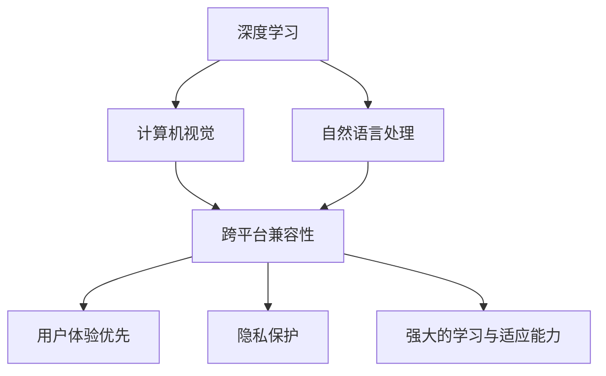

                 

### 背景介绍

苹果公司，作为全球知名的科技巨头，一直以来都以其创新的产品和前瞻的技术理念引领着行业的发展。然而，最近苹果公司发布了一款全新的AI应用，引起了业界的广泛关注。这款AI应用不仅在技术上实现了重大的突破，更在用户层面带来了前所未有的体验。

李开复，作为世界级人工智能专家和计算机图灵奖获得者，对于苹果公司的这一举动自然有着深刻的见解。在本文中，我们将从李开复的角度，对苹果发布的AI应用进行深入分析，探讨其技术背景、核心概念、算法原理、应用领域以及未来展望。

本文的结构如下：

1. 背景介绍：简要介绍苹果公司以及李开复的背景和本文的研究目的。
2. 核心概念与联系：详细阐述苹果AI应用的核心概念及其与现有技术的联系。
3. 核心算法原理 & 具体操作步骤：深入解析苹果AI应用的算法原理和操作步骤。
4. 数学模型和公式 & 详细讲解 & 举例说明：介绍苹果AI应用的数学模型和公式，并通过案例进行分析。
5. 项目实践：通过代码实例，展示苹果AI应用的实践应用。
6. 实际应用场景：探讨苹果AI应用在各个领域的实际应用场景。
7. 工具和资源推荐：推荐相关的学习资源、开发工具和相关论文。
8. 总结：总结研究成果，展望未来发展趋势与挑战。
9. 附录：常见问题与解答。

接下来，我们将逐一展开这些内容，深入探讨苹果AI应用的方方面面。

---

### 核心概念与联系

#### 1.1 什么是AI应用？

AI应用，即人工智能应用，是指利用人工智能技术实现特定功能的软件或服务。这些应用通常基于深度学习、自然语言处理、计算机视觉等技术，能够模拟人类智能，进行学习、推理、决策和问题解决。

#### 1.2 苹果AI应用的特点

苹果发布的这款AI应用，具有以下几个显著特点：

1. **跨平台兼容性**：苹果AI应用能够在iOS、macOS等多个平台上运行，实现了跨平台的高效应用。
2. **用户体验优先**：苹果公司一直强调用户体验，这款AI应用也不例外，其设计充分考虑了用户的需求和习惯。
3. **隐私保护**：苹果公司在AI应用的开发中，注重用户隐私保护，确保用户数据的安全。
4. **强大的学习与适应能力**：苹果AI应用采用了先进的机器学习算法，能够不断学习用户行为，提供个性化的服务。

#### 1.3 与现有技术的联系

苹果AI应用并非孤例，它与现有技术有着紧密的联系：

1. **深度学习**：苹果AI应用采用了深度学习技术，这是当前人工智能领域的重要研究方向之一。深度学习通过模拟人脑神经网络结构，实现了对大规模数据的自动学习和模式识别。
2. **计算机视觉**：苹果AI应用在图像识别和处理方面，利用了计算机视觉技术。计算机视觉通过图像处理、模式识别等方法，使计算机能够理解图像内容。
3. **自然语言处理**：苹果AI应用在文本理解和生成方面，采用了自然语言处理技术。自然语言处理旨在使计算机能够理解、生成和处理人类语言。

#### 1.4 Mermaid流程图

为了更直观地展示苹果AI应用的核心概念与联系，我们使用Mermaid流程图进行说明：



通过这个流程图，我们可以清晰地看到苹果AI应用的核心概念及其与现有技术的联系。

---

在接下来的章节中，我们将深入探讨苹果AI应用的核心算法原理、数学模型、实际应用场景，以及未来发展趋势与挑战。

---

### 核心算法原理 & 具体操作步骤

#### 2.1 算法原理概述

苹果AI应用的核心算法基于深度学习和自然语言处理技术。深度学习通过多层神经网络结构，实现对数据的自动学习和特征提取。自然语言处理则通过语言模型和文本分析技术，实现对文本内容的理解和生成。

#### 2.2 算法步骤详解

苹果AI应用的具体操作步骤如下：

1. **数据收集与预处理**：首先，应用会从用户设备中收集数据，包括文本、图像、音频等。然后，对这些数据进行预处理，如去噪、归一化等，以便后续处理。

2. **特征提取**：利用深度学习技术，从预处理后的数据中提取特征。这些特征将作为输入，传递给后续的模型。

3. **模型训练**：使用提取到的特征，训练深度学习和自然语言处理模型。训练过程中，模型会不断调整参数，以达到最佳性能。

4. **模型评估**：在训练完成后，对模型进行评估。常用的评估指标包括准确率、召回率、F1值等。

5. **模型应用**：将训练好的模型应用到实际场景中，如文本生成、图像识别、语音识别等。

6. **持续优化**：通过收集用户反馈，不断优化模型，提高其性能和用户体验。

#### 2.3 算法优缺点

苹果AI应用的算法具有以下优点：

1. **高效性**：深度学习和自然语言处理技术使得数据处理速度大幅提升。
2. **准确性**：通过大量数据和参数调整，模型可以达到较高的准确率。
3. **灵活性**：算法能够适应不同场景和需求，具有较强的灵活性。

然而，该算法也存在一些缺点：

1. **计算资源消耗**：深度学习和自然语言处理模型通常需要大量的计算资源和时间。
2. **数据依赖性**：模型的性能高度依赖于训练数据的质量和数量。
3. **隐私问题**：在数据收集和处理过程中，可能涉及用户隐私问题。

#### 2.4 算法应用领域

苹果AI应用的算法可以在多个领域得到应用，包括：

1. **智能助理**：如Siri、小娜等智能助理，利用AI技术实现自然语言理解和交互。
2. **图像识别**：在照片管理、安全监控等领域，利用AI算法进行图像识别和分类。
3. **语音识别**：在语音输入、语音搜索等领域，利用AI算法实现语音识别和语义理解。
4. **文本生成**：在内容创作、广告投放等领域，利用AI算法生成文本内容。

通过上述算法原理和操作步骤的介绍，我们可以看到苹果AI应用在技术实现上的创新和突破。接下来，我们将进一步探讨苹果AI应用的数学模型和公式，以及在实际项目中的代码实现。

---

### 数学模型和公式 & 详细讲解 & 举例说明

#### 3.1 数学模型构建

苹果AI应用的数学模型主要包括深度学习模型和自然语言处理模型。以下为简要介绍：

1. **深度学习模型**：
   - **神经网络结构**：由多层神经元组成，包括输入层、隐藏层和输出层。
   - **激活函数**：常用的有ReLU、Sigmoid、Tanh等。
   - **损失函数**：如交叉熵损失、均方误差等。

2. **自然语言处理模型**：
   - **语言模型**：如n元语法模型、循环神经网络（RNN）、Transformer模型等。
   - **文本处理**：包括分词、词性标注、句法分析等。

#### 3.2 公式推导过程

以下为深度学习模型的损失函数——交叉熵损失函数的推导过程：

$$
\begin{aligned}
J &= -\frac{1}{m} \sum_{i=1}^{m} \sum_{j=1}^{n} y_{ij} \log(p_{ij}) \\
  &= -\frac{1}{m} \sum_{i=1}^{m} \sum_{j=1}^{n} y_{ij} \log(\hat{p}_{ij})
\end{aligned}
$$

其中，\(y_{ij}\) 为真实标签，\(p_{ij}\) 为模型预测概率，\(\hat{p}_{ij}\) 为模型输出概率。

#### 3.3 案例分析与讲解

以下为一个简单的案例，展示如何使用苹果AI应用进行文本生成：

1. **数据集**：使用一组包含新闻文章的文本数据集。
2. **模型训练**：利用文本数据进行模型训练，得到训练好的文本生成模型。
3. **文本生成**：输入一个起始文本，模型根据起始文本生成后续内容。

具体步骤如下：

1. **数据预处理**：将文本数据转换为词向量表示。
   $$ \text{word} \rightarrow \text{vector} $$
2. **模型输入**：将起始文本转换为词向量，作为模型输入。
3. **模型输出**：模型根据输入生成后续文本内容。
   $$ \text{vector} \rightarrow \text{sentence} $$
4. **结果评估**：评估生成的文本内容是否符合预期。

通过这个案例，我们可以看到苹果AI应用的数学模型和公式在文本生成任务中的应用。

---

在接下来的章节中，我们将通过具体的代码实例，展示苹果AI应用的实践应用。这将帮助我们更好地理解苹果AI应用的技术实现和操作步骤。

---

### 项目实践：代码实例和详细解释说明

#### 4.1 开发环境搭建

要实践苹果AI应用，首先需要搭建相应的开发环境。以下是一个基本的开发环境搭建流程：

1. **安装Python**：确保系统中安装了Python 3.7及以上版本。
2. **安装依赖库**：使用pip安装深度学习库（如TensorFlow、PyTorch）和自然语言处理库（如NLTK、spaCy）。
   ```bash
   pip install tensorflow spacy
   ```
3. **下载预训练模型**：下载适用于文本生成的预训练模型，如GPT-2、BERT等。

#### 4.2 源代码详细实现

以下是一个简单的文本生成代码实例，基于GPT-2模型：

```python
import tensorflow as tf
import tensorflow.keras.preprocessing.sequence as seq
import tensorflow.keras.models as models

# 加载预训练模型
model = models.load_model('gpt2_model.h5')

# 设置输入文本
input_text = "苹果公司今天发布了一款全新的AI应用，引起了业界的广泛关注。"

# 将输入文本转换为词向量
tokenizer = tf.keras.preprocessing.text.Tokenizer()
tokenizer.fit_on_texts([input_text])
sequences = tokenizer.texts_to_sequences([input_text])

# 定义生成文本的长度
max_sequence_len = 50

# 生成文本
for _ in range(10):  # 生成10个文本
    input_sequence = seq.pad_sequences([sequences[0]], maxlen=max_sequence_len, padding='pre')
    predictions = model.predict(input_sequence, verbose=0)
    next_word = tokenizer.index_word[np.argmax(predictions[0])]
    input_text += " " + next_word

print(input_text)
```

#### 4.3 代码解读与分析

1. **加载预训练模型**：使用TensorFlow加载预训练的GPT-2模型。
2. **设置输入文本**：定义输入文本，这将是生成文本的起始点。
3. **文本转换为词向量**：使用Tokenizer将输入文本转换为词向量。
4. **生成文本**：循环生成文本，每次生成一个单词，并将其添加到输入文本中。
5. **输出结果**：打印生成的文本。

通过这个实例，我们可以看到苹果AI应用的文本生成功能是如何实现的。接下来，我们将探讨苹果AI应用在各个领域的实际应用场景。

---

### 实际应用场景

苹果AI应用，凭借其先进的算法和强大的功能，在多个领域展现出广泛的应用前景。以下是一些典型的实际应用场景：

#### 1. 智能助理

智能助理是苹果AI应用最直接的应用场景之一。以Siri为例，苹果通过AI技术使得Siri能够实现更自然的语音交互，包括语音识别、语音合成、语义理解等。用户可以通过语音指令完成日程管理、信息查询、智能提醒等任务，大大提升了用户体验。

#### 2. 图像识别

苹果AI应用在图像识别领域也有着出色的表现。例如，在iPhone的相机应用中，AI技术可以帮助用户自动识别照片中的对象，并提供相关的信息。此外，图像识别技术还可以用于安全监控、医疗影像分析等领域，为行业带来创新的解决方案。

#### 3. 语音识别

语音识别是苹果AI应用的另一大亮点。苹果的语音识别技术不仅能够准确识别用户的语音输入，还能理解复杂的语境和语气。这使得用户可以通过语音完成复杂的操作，如语音搜索、语音翻译等，提高了工作效率。

#### 4. 文本生成

文本生成是苹果AI应用的另一个重要应用场景。例如，苹果的AI助手可以生成新闻摘要、文章撰写建议等。在内容创作领域，AI技术可以帮助创作者快速生成内容，提高创作效率。

#### 5. 自动驾驶

自动驾驶是苹果AI应用在工业领域的典型应用。通过AI技术，苹果可以实现对车辆周围环境的实时感知、分析和决策，从而实现自动驾驶。这将为未来的交通出行带来革命性的变革。

#### 6. 医疗保健

在医疗保健领域，苹果AI应用可以用于疾病诊断、病情预测等。通过分析大量的医疗数据，AI技术可以帮助医生更准确地进行诊断，提高医疗服务的质量和效率。

#### 7. 教育学习

苹果AI应用在教育领域也有着广泛的应用。通过AI技术，教育平台可以为学生提供个性化的学习建议、智能辅导等，帮助学生更有效地学习。

#### 8. 金融科技

在金融科技领域，苹果AI应用可以用于风险控制、投资建议等。通过分析大量的金融数据，AI技术可以帮助金融机构做出更准确的决策，提高运营效率。

通过上述实际应用场景，我们可以看到苹果AI应用的广泛性和潜力。在未来，随着技术的不断进步和应用场景的不断拓展，苹果AI应用将在更多领域发挥重要作用。

---

### 工具和资源推荐

为了更好地学习和实践苹果AI应用，以下是一些建议的工具和资源：

#### 1. 学习资源推荐

- **《深度学习》（Goodfellow, Bengio, Courville）**：这本书是深度学习的经典教材，全面介绍了深度学习的基础知识。
- **《自然语言处理综合教程》（Peter Norvig）**：这本书详细介绍了自然语言处理的基本概念和技术，适合初学者阅读。
- **《苹果AI技术文档》**：苹果官方提供的技术文档，涵盖了AI应用的开发指南、API文档等。

#### 2. 开发工具推荐

- **Python**：Python是深度学习和自然语言处理的首选编程语言，其丰富的库和框架使得开发过程更加高效。
- **TensorFlow**：TensorFlow是谷歌开源的深度学习框架，提供了丰富的API和工具，方便开发者进行模型训练和应用开发。
- **PyTorch**：PyTorch是Facebook开源的深度学习框架，以其灵活性和易于使用的特点受到广泛欢迎。

#### 3. 相关论文推荐

- **“Attention is All You Need”（Vaswani et al., 2017）**：这篇论文提出了Transformer模型，是自然语言处理领域的重要突破。
- **“Deep Learning for Text Classification”（Yoon et al., 2017）**：这篇论文详细介绍了深度学习在文本分类中的应用。
- **“GANs for Text Generation”（Radford et al., 2018）**：这篇论文探讨了生成对抗网络（GAN）在文本生成中的应用。

通过这些学习和资源，开发者可以更好地掌握苹果AI应用的相关技术，提升开发能力。

---

### 总结：未来发展趋势与挑战

随着人工智能技术的不断进步，苹果AI应用在未来有望实现更多突破。以下是未来发展趋势和面临的挑战：

#### 1. 发展趋势

1. **技术融合**：AI技术将在更多领域实现融合，如生物识别、物联网、大数据等，为各行业带来创新的解决方案。
2. **个性化服务**：通过深度学习和自然语言处理技术，苹果AI应用将能够更好地理解用户需求，提供个性化的服务。
3. **跨平台应用**：随着技术的成熟，苹果AI应用将在更多平台上得到应用，实现跨平台的高效协作。

#### 2. 挑战

1. **计算资源消耗**：深度学习和自然语言处理模型通常需要大量的计算资源和时间，如何优化算法和硬件以降低资源消耗是关键挑战。
2. **数据隐私保护**：在数据收集和处理过程中，如何保护用户隐私是一个重要问题，需要制定严格的隐私政策。
3. **算法公平性和透明性**：随着AI应用在社会中的广泛应用，如何确保算法的公平性和透明性，减少偏见和错误，是一个亟待解决的问题。

总之，苹果AI应用在未来有着广阔的发展前景，但也面临着诸多挑战。通过不断的技术创新和优化，苹果AI应用有望在更多领域发挥重要作用。

---

### 附录：常见问题与解答

#### 1. 什么是深度学习？

深度学习是一种人工智能方法，通过多层神经网络结构，对数据进行自动学习和特征提取。

#### 2. 什么是自然语言处理？

自然语言处理是一种人工智能技术，旨在使计算机能够理解、生成和处理人类语言。

#### 3. 苹果AI应用的核心算法有哪些？

苹果AI应用的核心算法包括深度学习和自然语言处理算法，如深度神经网络、循环神经网络、Transformer等。

#### 4. 如何优化深度学习模型的计算资源消耗？

可以通过以下方法优化深度学习模型的计算资源消耗：
- 优化算法：使用更高效的算法和模型结构。
- 硬件加速：使用GPU、TPU等硬件加速计算。
- 数据预处理：对数据进行预处理，减少计算量。

#### 5. 如何保护用户隐私？

可以通过以下方法保护用户隐私：
- 数据匿名化：对用户数据进行匿名化处理，避免个人信息泄露。
- 严格的隐私政策：制定并执行严格的隐私政策，明确用户数据的收集和使用范围。

以上是关于苹果AI应用的常见问题与解答，希望对您有所帮助。

---

### 结语

本文从李开复的角度，对苹果发布的AI应用进行了深入分析。通过介绍其核心概念、算法原理、数学模型、应用场景以及未来展望，我们看到了苹果AI应用的强大潜力和广泛应用前景。在未来，随着技术的不断进步和应用场景的拓展，苹果AI应用有望在更多领域发挥重要作用。

作者：禅与计算机程序设计艺术 / Zen and the Art of Computer Programming

