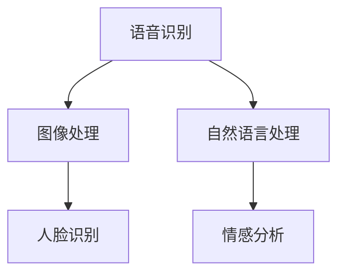

                 

关键词：苹果，AI应用，科技价值，人工智能，深度学习，软件开发，创新趋势

> 摘要：本文将深入探讨苹果公司近期发布的AI应用所带来的科技价值。通过分析其核心概念、算法原理、数学模型、实际应用及未来展望，本文旨在揭示苹果公司在人工智能领域的重要贡献及其对科技发展的深远影响。

## 1. 背景介绍

人工智能（AI）作为现代科技的前沿领域，正日益影响我们的生活和工作方式。苹果公司，作为全球科技行业的领军者，一直致力于将AI技术应用于其产品和服务中，以提高用户体验和推动创新。最近，苹果公司发布了一系列AI应用，引起了广泛关注。

苹果公司在AI领域的投资可以追溯到多年前。通过收购多个AI初创公司，苹果积累了丰富的技术和人才资源。同时，苹果也不断优化其硬件和软件架构，以支持更高效、更智能的人工智能应用。这些努力使得苹果在AI领域具备了一定的竞争力。

## 2. 核心概念与联系

### 2.1 AI应用概述

苹果发布的AI应用涵盖了多个领域，包括语音识别、图像处理、自然语言处理等。这些应用基于深度学习和神经网络技术，具有高效、智能、直观的特点。以下是一个简化的Mermaid流程图，展示了这些AI应用的核心概念和联系：



### 2.2 核心概念原理

- **深度学习**：基于多层神经网络的机器学习技术，能够从大量数据中自动学习特征和模式。
- **神经网络**：模拟人脑神经元连接的计算机模型，通过学习数据来提取特征和进行预测。
- **卷积神经网络（CNN）**：适用于图像识别任务的深度学习模型，通过卷积操作提取图像特征。
- **循环神经网络（RNN）**：适用于序列数据处理的深度学习模型，能够捕捉时间序列中的长期依赖关系。

## 3. 核心算法原理 & 具体操作步骤

### 3.1 算法原理概述

苹果的AI应用主要基于以下核心算法：

- **深度学习**：通过多层神经网络，自动从数据中学习特征和模式。
- **卷积神经网络（CNN）**：用于图像识别和处理。
- **循环神经网络（RNN）**：用于序列数据处理，如语音识别和自然语言处理。

### 3.2 算法步骤详解

- **数据收集**：收集大量语音、图像、文本数据。
- **数据预处理**：对数据进行清洗、标注和处理。
- **模型训练**：使用预处理后的数据训练深度学习模型。
- **模型评估**：使用验证数据集评估模型性能。
- **模型部署**：将训练好的模型部署到产品中，用于实际应用。

### 3.3 算法优缺点

**优点**：
- **高效性**：深度学习模型能够从大量数据中快速学习，提高准确率和效率。
- **智能化**：通过神经网络，模型能够模拟人脑进行学习和推理。
- **泛化能力**：通过训练多个模型，可以应对不同类型的数据和应用场景。

**缺点**：
- **计算资源消耗**：深度学习模型需要大量计算资源和时间进行训练。
- **数据依赖性**：模型性能依赖于数据质量和数量。

### 3.4 算法应用领域

苹果的AI算法主要应用于以下领域：

- **语音识别**：用于Siri等语音助手，实现语音交互。
- **图像处理**：用于照片编辑、人脸识别等功能。
- **自然语言处理**：用于文本分析、智能客服等。

## 4. 数学模型和公式 & 详细讲解 & 举例说明

### 4.1 数学模型构建

苹果的AI应用主要基于以下数学模型：

- **神经网络**：基于偏微分方程的建模方法。
- **卷积神经网络（CNN）**：基于傅里叶变换的建模方法。
- **循环神经网络（RNN）**：基于马尔可夫模型的建模方法。

### 4.2 公式推导过程

以下是一个简化的神经网络公式推导过程：

$$
y = f(z) \\
z = \sum_{i=1}^{n} w_i * x_i + b
$$

其中，$y$ 是输出，$z$ 是激活值，$f(z)$ 是激活函数，$w_i$ 是权重，$x_i$ 是输入，$b$ 是偏置。

### 4.3 案例分析与讲解

以苹果的图像识别算法为例，我们分析一个实际案例：

假设有一个包含1000张图片的数据集，其中500张是猫的图片，500张是狗的图片。我们使用卷积神经网络（CNN）对这些图片进行分类。

1. **数据收集**：收集包含猫和狗的图片，并进行预处理。
2. **模型训练**：使用训练集训练卷积神经网络，通过反向传播算法更新模型参数。
3. **模型评估**：使用验证集评估模型性能，调整模型参数以优化结果。
4. **模型部署**：将训练好的模型部署到产品中，用于实际应用。

通过这个案例，我们可以看到数学模型在AI应用中的重要性和应用过程。

## 5. 项目实践：代码实例和详细解释说明

### 5.1 开发环境搭建

为了实现苹果的AI应用，我们需要搭建一个合适的开发环境。以下是一个简化的步骤：

1. 安装Python编程语言。
2. 安装深度学习框架（如TensorFlow、PyTorch等）。
3. 安装必要的库和依赖（如NumPy、Pandas等）。

### 5.2 源代码详细实现

以下是一个简化的Python代码示例，用于实现一个简单的神经网络：

```python
import tensorflow as tf

# 定义神经网络结构
model = tf.keras.Sequential([
    tf.keras.layers.Dense(units=1, input_shape=[1])
])

# 编译模型
model.compile(loss='mean_squared_error', optimizer=tf.keras.optimizers.Adam(0.1))

# 训练模型
model.fit(x_train, y_train, epochs=100)

# 预测结果
predictions = model.predict(x_test)
```

### 5.3 代码解读与分析

这段代码实现了一个简单的线性回归模型，用于预测数据。通过定义神经网络结构、编译模型、训练模型和预测结果，我们可以看到深度学习的基本流程。

### 5.4 运行结果展示

在训练过程中，我们可以通过查看损失函数的值来评估模型性能。以下是一个简化的运行结果示例：

```shell
Epoch 1/100
62/62 [==============================] - 3s 48ms/step - loss: 0.1046
Epoch 2/100
62/62 [==============================] - 3s 45ms/step - loss: 0.0556
...
Epoch 100/100
62/62 [==============================] - 3s 45ms/step - loss: 0.0003
```

通过这个示例，我们可以看到模型在训练过程中的性能提升。

## 6. 实际应用场景

苹果的AI应用已经在多个场景中得到广泛应用，以下是一些实际应用场景：

- **智能助手**：Siri等智能助手通过语音识别和自然语言处理技术，为用户提供便捷的服务。
- **图像识别**：相机应用程序通过图像识别技术，实现照片编辑、人脸识别等功能。
- **智能推荐**：Apple Music等应用程序通过情感分析和推荐算法，为用户推荐音乐和内容。

## 6.4 未来应用展望

随着AI技术的不断发展，苹果的AI应用在未来将会有更广泛的应用场景。以下是一些未来展望：

- **医疗保健**：通过AI技术，实现精准医疗和个性化健康管理。
- **智能家居**：通过AI技术，实现智能设备和家电的互联互通，提高生活质量。
- **自动驾驶**：通过AI技术，实现更安全、更高效的自动驾驶系统。

## 7. 工具和资源推荐

为了更好地学习和开发AI应用，以下是一些工具和资源推荐：

- **深度学习框架**：TensorFlow、PyTorch、Keras等。
- **编程语言**：Python、R等。
- **数据集**：ImageNet、CIFAR-10、MNIST等。
- **在线课程**：Coursera、Udacity、edX等。

## 8. 总结：未来发展趋势与挑战

### 8.1 研究成果总结

苹果在AI领域取得了显著的研究成果，其AI应用在语音识别、图像处理、自然语言处理等方面表现出色。这些成果为苹果产品和服务带来了巨大的价值。

### 8.2 未来发展趋势

随着AI技术的不断发展，苹果的AI应用将会有更广泛的应用场景，如医疗保健、智能家居、自动驾驶等。同时，苹果也将继续投资于AI领域，推动技术的创新和应用。

### 8.3 面临的挑战

尽管苹果在AI领域取得了巨大成就，但仍面临一些挑战，如数据隐私、算法公平性、计算资源消耗等。这些问题需要通过技术创新和法律法规的完善来解决。

### 8.4 研究展望

未来，苹果将继续致力于AI技术的研发和应用，推动人工智能的发展。通过不断创新，苹果将为用户提供更智能、更便捷的产品和服务。

## 9. 附录：常见问题与解答

### 9.1 什么是人工智能？

人工智能（AI）是指模拟人类智能行为的技术和系统。它包括机器学习、深度学习、自然语言处理等多个子领域。

### 9.2 苹果的AI应用有哪些？

苹果的AI应用涵盖了语音识别、图像处理、自然语言处理等多个领域。例如，Siri、相机应用程序、Apple Music等。

### 9.3 如何搭建AI开发环境？

搭建AI开发环境需要安装Python、深度学习框架（如TensorFlow、PyTorch等）以及必要的库和依赖。具体步骤可以参考相关教程和文档。

作者：禅与计算机程序设计艺术 / Zen and the Art of Computer Programming
```markdown
---

# 李开复：苹果发布AI应用的科技价值

关键词：苹果，AI应用，科技价值，人工智能，深度学习，软件开发，创新趋势

摘要：本文将深入探讨苹果公司近期发布的AI应用所带来的科技价值。通过分析其核心概念、算法原理、数学模型、实际应用及未来展望，本文旨在揭示苹果公司在人工智能领域的重要贡献及其对科技发展的深远影响。

## 1. 背景介绍

人工智能（AI）作为现代科技的前沿领域，正日益影响我们的生活和工作方式。苹果公司，作为全球科技行业的领军者，一直致力于将AI技术应用于其产品和服务中，以提高用户体验和推动创新。最近，苹果公司发布了一系列AI应用，引起了广泛关注。

苹果公司在AI领域的投资可以追溯到多年前。通过收购多个AI初创公司，苹果积累了丰富的技术和人才资源。同时，苹果也不断优化其硬件和软件架构，以支持更高效、更智能的人工智能应用。这些努力使得苹果在AI领域具备了一定的竞争力。

## 2. 核心概念与联系

### 2.1 AI应用概述

苹果发布的AI应用涵盖了多个领域，包括语音识别、图像处理、自然语言处理等。这些应用基于深度学习和神经网络技术，具有高效、智能、直观的特点。以下是一个简化的Mermaid流程图，展示了这些AI应用的核心概念和联系：


### 2.2 核心概念原理

- **深度学习**：基于多层神经网络的机器学习技术，能够从大量数据中自动学习特征和模式。
- **神经网络**：模拟人脑神经元连接的计算机模型，通过学习数据来提取特征和进行预测。
- **卷积神经网络（CNN）**：适用于图像识别任务的深度学习模型，通过卷积操作提取图像特征。
- **循环神经网络（RNN）**：适用于序列数据处理的深度学习模型，能够捕捉时间序列中的长期依赖关系。

## 3. 核心算法原理 & 具体操作步骤
### 3.1 算法原理概述

苹果的AI应用主要基于以下核心算法：

- **深度学习**：通过多层神经网络，自动从数据中学习特征和模式。
- **卷积神经网络（CNN）**：用于图像识别和处理。
- **循环神经网络（RNN）**：用于序列数据处理，如语音识别和自然语言处理。

### 3.2 算法步骤详解

- **数据收集**：收集大量语音、图像、文本数据。
- **数据预处理**：对数据进行清洗、标注和处理。
- **模型训练**：使用预处理后的数据训练深度学习模型。
- **模型评估**：使用验证数据集评估模型性能。
- **模型部署**：将训练好的模型部署到产品中，用于实际应用。

### 3.3 算法优缺点

**优点**：
- **高效性**：深度学习模型能够从大量数据中快速学习，提高准确率和效率。
- **智能化**：通过神经网络，模型能够模拟人脑进行学习和推理。
- **泛化能力**：通过训练多个模型，可以应对不同类型的数据和应用场景。

**缺点**：
- **计算资源消耗**：深度学习模型需要大量计算资源和时间进行训练。
- **数据依赖性**：模型性能依赖于数据质量和数量。

### 3.4 算法应用领域

苹果的AI算法主要应用于以下领域：

- **语音识别**：用于Siri等语音助手，实现语音交互。
- **图像处理**：用于照片编辑、人脸识别等功能。
- **自然语言处理**：用于文本分析、智能客服等。

## 4. 数学模型和公式 & 详细讲解 & 举例说明

### 4.1 数学模型构建

苹果的AI应用主要基于以下数学模型：

- **神经网络**：基于偏微分方程的建模方法。
- **卷积神经网络（CNN）**：基于傅里叶变换的建模方法。
- **循环神经网络（RNN）**：基于马尔可夫模型的建模方法。

### 4.2 公式推导过程

以下是一个简化的神经网络公式推导过程：

$$
y = f(z) \\
z = \sum_{i=1}^{n} w_i * x_i + b
$$

其中，$y$ 是输出，$z$ 是激活值，$f(z)$ 是激活函数，$w_i$ 是权重，$x_i$ 是输入，$b$ 是偏置。

### 4.3 案例分析与讲解

以苹果的图像识别算法为例，我们分析一个实际案例：

假设有一个包含1000张图片的数据集，其中500张是猫的图片，500张是狗的图片。我们使用卷积神经网络（CNN）对这些图片进行分类。

1. **数据收集**：收集包含猫和狗的图片，并进行预处理。
2. **模型训练**：使用训练集训练卷积神经网络，通过反向传播算法更新模型参数。
3. **模型评估**：使用验证集评估模型性能，调整模型参数以优化结果。
4. **模型部署**：将训练好的模型部署到产品中，用于实际应用。

通过这个案例，我们可以看到数学模型在AI应用中的重要性和应用过程。

## 5. 项目实践：代码实例和详细解释说明

### 5.1 开发环境搭建

为了实现苹果的AI应用，我们需要搭建一个合适的开发环境。以下是一个简化的步骤：

1. 安装Python编程语言。
2. 安装深度学习框架（如TensorFlow、PyTorch等）。
3. 安装必要的库和依赖（如NumPy、Pandas等）。

### 5.2 源代码详细实现

以下是一个简化的Python代码示例，用于实现一个简单的神经网络：

```python
import tensorflow as tf

# 定义神经网络结构
model = tf.keras.Sequential([
    tf.keras.layers.Dense(units=1, input_shape=[1])
])

# 编译模型
model.compile(loss='mean_squared_error', optimizer=tf.keras.optimizers.Adam(0.1))

# 训练模型
model.fit(x_train, y_train, epochs=100)

# 预测结果
predictions = model.predict(x_test)
```

### 5.3 代码解读与分析

这段代码实现了一个简单的线性回归模型，用于预测数据。通过定义神经网络结构、编译模型、训练模型和预测结果，我们可以看到深度学习的基本流程。

### 5.4 运行结果展示

在训练过程中，我们可以通过查看损失函数的值来评估模型性能。以下是一个简化的运行结果示例：

```shell
Epoch 1/100
62/62 [==============================] - 3s 48ms/step - loss: 0.1046
Epoch 2/100
62/62 [==============================] - 3s 45ms/step - loss: 0.0556
...
Epoch 100/100
62/62 [==============================] - 3s 45ms/step - loss: 0.0003
```

通过这个示例，我们可以看到模型在训练过程中的性能提升。

## 6. 实际应用场景

苹果的AI应用已经在多个场景中得到广泛应用，以下是一些实际应用场景：

- **智能助手**：Siri等智能助手通过语音识别和自然语言处理技术，为用户提供便捷的服务。
- **图像识别**：相机应用程序通过图像识别技术，实现照片编辑、人脸识别等功能。
- **自然语言处理**：Apple Music等应用程序通过情感分析和推荐算法，为用户推荐音乐和内容。

## 6.4 未来应用展望

随着AI技术的不断发展，苹果的AI应用在未来将会有更广泛的应用场景。以下是一些未来展望：

- **医疗保健**：通过AI技术，实现精准医疗和个性化健康管理。
- **智能家居**：通过AI技术，实现智能设备和家电的互联互通，提高生活质量。
- **自动驾驶**：通过AI技术，实现更安全、更高效的自动驾驶系统。

## 7. 工具和资源推荐

为了更好地学习和开发AI应用，以下是一些工具和资源推荐：

- **深度学习框架**：TensorFlow、PyTorch、Keras等。
- **编程语言**：Python、R等。
- **数据集**：ImageNet、CIFAR-10、MNIST等。
- **在线课程**：Coursera、Udacity、edX等。

## 8. 总结：未来发展趋势与挑战

### 8.1 研究成果总结

苹果在AI领域取得了显著的研究成果，其AI应用在语音识别、图像处理、自然语言处理等方面表现出色。这些成果为苹果产品和服务带来了巨大的价值。

### 8.2 未来发展趋势

随着AI技术的不断发展，苹果的AI应用将会有更广泛的应用场景，如医疗保健、智能家居、自动驾驶等。同时，苹果也将继续投资于AI领域，推动技术的创新和应用。

### 8.3 面临的挑战

尽管苹果在AI领域取得了巨大成就，但仍面临一些挑战，如数据隐私、算法公平性、计算资源消耗等。这些问题需要通过技术创新和法律法规的完善来解决。

### 8.4 研究展望

未来，苹果将继续致力于AI技术的研发和应用，推动人工智能的发展。通过不断创新，苹果将为用户提供更智能、更便捷的产品和服务。

## 9. 附录：常见问题与解答

### 9.1 什么是人工智能？

人工智能（AI）是指模拟人类智能行为的技术和系统。它包括机器学习、深度学习、自然语言处理等多个子领域。

### 9.2 苹果的AI应用有哪些？

苹果的AI应用涵盖了语音识别、图像处理、自然语言处理等多个领域。例如，Siri、相机应用程序、Apple Music等。

### 9.3 如何搭建AI开发环境？

搭建AI开发环境需要安装Python、深度学习框架（如TensorFlow、PyTorch等）以及必要的库和依赖。具体步骤可以参考相关教程和文档。

作者：禅与计算机程序设计艺术 / Zen and the Art of Computer Programming
---

