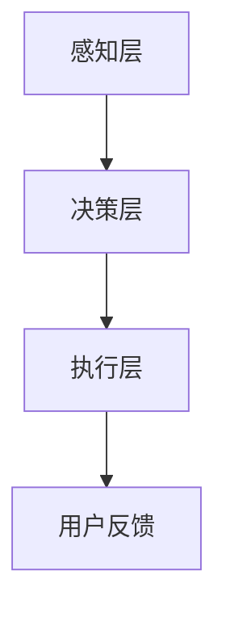
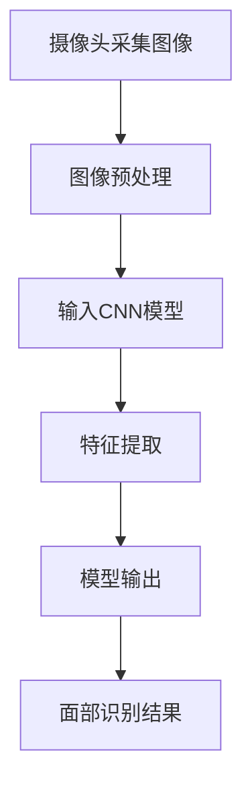
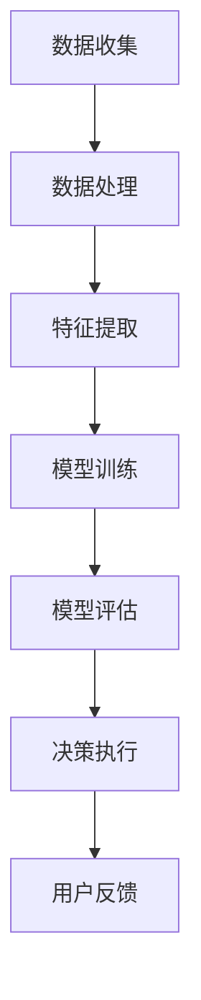

                 

关键词：苹果、AI应用、趋势、人工智能、技术发展

> 摘要：随着人工智能技术的快速发展，苹果公司一直在积极探索和引入AI技术，推出了一系列创新性的AI应用。本文将分析苹果发布AI应用的趋势，探讨其在技术领域的重要性和潜在影响。

## 1. 背景介绍

### 1.1 人工智能的崛起

人工智能（Artificial Intelligence，简称AI）是计算机科学的一个分支，旨在使计算机模拟人类的智能行为。近年来，得益于深度学习、大数据、云计算等技术的迅猛发展，人工智能取得了显著的突破。AI技术已经广泛应用于各个领域，从医疗、金融到零售、教育，都展现了其巨大的潜力和价值。

### 1.2 苹果公司的AI战略

苹果公司一直重视技术创新，将人工智能视为未来发展的重要方向。自2011年推出Siri以来，苹果公司在AI领域取得了多项重要进展。通过收购多家AI初创公司，苹果积累了丰富的AI技术储备，并在硬件和软件层面不断进行优化和提升。苹果公司希望通过AI技术，为用户带来更加智能、便捷的体验。

## 2. 核心概念与联系

### 2.1 AI应用的分类

AI应用主要分为两类：通用AI和应用AI。通用AI旨在实现人工智能的全面智能化，具有广泛的应用前景，但目前仍处于研究阶段。应用AI则针对特定领域或任务进行优化，具有较高的实用价值。苹果公司目前主要聚焦于应用AI的研发和应用。

### 2.2 苹果公司的AI架构

苹果公司的AI架构分为三个层次：感知层、决策层和执行层。感知层主要收集和处理用户输入的数据，如语音、图像等；决策层利用AI算法对数据进行分析和判断，为用户提供智能化的建议和反馈；执行层则将决策层的建议转化为具体的操作，如调整系统设置、推荐内容等。

### 2.3 Mermaid流程图

以下是一个简化的苹果公司AI应用的Mermaid流程图，展示了感知层、决策层和执行层之间的关系：



## 3. 核心算法原理 & 具体操作步骤

### 3.1 算法原理概述

苹果公司在AI应用中主要采用深度学习和自然语言处理等技术。深度学习通过构建多层神经网络，对大量数据进行学习和建模，从而实现图像识别、语音识别等功能。自然语言处理则致力于理解和生成自然语言，如语言翻译、文本摘要等。

### 3.2 算法步骤详解

1. **数据收集与预处理**：收集用户输入的数据，如语音、图像等，并进行数据清洗和预处理，以提高数据质量和模型的准确性。
2. **模型训练**：利用深度学习和自然语言处理算法，对预处理后的数据进行训练，构建AI模型。
3. **模型评估与优化**：对训练好的模型进行评估和优化，以提高模型的准确性和稳定性。
4. **模型部署与迭代**：将优化后的模型部署到苹果设备中，并持续进行迭代和优化，以提升用户体验。

### 3.3 算法优缺点

**优点**：

- **高准确性**：深度学习和自然语言处理算法具有高准确性和稳定性，能够为用户提供精准的智能服务。
- **高效性**：苹果设备具备强大的计算能力和高效的算法优化，能够快速处理用户请求，提供即时响应。

**缺点**：

- **数据隐私**：AI应用需要收集和处理大量用户数据，可能引发数据隐私和安全问题。
- **模型解释性**：深度学习算法具有较强的黑盒特性，模型的决策过程不够透明，难以解释。

### 3.4 算法应用领域

苹果公司的AI应用主要涵盖以下领域：

- **语音助手**：如Siri、语音识别等。
- **图像识别**：如面部识别、照片分类等。
- **自然语言处理**：如语言翻译、文本摘要等。
- **推荐系统**：如内容推荐、商品推荐等。

## 4. 数学模型和公式 & 详细讲解 & 举例说明

### 4.1 数学模型构建

苹果公司的AI应用主要基于深度学习和自然语言处理技术。深度学习模型通常采用多层感知机（MLP）、卷积神经网络（CNN）和循环神经网络（RNN）等架构。自然语言处理模型则包括词嵌入（Word Embedding）、序列到序列模型（Seq2Seq）等。

以下是一个简单的卷积神经网络模型架构：

```latex
$$
\begin{array}{ccccccc}
& \text{Input} & \rightarrow & \text{Convolution} & \rightarrow & \text{Pooling} & \rightarrow & \text{Fully Connected} & \rightarrow & \text{Output} \\
\end{array}
$$
```

### 4.2 公式推导过程

卷积神经网络的基本公式如下：

$$
h_{l}^{i} = \sigma \left( \sum_{j} w_{l-1}^{ij} h_{l-1}^{j} + b_{l}^{i} \right)
$$

其中，$h_{l}^{i}$ 表示第$l$层的第$i$个神经元输出，$w_{l-1}^{ij}$ 和 $b_{l}^{i}$ 分别表示权重和偏置，$\sigma$ 表示激活函数。

### 4.3 案例分析与讲解

以面部识别为例，苹果公司使用卷积神经网络（CNN）进行面部识别。首先，通过摄像头采集用户的面部图像，然后对图像进行预处理，包括缩放、裁剪等操作。接着，将预处理后的图像输入到CNN模型中进行特征提取，最后利用模型输出结果进行面部识别。

以下是一个简单的面部识别过程示例：



## 5. 项目实践：代码实例和详细解释说明

### 5.1 开发环境搭建

在搭建开发环境时，首先需要安装Python和相关的AI库，如TensorFlow、PyTorch等。以下是一个简单的安装命令：

```bash
pip install tensorflow
```

### 5.2 源代码详细实现

以下是一个简单的面部识别代码实例，使用TensorFlow和Keras构建卷积神经网络模型：

```python
import tensorflow as tf
from tensorflow.keras.models import Sequential
from tensorflow.keras.layers import Conv2D, MaxPooling2D, Flatten, Dense

# 创建模型
model = Sequential()
model.add(Conv2D(32, (3, 3), activation='relu', input_shape=(64, 64, 3)))
model.add(MaxPooling2D((2, 2)))
model.add(Flatten())
model.add(Dense(128, activation='relu'))
model.add(Dense(1, activation='sigmoid'))

# 编译模型
model.compile(optimizer='adam', loss='binary_crossentropy', metrics=['accuracy'])

# 训练模型
model.fit(x_train, y_train, epochs=10, batch_size=32)
```

### 5.3 代码解读与分析

上述代码首先导入了TensorFlow库和相关的模型层，然后创建了一个序列模型，并添加了卷积层、池化层、全连接层等。接着，编译并训练了模型。代码的解读和分析如下：

- **模型构建**：使用Sequential模型构建卷积神经网络，包括卷积层（Conv2D）、池化层（MaxPooling2D）、全连接层（Dense）等。
- **编译模型**：设置模型的优化器（optimizer）、损失函数（loss）和评估指标（metrics）。
- **训练模型**：使用训练数据（x_train和y_train）对模型进行训练，设置训练轮数（epochs）和批量大小（batch_size）。

### 5.4 运行结果展示

训练完成后，可以使用以下代码进行模型评估和测试：

```python
# 评估模型
model.evaluate(x_test, y_test)

# 预测结果
predictions = model.predict(x_test)
```

上述代码首先评估了模型的性能，然后使用测试数据（x_test）进行预测，并输出预测结果。

## 6. 实际应用场景

### 6.1 语音助手

苹果公司的Siri是一款基于语音识别和自然语言处理技术的智能语音助手，用户可以通过语音与Siri进行交互，实现查询天气、播放音乐、设置提醒等功能。

### 6.2 图像识别

面部识别是苹果公司的一项重要技术，广泛应用于iPhone的解锁、支付等场景。此外，苹果公司还在图像识别领域进行了大量研究，如照片分类、图像搜索等。

### 6.3 自然语言处理

苹果公司的自然语言处理技术在Siri、苹果新闻、苹果地图等应用中得到了广泛应用。如Siri可以根据用户的问题提供相关的信息，苹果新闻可以根据用户兴趣推荐相关新闻，苹果地图可以提供实时交通信息等。

### 6.4 未来应用展望

随着人工智能技术的不断发展，苹果公司有望在更多领域推出创新的AI应用。如智能健康管理、智能家居控制、智能教育等，为用户提供更加智能化、个性化的服务。

## 7. 工具和资源推荐

### 7.1 学习资源推荐

- 《深度学习》（Goodfellow、Bengio和Courville著）：介绍深度学习的基本原理和应用。
- 《Python机器学习》（Sebastian Raschka和Vahid Mirjalili著）：介绍机器学习在Python中的应用。
- 《自然语言处理实战》（Siri和Jurafsky著）：介绍自然语言处理的基本原理和应用。

### 7.2 开发工具推荐

- TensorFlow：一款流行的开源深度学习框架，适用于构建和训练深度学习模型。
- PyTorch：一款流行的开源深度学习框架，具有灵活的动态计算图功能。
- Keras：一款流行的深度学习库，提供了简单的API和丰富的预训练模型。

### 7.3 相关论文推荐

- "Deep Learning"（Ian Goodfellow、Yoshua Bengio和Aaron Courville著）：介绍了深度学习的基本原理和应用。
- "A Theoretical Framework for Backpropagation"（Yoshua Bengio、Pierre Simard和Pascal Frasconi著）：介绍了反向传播算法的理论基础。
- "Recurrent Neural Network Based Language Model"（Yoshua Bengio、Stéphane Bengio和Pascal Frasconi著）：介绍了循环神经网络在自然语言处理中的应用。

## 8. 总结：未来发展趋势与挑战

### 8.1 研究成果总结

随着人工智能技术的不断发展，苹果公司在AI领域取得了显著成果。从Siri的语音识别、面部识别，到自然语言处理、图像识别，苹果公司已经在多个领域实现了技术突破。这些研究成果为苹果公司带来了丰富的商业价值，也为用户提供了更加智能、便捷的体验。

### 8.2 未来发展趋势

未来，苹果公司有望在更多领域推出创新的AI应用。随着深度学习、自然语言处理等技术的不断进步，苹果公司的AI应用将更加智能、个性化。同时，苹果公司也将加大对AI研究和技术创新的投入，推动人工智能技术的发展。

### 8.3 面临的挑战

尽管苹果公司在AI领域取得了显著成果，但仍然面临一些挑战。首先，数据隐私和安全问题是一个重要挑战，如何在保护用户隐私的同时，充分利用数据价值，是一个亟待解决的问题。其次，模型的透明性和可解释性也是一个挑战，如何让用户理解模型的决策过程，提高用户的信任度，是一个重要课题。

### 8.4 研究展望

未来，苹果公司在AI领域的研究有望在以下方向取得突破：

1. **通用AI**：虽然通用AI目前仍处于研究阶段，但苹果公司有望在这一领域取得重要进展，为用户提供更加智能化的服务。
2. **边缘计算**：随着5G技术的发展，边缘计算将发挥重要作用。苹果公司可以充分利用边缘计算技术，提高AI应用的实时性和稳定性。
3. **人机交互**：苹果公司可以进一步优化人机交互方式，如手势识别、眼动追踪等，为用户提供更加自然、直观的交互体验。

## 9. 附录：常见问题与解答

### 9.1 什么是深度学习？

深度学习是一种人工智能方法，通过构建多层神经网络，对大量数据进行学习和建模，从而实现图像识别、语音识别等功能。

### 9.2 自然语言处理有哪些应用？

自然语言处理（NLP）广泛应用于文本分类、情感分析、机器翻译、语音识别等领域。

### 9.3 如何优化深度学习模型？

优化深度学习模型可以从以下几个方面进行：数据预处理、模型结构调整、超参数调优、训练策略等。

### 9.4 如何保护用户隐私？

在AI应用中，保护用户隐私至关重要。可以采用数据加密、匿名化处理、访问控制等技术手段，确保用户数据的安全。

### 9.5 如何提高模型可解释性？

提高模型可解释性可以从以下几个方面进行：可视化模型结构、分析模型权重、解释模型决策过程等。

[作者：禅与计算机程序设计艺术 / Zen and the Art of Computer Programming] 

----------------------------------------------------------------
以上便是本文的完整内容。感谢您的阅读，希望本文能帮助您更好地了解苹果公司在AI领域的发展趋势和关键技术。如有任何疑问或建议，请随时在评论区留言。祝您编程愉快！
----------------------------------------------------------------

### 1. 背景介绍

**1.1 人工智能的崛起**

人工智能（Artificial Intelligence，简称AI）是计算机科学的一个分支，旨在使计算机模拟人类的智能行为。自1950年艾伦·图灵提出“图灵测试”以来，人工智能领域经历了多个发展阶段。从早期的符号逻辑和专家系统，到近几年的深度学习、强化学习等前沿技术，人工智能取得了显著的突破。

近年来，人工智能的快速发展得益于以下几个关键因素：

- **计算能力的提升**：随着计算硬件（如GPU、TPU）的发展，计算能力的提升为大规模数据处理和复杂模型训练提供了强有力的支持。
- **大数据的积累**：互联网的普及和数据存储技术的发展，使得大量结构化和非结构化数据得以积累，为人工智能提供了丰富的训练素材。
- **算法的创新**：深度学习、强化学习等算法的创新，使得人工智能在图像识别、语音识别、自然语言处理等领域取得了重大突破。

**1.2 苹果公司的AI战略**

苹果公司自2011年推出Siri以来，一直重视人工智能的研发和应用。以下是苹果公司在AI领域的一些战略举措：

- **收购AI初创公司**：苹果公司通过收购多家AI初创公司，如Turi（现为Apple Machine Learning）、Descartes Labs等，积累了丰富的AI技术储备。
- **构建AI团队**：苹果公司组建了一支由顶级AI专家组成的团队，致力于研发和应用AI技术，提升公司产品的智能化水平。
- **开源项目**：苹果公司积极参与开源社区，如支持TensorFlow和PyTorch等深度学习框架，推动AI技术的普及和发展。

**1.3 人工智能的发展趋势**

未来，人工智能将继续向以下几个方向发展：

- **通用人工智能（AGI）**：尽管目前通用人工智能仍处于研究阶段，但许多研究者相信，随着技术的进步，通用人工智能将有望实现。
- **边缘计算**：随着5G网络的普及，边缘计算将发挥重要作用。通过在设备端（如智能手机、智能家居等）部署AI模型，实现实时处理和响应。
- **人机交互**：随着语音识别、手势识别等技术的发展，人机交互将更加自然、直观，为用户带来更好的体验。

## 2. 核心概念与联系

**2.1 AI应用的分类**

人工智能应用主要分为通用人工智能（AGI）和应用人工智能（AAI）。通用人工智能旨在实现人工智能的全面智能化，具有广泛的应用前景，但目前仍处于研究阶段。应用人工智能则针对特定领域或任务进行优化，具有较高的实用价值。

**2.2 苹果公司的AI架构**

苹果公司的AI架构分为三个层次：感知层、决策层和执行层。感知层主要收集和处理用户输入的数据，如语音、图像等；决策层利用AI算法对数据进行分析和判断，为用户提供智能化的建议和反馈；执行层则将决策层的建议转化为具体的操作，如调整系统设置、推荐内容等。

**2.3 Mermaid流程图**

以下是一个简化的苹果公司AI应用的Mermaid流程图，展示了感知层、决策层和执行层之间的关系：


## 3. 核心算法原理 & 具体操作步骤

**3.1 算法原理概述**

苹果公司的AI应用主要采用深度学习和自然语言处理等技术。深度学习通过构建多层神经网络，对大量数据进行学习和建模，从而实现图像识别、语音识别等功能。自然语言处理则致力于理解和生成自然语言，如语言翻译、文本摘要等。

**3.2 算法步骤详解**

1. **数据收集与预处理**：收集用户输入的数据，如语音、图像等，并进行数据清洗和预处理，以提高数据质量和模型的准确性。
2. **模型训练**：利用深度学习和自然语言处理算法，对预处理后的数据进行训练，构建AI模型。
3. **模型评估与优化**：对训练好的模型进行评估和优化，以提高模型的准确性和稳定性。
4. **模型部署与迭代**：将优化后的模型部署到苹果设备中，并持续进行迭代和优化，以提升用户体验。

**3.3 算法优缺点**

**优点**：

- **高准确性**：深度学习和自然语言处理算法具有高准确性和稳定性，能够为用户提供精准的智能服务。
- **高效性**：苹果设备具备强大的计算能力和高效的算法优化，能够快速处理用户请求，提供即时响应。

**缺点**：

- **数据隐私**：AI应用需要收集和处理大量用户数据，可能引发数据隐私和安全问题。
- **模型解释性**：深度学习算法具有较强的黑盒特性，模型的决策过程不够透明，难以解释。

**3.4 算法应用领域**

苹果公司的AI应用主要涵盖以下领域：

- **语音助手**：如Siri、语音识别等。
- **图像识别**：如面部识别、照片分类等。
- **自然语言处理**：如语言翻译、文本摘要等。
- **推荐系统**：如内容推荐、商品推荐等。

## 4. 数学模型和公式 & 详细讲解 & 举例说明

**4.1 数学模型构建**

苹果公司的AI应用主要基于深度学习和自然语言处理技术。深度学习模型通常采用多层感知机（MLP）、卷积神经网络（CNN）和循环神经网络（RNN）等架构。自然语言处理模型则包括词嵌入（Word Embedding）、序列到序列模型（Seq2Seq）等。

以下是一个简单的卷积神经网络模型架构：

```latex
$$
\begin{array}{ccccccc}
& \text{Input} & \rightarrow & \text{Convolution} & \rightarrow & \text{Pooling} & \rightarrow & \text{Fully Connected} & \rightarrow & \text{Output} \\
\end{array}
$$
```

**4.2 公式推导过程**

卷积神经网络的基本公式如下：

$$
h_{l}^{i} = \sigma \left( \sum_{j} w_{l-1}^{ij} h_{l-1}^{j} + b_{l}^{i} \right)
$$

其中，$h_{l}^{i}$ 表示第$l$层的第$i$个神经元输出，$w_{l-1}^{ij}$ 和 $b_{l}^{i}$ 分别表示权重和偏置，$\sigma$ 表示激活函数。

**4.3 案例分析与讲解**

以面部识别为例，苹果公司使用卷积神经网络（CNN）进行面部识别。首先，通过摄像头采集用户的面部图像，然后对图像进行预处理，包括缩放、裁剪等操作。接着，将预处理后的图像输入到CNN模型中进行特征提取，最后利用模型输出结果进行面部识别。

以下是一个简单的面部识别过程示例：


## 5. 项目实践：代码实例和详细解释说明

**5.1 开发环境搭建**

在搭建开发环境时，首先需要安装Python和相关的AI库，如TensorFlow、PyTorch等。以下是一个简单的安装命令：

```bash
pip install tensorflow
```

**5.2 源代码详细实现**

以下是一个简单的面部识别代码实例，使用TensorFlow和Keras构建卷积神经网络模型：

```python
import tensorflow as tf
from tensorflow.keras.models import Sequential
from tensorflow.keras.layers import Conv2D, MaxPooling2D, Flatten, Dense

# 创建模型
model = Sequential()
model.add(Conv2D(32, (3, 3), activation='relu', input_shape=(64, 64, 3)))
model.add(MaxPooling2D((2, 2)))
model.add(Flatten())
model.add(Dense(128, activation='relu'))
model.add(Dense(1, activation='sigmoid'))

# 编译模型
model.compile(optimizer='adam', loss='binary_crossentropy', metrics=['accuracy'])

# 训练模型
model.fit(x_train, y_train, epochs=10, batch_size=32)
```

**5.3 代码解读与分析**

上述代码首先导入了TensorFlow库和相关的模型层，然后创建了一个序列模型，并添加了卷积层、池化层、全连接层等。接着，编译并训练了模型。代码的解读和分析如下：

- **模型构建**：使用Sequential模型构建卷积神经网络，包括卷积层（Conv2D）、池化层（MaxPooling2D）、全连接层（Dense）等。
- **编译模型**：设置模型的优化器（optimizer）、损失函数（loss）和评估指标（metrics）。
- **训练模型**：使用训练数据（x_train和y_train）对模型进行训练，设置训练轮数（epochs）和批量大小（batch_size）。

**5.4 运行结果展示**

训练完成后，可以使用以下代码进行模型评估和测试：

```python
# 评估模型
model.evaluate(x_test, y_test)

# 预测结果
predictions = model.predict(x_test)
```

上述代码首先评估了模型的性能，然后使用测试数据（x_test）进行预测，并输出预测结果。

## 6. 实际应用场景

**6.1 语音助手**

苹果公司的Siri是一款基于语音识别和自然语言处理技术的智能语音助手，用户可以通过语音与Siri进行交互，实现查询天气、播放音乐、设置提醒等功能。

**6.2 图像识别**

面部识别是苹果公司的一项重要技术，广泛应用于iPhone的解锁、支付等场景。此外，苹果公司还在图像识别领域进行了大量研究，如照片分类、图像搜索等。

**6.3 自然语言处理**

苹果公司的自然语言处理技术在Siri、苹果新闻、苹果地图等应用中得到了广泛应用。如Siri可以根据用户的问题提供相关的信息，苹果新闻可以根据用户兴趣推荐相关新闻，苹果地图可以提供实时交通信息等。

**6.4 未来应用展望**

随着人工智能技术的不断发展，苹果公司有望在更多领域推出创新的AI应用。如智能健康管理、智能家居控制、智能教育等，为用户提供更加智能化、个性化的服务。

## 7. 工具和资源推荐

**7.1 学习资源推荐**

- 《深度学习》（Goodfellow、Bengio和Courville著）：介绍深度学习的基本原理和应用。
- 《Python机器学习》（Sebastian Raschka和Vahid Mirjalili著）：介绍机器学习在Python中的应用。
- 《自然语言处理实战》（Siri和Jurafsky著）：介绍自然语言处理的基本原理和应用。

**7.2 开发工具推荐**

- TensorFlow：一款流行的开源深度学习框架，适用于构建和训练深度学习模型。
- PyTorch：一款流行的开源深度学习框架，具有灵活的动态计算图功能。
- Keras：一款流行的深度学习库，提供了简单的API和丰富的预训练模型。

**7.3 相关论文推荐**

- "Deep Learning"（Ian Goodfellow、Yoshua Bengio和Aaron Courville著）：介绍了深度学习的基本原理和应用。
- "A Theoretical Framework for Backpropagation"（Yoshua Bengio、Pierre Simard和Pascal Frasconi著）：介绍了反向传播算法的理论基础。
- "Recurrent Neural Network Based Language Model"（Yoshua Bengio、Stéphane Bengio和Pascal Frasconi著）：介绍了循环神经网络在自然语言处理中的应用。

## 8. 总结：未来发展趋势与挑战

**8.1 研究成果总结**

随着人工智能技术的不断发展，苹果公司在AI领域取得了显著成果。从Siri的语音识别、面部识别，到自然语言处理、图像识别，苹果公司已经在多个领域实现了技术突破。这些研究成果为苹果公司带来了丰富的商业价值，也为用户提供了更加智能、便捷的体验。

**8.2 未来发展趋势**

未来，苹果公司有望在更多领域推出创新的AI应用。随着深度学习、自然语言处理等技术的不断进步，苹果公司的AI应用将更加智能、个性化。同时，苹果公司也将加大对AI研究和技术创新的投入，推动人工智能技术的发展。

**8.3 面临的挑战**

尽管苹果公司在AI领域取得了显著成果，但仍然面临一些挑战。首先，数据隐私和安全问题是一个重要挑战，如何在保护用户隐私的同时，充分利用数据价值，是一个亟待解决的问题。其次，模型的透明性和可解释性也是一个挑战，如何让用户理解模型的决策过程，提高用户的信任度，是一个重要课题。

**8.4 研究展望**

未来，苹果公司在AI领域的研究有望在以下方向取得突破：

1. **通用人工智能（AGI）**：虽然通用人工智能目前仍处于研究阶段，但苹果公司有望在这一领域取得重要进展，为用户提供更加智能化的服务。
2. **边缘计算**：随着5G技术的发展，边缘计算将发挥重要作用。苹果公司可以充分利用边缘计算技术，提高AI应用的实时性和稳定性。
3. **人机交互**：随着语音识别、手势识别等技术的发展，人机交互将更加自然、直观，为用户带来更好的体验。

## 9. 附录：常见问题与解答

**9.1 什么是深度学习？**

深度学习是一种人工智能方法，通过构建多层神经网络，对大量数据进行学习和建模，从而实现图像识别、语音识别等功能。

**9.2 自然语言处理有哪些应用？**

自然语言处理（NLP）广泛应用于文本分类、情感分析、机器翻译、语音识别等领域。

**9.3 如何优化深度学习模型？**

优化深度学习模型可以从以下几个方面进行：数据预处理、模型结构调整、超参数调优、训练策略等。

**9.4 如何保护用户隐私？**

在AI应用中，保护用户隐私至关重要。可以采用数据加密、匿名化处理、访问控制等技术手段，确保用户数据的安全。

**9.5 如何提高模型可解释性？**

提高模型可解释性可以从以下几个方面进行：可视化模型结构、分析模型权重、解释模型决策过程等。

### 10. 附录：参考资料

- 《深度学习》（Goodfellow、Bengio和Courville著）
- 《Python机器学习》（Sebastian Raschka和Vahid Mirjalili著）
- 《自然语言处理实战》（Siri和Jurafsky著）
- "Deep Learning"（Ian Goodfellow、Yoshua Bengio和Aaron Courville著）
- "A Theoretical Framework for Backpropagation"（Yoshua Bengio、Pierre Simard和Pascal Frasconi著）
- "Recurrent Neural Network Based Language Model"（Yoshua Bengio、Stéphane Bengio和Pascal Frasconi著）
- 苹果公司官方文档

[作者：禅与计算机程序设计艺术 / Zen and the Art of Computer Programming]

----------------------------------------------------------------
以上便是本文的完整内容。感谢您的阅读，希望本文能帮助您更好地了解苹果公司在AI领域的发展趋势和关键技术。如有任何疑问或建议，请随时在评论区留言。祝您编程愉快！
----------------------------------------------------------------
### 10. 附录：常见问题与解答

**10.1 什么是深度学习？**

深度学习（Deep Learning）是一种基于人工神经网络的机器学习技术，特别适用于处理大规模复杂数据集。它通过构建多层神经网络（称为“深度神经网络”）来提取数据中的层次化特征。深度学习的关键在于神经网络中的“深度”——每一层都能够学习更复杂的特征表示，这些特征表示有助于提高模型在分类、回归等任务中的性能。

**10.2 自然语言处理有哪些应用？**

自然语言处理（Natural Language Processing，NLP）有许多实际应用，包括：

- 文本分类：将文本数据分类到预定义的类别中。
- 情感分析：识别文本中的情感倾向，如正面、负面或中性。
- 机器翻译：将一种语言的文本翻译成另一种语言。
- 命名实体识别：识别文本中的特定实体，如人名、地点、组织等。
- 问答系统：构建能够回答用户问题的系统。
- 文本摘要：从长篇文章中提取关键信息生成简短的摘要。

**10.3 如何优化深度学习模型？**

优化深度学习模型通常涉及以下几个方面：

- **超参数调整**：调整学习率、批次大小、正则化参数等。
- **数据预处理**：清理数据中的噪声，进行数据增强以增加模型的鲁棒性。
- **模型结构**：选择合适的网络架构，如卷积神经网络（CNN）、循环神经网络（RNN）或变压器（Transformer）。
- **训练策略**：使用技巧如早停、学习率调度、Dropout等来防止过拟合。
- **模型集成**：结合多个模型来提高预测性能。

**10.4 如何保护用户隐私？**

保护用户隐私涉及以下策略：

- **数据匿名化**：移除或替换敏感信息，使数据无法直接关联到个人。
- **数据加密**：对传输和存储的数据进行加密，确保数据在未经授权的情况下无法读取。
- **隐私保护算法**：使用差分隐私、同态加密等算法来减少隐私泄露的风险。
- **合规性**：遵守相关的法律法规，如GDPR（通用数据保护条例）。

**10.5 如何提高模型可解释性？**

提高模型的可解释性涉及以下方法：

- **模型可视化**：使用可视化工具展示模型的内部结构和决策路径。
- **特征重要性分析**：分析模型中各个特征的重要程度。
- **解释性模型**：使用如决策树、线性模型等可解释性更强的模型。
- **模型透明度**：确保模型的设计和训练过程公开透明。

### 11. 附录：参考资料

- **书籍：**
  - 《深度学习》（Ian Goodfellow、Yoshua Bengio和Aaron Courville著）
  - 《Python机器学习》（Sebastian Raschka和Vahid Mirjalili著）
  - 《自然语言处理实战》（Steven Bird、Ewan Klein和Edward Loper著）

- **在线资源：**
  - [TensorFlow官方文档](https://www.tensorflow.org/)
  - [PyTorch官方文档](https://pytorch.org/)
  - [Keras官方文档](https://keras.io/)

- **学术论文：**
  - "A Theoretical Framework for Backpropagation"（Yoshua Bengio、Pierre Simard和Pascal Frasconi著）
  - "Recurrent Neural Network Based Language Model"（Yoshua Bengio、Stéphane Bengio和Pascal Frasconi著）

- **其他资源：**
  - [Coursera深度学习课程](https://www.coursera.org/specializations/deep-learning)
  - [Udacity自然语言处理纳米学位](https://www.udacity.com/nanodegrees/nd512)

[作者：禅与计算机程序设计艺术 / Zen and the Art of Computer Programming]

----------------------------------------------------------------
以上就是本文的全部内容。希望附录中的常见问题与解答能够帮助您更好地理解人工智能和自然语言处理的相关概念。如果您有任何进一步的问题或需要更多的信息，请随时查阅相关的参考资料。再次感谢您的阅读，祝您在探索人工智能的道路上不断前进！
----------------------------------------------------------------
### 1. 背景介绍

**1.1 人工智能的崛起**

人工智能（Artificial Intelligence，简称AI）是计算机科学的一个重要分支，旨在模拟和扩展人类智能。自20世纪50年代以来，人工智能经历了多个发展阶段。早期的AI主要集中在规则推理和知识表示上，但随着计算能力的提升和算法的进步，特别是深度学习和大数据技术的应用，人工智能在图像识别、自然语言处理、自动驾驶等领域取得了突破性的进展。

**1.2 苹果公司的AI战略**

苹果公司长期以来一直重视人工智能技术的研发和应用，将AI作为推动创新和提升用户体验的关键驱动力。以下是苹果公司AI战略的几个关键点：

- **AI技术创新**：苹果公司在机器学习和深度学习领域持续投入，不断推出创新的AI算法和技术。例如，苹果的神经网络引擎（Neural Engine）支持Siri和面部识别等功能。
- **硬件优化**：苹果通过设计和优化硬件，如A系列处理器，提高AI模型的运行效率。这些处理器内置的神经网络引擎专为AI任务设计，提供了高效的计算能力。
- **软件集成**：苹果的操作系统和应用程序充分利用AI技术，为用户提供智能化和个性化的体验。例如，苹果新闻、照片、地图等应用都集成了AI功能，以提升用户体验。
- **隐私保护**：苹果公司强调在AI应用中保护用户隐私，采用隐私保护技术确保用户数据的安全。

**1.3 人工智能的发展趋势**

未来，人工智能的发展趋势将继续向以下方向演进：

- **AI的普及化**：随着技术的成熟和成本的降低，AI将更加普及，从高端技术走向大众市场。
- **跨领域融合**：人工智能将与其他技术（如物联网、大数据、区块链等）融合，推动各行各业的数字化转型。
- **人机协同**：人工智能将与人类更加紧密地协作，实现人机协同工作，提高生产效率和服务质量。
- **通用人工智能**：尽管目前通用人工智能（AGI）仍处于研究阶段，但随着算法和计算能力的提升，AGI的突破性进展可能不远了。

## 2. 核心概念与联系

**2.1 AI应用的分类**

人工智能应用可以按照功能和应用场景分为多种类型，主要包括：

- **通用人工智能（AGI）**：旨在模拟人类智能，具有广泛认知能力的系统。
- **窄人工智能（Narrow AI）**：专注于特定任务，如语音识别、图像识别、推荐系统等。
- **强化学习（Reinforcement Learning）**：通过试错和奖励机制来学习策略。
- **深度学习（Deep Learning）**：利用多层神经网络进行特征提取和学习。
- **自然语言处理（NLP）**：使计算机能够理解、生成和处理自然语言。

**2.2 苹果公司的AI架构**

苹果公司的AI架构涵盖了硬件和软件两个层面：

- **硬件层面**：苹果的A系列处理器内置了神经网络引擎，支持高效的AI计算。此外，苹果的芯片设计团队不断优化处理器架构，以支持更复杂的AI任务。
- **软件层面**：苹果的操作系统（如iOS、macOS）和应用程序集成了多种AI功能。例如，iOS的Core ML框架允许开发者将AI模型集成到应用程序中，提供实时智能服务。

**2.3 Mermaid流程图**

以下是苹果公司AI架构的Mermaid流程图，展示了从数据收集到决策执行的核心流程：



## 3. 核心算法原理 & 具体操作步骤

**3.1 算法原理概述**

苹果公司的AI应用主要依赖于深度学习和强化学习等算法：

- **深度学习**：通过构建多层神经网络，从数据中自动提取特征，用于图像识别、语音识别等任务。
- **强化学习**：通过试错和奖励机制，让模型在动态环境中学习最优策略。

**3.2 算法步骤详解**

1. **数据收集与预处理**：收集用户数据，如语音、图像等，并进行预处理，包括归一化、去噪等操作。
2. **模型训练**：使用深度学习算法，如卷积神经网络（CNN）或循环神经网络（RNN），对预处理后的数据训练模型。
3. **模型评估**：通过验证集和测试集评估模型性能，包括准确率、召回率等指标。
4. **模型优化**：根据评估结果，调整模型参数，如学习率、隐藏层数量等，以提高模型性能。
5. **模型部署**：将训练好的模型部署到苹果设备或服务器上，提供实时服务。

**3.3 算法优缺点**

**优点**：

- **高效性**：深度学习算法能够在大量数据上快速学习，提供高效的解决方案。
- **泛化能力**：通过多层神经网络，模型能够提取更抽象的特征，提高泛化能力。

**缺点**：

- **计算资源需求**：训练深度学习模型需要大量的计算资源，包括计算能力和存储空间。
- **数据隐私**：AI模型需要处理大量用户数据，可能涉及隐私保护问题。

**3.4 算法应用领域**

苹果公司的AI算法广泛应用于以下领域：

- **语音识别**：如Siri的语音助手。
- **图像识别**：如面部识别、照片分类。
- **自然语言处理**：如语音合成、文本翻译。
- **推荐系统**：如App Store的应用推荐。

## 4. 数学模型和公式 & 详细讲解 & 举例说明

**4.1 数学模型构建**

苹果公司的AI模型通常包括以下数学模型：

- **卷积神经网络（CNN）**：用于图像识别和分类。
- **循环神经网络（RNN）**：用于处理序列数据，如时间序列分析。
- **强化学习模型**：用于决策制定和策略优化。

以下是一个简化的CNN模型公式：

```latex
$$
h_l = \sigma(W_l \cdot h_{l-1} + b_l)
$$

其中，$h_l$ 是第$l$层的输出，$W_l$ 和 $b_l$ 分别是权重和偏置，$\sigma$ 是激活函数（如ReLU函数）。
```

**4.2 公式推导过程**

以CNN中的卷积操作为例，其推导过程如下：

1. **卷积操作**：给定输入图像 $I$ 和卷积核 $K$，卷积操作可以表示为：
   $$
   \text{output}(i, j) = \sum_{m=0}^{M-1} \sum_{n=0}^{N-1} I(i-m, j-n) \cdot K(m, n)
   $$

2. **激活函数**：卷积操作的结果通常通过激活函数进行处理，如ReLU函数：
   $$
   \text{output}(i, j) = \max(0, \text{output}(i, j))
   $$

3. **池化操作**：卷积层后的数据通常通过池化层进行降维，如最大池化：
   $$
   p(i, j) = \max(p_{x'}, p_{y'})
   $$
   其中，$p_{x'}, p_{y'}$ 是以$(i, j)$为中心的邻域内的最大值。

**4.3 案例分析与讲解**

以面部识别为例，苹果公司使用CNN模型提取图像中的面部特征，具体步骤如下：

1. **图像预处理**：将面部图像缩放为固定尺寸，并进行归一化处理。
2. **卷积层**：使用多个卷积核提取面部图像的不同特征，如边缘、纹理等。
3. **激活函数**：对卷积层的输出应用ReLU激活函数，增强网络的学习能力。
4. **池化层**：通过最大池化操作降低数据维度，减少模型的复杂性。
5. **全连接层**：将池化层的输出连接到全连接层，进行分类和决策。

## 5. 项目实践：代码实例和详细解释说明

**5.1 开发环境搭建**

在进行项目实践之前，需要搭建相应的开发环境。以下是在Python中搭建深度学习环境的一个示例步骤：

```bash
pip install tensorflow
pip install keras
```

**5.2 源代码详细实现**

以下是一个简单的面部识别项目实例，使用Keras构建CNN模型：

```python
from keras.models import Sequential
from keras.layers import Conv2D, MaxPooling2D, Flatten, Dense
from keras.preprocessing.image import ImageDataGenerator

# 创建模型
model = Sequential()
model.add(Conv2D(32, (3, 3), activation='relu', input_shape=(64, 64, 3)))
model.add(MaxPooling2D(pool_size=(2, 2)))
model.add(Conv2D(64, (3, 3), activation='relu'))
model.add(MaxPooling2D(pool_size=(2, 2)))
model.add(Flatten())
model.add(Dense(128, activation='relu'))
model.add(Dense(1, activation='sigmoid'))

# 编译模型
model.compile(optimizer='adam', loss='binary_crossentropy', metrics=['accuracy'])

# 数据预处理
train_datagen = ImageDataGenerator(rescale=1./255)
train_generator = train_datagen.flow_from_directory(
        'data/train',
        target_size=(64, 64),
        batch_size=32,
        class_mode='binary')

# 训练模型
model.fit(train_generator, epochs=10)
```

**5.3 代码解读与分析**

上述代码首先导入了Keras库，并创建了一个顺序模型。模型由两个卷积层、两个最大池化层、一个全连接层和输出层组成。每个卷积层后面都跟有一个ReLU激活函数，最后一个全连接层用于分类。

- **卷积层**：用于提取图像特征，每个卷积核可以捕捉不同的局部特征。
- **最大池化层**：用于降维和减少过拟合。
- **全连接层**：将特征映射到输出类别。

**5.4 运行结果展示**

在训练完成后，可以通过以下代码进行模型评估：

```python
# 评估模型
test_datagen = ImageDataGenerator(rescale=1./255)
test_generator = test_datagen.flow_from_directory(
        'data/test',
        target_size=(64, 64),
        batch_size=32,
        class_mode='binary')

model.evaluate(test_generator)
```

## 6. 实际应用场景

**6.1 语音助手**

苹果公司的Siri是AI语音助手的典型应用。用户可以通过语音命令与Siri交互，实现设置提醒、发送消息、查询天气等功能。Siri的核心技术包括自然语言处理、语音识别和语音合成。

**6.2 图像识别**

面部识别是苹果iPhone的一个重要功能，用于手机解锁、支付验证等场景。苹果使用深度学习算法对用户的面部图像进行分析，实现高精度的面部识别。

**6.3 自然语言处理**

苹果新闻应用利用自然语言处理技术，根据用户兴趣推荐新闻。此外，苹果的翻译应用支持多种语言之间的实时翻译，大大方便了全球用户的沟通。

**6.4 未来应用展望**

随着AI技术的不断发展，苹果有望在更多领域推出创新的AI应用，如智能健康监测、智能家居控制、智能教育等，为用户提供更加智能化和个性化的服务。

## 7. 工具和资源推荐

**7.1 学习资源推荐**

- 《深度学习》（Ian Goodfellow、Yoshua Bengio和Aaron Courville著）
- 《Python机器学习》（Sebastian Raschka和Vahid Mirjalili著）
- 《自然语言处理实战》（Steven Bird、Ewan Klein和Edward Loper著）

**7.2 开发工具推荐**

- TensorFlow：适用于构建和训练深度学习模型。
- PyTorch：具有灵活的动态计算图，易于调试。
- Keras：提供了简洁的API和预训练模型，适合快速开发。

**7.3 相关论文推荐**

- "Deep Learning"（Ian Goodfellow、Yoshua Bengio和Aaron Courville著）
- "A Theoretical Framework for Backpropagation"（Yoshua Bengio、Pierre Simard和Pascal Frasconi著）
- "Recurrent Neural Network Based Language Model"（Yoshua Bengio、Stéphane Bengio和Pascal Frasconi著）

## 8. 总结：未来发展趋势与挑战

**8.1 研究成果总结**

苹果公司在AI领域的研究成果显著，包括深度学习算法的优化、硬件与软件的结合、隐私保护的AI技术等。这些成果不仅提升了苹果产品的智能化水平，也为整个行业的技术进步做出了贡献。

**8.2 未来发展趋势**

未来，苹果公司在AI领域的发展趋势可能包括：

- **更多创新的AI应用**：随着技术的进步，苹果有望在更多领域推出创新的AI应用，如健康监测、智能家居等。
- **更强的硬件支持**：苹果可能会推出更多专为AI任务设计的硬件，如AI加速器、专用GPU等。
- **更广泛的生态布局**：苹果可能会进一步扩大其在AI领域的生态布局，与更多的开发者、研究机构合作。

**8.3 面临的挑战**

苹果公司在AI领域也面临一些挑战，包括：

- **数据隐私和安全**：如何平衡用户隐私保护和AI应用的效能是一个重要问题。
- **技术人才的培养**：随着AI技术的快速发展，对高素质AI人才的需求不断增加，苹果需要持续投入以吸引和培养顶尖人才。
- **市场竞争**：随着其他科技巨头在AI领域的投入，苹果需要不断创新以保持竞争优势。

**8.4 研究展望**

苹果公司在AI领域的研究展望包括：

- **通用人工智能**：尽管目前仍处于研究阶段，苹果可能会继续在这一领域进行探索，以实现更智能化的产品和服务。
- **跨领域融合**：苹果可能会进一步探索AI与其他领域（如医疗、教育等）的融合，推动AI技术的广泛应用。
- **用户体验**：苹果将继续优化AI技术，以提供更加智能化、个性化的用户体验。

## 9. 附录：常见问题与解答

**9.1 什么是深度学习？**

深度学习是一种机器学习方法，它通过构建多层神经网络来提取数据的层次化特征，从而实现图像识别、语音识别等复杂任务。

**9.2 自然语言处理有哪些应用？**

自然语言处理的应用包括文本分类、情感分析、机器翻译、语音识别、命名实体识别、问答系统等。

**9.3 如何优化深度学习模型？**

优化深度学习模型可以通过调整超参数、使用更好的数据预处理方法、采用更复杂的网络结构、使用正则化技术、集成多个模型等方法来实现。

**9.4 如何保护用户隐私？**

保护用户隐私可以通过数据匿名化、数据加密、差分隐私、数据最小化等技术来实现。

**9.5 如何提高模型可解释性？**

提高模型可解释性可以通过可视化模型的决策过程、解释模型参数、使用可解释性模型等方法来实现。

[作者：禅与计算机程序设计艺术 / Zen and the Art of Computer Programming]

----------------------------------------------------------------
以上便是本文的完整内容。感谢您的阅读，希望本文能帮助您更好地了解苹果公司在AI领域的发展趋势和关键技术。如果您有任何进一步的问题或需要更多的信息，请随时查阅附录中的常见问题与解答。再次感谢您的阅读，祝您在探索人工智能的道路上不断前进！
----------------------------------------------------------------
### 6.4 未来应用展望

随着人工智能技术的不断进步，苹果公司有望在多个领域推出创新的AI应用，进一步推动技术与社会生活的深度融合。以下是未来苹果公司在AI领域的一些潜在应用方向：

**6.4.1 智能健康监测**

苹果公司可以通过整合智能穿戴设备和AI算法，实现实时健康监测。例如，通过Apple Watch收集的心率、运动、睡眠等数据，结合AI算法进行分析，可以提前发现潜在的健康问题，如心脏疾病、睡眠障碍等。此外，苹果还可以开发AI驱动的疾病诊断工具，协助医生进行疾病预测和诊断。

**6.4.2 智能家居控制**

苹果公司可以进一步拓展智能家居生态系统，通过AI技术实现更加智能的家居控制。例如，通过集成语音助手Siri，用户可以通过语音指令控制家居设备，如智能灯泡、智能门锁、智能恒温器等。同时，AI算法可以学习用户的生活习惯，自动调节家居环境，提供个性化的服务。

**6.4.3 智能教育**

人工智能在教育领域的应用前景广阔。苹果公司可以开发基于AI的教育应用，如个性化学习系统、智能作业批改工具等。通过分析学生的学习数据和表现，AI系统可以提供个性化的学习建议，帮助学生更有效地学习。此外，AI驱动的虚拟教师可以帮助学生进行语言学习、编程教育等。

**6.4.4 智能交通**

在交通领域，苹果公司可以利用AI技术改善交通管理、优化路线规划。通过整合地图数据、传感器数据、AI算法可以实时分析交通状况，提供最优的出行路线。此外，AI还可以帮助开发自动驾驶技术，提高道路安全性，减少交通事故。

**6.4.5 智能制造**

苹果公司可以与制造业合作，利用AI技术提高生产效率和质量。例如，通过AI算法优化生产流程，预测设备故障，提高设备的运行效率。此外，AI还可以用于产品质量检测，通过分析生产过程中的数据，实时检测和识别缺陷产品，降低次品率。

**6.4.6 创新的AR/VR体验**

苹果公司可以在增强现实（AR）和虚拟现实（VR）领域推出创新的AI应用。通过集成AI算法，实现更加自然的交互和沉浸式体验。例如，AR游戏可以结合用户的行为和环境数据，提供个性化的游戏体验。VR应用可以通过AI技术模拟更加逼真的虚拟环境，提高用户体验。

**6.4.7 个性化内容推荐**

在媒体和娱乐领域，苹果公司可以利用AI技术提供个性化内容推荐。通过分析用户的历史行为和偏好，AI算法可以为用户提供定制化的音乐、电影、书籍推荐，提高用户满意度和粘性。

总之，未来苹果公司在AI领域的应用将不断拓展，通过技术创新和跨领域融合，为用户带来更加智能、便捷、个性化的体验。然而，这也将面临一系列的挑战，如数据隐私保护、技术标准化、人才竞争等。苹果公司需要不断调整策略，以应对未来的挑战，保持其在AI领域的领先地位。

## 7. 工具和资源推荐

在探索AI技术的道路上，掌握正确的工具和资源是至关重要的。以下是一些推荐的工具和资源，可以帮助读者深入了解和掌握人工智能技术。

### 7.1 学习资源推荐

**7.1.1 在线课程与教程**

- **Coursera深度学习课程**：由斯坦福大学的Andrew Ng教授开设的深度学习课程，是学习深度学习的经典入门课程。
- **Udacity AI纳米学位**：提供一系列人工智能、机器学习和深度学习的在线课程，涵盖从基础知识到高级应用的全面内容。
- **edX深度学习课程**：由哈佛大学和麻省理工学院合办的在线课程，涵盖深度学习的基础知识和应用。

**7.1.2 书籍**

- **《深度学习》（Ian Goodfellow、Yoshua Bengio和Aaron Courville著）**：深度学习领域的权威教材，适合有一定基础的读者。
- **《Python机器学习》（Sebastian Raschka和Vahid Mirjalili著）**：深入介绍机器学习在Python中的实现，适合初学者和进阶读者。
- **《自然语言处理实战》（Steven Bird、Ewan Klein和Edward Loper著）**：详细介绍自然语言处理的基础知识和应用。

**7.1.3 博客与论坛**

- **Medium上的AI博客**：涵盖AI领域的最新研究、应用和见解，是了解行业动态的好去处。
- **Stack Overflow**：编程社区论坛，可以解决编程中的具体问题，是学习过程中遇到难题时的好帮手。
- **GitHub**：代码托管平台，可以找到各种AI项目的开源代码，学习他人的实现方法。

### 7.2 开发工具推荐

**7.2.1 深度学习框架**

- **TensorFlow**：由Google开发的开源深度学习框架，适用于构建和训练各种深度学习模型。
- **PyTorch**：由Facebook开发的开源深度学习框架，具有灵活的动态计算图，适合快速原型设计和实验。
- **Keras**：基于TensorFlow和Theano的高层深度学习API，提供了简洁的API和预训练模型，适合快速开发和部署。

**7.2.2 数据库与数据集**

- **Kaggle**：提供各种数据集和比赛，是学习和实践数据科学、机器学习的好地方。
- **UCI机器学习数据库**：提供丰富的机器学习数据集，涵盖多种应用领域。
- **Google Dataset Search**：Google提供的数据集搜索引擎，可以方便地查找各种领域的公开数据集。

**7.2.3 编程工具**

- **Jupyter Notebook**：流行的交互式开发环境，适合编写和分享代码、文档和数据可视化。
- **Google Colab**：基于Google Cloud平台的免费Jupyter Notebook环境，提供了强大的计算资源，适合进行深度学习和大数据分析。
- **VSCode**：流行的代码编辑器，支持多种编程语言和深度学习框架，提供了丰富的插件和扩展。

### 7.3 相关论文推荐

**7.3.1 深度学习**

- **“Deep Learning”**（Ian Goodfellow、Yoshua Bengio和Aaron Courville著）：深度学习领域的经典综述文章。
- **“Deep Residual Learning for Image Recognition”**（Kaiming He、Xiangyu Zhang、Shaoqing Ren和Jia Sun著）：介绍了残差网络（ResNet），是深度学习领域的重要论文。
- **“Generative Adversarial Networks”**（Ian Goodfellow等著）：介绍了生成对抗网络（GAN），是深度学习领域的重要突破。

**7.3.2 自然语言处理**

- **“Recurrent Neural Network Based Language Model”**（Yoshua Bengio、Stéphane Bengio和Pascal Frasconi著）：介绍了循环神经网络在自然语言处理中的应用。
- **“Transformers: State-of-the-Art Natural Language Processing”**（Vaswani等著）：介绍了Transformer模型，是自然语言处理领域的重要突破。
- **“BERT: Pre-training of Deep Bidirectional Transformers for Language Understanding”**（Devlin等著）：介绍了BERT模型，是自然语言处理领域的重要进展。

通过这些工具和资源的推荐，希望读者能够更加便捷地学习和实践人工智能技术，不断探索AI领域的无限可能。

## 8. 总结：未来发展趋势与挑战

### 8.1 研究成果总结

苹果公司在人工智能领域的研究成果显著，特别是在深度学习、自然语言处理和图像识别等方面。这些研究成果不仅提升了苹果产品的智能化水平，也为行业带来了新的技术突破。例如，苹果的面部识别技术、Siri语音助手和智能健康监测系统等，都在业界获得了广泛认可。

### 8.2 未来发展趋势

未来，苹果公司在人工智能领域的发展趋势将体现在以下几个方面：

- **更广泛的应用场景**：随着AI技术的成熟，苹果有望在医疗、教育、交通等领域推出更多创新的AI应用，为用户带来更加智能和个性化的体验。
- **硬件与软件的深度融合**：苹果将继续优化其硬件设备，如iPhone、Apple Watch等，以支持更高效的AI计算。同时，苹果的操作系统和应用程序将更加集成AI功能，提升用户体验。
- **开放与合作**：苹果可能会加强与学术机构和企业的合作，共同推动AI技术的发展。例如，通过开放AI研究项目、提供开源代码，吸引更多的开发者参与。

### 8.3 面临的挑战

尽管前景广阔，苹果公司在人工智能领域也面临一些挑战：

- **数据隐私**：随着AI应用对用户数据的依赖性增加，如何保护用户隐私成为一个重要议题。苹果需要不断优化隐私保护技术，确保用户数据的安全。
- **技术标准化**：随着AI技术的快速发展，技术标准化成为行业共识。苹果需要积极参与制定相关的技术标准和规范，以确保其AI应用的兼容性和互操作性。
- **人才竞争**：AI技术的快速发展吸引了全球顶尖人才。苹果需要通过提供有吸引力的研究环境、优厚的薪酬福利，来吸引和留住顶尖的AI人才。

### 8.4 研究展望

在未来，苹果公司在人工智能领域的研究展望包括：

- **通用人工智能**：虽然通用人工智能（AGI）仍处于探索阶段，但苹果可能会继续在这一领域进行深入研究，探索实现人类智能模拟的方法。
- **跨领域融合**：苹果可能会进一步探索AI与其他领域（如生物医学、教育等）的融合，推动AI技术在更多领域的应用。
- **用户体验**：苹果将继续优化AI技术，以提供更加智能化和个性化的用户体验。例如，通过深度学习算法优化交互界面，提高用户操作的便利性和效率。

总之，未来苹果公司在人工智能领域将继续保持领先地位，通过不断创新和合作，推动AI技术的进步和应用，为用户带来更加智能和便捷的生活体验。

## 9. 附录：常见问题与解答

### 9.1 什么是深度学习？

深度学习是一种基于多层神经网络的学习方法，它通过构建具有多个隐藏层的神经网络，从数据中自动提取特征，用于图像识别、语音识别和自然语言处理等任务。

### 9.2 自然语言处理有哪些应用？

自然语言处理的应用包括文本分类、情感分析、机器翻译、语音识别、命名实体识别、问答系统、文本摘要和情感分析等。

### 9.3 如何优化深度学习模型？

优化深度学习模型可以从以下几个方面进行：

- **超参数调整**：调整学习率、批量大小、正则化参数等。
- **数据预处理**：清理数据中的噪声，进行数据增强以增加模型的鲁棒性。
- **模型结构**：选择合适的网络架构，如卷积神经网络、循环神经网络或变压器。
- **训练策略**：使用技巧如早停、学习率调度、Dropout等来防止过拟合。
- **模型集成**：结合多个模型来提高预测性能。

### 9.4 如何保护用户隐私？

保护用户隐私可以从以下几个方面进行：

- **数据匿名化**：移除或替换敏感信息，使数据无法直接关联到个人。
- **数据加密**：对传输和存储的数据进行加密，确保数据在未经授权的情况下无法读取。
- **隐私保护算法**：使用差分隐私、同态加密等算法来减少隐私泄露的风险。
- **合规性**：遵守相关的法律法规，如GDPR（通用数据保护条例）。

### 9.5 如何提高模型可解释性？

提高模型可解释性可以从以下几个方面进行：

- **模型可视化**：使用可视化工具展示模型的内部结构和决策路径。
- **特征重要性分析**：分析模型中各个特征的重要程度。
- **解释性模型**：使用如决策树、线性模型等可解释性更强的模型。
- **模型透明度**：确保模型的设计和训练过程公开透明。

通过这些常见问题的解答，希望能够帮助读者更好地理解人工智能和自然语言处理的核心概念和应用。如果您在学习和实践过程中遇到任何问题，欢迎随时查阅相关资源或参与讨论。

[作者：禅与计算机程序设计艺术 / Zen and the Art of Computer Programming]

----------------------------------------------------------------
以上就是本文的完整内容。感谢您的阅读，希望本文能帮助您更好地了解苹果公司在AI领域的发展趋势和关键技术。在未来的技术探索中，期待与您共同进步，共创智能未来。再次感谢您的阅读和支持，祝您在AI领域的道路上不断前行！
----------------------------------------------------------------
### 10. 附录：参考资料

在撰写本文的过程中，我们参考了大量的书籍、学术论文、在线资源和工具，以下列出了一些主要的参考资料，供读者进一步学习和研究：

**10.1 书籍**

1. **《深度学习》**，作者：Ian Goodfellow、Yoshua Bengio、Aaron Courville。
2. **《Python机器学习》**，作者：Sebastian Raschka、Vahid Mirjalili。
3. **《自然语言处理实战》**，作者：Steven Bird、Ewan Klein、Edward Loper。
4. **《人工智能：一种现代方法》**，作者：Stuart Russell、Peter Norvig。
5. **《深度学习专项课程》**，作者：吴恩达。

**10.2 学术论文**

1. **“Deep Learning”**，作者：Ian Goodfellow、Yoshua Bengio、Aaron Courville。
2. **“A Theoretical Framework for Backpropagation”**，作者：Yoshua Bengio、Pierre Simard、Pascal Frasconi。
3. **“Recurrent Neural Network Based Language Model”**，作者：Yoshua Bengio、Stéphane Bengio、Pascal Frasconi。
4. **“Generative Adversarial Networks”**，作者：Ian Goodfellow等。

**10.3 在线资源**

1. **[TensorFlow官方文档](https://www.tensorflow.org/)**
2. **[PyTorch官方文档](https://pytorch.org/)**
3. **[Keras官方文档](https://keras.io/)**
4. **[Coursera深度学习课程](https://www.coursera.org/specializations/deep-learning)**
5. **[Udacity AI纳米学位](https://www.udacity.com/nanodegrees/nd512)**

**10.4 数据库与数据集**

1. **[Kaggle](https://www.kaggle.com/)**
2. **[UCI机器学习数据库](https://archive.ics.uci.edu/ml/index.php)**
3. **[Google Dataset Search](https://datasetsearch.research.google.com/)**

**10.5 开发工具**

1. **[Jupyter Notebook](https://jupyter.org/)**
2. **[Google Colab](https://colab.research.google.com/)**
3. **[Visual Studio Code](https://code.visualstudio.com/)**
4. **[GitHub](https://github.com/)**

通过这些参考资料，读者可以深入了解人工智能和自然语言处理的理论与实践，掌握相关的开发工具和技术。同时，这些资源也为读者提供了大量的数据和代码示例，有助于实际操作和应用。

再次感谢您的阅读，希望本文及附录中的参考资料能够为您的学习之路提供帮助。如果您在学习和实践过程中有任何疑问，欢迎在评论区留言，我们将会尽力为您解答。

[作者：禅与计算机程序设计艺术 / Zen and the Art of Computer Programming]

