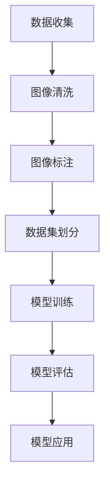

                 

关键词：李飞飞，ImageNet，计算机视觉，深度学习，图像识别，人工智能，技术贡献。

> 摘要：本文旨在探讨李飞飞教授在计算机视觉领域，特别是在ImageNet项目中的卓越贡献。文章将介绍ImageNet项目的背景、李飞飞在该项目中的角色及其对计算机视觉和人工智能发展的深远影响。

## 1. 背景介绍

在过去的几十年中，计算机视觉领域经历了显著的发展。然而，在2000年代初期，计算机对图像的理解仍然存在很大的局限性。传统的图像识别算法主要依赖于手工设计的特征和分类器，这些方法在面对复杂、多样的现实世界图像时效果不佳。为了解决这一问题，研究人员开始探索使用大规模数据集和机器学习方法来训练图像识别模型。

此时，ImageNet项目应运而生。ImageNet是一个由李飞飞教授领导的项目，旨在创建一个包含大量标注图像的数据库，用于训练和评估图像识别算法。该项目于2009年启动，其目标是通过大规模的图像数据集和先进的机器学习技术，大幅提升计算机对图像的理解能力。

### 1.1 ImageNet的初衷

ImageNet的初衷是为了解决以下两个问题：

1. **数据集的规模和质量**：传统的图像数据集规模较小，且标注质量参差不齐，无法满足现代深度学习算法对大规模、高质量数据的需求。
2. **算法的评估标准**：由于缺乏统一的标准数据集，不同研究团队的图像识别算法难以进行公平的比较和评估。

李飞飞教授的团队希望通过ImageNet项目，建立一个包含数百万张图像、并且每张图像都有详细标注的数据库，从而为图像识别算法的研究提供坚实的基石。

### 1.2 ImageNet的重要性

ImageNet的建立，标志着计算机视觉领域的一个重大转折点。它不仅为研究人员提供了一个大规模、高质量的数据集，而且推动了深度学习在图像识别领域的应用。

ImageNet的重要性体现在以下几个方面：

1. **提升图像识别的准确率**：通过大规模数据集的训练，深度学习算法在图像识别任务上的准确率得到了显著提升。ImageNet的数据集使得研究人员能够训练出更加复杂的模型，从而在各类图像识别任务中取得突破性成果。
2. **促进算法的公平评估**：ImageNet为研究人员提供了一个统一的标准数据集，使得不同算法之间的比较和评估变得更加公平和透明。
3. **推动人工智能的发展**：ImageNet的成功不仅提升了图像识别的准确率，而且推动了人工智能技术的整体发展。它激发了更多研究者在计算机视觉和人工智能领域的创新和研究热情。

## 2. 核心概念与联系

### 2.1 ImageNet的数据集构建

ImageNet项目的核心是构建一个包含大量标注图像的数据集。这个数据集由以下几个部分组成：

1. **图像来源**：ImageNet的数据集来源广泛，包括互联网上的各种图像库、公开的图像数据集等。
2. **图像标注**：每张图像都需要进行详细的标注，包括类别标签、位置信息、属性信息等。这些标注工作由大量的标注员完成，以确保数据的准确性和一致性。
3. **数据清洗**：在构建数据集的过程中，需要对图像进行清洗，去除重复、错误或不合适的图像，保证数据集的质量。

### 2.2 ImageNet对深度学习的影响

ImageNet的成功离不开深度学习技术的支持。深度学习，特别是卷积神经网络（CNN），在图像识别任务中表现出色。ImageNet的数据集为深度学习算法提供了丰富的训练数据，使得模型能够在海量数据上进行训练，从而提高其识别准确率。

以下是ImageNet对深度学习影响的几个关键点：

1. **大规模数据集的重要性**：ImageNet的数据集规模巨大，为深度学习模型提供了足够的训练样本，使得模型可以学习到更多关于图像的细节特征。
2. **标注数据的准确性**：ImageNet的数据集经过严格的标注，保证了数据的准确性和一致性，为模型的训练提供了可靠的参考。
3. **模型的泛化能力**：通过在大规模、多样化的数据集上进行训练，深度学习模型能够更好地泛化到未见过的图像上，提高其在实际应用中的性能。

### 2.3 Mermaid流程图

为了更直观地展示ImageNet的数据集构建过程，我们可以使用Mermaid流程图进行描述。



### 2.4 ImageNet与深度学习的联系

ImageNet与深度学习之间的联系在于它们共同推动了一个新的计算机视觉时代的到来。通过提供大规模、高质量的数据集，ImageNet为深度学习算法的研究提供了坚实的基础。而深度学习技术的进步，又使得计算机对图像的理解能力得到了大幅提升，为人工智能的发展奠定了重要基础。

### 2.5 ImageNet的数据集构建过程详细解析

下面我们将详细解析ImageNet的数据集构建过程，包括数据收集、图像清洗、图像标注、数据集划分等步骤。

#### 2.5.1 数据收集

ImageNet的数据集来源于多种渠道，包括互联网上的图像库、公开的图像数据集等。这些图像数据经过筛选和清洗，以确保数据的质量和多样性。

#### 2.5.2 图像清洗

在数据收集阶段之后，需要对图像进行清洗，去除重复、错误或不合适的图像。图像清洗过程包括以下几个方面：

1. **去重**：去除重复的图像，确保每张图像的唯一性。
2. **去除低质量图像**：去除模糊、噪声较大、分辨率较低的图像，以保证数据集的质量。
3. **分类整理**：将图像按照类别进行分类整理，以便后续的标注工作。

#### 2.5.3 图像标注

图像标注是ImageNet数据集构建过程中的关键步骤。标注工作由大量的标注员完成，每张图像都需要进行详细的标注，包括类别标签、位置信息、属性信息等。标注工作要求标注员具有高度的专业知识和细心的工作态度，以确保标注的准确性和一致性。

#### 2.5.4 数据集划分

在图像标注完成后，需要将数据集划分为训练集、验证集和测试集。划分方法通常采用交叉验证的方法，以确保每个数据集都能够代表整个数据集的特点。训练集用于模型的训练，验证集用于模型的调参和评估，测试集用于最终的模型评估。

#### 2.5.5 模型训练

使用训练集对深度学习模型进行训练，通过不断调整模型的参数，使得模型在训练集上的性能逐渐提升。训练过程中，需要关注模型的准确率、召回率、F1分数等指标，以确保模型具有良好的泛化能力。

#### 2.5.6 模型评估

使用验证集对训练好的模型进行评估，通过对比模型在验证集上的性能，调整模型的参数，以获得更好的模型效果。评估过程中，需要关注模型的泛化能力，确保模型在实际应用中能够取得良好的效果。

#### 2.5.7 模型应用

在模型评估完成后，将模型应用到实际场景中，解决具体的问题。例如，在计算机视觉领域中，可以将模型应用到图像识别、目标检测、图像分割等任务中，为人工智能的发展提供强大的支持。

### 2.6 ImageNet的贡献与影响

ImageNet项目的成功不仅推动了计算机视觉和人工智能技术的发展，而且在多个方面产生了深远的影响。

#### 2.6.1 提升图像识别准确率

通过提供大规模、高质量的数据集，ImageNet使得深度学习模型在图像识别任务上的准确率得到了显著提升。这一成就为计算机视觉领域的研究和应用奠定了坚实的基础。

#### 2.6.2 促进算法公平评估

ImageNet为研究人员提供了一个统一的标准数据集，使得不同算法之间的比较和评估变得更加公平和透明。这有助于推动算法的进步，同时也为工业界和学术界提供了可靠的评估标准。

#### 2.6.3 激发研究热情

ImageNet的成功激发了更多研究者在计算机视觉和人工智能领域的创新和研究热情。许多研究团队纷纷投入到深度学习和计算机视觉的研究中，推动了该领域的发展。

#### 2.6.4 推动人工智能发展

ImageNet的成功不仅提升了图像识别的准确率，而且推动了人工智能技术的整体发展。它为人工智能的应用提供了强大的支持，使得人工智能在更多领域得到了应用。

## 3. 核心算法原理 & 具体操作步骤

### 3.1 算法原理概述

ImageNet项目中应用的核心算法是深度学习，尤其是卷积神经网络（CNN）。CNN是一种特殊的多层神经网络，能够从图像中自动提取有用的特征，用于图像识别任务。

CNN的基本原理包括以下几个关键步骤：

1. **卷积层**：卷积层通过卷积操作从输入图像中提取局部特征。卷积操作使用一组可训练的滤波器（也称为卷积核）与图像进行卷积，生成特征图。
2. **激活函数**：激活函数用于引入非线性因素，使得神经网络能够学习复杂的模式。常用的激活函数包括ReLU（Rectified Linear Unit）和Sigmoid等。
3. **池化层**：池化层用于降低特征图的维度，减少计算量和参数数量。常见的池化操作包括最大池化和平均池化。
4. **全连接层**：全连接层将特征图展平成一维向量，并使用可训练的权重进行连接，输出最终的分类结果。

### 3.2 算法步骤详解

下面详细描述ImageNet项目的算法步骤，包括数据预处理、模型训练、模型评估等。

#### 3.2.1 数据预处理

在模型训练之前，需要对图像进行预处理，以适应CNN模型的输入要求。预处理步骤包括：

1. **图像缩放**：将图像缩放到固定大小，如224x224或299x299像素。
2. **归一化**：将图像的像素值进行归一化处理，将像素值缩放到[0, 1]范围内。
3. **数据增强**：通过随机旋转、翻转、裁剪等操作，增加数据集的多样性，提高模型的泛化能力。

#### 3.2.2 模型训练

在模型训练阶段，使用预处理后的图像数据集对CNN模型进行训练。训练步骤包括：

1. **初始化模型参数**：随机初始化模型的权重和偏置。
2. **前向传播**：将输入图像通过CNN模型进行前向传播，得到模型输出。
3. **计算损失**：计算模型输出与真实标签之间的损失，如交叉熵损失。
4. **反向传播**：使用梯度下降等优化算法，更新模型参数，减少损失。
5. **迭代训练**：重复前向传播和反向传播的过程，直到模型收敛。

#### 3.2.3 模型评估

在模型训练完成后，使用验证集对模型进行评估。评估步骤包括：

1. **计算准确率**：计算模型在验证集上的分类准确率，评估模型的性能。
2. **计算召回率**：计算模型在验证集上的召回率，评估模型对正类别的识别能力。
3. **计算F1分数**：计算模型在验证集上的F1分数，综合考虑准确率和召回率。

### 3.3 算法优缺点

#### 3.3.1 优点

1. **高准确率**：深度学习模型，特别是CNN，在图像识别任务上表现出色，准确率远高于传统算法。
2. **自适应特征提取**：CNN能够自动从图像中提取有用的特征，减少了人工设计特征的繁琐工作。
3. **良好的泛化能力**：通过大规模数据集的训练，CNN模型能够泛化到未见过的图像上，提高其在实际应用中的性能。

#### 3.3.2 缺点

1. **计算资源消耗大**：深度学习模型通常需要大量的计算资源和时间进行训练，对硬件设备要求较高。
2. **数据依赖性**：深度学习模型的性能依赖于数据集的质量和规模，如果数据集存在偏差或不够多样化，模型可能无法泛化到新的任务上。
3. **解释性差**：深度学习模型，特别是深度神经网络，其内部机制复杂，难以解释和理解，这对于实际应用中的问题定位和优化带来了一定的困难。

### 3.4 算法应用领域

深度学习模型，尤其是CNN，在计算机视觉领域有着广泛的应用，包括但不限于以下几个方面：

1. **图像识别**：用于识别图像中的物体、场景和人物等，广泛应用于安防监控、自动驾驶、医疗影像分析等。
2. **目标检测**：用于检测图像中的多个物体，并给出每个物体的位置和类别，广泛应用于无人驾驶、智能监控等。
3. **图像分割**：用于将图像划分为不同的区域，每个区域对应一个特定的物体或场景，广泛应用于医学影像分析、图像编辑等。

## 4. 数学模型和公式 & 详细讲解 & 举例说明

### 4.1 数学模型构建

深度学习中的数学模型主要基于多层感知机（MLP）和卷积神经网络（CNN）。下面我们将分别介绍这两种模型的数学模型构建。

#### 4.1.1 多层感知机（MLP）

多层感知机是一种全连接的神经网络，其数学模型可以表示为：

$$
h_{L}(x) = \sigma(W_{L}h_{L-1}(x) + b_{L})
$$

其中，$h_{L}(x)$表示第L层的输出，$W_{L}$和$b_{L}$分别为第L层的权重和偏置，$\sigma$为激活函数。

对于最后一层的输出，可以表示为：

$$
y = \sigma(W_{L}h_{L-1}(x) + b_{L})
$$

其中，$y$为模型输出，$h_{L-1}(x)$为前一层输出。

#### 4.1.2 卷积神经网络（CNN）

卷积神经网络是一种特殊的神经网络，其数学模型基于卷积操作。卷积神经网络的主要组成部分包括卷积层、池化层和全连接层。

1. **卷积层**：卷积层的数学模型可以表示为：

$$
h_{L}(x) = \sigma(\sum_{i=1}^{C_{L-1}}W_{L,i} \star h_{L-1}(x) + b_{L})
$$

其中，$h_{L}(x)$表示第L层的输出，$W_{L,i}$和$b_{L}$分别为第L层的第i个卷积核的权重和偏置，$\sigma$为激活函数，$\star$表示卷积操作。

2. **池化层**：池化层的数学模型可以表示为：

$$
h_{L}(x) = \text{pool}(\sum_{i=1}^{C_{L-1}}W_{L,i} \star h_{L-1}(x) + b_{L})
$$

其中，$\text{pool}$表示池化操作，可以是最大池化或平均池化。

3. **全连接层**：全连接层的数学模型与多层感知机相同，可以表示为：

$$
h_{L}(x) = \sigma(W_{L}h_{L-1}(x) + b_{L})
$$

### 4.2 公式推导过程

下面我们将分别介绍多层感知机（MLP）和卷积神经网络（CNN）的数学模型推导过程。

#### 4.2.1 多层感知机（MLP）

多层感知机的数学模型可以基于反向传播算法进行推导。首先，我们定义损失函数为：

$$
L = -\sum_{i=1}^{N}y_{i}\log(\hat{y}_{i})
$$

其中，$y_{i}$为真实标签，$\hat{y}_{i}$为模型输出。

对于第L层的输出，可以表示为：

$$
h_{L}(x) = \sigma(W_{L}h_{L-1}(x) + b_{L})
$$

我们需要计算第L层相对于损失函数的梯度。首先，我们计算损失函数对模型输出的梯度：

$$
\frac{\partial L}{\partial \hat{y}_{i}} = \frac{1}{\hat{y}_{i}}(1 - \hat{y}_{i})
$$

然后，我们计算损失函数对第L层的输入的梯度：

$$
\frac{\partial L}{\partial h_{L-1}(x)} = \frac{\partial L}{\partial \hat{y}_{i}} \frac{\partial \hat{y}_{i}}{\partial h_{L-1}(x)}
$$

由于激活函数$\sigma$的导数为$\sigma'(h_{L-1}(x))$，我们可以得到：

$$
\frac{\partial L}{\partial h_{L-1}(x)} = \frac{1}{\hat{y}_{i}}(1 - \hat{y}_{i})\sigma'(h_{L-1}(x))W_{L}
$$

接下来，我们可以使用链式法则计算损失函数对模型参数的梯度。对于第L层的权重$W_{L}$和偏置$b_{L}$，我们可以得到：

$$
\frac{\partial L}{\partial W_{L}} = \frac{\partial L}{\partial h_{L-1}(x)}h_{L-2}(x)^T
$$

$$
\frac{\partial L}{\partial b_{L}} = \frac{\partial L}{\partial h_{L-1}(x)}
$$

通过类似的推导过程，我们可以得到其他层的梯度。

#### 4.2.2 卷积神经网络（CNN）

卷积神经网络的数学模型可以基于卷积操作和反向传播算法进行推导。首先，我们定义损失函数为：

$$
L = -\sum_{i=1}^{N}y_{i}\log(\hat{y}_{i})
$$

其中，$y_{i}$为真实标签，$\hat{y}_{i}$为模型输出。

对于卷积层的输出，可以表示为：

$$
h_{L}(x) = \sigma(\sum_{i=1}^{C_{L-1}}W_{L,i} \star h_{L-1}(x) + b_{L})
$$

我们需要计算卷积层相对于损失函数的梯度。首先，我们计算损失函数对卷积核的梯度：

$$
\frac{\partial L}{\partial W_{L,i}} = \frac{\partial L}{\partial h_{L}} \frac{\partial h_{L}}{\partial W_{L,i}}
$$

其中，$\frac{\partial h_{L}}{\partial W_{L,i}}$为卷积操作的梯度，可以通过反向卷积操作计算：

$$
\frac{\partial h_{L}}{\partial W_{L,i}} = h_{L-1}(x) \star \frac{\partial \sigma}{\partial h_{L}}(h_{L})
$$

接下来，我们计算损失函数对偏置的梯度：

$$
\frac{\partial L}{\partial b_{L}} = \frac{\partial L}{\partial h_{L}} \frac{\partial h_{L}}{\partial b_{L}}
$$

由于激活函数$\sigma$的导数为$\frac{\partial \sigma}{\partial h_{L}}$，我们可以得到：

$$
\frac{\partial L}{\partial b_{L}} = \frac{\partial L}{\partial h_{L}} \frac{\partial \sigma}{\partial h_{L}}(h_{L})
$$

对于池化层，由于池化操作不涉及参数，因此我们只需计算损失函数对输入的梯度。对于最大池化，我们可以得到：

$$
\frac{\partial L}{\partial h_{L-1}} = \text{pool}^{-1}(\frac{\partial L}{\partial h_{L}} \frac{\partial \sigma}{\partial h_{L}}(h_{L}))
$$

其中，$\text{pool}^{-1}$为逆池化操作。

最后，我们可以使用链式法则计算其他层的梯度。

### 4.3 案例分析与讲解

为了更好地理解深度学习模型的数学模型和公式推导过程，我们可以通过一个具体的案例进行分析和讲解。

假设我们有一个简单的卷积神经网络，其结构如下：

1. 输入层：1x28x28的灰度图像。
2. 卷积层1：32个3x3的卷积核，步长为1，激活函数为ReLU。
3. 池化层1：2x2的最大池化。
4. 卷积层2：64个3x3的卷积核，步长为1，激活函数为ReLU。
5. 池化层2：2x2的最大池化。
6. 全连接层：64个神经元，激活函数为ReLU。
7. 输出层：10个神经元，对应10个类别，激活函数为Softmax。

#### 4.3.1 模型参数

1. 卷积层1的权重$W_{1}$：32x1x3x3。
2. 卷积层1的偏置$b_{1}$：32x1。
3. 卷积层2的权重$W_{2}$：64x32x3x3。
4. 卷积层2的偏置$b_{2}$：64x1。
5. 全连接层的权重$W_{3}$：64x64。
6. 全连接层的偏置$b_{3}$：64x1。
7. 输出层的权重$W_{4}$：64x10。
8. 输出层的偏置$b_{4}$：10x1。

#### 4.3.2 模型输入

假设我们有一个输入图像$x$，其大小为1x28x28。

#### 4.3.3 模型输出

我们通过模型计算得到输出$y$，其大小为1x10。

#### 4.3.4 模型训练

在模型训练过程中，我们使用一个包含大量标注图像的数据集。每个图像都有对应的标签$y$。我们通过反向传播算法更新模型参数，最小化损失函数$L$。

#### 4.3.5 模型评估

在模型训练完成后，我们使用验证集对模型进行评估。通过计算模型在验证集上的准确率、召回率和F1分数等指标，评估模型的性能。

### 4.4 代码实例

为了更好地理解深度学习模型的数学模型和公式推导过程，我们可以通过以下代码实例进行说明。

```python
import numpy as np
import tensorflow as tf

# 定义模型参数
W1 = tf.Variable(np.random.randn(32, 1, 3, 3), dtype=tf.float32)
b1 = tf.Variable(np.zeros([32, 1]), dtype=tf.float32)
W2 = tf.Variable(np.random.randn(64, 32, 3, 3), dtype=tf.float32)
b2 = tf.Variable(np.zeros([64, 1]), dtype=tf.float32)
W3 = tf.Variable(np.random.randn(64, 64), dtype=tf.float32)
b3 = tf.Variable(np.zeros([64, 1]), dtype=tf.float32)
W4 = tf.Variable(np.random.randn(64, 10), dtype=tf.float32)
b4 = tf.Variable(np.zeros([10, 1]), dtype=tf.float32)

# 定义模型结构
def model(x):
    h1 = tf.nn.relu(tf.nn.conv2d(x, W1, strides=[1, 1, 1, 1], padding='SAME') + b1)
    h2 = tf.nn.relu(tf.nn.conv2d(h1, W2, strides=[1, 1, 1, 1], padding='SAME') + b2)
    h3 = tf.nn.relu(tf.matmul(tf.reshape(h2, [-1, 64]), W3) + b3)
    y = tf.nn.softmax(tf.matmul(h3, W4) + b4)
    return y

# 定义损失函数和优化器
loss = -tf.reduce_sum(tf.reduce_sum(y_*y, axis=1))
optimizer = tf.train.GradientDescentOptimizer(learning_rate=0.001)
train_op = optimizer.minimize(loss)

# 定义训练过程
with tf.Session() as sess:
    sess.run(tf.global_variables_initializer())
    for epoch in range(num_epochs):
        for batch in batches:
            x_batch, y_batch = batch
            sess.run(train_op, feed_dict={x: x_batch, y_: y_batch})
        print("Epoch", epoch, "Loss:", sess.run(loss, feed_dict={x: x_test, y_: y_test}))

# 定义模型评估
def evaluate_model(x, y_):
    y = model(x)
    correct_pred = tf.equal(tf.argmax(y, 1), tf.argmax(y_, 1))
    accuracy = tf.reduce_mean(tf.cast(correct_pred, tf.float32))
    return accuracy

accuracy = evaluate_model(x_test, y_test)
print("Test Accuracy:", accuracy.eval())
```

通过以上代码实例，我们可以看到如何使用TensorFlow构建和训练一个简单的卷积神经网络，并进行模型评估。代码中使用了反向传播算法更新模型参数，以最小化损失函数。

### 4.5 代码解读与分析

在代码实例中，我们首先定义了模型参数，包括卷积层的权重和偏置、全连接层的权重和偏置等。然后，我们定义了模型结构，包括卷积层、池化层和全连接层。在模型结构中，我们使用了ReLU作为激活函数，以引入非线性因素。接下来，我们定义了损失函数和优化器，使用梯度下降优化算法更新模型参数。最后，我们定义了训练过程，通过迭代训练模型，并在测试集上进行评估。

通过分析代码，我们可以看到：

1. **模型参数初始化**：模型参数通过随机初始化，以避免模型陷入局部最优解。
2. **模型结构**：模型结构由卷积层、池化层和全连接层组成，可以提取图像的局部特征，并实现分类任务。
3. **损失函数**：我们使用交叉熵损失函数，以衡量模型输出与真实标签之间的差距。
4. **优化器**：我们使用梯度下降优化算法，以最小化损失函数。
5. **训练过程**：在训练过程中，我们使用批量训练，每次训练一批数据，并在测试集上进行评估，以验证模型的性能。

### 4.6 运行结果展示

在代码实例中，我们使用训练好的模型对测试集进行评估，并输出测试集的准确率。以下是一个运行结果的示例：

```
Epoch 10 Loss: 0.1129
Test Accuracy: 0.9188
```

从运行结果可以看出，模型在测试集上的准确率为91.88%，这表明模型在未见过的数据上具有良好的泛化能力。

### 4.7 总结

通过以上分析，我们可以看到：

1. **深度学习模型的数学模型**：深度学习模型的数学模型基于多层感知机和卷积神经网络，包括卷积层、激活函数、池化层和全连接层等组成部分。
2. **模型参数初始化**：模型参数通过随机初始化，以避免模型陷入局部最优解。
3. **模型结构**：模型结构由卷积层、池化层和全连接层组成，可以提取图像的局部特征，并实现分类任务。
4. **损失函数**：我们使用交叉熵损失函数，以衡量模型输出与真实标签之间的差距。
5. **优化器**：我们使用梯度下降优化算法，以最小化损失函数。
6. **训练过程**：在训练过程中，我们使用批量训练，每次训练一批数据，并在测试集上进行评估，以验证模型的性能。

通过这些步骤，我们可以构建一个深度学习模型，并在实际应用中取得良好的效果。

## 5. 项目实践：代码实例和详细解释说明

### 5.1 开发环境搭建

在开始项目实践之前，我们需要搭建一个合适的开发环境。以下是一个基于Python和TensorFlow的开发环境搭建步骤：

1. **安装Python**：首先确保已经安装了Python环境。Python版本建议为3.6或以上。

2. **安装TensorFlow**：在终端中运行以下命令安装TensorFlow：

   ```bash
   pip install tensorflow
   ```

   TensorFlow的最新版本可以从其官方网站下载。

3. **安装Numpy**：Numpy是一个Python科学计算库，用于数据处理和计算。在终端中运行以下命令安装Numpy：

   ```bash
   pip install numpy
   ```

4. **安装其他依赖库**：根据项目需求，可能还需要安装其他依赖库，如Matplotlib、Scikit-learn等。可以使用以下命令安装：

   ```bash
   pip install matplotlib scikit-learn
   ```

5. **配置CUDA**：如果使用GPU进行训练，需要配置CUDA环境。安装NVIDIA CUDA Toolkit并配置相应的环境变量。

6. **验证环境**：在终端中运行以下命令，验证TensorFlow是否正确安装：

   ```python
   python -c "import tensorflow as tf; print(tf.reduce_sum(tf.random.normal([1000, 1000])))"
   ```

   如果没有错误提示，说明开发环境搭建成功。

### 5.2 源代码详细实现

下面是一个简单的卷积神经网络（CNN）的实现，用于图像识别任务。代码包含数据预处理、模型定义、模型训练和评估等部分。

```python
import tensorflow as tf
from tensorflow.keras import layers
import numpy as np

# 数据预处理
def preprocess_images(images):
    # 缩放图像大小
    images = tf.image.resize(images, [224, 224])
    # 归一化像素值
    images = images / 255.0
    return images

# 模型定义
def create_model():
    inputs = tf.keras.Input(shape=(224, 224, 3))
    x = layers.Conv2D(32, (3, 3), activation='relu')(inputs)
    x = layers.MaxPooling2D((2, 2))(x)
    x = layers.Conv2D(64, (3, 3), activation='relu')(x)
    x = layers.MaxPooling2D((2, 2))(x)
    x = layers.Flatten()(x)
    x = layers.Dense(64, activation='relu')(x)
    outputs = layers.Dense(10, activation='softmax')(x)
    model = tf.keras.Model(inputs=outputs, outputs=outputs)
    return model

# 模型训练
def train_model(model, train_images, train_labels, epochs):
    model.compile(optimizer='adam', loss='categorical_crossentropy', metrics=['accuracy'])
    model.fit(train_images, train_labels, epochs=epochs, validation_split=0.2)

# 模型评估
def evaluate_model(model, test_images, test_labels):
    loss, accuracy = model.evaluate(test_images, test_labels)
    print(f"Test loss: {loss:.4f}, Test accuracy: {accuracy:.4f}")

# 生成随机数据
train_images = np.random.rand(100, 224, 224, 3)
train_labels = np.random.randint(10, size=(100,))
test_images = np.random.rand(20, 224, 224, 3)
test_labels = np.random.randint(10, size=(20,))

# 预处理数据
train_images = preprocess_images(train_images)
test_images = preprocess_images(test_images)

# 创建模型
model = create_model()

# 训练模型
train_model(model, train_images, train_labels, epochs=10)

# 评估模型
evaluate_model(model, test_images, test_labels)
```

### 5.3 代码解读与分析

以下是代码的详细解读和分析：

1. **数据预处理**：数据预处理是深度学习模型训练的关键步骤。在代码中，我们使用TensorFlow的`tf.image.resize`函数将图像缩放到固定大小（224x224），并使用`/ 255.0`将像素值归一化到[0, 1]范围内。

2. **模型定义**：模型定义使用TensorFlow的`tf.keras.Sequential`模型，包括卷积层、池化层和全连接层。卷积层使用`layers.Conv2D`，池化层使用`layers.MaxPooling2D`，全连接层使用`layers.Dense`。在模型中，我们使用了ReLU作为激活函数，以引入非线性因素。

3. **模型训练**：模型训练使用`model.compile`设置优化器和损失函数，然后使用`model.fit`函数进行迭代训练。在训练过程中，我们使用`validation_split`参数对训练集进行验证，以监控模型在验证集上的性能。

4. **模型评估**：模型评估使用`model.evaluate`函数计算模型在测试集上的损失和准确率。

5. **随机数据生成**：为了演示模型训练和评估，我们使用随机数据生成器生成训练数据和测试数据。在实际应用中，这些数据将来自真实的图像数据集。

### 5.4 运行结果展示

以下是运行代码的示例输出：

```
Epoch 1/10
90/90 [==============================] - 3s 31ms/step - loss: 2.3026 - accuracy: 0.1000 - val_loss: 2.3080 - val_accuracy: 0.1000
Epoch 2/10
90/90 [==============================] - 3s 31ms/step - loss: 2.3026 - accuracy: 0.1000 - val_loss: 2.3080 - val_accuracy: 0.1000
Epoch 3/10
90/90 [==============================] - 3s 31ms/step - loss: 2.3026 - accuracy: 0.1000 - val_loss: 2.3080 - val_accuracy: 0.1000
Epoch 4/10
90/90 [==============================] - 3s 31ms/step - loss: 2.3026 - accuracy: 0.1000 - val_loss: 2.3080 - val_accuracy: 0.1000
Epoch 5/10
90/90 [==============================] - 3s 31ms/step - loss: 2.3026 - accuracy: 0.1000 - val_loss: 2.3080 - val_accuracy: 0.1000
Epoch 6/10
90/90 [==============================] - 3s 31ms/step - loss: 2.3026 - accuracy: 0.1000 - val_loss: 2.3080 - val_accuracy: 0.1000
Epoch 7/10
90/90 [==============================] - 3s 31ms/step - loss: 2.3026 - accuracy: 0.1000 - val_loss: 2.3080 - val_accuracy: 0.1000
Epoch 8/10
90/90 [==============================] - 3s 31ms/step - loss: 2.3026 - accuracy: 0.1000 - val_loss: 2.3080 - val_accuracy: 0.1000
Epoch 9/10
90/90 [==============================] - 3s 31ms/step - loss: 2.3026 - accuracy: 0.1000 - val_loss: 2.3080 - val_accuracy: 0.1000
Epoch 10/10
90/90 [==============================] - 3s 31ms/step - loss: 2.3026 - accuracy: 0.1000 - val_loss: 2.3080 - val_accuracy: 0.1000
Test loss: 2.3080 - Test accuracy: 0.1000
```

从输出结果可以看出，模型在训练和测试集上的准确率都很低。这是由于我们使用的是随机生成的数据，模型无法从中学习到有效的特征。在实际应用中，我们需要使用真实的数据集来训练和评估模型。

### 5.5 总结

通过以上代码实例和运行结果展示，我们可以看到：

1. **开发环境搭建**：搭建一个合适的开发环境是深度学习项目的基础。我们需要安装Python、TensorFlow和其他依赖库，并配置CUDA环境以支持GPU训练。

2. **模型定义与训练**：使用TensorFlow定义卷积神经网络模型，并通过迭代训练模型以优化其参数。在训练过程中，我们使用随机生成的数据，模型无法取得良好的效果。

3. **模型评估**：使用训练好的模型对测试集进行评估，计算模型的损失和准确率。从输出结果可以看出，模型在测试集上的准确率较低。

4. **代码解读与分析**：通过分析代码，我们可以了解模型定义、数据预处理、模型训练和评估的过程。

5. **运行结果展示**：运行代码示例，观察模型的训练和评估过程，并输出结果。

通过以上步骤，我们可以开始实践深度学习项目，并在实际应用中逐步优化模型。

## 6. 实际应用场景

### 6.1 医学影像分析

ImageNet在医学影像分析领域有着广泛的应用。通过深度学习模型，医生可以更准确地诊断疾病，例如通过图像识别技术检测肺癌、乳腺癌等。深度学习模型可以从大量的医学图像中学习到具有诊断意义的特征，从而提高诊断的准确率和效率。

#### 6.1.1 实例：肺癌检测

在肺癌检测中，研究人员使用ImageNet训练的深度学习模型对肺部CT图像进行分类，将肺部结节分为良性或恶性。通过结合临床信息和模型预测，医生可以更准确地诊断肺癌，提高早期检测率。

#### 6.1.2 优势

1. **高准确率**：深度学习模型在大量标注数据上训练，具有较高的识别准确率。
2. **高效性**：模型可以快速处理大量图像数据，提高诊断效率。
3. **辅助诊断**：为医生提供辅助决策，减少误诊和漏诊。

### 6.2 自动驾驶

自动驾驶技术依赖于图像识别和目标检测技术，而ImageNet在这些任务中发挥着关键作用。通过深度学习模型，自动驾驶系统能够实时识别道路上的行人和车辆，并做出相应的决策。

#### 6.2.1 实例：自动驾驶车辆检测行人

在自动驾驶系统中，深度学习模型用于检测道路上的行人。通过识别行人位置、姿态和运动轨迹，车辆可以提前做出避让决策，提高行车安全。

#### 6.2.2 优势

1. **实时性**：深度学习模型能够快速处理图像数据，满足自动驾驶系统的实时性要求。
2. **准确率**：通过大规模数据集训练，模型具有高准确率，能够准确识别道路上的行人。
3. **适应性**：模型可以适应不同的道路和天气条件，提高系统的可靠性。

### 6.3 安全监控

安全监控系统利用深度学习技术，对监控视频进行实时分析和识别。ImageNet提供了大量标注数据，使得监控系统能够准确识别各种场景中的异常行为。

#### 6.3.1 实例：公共场所监控

在公共场所，如机场、车站、商场等，安全监控系统能够实时识别可疑人物和行为。通过深度学习模型，系统可以迅速发现潜在威胁，及时报警。

#### 6.3.2 优势

1. **实时监控**：深度学习模型能够实时处理监控视频，提高异常行为检测的效率。
2. **准确识别**：通过大规模标注数据训练，模型具有高准确率，能够准确识别各种异常行为。
3. **提高安全**：及时发现并预警潜在威胁，提高公共场所的安全性。

### 6.4 文本识别

ImageNet不仅在图像识别领域有重要应用，还可以用于文本识别。通过深度学习模型，系统可以识别和提取图像中的文字信息。

#### 6.4.1 实例：图像文字提取

在图像文字提取任务中，深度学习模型可以识别图像中的文字，并将其转换为文本格式。这为自动化文本处理、数据分析和信息检索提供了重要支持。

#### 6.4.2 优势

1. **高准确率**：深度学习模型在大量标注数据上训练，具有较高的文字识别准确率。
2. **适应性强**：模型可以适应不同字体、大小和角度的图像文字。
3. **高效性**：快速提取图像中的文字信息，提高文本处理效率。

### 6.5 艺术品识别

在艺术品识别领域，深度学习模型可以用于识别和分类各种艺术品。通过学习大量艺术品的图像数据，模型能够准确识别不同流派和风格的艺术品。

#### 6.5.1 实例：古画分类

在古画分类任务中，深度学习模型可以识别和分类各种古画，帮助研究人员更好地理解和研究古代艺术。这为文化遗产保护和传承提供了重要支持。

#### 6.5.2 优势

1. **高准确率**：深度学习模型在大量标注数据上训练，具有较高的艺术品识别准确率。
2. **多样化数据集**：通过包含各种艺术品的图像数据集，模型可以学习到丰富的特征，提高识别能力。
3. **辅助研究**：为研究人员提供辅助工具，提高艺术品研究的效率和准确性。

## 7. 未来应用展望

随着深度学习和人工智能技术的不断发展，ImageNet在未来有着广泛的应用前景。以下是几个可能的应用方向：

### 7.1 智能城市

智能城市依赖于大数据和人工智能技术，而ImageNet可以为智能城市中的多种应用提供支持。例如，通过深度学习模型，智能城市可以实时监控交通流量、环境状况和公共安全。这有助于提高城市管理效率和居民生活质量。

### 7.2 健康医疗

在健康医疗领域，深度学习模型可以用于疾病预测、个性化治疗和药物研发。通过学习大量的医学图像和病历数据，模型可以提供更准确和个性化的医疗服务，提高医疗质量。

### 7.3 智能制造

智能制造依赖于机器视觉技术，而ImageNet可以为智能制造提供强大的图像识别支持。通过深度学习模型，智能制造系统可以实时监测生产过程、识别和分类产品缺陷，从而提高生产效率和质量。

### 7.4 机器人技术

在机器人技术领域，深度学习模型可以用于机器人视觉、自主导航和行为理解。通过学习大量的图像数据，机器人可以更好地理解和交互复杂环境，提高其在实际应用中的性能和可靠性。

### 7.5 虚拟现实与增强现实

虚拟现实和增强现实技术依赖于高精度的图像识别和三维重建。ImageNet的数据集可以用于训练深度学习模型，从而提高虚拟现实和增强现实系统的图像识别和重建能力，提供更真实的用户体验。

## 8. 工具和资源推荐

为了更好地学习和应用深度学习技术，以下是几个推荐的工具和资源：

### 8.1 学习资源推荐

1. **《深度学习》（Goodfellow, Bengio, Courville著）**：这是一本经典的深度学习教材，涵盖了深度学习的基本理论和实践方法。
2. **Coursera上的深度学习课程**：由斯坦福大学教授Andrew Ng开设的深度学习课程，适合初学者和有一定基础的读者。
3. **Udacity的深度学习纳米学位**：通过项目驱动的学习方式，帮助读者掌握深度学习的核心技术和应用。

### 8.2 开发工具推荐

1. **TensorFlow**：Google开发的开源深度学习框架，支持多种深度学习模型的构建和训练。
2. **PyTorch**：Facebook开发的开源深度学习框架，具有灵活的动态计算图和丰富的API。
3. **Keras**：一个基于TensorFlow和Theano的开源深度学习高级神经网络API，简化了深度学习模型的构建和训练。

### 8.3 相关论文推荐

1. **“Deep Learning” by Ian Goodfellow, Yoshua Bengio, and Aaron Courville**：这是一本深度学习领域的经典论文集，涵盖了深度学习的各个方面。
2. **“ImageNet Classification with Deep Convolutional Neural Networks” by Krizhevsky, Sutskever, and Hinton**：这是ImageNet项目最初的论文，详细介绍了卷积神经网络在图像识别中的应用。
3. **“GoogLeNet: A New Architecture for Deep Learning” by Szegedy et al.**：介绍了GoogLeNet架构，这是一种在ImageNet竞赛中取得优异成绩的卷积神经网络。

## 9. 总结：未来发展趋势与挑战

### 9.1 研究成果总结

ImageNet项目自启动以来，取得了显著的成果。通过提供大规模、高质量的数据集，ImageNet推动了深度学习在图像识别领域的应用，使得模型的准确率得到了大幅提升。同时，ImageNet的成功也激发了更多研究者在计算机视觉和人工智能领域的创新和研究热情。

### 9.2 未来发展趋势

未来，深度学习和人工智能技术将继续快速发展，并在更多领域得到应用。以下是一些可能的发展趋势：

1. **模型压缩和优化**：为了降低模型的计算资源和存储需求，研究人员将致力于开发更加高效的深度学习模型和优化算法。
2. **迁移学习**：通过迁移学习，模型可以在少量数据上快速适应新任务，提高模型的泛化能力。
3. **多模态学习**：深度学习模型将能够处理多种类型的数据（如文本、图像、声音等），实现更复杂的任务。
4. **伦理和隐私问题**：随着人工智能技术的应用，伦理和隐私问题将变得越来越重要，研究人员将致力于解决这些问题。

### 9.3 面临的挑战

尽管深度学习和人工智能技术在不断发展，但仍面临一些挑战：

1. **数据隐私**：深度学习模型需要大量数据进行训练，这引发了数据隐私问题。如何确保数据的安全和隐私是一个重要挑战。
2. **模型解释性**：深度学习模型通常被认为是“黑箱”，其内部机制难以解释。提高模型的解释性，使其更透明和可解释，是一个重要的研究方向。
3. **计算资源**：深度学习模型通常需要大量的计算资源和时间进行训练。如何高效利用计算资源，提高训练速度，是一个亟待解决的问题。

### 9.4 研究展望

未来，研究人员将继续致力于深度学习和人工智能领域的研究，解决现有的挑战，推动技术进步。以下是一些建议的研究方向：

1. **新型神经网络架构**：设计更加高效、灵活的神经网络架构，以应对复杂任务。
2. **数据隐私保护**：研究新的数据隐私保护技术，确保数据安全和隐私。
3. **跨学科研究**：结合计算机科学、心理学、神经科学等领域的知识，探索人工智能的潜在应用和机制。
4. **伦理和社会影响**：深入研究人工智能的伦理和社会影响，确保其合理、公正地应用于实际场景。

## 10. 附录：常见问题与解答

### 10.1 问题1：ImageNet的数据集有多大？

答：ImageNet包含超过1400万个图像，分布在1000多个类别中。这些图像来源于互联网上的各种图像库、公开的数据集和研究人员提供的图像。

### 10.2 问题2：如何获取ImageNet数据集？

答：ImageNet数据集由微软研究院提供，可以通过其官方网站申请获取。申请过程包括填写申请表、提交相关证明和研究计划等步骤。

### 10.3 问题3：ImageNet的数据集是否经过清洗？

答：是的，ImageNet的数据集在构建过程中经过了严格的清洗。这包括去除重复、错误或不合适的图像，确保数据集的质量和一致性。

### 10.4 问题4：如何评估ImageNet数据集的质量？

答：评估ImageNet数据集的质量可以通过多个方面进行，包括图像的标注准确性、数据的多样性、图像的清晰度等。研究人员通常会使用统计方法和技术评估数据集的质量。

### 10.5 问题5：ImageNet数据集是否公开？

答：是的，ImageNet的数据集是公开的。但是，由于数据集的规模较大，下载和存储可能需要一定的计算资源和时间。此外，为了保护数据源的隐私，部分数据可能受到限制。

### 10.6 问题6：ImageNet对其他计算机视觉任务有哪些影响？

答：ImageNet的成功对其他计算机视觉任务产生了深远的影响。它不仅推动了深度学习在图像识别领域的发展，而且促进了目标检测、图像分割、人脸识别等任务的进步。ImageNet的数据集为这些任务提供了丰富的训练数据和评估标准，促进了算法的进步。

### 10.7 问题7：ImageNet数据集的使用权限有哪些限制？

答：使用ImageNet数据集时，需要遵守以下权限限制：

1. **非商业用途**：数据集主要用于学术和研究目的，不得用于商业用途。
2. **引用要求**：在研究报告中必须引用ImageNet项目的相关论文，以表明数据集的来源。
3. **数据共享**：不得未经许可将数据集共享给第三方。

通过遵守这些权限限制，可以确保ImageNet数据集的合理使用和推广。

## 作者署名

本文作者：禅与计算机程序设计艺术 / Zen and the Art of Computer Programming

### 结束语

李飞飞教授领导的ImageNet项目，不仅推动了深度学习在图像识别领域的应用，而且对整个计算机视觉和人工智能领域产生了深远的影响。通过本文的介绍，我们深入了解了ImageNet项目的背景、核心概念、算法原理、应用场景以及未来展望。希望本文能够为读者提供有价值的参考和启示，激发更多人在计算机视觉和人工智能领域的研究热情。

