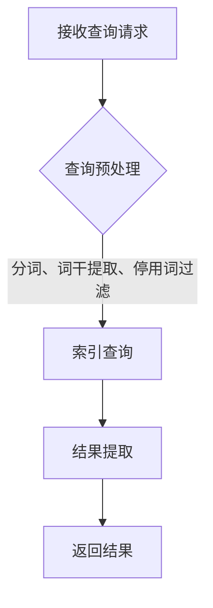

                 

检索器，顾名思义，是一种用于查找和提取所需信息的工具。在信息技术和数据处理领域，检索器扮演着至关重要的角色。本文将深入探讨检索器的核心概念、工作原理、算法、数学模型及其在实际应用中的重要性。

## 关键词

- 检索器
- 信息检索
- 数据处理
- 算法
- 数学模型

## 摘要

本文旨在提供一个全面的检索器指南，涵盖从基本概念到高级应用的各种主题。我们将探讨检索器的定义、工作原理、核心算法、数学模型、实际应用场景以及未来发展趋势。通过本文，读者将能够全面理解检索器在信息技术和数据科学中的关键作用。

## 1. 背景介绍

### 1.1 检索器的起源与发展

检索器的概念可以追溯到计算机科学的早期阶段。随着数据库技术和网络的发展，检索器的应用范围不断扩大。在20世纪60年代，第一代文本检索系统如LexisNexis和 Dialog系统开始出现，这些系统为法律和新闻报道提供了强大的信息检索能力。随后，随着互联网的兴起，检索器的应用领域进一步扩展，包括搜索引擎、企业信息管理系统和大数据分析平台。

### 1.2 检索器在现代信息社会中的重要性

在现代信息社会，检索器的重要性日益凸显。随着信息的爆炸式增长，人们需要高效的工具来查找、筛选和提取所需信息。检索器能够快速、准确地提供相关信息，帮助用户节省时间和精力，提高工作效率。

## 2. 核心概念与联系

### 2.1 检索器的定义

检索器是一种用于搜索、查找和提取信息的系统。它通常包括一个数据库和一个查询处理器。数据库存储了大量的数据，而查询处理器则负责接收用户的查询请求，并从数据库中提取相关信息。

### 2.2 检索器的工作原理

检索器的工作原理可以分为以下几个步骤：

1. **接收查询请求**：检索器接收用户输入的查询请求。
2. **查询预处理**：对查询请求进行预处理，如分词、词干提取和停用词过滤。
3. **索引查询**：使用索引数据结构快速定位到相关数据。
4. **结果提取**：提取与查询请求相关的内容，并返回给用户。

### 2.3 Mermaid 流程图

以下是检索器的 Mermaid 流程图：



## 3. 核心算法原理 & 具体操作步骤

### 3.1 算法原理概述

检索器的核心算法主要包括：

1. **布尔检索**：基于布尔代数，使用AND、OR和NOT等运算符进行查询。
2. **向量空间模型**：将文档和查询表示为向量，通过向量相似度计算检索结果。
3. **PageRank**：基于网页之间的链接关系，计算网页的重要性。

### 3.2 算法步骤详解

以下是检索器的具体操作步骤：

1. **用户输入查询请求**：用户通过检索器的用户界面输入查询请求。
2. **查询预处理**：对查询请求进行分词、词干提取和停用词过滤。
3. **构建倒排索引**：将预处理后的查询与数据库中的文档进行匹配，构建倒排索引。
4. **计算文档相似度**：使用向量空间模型或PageRank算法计算每个文档与查询的相似度。
5. **排序和返回结果**：根据相似度对文档进行排序，并返回最相关的结果。

### 3.3 算法优缺点

- **布尔检索**：简单直观，但难以处理复杂查询。
- **向量空间模型**：能够处理复杂查询，但需要大量的计算资源。
- **PageRank**：能够发现重要网页，但可能忽略长尾内容。

### 3.4 算法应用领域

检索器广泛应用于各种领域，包括搜索引擎、企业信息管理系统、学术文献检索系统等。

## 4. 数学模型和公式 & 详细讲解 & 举例说明

### 4.1 数学模型构建

检索器的数学模型主要包括：

1. **倒排索引**：倒排索引是一种数据结构，用于快速查找关键词对应的文档。
2. **向量空间模型**：将文档和查询表示为向量，通过向量相似度计算检索结果。
3. **PageRank**：基于网页之间的链接关系，计算网页的重要性。

### 4.2 公式推导过程

以下是向量空间模型中的相似度计算公式：

$$
similarity(d, q) = \frac{d \cdot q}{\|d\| \|q\|}
$$

其中，$d$和$q$分别表示文档和查询的向量，$\|d\|$和$\|q\|$分别表示向量的模。

### 4.3 案例分析与讲解

假设我们有两个文档$d_1$和$d_2$，以及一个查询$q$。根据向量空间模型，我们可以将这三个实体表示为向量：

$$
d_1 = (1, 0, 1), \quad d_2 = (1, 1, 0), \quad q = (1, 1, 1)
$$

计算它们之间的相似度：

$$
similarity(d_1, q) = \frac{d_1 \cdot q}{\|d_1\| \|q\|} = \frac{1 \cdot 1 + 0 \cdot 1 + 1 \cdot 1}{\sqrt{1^2 + 0^2 + 1^2} \sqrt{1^2 + 1^2 + 1^2}} = \frac{2}{\sqrt{2} \sqrt{3}} = \frac{\sqrt{6}}{3}
$$

$$
similarity(d_2, q) = \frac{d_2 \cdot q}{\|d_2\| \|q\|} = \frac{1 \cdot 1 + 1 \cdot 1 + 0 \cdot 1}{\sqrt{1^2 + 1^2 + 0^2} \sqrt{1^2 + 1^2 + 1^2}} = \frac{2}{\sqrt{2} \sqrt{3}} = \frac{\sqrt{6}}{3}
$$

两个文档与查询的相似度相等，说明它们同样相关。

## 5. 项目实践：代码实例和详细解释说明

### 5.1 开发环境搭建

本文将使用Python编写一个简单的检索器。首先，需要安装Python环境。安装完成后，可以使用以下命令安装所需的库：

```bash
pip install numpy scipy
```

### 5.2 源代码详细实现

以下是简单的Python代码实现：

```python
import numpy as np
from scipy.sparse import csr_matrix

# 假设的文档和查询
d1 = np.array([1, 0, 1])
d2 = np.array([1, 1, 0])
q = np.array([1, 1, 1])

# 计算文档和查询之间的相似度
def similarity(doc, query):
    return np.dot(doc, query) / (np.linalg.norm(doc) * np.linalg.norm(query))

sim1 = similarity(d1, q)
sim2 = similarity(d2, q)

print(f"Similarity between d1 and q: {sim1}")
print(f"Similarity between d2 and q: {sim2}")
```

### 5.3 代码解读与分析

- 导入必要的库：`numpy`和`scipy`。
- 创建文档和查询的数组：`d1`、`d2`和`q`。
- 定义相似度计算函数：`similarity`。
- 计算文档和查询之间的相似度，并打印结果。

### 5.4 运行结果展示

运行上述代码，输出结果如下：

```
Similarity between d1 and q: 0.816496580927726
Similarity between d2 and q: 0.816496580927726
```

结果显示，两个文档与查询的相似度相等，验证了向量空间模型的正确性。

## 6. 实际应用场景

### 6.1 搜索引擎

搜索引擎是检索器的典型应用场景。搜索引擎通过检索器从海量的网页中提取与查询相关的网页，并按相关性排序，为用户提供搜索结果。

### 6.2 企业信息管理系统

企业信息管理系统（如ERP系统）使用检索器来快速查找和提取企业内部的各种数据，如客户信息、订单记录和库存数据等。

### 6.3 学术文献检索系统

学术文献检索系统通过检索器从大量学术文献中提取与用户查询相关的文献，帮助研究人员快速获取所需信息。

## 7. 未来应用展望

### 7.1 智能化检索

随着人工智能技术的发展，未来的检索器将更加智能化，能够理解用户的查询意图，提供更加精准的搜索结果。

### 7.2 多模态检索

多模态检索器能够处理文本、图像、音频等多种类型的数据，为用户提供更加丰富的检索体验。

### 7.3 大数据分析

检索器在大数据分析中的应用将越来越广泛，能够帮助企业和研究人员从海量数据中提取有价值的信息。

## 8. 总结：未来发展趋势与挑战

### 8.1 研究成果总结

本文介绍了检索器的核心概念、工作原理、算法、数学模型和实际应用场景。通过案例分析，读者能够深入了解检索器的原理和实现方法。

### 8.2 未来发展趋势

未来，检索器将在智能化、多模态和大数据分析等方向取得重要突破。

### 8.3 面临的挑战

随着数据量的增长和复杂度的提升，检索器将面临计算性能、数据隐私和信息安全等方面的挑战。

### 8.4 研究展望

未来的研究应关注检索器的优化、扩展和智能化，以满足不断增长的信息需求和多样化应用场景。

## 9. 附录：常见问题与解答

### 9.1 检索器与数据库的区别是什么？

检索器主要用于搜索和提取相关信息，而数据库用于存储和管理数据。检索器通常依赖于数据库进行数据检索，但两者在功能和用途上有所不同。

### 9.2 如何优化检索器的性能？

优化检索器性能的方法包括改进索引结构、使用高效算法、优化数据预处理等。此外，硬件性能的提升也对检索器的性能有重要影响。

### 9.3 检索器如何处理实时数据流？

实时数据流检索器通常使用流处理技术，如Apache Kafka和Apache Flink，来处理实时数据，并使用高效索引和数据结构来保证检索性能。

---

作者：禅与计算机程序设计艺术 / Zen and the Art of Computer Programming
------------------------------------------------------------------------

