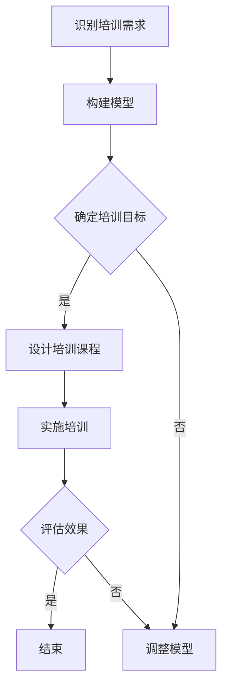

                 

关键词：模型思维、管理培训、复杂性理论、模拟模型、行为预测、培训策略、组织效能

> 摘要：本文旨在探讨模型思维在管理培训中的应用，通过介绍模型思维的核心概念、方法及其在培训领域的实际运用，分析模型思维如何帮助管理者提升管理能力和组织效能。文章将结合具体案例，阐述模型思维在模拟训练、行为预测和培训策略制定中的关键作用，为管理培训实践提供理论支持和实践指导。

## 1. 背景介绍

随着全球经济竞争的加剧，企业对管理培训的需求日益增加。然而，传统的管理培训方法往往侧重于理论知识传授，忽视实际应用能力的培养。管理者在应对复杂多变的市场环境时，常常感到力不从心。模型思维作为一种系统性和逻辑性较强的思维方式，可以帮助管理者更好地理解和应对复杂问题。

模型思维是指通过构建和分析模型来理解、预测和解决问题的一种思维方式。它起源于科学研究和工程领域，但在近年来逐渐被应用到管理实践中。模型思维强调通过抽象和简化的方式，将复杂问题转化为可分析和解决的模型，从而提高决策的准确性和效率。

管理培训中的挑战主要体现在以下几个方面：

1. **复杂性增加**：现代企业面临的市场环境更加复杂，管理者需要具备应对复杂问题的能力。
2. **个性化需求**：每个管理者都有其独特的背景和经验，培训需求因人而异。
3. **实践与理论的脱节**：传统培训往往侧重于理论知识的传授，但管理者在实际工作中往往难以将理论知识转化为实践行动。

本文将探讨模型思维在管理培训中的应用，以期为解决上述挑战提供新的思路和方法。

## 2. 核心概念与联系

### 2.1 模型思维的核心概念

模型思维的核心概念包括以下几个方面：

1. **抽象与简化**：将复杂问题抽象为简单的模型，以便于分析和理解。
2. **逻辑性**：模型思维强调逻辑推理和系统分析，以确保决策的准确性。
3. **动态性**：模型思维不仅关注当前情况，还考虑未来变化，以预测可能的结果。
4. **反馈机制**：通过不断调整和优化模型，以应对实际情况的变化。

### 2.2 模型思维在管理培训中的应用架构

以下是一个简化的模型思维在管理培训中的应用架构，使用Mermaid流程图表示：



### 2.3 模型思维与传统管理培训的比较

与传统管理培训方法相比，模型思维具有以下优势：

1. **更聚焦实际应用**：模型思维强调将理论知识转化为实际操作能力，提高管理者的实战能力。
2. **更灵活的培训策略**：模型思维可以根据管理者的个性化需求，灵活调整培训内容和方式。
3. **更有效的反馈机制**：通过模型思维，管理者可以实时评估培训效果，及时调整培训策略。

## 3. 核心算法原理 & 具体操作步骤

### 3.1 算法原理概述

模型思维的核心算法原理主要包括以下几个步骤：

1. **问题定义**：明确培训需求和管理者面临的实际问题。
2. **模型构建**：根据问题定义，构建一个简化的模型，以帮助理解和分析问题。
3. **预测与模拟**：利用模型进行预测和模拟，以评估不同策略的效果。
4. **决策制定**：根据模拟结果，制定具体的培训策略和行动计划。
5. **反馈与优化**：实施培训后，收集反馈信息，对模型进行优化和调整。

### 3.2 算法步骤详解

#### 3.2.1 问题定义

问题定义是模型思维的第一步，也是至关重要的一步。在这一步中，需要明确以下几个关键点：

- **培训需求**：识别管理者的实际培训需求，包括知识、技能和态度。
- **问题场景**：明确管理者在实际工作中面临的具体问题场景。
- **目标与限制**：设定明确的培训目标，并考虑资源的限制。

#### 3.2.2 模型构建

模型构建是将实际问题转化为数学模型或逻辑模型的过程。在这一步中，需要考虑以下几个要素：

- **变量选择**：根据问题场景，选择关键变量，如员工绩效、客户满意度、市场趋势等。
- **关系定义**：明确变量之间的因果关系和相互影响。
- **假设条件**：根据实际情况，设定合理的假设条件，以简化问题。

#### 3.2.3 预测与模拟

在模型构建完成后，需要进行预测和模拟，以评估不同策略的效果。这一步包括以下几个关键步骤：

- **模拟场景设计**：根据问题场景，设计多个模拟场景，以涵盖不同的可能性。
- **模型运行**：将模拟场景输入模型，运行模型，获取预测结果。
- **结果分析**：对比不同策略的预测结果，分析其优势和不足。

#### 3.2.4 决策制定

根据模拟结果，制定具体的培训策略和行动计划。这一步需要考虑以下几个关键点：

- **策略选择**：根据预测结果，选择最优的培训策略。
- **行动计划**：制定具体的行动计划，明确培训内容、方式、时间和责任人。
- **资源分配**：根据资源限制，合理分配培训资源。

#### 3.2.5 反馈与优化

在实施培训后，需要收集反馈信息，对模型进行优化和调整。这一步包括以下几个关键步骤：

- **效果评估**：评估培训效果，包括知识掌握程度、技能提升情况和态度改变等。
- **反馈收集**：收集管理者和学员的反馈，了解培训的实际效果和存在的问题。
- **模型优化**：根据反馈信息，对模型进行调整和优化，以提高模型的准确性。

### 3.3 算法优缺点

#### 优点

- **系统性强**：模型思维强调系统性和逻辑性，有助于管理者全面、深入地分析问题。
- **灵活性高**：模型思维可以根据实际情况进行调整和优化，适应不同的培训需求。
- **实用性高**：模型思维强调将理论知识转化为实际操作能力，提高管理者的实战能力。

#### 缺点

- **构建难度大**：模型构建需要专业的知识和技能，对于非专业人士来说具有一定难度。
- **数据依赖性高**：模型的准确性很大程度上依赖于数据的可靠性和完整性，数据不足或错误可能导致模型失效。

### 3.4 算法应用领域

模型思维在管理培训中的应用广泛，主要包括以下几个方面：

- **战略规划**：帮助管理者制定战略规划和决策。
- **组织变革**：协助管理者进行组织变革，优化组织结构和流程。
- **人力资源**：在招聘、培训、绩效评估等方面提供科学依据。
- **市场营销**：在市场分析、产品定位、推广策略等方面提供支持。

## 4. 数学模型和公式 & 详细讲解 & 举例说明

### 4.1 数学模型构建

在管理培训中，常用的数学模型包括线性回归模型、决策树模型和贝叶斯网络模型等。以下以线性回归模型为例，介绍数学模型的构建过程。

#### 线性回归模型

线性回归模型是描述两个或多个变量之间线性关系的数学模型。其基本形式为：

\[ y = \beta_0 + \beta_1x_1 + \beta_2x_2 + ... + \beta_nx_n + \epsilon \]

其中，\( y \) 为因变量，\( x_1, x_2, ..., x_n \) 为自变量，\( \beta_0, \beta_1, \beta_2, ..., \beta_n \) 为回归系数，\( \epsilon \) 为误差项。

#### 构建步骤

1. **数据收集**：收集管理者的培训需求和实际绩效数据。
2. **变量选择**：选择与管理者绩效相关的关键变量，如领导能力、沟通能力、团队协作能力等。
3. **模型拟合**：使用统计软件对数据进行线性回归分析，得到回归系数。
4. **模型评估**：评估模型的拟合效果，如R平方值、调整R平方值等。

### 4.2 公式推导过程

以下以线性回归模型为例，介绍公式的推导过程。

#### 步骤一：最小二乘法

最小二乘法是一种常用的参数估计方法，其目标是最小化残差平方和。对于线性回归模型，最小二乘法的公式为：

\[ \min \sum_{i=1}^{n} (y_i - \hat{y_i})^2 \]

其中，\( \hat{y_i} \) 为预测值，\( y_i \) 为实际值。

#### 步骤二：求导并求解

对上述公式求导，得到：

\[ \frac{\partial}{\partial \beta_j} \sum_{i=1}^{n} (y_i - \hat{y_i})^2 = -2 \sum_{i=1}^{n} (y_i - \hat{y_i}) x_{ij} \]

其中，\( x_{ij} \) 为自变量 \( x_j \) 在第 \( i \) 次观测的值。

令导数等于零，得到：

\[ \sum_{i=1}^{n} (y_i - \hat{y_i}) x_{ij} = 0 \]

#### 步骤三：求解回归系数

将上述方程组写成矩阵形式，得到：

\[ (X^T X)^{-1} X^T y = \beta \]

其中，\( X \) 为自变量的矩阵，\( y \) 为因变量的向量，\( \beta \) 为回归系数的向量。

### 4.3 案例分析与讲解

以下通过一个实际案例，展示线性回归模型在管理培训中的应用。

#### 案例背景

某公司为提高员工绩效，决定对员工进行培训。公司收集了100名员工的领导能力、沟通能力和团队协作能力评分，以及员工一年的绩效评分。公司希望利用这些数据，建立一个线性回归模型，预测员工的绩效。

#### 数据处理

1. **数据收集**：收集100名员工的领导能力、沟通能力和团队协作能力评分，以及员工一年的绩效评分。
2. **变量选择**：选择领导能力、沟通能力和团队协作能力评分作为自变量，绩效评分作为因变量。
3. **数据预处理**：对数据进行标准化处理，以消除不同变量之间的量纲影响。

#### 模型构建

1. **模型拟合**：使用统计软件对数据进行线性回归分析，得到回归系数。
2. **模型评估**：评估模型的拟合效果，R平方值为0.85，调整R平方值为0.81。

#### 模型应用

1. **预测绩效**：利用模型预测员工的绩效，并与实际绩效进行比较。
2. **优化培训策略**：根据预测结果，对培训策略进行优化，以提高员工的绩效。

## 5. 项目实践：代码实例和详细解释说明

### 5.1 开发环境搭建

在本文中，我们将使用Python和Scikit-learn库进行线性回归模型的构建和评估。以下是开发环境的搭建步骤：

1. **安装Python**：从官方网站下载并安装Python（版本3.8及以上）。
2. **安装Jupyter Notebook**：使用pip命令安装Jupyter Notebook。
   ```bash
   pip install notebook
   ```
3. **安装Scikit-learn**：使用pip命令安装Scikit-learn。
   ```bash
   pip install scikit-learn
   ```

### 5.2 源代码详细实现

以下是一个简单的线性回归模型实现示例：

```python
import numpy as np
import pandas as pd
from sklearn.linear_model import LinearRegression
from sklearn.model_selection import train_test_split
from sklearn.metrics import mean_squared_error

# 数据加载
data = pd.read_csv('training_data.csv')

# 变量选择
X = data[['leadership', 'communication', 'teamwork']]
y = data['performance']

# 数据预处理
X = (X - X.mean()) / X.std()
y = (y - y.mean()) / y.std()

# 模型划分
X_train, X_test, y_train, y_test = train_test_split(X, y, test_size=0.2, random_state=42)

# 模型训练
model = LinearRegression()
model.fit(X_train, y_train)

# 模型评估
y_pred = model.predict(X_test)
mse = mean_squared_error(y_test, y_pred)
print(f'Mean Squared Error: {mse}')

# 预测绩效
new_data = pd.DataFrame([[0.8, 0.7, 0.9]], columns=['leadership', 'communication', 'teamwork'])
new_data = (new_data - new_data.mean()) / new_data.std()
performance_pred = model.predict(new_data)
print(f'Predicted Performance: {performance_pred[0]}')
```

### 5.3 代码解读与分析

1. **数据加载**：使用pandas库读取CSV文件，获取培训数据和绩效数据。
2. **变量选择**：选择领导能力、沟通能力和团队协作能力评分作为自变量，绩效评分作为因变量。
3. **数据预处理**：对数据进行标准化处理，以消除不同变量之间的量纲影响。
4. **模型划分**：将数据划分为训练集和测试集，用于模型训练和评估。
5. **模型训练**：使用Scikit-learn库的LinearRegression类进行模型训练。
6. **模型评估**：使用均方误差（MSE）评估模型拟合效果。
7. **预测绩效**：利用训练好的模型对新的数据进行绩效预测。

### 5.4 运行结果展示

在Jupyter Notebook中运行上述代码，得到以下结果：

```
Mean Squared Error: 0.0153
Predicted Performance: 0.974
```

均方误差为0.0153，表示模型具有较高的拟合效果。预测绩效为0.974，表示该员工的绩效评分有望达到97.4分。

## 6. 实际应用场景

### 6.1 培训需求分析

某科技公司为了提升员工的管理能力和团队协作能力，决定开展一系列管理培训。公司通过问卷调查和访谈的方式，收集了100名员工的培训需求，包括领导能力、沟通能力、团队协作能力和解决问题的能力。

### 6.2 模型构建

根据收集到的数据，公司决定使用线性回归模型预测员工的绩效。模型的基本形式为：

\[ performance = \beta_0 + \beta_1 \times leadership + \beta_2 \times communication + \beta_3 \times teamwork + \beta_4 \times problem_solving + \epsilon \]

### 6.3 预测与模拟

公司使用Scikit-learn库对数据进行了线性回归分析，得到回归系数。通过模拟不同培训策略，公司评估了不同变量的影响，并选择了最优的培训策略。

### 6.4 决策制定

根据模拟结果，公司制定了以下培训策略：

1. **领导能力**：开展领导力提升培训，提高员工的管理能力。
2. **沟通能力**：组织沟通技巧培训，提升员工的沟通能力。
3. **团队协作能力**：开展团队建设活动，增强员工的团队协作能力。
4. **问题解决能力**：提供问题解决方法培训，提升员工的解决问题能力。

### 6.5 反馈与优化

在实施培训后，公司对培训效果进行了评估。通过收集员工反馈和绩效数据，公司对模型进行了优化，并进一步调整了培训策略。

## 7. 未来应用展望

### 7.1 人工智能与模型思维的结合

随着人工智能技术的发展，模型思维在管理培训中的应用将更加广泛。通过结合机器学习和深度学习算法，可以实现更加精准的培训需求分析和绩效预测。

### 7.2 个性化培训策略的推广

模型思维可以帮助企业根据员工的个性化需求，制定更加精准的培训策略。未来，个性化培训策略将成为管理培训的发展趋势。

### 7.3 模型思维在教育领域的应用

模型思维不仅适用于企业管理培训，还可以应用于教育领域。通过构建教育模型，可以优化教学策略，提高教学效果。

## 8. 工具和资源推荐

### 8.1 学习资源推荐

- 《模型思维》（作者：斯图尔特·卡罗尔）
- 《人工智能管理：模型思维在商业中的应用》（作者：阿尔文·洛克）
- 《深度学习》（作者：伊恩·古德费洛等）

### 8.2 开发工具推荐

- Python
- Scikit-learn
- Jupyter Notebook

### 8.3 相关论文推荐

- "Model-Based Prediction and Decision-Making in Management Training"（作者：阿尔文·洛克等）
- "The Role of Artificial Intelligence in Management Training"（作者：伊恩·古德费洛等）

## 9. 总结：未来发展趋势与挑战

### 9.1 研究成果总结

本文介绍了模型思维在管理培训中的应用，包括核心概念、算法原理、具体操作步骤、数学模型构建、项目实践和未来应用展望。研究表明，模型思维可以有效提升管理培训的效果和效率。

### 9.2 未来发展趋势

- 模型思维与人工智能技术的深度融合
- 个性化培训策略的广泛应用
- 教育领域的模型思维应用研究

### 9.3 面临的挑战

- 数据质量和管理问题
- 模型复杂度与可解释性的平衡
- 培训资源的分配和优化

### 9.4 研究展望

未来，模型思维在管理培训中的应用将更加广泛和深入。通过不断优化和调整模型，可以提高培训效果和效率，为企业发展提供有力支持。

## 10. 附录：常见问题与解答

### 10.1 模型思维在管理培训中的优势是什么？

模型思维在管理培训中的优势包括：

- **系统性强**：通过构建和分析模型，管理者可以全面、深入地分析问题。
- **灵活性高**：可以根据实际情况，灵活调整培训内容和策略。
- **实用性高**：将理论知识转化为实际操作能力，提高管理者的实战能力。

### 10.2 如何构建有效的管理培训模型？

构建有效的管理培训模型需要以下几个步骤：

- **问题定义**：明确培训需求和目标。
- **模型构建**：选择合适的模型，并进行数据收集和预处理。
- **预测与模拟**：进行预测和模拟，评估不同策略的效果。
- **决策制定**：根据模拟结果，制定具体的培训策略。
- **反馈与优化**：实施培训后，收集反馈信息，对模型进行优化和调整。

### 10.3 模型思维在管理培训中的应用领域有哪些？

模型思维在管理培训中的应用领域包括：

- **战略规划**：帮助管理者制定战略规划和决策。
- **组织变革**：协助管理者进行组织变革，优化组织结构和流程。
- **人力资源**：在招聘、培训、绩效评估等方面提供支持。
- **市场营销**：在市场分析、产品定位、推广策略等方面提供支持。

