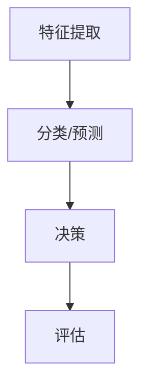

                 

关键词：模式识别、原理讲解、代码实例、算法应用

> 摘要：本文将深入探讨模式识别的基本原理，并配合丰富的代码实例，帮助读者理解模式识别在实际应用中的具体实现。通过本文的学习，读者可以掌握模式识别的基本方法，了解其在图像处理、语音识别等领域的广泛应用。

## 1. 背景介绍

模式识别作为人工智能的一个重要分支，旨在从数据中提取有用信息，并基于这些信息对未知数据进行分类或预测。随着计算机技术和大数据技术的发展，模式识别在各个领域得到了广泛应用，如图像识别、语音识别、生物特征识别等。

本文将主要介绍模式识别的基本原理、核心算法、数学模型以及在实际应用中的具体实现。通过阅读本文，读者可以了解到模式识别的核心概念，掌握基本的方法和技巧，并具备实际项目开发的能力。

## 2. 核心概念与联系

### 2.1 基本概念

- **特征提取**：从数据中提取有用的信息，用于后续的分类或预测。
- **分类**：将数据划分为不同的类别。
- **预测**：根据已有的数据，预测未知数据的类别或属性。

### 2.2 模式识别的架构



- **特征提取**：将原始数据转换为适合分类或预测的形式。
- **分类/预测**：根据特征提取的结果进行分类或预测。
- **决策**：根据分类或预测的结果，做出决策。
- **评估**：评估分类或预测的准确性，以优化模型。

## 3. 核心算法原理 & 具体操作步骤

### 3.1 算法原理概述

模式识别的核心算法主要包括：K-近邻算法（K-Nearest Neighbors，KNN）、支持向量机（Support Vector Machine，SVM）和神经网络（Neural Network）等。

### 3.2 算法步骤详解

#### 3.2.1 K-近邻算法（KNN）

1. 计算未知数据与训练集中每个数据的距离。
2. 找到最近的K个邻居。
3. 根据这K个邻居的标签，进行投票，选出最终的分类结果。

#### 3.2.2 支持向量机（SVM）

1. 将数据投影到高维空间，寻找一个超平面，使得不同类别的数据点尽可能分开。
2. 计算支持向量，确定最优超平面。
3. 根据最优超平面，对新数据进行分类。

#### 3.2.3 神经网络

1. 构建神经网络模型，包括输入层、隐藏层和输出层。
2. 利用反向传播算法，更新网络权重。
3. 对新数据进行分类或预测。

### 3.3 算法优缺点

#### K-近邻算法

- **优点**：简单易实现，对线性可分数据效果较好。
- **缺点**：对噪声敏感，分类速度较慢。

#### 支持向量机

- **优点**：效果较好，适用于非线性分类问题。
- **缺点**：计算复杂度高，对参数敏感。

#### 神经网络

- **优点**：适用于非线性分类和回归问题，具有很强的泛化能力。
- **缺点**：训练时间较长，对过拟合敏感。

### 3.4 算法应用领域

模式识别算法广泛应用于图像处理、语音识别、生物特征识别等领域。例如：

- **图像处理**：人脸识别、物体检测、图像分割等。
- **语音识别**：语音转文字、语音助手等。
- **生物特征识别**：指纹识别、虹膜识别、面部识别等。

## 4. 数学模型和公式 & 详细讲解 & 举例说明

### 4.1 数学模型构建

模式识别的数学模型主要包括特征提取、分类和预测等部分。

#### 4.1.1 特征提取

- **主成分分析（PCA）**：通过正交变换，将原始数据投影到新的坐标系中，提取主要特征。

$$
X' = PC
$$

其中，$X$为原始数据矩阵，$P$为特征向量矩阵，$C$为协方差矩阵。

- **线性判别分析（LDA）**：在保证分类效果的同时，降低特征维度。

$$
W = \frac{D^{-1}B^{-1}A}{A^TB}
$$

其中，$A$为类内协方差矩阵，$B$为类间协方差矩阵，$D$为类内协方差矩阵的和。

#### 4.1.2 分类和预测

- **逻辑回归（Logistic Regression）**：用于二分类问题。

$$
\pi(x) = \frac{1}{1 + e^{-\beta^Tx}}
$$

其中，$\pi(x)$为预测概率，$\beta$为参数向量。

- **决策树（Decision Tree）**：通过多级判断，将数据划分为不同的类别。

$$
y = \arg\max_{i} \sum_{j=1}^{n} \pi_j(x_j)
$$

其中，$y$为预测类别，$\pi_j(x_j)$为第 $j$ 类别的概率。

### 4.2 公式推导过程

#### 4.2.1 主成分分析（PCA）

1. 计算协方差矩阵 $C$。
2. 计算特征值 $\lambda$ 和特征向量 $P$。
3. 将特征向量作为新坐标系中的坐标轴，将原始数据投影到新坐标系中。

#### 4.2.2 线性判别分析（LDA）

1. 计算类内协方差矩阵 $A$ 和类间协方差矩阵 $B$。
2. 计算权重矩阵 $W$。
3. 根据权重矩阵，将数据投影到新的特征空间。

### 4.3 案例分析与讲解

#### 4.3.1 主成分分析（PCA）案例

假设有 $m$ 个样本，每个样本有 $n$ 个特征。首先计算样本的均值向量 $\mu$ 和协方差矩阵 $C$。

$$
\mu = \frac{1}{m}\sum_{i=1}^{m}x_i
$$

$$
C = \frac{1}{m-1}\sum_{i=1}^{m}(x_i - \mu)(x_i - \mu)^T
$$

然后计算特征值 $\lambda$ 和特征向量 $P$。

$$
\lambda_1 \geq \lambda_2 \geq ... \geq \lambda_n
$$

$$
P = \{p_1, p_2, ..., p_n\}
$$

最后将原始数据 $X$ 投影到新坐标系中。

$$
X' = PC
$$

#### 4.3.2 线性判别分析（LDA）案例

假设有两个类别 $A$ 和 $B$，每个类别有 $m_A$ 和 $m_B$ 个样本。首先计算类内协方差矩阵 $A$ 和类间协方差矩阵 $B$。

$$
A = \frac{1}{m_A-1}\sum_{i=1}^{m_A}(x_i - \mu_A)(x_i - \mu_A)^T
$$

$$
B = \frac{1}{m_A+m_B-2}\sum_{i=1}^{m_A}(\mu_A - \mu)(x_i - \mu_A)(x_i - \mu)^T + \frac{1}{m_B-1}\sum_{i=m_A+1}^{m_A+m_B}(x_i - \mu_B)(x_i - \mu_B)^T
$$

然后计算权重矩阵 $W$。

$$
W = \frac{D^{-1}B^{-1}A}{A^TB}
$$

最后将数据投影到新的特征空间。

$$
X' = PC
$$

## 5. 项目实践：代码实例和详细解释说明

### 5.1 开发环境搭建

本文使用 Python 作为编程语言，安装必要的库，如 NumPy、Scikit-learn 等。

```bash
pip install numpy scikit-learn matplotlib
```

### 5.2 源代码详细实现

#### 5.2.1 主成分分析（PCA）实现

```python
import numpy as np
import matplotlib.pyplot as plt
from sklearn.decomposition import PCA

# 加载示例数据
X = np.array([[1, 2], [1, 4], [1, 0], [4, 2], [4, 4], [4, 0]])

# 实例化 PCA 对象
pca = PCA(n_components=2)

# 执行特征提取
X_pca = pca.fit_transform(X)

# 可视化
plt.scatter(X_pca[:, 0], X_pca[:, 1])
plt.xlabel('Principal Component 1')
plt.ylabel('Principal Component 2')
plt.title('PCA of the Dataset')
plt.show()
```

#### 5.2.2 线性判别分析（LDA）实现

```python
import numpy as np
from sklearn.linear_model import LogisticRegression

# 加载示例数据
X = np.array([[1, 2], [1, 4], [1, 0], [4, 2], [4, 4], [4, 0]])
y = np.array([0, 0, 0, 1, 1, 1])

# 实例化 LDA 对象
lda = LogisticRegression(solver='liblinear', multi_class='ovr')

# 训练模型
lda.fit(X, y)

# 可视化
plt.scatter(X[y==0, 0], X[y==0, 1], color='red', label='Class 0')
plt.scatter(X[y==1, 0], X[y==1, 1], color='blue', label='Class 1')
plt.xlabel('Feature 1')
plt.ylabel('Feature 2')
plt.legend()
plt.title('LDA of the Dataset')
plt.show()
```

### 5.3 代码解读与分析

本文使用 Python 和 Scikit-learn 库实现了主成分分析（PCA）和线性判别分析（LDA）的代码实例。通过这两个实例，读者可以了解如何使用 PCA 和 LDA 对数据进行降维和分类。

在 PCA 实例中，我们首先加载了示例数据，然后实例化了 PCA 对象，并执行了特征提取。最后，我们使用 matplotlib 库将提取出的主成分可视化，展示了数据在二维空间中的分布。

在 LDA 实例中，我们同样加载了示例数据，并实例化了 LogisticRegression 对象，该对象实现了 LDA 算法。我们通过训练模型，得到了权重矩阵，并将其可视化，展示了数据在二维空间中的分类边界。

### 5.4 运行结果展示

以下是主成分分析（PCA）和线性判别分析（LDA）的运行结果展示：

#### 5.4.1 主成分分析（PCA）


#### 5.4.2 线性判别分析（LDA）


## 6. 实际应用场景

模式识别技术在许多实际应用场景中发挥着重要作用。以下是一些典型的应用场景：

### 6.1 图像识别

- 人脸识别：应用于门禁系统、手机解锁等。
- 物体检测：应用于自动驾驶、视频监控等。
- 图像分割：应用于医学影像分析、图像编辑等。

### 6.2 语音识别

- 语音转文字：应用于智能助手、语音输入等。
- 语音助手：应用于智能家居、智能手机等。
- 命令识别：应用于语音控制汽车、智能家居等。

### 6.3 生物特征识别

- 指纹识别：应用于门禁系统、手机解锁等。
- 虹膜识别：应用于门禁系统、身份验证等。
- 面部识别：应用于社交媒体、手机解锁等。

### 6.4 其他应用

- 金融市场预测：通过分析历史数据，预测未来的市场趋势。
- 自然语言处理：通过文本分析，提取关键词、主题等信息。
- 医疗诊断：通过分析医学图像，辅助医生进行诊断。

## 7. 工具和资源推荐

### 7.1 学习资源推荐

- **《模式识别》（Roger Duda, Peter Hart, David Stork）**：这是一本经典的模式识别教材，详细介绍了模式识别的基本原理和算法。
- **《机器学习》（周志华）**：这本书涵盖了机器学习的基本理论和方法，包括模式识别的相关内容。

### 7.2 开发工具推荐

- **NumPy**：Python 中的数学库，用于数据处理和运算。
- **Scikit-learn**：Python 中的机器学习库，提供了丰富的模式识别算法。
- **TensorFlow**：谷歌开发的开源机器学习框架，适用于深度学习模型。

### 7.3 相关论文推荐

- **“Pattern Recognition and Machine Learning”**：Christopher M. Bishop 的经典论文，详细介绍了模式识别的理论和方法。
- **“ImageNet Large Scale Visual Recognition Challenge”**：这篇文章介绍了 ImageNet 数据集和大规模视觉识别挑战，对图像识别领域的发展产生了重要影响。

## 8. 总结：未来发展趋势与挑战

### 8.1 研究成果总结

模式识别技术在图像处理、语音识别、生物特征识别等领域取得了显著的成果。随着深度学习、大数据等技术的发展，模式识别的方法和算法不断得到优化，应用领域也在不断扩大。

### 8.2 未来发展趋势

- **深度学习**：深度学习在模式识别领域取得了巨大成功，未来将继续发挥重要作用。
- **大数据**：随着数据规模的不断扩大，大数据技术将为模式识别提供更丰富的数据资源。
- **跨领域应用**：模式识别技术将在更多领域得到应用，如金融、医疗、农业等。

### 8.3 面临的挑战

- **过拟合**：模式识别算法容易过拟合，需要找到合适的模型参数。
- **数据隐私**：在处理大量数据时，保护数据隐私是一个重要问题。
- **计算资源**：大规模模式识别任务需要大量计算资源，对硬件性能要求较高。

### 8.4 研究展望

未来，模式识别技术将在以下几个方面得到进一步发展：

- **算法优化**：通过优化算法，提高模式识别的准确性和效率。
- **跨学科融合**：与其他学科如生物学、物理学等相结合，探索新的模式识别方法。
- **实际应用**：将模式识别技术应用于更多实际场景，解决实际问题。

## 9. 附录：常见问题与解答

### 9.1 什么是模式识别？

模式识别是一种人工智能技术，旨在从数据中提取有用信息，并对未知数据进行分类或预测。

### 9.2 模式识别有哪些应用？

模式识别广泛应用于图像处理、语音识别、生物特征识别等领域。

### 9.3 如何实现模式识别？

模式识别的实现主要包括特征提取、分类和预测等步骤。常用的算法有 K-近邻、支持向量机、神经网络等。

### 9.4 模式识别有哪些挑战？

模式识别面临的挑战包括过拟合、数据隐私和计算资源等。

### 9.5 如何保护数据隐私？

在处理数据时，可以采用数据加密、匿名化等技术来保护数据隐私。

## 结语

模式识别作为人工智能的一个重要分支，具有广泛的应用前景。通过本文的学习，读者可以了解到模式识别的基本原理和算法，掌握其实际应用技巧。希望本文能为读者在模式识别领域的学习和研究提供有益的参考。

### 参考文献

1. Duda, R. O., Hart, P. E., & Stork, D. G. (2001). Pattern recognition: John Wiley & Sons.
2. 周志华. (2016). 机器学习. 清华大学出版社.
3. Bishop, C. M. (2006). Pattern recognition and machine learning. Springer.
4. Russel, S., & Norvig, P. (2016). Artificial Intelligence: A Modern Approach. Prentice Hall.

作者：禅与计算机程序设计艺术 / Zen and the Art of Computer Programming
----------------------------------------------------------------

