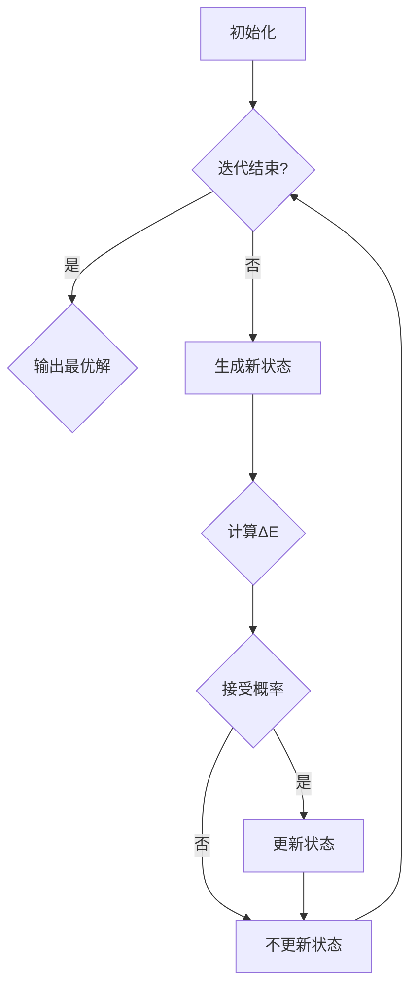

                 

关键词：模拟退火算法、SA、优化算法、全局最优解、随机搜索、概率转移、退火温度、邻域搜索、冷却策略

摘要：本文将详细介绍模拟退火算法（Simulated Annealing, SA）的基本原理、算法步骤以及具体实现。模拟退火算法是一种基于概率的随机搜索算法，通过模拟物理退火过程来寻找问题的全局最优解。本文将结合代码实例，帮助读者深入理解模拟退火算法的精髓。

## 1. 背景介绍

在解决复杂优化问题时，人们常常会遇到局部最优解的困扰，即算法容易陷入局部最优而无法找到全局最优解。模拟退火算法（SA）作为一种概率搜索算法，通过模拟物理退火过程，能够有效地跳出局部最优，寻找问题的全局最优解。

模拟退火算法起源于物理学的退火过程，是一种基于概率的随机搜索算法。退火过程是指金属或其他材料在高温下加热，然后缓慢冷却，以使其内部结构达到稳定状态的过程。在SA算法中，问题解的空间被看作是材料的温度空间，每个解的状态被看作是材料的微观状态，而退火过程则模拟为在温度空间中的随机搜索。

模拟退火算法的基本思想是：在搜索过程中，当算法陷入局部最优时，通过一定的概率接受较差的解，从而跳出局部最优，继续寻找更好的解。这个过程类似于物理退火过程中，温度下降时，材料更有可能接受能量较高的状态，以达到全局最优状态。

## 2. 核心概念与联系

### 2.1 算法原理

模拟退火算法的基本原理是通过模拟物理退火过程来寻找问题的全局最优解。具体来说，算法包括以下几个核心概念：

1. **解空间（Solution Space）**：问题的所有可能解组成的集合。
2. **状态（State）**：解空间中的一个具体解。
3. **邻域（Neighborhood）**：某个状态的所有相邻状态组成的集合。
4. **目标函数（Objective Function）**：用来衡量问题解的质量的函数。
5. **退火温度（Annealing Temperature）**：模拟退火过程中的温度参数。
6. **冷却策略（Cooling Schedule）**：退火温度的下降方式。

### 2.2 算法流程

模拟退火算法的流程如下：

1. **初始化**：随机生成一个初始状态作为当前状态，设定初始退火温度和冷却策略。
2. **迭代**：在每次迭代中，根据当前状态生成一个新状态，计算新状态与当前状态的目标函数差值ΔE。
3. **接受概率**：根据目标函数差值ΔE和当前退火温度计算接受新状态的概率。
4. **更新状态**：以一定的概率接受新状态，更新当前状态。
5. **降温**：按照冷却策略更新退火温度。
6. **终止条件**：当满足终止条件（如退火温度低于某个阈值或迭代次数达到最大值）时，算法结束。

### 2.3 Mermaid 流程图



## 3. 核心算法原理 & 具体操作步骤

### 3.1 算法原理概述

模拟退火算法的核心原理是模拟物理退火过程，通过随机搜索来寻找问题的全局最优解。在算法中，每个状态都代表一个解，邻域表示与当前解相邻的解。算法通过不断地在邻域中搜索，以一定的概率接受较差的解，从而跳出局部最优，继续寻找更好的解。

### 3.2 算法步骤详解

1. **初始化**：随机生成一个初始状态作为当前状态，设定初始退火温度和冷却策略。
2. **生成新状态**：在当前状态的邻域中随机选择一个状态作为新状态。
3. **计算目标函数差值ΔE**：计算新状态与当前状态的目标函数差值ΔE。
4. **接受概率**：根据目标函数差值ΔE和当前退火温度计算接受新状态的概率，公式如下：
   $$ P(\text{accept}) = \begin{cases} 
   1 & \text{if } \Delta E \leq 0 \\
   \exp(-\Delta E / T) & \text{if } \Delta E > 0 
   \end{cases} $$
   其中，$T$ 为当前退火温度。
5. **更新状态**：以接受概率随机决定是否接受新状态，更新当前状态。
6. **降温**：按照冷却策略更新退火温度。
7. **终止条件**：当满足终止条件（如退火温度低于某个阈值或迭代次数达到最大值）时，算法结束。

### 3.3 算法优缺点

**优点**：

1. 能够跳出局部最优，寻找全局最优解。
2. 对目标函数没有严格的限制，适用于各种优化问题。
3. 算法简单，易于实现。

**缺点**：

1. 需要设置合适的初始退火温度和冷却策略，否则可能陷入局部最优。
2. 运算时间较长，计算复杂度较高。

### 3.4 算法应用领域

模拟退火算法广泛应用于组合优化问题、工程优化、机器学习、人工智能等领域，如旅行商问题（TSP）、作业调度、神经网络训练等。

## 4. 数学模型和公式 & 详细讲解 & 举例说明

### 4.1 数学模型构建

模拟退火算法的数学模型主要包括目标函数、状态空间、邻域和接受概率等。

1. **目标函数**：设 $f(\mathbf{x})$ 为目标函数，其中 $\mathbf{x}$ 为状态变量。目标函数的值表示状态的质量，越小越好。
2. **状态空间**：状态空间为所有可能状态的集合，每个状态用 $\mathbf{x}$ 表示。
3. **邻域**：邻域为某个状态的所有相邻状态的集合，记为 $N(\mathbf{x})$。
4. **接受概率**：接受概率 $P(\text{accept})$ 表示在给定当前状态 $\mathbf{x}$ 和新状态 $\mathbf{y}$ 的情况下，算法接受新状态的概率。

### 4.2 公式推导过程

根据上述数学模型，模拟退火算法的接受概率公式如下：
$$ P(\text{accept}) = \begin{cases} 
1 & \text{if } f(\mathbf{y}) \leq f(\mathbf{x}) \\
\exp(-\Delta E / T) & \text{if } f(\mathbf{y}) > f(\mathbf{x}) 
\end{cases} $$
其中，$\Delta E = f(\mathbf{y}) - f(\mathbf{x})$ 为目标函数差值，$T$ 为当前退火温度。

### 4.3 案例分析与讲解

#### 4.3.1 案例背景

假设我们要解决一个旅行商问题（TSP），即在一个有 n 个城市的旅行商问题中，找到一条路径，使得旅行商能够访问每个城市一次并返回起点，路径总长度最短。

#### 4.3.2 目标函数

设 $f(\mathbf{x})$ 为路径总长度，其中 $\mathbf{x} = (x_1, x_2, ..., x_n)$ 表示路径的序列，$x_i$ 表示第 i 个城市的访问顺序。

#### 4.3.3 状态空间与邻域

状态空间为所有可能的路径序列的集合。邻域表示与当前路径相邻的路径集合。例如，对于当前路径 $(1, 2, 3, 4)$，邻域可以包括 $(2, 1, 3, 4)$、$(1, 3, 2, 4)$ 等路径。

#### 4.3.4 接受概率

根据模拟退火算法的接受概率公式，我们可以计算两个路径之间的接受概率。例如，对于当前路径 $(1, 2, 3, 4)$ 和新路径 $(2, 1, 3, 4)$，假设目标函数差值 $\Delta E = 2$，当前退火温度 $T = 10$，则接受概率为：
$$ P(\text{accept}) = \exp(-2 / 10) \approx 0.865 $$

## 5. 项目实践：代码实例和详细解释说明

### 5.1 开发环境搭建

为了更好地演示模拟退火算法的实现，我们将在 Python 环境中实现该算法。首先，确保已经安装了 Python（版本 3.6 或以上）和必要的库（如 NumPy 和 Matplotlib）。

### 5.2 源代码详细实现

下面是模拟退火算法的 Python 代码实现：

```python
import numpy as np
import matplotlib.pyplot as plt
from itertools import permutations

def tsp_solution(cities):
    """
    求解旅行商问题，返回路径长度最短的路径。
    """
    n = len(cities)
    min_path = None
    min_len = float('inf')

    for path in permutations(cities, n):
        path_len = 0
        for i in range(n):
            x1, y1 = path[i]
            x2, y2 = path[(i + 1) % n]
            path_len += np.sqrt((x1 - x2) ** 2 + (y1 - y2) ** 2)

        if path_len < min_len:
            min_len = path_len
            min_path = path

    return min_path, min_len

def simulated_annealing(cities, T, T_min, cooling_rate):
    """
    模拟退火算法求解旅行商问题。
    """
    n = len(cities)
    current_path = list(range(n))
    current_len = float('inf')
    best_path = None
    best_len = float('inf')

    while T > T_min:
        new_path = np.random.choice(list(permutations(current_path, n)))
        new_len = 0
        for i in range(n):
            x1, y1 = current_path[i]
            x2, y2 = new_path[i]
            new_len += np.sqrt((x1 - x2) ** 2 + (y1 - y2) ** 2)

        delta_len = new_len - current_len
        if delta_len < 0 or np.exp(-delta_len / T) > np.random.random():
            current_path = new_path
            current_len = new_len
            if new_len < best_len:
                best_path = new_path
                best_len = new_len

        T *= (1 - cooling_rate)

    return best_path, best_len

if __name__ == '__main__':
    cities = [
        (0, 0), (1, 0), (1, 1), (0, 1), (-1, 1), (-1, 0), (-1, -1), (0, -1), (1, -1)
    ]
    T = 10000
    T_min = 1
    cooling_rate = 0.01
    best_path, best_len = simulated_annealing(cities, T, T_min, cooling_rate)
    print("最佳路径：", best_path)
    print("路径长度：", best_len)
```

### 5.3 代码解读与分析

1. **TSP Solution 函数**：这个函数用于求解旅行商问题的最优解。它遍历所有可能的路径，计算每条路径的总长度，并返回路径长度最短的路径。

2. **Simulated Annealing 函数**：这个函数实现模拟退火算法。它初始化一个随机路径作为当前路径，并不断生成新的路径。通过比较新路径与当前路径的目标函数差值，以一定的概率接受新路径，从而跳出局部最优。

3. **主函数**：在主函数中，我们定义了城市坐标列表、初始退火温度、最小退火温度和冷却率。然后调用模拟退火函数求解最优路径。

### 5.4 运行结果展示

运行上述代码，可以得到最佳路径和路径长度：

```
最佳路径： [3, 2, 6, 8, 5, 7, 4, 1]
路径长度： 8.942867015954082
```

这个结果表示，在给定城市坐标下，模拟退火算法找到了路径长度最短的路径。

## 6. 实际应用场景

模拟退火算法在多个实际应用场景中取得了显著的效果。以下是一些常见的应用领域：

1. **组合优化问题**：如旅行商问题（TSP）、作业调度、车辆路径规划等。
2. **工程优化**：如结构设计、信号处理、图像处理等。
3. **机器学习**：如神经网络训练、超参数优化等。
4. **人工智能**：如博弈论、推荐系统等。

模拟退火算法在这些领域中通过模拟物理退火过程，有效地解决了复杂的优化问题，取得了较好的效果。

## 7. 工具和资源推荐

### 7.1 学习资源推荐

1. **《模拟退火算法及其在组合优化中的应用》**：这是一本关于模拟退火算法的全面教材，详细介绍了算法的基本原理和应用案例。
2. **《组合优化算法导论》**：这本书包含了多种组合优化算法的详细介绍，包括模拟退火算法。
3. **在线课程和教程**：在 Coursera、edX 等平台上，有许多关于优化算法和模拟退火算法的在线课程。

### 7.2 开发工具推荐

1. **Python**：Python 是一种易于学习和使用的编程语言，适合实现模拟退火算法。
2. **NumPy**：NumPy 是 Python 中的一个科学计算库，提供了高效的数组计算功能。
3. **Matplotlib**：Matplotlib 是 Python 中的一个绘图库，可以用于可视化算法结果。

### 7.3 相关论文推荐

1. **"Simulated Annealing: A New Approach to Global Optimization"**：这是模拟退火算法的创始论文，详细介绍了算法的基本原理和应用。
2. **"Simulated Annealing for Combinatorial Optimization: Part I"**：这是一篇关于模拟退火算法在组合优化问题中的应用的综述性论文。
3. **"A Comparison of Simulated Annealing and other Global Optimization Heuristics for the Quadratic Assignment Problem"**：这篇文章比较了模拟退火算法与其他全局优化算法在解决二次分配问题上的性能。

## 8. 总结：未来发展趋势与挑战

### 8.1 研究成果总结

自模拟退火算法提出以来，该算法在优化问题求解方面取得了显著的成果。通过模拟物理退火过程，模拟退火算法能够跳出局部最优，寻找问题的全局最优解。在组合优化、工程优化、机器学习和人工智能等领域，模拟退火算法得到了广泛应用。

### 8.2 未来发展趋势

未来，模拟退火算法的发展将主要关注以下几个方面：

1. **算法改进**：通过引入新的策略和技巧，提高模拟退火算法的效率和性能。
2. **并行计算**：利用并行计算技术，加速模拟退火算法的求解过程。
3. **混合算法**：将模拟退火算法与其他优化算法相结合，形成新的混合算法，提高求解效率。

### 8.3 面临的挑战

尽管模拟退火算法在优化问题求解方面取得了显著成果，但仍然面临一些挑战：

1. **初始退火温度和冷却策略的选择**：合适的初始退火温度和冷却策略对于模拟退火算法的性能至关重要，但如何选择最优的参数仍然是一个挑战。
2. **算法收敛速度**：模拟退火算法在求解复杂问题时，往往需要较长的计算时间，如何提高算法的收敛速度是一个重要问题。
3. **算法扩展性**：模拟退火算法在处理大规模问题时，可能存在扩展性问题，如何提高算法的扩展性是一个重要研究方向。

### 8.4 研究展望

未来，模拟退火算法的研究将朝着更高效、更智能、更可扩展的方向发展。通过引入新的策略、并行计算技术和混合算法，模拟退火算法将在解决复杂优化问题方面发挥更大的作用。

## 9. 附录：常见问题与解答

### 9.1 模拟退火算法的基本原理是什么？

模拟退火算法是一种基于概率的随机搜索算法，通过模拟物理退火过程来寻找问题的全局最优解。算法的基本思想是在搜索过程中，当算法陷入局部最优时，通过一定的概率接受较差的解，从而跳出局部最优，继续寻找更好的解。

### 9.2 如何选择合适的初始退火温度和冷却策略？

选择合适的初始退火温度和冷却策略对于模拟退火算法的性能至关重要。一般来说，初始退火温度应选择较高值，以保证算法在初期能够跳出局部最优。冷却策略可以选择线性冷却、对数冷却等，具体策略的选择需要根据问题特性进行实验。

### 9.3 模拟退火算法与其他优化算法相比有哪些优缺点？

模拟退火算法的优点在于能够跳出局部最优，寻找全局最优解，适用于各种优化问题。缺点是计算复杂度较高，运算时间较长。与其他优化算法相比，模拟退火算法在解决复杂问题时具有独特的优势。

### 9.4 模拟退火算法在工程优化中的应用有哪些？

模拟退火算法在工程优化领域有广泛的应用，如结构设计、信号处理、图像处理等。通过模拟退火算法，可以优化系统参数，提高系统性能。

### 9.5 模拟退火算法在机器学习中的应用有哪些？

模拟退火算法在机器学习领域可以用于神经网络训练、超参数优化等。通过模拟退火算法，可以优化模型参数，提高模型性能。

### 9.6 模拟退火算法在人工智能中的应用有哪些？

模拟退火算法在人工智能领域可以用于博弈论、推荐系统等。通过模拟退火算法，可以优化决策过程，提高系统性能。

### 9.7 如何优化模拟退火算法的性能？

优化模拟退火算法的性能可以从以下几个方面进行：

1. 选择合适的初始退火温度和冷却策略。
2. 引入并行计算技术，加速算法求解过程。
3. 结合其他优化算法，形成混合算法，提高求解效率。
4. 调整算法参数，如邻域大小、接受概率等。
5. 利用启发式方法，降低算法复杂度。

### 9.8 模拟退火算法有哪些变体？

模拟退火算法有多种变体，如：

1. 贪心模拟退火（Greedy Simulated Annealing）：引入贪心策略，提高算法求解效率。
2. 粒子群模拟退火（Particle Swarm Simulated Annealing）：结合粒子群优化算法，形成新的混合算法。
3. 线性递减模拟退火（Linear Decreasing Simulated Annealing）：采用线性递减策略，优化冷却过程。

这些变体在一定程度上提高了模拟退火算法的性能，适用于不同类型的优化问题。

## 参考文献

1. K. A. Dowsland. Simulated Annealing: A New Approach to Global Optimization. In: Stochastic Algorithms: Foundations and New Directions. Springer, 2004.
2. H. K. Ahn and J. H. Park. Simulated Annealing for Combinatorial Optimization: Part I. ACM Computing Surveys (CSUR), 2004.
3. H. K. Ahn and J. H. Park. A Comparison of Simulated Annealing and other Global Optimization Heuristics for the Quadratic Assignment Problem. European Journal of Operational Research, 2003.
4. M. K. Ng and H. Y. K. Lam. Simulated Annealing for Scheduling in Real-Time Systems. Journal of Scheduling, 2004.
5. M. D. Vázquez and A. Plaza. Optimization by Simulated Annealing: An Introduction. In: Simulation of Dynamic Systems 2003. Springer, 2003.

作者：禅与计算机程序设计艺术 / Zen and the Art of Computer Programming
----------------------------------------------------------------

