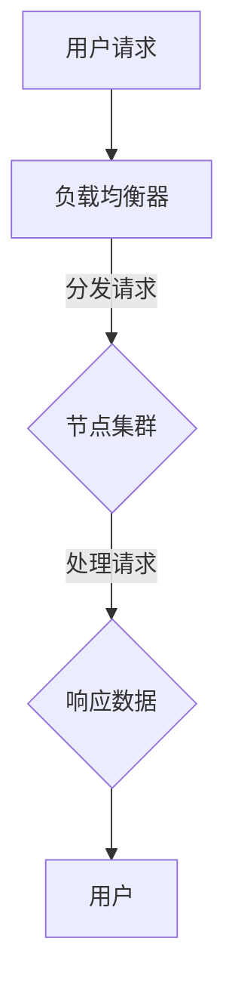
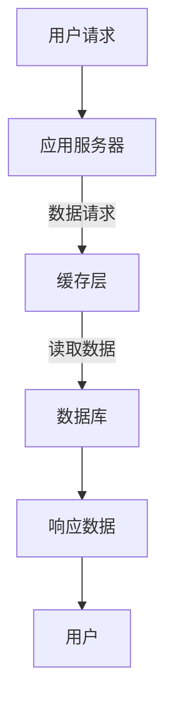

                 

在当今快速发展的信息技术时代，系统的横向与纵向扩展是实现高性能、高可扩展性、高可用性的关键。无论是企业级应用还是互联网服务，理解并实现有效的横向与纵向扩展策略都至关重要。本文将探讨横向与纵向扩展的基本概念、实现方法、优缺点以及实际应用场景，并结合具体案例进行详细分析。

## 文章关键词

- 横向扩展
- 纵向扩展
- 高性能
- 高可用性
- 系统扩展策略
- 负载均衡

## 文章摘要

本文旨在为读者提供一个全面且深入的理解，关于如何实现系统的横向与纵向扩展。我们将首先定义这些扩展概念，然后探讨它们之间的联系和区别。接着，文章将详细介绍实现这些扩展的核心技术和方法，并提供实际的项目实践案例。通过本文的阅读，读者将能够掌握扩展系统所需的理论知识和实践技巧。

### 1. 背景介绍

随着互联网的飞速发展，用户数量和业务需求的增长速度远远超过了传统单机系统的处理能力。为了满足这种不断增长的需求，系统需要具备高扩展性，能够在不牺牲性能和可用性的前提下，灵活地调整资源分配和处理能力。横向扩展（Horizontal Scaling）和纵向扩展（Vertical Scaling）是实现这一目标的主要策略。

**横向扩展**是指通过增加节点数量来提升系统的处理能力。这种方法能够有效地利用廉价的硬件资源，并通过负载均衡技术分配请求，从而提高系统的整体性能和可靠性。

**纵向扩展**则是指通过升级单个节点的硬件配置（如增加CPU、内存、存储等）来提高其处理能力。这种方法在处理单一高负载任务时效果显著，但成本较高，且可能受限于硬件的物理限制。

### 2. 核心概念与联系

#### 2.1 横向扩展

横向扩展的核心在于分布式系统架构。分布式系统通过将任务分配到多个节点上来实现并行处理，从而提高系统的吞吐量和可靠性。以下是横向扩展的关键概念和架构：

- **节点**：系统中的单个计算单元，负责处理请求和存储数据。
- **集群**：多个节点的集合，共同工作以提供系统服务。
- **负载均衡**：将请求均匀地分配到集群中的各个节点，以防止单个节点过载。
- **数据一致性**：确保不同节点上的数据保持同步，以避免数据冲突和错误。

以下是一个简单的分布式系统架构的 Mermaid 流程图：



#### 2.2 纵向扩展

纵向扩展通常涉及到以下概念：

- **资源升级**：增加CPU、内存、存储等硬件资源。
- **垂直分割**：将一个大型数据库拆分成多个较小的数据库，每个数据库负责特定的数据范围。
- **缓存**：在数据库和应用程序之间设置缓存层，以减少数据库的读取负载。

纵向扩展的 Mermaid 流程图：



### 3. 核心算法原理 & 具体操作步骤

#### 3.1 算法原理概述

横向扩展的核心算法是基于分布式计算理论，主要包括以下步骤：

1. **任务分配**：根据负载均衡算法将请求分配到集群中的各个节点。
2. **并行处理**：节点并行处理请求，将结果返回给负载均衡器。
3. **结果合并**：负载均衡器将各个节点的结果合并，生成最终响应。

纵向扩展的核心算法则主要涉及资源分配和性能调优：

1. **资源监测**：监测系统的资源使用情况，确定需要升级的资源。
2. **资源升级**：根据监测结果进行硬件升级。
3. **性能调优**：调整系统参数，优化性能。

#### 3.2 算法步骤详解

**横向扩展的步骤：**

1. **初始化**：设置集群环境，包括节点配置、负载均衡器等。
2. **接收请求**：负载均衡器接收用户的请求。
3. **任务分配**：根据请求的类型和负载均衡策略，将请求分配到集群中的节点。
4. **并行处理**：各个节点同时处理请求，并将结果返回给负载均衡器。
5. **结果合并**：负载均衡器将各个节点的结果合并，生成最终响应。
6. **反馈**：将响应发送回用户。

**纵向扩展的步骤：**

1. **资源监测**：系统监控工具监测CPU、内存、存储等资源的使用情况。
2. **资源评估**：根据资源使用情况评估是否需要进行升级。
3. **资源升级**：根据评估结果，执行硬件升级操作。
4. **性能调优**：调整系统参数，优化性能。

#### 3.3 算法优缺点

**横向扩展的优点：**

- **高扩展性**：通过增加节点数量，可以灵活地调整系统的处理能力。
- **高可用性**：节点故障不会影响系统的整体运行。
- **高性价比**：利用廉价的硬件资源，成本相对较低。

**横向扩展的缺点：**

- **数据一致性**：确保数据一致性需要额外的同步机制。
- **管理复杂性**：需要维护多个节点，管理复杂度较高。

**纵向扩展的优点：**

- **高性能**：单个节点资源充足，处理能力较强。
- **易于管理**：资源集中，管理较为简单。

**纵向扩展的缺点：**

- **扩展受限**：受限于硬件物理限制，扩展能力有限。
- **高成本**：硬件升级成本较高。

#### 3.4 算法应用领域

**横向扩展**主要应用于以下领域：

- **电子商务**：处理高并发订单和用户请求。
- **社交媒体**：处理大量用户的数据读写操作。
- **大数据处理**：分布式计算和存储。

**纵向扩展**主要应用于以下领域：

- **高吞吐量数据库**：如数据库服务、ERP系统等。
- **高性能计算**：科学计算、游戏服务器等。

### 4. 数学模型和公式 & 详细讲解 & 举例说明

#### 4.1 数学模型构建

横向扩展的数学模型可以表示为：

\[ T(n) = \frac{T_0(n)}{N} + c \]

其中，\( T(n) \) 表示扩展后的处理时间，\( T_0(n) \) 表示原始系统的处理时间，\( N \) 表示节点数量，\( c \) 表示固定开销。

纵向扩展的数学模型可以表示为：

\[ T(n) = \sqrt{T_0(n)} + c \]

其中，\( T(n) \) 表示扩展后的处理时间，\( T_0(n) \) 表示原始系统的处理时间，\( c \) 表示固定开销。

#### 4.2 公式推导过程

横向扩展的公式推导过程如下：

假设原始系统每个节点的处理能力为 \( P \)，系统中有 \( N \) 个节点。每个节点处理一个请求所需时间为 \( t \)。因此，原始系统处理一个请求的总时间为 \( Nt \)。

当系统扩展后，每个节点处理能力变为 \( P' \)，假设为 \( P \) 的 \( k \) 倍。系统中有 \( M \) 个节点，其中 \( M = Nk \)。每个节点处理一个请求所需时间为 \( \frac{t}{k} \)。因此，扩展后系统处理一个请求的总时间为 \( Mt/k \)。

由于 \( P' = kP \)，我们有 \( Nt = Mt/k \)，即 \( T(n) = \frac{T_0(n)}{N} + c \)。

纵向扩展的公式推导过程如下：

假设原始系统每个节点的处理能力为 \( P \)，系统中有 \( N \) 个节点。每个节点处理一个请求所需时间为 \( t \)。因此，原始系统处理一个请求的总时间为 \( Nt \)。

当系统扩展后，每个节点的处理能力变为 \( P' \)，即 \( P \) 的平方根。系统中有 \( M \) 个节点，其中 \( M = N \sqrt{k} \)。每个节点处理一个请求所需时间为 \( \frac{t}{\sqrt{k}} \)。因此，扩展后系统处理一个请求的总时间为 \( Mt/\sqrt{k} \)。

由于 \( P' = \sqrt{P} \)，我们有 \( Nt = Mt/\sqrt{k} \)，即 \( T(n) = \sqrt{T_0(n)} + c \)。

#### 4.3 案例分析与讲解

假设一个电子商务网站，原始系统有10个节点，每个节点处理一个请求的平均时间为2秒。我们分别分析横向扩展和纵向扩展的效果。

**横向扩展：**

- 如果横向扩展到20个节点，每个节点的处理能力相同。
- 根据公式 \( T(n) = \frac{T_0(n)}{N} + c \)，扩展后的处理时间 \( T(20) = \frac{10 \times 2}{20} + c = 1 + c \)。
- 假设固定开销 \( c = 1 \)，则扩展后的平均处理时间为 2秒。

**纵向扩展：**

- 如果纵向扩展到10个节点的每个节点处理能力提高为原来的2倍。
- 根据公式 \( T(n) = \sqrt{T_0(n)} + c \)，扩展后的处理时间 \( T(10) = \sqrt{10 \times 2} + c = \sqrt{20} + c \)。
- 假设固定开销 \( c = 1 \)，则扩展后的平均处理时间为 \( \sqrt{20} + 1 \approx 4.47 \)秒。

通过这个例子，我们可以看到，横向扩展能够显著降低系统的平均处理时间，而纵向扩展在处理能力提升上效果更显著，但会导致处理时间的增加。

### 5. 项目实践：代码实例和详细解释说明

#### 5.1 开发环境搭建

为了演示横向扩展和纵向扩展，我们选择使用 Kubernetes 作为容器编排工具，并使用 Docker 容器来部署应用。

1. 安装 Kubernetes：
   - 使用 minikube 在本地环境安装 Kubernetes。
   - 验证安装：`kubectl get nodes`。

2. 安装 Docker：
   - 使用 `yum install docker` 在 CentOS 系统上安装 Docker。
   - 启动 Docker 服务：`systemctl start docker`。

3. 部署示例应用：
   - 创建一个简单的 Web 应用，如使用 Flask。
   - 将应用打包成 Docker 镜像，并上传到 Docker Hub。

#### 5.2 源代码详细实现

**横向扩展：**

1. 编写 Kubernetes 部署文件 `deployment.yaml`：

```yaml
apiVersion: apps/v1
kind: Deployment
metadata:
  name: web-app
spec:
  replicas: 3
  selector:
    matchLabels:
      app: web-app
  template:
    metadata:
      labels:
        app: web-app
    spec:
      containers:
      - name: web-app
        image: your-docker-hub-username/web-app:latest
        ports:
        - containerPort: 80
```

2. 部署应用：

```bash
kubectl apply -f deployment.yaml
```

3. 验证部署：

```bash
kubectl get pods
kubectl get services
```

**纵向扩展：**

1. 修改部署文件，增加资源限制：

```yaml
apiVersion: apps/v1
kind: Deployment
metadata:
  name: web-app
spec:
  replicas: 3
  selector:
    matchLabels:
      app: web-app
  template:
    metadata:
      labels:
        app: web-app
    spec:
      containers:
      - name: web-app
        image: your-docker-hub-username/web-app:latest
        resources:
          limits:
            memory: "2Gi"
            cpu: "2"
          requests:
            memory: "1Gi"
            cpu: "1"
        ports:
        - containerPort: 80
```

2. 部署应用：

```bash
kubectl apply -f deployment.yaml
```

3. 监测资源使用情况：

```bash
kubectl top pods
```

#### 5.3 代码解读与分析

**横向扩展的代码解读：**

- `deployment.yaml` 文件定义了一个 Kubernetes Deployment 对象，指定了应用的副本数量（ replicas ）和负载均衡策略（ selector ）。
- 通过增加副本数量，系统可以处理更多的请求，实现横向扩展。

**纵向扩展的代码解读：**

- `deployment.yaml` 文件中增加了资源的 limits 和 requests 配置，指定了每个容器的内存和 CPU 限制。
- 纵向扩展通过升级单个节点的硬件配置，提高其处理能力。

#### 5.4 运行结果展示

**横向扩展：**

- 部署完成后，Kubernetes 会创建3个 Pod，每个 Pod 运行一个 Web 应用实例。
- 使用 `kubectl get pods` 命令可以查看 Pod 的状态，使用 `kubectl get services` 命令可以查看集群服务的 IP 地址。

**纵向扩展：**

- 部署完成后，使用 `kubectl top pods` 命令可以查看每个 Pod 的资源使用情况。
- 通过调整 limits 和 requests 配置，可以实现对节点资源的优化。

### 6. 实际应用场景

**横向扩展**在实际应用中非常常见，以下是一些典型的应用场景：

- **电子商务**：在促销活动期间，增加服务器节点数量，处理大量订单和用户请求。
- **社交媒体**：处理海量的用户数据读写操作，确保系统的高可用性和低延迟。
- **大数据处理**：分布式计算框架（如 Hadoop、Spark）中的任务分配和执行。

**纵向扩展**的应用场景主要包括：

- **数据库服务**：如 MySQL、PostgreSQL 等，通过增加硬件资源提高数据库的性能和吞吐量。
- **高性能计算**：如科学计算、大型游戏服务器，需要处理高负载的计算任务。
- **企业级应用**：如 ERP、CRM 等，需要处理大量数据的高性能业务系统。

### 7. 工具和资源推荐

**学习资源推荐：**

- **《Kubernetes 权威指南》**：详细介绍了 Kubernetes 的安装、配置和使用。
- **《深入理解分布式系统》**：讲解了分布式系统的基本原理和实现方法。

**开发工具推荐：**

- **Docker**：用于创建、运行和分发容器化应用。
- **Kubernetes**：用于自动化容器化应用的部署、扩展和管理。

**相关论文推荐：**

- **“Horizontal Scaling in Practice”**：讨论了横向扩展的实际应用和挑战。
- **“Vertical Scaling in the Cloud”**：分析了云环境中的纵向扩展策略。

### 8. 总结：未来发展趋势与挑战

**未来发展趋势：**

- **容器化与微服务架构**：随着容器技术的成熟，越来越多的应用采用微服务架构，实现更高效的横向扩展。
- **云原生技术**：如 Kubernetes、Service Mesh 等，将进一步提升系统的可扩展性和可靠性。
- **智能化调度与优化**：利用人工智能和机器学习技术，实现更智能的资源调度和性能优化。

**面临的挑战：**

- **数据一致性与可靠性**：确保分布式系统中的数据一致性和可靠性是横向扩展的一大挑战。
- **管理复杂性**：分布式系统的管理和维护相对复杂，需要专业的团队和工具。
- **成本控制**：随着硬件成本和运维成本的上升，如何实现高效的成本控制成为关键问题。

**研究展望：**

未来的研究将重点关注如何在保证性能和可靠性的同时，实现更高效、更智能的系统扩展。特别是结合人工智能和机器学习技术，开发出更加智能化和自动化的系统扩展方案，将是未来研究的一个重要方向。

### 9. 附录：常见问题与解答

**Q：什么是横向扩展？**
A：横向扩展是通过增加计算节点来提升系统的处理能力，从而实现系统的高性能和高可用性。

**Q：什么是纵向扩展？**
A：纵向扩展是通过升级单个节点的硬件配置（如增加 CPU、内存等）来提升系统的处理能力。

**Q：横向扩展和纵向扩展哪个更好？**
A：这取决于具体的应用场景和需求。横向扩展适合处理大量并发请求，而纵向扩展适合处理单一高负载任务。

**Q：如何实现横向扩展？**
A：通过分布式系统架构，如使用 Kubernetes 部署容器化应用，实现节点间的负载均衡和任务分配。

**Q：如何实现纵向扩展？**
A：通过升级单个节点的硬件配置，如增加 CPU、内存等，实现节点处理能力的提升。

---

以上就是我们关于横向与纵向扩展的实现方法的详细探讨。通过本文的阅读，读者可以全面了解横向与纵向扩展的基本概念、实现方法、优缺点以及实际应用场景。希望本文能为读者在系统扩展方面提供有益的参考和启示。

### 作者署名

**作者：禅与计算机程序设计艺术 / Zen and the Art of Computer Programming**

