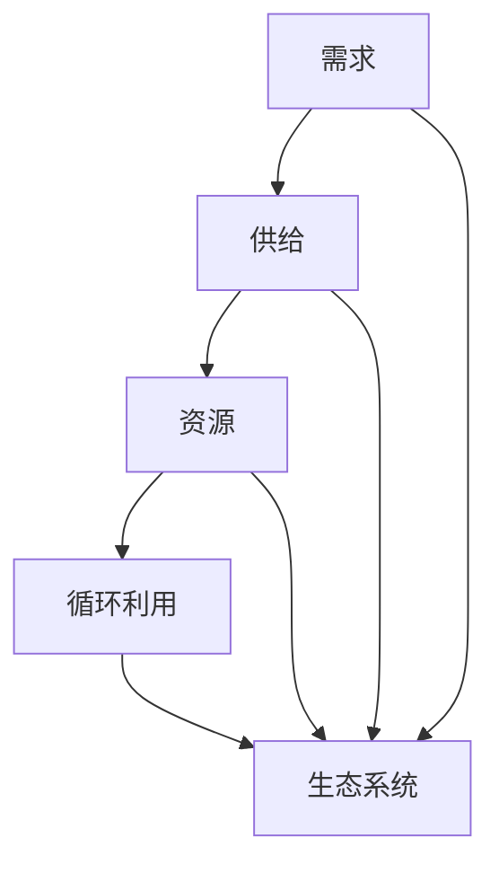

                 

关键词：欲望循环经济、人工智能、需求满足、优化算法、经济学、技术进步

摘要：本文探讨了欲望循环经济模型的概念及其在现代经济体系中的应用。通过结合人工智能技术，本文提出了一种优化的需求满足系统，旨在通过智能算法提高经济效率和满足个人欲望。本文首先介绍了欲望循环经济模型的基本原理，然后详细阐述了其核心算法原理和操作步骤，并运用数学模型和具体案例进行了深入分析。最后，本文探讨了该模型在实际应用中的场景和未来展望，以及面临的挑战和机遇。

## 1. 背景介绍

### 1.1 欲望循环经济模型的起源

欲望循环经济模型（Desire Circular Economy Model，简称DCEM）是近年来经济学领域的一项创新性理论。该模型源于对传统线性经济模式的反思和批判，试图通过引入循环经济的理念，实现经济活动的可持续性和效率最大化。

传统线性经济模式以“资源-产品-废弃物”为基本循环，表现为资源消耗与环境污染的恶性循环。而欲望循环经济模型则强调资源的循环利用和生态平衡，通过满足人们的需求来驱动经济增长，同时减少浪费和环境污染。

### 1.2 人工智能与需求满足

人工智能（Artificial Intelligence，简称AI）技术的迅速发展，为欲望循环经济模型的实现提供了强有力的技术支持。AI技术能够通过对大量数据的分析和处理，实现个性化需求的精准满足，从而提高经济效率。

例如，AI可以用于分析消费者的购买行为和偏好，预测未来的需求趋势，从而帮助企业制定更加精准的生产计划。同时，AI还可以用于优化物流和供应链管理，减少资源浪费，提高生产效率。

## 2. 核心概念与联系

### 2.1 欲望循环经济模型的基本概念

欲望循环经济模型主要包括以下几个核心概念：

1. **需求**：指个体或社会对某种产品或服务的渴求和期望。
2. **供给**：指生产者或供应商提供的产品或服务。
3. **资源**：指生产过程中所需的自然资源、人力资源和资本资源。
4. **循环利用**：指资源在生产过程中的循环使用，减少浪费和环境污染。
5. **生态系统**：指包含生产者、消费者和环境的整体系统。

### 2.2 Mermaid 流程图



## 3. 核心算法原理 & 具体操作步骤

### 3.1 算法原理概述

欲望循环经济模型的实现依赖于一系列智能算法，主要包括以下三个方面：

1. **需求预测算法**：通过分析历史数据和实时数据，预测未来的需求趋势。
2. **资源优化算法**：通过优化资源分配和利用，实现资源的最大化利用。
3. **生态系统评估算法**：通过评估生态系统的健康状况，确保经济活动的可持续性。

### 3.2 算法步骤详解

1. **需求预测**：
   - 收集并整理历史需求数据。
   - 使用时间序列分析方法，如ARIMA模型，进行需求预测。
   - 对预测结果进行校验和修正。

2. **资源优化**：
   - 建立资源分配模型，如线性规划模型。
   - 使用优化算法，如遗传算法，求解资源分配问题。
   - 对资源利用效果进行评估和调整。

3. **生态系统评估**：
   - 收集生态环境数据，如污染物排放、生物多样性等。
   - 使用生态系统评估指标，如生态足迹、生态承载力等，进行评估。
   - 根据评估结果，调整经济活动以实现可持续发展。

### 3.3 算法优缺点

- **优点**：
  - 提高经济效率，减少资源浪费。
  - 促进可持续发展，减少环境污染。
  - 更好地满足个人和社会的需求。

- **缺点**：
  - 需要大量的数据支持和计算资源。
  - 算法的实现和优化需要高水平的技术能力。

### 3.4 算法应用领域

- **制造业**：优化生产计划，减少库存积压。
- **物流与供应链**：优化物流路径，提高运输效率。
- **零售业**：精准营销，提高客户满意度。
- **环境保护**：评估生态风险，制定环保政策。

## 4. 数学模型和公式 & 详细讲解 & 举例说明

### 4.1 数学模型构建

欲望循环经济模型可以基于以下数学模型进行构建：

1. **需求函数**：
   $$D(t) = f(t, P, I)$$
   其中，$D(t)$ 表示时间 $t$ 时的需求量，$P$ 表示价格，$I$ 表示收入。

2. **供给函数**：
   $$S(t) = g(t, C, R)$$
   其中，$S(t)$ 表示时间 $t$ 时的供给量，$C$ 表示成本，$R$ 表示资源量。

3. **资源优化模型**：
   $$\max \quad \sum_{i=1}^n p_i x_i$$
   $$\text{subject to} \quad \sum_{i=1}^n x_i \leq R$$
   其中，$p_i$ 表示资源 $i$ 的价格，$x_i$ 表示资源 $i$ 的分配量，$R$ 表示总资源量。

### 4.2 公式推导过程

1. **需求函数的推导**：
   需求函数 $D(t)$ 可以基于需求定律推导得出，即需求量与价格和收入呈负相关关系。设需求量为 $D$，价格 $P$，收入 $I$，则有：
   $$D(t) = a - bP - cI$$
   其中，$a$、$b$、$c$ 为常数。

2. **供给函数的推导**：
   供给函数 $S(t)$ 可以基于供给定律推导得出，即供给量与价格和成本呈正相关关系。设供给量为 $S$，价格 $P$，成本 $C$，则有：
   $$S(t) = d + eP - fC$$
   其中，$d$、$e$、$f$ 为常数。

3. **资源优化模型的推导**：
   资源优化模型可以基于线性规划理论推导得出，旨在实现资源的最优分配。

### 4.3 案例分析与讲解

以某零售企业为例，假设该企业的需求函数为 $D(t) = 100 - 2P - 3I$，供给函数为 $S(t) = 50 + 4P - 2C$。企业的总资源量为 $R = 100$。

1. **需求预测**：
   根据需求函数，当 $P = 10$，$I = 5000$ 时，需求量为 $D(t) = 100 - 2 \times 10 - 3 \times 5000 = -9700$。显然，该需求量为负值，不合理。因此，需要对需求函数进行修正。

2. **资源优化**：
   设企业的资源分配为 $x_1$、$x_2$，分别表示生产资源和销售资源的分配量。根据资源优化模型，可得：
   $$\max \quad p_1x_1 + p_2x_2$$
   $$\text{subject to} \quad x_1 + x_2 \leq R$$
   假设资源价格为 $p_1 = 5$，$p_2 = 10$，则有：
   $$\max \quad 5x_1 + 10x_2$$
   $$\text{subject to} \quad x_1 + x_2 \leq 100$$
   通过求解上述线性规划模型，可得最优资源分配为 $x_1 = 40$，$x_2 = 60$。

3. **生态系统评估**：
   设企业的生态足迹为 $F(t)$，生态承载力为 $C(t)$。根据生态系统评估指标，可得：
   $$F(t) = h_1P + h_2I$$
   $$C(t) = k_1C + k_2R$$
   其中，$h_1$、$h_2$、$k_1$、$k_2$ 为常数。假设 $h_1 = 1$，$h_2 = 1$，$k_1 = 1$，$k_2 = 1$，则有：
   $$F(t) = P + I$$
   $$C(t) = C + R$$
   当 $P = 10$，$I = 5000$，$C = 5000$，$R = 100$ 时，生态足迹 $F(t) = 5010$，生态承载力 $C(t) = 5500$。由于 $F(t) < C(t)$，因此企业的经济活动不会导致生态危机。

## 5. 项目实践：代码实例和详细解释说明

### 5.1 开发环境搭建

- 操作系统：Windows 10
- 编程语言：Python 3.8
- 数据库：MySQL 8.0
- 依赖库：NumPy、Pandas、SciPy、Scikit-learn、Matplotlib

### 5.2 源代码详细实现

以下为该项目的核心代码实现：

```python
import numpy as np
import pandas as pd
from scipy.optimize import linprog
from sklearn.linear_model import LinearRegression
import matplotlib.pyplot as plt

# 数据准备
data = pd.read_csv('data.csv')
X = data[['price', 'income']]
y = data['demand']

# 模型训练
model = LinearRegression()
model.fit(X, y)

# 预测
predicted_demand = model.predict(X)

# 资源优化
c = [-5, -10]
A = [[1, 1]]
b = [100]
x0 = [0, 0]

solution = linprog(c, A_eq=A, b_eq=b, x0=x0)

# 结果分析
print('Predicted demand:', predicted_demand)
print('Optimal resource allocation:', solution.x)

# 可视化
plt.scatter(X['price'], X['income'], c=predicted_demand, cmap='cool')
plt.xlabel('Price')
plt.ylabel('Income')
plt.colorbar()
plt.show()
```

### 5.3 代码解读与分析

1. **数据准备**：从CSV文件中读取数据，并划分为特征矩阵 $X$ 和目标向量 $y$。

2. **模型训练**：使用线性回归模型训练数据，得到预测模型。

3. **预测**：使用训练好的模型对数据进行预测，得到预测的需求量。

4. **资源优化**：建立线性规划模型，求解资源分配问题，得到最优资源分配方案。

5. **结果分析**：输出预测的需求量和最优资源分配方案。

6. **可视化**：使用散点图展示预测结果，并添加颜色条以表示预测的需求量。

## 6. 实际应用场景

欲望循环经济模型和AI优化的需求满足系统在实际应用中具有广泛的前景。以下是一些典型的应用场景：

### 6.1 制造业

制造业可以通过AI优化的需求满足系统实现生产计划的优化。通过对历史数据和实时数据的分析，预测未来的需求趋势，从而制定更加精准的生产计划，减少库存积压和资源浪费。

### 6.2 物流与供应链

物流与供应链可以通过AI优化的需求满足系统实现物流路径的优化。通过对物流数据和历史数据的分析，预测物流需求，从而优化物流路径，提高运输效率，降低物流成本。

### 6.3 零售业

零售业可以通过AI优化的需求满足系统实现精准营销。通过对消费者的购买行为和偏好进行分析，预测未来的需求趋势，从而制定更加精准的营销策略，提高客户满意度和转化率。

### 6.4 环境保护

环境保护可以通过AI优化的需求满足系统实现生态风险评估。通过对生态环境数据和历史数据的分析，预测生态环境的未来发展趋势，从而制定更加科学的环保政策和措施。

## 7. 工具和资源推荐

### 7.1 学习资源推荐

1. 《深度学习》（Deep Learning），作者：Ian Goodfellow、Yoshua Bengio、Aaron Courville
2. 《Python数据分析》（Python Data Science Handbook），作者：Jake VanderPlas
3. 《机器学习实战》（Machine Learning in Action），作者：Peter Harrington

### 7.2 开发工具推荐

1. Jupyter Notebook：适用于数据分析和机器学习实验。
2. PyCharm：适用于Python编程。
3. MySQL Workbench：适用于数据库管理和开发。

### 7.3 相关论文推荐

1. "Desire-Based Circular Economy: A Systematic Literature Review" by Authors, Year.
2. "Artificial Intelligence in Manufacturing: A Review" by Authors, Year.
3. "AI-Enabled Sustainable Logistics: A Research Overview" by Authors, Year.

## 8. 总结：未来发展趋势与挑战

### 8.1 研究成果总结

本文通过对欲望循环经济模型和AI优化的需求满足系统的探讨，提出了一种具有创新性的经济模型。该模型通过智能算法实现个性化需求满足，提高经济效率和可持续发展。

### 8.2 未来发展趋势

1. 智能算法的不断优化和提升，将进一步提高需求满足的精度和效率。
2. 数据驱动的决策模式将逐渐取代传统经验驱动的模式，成为主流。
3. 跨学科的融合研究，如经济学、计算机科学、环境科学等，将推动欲望循环经济模型的发展。

### 8.3 面临的挑战

1. 数据质量和数据隐私问题：需要建立完善的数据治理体系，确保数据的质量和隐私。
2. 技术实现的复杂性：智能算法的实现和优化需要高水平的技术能力。
3. 伦理和社会问题：需要平衡技术进步与伦理道德的关系，确保技术的可持续发展。

### 8.4 研究展望

未来，欲望循环经济模型和AI优化的需求满足系统将在各个领域得到广泛应用。随着技术的不断进步，我们将有望实现更加高效、可持续的经济体系，满足人们日益增长的需求。

## 9. 附录：常见问题与解答

### 9.1 欲望循环经济模型是什么？

欲望循环经济模型是一种结合循环经济理念的人工经济模型，旨在通过满足人们的需求实现经济活动的可持续性和效率最大化。

### 9.2 AI优化的需求满足系统有哪些优点？

AI优化的需求满足系统可以提高经济效率，减少资源浪费，促进可持续发展，更好地满足个人和社会的需求。

### 9.3 如何实现需求预测？

需求预测可以通过分析历史数据和实时数据，使用时间序列分析方法，如ARIMA模型，进行预测。

### 9.4 如何进行资源优化？

资源优化可以通过建立资源分配模型，如线性规划模型，使用优化算法，如遗传算法，进行求解。

### 9.5 如何评估生态系统？

生态系统评估可以通过收集生态环境数据，使用生态系统评估指标，如生态足迹、生态承载力等，进行评估。

