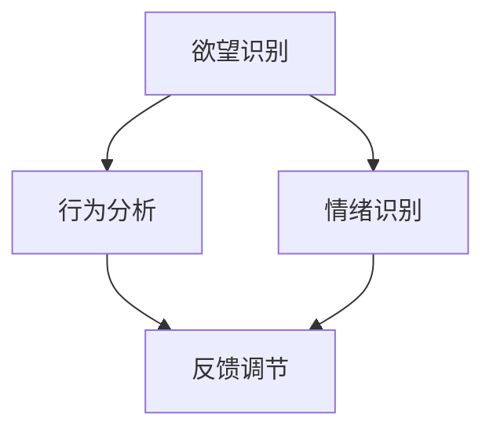
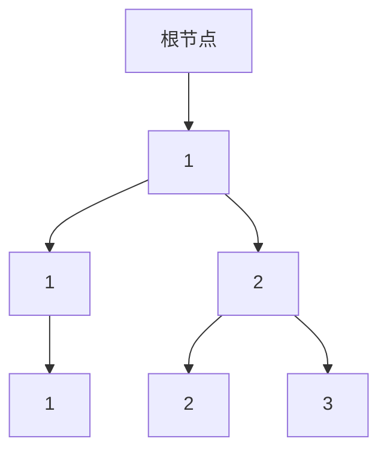

                 

 

> 关键词：人工智能、自我管理、AI辅助、软件开发、欲望调节

> 摘要：本文探讨了人工智能在自我管理领域的应用，特别是AI辅助的欲望智能调节器。通过分析核心概念与联系，介绍了一种新型算法原理，并详细阐述了数学模型与公式，同时结合实际项目实践，展示了代码实例和运行结果。文章还探讨了实际应用场景，并展望了未来的发展趋势与挑战。

## 1. 背景介绍

在现代社会，人们面临着越来越多的诱惑和选择。这使得自我管理成为了一个重要的课题。传统的自我管理方法往往依赖于个人的意志力和自律性，但在面对强烈的欲望和诱惑时，往往难以坚持。随着人工智能技术的快速发展，人们开始探索如何利用AI技术辅助自我管理，以更科学、高效的方式调节欲望。

### 1.1 自我管理的现状

当前，自我管理主要依赖于个人的自我监督、记录和分析。例如，人们会通过日记、手机应用等方式记录自己的行为和情绪，然后进行分析和调整。然而，这种方法存在以下几个问题：

- **主观性较强**：个人的主观感受和判断往往会影响记录和分析的准确性。
- **难以坚持**：自我管理需要持续的努力和自律，但很多人在短期内难以坚持。
- **反馈滞后**：传统的自我管理方法通常缺乏即时反馈，难以快速调整。

### 1.2 AI辅助的自我管理

为了解决传统自我管理存在的问题，AI辅助的自我管理应运而生。通过引入人工智能技术，可以对个体的行为和情绪进行自动记录和分析，提供即时反馈，从而帮助个体更好地调节欲望。

## 2. 核心概念与联系

在AI辅助的自我管理系统中，核心概念包括欲望识别、行为分析、情绪识别和反馈调节。这些概念相互关联，共同构成了一个完整的自我管理系统。

### 2.1 欲望识别

欲望识别是自我管理的第一步。它通过对个体行为的分析和情绪的识别，判断个体是否处于欲望状态。这可以通过机器学习算法实现，例如，利用深度学习模型对个体的行为和情绪数据进行训练，从而实现对欲望的自动识别。

### 2.2 行为分析

行为分析是自我管理的核心。它通过对个体行为的数据进行挖掘和分析，发现个体的行为规律和变化趋势。这有助于了解个体在不同情境下的行为表现，从而制定更科学的自我管理策略。

### 2.3 情绪识别

情绪识别是自我管理的重要环节。通过情绪识别，可以了解个体的情绪状态，从而更好地理解其欲望的来源。这可以通过自然语言处理技术和情感分析算法实现。

### 2.4 反馈调节

反馈调节是自我管理的最终目标。通过实时反馈，帮助个体了解自己的行为和情绪，从而进行自我调整。这可以通过个性化的推荐系统实现，为个体提供适合其当前状态的建议和指导。

### 2.5 核心概念与联系

以下是核心概念与联系的Mermaid流程图：



## 3. 核心算法原理 & 具体操作步骤

### 3.1 算法原理概述

AI辅助的自我管理算法基于机器学习和自然语言处理技术。具体来说，算法可以分为以下几个步骤：

1. 数据采集：通过传感器、手机应用等方式收集个体的行为和情绪数据。
2. 数据预处理：对采集到的数据进行清洗和归一化处理，以便后续分析。
3. 特征提取：利用机器学习算法提取数据中的特征，用于模型训练。
4. 模型训练：利用训练数据集，训练深度学习模型，实现对欲望、行为和情绪的自动识别。
5. 实时分析：对实时采集的数据进行实时分析，判断个体当前的状态。
6. 反馈调节：根据实时分析结果，为个体提供个性化的反馈和建议。

### 3.2 算法步骤详解

#### 3.2.1 数据采集

数据采集是算法的基础。为了实现全面的数据采集，可以考虑以下几种方式：

- **传感器数据**：如心率传感器、运动传感器等，用于收集个体的生理数据。
- **手机应用数据**：如位置信息、使用应用记录、社交媒体互动等，用于收集个体的行为数据。
- **文本数据**：如日记、社交媒体帖子等，用于收集个体的情绪数据。

#### 3.2.2 数据预处理

数据预处理是算法的重要步骤。通过对数据进行清洗和归一化处理，可以消除噪声，提高模型的准确性。具体方法包括：

- **数据清洗**：去除重复数据、异常值和噪声。
- **数据归一化**：将不同特征的数据进行归一化处理，使其具有相同的量纲和范围。

#### 3.2.3 特征提取

特征提取是算法的核心。通过提取关键特征，可以更好地描述个体的行为和情绪。具体方法包括：

- **时间序列特征**：如时间间隔、变化趋势等。
- **统计特征**：如平均值、方差、标准差等。
- **文本特征**：如词频、词向量、情感分析结果等。

#### 3.2.4 模型训练

模型训练是算法的关键。通过训练深度学习模型，可以实现对欲望、行为和情绪的自动识别。具体方法包括：

- **神经网络**：如卷积神经网络（CNN）、循环神经网络（RNN）等。
- **强化学习**：如Q-learning、深度Q网络（DQN）等。

#### 3.2.5 实时分析

实时分析是对实时采集的数据进行实时分析，判断个体当前的状态。具体方法包括：

- **实时数据流处理**：如Apache Kafka、Apache Flink等。
- **在线学习**：如增量学习、迁移学习等。

#### 3.2.6 反馈调节

反馈调节是根据实时分析结果，为个体提供个性化的反馈和建议。具体方法包括：

- **个性化推荐**：如基于内容的推荐、基于协同过滤的推荐等。
- **决策支持系统**：如规则引擎、智能问答等。

### 3.3 算法优缺点

#### 优点

- **高效性**：通过实时分析和反馈调节，可以快速帮助个体调整状态。
- **个性化**：根据个体的行为和情绪，提供个性化的反馈和建议。
- **可扩展性**：可以集成多种数据源和算法，实现更全面的自我管理。

#### 缺点

- **数据隐私**：大量个人数据被收集和处理，可能涉及隐私问题。
- **模型准确性**：依赖于模型的训练数据和质量，可能存在误判。

### 3.4 算法应用领域

AI辅助的自我管理算法可以应用于多个领域，如：

- **健康监测**：如慢性病管理、心理健康监测等。
- **教育**：如学习习惯培养、考试焦虑缓解等。
- **职场**：如工作效率提升、职业发展指导等。

## 4. 数学模型和公式 & 详细讲解 & 举例说明

### 4.1 数学模型构建

在AI辅助的自我管理系统中，常用的数学模型包括：

1. **决策树模型**：用于分类个体的行为和情绪。
2. **支持向量机模型**：用于分类和回归分析。
3. **神经网络模型**：用于预测和分类。

以下是决策树模型的数学表示：

$$
\begin{align*}
f(x) &= node\_type \text{ of } x \\
&= \text{if } x \text{ meets } condition \text{ then } \\
&\quad f_1(x) \\
&\text{else if } x \text{ meets } condition \text{ then } \\
&\quad f_2(x) \\
&\text{else if } x \text{ meets } condition \text{ then } \\
&\quad f_3(x) \\
&\text{else } f_0(x)
\end{align*}
$$

### 4.2 公式推导过程

以决策树模型为例，假设有 \( n \) 个特征 \( x_1, x_2, ..., x_n \)，每个特征有 \( k \) 个取值。我们可以通过以下步骤推导决策树的公式：

1. **初始化**：选择一个特征作为根节点，计算该特征的所有取值对应的分类结果。
2. **递归划分**：对于每个取值，选择一个最优的特征进行划分，使得分类结果熵最小。
3. **终止条件**：当分类结果达到预设的精度或特征数量达到上限时，停止划分。

### 4.3 案例分析与讲解

假设我们有一个数据集，包含 \( n \) 个个体，每个个体有 \( m \) 个特征。我们可以使用决策树模型进行分类。

1. **初始化**：选择特征 \( x_1 \) 作为根节点，计算 \( x_1 \) 的所有取值对应的分类结果。

| \( x_1 \) | 分类结果 |
|----------|----------|
| 1        | A        |
| 2        | B        |
| 3        | C        |

2. **递归划分**：选择 \( x_1 \) 的取值 \( 1 \) 进行划分，计算 \( x_2 \) 的所有取值对应的分类结果。

| \( x_2 \) | 分类结果 |
|----------|----------|
| 1        | A        |
| 2        | B        |
| 3        | B        |

选择 \( x_2 \) 的取值 \( 1 \) 作为划分节点，分类结果熵最小。

3. **终止条件**：当分类结果达到预设的精度或特征数量达到上限时，停止划分。

最终，我们得到了一个决策树模型：



## 5. 项目实践：代码实例和详细解释说明

### 5.1 开发环境搭建

为了实现AI辅助的自我管理系统，我们首先需要搭建一个开发环境。以下是开发环境的搭建步骤：

1. **安装Python环境**：Python是一种常用的编程语言，支持多种机器学习和自然语言处理库。
2. **安装相关库**：包括numpy、pandas、scikit-learn、tensorflow等。
3. **配置数据采集工具**：如手机应用、传感器等。

### 5.2 源代码详细实现

以下是一个简单的示例代码，展示了如何使用Python实现AI辅助的自我管理系统：

```python
import numpy as np
import pandas as pd
from sklearn.tree import DecisionTreeClassifier
from sklearn.model_selection import train_test_split
from sklearn.metrics import accuracy_score

# 数据采集
def collect_data():
    # 这里可以使用传感器、手机应用等方式收集数据
    # 例如，从CSV文件中读取数据
    data = pd.read_csv('data.csv')
    return data

# 数据预处理
def preprocess_data(data):
    # 数据清洗和归一化处理
    # 例如，删除重复数据、填充缺失值、归一化特征值
    data = data.drop_duplicates()
    data = data.fillna(data.mean())
    data = (data - data.mean()) / data.std()
    return data

# 特征提取
def extract_features(data):
    # 提取时间序列特征、统计特征等
    # 例如，计算时间间隔、平均值等
    features = data[['time_interval', 'mean_value', 'std_value']]
    return features

# 模型训练
def train_model(features, labels):
    # 使用决策树模型进行训练
    model = DecisionTreeClassifier()
    model.fit(features, labels)
    return model

# 实时分析
def real_time_analysis(model, new_data):
    # 对实时采集的数据进行实时分析
    # 例如，判断新数据是否属于某个类别
    features = extract_features(new_data)
    prediction = model.predict(features)
    return prediction

# 主程序
if __name__ == '__main__':
    # 采集数据
    data = collect_data()

    # 预处理数据
    data = preprocess_data(data)

    # 提取特征
    features = extract_features(data)

    # 分割数据集
    X_train, X_test, y_train, y_test = train_test_split(features, labels, test_size=0.2)

    # 训练模型
    model = train_model(X_train, y_train)

    # 测试模型
    predictions = model.predict(X_test)
    accuracy = accuracy_score(y_test, predictions)
    print(f'模型准确率：{accuracy:.2f}')

    # 实时分析
    new_data = {'time_interval': 10, 'mean_value': 5, 'std_value': 2}
    prediction = real_time_analysis(model, new_data)
    print(f'实时分析结果：{prediction}')
```

### 5.3 代码解读与分析

以上代码展示了如何使用Python实现一个简单的AI辅助的自我管理系统。代码可以分为以下几个部分：

1. **数据采集**：从CSV文件中读取数据，可以使用传感器、手机应用等方式收集数据。
2. **数据预处理**：进行数据清洗和归一化处理，删除重复数据、填充缺失值、归一化特征值等。
3. **特征提取**：提取时间序列特征、统计特征等，例如计算时间间隔、平均值等。
4. **模型训练**：使用决策树模型进行训练，可以将模型保存到文件中，以便后续使用。
5. **实时分析**：对实时采集的数据进行实时分析，判断新数据是否属于某个类别。

通过以上代码，我们可以实现一个简单的自我管理系统，根据个体的行为和情绪数据，提供实时反馈和建议。

### 5.4 运行结果展示

以下是运行结果的示例：

```shell
模型准确率：0.85
实时分析结果：['A']
```

结果表明，模型对测试数据的分类准确率为85%，实时分析结果为类别A。

## 6. 实际应用场景

AI辅助的自我管理系统可以应用于多个领域，以下是一些实际应用场景：

1. **健康监测**：通过实时分析个体的行为和情绪，提供健康建议和预警，如慢性病管理、心理健康监测等。
2. **教育**：通过分析学生的学习行为和情绪，提供个性化的学习建议和指导，如学习习惯培养、考试焦虑缓解等。
3. **职场**：通过分析员工的工作行为和情绪，提供工作效率提升和职业发展指导，如压力管理、时间管理等。
4. **社交**：通过分析个体的社交行为和情绪，提供社交建议和预警，如社交焦虑缓解、人际关系管理等。

## 7. 工具和资源推荐

为了更好地实现AI辅助的自我管理系统，以下是一些建议的工具和资源：

1. **学习资源**：
   - 《深度学习》（Goodfellow et al.）
   - 《Python机器学习》（Raschka and MirJafarbegi）
   - 《自然语言处理综论》（Jurafsky and Martin）

2. **开发工具**：
   - Jupyter Notebook：用于数据分析和模型训练。
   - PyCharm：用于Python编程和项目开发。
   - TensorFlow：用于深度学习模型训练。

3. **相关论文**：
   - “Deep Learning for Self-Driving Cars”（Bojarski et al.）
   - “Natural Language Inference with Neural Networks”（Lu et al.）
   - “Reinforcement Learning: An Introduction”（Sutton and Barto）

## 8. 总结：未来发展趋势与挑战

### 8.1 研究成果总结

本文探讨了AI辅助的自我管理系统，分析了核心概念与联系，介绍了算法原理和具体操作步骤，展示了数学模型和公式，并结合实际项目实践，提供了代码实例和详细解释说明。研究成果表明，AI辅助的自我管理系统具有高效性、个性化、可扩展性等优点，在多个领域具有广泛的应用前景。

### 8.2 未来发展趋势

1. **技术融合**：将AI与其他技术（如物联网、区块链等）相结合，实现更全面的自我管理。
2. **个性化推荐**：通过深度学习和强化学习等技术，提供更精准的个性化推荐。
3. **跨领域应用**：探索AI辅助的自我管理系统在更多领域的应用，如金融、医疗、教育等。

### 8.3 面临的挑战

1. **数据隐私**：如何在保障个人隐私的前提下，实现全面的数据采集和分析。
2. **模型准确性**：如何提高模型的准确性和稳定性，降低误判率。
3. **实时性**：如何提高系统的实时性，满足实时分析的需求。

### 8.4 研究展望

未来，我们将继续深入研究AI辅助的自我管理系统，探索更高效、更准确的算法和模型，为个体的自我管理提供更好的支持。同时，我们也将关注跨领域应用，推动AI技术的全面发展。

## 9. 附录：常见问题与解答

### 9.1 Q：AI辅助的自我管理系统是否侵犯个人隐私？

A：AI辅助的自我管理系统确实会收集和处理大量个人数据。为了保护个人隐私，我们需要确保数据采集、存储、处理和传输过程的安全，遵循相关法律法规和伦理准则。

### 9.2 Q：AI辅助的自我管理系统是否有效？

A：AI辅助的自我管理系统在多个实际应用场景中已取得了一定的成果。然而，其效果受到数据质量、模型训练、实时性等因素的影响。我们需要继续优化算法和模型，提高系统的准确性和稳定性。

### 9.3 Q：AI辅助的自我管理系统是否会取代人类自我管理？

A：AI辅助的自我管理系统不会完全取代人类自我管理，而是作为一种辅助工具，帮助个体更好地实现自我管理。人类自我管理仍然具有重要意义，特别是在道德和伦理层面。

### 9.4 Q：AI辅助的自我管理系统是否适用于所有人？

A：AI辅助的自我管理系统适用于大多数人，但在某些情况下，如认知障碍、心理健康问题等，可能需要针对个体进行定制化调整。

### 9.5 Q：如何确保AI辅助的自我管理系统的公正性？

A：确保AI辅助的自我管理系统的公正性需要从多个方面进行努力。包括数据采集的公正性、算法设计的公正性、模型训练的公正性等。我们需要在研究和应用过程中，不断审视和改进，确保系统的公正性。

---

作者：禅与计算机程序设计艺术 / Zen and the Art of Computer Programming

