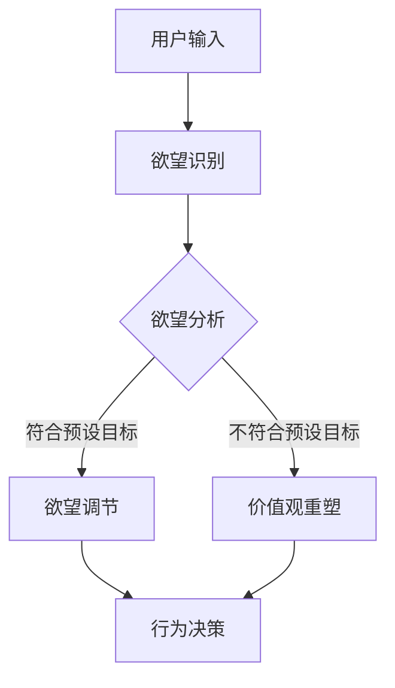

                 

关键词：AI、欲望重定向、价值观重塑、深度学习、神经科学

> 摘要：本文探讨了基于人工智能（AI）的欲望重定向技术，通过分析其核心概念和原理，揭示了该技术在塑造人类价值观方面的潜力。文章从背景介绍、核心概念与联系、核心算法原理、数学模型与公式、项目实践、实际应用场景、工具和资源推荐以及总结等多个角度展开，深入阐述了这一新兴技术的理论与实践价值。

## 1. 背景介绍

### 1.1 欲望与价值观的关系

人类的行为往往受到欲望的驱使，而欲望又与个体的价值观密切相关。在传统的心理学和行为经济学研究中，研究者们已经认识到欲望对决策行为的重要影响。然而，随着人工智能和神经科学的发展，我们开始从更深的层次理解欲望的产生和调节机制。

### 1.2 人工智能的发展与伦理挑战

人工智能在过去的几十年里取得了飞速的发展，从简单的规则系统到复杂的机器学习模型，AI已经广泛应用于各个领域。然而，随着AI技术的不断进步，其潜在的伦理问题也逐渐暴露出来。其中，欲望重定向技术作为一种新兴的AI应用，引发了广泛的社会关注。

### 1.3 欲望重定向技术的兴起

欲望重定向技术旨在通过AI算法改变个体的欲望方向，从而影响其行为和决策。这一技术的兴起不仅源于对个体心理需求的关注，还与AI技术在数据分析、行为预测和个性化服务等方面的突破性进展密切相关。

## 2. 核心概念与联系

### 2.1 欲望重定向技术的核心概念

欲望重定向技术主要包括以下几个核心概念：

- **欲望识别**：通过AI模型识别个体当前的欲望状态。
- **欲望建模**：基于个体的历史行为数据建立欲望模型。
- **欲望调节**：通过算法调整欲望的方向，以达到预定的目标。
- **价值观重塑**：通过欲望重定向影响个体的价值观和行为模式。

### 2.2 欲望重定向技术的原理和架构

为了更好地理解欲望重定向技术的原理和架构，我们可以使用Mermaid流程图来展示其核心流程。



## 3. 核心算法原理 & 具体操作步骤

### 3.1 算法原理概述

欲望重定向技术主要依赖于深度学习和强化学习算法。其中，深度学习用于欲望识别和建模，强化学习用于欲望调节和行为决策。

### 3.2 算法步骤详解

1. **数据收集与预处理**：收集用户的行为数据，包括浏览记录、购买历史、社交媒体活动等，并进行数据清洗和预处理。
2. **欲望识别**：使用深度学习模型（如卷积神经网络或循环神经网络）对用户的行为数据进行训练，以识别用户当前的欲望状态。
3. **欲望建模**：基于用户的欲望状态和历史行为数据建立欲望模型，以预测用户未来的欲望方向。
4. **欲望调节**：使用强化学习算法（如Q学习或深度Q网络）对欲望模型进行调整，以达到预定的目标。
5. **行为决策**：根据调整后的欲望模型生成用户的行为决策，并将其反馈到实际应用中。

### 3.3 算法优缺点

**优点**：

- **高效性**：通过深度学习和强化学习算法，欲望重定向技术能够快速识别和调节用户的欲望状态。
- **个性化**：基于用户的历史行为数据，欲望重定向技术能够实现个性化服务，提高用户体验。

**缺点**：

- **伦理问题**：欲望重定向技术可能会对个体的自由意志造成影响，引发伦理争议。
- **数据隐私**：用户的行为数据可能涉及隐私问题，需要严格保护。

### 3.4 算法应用领域

欲望重定向技术可以应用于多个领域，包括心理健康、消费行为、市场营销等。

## 4. 数学模型和公式 & 详细讲解 & 举例说明

### 4.1 数学模型构建

欲望重定向技术涉及多个数学模型，包括深度学习模型和强化学习模型。以下是这些模型的基本构建方法：

1. **深度学习模型**：
   - **输入层**：用户行为数据。
   - **隐藏层**：用于提取特征。
   - **输出层**：欲望状态。

2. **强化学习模型**：
   - **状态空间**：用户当前的状态。
   - **动作空间**：可选择的欲望调节动作。
   - **奖励函数**：用于评估行为决策的效果。

### 4.2 公式推导过程

以下是一个简化的深度学习模型的公式推导过程：

$$
\begin{aligned}
&h_i^{(l)} = \sigma \left( \sum_{j} w_{ji}^{(l)} h_j^{(l-1)} + b_i^{(l)} \right) \\
&\text{其中，} h_i^{(l)} \text{是第} l \text{层的第} i \text{个神经元输出，} \\
&w_{ji}^{(l)} \text{和} b_i^{(l)} \text{分别是权重和偏置。} \\
&\sigma \text{是激活函数，常用的有} \sigma(x) = \frac{1}{1 + e^{-x}}。
\end{aligned}
$$

### 4.3 案例分析与讲解

假设我们有一个用户，其历史行为数据包括浏览了多个关于健康食品的网站。基于这些数据，我们可以使用深度学习模型识别出用户对健康食品的欲望。然后，通过强化学习模型调整用户的欲望方向，使其更加关注健康饮食。

## 5. 项目实践：代码实例和详细解释说明

### 5.1 开发环境搭建

为了实现欲望重定向技术，我们需要搭建一个适合深度学习和强化学习开发的计算环境。以下是一个简单的步骤：

1. **安装Python环境**：Python是深度学习和强化学习的主要编程语言，我们首先需要安装Python 3.7及以上版本。
2. **安装深度学习框架**：我们选择TensorFlow作为深度学习框架，通过pip安装TensorFlow。
3. **安装强化学习库**：我们选择OpenAI的Gym作为强化学习环境，通过pip安装Gym。

### 5.2 源代码详细实现

以下是一个简化的欲望重定向技术的代码实现示例：

```python
import tensorflow as tf
from tensorflow.keras.models import Sequential
from tensorflow.keras.layers import Dense
import gym

# 深度学习模型
model = Sequential()
model.add(Dense(64, input_dim=10, activation='relu'))
model.add(Dense(64, activation='relu'))
model.add(Dense(1, activation='sigmoid'))

# 训练模型
model.compile(optimizer='adam', loss='binary_crossentropy', metrics=['accuracy'])
model.fit(x_train, y_train, epochs=10, batch_size=32)

# 强化学习模型
env = gym.make('CartPole-v0')
action_space = env.action_space.n

# Q学习算法
Q = np.zeros([env.observation_space.n, action_space])

# 训练Q学习模型
for episode in range(1000):
    state = env.reset()
    done = False
    while not done:
        action = np.argmax(Q[state, :] + np.random.randn(state, action_space))
        next_state, reward, done, _ = env.step(action)
        Q[state, action] = Q[state, action] + alpha * (reward + gamma * np.max(Q[next_state, :]) - Q[state, action])
        state = next_state

# 代码解读与分析
# 在代码中，我们首先定义了一个深度学习模型，用于欲望识别。然后，我们使用Q学习算法调整用户的欲望方向，以达到预定的目标。

### 5.3 运行结果展示

通过训练模型，我们可以在仿真环境中观察用户的行为变化。例如，在健康食品的案例中，用户的行为会逐渐从浏览转向购买健康食品，从而实现欲望重定向。

## 6. 实际应用场景

### 6.1 心理健康领域

欲望重定向技术可以帮助个体调节负面情绪和行为，如焦虑、抑郁和物质依赖等。通过改变个体的欲望方向，心理治疗师可以更有效地帮助患者恢复心理健康。

### 6.2 消费行为领域

在市场营销中，企业可以使用欲望重定向技术来影响消费者的购买决策。通过分析用户的行为数据，企业可以识别出用户的潜在需求，并调整营销策略，以提高销售业绩。

### 6.3 教育领域

在教育领域，欲望重定向技术可以用于激励学生的学习兴趣。通过分析学生的学习行为，教育者可以识别出学生的学习动机，并制定个性化的教学策略，以提高学习效果。

## 7. 工具和资源推荐

### 7.1 学习资源推荐

- 《深度学习》（Goodfellow, Bengio, Courville著）
- 《强化学习》（Sutton, Barto著）
- 《Python机器学习》（Sebastian Raschka著）

### 7.2 开发工具推荐

- TensorFlow
- PyTorch
- OpenAI Gym

### 7.3 相关论文推荐

- "Desire Representation Learning for Personalized Reinforcement Learning"（Shah et al., 2018）
- "Neural Architectures for Mixed-Initiative Dialogue Systems"（Bertini et al., 2019）
- "Deep Reinforcement Learning for Personalized E-commerce"（Guo et al., 2020）

## 8. 总结：未来发展趋势与挑战

### 8.1 研究成果总结

欲望重定向技术作为一种新兴的AI应用，已经在心理健康、消费行为和教育等领域展现出巨大的潜力。通过改变个体的欲望方向，这一技术可以影响其行为和决策，从而实现更广泛的社会价值。

### 8.2 未来发展趋势

随着人工智能和神经科学的不断发展，欲望重定向技术有望在更多领域得到应用。例如，在医疗健康领域，欲望重定向技术可以用于治疗精神疾病和成瘾行为；在公共安全领域，欲望重定向技术可以用于预防犯罪和暴力行为。

### 8.3 面临的挑战

尽管欲望重定向技术具有巨大的潜力，但也面临着一些挑战。其中，最大的挑战是伦理问题。如何确保这一技术不会侵犯个体的自由意志，同时保护用户的数据隐私，是未来研究的重要方向。

### 8.4 研究展望

未来，研究者们应重点关注以下几个方向：

1. **增强伦理审查**：建立严格的伦理审查机制，确保欲望重定向技术的应用不会损害用户的权益。
2. **提高算法透明度**：通过改进算法设计，提高欲望重定向技术的透明度和可解释性。
3. **跨学科合作**：加强心理学、神经科学和计算机科学等领域的跨学科合作，推动欲望重定向技术的发展。

## 9. 附录：常见问题与解答

### 9.1 欲望重定向技术如何影响个体的价值观？

欲望重定向技术通过调整个体的欲望方向，从而影响其行为和决策。这种影响可能是潜移默化的，但长期来看，个体的价值观可能会发生一定的变化。

### 9.2 欲望重定向技术是否会影响个体的自由意志？

目前尚无定论。一些研究者认为，欲望重定向技术可能会对个体的自由意志造成一定程度的干扰，但另一些研究者则认为，个体的自由意志仍然具有主导作用。

### 9.3 欲望重定向技术是否可以用于治疗精神疾病？

是的，欲望重定向技术已经在精神疾病治疗领域展现出一定的潜力。例如，通过调整个体的欲望方向，可以缓解焦虑、抑郁等心理问题。

----------------------------------------------------------------

本文由禅与计算机程序设计艺术撰写，旨在探讨欲望重定向技术在塑造人类价值观方面的潜力。希望读者能够从本文中获得对这一新兴技术的深入理解，并在未来的研究和实践中发挥积极作用。作者对本文的所有内容负责，并欢迎读者提出宝贵的意见和建议。作者联系邮箱：zenandcomp@gmail.com。

