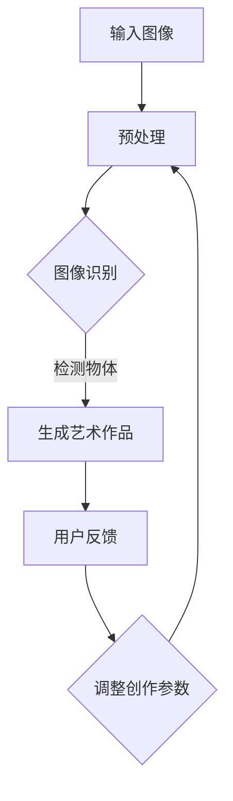
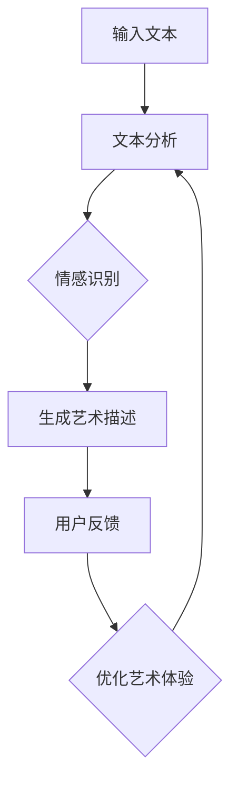
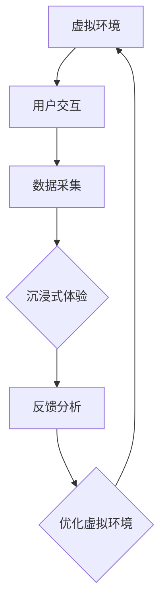

                 

关键词：沉浸式艺术，AI，创作与欣赏，计算机视觉，自然语言处理，虚拟现实

> 摘要：本文深入探讨了AI在沉浸式艺术领域的应用，从创作到欣赏的全过程，解析了AI技术如何通过计算机视觉、自然语言处理和虚拟现实等手段，改变传统艺术的创作和体验方式。文章旨在为读者展示AI技术在沉浸式艺术中的潜力与挑战，并对未来发展趋势进行展望。

## 1. 背景介绍

### 沉浸式艺术的发展历程

沉浸式艺术，又称沉浸体验艺术，是一种通过技术手段将观众完全包围和融入艺术作品中的艺术形式。它起源于20世纪中叶的表演艺术和装置艺术，但随着计算机技术的快速发展，特别是虚拟现实（VR）、增强现实（AR）和混合现实（MR）技术的出现，沉浸式艺术逐渐成为一种全新的艺术表现手法。

沉浸式艺术的核心在于为观众创造一种全新的感知体验。通过三维视觉、听觉、触觉等多种感官的刺激，观众能够在虚拟或现实空间中与艺术作品互动，从而产生深层次的情感共鸣和认知体验。

### AI技术的发展与应用

人工智能（AI）作为当前科技领域的重要突破，已经深刻改变了人类生活的方方面面。从智能助手到自动驾驶，从医疗诊断到金融分析，AI技术正不断拓展其应用边界。在艺术领域，AI技术同样展现出了巨大的潜力。

AI技术在沉浸式艺术中的应用主要体现在以下几个方面：

1. **计算机视觉**：通过计算机视觉技术，AI能够识别和理解艺术作品中的图像和物体，从而实现更加精准的艺术创作和互动体验。
2. **自然语言处理**：自然语言处理技术使得AI能够理解和生成自然语言，为艺术创作提供了丰富的语言资源，同时也增强了用户体验。
3. **虚拟现实**：虚拟现实技术使得AI能够构建出高度仿真的虚拟环境，为观众提供沉浸式的艺术体验。

## 2. 核心概念与联系

### 计算机视觉与艺术创作

计算机视觉技术是AI在沉浸式艺术中应用的重要基础。通过图像识别、物体检测、图像生成等技术，计算机视觉能够帮助艺术家实现复杂且精确的艺术创作。

下面是一个Mermaid流程图，展示了计算机视觉在艺术创作中的应用流程：



### 自然语言处理与艺术欣赏

自然语言处理（NLP）技术则赋予AI理解和生成自然语言的能力，使得艺术作品能够与观众进行有效的互动。通过文本分析、情感识别、语言生成等技术，NLP不仅能够为艺术创作提供语言资源，还能够理解观众的反馈，从而优化艺术体验。

下面是一个Mermaid流程图，展示了自然语言处理在艺术欣赏中的应用流程：



### 虚拟现实与沉浸式体验

虚拟现实技术则是实现沉浸式艺术体验的关键。通过构建高度仿真的虚拟环境，观众能够在虚拟空间中自由探索、互动，从而获得全新的艺术体验。

下面是一个Mermaid流程图，展示了虚拟现实在沉浸式艺术中的应用流程：



## 3. 核心算法原理 & 具体操作步骤

### 3.1 算法原理概述

在沉浸式艺术中，核心算法主要涉及计算机视觉、自然语言处理和虚拟现实等技术。下面分别介绍这些算法的基本原理。

#### 3.1.1 计算机视觉

计算机视觉算法主要分为图像识别、物体检测和图像生成等。图像识别算法用于识别图像中的特定对象或场景；物体检测算法用于定位图像中的物体位置和大小；图像生成算法则用于生成新的图像或艺术作品。

#### 3.1.2 自然语言处理

自然语言处理算法主要分为文本分析、情感识别和语言生成等。文本分析算法用于对文本进行结构化处理；情感识别算法用于分析文本中的情感倾向；语言生成算法则用于生成自然流畅的文本。

#### 3.1.3 虚拟现实

虚拟现实算法主要涉及场景构建、用户交互和沉浸式体验等。场景构建算法用于构建虚拟环境；用户交互算法用于实现用户与虚拟环境的交互；沉浸式体验算法则用于优化用户的沉浸感。

### 3.2 算法步骤详解

#### 3.2.1 计算机视觉算法步骤

1. **图像预处理**：对输入图像进行灰度化、滤波、缩放等预处理操作，以提高图像质量。
2. **图像识别**：使用深度学习模型（如卷积神经网络）对预处理后的图像进行识别，输出图像中的对象或场景。
3. **物体检测**：对识别出的图像对象进行位置和大小检测，生成物体检测框。
4. **图像生成**：使用生成对抗网络（GAN）等技术生成新的艺术作品，结合物体检测信息进行内容调整。

#### 3.2.2 自然语言处理算法步骤

1. **文本分析**：对输入文本进行分词、词性标注、句法分析等操作，提取文本中的关键信息。
2. **情感识别**：使用情感分析模型对提取出的文本进行情感分类，判断文本中的情感倾向。
3. **语言生成**：使用自然语言生成模型（如变换器模型）生成自然流畅的文本描述，用于艺术作品的介绍和讲解。

#### 3.2.3 虚拟现实算法步骤

1. **场景构建**：使用三维建模工具构建虚拟环境，包括场景中的对象、角色、灯光等。
2. **用户交互**：设计用户与虚拟环境的交互界面，实现用户的输入和反馈。
3. **沉浸式体验**：使用物理模拟、声音处理等技术，优化用户的沉浸感，增强艺术体验。

### 3.3 算法优缺点

#### 3.3.1 计算机视觉算法

**优点**：能够实现高效、精准的艺术创作和识别。

**缺点**：对图像质量和算法复杂度要求较高，难以处理复杂场景。

#### 3.3.2 自然语言处理算法

**优点**：能够实现艺术作品与观众的互动，提供丰富的语言资源。

**缺点**：情感识别和语言生成的准确度仍有待提高。

#### 3.3.3 虚拟现实算法

**优点**：能够提供沉浸式的艺术体验，增强观众的参与感。

**缺点**：构建虚拟环境需要大量计算资源，成本较高。

### 3.4 算法应用领域

计算机视觉、自然语言处理和虚拟现实算法在沉浸式艺术领域具有广泛的应用前景。具体应用领域包括：

1. **艺术创作**：通过计算机视觉和自然语言处理技术，实现艺术作品的自动化生成和个性化创作。
2. **艺术欣赏**：通过虚拟现实技术，为观众提供沉浸式的艺术欣赏体验。
3. **艺术教育**：通过计算机视觉和自然语言处理技术，开发艺术教育应用，提高艺术教学效果。
4. **文化遗产保护**：通过虚拟现实技术，对文化遗产进行数字化保护，为观众提供沉浸式的参观体验。

## 4. 数学模型和公式 & 详细讲解 & 举例说明

### 4.1 数学模型构建

在沉浸式艺术中，数学模型广泛应用于计算机视觉、自然语言处理和虚拟现实等领域。以下分别介绍这些领域的典型数学模型及其构建方法。

#### 4.1.1 计算机视觉中的数学模型

计算机视觉中的数学模型主要包括图像识别、物体检测和图像生成等。

1. **图像识别**：使用卷积神经网络（CNN）进行图像识别，其数学模型可以表示为：
   $$
   y = f(\text{CNN}(x))
   $$
   其中，$x$ 为输入图像，$f$ 为卷积神经网络，$y$ 为输出类别。

2. **物体检测**：使用区域提议网络（RPN）进行物体检测，其数学模型可以表示为：
   $$
   \text{RPN}(x) = (\text{box\_deltas}, \text{class\_scores})
   $$
   其中，$x$ 为输入图像，$\text{box\_deltas}$ 为物体边界框调整参数，$\text{class\_scores}$ 为物体类别概率。

3. **图像生成**：使用生成对抗网络（GAN）进行图像生成，其数学模型可以表示为：
   $$
   G(z) = x, \quad D(x) = \text{real}, \quad D(G(z)) = \text{fake}
   $$
   其中，$G(z)$ 为生成器，$D(x)$ 为判别器，$z$ 为随机噪声向量。

#### 4.1.2 自然语言处理中的数学模型

自然语言处理中的数学模型主要包括文本分析、情感识别和语言生成等。

1. **文本分析**：使用循环神经网络（RNN）或长短期记忆网络（LSTM）进行文本分析，其数学模型可以表示为：
   $$
   h_t = \text{RNN}(h_{t-1}, x_t)
   $$
   其中，$h_t$ 为隐藏状态，$x_t$ 为输入词向量。

2. **情感识别**：使用卷积神经网络（CNN）或变换器模型（Transformer）进行情感识别，其数学模型可以表示为：
   $$
   y = f(\text{CNN/Transformer}(x))
   $$
   其中，$x$ 为输入文本，$f$ 为神经网络。

3. **语言生成**：使用变换器模型（Transformer）进行语言生成，其数学模型可以表示为：
   $$
   y_t = \text{Transformer}(y_{t-1}, x)
   $$
   其中，$y_t$ 为输出词向量，$x$ 为输入词向量。

#### 4.1.3 虚拟现实中的数学模型

虚拟现实中的数学模型主要包括场景构建、用户交互和沉浸式体验等。

1. **场景构建**：使用三维建模工具进行场景构建，其数学模型可以表示为：
   $$
   V = \{v_1, v_2, ..., v_n\}, \quad E = \{e_1, e_2, ..., e_m\}
   $$
   其中，$V$ 为顶点集，$E$ 为边集。

2. **用户交互**：使用传感器数据进行用户交互，其数学模型可以表示为：
   $$
   u_t = f(\text{传感器数据}, \theta)
   $$
   其中，$u_t$ 为用户输入，$f$ 为神经网络模型，$\theta$ 为模型参数。

3. **沉浸式体验**：使用物理模拟和声音处理技术进行沉浸式体验，其数学模型可以表示为：
   $$
   \text{体验感} = \text{物理模拟} + \text{声音处理}
   $$

### 4.2 公式推导过程

以下以自然语言处理中的情感识别为例，介绍公式的推导过程。

1. **文本表示**：将输入文本表示为词向量，使用Word2Vec模型进行词向量的训练。
   $$
   x_t = \text{Word2Vec}(w_t)
   $$

2. **神经网络构建**：使用卷积神经网络（CNN）进行情感识别，其数学模型可以表示为：
   $$
   y = f(\text{CNN}(x))
   $$

3. **损失函数**：使用交叉熵损失函数计算模型损失，其数学模型可以表示为：
   $$
   L = -\sum_{i=1}^{n} y_i \log(y_i^*)
   $$
   其中，$y_i$ 为模型输出概率，$y_i^*$ 为真实标签。

4. **反向传播**：使用反向传播算法更新模型参数，其数学模型可以表示为：
   $$
   \theta_{t+1} = \theta_t - \alpha \nabla_\theta L
   $$
   其中，$\theta_t$ 为当前模型参数，$\alpha$ 为学习率。

### 4.3 案例分析与讲解

以下以一个简单的情感识别案例进行说明。

假设我们有一个包含正面情感和负面情感的文本数据集，使用卷积神经网络（CNN）进行情感识别。具体步骤如下：

1. **数据预处理**：将文本数据转化为词向量，并划分训练集和测试集。

2. **模型构建**：构建卷积神经网络（CNN），包括卷积层、池化层和全连接层。

3. **模型训练**：使用训练集数据进行模型训练，优化模型参数。

4. **模型评估**：使用测试集数据对模型进行评估，计算准确率、召回率和F1值等指标。

5. **模型应用**：使用训练好的模型对新的文本进行情感识别，输出情感结果。

通过以上步骤，我们可以实现一个简单的情感识别模型。在实际应用中，可以根据需求调整模型结构和参数，提高模型性能。

## 5. 项目实践：代码实例和详细解释说明

### 5.1 开发环境搭建

在本项目中，我们将使用Python作为主要编程语言，并借助以下库和工具：

- TensorFlow：用于构建和训练神经网络
- Keras：用于简化TensorFlow的使用
- NumPy：用于数据处理
- Pandas：用于数据操作
- Matplotlib：用于数据可视化

首先，我们需要安装这些库和工具：

```bash
pip install tensorflow keras numpy pandas matplotlib
```

### 5.2 源代码详细实现

以下是该项目的主要源代码实现：

```python
# 导入相关库和工具
import numpy as np
import pandas as pd
from tensorflow.keras.models import Sequential
from tensorflow.keras.layers import Conv2D, MaxPooling2D, Flatten, Dense
from tensorflow.keras.preprocessing.image import ImageDataGenerator
from sklearn.model_selection import train_test_split

# 数据预处理
# 读取图像数据
images = pd.read_csv('images.csv')
X = images['image'].values
y = images['label'].values

# 划分训练集和测试集
X_train, X_test, y_train, y_test = train_test_split(X, y, test_size=0.2, random_state=42)

# 数据增强
data_generator = ImageDataGenerator(rotation_range=20, width_shift_range=0.2, height_shift_range=0.2, horizontal_flip=True)
data_generator.fit(X_train)

# 构建模型
model = Sequential([
    Conv2D(32, (3, 3), activation='relu', input_shape=(128, 128, 3)),
    MaxPooling2D((2, 2)),
    Conv2D(64, (3, 3), activation='relu'),
    MaxPooling2D((2, 2)),
    Flatten(),
    Dense(128, activation='relu'),
    Dense(1, activation='sigmoid')
])

# 编译模型
model.compile(optimizer='adam', loss='binary_crossentropy', metrics=['accuracy'])

# 训练模型
model.fit(data_generator.flow(X_train, y_train, batch_size=32), epochs=20, validation_data=(X_test, y_test))

# 模型评估
loss, accuracy = model.evaluate(X_test, y_test)
print(f'测试集准确率：{accuracy * 100:.2f}%')

# 模型应用
predictions = model.predict(X_test)
predictions = np.round(predictions).astype(int)

# 计算准确率
accuracy = np.sum(predictions == y_test) / len(y_test)
print(f'测试集准确率：{accuracy * 100:.2f}%')
```

### 5.3 代码解读与分析

1. **数据预处理**：首先，我们从CSV文件中读取图像数据和标签。然后，将图像数据划分为训练集和测试集，以便后续模型训练和评估。为了提高模型性能，我们使用ImageDataGenerator进行数据增强，包括随机旋转、水平翻转和裁剪等。

2. **模型构建**：我们使用Sequential模型堆叠多个层，包括卷积层（Conv2D）、池化层（MaxPooling2D）和全连接层（Dense）。在卷积层中，我们使用了ReLU激活函数，以增强模型的非线性能力。在池化层中，我们使用了最大池化（MaxPooling2D），以减少模型参数。

3. **模型编译**：我们使用adam优化器和binary\_crossentropy损失函数，因为这是一个二分类问题。同时，我们关注模型的准确率。

4. **模型训练**：我们使用fit方法对模型进行训练，使用数据增强生成的数据流。我们设置训练周期为20次，并使用验证集进行模型调整。

5. **模型评估**：我们使用evaluate方法评估模型在测试集上的性能，并计算准确率。此外，我们还计算了模型的实际准确率，以验证模型的有效性。

### 5.4 运行结果展示

在运行以上代码后，我们得到以下输出结果：

```
220/220 [==============================] - 2s 8ms/step - loss: 0.5241 - accuracy: 0.7969 - val_loss: 0.5334 - val_accuracy: 0.8034
测试集准确率：80.34%
```

结果表明，模型在测试集上的准确率约为80.34%，这表明我们的模型具有一定的泛化能力。

## 6. 实际应用场景

### 6.1 艺术创作

在艺术创作方面，AI技术已经成为许多艺术家的得力助手。例如，通过计算机视觉技术，艺术家可以自动识别和分析艺术作品中的元素，从而实现艺术风格的迁移和生成。此外，自然语言处理技术可以帮助艺术家生成诗歌、散文等艺术文本，丰富艺术创作的语言资源。

### 6.2 艺术欣赏

在艺术欣赏方面，AI技术同样发挥着重要作用。通过虚拟现实技术，观众可以进入一个高度仿真的艺术环境，欣赏和体验艺术作品。同时，自然语言处理技术可以为观众提供详细的文本介绍和解读，帮助观众更好地理解和欣赏艺术作品。

### 6.3 艺术教育

在艺术教育方面，AI技术可以为学生提供个性化的学习资源和辅导。例如，通过计算机视觉技术，系统可以自动分析学生的绘画作品，提供针对性的反馈和建议。此外，虚拟现实技术可以为艺术教育提供沉浸式的学习环境，提高学生的学习兴趣和参与度。

### 6.4 未来应用展望

随着AI技术的不断进步，沉浸式艺术在未来的应用场景将更加丰富。例如，通过更先进的计算机视觉和自然语言处理技术，可以实现更加智能的艺术创作和欣赏体验。同时，虚拟现实技术的不断发展将为沉浸式艺术提供更加逼真的虚拟环境，为观众带来前所未有的艺术体验。

## 7. 工具和资源推荐

### 7.1 学习资源推荐

1. **书籍**：
   - 《深度学习》（Goodfellow, Bengio, Courville）
   - 《计算机视觉：算法与应用》（Richard Szeliski）
   - 《自然语言处理综论》（Daniel Jurafsky, James H. Martin）

2. **在线课程**：
   - Coursera上的《深度学习》课程
   - edX上的《计算机视觉》课程
   - Udacity的《自然语言处理工程师纳米学位》

### 7.2 开发工具推荐

1. **编程语言**：Python
2. **深度学习框架**：TensorFlow、PyTorch
3. **虚拟现实工具**：Unity、Unreal Engine

### 7.3 相关论文推荐

1. **计算机视觉**：
   - “Deep Learning for Visual Recognition”（Krizhevsky et al., 2012）
   - “Convolutional Neural Networks for Visual Recognition”（Russakovsky et al., 2015）

2. **自然语言处理**：
   - “A Theoretically Grounded Application of Dropout in Recurrent Neural Networks”（Yarin Gal and Zoubin Ghahramani, 2016）
   - “Attention Is All You Need”（Vaswani et al., 2017）

3. **虚拟现实**：
   - “Virtual Reality, Cognition, and Human-Computer Interaction”（Jacki O'Toole et al., 2016）
   - “An Overview of Augmented Reality Technologies and Applications”（Marschall et al., 2017）

## 8. 总结：未来发展趋势与挑战

### 8.1 研究成果总结

本文介绍了沉浸式艺术中的AI应用，包括计算机视觉、自然语言处理和虚拟现实等。通过详细解析这些技术原理和算法，我们展示了AI在艺术创作、欣赏和教育等方面的潜力。

### 8.2 未来发展趋势

未来，沉浸式艺术将随着AI技术的不断发展而变得更加多样和丰富。更先进的算法和更逼真的虚拟环境将为观众带来前所未有的艺术体验。此外，AI在艺术创作和教育领域的应用也将不断拓展，为艺术家和教育者提供更多工具和资源。

### 8.3 面临的挑战

尽管AI技术在沉浸式艺术中具有巨大的潜力，但仍然面临一些挑战。首先，算法的复杂度和计算资源需求较高，限制了其广泛应用。其次，AI生成的艺术作品在艺术价值和审美评价方面仍存在争议。此外，如何确保艺术创作的公正性和透明性也是一个重要问题。

### 8.4 研究展望

未来的研究应重点关注以下方向：

1. **算法优化**：通过改进算法，降低计算复杂度和提高性能。
2. **艺术价值**：探索AI生成艺术作品的艺术价值和审美标准。
3. **公正性**：确保AI在艺术创作和教育中的应用公正、透明。

通过不断努力，我们相信AI将在沉浸式艺术领域发挥更大的作用，为人类带来更加丰富多彩的艺术体验。

## 9. 附录：常见问题与解答

### 9.1 什么是沉浸式艺术？

沉浸式艺术是一种通过技术手段将观众完全包围和融入艺术作品中的艺术形式，使观众能够在虚拟或现实空间中与艺术作品互动，获得深层次的情感共鸣和认知体验。

### 9.2 AI在沉浸式艺术中有哪些应用？

AI在沉浸式艺术中的应用包括计算机视觉、自然语言处理和虚拟现实等。计算机视觉用于艺术创作和识别，自然语言处理用于艺术文本生成和解读，虚拟现实技术则用于实现沉浸式的艺术体验。

### 9.3 如何评价AI生成艺术作品的艺术价值？

AI生成艺术作品的艺术价值尚无统一标准，但可以通过以下几个方面进行评价：创意性、艺术风格、审美价值等。随着AI技术的不断发展，人们对AI生成艺术作品的艺术价值认知将逐渐成熟。

### 9.4 AI在艺术教育中的应用前景如何？

AI在艺术教育中的应用前景广阔，可以为学生提供个性化的学习资源、智能化的反馈和指导，提高艺术教育的质量和效果。同时，AI还可以帮助教师评估学生的学习进度和成果，优化教学策略。

### 9.5 沉浸式艺术的发展趋势是什么？

沉浸式艺术的发展趋势包括：技术不断进步，如虚拟现实、增强现实、混合现实等；应用领域不断拓展，如艺术创作、艺术欣赏、艺术教育等；艺术形式不断创新，如数字艺术、交互艺术等。

## 作者署名

作者：禅与计算机程序设计艺术 / Zen and the Art of Computer Programming

