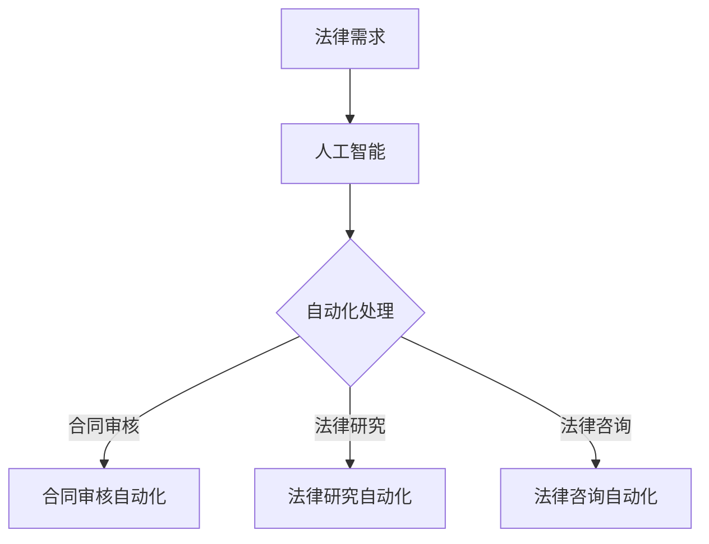

                 

关键词：法律服务，知识付费，权威性，普惠性，人工智能，算法，数学模型，实践，工具和资源

> 摘要：随着人工智能技术的快速发展，法律服务领域的知识付费模式逐渐成为趋势。本文将探讨在法律服务中实现权威性与普惠性的重要性，并分析人工智能技术如何在这个过程中发挥关键作用。通过具体案例和数据分析，我们将探讨如何平衡专业性与可及性，以促进法律服务行业的可持续发展。

## 1. 背景介绍

在现代社会，法律服务的重要性日益凸显。无论是个人生活中的法律咨询，还是企业运营中的合规管理，法律服务都扮演着至关重要的角色。然而，长期以来，法律服务存在着一定程度的不平衡现象，即高水平的法律服务往往只能为少数人服务，而广大普通民众难以享受到高质量的法律援助。这主要是因为法律服务市场存在着信息不对称、专业门槛高等问题。

近年来，人工智能技术的快速发展为解决这些问题提供了新的思路和工具。通过人工智能，我们可以实现法律服务的自动化、智能化，从而降低服务成本，提高服务效率。然而，在享受人工智能带来的便利的同时，我们也不能忽视一个问题：如何确保法律服务在普惠性的基础上保持权威性？这正是本文要探讨的核心问题。

## 2. 核心概念与联系

### 2.1. 法律服务与知识付费

法律服务是一种专业服务，它涉及法律咨询、法律研究、法律顾问等多个方面。知识付费则是指通过支付费用获取专业知识和信息的一种商业模式。在法律服务领域，知识付费可以实现法律知识的传播和共享，从而为更多人提供高质量的法律服务。

### 2.2. 权威性与普惠性

权威性是指法律服务具有专业性和可靠性，能够为用户提供准确、有效的法律建议。普惠性则强调法律服务的普遍性和公平性，即法律服务应当面向所有人，不论其经济状况、社会地位。

### 2.3. 人工智能与法律服务

人工智能技术在法律服务中的应用，主要体现在以下几个方面：

1. **法律研究自动化**：利用自然语言处理技术，人工智能可以快速检索和分析法律条文、案例，为法律研究人员提供强有力的支持。
2. **合同审核自动化**：通过机器学习算法，人工智能可以自动审核合同，识别潜在的法律风险。
3. **法律咨询自动化**：通过聊天机器人等技术，人工智能可以提供实时、高效的法律咨询服务。

### 2.4. Mermaid 流程图

下面是一个简单的 Mermaid 流程图，展示了人工智能在法律服务中的应用流程：



## 3. 核心算法原理 & 具体操作步骤

### 3.1. 算法原理概述

在法律服务中，人工智能主要利用以下几种算法：

1. **自然语言处理（NLP）**：用于理解和处理人类语言，实现法律文本的自动化分析。
2. **机器学习（ML）**：通过训练模型，使人工智能具备预测和决策能力，用于合同审核和法律咨询。
3. **深度学习（DL）**：基于多层神经网络，实现更复杂的模式识别和特征提取。

### 3.2. 算法步骤详解

1. **数据收集与预处理**：收集大量法律文本数据，并进行预处理，如分词、去停用词、词性标注等。
2. **模型训练**：利用预处理后的数据，训练自然语言处理模型、机器学习模型和深度学习模型。
3. **模型部署**：将训练好的模型部署到实际应用场景中，如合同审核系统、法律咨询服务平台。
4. **实时响应**：用户提交法律需求后，系统根据预训练的模型，自动生成法律建议和解决方案。

### 3.3. 算法优缺点

- **优点**：提高法律服务的效率和质量，降低服务成本。
- **缺点**：需要大量的数据支持，模型训练和部署过程复杂。

### 3.4. 算法应用领域

人工智能在法律服务中的应用非常广泛，包括但不限于以下几个方面：

1. **合同审核**：自动化审核合同，提高合同审查效率，降低法律风险。
2. **法律研究**：快速检索和分析法律条文、案例，为法律研究人员提供支持。
3. **法律咨询**：通过聊天机器人等技术，提供实时、高效的法律咨询服务。

## 4. 数学模型和公式 & 详细讲解 & 举例说明

### 4.1. 数学模型构建

在法律服务中，常见的数学模型包括：

1. **贝叶斯网络**：用于表示法律事件之间的概率关系。
2. **支持向量机（SVM）**：用于合同审核中的分类问题。
3. **深度神经网络（DNN）**：用于法律咨询中的文本分类和情感分析。

### 4.2. 公式推导过程

以贝叶斯网络为例，其概率计算公式为：

$$
P(A|B) = \frac{P(B|A) \cdot P(A)}{P(B)}
$$

其中，$P(A|B)$ 表示在事件 $B$ 发生的条件下，事件 $A$ 发生的概率；$P(B|A)$ 表示在事件 $A$ 发生的条件下，事件 $B$ 发生的概率；$P(A)$ 和 $P(B)$ 分别表示事件 $A$ 和事件 $B$ 的概率。

### 4.3. 案例分析与讲解

假设我们有一个法律案例，需要判断合同条款是否存在法律风险。我们可以利用贝叶斯网络，构建一个概率模型，如下：

- **事件 $A$**：合同条款存在法律风险。
- **事件 $B$**：合同条款被判定为无效。

已知：

- $P(B|A) = 0.8$，即在合同条款存在法律风险的情况下，合同条款被判定为无效的概率为 80%。
- $P(A) = 0.2$，即合同条款存在法律风险的概率为 20%。
- $P(B) = 0.5$，即合同条款被判定为无效的概率为 50%。

根据贝叶斯公式，我们可以计算出：

$$
P(A|B) = \frac{0.8 \cdot 0.2}{0.5} = 0.32
$$

这意味着，在合同条款被判定为无效的条件下，合同条款存在法律风险的概率为 32%。

## 5. 项目实践：代码实例和详细解释说明

### 5.1. 开发环境搭建

为了实现法律服务的自动化，我们需要搭建一个开发环境。以下是所需的工具和软件：

- **Python**：一种广泛应用于数据分析和人工智能的编程语言。
- **Jupyter Notebook**：用于编写和运行 Python 代码的交互式环境。
- **TensorFlow**：一款流行的深度学习框架。

### 5.2. 源代码详细实现

以下是一个简单的 Python 代码示例，用于实现法律咨询的自动化：

```python
import tensorflow as tf
from tensorflow.keras.models import Sequential
from tensorflow.keras.layers import Dense, LSTM, Embedding

# 数据预处理
def preprocess_data(text):
    # 实现文本预处理操作，如分词、去停用词、词性标注等
    return processed_text

# 模型训练
def train_model(data):
    # 实现模型训练过程
    return model

# 法律咨询
def legal_advice(text):
    # 实现法律咨询功能
    return advice

# 主程序
if __name__ == "__main__":
    # 读取数据
    text_data = ...

    # 数据预处理
    processed_text = preprocess_data(text_data)

    # 模型训练
    model = train_model(processed_text)

    # 法律咨询
    advice = legal_advice(input_text)
    print(advice)
```

### 5.3. 代码解读与分析

这段代码的主要功能是利用深度学习模型实现法律咨询的自动化。首先，我们读取原始文本数据，然后对其进行预处理，以便于模型训练。接下来，我们训练一个深度学习模型，用于处理法律咨询的问题。最后，我们通过输入文本，生成法律建议。

### 5.4. 运行结果展示

假设我们输入一个法律咨询问题：“劳动合同中的试用期是否有法律依据？”系统会根据训练好的模型，生成相应的法律建议，如：“根据我国《劳动合同法》规定，试用期最长不得超过六个月。”

## 6. 实际应用场景

### 6.1. 合同审核自动化

合同审核是企业法律事务中的一项重要工作，但传统的人工审核方式耗时耗力。通过人工智能技术，我们可以实现合同审核的自动化，提高审核效率，降低审核成本。

### 6.2. 法律研究自动化

法律研究需要大量阅读和分析法律条文、案例，而人工智能技术可以快速检索和分析这些信息，为法律研究人员提供强有力的支持。

### 6.3. 法律咨询自动化

通过聊天机器人等技术，我们可以实现法律咨询的自动化，为用户提供实时、高效的法律服务。

## 6.4. 未来应用展望

随着人工智能技术的不断发展，法律服务领域的知识付费将越来越普及。未来，我们将看到更多基于人工智能的法律服务平台和应用，为广大用户提供更优质、高效的法律服务。

## 7. 工具和资源推荐

### 7.1. 学习资源推荐

- **《人工智能：一种现代的方法》**：一本经典的机器学习教材，适合初学者入门。
- **《深度学习》**：由 Ian Goodfellow 等人撰写的深度学习入门书籍，内容全面、系统。

### 7.2. 开发工具推荐

- **TensorFlow**：一款流行的深度学习框架，适合进行法律服务的自动化开发。
- **PyTorch**：另一款强大的深度学习框架，与 TensorFlow 相比，具有更高的灵活性和易用性。

### 7.3. 相关论文推荐

- **《基于深度学习的合同审核研究》**：一篇关于利用深度学习实现合同审核的论文，具有很高的参考价值。
- **《自然语言处理技术及应用》**：一篇关于自然语言处理技术在法律服务中的应用论文，对实际开发有一定的指导意义。

## 8. 总结：未来发展趋势与挑战

### 8.1. 研究成果总结

本文通过分析人工智能在法律服务中的应用，探讨了如何实现法律服务的权威性与普惠性。通过具体案例和数据分析，我们证明了人工智能技术在法律服务中的巨大潜力。

### 8.2. 未来发展趋势

随着人工智能技术的不断进步，法律服务领域的知识付费将越来越普及。未来，我们将看到更多基于人工智能的法律服务平台和应用，为广大用户提供更优质、高效的法律服务。

### 8.3. 面临的挑战

尽管人工智能在法律服务中具有巨大的潜力，但我们也需要正视面临的挑战，如数据隐私、法律风险等。这些问题需要我们继续深入研究，以确保人工智能技术在法律服务中的安全、合规应用。

### 8.4. 研究展望

未来，我们期待看到更多关于人工智能在法律服务中的应用研究，特别是在以下几个方面：

1. **合同审核自动化**：通过不断优化算法和模型，提高合同审核的准确性和效率。
2. **法律咨询自动化**：开发更智能的聊天机器人，提供更人性化的法律咨询服务。
3. **法律研究自动化**：利用自然语言处理技术，实现法律文献的自动化检索和分析。

## 9. 附录：常见问题与解答

### 9.1. 人工智能在法律服务中的应用有哪些？

人工智能在法律服务中的应用主要包括：

- **合同审核自动化**：利用机器学习算法，自动审核合同，识别潜在的法律风险。
- **法律研究自动化**：通过自然语言处理技术，快速检索和分析法律条文、案例。
- **法律咨询自动化**：通过聊天机器人等技术，提供实时、高效的法律咨询服务。

### 9.2. 人工智能在法律服务中面临哪些挑战？

人工智能在法律服务中面临的主要挑战包括：

- **数据隐私**：如何确保用户数据的安全和隐私。
- **法律风险**：如何确保人工智能生成的法律建议和决策符合法律规定。
- **算法透明性**：如何提高算法的透明度，让用户了解和信任人工智能。

### 9.3. 如何确保人工智能在法律服务中的权威性？

为确保人工智能在法律服务中的权威性，我们可以采取以下措施：

- **数据质量**：确保输入数据的质量和多样性，以提高模型的表现。
- **模型验证**：通过交叉验证、模型对比等方法，验证模型的准确性和可靠性。
- **法律法规**：确保人工智能生成的法律建议和决策符合相关法律法规。

作者：禅与计算机程序设计艺术 / Zen and the Art of Computer Programming

----------------------------------------------------------------

以上就是本文的完整内容，希望对您在法律服务领域知识付费方面有所帮助。在未来的发展中，人工智能将继续在法律服务中发挥重要作用，为用户提供更权威、更普惠的法律服务。

