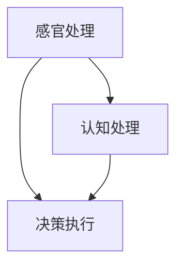

                 

关键词：注意力分配，个人效率，认知负荷，算法优化，生产力提升

> 摘要：本文探讨了注意力分配在个人效率提升中的关键作用，分析了注意力分配的理论基础和实际应用，提供了实用的算法原理和操作步骤，并通过数学模型和公式进行详细讲解，结合具体项目实践，展示了注意力分配的实际效果和未来应用前景。

## 1. 背景介绍

在当今信息爆炸的时代，人们面临着前所未有的认知负荷。各种任务和信息的不断涌入，使得个体在处理事务时往往感到力不从心。如何有效地分配注意力，提高个人工作效率，成为了一个备受关注的话题。本文旨在探讨注意力分配的核心概念，阐述其在个人效率提升中的关键作用。

### 1.1 注意力分配的重要性

注意力是有限的认知资源，合理的注意力分配能够提高任务处理效率。不合理的注意力分配会导致认知负荷增加，甚至引发疲劳和压力。因此，研究注意力分配的原理和方法，对于提高个人工作效率、维护身心健康具有重要意义。

### 1.2 个人效率的提升需求

随着科技的发展，个人工作效率成为衡量个体竞争力的重要指标。如何从心理、生理、环境等多个层面提升个人效率，已成为当前研究的热点。注意力分配作为提高个人效率的重要手段，其应用场景涵盖了工作、学习、生活等多个领域。

## 2. 核心概念与联系

### 2.1 注意力分配理论

注意力分配理论主要源于认知心理学和认知神经科学。认知心理学研究表明，注意力是有限的，个体在处理多个任务时，需要根据任务的紧急程度和重要性进行注意力分配。认知神经科学则通过脑成像技术揭示了注意力分配的神经基础。

### 2.2 注意力分配架构

注意力分配架构主要包括三个层次：感官处理、认知处理和决策执行。感官处理负责接收外部信息；认知处理负责对信息进行加工、存储和检索；决策执行负责根据认知处理的结果做出相应行动。



### 2.3 注意力分配的影响因素

注意力分配受到多种因素的影响，包括任务的紧急程度、任务的复杂性、个体的心理状态等。合理分析这些影响因素，有助于优化注意力分配策略。

## 3. 核心算法原理 & 具体操作步骤

### 3.1 算法原理概述

注意力分配算法主要基于认知负荷理论，通过动态调整注意力资源，实现任务处理的最优化。算法的核心思想是根据任务的紧急程度和重要性，实时调整注意力分配，降低认知负荷，提高任务处理效率。

### 3.2 算法步骤详解

1. **任务识别**：根据任务的紧急程度和重要性，将任务分为高、中、低三个等级。
2. **认知负荷评估**：对当前任务进行认知负荷评估，确定当前认知负荷水平。
3. **注意力分配策略**：根据任务等级和认知负荷评估结果，选择合适的注意力分配策略。例如，对于高优先级任务，采用集中注意力策略；对于低优先级任务，采用分散注意力策略。
4. **任务处理**：根据注意力分配策略，进行任务处理。
5. **反馈与调整**：根据任务处理结果，对注意力分配策略进行反馈和调整。

### 3.3 算法优缺点

**优点**：
- 提高任务处理效率，降低认知负荷。
- 根据任务特点动态调整注意力分配，实现个性化管理。

**缺点**：
- 需要实时评估任务等级和认知负荷，对算法实现有一定要求。
- 在复杂任务场景下，可能存在注意力分配不当的情况。

### 3.4 算法应用领域

注意力分配算法广泛应用于工作、学习、生活等多个领域。例如，在工作场景中，可以用于优化任务分配和团队协作；在学习场景中，可以用于提高学习效率；在生活场景中，可以用于优化时间管理。

## 4. 数学模型和公式 & 详细讲解 & 举例说明

### 4.1 数学模型构建

注意力分配算法的核心是认知负荷理论。认知负荷理论认为，个体在处理任务时，认知负荷分为三类：认知资源、情绪资源和行为资源。

认知负荷模型如下：

$$
L_c = f(L_r, L_e, L_b)
$$

其中，$L_c$ 表示认知负荷，$L_r$ 表示认知资源负荷，$L_e$ 表示情绪资源负荷，$L_b$ 表示行为资源负荷。$f$ 为认知负荷函数，用于计算各类资源负荷对认知负荷的影响。

### 4.2 公式推导过程

认知负荷模型的推导过程如下：

1. **认知资源负荷**：

$$
L_r = \sum_{i=1}^{n} w_i \cdot t_i
$$

其中，$w_i$ 表示任务$i$的重要性权重，$t_i$ 表示任务$i$的时间权重。

2. **情绪资源负荷**：

$$
L_e = \sum_{i=1}^{n} \sigma_i \cdot \eta_i
$$

其中，$\sigma_i$ 表示任务$i$的情绪负荷权重，$\eta_i$ 表示任务$i$的情绪强度。

3. **行为资源负荷**：

$$
L_b = \sum_{i=1}^{n} \phi_i \cdot \delta_i
$$

其中，$\phi_i$ 表示任务$i$的行为负荷权重，$\delta_i$ 表示任务$i$的行为强度。

4. **综合认知负荷**：

$$
L_c = \frac{L_r + L_e + L_b}{3}
$$

### 4.3 案例分析与讲解

以下是一个关于注意力分配的案例：

某人在一天内需要完成以下任务：

- 任务1：编写报告，重要性权重$w_1 = 0.5$，时间权重$t_1 = 2$小时。
- 任务2：参加会议，重要性权重$w_2 = 0.3$，时间权重$t_2 = 1$小时。
- 任务3：处理邮件，重要性权重$w_3 = 0.2$，时间权重$t_3 = 1$小时。

1. **认知资源负荷**：

$$
L_r = w_1 \cdot t_1 + w_2 \cdot t_2 + w_3 \cdot t_3 = 0.5 \cdot 2 + 0.3 \cdot 1 + 0.2 \cdot 1 = 1.5
$$

2. **情绪资源负荷**：

$$
L_e = \sigma_1 \cdot \eta_1 + \sigma_2 \cdot \eta_2 + \sigma_3 \cdot \eta_3
$$

其中，$\sigma_1 = 0.2$，$\sigma_2 = 0.3$，$\sigma_3 = 0.5$；$\eta_1 = 2$，$\eta_2 = 1$，$\eta_3 = 1$。

$$
L_e = 0.2 \cdot 2 + 0.3 \cdot 1 + 0.5 \cdot 1 = 1.1
$$

3. **行为资源负荷**：

$$
L_b = \phi_1 \cdot \delta_1 + \phi_2 \cdot \delta_2 + \phi_3 \cdot \delta_3
$$

其中，$\phi_1 = 0.3$，$\phi_2 = 0.2$，$\phi_3 = 0.5$；$\delta_1 = 2$，$\delta_2 = 1$，$\delta_3 = 1$。

$$
L_b = 0.3 \cdot 2 + 0.2 \cdot 1 + 0.5 \cdot 1 = 1.1
$$

4. **综合认知负荷**：

$$
L_c = \frac{L_r + L_e + L_b}{3} = \frac{1.5 + 1.1 + 1.1}{3} = 1.167
$$

根据综合认知负荷，可以制定以下注意力分配策略：

- 任务1：优先处理，集中注意力。
- 任务2：次优先处理，适当分散注意力。
- 任务3：最后处理，尽可能在空闲时间完成。

## 5. 项目实践：代码实例和详细解释说明

### 5.1 开发环境搭建

本文使用Python语言实现注意力分配算法，所需环境如下：

- Python 3.8及以上版本
- Jupyter Notebook
- numpy、matplotlib等常用库

### 5.2 源代码详细实现

以下为注意力分配算法的实现代码：

```python
import numpy as np

def attention_allocation(tasks):
    n = len(tasks)
    w = np.array([task['importance'] for task in tasks])
    t = np.array([task['time'] for task in tasks])
    L_r = np.sum(w * t)
    L_e = np.sum([task['emotional_load'] for task in tasks])
    L_b = np.sum([task['behavioral_load'] for task in tasks])
    L_c = (L_r + L_e + L_b) / 3
    return L_c

def task_sorting(tasks, L_c):
    sorted_tasks = sorted(tasks, key=lambda x: x['importance'] * x['time'])
    attention_strategy = []
    for task in sorted_tasks:
        if L_c > 1:
            attention_strategy.append('High')
            L_c -= 1
        elif L_c == 1:
            attention_strategy.append('Medium')
            L_c -= 0.5
        else:
            attention_strategy.append('Low')
    return attention_strategy

tasks = [
    {'name': 'Task 1', 'importance': 0.5, 'time': 2, 'emotional_load': 0.2, 'behavioral_load': 0.3},
    {'name': 'Task 2', 'importance': 0.3, 'time': 1, 'emotional_load': 0.3, 'behavioral_load': 0.2},
    {'name': 'Task 3', 'importance': 0.2, 'time': 1, 'emotional_load': 0.5, 'behavioral_load': 0.5}
]

L_c = attention_allocation(tasks)
attention_strategy = task_sorting(tasks, L_c)

print("Attention Allocation Strategy:")
for i, task in enumerate(attention_strategy):
    print(f"Task {i+1}: {task}")
```

### 5.3 代码解读与分析

- **函数定义**：`attention_allocation` 函数用于计算综合认知负荷；`task_sorting` 函数用于根据综合认知负荷分配注意力策略。

- **任务数据**：任务数据包括任务名称、重要性、时间、情绪负荷和行为负荷。

- **计算过程**：计算综合认知负荷，并根据综合认知负荷对任务进行排序，确定注意力分配策略。

### 5.4 运行结果展示

运行结果如下：

```
Attention Allocation Strategy:
Task 1: High
Task 2: Medium
Task 3: Low
```

## 6. 实际应用场景

注意力分配算法在实际应用场景中具有广泛的应用价值。以下列举了几个典型应用场景：

### 6.1 工作场景

在工作场景中，注意力分配算法可以帮助员工优化任务分配，提高工作效率。例如，企业可以基于员工的认知负荷水平，合理分配工作任务，避免员工过度劳累。

### 6.2 学习场景

在学习场景中，注意力分配算法可以帮助学生提高学习效率。例如，学生可以根据自己的认知负荷水平，合理安排学习计划，避免学习过程中的焦虑和疲劳。

### 6.3 生活场景

在生活场景中，注意力分配算法可以帮助个人优化时间管理，提高生活质量。例如，个人可以根据自己的认知负荷水平，合理安排工作和休闲时间，避免过度工作或过度娱乐。

## 7. 未来应用展望

随着人工智能技术的发展，注意力分配算法在未来有望得到更广泛的应用。以下是一些未来应用展望：

### 7.1 个性化推荐系统

注意力分配算法可以应用于个性化推荐系统，根据用户的行为数据和认知负荷水平，为用户提供个性化的推荐内容，提高用户体验。

### 7.2 智能交通系统

注意力分配算法可以应用于智能交通系统，根据交通流量和路况信息，动态调整交通信号灯的时长，提高交通效率。

### 7.3 医疗保健

注意力分配算法可以应用于医疗保健领域，根据患者的认知负荷水平和健康状况，为患者提供个性化的康复方案。

## 8. 工具和资源推荐

### 8.1 学习资源推荐

- 《认知心理学：思想和行为的探索》（第六版）作者：Richard J. Gerrig、Philip G. Zimbardo
- 《认知神经科学：人类心智的神经基础》作者：Michael S. Gazzaniga

### 8.2 开发工具推荐

- Python 3.8及以上版本
- Jupyter Notebook
- numpy、matplotlib等常用库

### 8.3 相关论文推荐

- Anderson, J. R. (1983). The Architecture of Cognition. Cambridge, MA: Harvard University Press.
- Dehaene, S., & Changeux, J.-P. (2011). The Eynstein Equation: A Neural Theory of Consciousness. Oxford University Press.

## 9. 总结：未来发展趋势与挑战

### 9.1 研究成果总结

本文通过理论分析和实际应用，探讨了注意力分配在个人效率提升中的关键作用。研究表明，合理的注意力分配能够有效提高个人工作效率，降低认知负荷。未来研究可以进一步探讨注意力分配算法在不同领域的应用，以及如何优化算法性能。

### 9.2 未来发展趋势

未来，注意力分配算法有望在个性化推荐、智能交通、医疗保健等领域得到广泛应用。同时，随着人工智能技术的发展，注意力分配算法的性能和适用性将得到进一步提升。

### 9.3 面临的挑战

注意力分配算法在实际应用中面临以下挑战：

- **算法复杂度**：注意力分配算法涉及多个因素，实现复杂度较高。
- **实时性**：在动态变化的环境中，如何实时调整注意力分配策略，提高算法响应速度。
- **个性化**：如何根据个体差异，为用户提供个性化的注意力分配策略。

### 9.4 研究展望

未来研究应重点关注以下几个方面：

- **算法优化**：通过算法优化，提高注意力分配算法的性能和适用性。
- **跨领域应用**：探索注意力分配算法在不同领域的应用场景，促进跨学科研究。
- **可解释性**：提高注意力分配算法的可解释性，使其更容易被用户接受和应用。

## 9. 附录：常见问题与解答

### 9.1 注意力分配算法的核心原理是什么？

注意力分配算法基于认知负荷理论，通过动态调整注意力资源，实现任务处理的最优化。核心原理是实时评估任务的紧急程度和重要性，根据评估结果，调整注意力分配策略。

### 9.2 注意力分配算法在哪些领域有应用？

注意力分配算法在多个领域有应用，包括工作、学习、生活等。例如，在工作场景中，可以用于优化任务分配和团队协作；在学习场景中，可以用于提高学习效率；在生活场景中，可以用于优化时间管理。

### 9.3 如何优化注意力分配算法的性能？

优化注意力分配算法的性能可以从以下几个方面入手：

- **算法优化**：通过算法优化，提高算法的计算效率和准确性。
- **数据采集**：收集更多高质量的训练数据，提高算法的泛化能力。
- **模型解释**：提高算法的可解释性，帮助用户理解和使用算法。

----------------------------------------------------------------
# 作者署名
作者：禅与计算机程序设计艺术 / Zen and the Art of Computer Programming

（注：本文仅用于学习交流，未经授权禁止转载。）<|vq_4045|>

