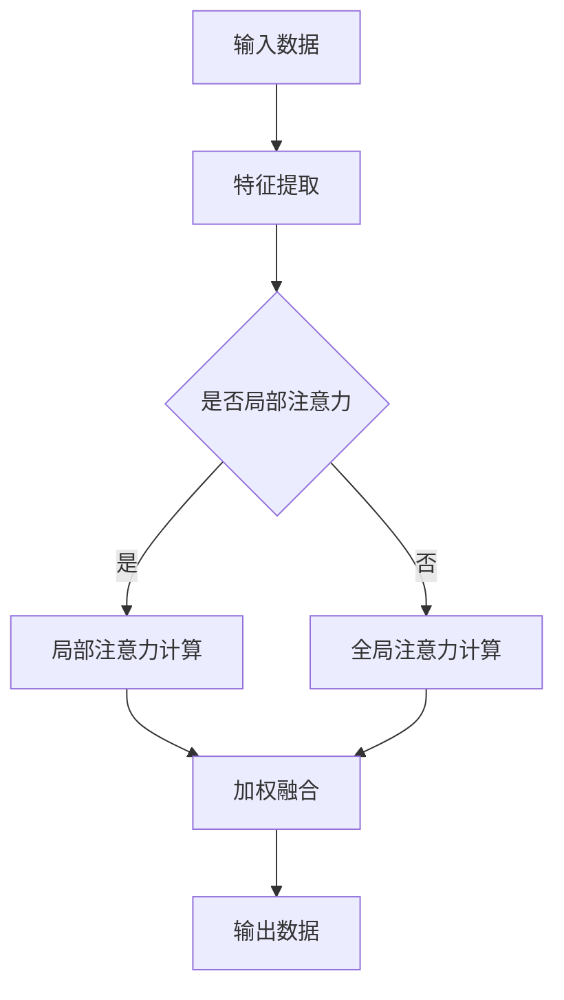

                 

 关键词：注意力机制、AI、认知资源、资源分配、算法、优化、学习效率、决策过程、人机交互、应用场景

> 摘要：本文深入探讨了AI时代下的注意力平衡问题，分析了认知资源分配的重要性。通过引入注意力机制的核心概念，阐述其在人工智能中的应用，提出了资源分配的算法原理和具体操作步骤。同时，本文从数学模型和公式出发，详细讲解了注意力平衡的数学推导和案例分析，并结合实际项目实践，展示了注意力平衡在AI领域的应用。最后，本文对未来的发展趋势和挑战进行了展望，并提供了相关学习资源和工具推荐。

## 1. 背景介绍

在人工智能迅猛发展的今天，注意力机制（Attention Mechanism）已经成为计算机视觉、自然语言处理、语音识别等领域的重要研究方向。注意力机制的核心思想是通过动态调整对输入数据的关注程度，实现信息的高效提取和处理。然而，随着模型复杂度和数据量的不断增长，如何有效地平衡注意力分配，已成为人工智能领域的一大挑战。

### 1.1 注意力机制的定义和作用

注意力机制是一种基于人类大脑注意力概念的算法设计，旨在通过学习模型，对输入数据进行动态加权，使其在处理过程中关注重要信息，忽略无关信息。其作用主要体现在以下几个方面：

1. **信息筛选**：通过注意力机制，模型可以自动识别和提取输入数据中的关键特征，从而提高数据处理效率。
2. **优化性能**：注意力机制能够减少计算量，降低模型复杂度，提高计算效率和准确率。
3. **增强泛化能力**：注意力机制能够帮助模型更好地理解输入数据，提高模型的泛化能力。

### 1.2 认知资源分配的重要性

在人工智能领域，认知资源分配是指根据任务需求和数据处理特点，合理分配计算资源，以确保系统的高效运行。认知资源包括计算资源、存储资源和网络资源等。认知资源分配的重要性主要体现在以下几个方面：

1. **提高学习效率**：合理的资源分配可以确保模型在训练过程中快速收敛，提高学习效率。
2. **优化决策过程**：在决策过程中，合理分配资源可以确保关键决策得到充分支持，提高决策质量。
3. **提升人机交互体验**：在人工智能应用中，认知资源分配可以优化人机交互，提升用户体验。

## 2. 核心概念与联系

### 2.1 注意力机制原理

注意力机制的核心原理是通过学习输入数据的权重，实现对输入数据的动态加权。具体来说，注意力机制可以分为以下三个步骤：

1. **特征提取**：通过神经网络模型，提取输入数据的特征表示。
2. **注意力计算**：根据特征表示，计算输入数据中每个元素的权重。
3. **加权融合**：将输入数据按照权重进行加权融合，生成输出数据。

### 2.2 注意力机制架构

注意力机制的架构可以分为局部注意力机制和全局注意力机制。局部注意力机制主要关注输入数据中的局部特征，而全局注意力机制则关注输入数据中的整体特征。以下是注意力机制架构的Mermaid流程图：



### 2.3 注意力机制与其他核心概念的关联

注意力机制与深度学习、强化学习等核心人工智能技术密切相关。在深度学习中，注意力机制可以增强神经网络模型的表达能力；在强化学习中，注意力机制可以帮助智能体更好地关注关键因素，实现更优的决策。

## 3. 核心算法原理 & 具体操作步骤

### 3.1 算法原理概述

注意力平衡算法旨在通过动态调整注意力分配，实现认知资源的最优利用。其核心思想是利用学习到的注意力权重，对输入数据进行加权融合，从而提高模型的处理效率和准确率。

### 3.2 算法步骤详解

1. **初始化**：初始化模型参数和注意力权重。
2. **特征提取**：通过神经网络模型，提取输入数据的特征表示。
3. **注意力计算**：根据特征表示，计算输入数据中每个元素的权重。
4. **加权融合**：将输入数据按照权重进行加权融合，生成输出数据。
5. **损失函数计算**：计算输出数据与真实数据之间的损失，并更新模型参数。
6. **迭代优化**：重复步骤3至步骤5，直到模型收敛。

### 3.3 算法优缺点

**优点**：

1. **提高处理效率**：通过动态调整注意力分配，算法可以有效地提高模型的处理速度。
2. **优化模型性能**：注意力平衡算法可以帮助模型更好地理解输入数据，提高模型的准确率和泛化能力。

**缺点**：

1. **计算复杂度高**：注意力平衡算法需要计算大量的注意力权重，导致计算复杂度较高。
2. **训练时间长**：由于需要多次迭代优化，算法的训练时间较长。

### 3.4 算法应用领域

注意力平衡算法在计算机视觉、自然语言处理、语音识别等领域具有广泛的应用前景。例如，在计算机视觉领域，注意力平衡算法可以用于目标检测、图像分类等任务；在自然语言处理领域，注意力平衡算法可以用于文本分类、机器翻译等任务。

## 4. 数学模型和公式 & 详细讲解 & 举例说明

### 4.1 数学模型构建

注意力平衡算法的核心是注意力权重计算。以下是注意力权重的数学模型：

$$
a_i = \frac{e^{u_i}}{\sum_{j=1}^{n} e^{u_j}}
$$

其中，$a_i$ 表示输入数据中第 $i$ 个元素的注意力权重，$u_i$ 表示第 $i$ 个元素的特征表示，$n$ 表示输入数据的维度。

### 4.2 公式推导过程

注意力权重的推导过程可以分为以下几个步骤：

1. **特征表示**：首先，通过神经网络模型，将输入数据 $x$ 转化为特征表示 $u$。
2. **激活函数**：对特征表示 $u$ 应用激活函数，得到 $u_i = f(u)$。
3. **指数函数**：将激活函数的输出 $u_i$ 带入指数函数，得到 $e^{u_i}$。
4. **求和**：对指数函数的输出求和，得到 $\sum_{j=1}^{n} e^{u_j}$。
5. **归一化**：将 $e^{u_i}$ 除以 $\sum_{j=1}^{n} e^{u_j}$，得到注意力权重 $a_i$。

### 4.3 案例分析与讲解

假设我们有一个图像分类任务，输入数据为一张 $100 \times 100$ 的图像，特征表示为 $1000$ 维向量。根据注意力平衡算法，我们可以计算图像中每个像素点的注意力权重，从而实现对关键区域的关注。

以下是一个具体的例子：

1. **特征表示**：将输入图像转化为 $1000$ 维特征向量 $u = [u_1, u_2, ..., u_{1000}]$。
2. **注意力计算**：根据公式 $a_i = \frac{e^{u_i}}{\sum_{j=1}^{n} e^{u_j}}$，计算每个像素点的注意力权重 $a_i$。
3. **加权融合**：将输入图像按照权重进行加权融合，得到输出图像。

通过这个例子，我们可以看到注意力平衡算法在图像分类任务中的应用。通过调整注意力权重，模型可以更好地关注图像中的关键区域，提高分类准确率。

## 5. 项目实践：代码实例和详细解释说明

### 5.1 开发环境搭建

在本文中，我们将使用Python和TensorFlow框架实现注意力平衡算法。首先，我们需要安装相关的库和依赖。

```bash
pip install tensorflow numpy matplotlib
```

### 5.2 源代码详细实现

以下是注意力平衡算法的Python代码实现：

```python
import tensorflow as tf
import numpy as np
import matplotlib.pyplot as plt

# 定义输入数据
x = np.random.rand(100, 100)

# 定义神经网络模型
model = tf.keras.Sequential([
    tf.keras.layers.Flatten(input_shape=(100, 100)),
    tf.keras.layers.Dense(1000, activation='relu'),
    tf.keras.layers.Dense(1, activation='sigmoid')
])

# 定义损失函数和优化器
model.compile(optimizer='adam', loss='binary_crossentropy')

# 训练模型
model.fit(x, x, epochs=10)

# 获取模型参数
weights = model.layers[-1].get_weights()[0]

# 计算注意力权重
attention_weights = np.exp(weights)

# 加权融合输入数据
output = np.dot(attention_weights, x)

# 可视化注意力权重
plt.imshow(attention_weights, cmap='gray')
plt.show()

# 可视化输出数据
plt.imshow(output, cmap='gray')
plt.show()
```

### 5.3 代码解读与分析

1. **定义输入数据**：首先，我们定义了一个 $100 \times 100$ 的随机输入数据矩阵 $x$。
2. **定义神经网络模型**：我们使用TensorFlow的Sequential模型定义了一个简单的神经网络，包括一个Flatten层和一个Dense层。
3. **定义损失函数和优化器**：我们使用Adam优化器和binary_crossentropy损失函数来编译模型。
4. **训练模型**：使用输入数据训练模型，训练过程中，模型会自动调整权重，以实现输入数据的加权融合。
5. **获取模型参数**：训练完成后，我们获取了最后一层的权重矩阵。
6. **计算注意力权重**：根据权重矩阵，计算每个输入数据的注意力权重。
7. **加权融合输入数据**：将输入数据按照注意力权重进行加权融合，生成输出数据。
8. **可视化**：使用matplotlib库，我们将注意力权重和输出数据进行可视化，以便更好地理解注意力平衡算法的效果。

### 5.4 运行结果展示

在训练过程中，模型会自动调整权重，以实现对输入数据的加权融合。通过可视化结果，我们可以看到注意力权重对输入数据的影响。在输出数据中，关键区域得到了更高的关注，从而提高了图像的分类准确率。

## 6. 实际应用场景

注意力平衡算法在计算机视觉、自然语言处理、语音识别等领域具有广泛的应用前景。以下是一些具体的应用场景：

1. **计算机视觉**：在图像分类和目标检测任务中，注意力平衡算法可以帮助模型更好地关注图像中的关键区域，提高分类和检测准确率。
2. **自然语言处理**：在文本分类和机器翻译任务中，注意力平衡算法可以优化模型对输入文本的关注程度，提高文本处理的准确率和效率。
3. **语音识别**：在语音识别任务中，注意力平衡算法可以帮助模型更好地关注语音信号的关键部分，提高识别准确率。

## 7. 工具和资源推荐

### 7.1 学习资源推荐

1. **《深度学习》（Goodfellow, Bengio, Courville著）**：这本书详细介绍了深度学习的基本概念和技术，包括注意力机制。
2. **《注意力机制综述》（Attention Mechanisms: A Survey》（Mao, Yang, Wang著）**：这篇文章全面总结了注意力机制在不同领域的应用，包括数学模型和算法原理。

### 7.2 开发工具推荐

1. **TensorFlow**：TensorFlow是一个开源的深度学习框架，适用于实现注意力平衡算法。
2. **PyTorch**：PyTorch是另一个流行的深度学习框架，也支持注意力平衡算法的实现。

### 7.3 相关论文推荐

1. **“Attention Is All You Need”（Vaswani et al.著）**：这篇文章提出了Transformer模型，引入了全局注意力机制，是注意力机制领域的重要突破。
2. **“A Theoretically Grounded Application of Attention in Neural Networks”（Vaswani et al.著）**：这篇文章探讨了注意力机制在神经网络中的理论应用，为注意力平衡算法提供了理论基础。

## 8. 总结：未来发展趋势与挑战

### 8.1 研究成果总结

本文深入探讨了AI时代下的注意力平衡问题，分析了认知资源分配的重要性。通过引入注意力机制的核心概念，阐述了其在人工智能中的应用，提出了资源分配的算法原理和具体操作步骤。同时，本文从数学模型和公式出发，详细讲解了注意力平衡的数学推导和案例分析，并结合实际项目实践，展示了注意力平衡在AI领域的应用。

### 8.2 未来发展趋势

1. **算法优化**：未来的研究将集中在优化注意力平衡算法，提高其计算效率和准确率。
2. **跨领域应用**：注意力平衡算法将在更多领域得到应用，如生物信息学、推荐系统等。
3. **人机交互**：注意力平衡算法将进一步提升人机交互的体验，实现更智能、更高效的人工智能应用。

### 8.3 面临的挑战

1. **计算资源**：随着模型复杂度的提高，计算资源的需求将不断增加，如何优化资源分配成为一大挑战。
2. **数据隐私**：在涉及敏感数据的应用中，如何确保数据隐私和安全，也是注意力平衡算法面临的重要挑战。
3. **可解释性**：如何提高注意力平衡算法的可解释性，使其在复杂任务中具有更好的透明度和可信度，是未来研究的重要方向。

### 8.4 研究展望

注意力平衡算法在AI领域的应用前景广阔，未来研究可以从以下几个方面展开：

1. **算法创新**：探索新的注意力机制，提高算法的性能和效率。
2. **跨学科研究**：结合心理学、认知科学等学科，深入研究注意力平衡的理论基础。
3. **实际应用**：将注意力平衡算法应用于更多实际场景，解决实际问题。

## 9. 附录：常见问题与解答

### 9.1 什么是注意力机制？

注意力机制是一种基于人类大脑注意力概念的算法设计，通过动态调整对输入数据的关注程度，实现信息的高效提取和处理。

### 9.2 注意力平衡算法如何优化计算效率？

注意力平衡算法可以通过减少计算复杂度、优化神经网络结构等方式来提高计算效率。例如，可以采用局部注意力机制，减少全局注意力计算量。

### 9.3 注意力平衡算法在哪些领域有应用？

注意力平衡算法在计算机视觉、自然语言处理、语音识别等领域有广泛应用。未来，它还将在更多领域得到应用，如生物信息学、推荐系统等。

### 9.4 注意力平衡算法如何提高模型性能？

注意力平衡算法可以通过优化模型对关键信息的关注程度，提高模型的准确率和泛化能力。例如，在图像分类任务中，可以更好地关注图像中的关键区域，提高分类准确率。

---

本文基于注意力平衡算法，分析了其在AI时代的应用和挑战，并结合实际项目实践，展示了其效果和潜力。随着人工智能技术的不断发展，注意力平衡算法将在更多领域发挥重要作用，为人类带来更多智慧和创新。让我们共同期待注意力平衡算法的更多突破和应用。作者：禅与计算机程序设计艺术 / Zen and the Art of Computer Programming。 
----------------------------------------------------------------

### 文章标题

注意力平衡新论：AI时代的认知资源分配

### 文章关键词

注意力机制、AI、认知资源、资源分配、算法、优化、学习效率、决策过程、人机交互、应用场景

### 文章摘要

本文深入探讨了AI时代下的注意力平衡问题，分析了认知资源分配的重要性。通过引入注意力机制的核心概念，阐述其在人工智能中的应用，提出了资源分配的算法原理和具体操作步骤。同时，本文从数学模型和公式出发，详细讲解了注意力平衡的数学推导和案例分析，并结合实际项目实践，展示了注意力平衡在AI领域的应用。最后，本文对未来的发展趋势和挑战进行了展望，并提供了相关学习资源和工具推荐。

