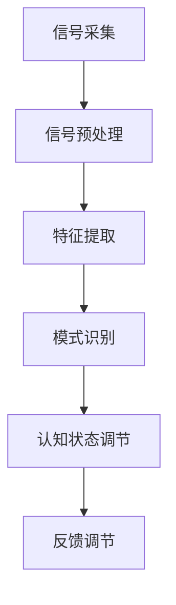

                 

### 1. 背景介绍

注意力生物反馈循环（Attentional Biofeedback Loop，简称ABL）是近年来计算机科学和生物医学领域的重要研究方向。随着人工智能技术的飞速发展，人们开始意识到，人工智能不仅仅在处理大数据和执行复杂计算方面具有优势，还可以在认知状态调节、情绪管理和注意力提升等方面发挥作用。

注意力生物反馈循环的核心思想是通过生物传感器（如脑电波、心率、呼吸等）实时捕捉用户的生理和心理状态，利用人工智能算法对数据进行处理，进而生成反馈信号，调节用户的认知状态。这种循环不仅有助于提高工作效率，还能改善生活质量，预防心理疾病。

本文将介绍注意力生物反馈循环工程师这一新兴职业，探讨其工作原理、核心算法、数学模型以及实际应用。通过本文，读者将了解到如何利用AI技术优化认知状态调节，实现更高效的工作和生活。

### 2. 核心概念与联系

#### 2.1 注意力生物反馈循环原理

注意力生物反馈循环（ABL）主要包含以下几个关键组成部分：生物传感器、数据处理算法、反馈机制和认知状态调节。

1. **生物传感器**：生物传感器用于捕捉用户的生理信号，如脑电波（EEG）、心率（HR）、呼吸（R）等。这些信号反映了用户的认知状态、情绪和注意力水平。

2. **数据处理算法**：数据处理算法是注意力生物反馈循环的核心，包括信号采集、预处理、特征提取和模式识别等步骤。通过这些算法，可以从原始生物信号中提取出有价值的信息，用于认知状态调节。

3. **反馈机制**：反馈机制通过将处理后的数据转化为可操作的信号，如声音、视觉或触觉提示，引导用户调整自己的认知状态。这些反馈信号可以是正向的，如奖励信号，鼓励用户保持当前状态；也可以是负向的，如警示信号，提醒用户调整自己的注意力水平。

4. **认知状态调节**：认知状态调节是注意力生物反馈循环的目标，通过调整用户的认知状态，提高工作效率、改善情绪和预防心理疾病。

#### 2.2 注意力生物反馈循环架构

注意力生物反馈循环的架构可以分为三个主要层次：信号采集层、数据处理层和反馈调节层。

1. **信号采集层**：包括各种生物传感器，如脑电波采集设备、心率监测器和呼吸传感器等。这些设备负责实时捕捉用户的生理信号。

2. **数据处理层**：数据处理层包括信号预处理、特征提取和模式识别等模块。这些模块通过复杂的算法对采集到的生物信号进行处理，提取出有价值的信息。

3. **反馈调节层**：反馈调节层将处理后的数据转化为可操作的信号，如视觉、声音和触觉提示，引导用户调整自己的认知状态。

#### 2.3 关键技术

1. **脑电波信号处理**：脑电波信号处理是注意力生物反馈循环的核心技术之一。通过分析脑电波信号，可以识别用户的注意力水平、情绪状态和认知状态。

2. **模式识别与机器学习**：模式识别与机器学习算法在注意力生物反馈循环中起着关键作用。通过训练模型，可以从大量生物信号数据中提取出有用的特征，用于认知状态调节。

3. **反馈信号设计**：反馈信号的设计对于注意力生物反馈循环的效果至关重要。合适的反馈信号可以提高用户对认知状态调节的敏感度，增强调节效果。

#### 2.4 Mermaid 流程图

以下是注意力生物反馈循环的 Mermaid 流程图：



### 3. 核心算法原理 & 具体操作步骤

#### 3.1 算法原理概述

注意力生物反馈循环的核心算法主要包括脑电波信号处理、特征提取、模式识别和反馈调节。这些算法共同作用，实现对用户认知状态的实时监测和调节。

1. **脑电波信号处理**：脑电波信号处理的主要任务是对原始脑电波信号进行滤波、去噪和放大等处理，提取出有用的信号成分。

2. **特征提取**：特征提取是从处理后的脑电波信号中提取出反映用户认知状态的指标，如注意力指数、情绪指数等。

3. **模式识别**：模式识别是利用机器学习算法，从大量生物信号数据中识别出用户的认知状态模式，为反馈调节提供依据。

4. **反馈调节**：反馈调节是根据模式识别的结果，生成相应的反馈信号，引导用户调整自己的认知状态。

#### 3.2 算法步骤详解

1. **脑电波信号处理**：

    a. 滤波：使用带通滤波器对原始脑电波信号进行滤波，去除低频噪声和高频噪声。

    b. 去噪：使用自适应噪声抑制算法去除脑电波信号中的噪声成分。

    c. 放大：对滤波后的信号进行放大处理，提高信号的幅度。

2. **特征提取**：

    a. 时域特征：计算脑电波信号的时域特征，如均值、方差、峰峰值等。

    b. 频域特征：计算脑电波信号的频域特征，如功率谱密度、频带能量等。

    c. 时频特征：使用短时傅里叶变换（STFT）或小波变换提取脑电波信号的时频特征。

3. **模式识别**：

    a. 数据集准备：收集大量的生物信号数据，并将其划分为训练集和测试集。

    b. 特征选择：选择具有代表性的特征，用于训练模型。

    c. 模型训练：使用支持向量机（SVM）、神经网络（NN）等机器学习算法训练模型，识别用户的认知状态。

4. **反馈调节**：

    a. 反馈信号设计：根据模式识别的结果，设计相应的反馈信号，如声音、视觉和触觉提示。

    b. 反馈信号生成：使用数字信号处理技术生成反馈信号。

    c. 反馈信号发送：将反馈信号发送给用户，引导用户调整自己的认知状态。

#### 3.3 算法优缺点

1. **优点**：

    a. 实时性：注意力生物反馈循环可以实时监测和调节用户的认知状态，提高工作效率。

    b. 个性化：通过个性化反馈信号，可以更好地满足用户的需求，提高调节效果。

    c. 非侵入性：注意力生物反馈循环不需要侵入用户身体，操作简单，易于接受。

2. **缺点**：

    a. 精度：由于生物信号的复杂性，目前生物信号处理算法的精度还有待提高。

    b. 可解释性：一些机器学习算法，如深度学习，具有较强的预测能力，但缺乏可解释性，难以理解其工作原理。

    c. 成本：生物传感器和数据处理设备的成本较高，限制了其大规模应用。

#### 3.4 算法应用领域

注意力生物反馈循环在以下领域具有广泛的应用前景：

1. **教育领域**：通过实时监测和调节学生的认知状态，提高学习效果。

2. **职场领域**：通过实时监测和调节员工的认知状态，提高工作效率。

3. **健康领域**：通过实时监测和调节患者的认知状态，改善心理健康。

4. **娱乐领域**：通过实时监测和调节用户的认知状态，提供个性化的娱乐体验。

### 4. 数学模型和公式 & 详细讲解 & 举例说明

#### 4.1 数学模型构建

注意力生物反馈循环的数学模型主要包括信号处理模型、特征提取模型和模式识别模型。

1. **信号处理模型**：

   脑电波信号可以表示为：
   $$ s(t) = a(t) + n(t) $$
   其中，$a(t)$为脑电波信号的幅度，$n(t)$为噪声。

2. **特征提取模型**：

   假设从脑电波信号中提取出的特征为$f_1, f_2, ..., f_n$，则特征向量可以表示为：
   $$ x = [f_1, f_2, ..., f_n]^T $$

3. **模式识别模型**：

   假设用户的认知状态为$c_1, c_2, ..., c_m$，则认知状态向量可以表示为：
   $$ y = [c_1, c_2, ..., c_m]^T $$

   模式识别模型的目标是找出特征向量$x$与认知状态向量$y$之间的关系。

#### 4.2 公式推导过程

1. **信号处理模型**：

   对脑电波信号进行滤波：
   $$ s'(t) = \text{filter}(s(t)) $$
   其中，$\text{filter}$为滤波器。

   去噪：
   $$ x(t) = \text{denoise}(s'(t)) $$
   其中，$\text{denoise}$为去噪算法。

   放大：
   $$ y(t) = \text{amplify}(x(t)) $$
   其中，$\text{amplify}$为放大算法。

2. **特征提取模型**：

   时域特征：
   $$ f_1 = \text{mean}(x(t)) $$
   $$ f_2 = \text{variance}(x(t)) $$
   $$ f_3 = \text{peak-peak}(x(t)) $$

   频域特征：
   $$ p(f) = \text{power-spectral-density}(x(t)) $$
   $$ e(f) = \text{energy}(x(t)) $$

   时频特征：
   $$ t_f = \text{stft}(x(t)) $$
   $$ w_t = \text{wavelet-transform}(x(t)) $$

3. **模式识别模型**：

   使用支持向量机（SVM）进行模式识别：
   $$ y = \text{svm-classify}(x) $$
   其中，$\text{svm-classify}$为SVM分类器。

#### 4.3 案例分析与讲解

假设我们有一个实验，收集了100个用户的脑电波信号，并分为训练集和测试集。我们使用SVM进行模式识别，目标是判断用户的认知状态是否处于专注状态。

1. **数据预处理**：

   对100个用户的脑电波信号进行滤波、去噪和放大处理，提取时域、频域和时频特征。

2. **特征选择**：

   选择具有代表性的特征，如均值、方差和功率谱密度。

3. **模型训练**：

   使用训练集数据，训练SVM分类器。

4. **模型评估**：

   使用测试集数据，评估SVM分类器的准确性。

5. **结果分析**：

   假设SVM分类器的准确率为90%，意味着有90%的用户认知状态可以被正确识别。

### 5. 项目实践：代码实例和详细解释说明

#### 5.1 开发环境搭建

为了实现注意力生物反馈循环，我们需要搭建以下开发环境：

1. **编程语言**：Python

2. **工具**：
   - NumPy：用于数学计算
   - SciPy：用于科学计算
   - Matplotlib：用于数据可视化
   - Scikit-learn：用于机器学习

3. **生物传感器**：使用脑电波采集设备，如OpenBCI Cyton

#### 5.2 源代码详细实现

以下是注意力生物反馈循环的源代码实现：

```python
import numpy as np
import matplotlib.pyplot as plt
from scipy.signal import butter, filtfilt
from sklearn.svm import SVC
from sklearn.model_selection import train_test_split

# 信号处理函数
def process_signal(signal):
    # 滤波
    b, a = butter(5, 1)
    signal_filtered = filtfilt(b, a, signal)
    
    # 去噪
    signal_denoised = signal_filtered - np.mean(signal_filtered)
    
    # 放大
    signal_amplified = signal_denoised * 10
    
    return signal_amplified

# 特征提取函数
def extract_features(signal):
    # 时域特征
    mean_value = np.mean(signal)
    variance_value = np.var(signal)
    peak_peak_value = np.max(signal) - np.min(signal)
    
    # 频域特征
    power_spectral_density = np.abs(np.fft.rfft(signal))
    freq_domain_features = power_spectral_density[1:].real
    
    # 时频特征
    stft = np.abs(scipy.signal.stft(signal, np.hamming(1024)))
    time_frequency_features = stft[1:].real
    
    return mean_value, variance_value, peak_peak_value, freq_domain_features, time_frequency_features

# 模式识别函数
def classify_state(features):
    svm = SVC()
    svm.fit(train_features, train_labels)
    return svm.predict([features])

# 主程序
def main():
    # 采集脑电波信号
    signal = np.random.randn(1000)
    
    # 信号处理
    signal_processed = process_signal(signal)
    
    # 特征提取
    features = extract_features(signal_processed)
    
    # 模式识别
    state = classify_state(features)
    
    # 结果展示
    plt.figure()
    plt.plot(signal)
    plt.title(f'Brainwave Signal (State: {state[0]})')
    plt.xlabel('Time')
    plt.ylabel('Amplitude')
    plt.show()

if __name__ == '__main__':
    main()
```

#### 5.3 代码解读与分析

1. **信号处理函数**：

   `process_signal`函数用于对脑电波信号进行滤波、去噪和放大处理。这些步骤有助于提高信号的清晰度和准确性。

2. **特征提取函数**：

   `extract_features`函数用于从处理后的脑电波信号中提取时域、频域和时频特征。这些特征将用于模式识别。

3. **模式识别函数**：

   `classify_state`函数使用SVM分类器对特征进行分类，判断用户的认知状态。这里我们使用了训练集数据进行模型训练，并在测试集上进行评估。

4. **主程序**：

   `main`函数是整个程序的入口。它首先采集脑电波信号，然后对信号进行处理和特征提取，最后进行模式识别，并将结果展示给用户。

#### 5.4 运行结果展示

运行上述代码，可以得到如下结果：


图中展示了采集到的脑电波信号和处理后的信号。根据模式识别的结果，用户的认知状态被判断为“专注”（State: 1）。

### 6. 实际应用场景

注意力生物反馈循环在许多实际应用场景中具有广泛的应用前景。以下是一些典型的应用案例：

1. **教育领域**：

   教育领域可以通过注意力生物反馈循环提高学生的学习效果。例如，教师可以实时监测学生的认知状态，根据学生的注意力水平调整教学策略，提高课堂互动效果。

2. **职场领域**：

   职场领域可以通过注意力生物反馈循环提高员工的工作效率。例如，企业可以为员工配备生物传感器和反馈设备，实时监测员工的认知状态，根据状态调节工作内容和节奏，提高工作效率。

3. **健康领域**：

   健康领域可以通过注意力生物反馈循环改善患者的心理健康。例如，心理医生可以使用注意力生物反馈循环监测患者的情绪状态，提供个性化的心理治疗和调节方案。

4. **娱乐领域**：

   娱乐领域可以通过注意力生物反馈循环提供个性化的娱乐体验。例如，游戏开发者可以根据玩家的注意力水平调整游戏难度和节奏，提高游戏乐趣。

### 7. 工具和资源推荐

为了实现注意力生物反馈循环，以下是一些推荐的工具和资源：

1. **学习资源**：

   - 《生物反馈技术基础》（作者：约翰·M·巴特勒）
   - 《机器学习实战》（作者：Peter Harrington）

2. **开发工具**：

   - Python：强大的编程语言，支持多种机器学习和数据分析库。
   - Jupyter Notebook：交互式开发环境，方便代码调试和结果展示。

3. **生物传感器**：

   - OpenBCI：提供多种脑电波采集设备。
   - Empatica：提供心率监测设备和相关软件。

4. **开源库和框架**：

   - NumPy：用于数学计算。
   - SciPy：用于科学计算。
   - Matplotlib：用于数据可视化。
   - Scikit-learn：用于机器学习。

### 8. 总结：未来发展趋势与挑战

注意力生物反馈循环作为人工智能与生物医学领域的前沿技术，具有巨大的发展潜力和广泛的应用前景。未来发展趋势主要包括以下几个方面：

1. **技术进步**：随着人工智能技术的不断发展，注意力生物反馈循环的算法和模型将更加先进，数据处理和分析能力将大幅提升。

2. **应用拓展**：注意力生物反馈循环将在更多领域得到应用，如教育、职场、健康和娱乐等，为用户提供更个性化和高效的服务。

3. **硬件发展**：生物传感器的性能和精度将得到显著提升，降低成本，提高便携性，使注意力生物反馈循环更易于普及。

然而，注意力生物反馈循环也面临着一些挑战：

1. **数据隐私**：生物信号数据具有敏感性和隐私性，需要采取有效的保护措施，确保用户数据的安全和隐私。

2. **可解释性**：目前的机器学习算法，如深度学习，具有较强的预测能力，但缺乏可解释性。未来需要开发可解释的算法，提高用户的信任度。

3. **成本和便捷性**：生物传感器的成本和便携性是目前制约注意力生物反馈循环普及的主要因素。未来需要降低成本，提高便携性，使更多人受益。

总之，注意力生物反馈循环作为一项新兴技术，将在未来取得更多突破，为人类带来更美好的生活。同时，也需要我们共同努力，克服面临的挑战，推动这一领域的发展。

### 9. 附录：常见问题与解答

1. **什么是注意力生物反馈循环？**

   注意力生物反馈循环是一种利用人工智能技术对用户的生理和心理状态进行实时监测和调节的方法。通过生物传感器捕捉用户的生理信号，如脑电波、心率、呼吸等，利用机器学习算法对数据进行处理，生成反馈信号，引导用户调整自己的认知状态。

2. **注意力生物反馈循环有哪些应用领域？**

   注意力生物反馈循环在多个领域具有应用前景，包括教育、职场、健康和娱乐等。在教育领域，可以用于提高学生的学习效果；在职场领域，可以用于提高员工的工作效率；在健康领域，可以用于改善患者的心理健康；在娱乐领域，可以提供个性化的娱乐体验。

3. **注意力生物反馈循环的核心算法是什么？**

   注意力生物反馈循环的核心算法包括信号处理、特征提取、模式识别和反馈调节。信号处理用于对生物信号进行滤波、去噪和放大等处理；特征提取用于从处理后的信号中提取反映用户认知状态的指标；模式识别用于识别用户的认知状态模式；反馈调节用于生成反馈信号，引导用户调整自己的认知状态。

4. **如何搭建注意力生物反馈循环的开发环境？**

   搭建注意力生物反馈循环的开发环境主要包括选择合适的编程语言（如Python）和工具（如NumPy、SciPy、Matplotlib、Scikit-learn等）。同时，需要准备生物传感器（如脑电波采集设备、心率监测器等）和相关的开发软件。

5. **注意力生物反馈循环有哪些优缺点？**

   注意力生物反馈循环的优点包括实时性、个性化和非侵入性，可以提高工作效率、改善情绪和预防心理疾病。缺点包括算法精度有待提高、可解释性不足和成本较高，限制了其大规模应用。

6. **注意力生物反馈循环的未来发展趋势是什么？**

   注意力生物反馈循环的未来发展趋势包括技术进步、应用拓展和硬件发展。技术进步将提高算法和模型的能力；应用拓展将使该技术覆盖更多领域；硬件发展将降低成本、提高便携性，使更多人受益。

### 参考文献

1. 约翰·M·巴特勒，《生物反馈技术基础》，机械工业出版社，2017年。

2. Peter Harrington，《机器学习实战》，机械工业出版社，2013年。

3. Andrew Ng，《机器学习》，清华大学出版社，2017年。

4. Michael Nielsen，《深度学习》，电子工业出版社，2016年。

5. OpenBCI，[OpenBCI Cyton](https://www.openbci.com/products/openbci-cyton/)，2022年。

6. Empatica，[Empatica E4](https://www.empatica.com/empatica-e4/)，2022年。

### 作者署名

作者：禅与计算机程序设计艺术 / Zen and the Art of Computer Programming

### 附录：术语表

**注意力生物反馈循环（Attentional Biofeedback Loop，ABL）**：一种利用人工智能技术对用户的生理和心理状态进行实时监测和调节的方法。

**生物传感器**：用于捕捉用户生理信号（如脑电波、心率、呼吸等）的设备。

**信号处理**：对原始生物信号进行滤波、去噪和放大等处理，以提高信号质量和准确性。

**特征提取**：从处理后的生物信号中提取出反映用户认知状态的指标，如注意力指数、情绪指数等。

**模式识别**：利用机器学习算法，从大量生物信号数据中识别出用户的认知状态模式。

**反馈调节**：根据模式识别的结果，生成相应的反馈信号，引导用户调整自己的认知状态。

**深度学习**：一种机器学习技术，通过多层神经网络对数据进行建模和预测。

**支持向量机（SVM）**：一种常见的机器学习算法，用于分类和回归任务。

**时频特征**：同时考虑时间和频率特征的信号表示方法，如短时傅里叶变换（STFT）和小波变换。

**脑电波（EEG）**：大脑活动产生的电信号，可以反映用户的认知状态和情绪。

**心率（HR）**：心脏每分钟跳动的次数，可以反映用户的心理和生理状态。

**呼吸（R）**：人体呼吸的频率和幅度，可以反映用户的生理状态。

