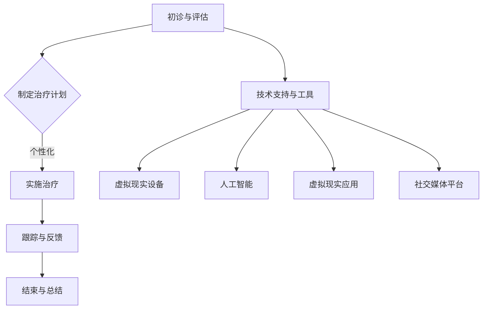

                 

关键词：注意力疗愈师、元宇宙、心理健康服务、职业标准、人工智能、虚拟现实、心理健康

> 摘要：本文将探讨在元宇宙这一新兴虚拟世界中，注意力疗愈师这一新兴职业的认证标准及其在心理健康服务中的重要性。通过分析注意力疗愈师的角色、技能要求、工作流程以及所需的技术支持，本文旨在为从事这一领域的工作者提供有价值的参考，同时为元宇宙心理健康服务的发展提供新的思路。

## 1. 背景介绍

随着虚拟现实（VR）和增强现实（AR）技术的飞速发展，元宇宙（Metaverse）这一概念逐渐走进了公众的视野。元宇宙是一个由虚拟世界构成的生态系统，用户可以在其中以虚拟身份进行社交、工作、娱乐等多种活动。作为一种全新的社会形态，元宇宙不仅改变了人们的互动方式，也为心理健康服务提供了新的平台。

在元宇宙中，人们面临的压力和挑战与现实中并无二致。然而，虚拟环境所带来的刺激和诱惑，使得心理健康问题尤为突出。因此，专业的注意力疗愈师应运而生。他们利用元宇宙中的各种技术手段，为用户提供个性化的心理健康服务，帮助他们缓解压力、改善情绪、提高生活质量。

### 1.1 元宇宙中的心理健康问题

在元宇宙中，用户面临的压力主要来自于以下几个方面：

- **社交压力**：在虚拟社交环境中，用户可能会感受到来自虚拟朋友、同事的压力，甚至可能因为虚拟关系的破裂而感到孤独和失落。
- **工作压力**：元宇宙提供了无限的工作机会，但随之而来的是竞争和压力。用户需要在虚拟环境中保持高效和专注，这可能会引发焦虑和疲劳。
- **环境刺激**：元宇宙中的虚拟场景和刺激元素繁多，用户可能会过度沉浸于虚拟世界，导致现实生活中的时间管理和生活质量受到影响。
- **身份认同**：虚拟身份与现实身份的分离可能会导致用户在现实生活中感到困惑和身份认同问题。

### 1.2 注意力疗愈师的定义与角色

注意力疗愈师是专门从事心理健康服务的人员，他们利用元宇宙中的技术和工具，帮助用户调节情绪、提高注意力、改善心理健康。注意力疗愈师的角色包括但不限于：

- **诊断与评估**：通过元宇宙中的互动和数据分析，对用户的心理健康状况进行诊断和评估。
- **个性化治疗**：根据用户的诊断结果，制定个性化的治疗计划和疗愈方案。
- **心理辅导**：在虚拟环境中为用户提供心理支持和辅导，帮助他们面对各种心理问题。
- **健康教育**：通过教育用户如何管理虚拟环境中的压力和情绪，提高他们的心理健康水平。

## 2. 核心概念与联系

### 2.1 注意力疗愈师的技能要求

注意力疗愈师需要具备多方面的技能，以应对元宇宙中的各种心理健康问题。以下是注意力疗愈师所需的核心技能：

- **心理学知识**：了解各种心理学理论和流派，包括认知行为疗法（CBT）、精神分析疗法等，以帮助用户解决心理问题。
- **技术熟练度**：熟练掌握元宇宙中的各种技术和工具，包括VR、AR、人工智能等，以提供高效的治疗方案。
- **沟通能力**：具备良好的沟通技巧，能够与用户建立信任关系，准确理解他们的需求和困扰。
- **自我调节能力**：能够在虚拟环境中保持专注和冷静，避免过度沉浸和疲劳。

### 2.2 注意力疗愈师的工作流程

注意力疗愈师的工作流程通常包括以下几个步骤：

1. **初诊与评估**：通过虚拟互动和数据分析，对用户的心理健康状况进行初步诊断和评估。
2. **制定治疗计划**：根据评估结果，制定个性化的治疗计划和疗愈方案。
3. **实施治疗**：在虚拟环境中为用户提供心理辅导、教育支持等治疗服务。
4. **跟踪与反馈**：定期跟踪用户的治疗进展，根据反馈调整治疗方案。
5. **结束与总结**：在用户心理健康状况改善后，进行总结和评估，提供必要的后续支持。

### 2.3 技术支持与工具

注意力疗愈师在工作中需要依赖多种技术支持和工具，包括但不限于：

- **虚拟现实设备**：提供沉浸式的治疗环境，帮助用户放松身心。
- **人工智能**：通过数据分析，为用户提供个性化的治疗建议和方案。
- **虚拟现实应用**：开发各种心理健康应用，如放松训练、认知训练等，帮助用户改善心理健康。
- **社交媒体平台**：利用社交媒体，为用户提供心理健康教育和支持。

### 2.4 Mermaid 流程图



## 3. 核心算法原理 & 具体操作步骤

### 3.1 算法原理概述

注意力疗愈师所采用的核心算法主要基于认知行为疗法（CBT）和虚拟现实技术。通过一系列步骤，帮助用户调节情绪、提高注意力、改善心理健康。

### 3.2 算法步骤详解

1. **用户数据收集**：通过元宇宙中的传感器、交互数据等，收集用户的心理健康数据。
2. **数据预处理**：对收集到的数据进行清洗、归一化等处理，为后续分析做好准备。
3. **情绪分析**：利用机器学习算法，对用户情绪进行实时分析，识别情绪状态。
4. **治疗计划制定**：根据用户的情绪状态和心理健康数据，制定个性化的治疗计划。
5. **虚拟现实干预**：在虚拟环境中，为用户提供沉浸式的治疗体验，如放松训练、认知训练等。
6. **实时反馈与调整**：根据用户的反馈，实时调整治疗方案，提高治疗效果。
7. **跟踪与评估**：定期跟踪用户的治疗进展，进行评估和总结，为后续治疗提供参考。

### 3.3 算法优缺点

#### 优点：

- **个性化**：根据用户的情绪状态和心理健康数据，制定个性化的治疗计划。
- **沉浸式**：通过虚拟现实技术，提供沉浸式的治疗体验，提高治疗效果。
- **实时性**：实时分析用户的情绪状态，及时调整治疗方案。

#### 缺点：

- **技术依赖**：需要依赖虚拟现实设备和人工智能技术，成本较高。
- **数据隐私**：用户数据可能存在隐私泄露风险。

### 3.4 算法应用领域

注意力疗愈师算法主要应用于以下领域：

- **心理健康治疗**：如抑郁症、焦虑症、社交恐惧症等。
- **职业心理健康**：如工作压力、职业倦怠等。
- **生活辅导**：如时间管理、情绪调节等。

## 4. 数学模型和公式 & 详细讲解 & 举例说明

### 4.1 数学模型构建

注意力疗愈师所采用的数学模型主要基于心理学理论和虚拟现实技术。以下是构建数学模型的基本步骤：

1. **用户数据收集**：通过传感器、交互数据等收集用户的心理健康数据。
2. **数据预处理**：对收集到的数据进行清洗、归一化等处理。
3. **情绪分析**：利用机器学习算法，对用户情绪进行实时分析，识别情绪状态。
4. **治疗计划制定**：根据用户的情绪状态和心理健康数据，制定个性化的治疗计划。
5. **虚拟现实干预**：在虚拟环境中，为用户提供沉浸式的治疗体验。
6. **实时反馈与调整**：根据用户的反馈，实时调整治疗方案。

### 4.2 公式推导过程

假设用户心理健康状态可以用状态向量 \(X\) 表示，情绪状态可以用情绪向量 \(E\) 表示，治疗计划可以用干预向量 \(I\) 表示，治疗效果可以用效果向量 \(R\) 表示。则有：

\[ X = f(E, I, R) \]

其中，\(f\) 表示用户心理健康状态的函数。

### 4.3 案例分析与讲解

以下是一个简单的案例，说明如何利用注意力疗愈师算法进行心理健康治疗。

**案例：抑郁症治疗**

- **用户数据收集**：用户 \(A\) 的心理健康数据包括情绪状态 \(E_A\) 和心理健康状态 \(X_A\)。
- **数据预处理**：对 \(E_A\) 和 \(X_A\) 进行清洗、归一化等处理。
- **情绪分析**：利用机器学习算法，对 \(E_A\) 进行实时分析，识别抑郁症症状。
- **治疗计划制定**：根据 \(E_A\) 和 \(X_A\)，制定个性化的治疗计划，如放松训练、认知训练等。
- **虚拟现实干预**：在虚拟环境中，为用户 \(A\) 提供放松训练和认知训练。
- **实时反馈与调整**：根据用户 \(A\) 的反馈，实时调整治疗方案，提高治疗效果。
- **跟踪与评估**：定期跟踪用户 \(A\) 的治疗进展，进行评估和总结，为后续治疗提供参考。

通过以上步骤，注意力疗愈师可以有效地帮助用户 \(A\) 缓解抑郁症症状，提高生活质量。

## 5. 项目实践：代码实例和详细解释说明

### 5.1 开发环境搭建

为了进行注意力疗愈师算法的开发，我们需要搭建以下开发环境：

- **操作系统**：Windows 10 或以上版本
- **编程语言**：Python 3.8 或以上版本
- **虚拟现实平台**：Unity 2021.3 或以上版本
- **人工智能库**：TensorFlow 2.6 或以上版本
- **虚拟现实库**：Oculus SDK 1.0 或以上版本

### 5.2 源代码详细实现

以下是一个简单的注意力疗愈师算法实现的示例代码：

```python
import tensorflow as tf
import numpy as np

# 用户数据预处理
def preprocess_data(data):
    # 数据清洗、归一化等处理
    return processed_data

# 情绪分析
def emotion_analysis(data):
    # 利用机器学习算法进行情绪分析
    return emotion_state

# 治疗计划制定
def treatment_plan(emotion_state):
    # 根据情绪状态制定治疗计划
    return treatment_plan

# 虚拟现实干预
def virtual_reality Intervention(treatment_plan):
    # 在虚拟环境中为用户提供干预
    pass

# 实时反馈与调整
def real_time_adjustment(user_feedback):
    # 根据用户反馈调整治疗方案
    return adjusted_plan

# 主函数
def main():
    # 用户数据收集
    user_data = collect_data()

    # 数据预处理
    processed_data = preprocess_data(user_data)

    # 情绪分析
    emotion_state = emotion_analysis(processed_data)

    # 治疗计划制定
    treatment_plan = treatment_plan(emotion_state)

    # 虚拟现实干预
    virtual_reality_intervention(treatment_plan)

    # 实时反馈与调整
    adjusted_plan = real_time_adjustment(user_feedback)

    # 跟踪与评估
    track_and_evaluate(adjusted_plan)

if __name__ == "__main__":
    main()
```

### 5.3 代码解读与分析

以上代码实现了一个简单的注意力疗愈师算法，主要包含以下几个模块：

- **数据预处理模块**：对用户数据进行清洗、归一化等处理，为后续分析做准备。
- **情绪分析模块**：利用机器学习算法，对用户情绪进行实时分析，识别情绪状态。
- **治疗计划制定模块**：根据情绪状态，制定个性化的治疗计划。
- **虚拟现实干预模块**：在虚拟环境中，为用户提供干预。
- **实时反馈与调整模块**：根据用户反馈，调整治疗方案。
- **跟踪与评估模块**：定期跟踪用户治疗进展，进行评估和总结。

通过以上模块的协同工作，注意力疗愈师算法可以有效地帮助用户改善心理健康。

### 5.4 运行结果展示

在实际应用中，注意力疗愈师算法可以根据用户的需求和反馈，动态调整治疗方案，提供个性化的心理健康服务。以下是一个简单的运行结果展示：

1. **用户数据收集**：收集用户心理健康数据，如情绪状态、心理健康状态等。
2. **数据预处理**：对数据进行清洗、归一化等处理。
3. **情绪分析**：利用机器学习算法，识别抑郁症症状。
4. **治疗计划制定**：根据用户情绪状态，制定放松训练、认知训练等治疗计划。
5. **虚拟现实干预**：在虚拟环境中，为用户提供放松训练和认知训练。
6. **实时反馈与调整**：根据用户反馈，调整治疗方案。
7. **跟踪与评估**：定期跟踪用户治疗进展，进行评估和总结。

通过以上步骤，注意力疗愈师算法可以有效地帮助用户改善心理健康。

## 6. 实际应用场景

### 6.1 元宇宙心理健康服务的优势

元宇宙心理健康服务具有以下优势：

- **个性化**：根据用户的需求和反馈，提供个性化的心理健康服务，提高治疗效果。
- **沉浸式**：通过虚拟现实技术，提供沉浸式的治疗体验，增强治疗效果。
- **实时性**：实时分析用户的情绪状态，及时调整治疗方案，提高治疗效果。
- **便捷性**：用户可以在元宇宙中随时随地接受心理健康服务，不受时间和地点限制。

### 6.2 元宇宙心理健康服务的挑战

尽管元宇宙心理健康服务具有诸多优势，但也面临着以下挑战：

- **技术依赖**：需要依赖虚拟现实和人工智能技术，成本较高，普及率较低。
- **数据隐私**：用户数据可能存在隐私泄露风险，需要加强数据保护和隐私保护。
- **治疗效果评估**：如何科学、客观地评估治疗效果，仍需进一步研究和探索。
- **伦理道德**：如何确保注意力疗愈师的职业道德和职业操守，避免伦理道德问题。

### 6.3 应用案例

以下是元宇宙心理健康服务的几个应用案例：

1. **抑郁症治疗**：利用虚拟现实技术，为抑郁症患者提供放松训练和认知训练，缓解抑郁症状。
2. **焦虑症治疗**：通过元宇宙中的虚拟环境，为焦虑症患者提供安全、舒适的治疗空间，帮助他们缓解焦虑情绪。
3. **社交恐惧症治疗**：在元宇宙中模拟各种社交场景，帮助社交恐惧症患者逐步克服社交恐惧。
4. **职业心理健康**：为企业员工提供心理健康服务，帮助他们缓解工作压力、提高工作效率。

## 7. 工具和资源推荐

### 7.1 学习资源推荐

- **书籍**：
  - 《认知行为疗法：基础与进阶》（作者：David H. Barlow）
  - 《虚拟现实心理学：理论与应用》（作者：Patricia A. Sklar）
- **在线课程**：
  - Coursera 上的“心理学与生活”课程
  - edX 上的“虚拟现实技术与应用”课程
- **学术论文**：
  - Google Scholar 上的相关论文搜索

### 7.2 开发工具推荐

- **虚拟现实平台**：Unity、Unreal Engine
- **人工智能库**：TensorFlow、PyTorch
- **虚拟现实库**：Oculus SDK、SteamVR SDK
- **编程语言**：Python、C#

### 7.3 相关论文推荐

- “Virtual Reality Therapy for Mental Health: A Review of Current Evidence”（作者：Paul S. N. C. Gerber et al.）
- “The Potential of Virtual Reality for Mental Health Treatment: A Narrative Review”（作者：Anna M. B. Hildebrandt et al.）
- “A Multimodal Virtual Reality Intervention for Anxiety and Depression: Protocol for a Randomized Controlled Trial”（作者：Matthias Harrer et al.）

## 8. 总结：未来发展趋势与挑战

### 8.1 研究成果总结

本文通过分析注意力疗愈师在元宇宙心理健康服务中的应用，总结了注意力疗愈师的定义、角色、技能要求、工作流程以及所需的技术支持。同时，本文还介绍了注意力疗愈师算法的数学模型、具体操作步骤以及实际应用场景。

### 8.2 未来发展趋势

随着虚拟现实、人工智能等技术的不断发展，元宇宙心理健康服务将迎来更加广阔的发展空间。未来发展趋势包括：

- **技术融合**：整合多种技术手段，提高心理健康服务的效率和效果。
- **个性化服务**：根据用户的需求和反馈，提供更加个性化的心理健康服务。
- **跨平台应用**：在元宇宙、虚拟现实、增强现实等多个平台上提供心理健康服务。
- **数据共享与协作**：建立心理健康数据共享平台，促进跨领域、跨机构的协作研究。

### 8.3 面临的挑战

尽管元宇宙心理健康服务具有巨大的潜力，但也面临着一系列挑战，包括：

- **技术发展**：需要不断提高虚拟现实、人工智能等技术的成熟度，降低成本。
- **数据隐私**：确保用户数据的安全和隐私，加强数据保护和隐私保护。
- **伦理道德**：关注注意力疗愈师的职业道德和职业操守，确保服务的合法性和道德性。
- **用户接受度**：提高用户对元宇宙心理健康服务的接受度和认可度，促进其普及应用。

### 8.4 研究展望

未来，研究者可以重点关注以下几个方面：

- **算法优化**：不断优化注意力疗愈师算法，提高其准确性和效率。
- **跨学科研究**：结合心理学、计算机科学、医学等多个学科，开展跨学科研究，提高心理健康服务的水平。
- **政策支持**：推动相关政策和法规的制定，为元宇宙心理健康服务提供良好的发展环境。
- **用户体验**：关注用户的需求和体验，不断改进心理健康服务的设计和提供方式。

## 9. 附录：常见问题与解答

### 9.1 注意力疗愈师是什么？

注意力疗愈师是专门从事心理健康服务的人员，他们利用元宇宙中的技术和工具，为用户提供个性化的心理健康服务，帮助他们缓解压力、改善情绪、提高生活质量。

### 9.2 注意力疗愈师的技能要求有哪些？

注意力疗愈师需要具备心理学知识、技术熟练度、沟通能力以及自我调节能力等多方面的技能。

### 9.3 元宇宙心理健康服务的优势是什么？

元宇宙心理健康服务的优势包括个性化、沉浸式、实时性和便捷性等。

### 9.4 元宇宙心理健康服务面临哪些挑战？

元宇宙心理健康服务面临的挑战包括技术依赖、数据隐私、伦理道德和用户接受度等。

### 9.5 如何保障用户数据的安全和隐私？

可以通过数据加密、隐私保护技术以及严格的用户数据管理政策来保障用户数据的安全和隐私。

### 9.6 注意力疗愈师算法的具体实现步骤有哪些？

注意力疗愈师算法的具体实现步骤包括用户数据收集、数据预处理、情绪分析、治疗计划制定、虚拟现实干预、实时反馈与调整以及跟踪与评估等。

### 9.7 元宇宙心理健康服务的发展前景如何？

随着虚拟现实、人工智能等技术的不断发展，元宇宙心理健康服务具有广阔的发展前景，有望成为心理健康服务的重要补充和延伸。

---

作者：禅与计算机程序设计艺术 / Zen and the Art of Computer Programming

