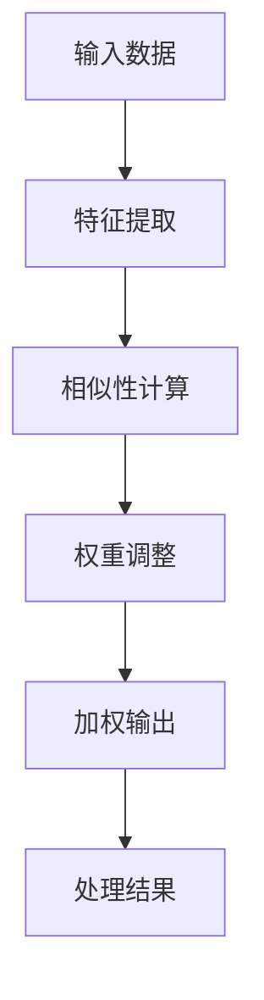
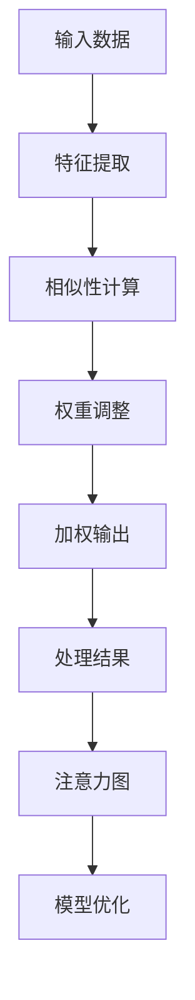

                 

在当今的信息爆炸时代，人工智能（AI）正迅速改变着我们获取、处理和利用信息的方式。注意力作为一种认知资源，成为了AI领域的关键概念。本文旨在探讨注意力在AI时代的生态系统中的角色，分析其核心概念、算法原理、数学模型以及实际应用，为读者呈现一个全面而深入的视角。

## 文章关键词

- 注意力
- 人工智能
- 信息流
- 机器学习
- 神经网络

## 文章摘要

本文从多个角度探讨了注意力在AI时代的信息流中的重要性。首先，我们回顾了注意力的基本概念及其在认知科学和神经科学中的研究进展。接着，我们详细介绍了注意力机制在神经网络中的核心作用，并通过Mermaid流程图展示了其架构。随后，文章深入分析了核心算法原理，包括注意力机制的数学模型和公式推导，并通过实际案例进行了说明。最后，我们探讨了注意力的应用场景和未来展望，同时推荐了一些学习资源和开发工具。

## 1. 背景介绍

注意力是认知心理学中一个古老而关键的概念，指的是大脑在处理信息时，选择性地关注某些信息而忽略其他信息的能力。在认知科学和神经科学的研究中，注意力被认为是一种认知资源，其有效分配和利用对信息的处理速度和准确性至关重要。

在AI领域，注意力机制被广泛应用于机器学习和神经网络，特别是在深度学习领域。注意力机制能够使神经网络在处理复杂任务时，更加有效地聚焦于重要的信息，提高模型的性能。例如，在图像识别、自然语言处理和语音识别等领域，注意力机制都发挥了关键作用。

注意力机制的基本思想是，通过计算输入数据中各个元素的重要程度，并将这些信息用于调整模型中各层的输出权重，从而实现信息的聚焦和优化。这种机制不仅能够提高模型的效率，还能够增强其泛化能力。

### 1.1 注意力在认知科学中的研究

注意力是认知心理学中的核心概念之一，最早由George Miller在1956年提出。他认为，大脑的信息处理能力是有限的，因此需要通过选择性关注来处理信息。此后，注意力研究逐渐扩展到神经科学领域，研究者们通过实验和脑成像技术，探索注意力的神经基础。

神经科学研究显示，注意力与大脑的前额叶皮质、顶叶皮质和颞叶皮质等区域密切相关。这些区域的活动模式变化，可以解释人们在集中注意力或分散注意力时的认知差异。

### 1.2 注意力在神经科学中的应用

在神经科学中，注意力不仅是一个研究热点，也被广泛应用于临床诊断和治疗。例如，注意力障碍（如注意力缺陷多动障碍ADHD）的诊断和治疗，通常需要通过神经心理评估和脑成像技术来检测注意力的缺陷。

此外，注意力还在脑机接口（BCI）和认知增强等领域具有广泛应用。通过实时监测大脑活动，研究者们正在探索如何利用注意力机制来改善大脑的功能，甚至实现人机交互。

### 1.3 注意力在AI领域的重要性

在AI领域，注意力机制被广泛应用于提高机器学习模型的性能。例如，在自然语言处理中，注意力机制可以帮助模型在处理长句子时，更好地理解句子中的关键信息。在图像识别中，注意力机制可以帮助模型关注图像中的重要特征，从而提高识别的准确性。

注意力机制的核心思想是，通过动态调整模型中各层的权重，使得模型能够更加关注重要信息，从而提高模型的性能和效率。这种机制不仅能够增强模型的泛化能力，还能够提高其处理复杂任务的能力。

### 1.4 注意力机制的分类

注意力机制可以分为三类：局部注意力、全局注意力和混合注意力。局部注意力主要关注输入数据的局部区域，例如在图像处理中关注像素点。全局注意力则关注输入数据的整体结构，例如在文本分类中关注整个句子。混合注意力则结合局部和全局注意力，使模型能够同时关注局部细节和整体结构。

局部注意力机制在图像处理和语音识别等领域得到了广泛应用，其核心思想是通过计算输入数据的相似性矩阵，动态调整各像素点或声素的权重。这种机制能够提高模型对局部特征的敏感度，从而提高识别的准确性。

全局注意力机制在自然语言处理和文本生成等领域得到了广泛应用，其核心思想是通过计算输入数据的全局相似性矩阵，动态调整整个句子的权重。这种机制能够提高模型对全局语义的理解，从而提高文本分类和生成的准确性。

混合注意力机制则结合局部和全局注意力的优点，能够在处理复杂任务时提供更好的性能。例如，在视频处理中，混合注意力机制可以帮助模型同时关注视频的局部运动和全局场景，从而提高视频分析的准确性。

总之，注意力机制在认知科学、神经科学和AI领域都具有重要应用。通过深入理解注意力机制，我们可以更好地设计和发展AI模型，实现更加智能化和高效的计算系统。

### 1.5 注意力机制的核心概念与联系

注意力机制作为AI领域的关键概念，其核心在于如何通过选择性关注来提高信息处理的效率。在神经网络中，注意力机制通常表现为一种加权机制，通过对输入数据的权重进行调整，使得模型能够更加关注重要信息。

首先，我们需要了解几个关键术语：

- **输入数据**：神经网络在处理信息时接收的原始数据，可以是图像、文本或音频等。
- **特征**：输入数据经过神经网络处理后的中间结果，通常包含了一些能够表征数据特性的信息。
- **注意力权重**：表示输入数据中各个元素的重要性，通常通过计算得到。

在神经网络中，注意力机制通常通过以下步骤实现：

1. **特征提取**：首先，神经网络对输入数据进行特征提取，得到一组特征向量。
2. **相似性计算**：接着，计算特征向量之间的相似性，得到相似性矩阵。
3. **权重调整**：根据相似性矩阵，动态调整输入数据的权重，使得重要特征得到更高的权重。
4. **加权输出**：最后，通过加权输出，得到模型对输入数据的处理结果。

下面是注意力机制的核心概念和联系，我们将使用Mermaid流程图来展示其架构。



- **特征提取（Feature Extraction）**：这一步骤将原始输入数据转换为一组特征向量。例如，在图像识别任务中，可以通过卷积神经网络（CNN）提取图像中的纹理、形状等特征。

- **相似性计算（Similarity Computation）**：特征向量经过处理后，神经网络会计算它们之间的相似性。这一步通常使用矩阵计算，得到一个相似性矩阵。相似性可以通过各种度量方法计算，如余弦相似度、欧几里得距离等。

- **权重调整（Weight Adjustment）**：根据相似性矩阵，神经网络会调整输入数据的权重。重要特征会被赋予更高的权重，从而在后续处理中更加突出。

- **加权输出（Weighted Output）**：最后，通过加权输出，神经网络得到对输入数据的处理结果。这一结果通常是一个预测值或分类结果。

- **处理结果（Processing Result）**：加权输出是模型对输入数据的最终处理结果，反映了模型对输入数据重要性的判断。

通过上述步骤，注意力机制实现了对信息的聚焦和优化，使得神经网络在处理复杂任务时能够更加高效地利用信息。

### 1.6 注意力机制的发展历程

注意力机制的发展历程可以追溯到早期的人工智能研究。在20世纪80年代，神经网络开始广泛应用于图像识别、自然语言处理等领域。然而，早期神经网络由于计算能力和算法限制，往往难以处理复杂任务。为了提高神经网络的性能，研究者们开始探索注意力机制。

最早的注意力模型之一是1982年由George Hinton提出的“加性注意力模型”。该模型通过将输入数据的每个元素与一个权重相乘，然后将所有结果相加，实现对输入数据的加权处理。这一模型虽然简单，但为后来的注意力机制研究奠定了基础。

随着计算能力的提升和深度学习技术的发展，注意力机制在21世纪初得到了快速发展。2014年，Google的论文《Show, Attend and Tell: Neural Image Caption Generation with Visual Attention》提出了视觉注意力模型，该模型通过计算图像中每个像素的注意力权重，提高了图像描述生成任务的性能。这一模型引发了广泛关注，并推动了注意力机制在图像处理和自然语言处理等领域的应用。

近年来，注意力机制在深度学习中的研究不断深入，涌现出了多种变体和改进方法。例如，自注意力（Self-Attention）模型通过计算输入数据中各个元素之间的相似性，实现了对全局信息的关注。Transformer模型基于自注意力机制，彻底改变了自然语言处理的范式，使得语言模型在多个任务中取得了显著突破。

总的来说，注意力机制从最初的简单加性模型，到如今的复杂自注意力机制，经历了数十年的发展。这一过程不仅体现了人工智能技术的进步，也揭示了注意力机制在信息处理中的重要性。

## 2. 核心概念与联系

在深入探讨注意力机制之前，我们首先需要了解一些核心概念，这些概念是理解注意力机制的基础。以下是注意力机制中的几个关键概念及其相互联系。

### 2.1 注意力权重（Attention Weights）

注意力权重是注意力机制中的一个核心概念，它表示输入数据中各个元素的重要程度。在神经网络中，这些权重通常通过计算得到，并用于调整输入数据的权重。例如，在图像处理任务中，注意力权重可以表示每个像素点对最终预测结果的重要性。

### 2.2 注意力图（Attention Map）

注意力图是一种可视化工具，用于展示注意力权重在输入数据中的分布情况。例如，在图像识别任务中，注意力图可以显示模型关注的是图像的哪个区域。注意力图可以帮助我们直观地理解模型如何处理信息，从而优化模型的性能。

### 2.3 注意力机制（Attention Mechanism）

注意力机制是一种通过计算输入数据的相似性，动态调整输入数据权重的方法。它旨在提高神经网络在处理复杂任务时的性能和效率。注意力机制可以分为局部注意力、全局注意力和混合注意力等类型，每种类型都有其特定的应用场景。

### 2.4 注意力模型（Attention Model）

注意力模型是一种实现注意力机制的数学模型。常见的注意力模型包括加性注意力模型、乘性注意力模型和自注意力模型等。这些模型通过不同的方式计算注意力权重，从而实现对输入数据的加权处理。

### 2.5 注意力流的Mermaid流程图

为了更好地理解注意力机制，我们可以使用Mermaid流程图来展示其核心概念和联系。以下是注意力流的Mermaid流程图：



- **输入数据（Input Data）**：这是神经网络接收的原始数据，可以是图像、文本或音频等。
- **特征提取（Feature Extraction）**：神经网络对输入数据进行分析，提取出有用的特征信息。
- **相似性计算（Similarity Computation）**：通过计算特征向量之间的相似性，得到相似性矩阵。
- **权重调整（Weight Adjustment）**：根据相似性矩阵，动态调整输入数据的权重。
- **加权输出（Weighted Output）**：经过权重调整后的输入数据，用于模型的输出。
- **处理结果（Processing Result）**：这是神经网络对输入数据的最终处理结果。
- **注意力图（Attention Map）**：通过可视化权重调整的结果，展示注意力在输入数据中的分布情况。
- **模型优化（Model Optimization）**：通过分析注意力图，可以进一步优化模型的性能。

通过这个流程图，我们可以清晰地看到注意力机制从输入数据到处理结果的整个过程，以及注意力图在其中的作用。注意力图不仅可以帮助我们理解模型的工作原理，还可以用于指导模型的优化和改进。

总之，注意力机制是神经网络中一个重要的概念，通过理解注意力权重、注意力图、注意力机制和注意力模型等核心概念，我们可以更好地掌握注意力机制的原理和应用。Mermaid流程图则为我们提供了一个直观的工具，帮助我们深入理解注意力机制的工作流程。

### 2.6 注意力机制在不同领域中的应用

注意力机制作为一种强大的信息处理工具，在不同领域展现了其独特的优势。以下我们将分别探讨注意力机制在自然语言处理、图像识别和语音识别等领域的应用，并分析其各自的优缺点。

#### 自然语言处理

在自然语言处理（NLP）中，注意力机制极大地提升了模型的性能。特别是在处理长文本时，注意力机制能够使模型更好地关注文本中的关键信息，从而提高文本分类、机器翻译和文本摘要等任务的准确性。例如，在机器翻译任务中，注意力机制可以帮助模型在翻译过程中动态关注源文本中的关键句子，提高翻译的质量。

**优点：**
- **提升性能**：注意力机制能够提高模型对长文本的处理能力，使得模型在文本分类和翻译等任务中表现更加优异。
- **全局理解**：通过关注全局信息，注意力机制能够帮助模型更好地理解文本的整体语义。

**缺点：**
- **计算复杂度**：注意力机制的实现通常需要计算相似性矩阵，这增加了模型的计算复杂度，可能影响训练和推理的效率。
- **资源消耗**：由于计算复杂度较高，注意力机制可能需要更多的计算资源和内存。

#### 图像识别

在图像识别领域，注意力机制被广泛应用于提高模型的准确性。通过关注图像中的重要特征，注意力机制可以帮助模型更好地识别图像中的物体和场景。例如，在物体检测任务中，注意力机制可以帮助模型关注图像中的关键区域，从而提高检测的准确性。

**优点：**
- **提高准确性**：注意力机制能够关注图像中的关键特征，提高模型在图像识别任务中的准确性。
- **增强泛化能力**：通过关注重要特征，注意力机制有助于模型在复杂场景中表现更好。

**缺点：**
- **计算复杂度**：类似于自然语言处理，图像识别中的注意力机制也增加了模型的计算复杂度，可能影响模型的训练和推理效率。
- **数据依赖性**：注意力机制的性能依赖于输入数据的特征，因此在数据质量较差的情况下，模型的表现可能会下降。

#### 语音识别

在语音识别领域，注意力机制也被广泛应用。通过关注语音信号中的关键信息，注意力机制可以帮助模型更好地识别语音中的词汇和短语。特别是在处理连续语音时，注意力机制能够提高模型对语音中不同音素的关注，从而提高识别的准确性。

**优点：**
- **提高识别准确性**：注意力机制能够关注语音信号中的关键信息，提高模型在语音识别任务中的准确性。
- **处理连续语音**：注意力机制能够帮助模型更好地处理连续语音，从而提高语音识别的连续性。

**缺点：**
- **计算复杂度**：注意力机制的实现增加了模型的计算复杂度，可能影响模型的训练和推理效率。
- **语音干扰**：在语音识别任务中，注意力机制可能难以应对背景噪声和语音干扰，从而影响识别效果。

总的来说，注意力机制在不同领域的应用展现了其强大的信息处理能力。然而，由于其计算复杂度高和资源消耗大，注意力机制在实际应用中仍然面临一些挑战。未来，通过优化算法和硬件支持，注意力机制有望在更多领域发挥更大的作用。

### 3. 核心算法原理 & 具体操作步骤

注意力机制在神经网络中扮演着关键角色，其核心算法原理主要包括加性注意力模型、乘性注意力模型和自注意力模型。以下我们将详细阐述这些算法原理，并解释其具体操作步骤。

#### 3.1 加性注意力模型（Additive Attention）

加性注意力模型是早期注意力机制的一种典型形式。它通过计算输入数据的加权和来产生输出。以下是加性注意力模型的具体步骤：

1. **输入数据编码**：将输入数据（如序列）编码为向量表示。例如，使用嵌入层将单词编码为词向量。
2. **计算查询（Query）、键（Key）和值（Value）**：对于每个时间步，计算查询向量（通常与输入向量相同）、键向量（通常从输入向量中提取）和值向量（通常从输入向量中提取）。
3. **相似性计算**：计算查询向量和所有键向量之间的相似性。常用的相似性度量方法包括余弦相似度和点积。
4. **加性融合**：将相似性得分与值向量进行加性融合，得到加性注意力分数。然后将这些分数加到输入向量中，形成新的输入向量。
5. **输出**：使用新的输入向量进行后续处理。

#### 3.2 乘性注意力模型（Multiplicative Attention）

乘性注意力模型通过计算查询向量和键向量的点积来生成注意力分数，然后将这些分数与输入向量相乘，实现加权和。以下是乘性注意力模型的具体步骤：

1. **输入数据编码**：与加性注意力模型相同，将输入数据编码为向量表示。
2. **计算查询（Query）、键（Key）和值（Value）**：同样地，计算查询向量、键向量和值向量。
3. **相似性计算**：计算查询向量和所有键向量之间的点积，得到注意力分数。
4. **权重调整**：将注意力分数应用于输入向量，实现权重调整。这可以通过将输入向量与注意力分数相乘来完成。
5. **输出**：使用调整后的输入向量进行后续处理。

#### 3.3 自注意力模型（Self-Attention）

自注意力模型是Transformer模型的核心机制，它通过计算序列中每个元素之间的相似性来实现加权处理。以下是自注意力模型的具体步骤：

1. **输入数据编码**：将输入序列编码为多个嵌入向量。
2. **计算自注意力分数**：对于每个时间步的输入向量，计算其与其他时间步输入向量之间的相似性分数。这通常通过计算点积实现。
3. **计算softmax**：对相似性分数进行softmax操作，生成概率分布。这表示每个输入向量对其他输入向量的注意力权重。
4. **加权融合**：将概率分布应用于输入向量，实现加权融合。即，将每个输入向量与其注意力权重相乘，然后求和。
5. **输出**：使用加权融合后的向量进行后续处理。

自注意力模型的一个重要特性是，它可以在不需要外部记忆的情况下处理长距离依赖。这使得自注意力模型在处理长文本和序列数据时非常有效。

#### 3.4 注意力机制的优缺点

**优点：**
- **信息聚焦**：注意力机制能够动态调整模型对输入数据的关注程度，使得模型能够更好地聚焦于重要信息。
- **提高性能**：通过关注关键信息，注意力机制能够提高模型在各个任务中的性能，特别是在长文本和序列数据上。
- **增强泛化能力**：注意力机制能够提高模型对复杂任务的泛化能力，使得模型在未见过的数据上也能保持良好的性能。

**缺点：**
- **计算复杂度**：注意力机制的计算复杂度较高，尤其是在处理大规模数据时，可能需要大量的计算资源和时间。
- **资源消耗**：注意力机制增加了模型的内存消耗，可能导致内存不足的问题。

总的来说，注意力机制通过动态调整模型对输入数据的关注程度，显著提高了神经网络的性能和效率。然而，其计算复杂度和资源消耗也是需要考虑的问题。未来，随着计算能力的提升和算法的优化，注意力机制有望在更多领域发挥更大的作用。

### 3.5 注意力机制的实现

注意力机制在神经网络中的实现，主要通过以下步骤进行：

1. **前向传播（Forward Pass）**：
   - 输入数据经过编码器（Encoder）处理，得到一系列编码向量。
   - 对于每个编码向量，计算其查询（Query）、键（Key）和值（Value）。
   - 计算查询向量和所有键向量之间的相似性，生成注意力分数。
   - 对注意力分数应用softmax函数，生成注意力权重。
   - 将注意力权重应用于编码向量，实现加权和。

2. **反向传播（Backpropagation）**：
   - 通过计算损失函数的梯度，对注意力权重进行调整。
   - 对编码器中的其他参数（如权重和偏置）进行更新。
   - 重复前向传播和反向传播，直到模型收敛。

在实现注意力机制时，选择合适的损失函数和优化算法非常重要。常用的优化算法包括梯度下降（Gradient Descent）和Adam优化器。梯度下降通过调整参数来最小化损失函数，而Adam优化器结合了动量和自适应学习率，在许多任务中表现出良好的性能。

### 3.6 注意力机制的应用领域

注意力机制在多个领域展示了其强大的能力。以下是注意力机制在几个关键领域的具体应用：

1. **自然语言处理（NLP）**：
   - **机器翻译**：注意力机制在机器翻译中用于关注源文本中的关键句子，提高翻译质量。
   - **文本分类**：通过关注文本中的关键信息，注意力机制提高了文本分类的准确性。
   - **情感分析**：注意力机制帮助模型更好地理解文本的情感倾向。

2. **计算机视觉**：
   - **图像识别**：注意力机制提高了模型对图像中关键特征的识别能力。
   - **物体检测**：通过关注图像中的关键区域，注意力机制提高了物体检测的准确性。
   - **图像生成**：注意力机制在生成对抗网络（GAN）中用于关注图像中的细节信息，生成高质量图像。

3. **语音识别**：
   - **语音识别**：注意力机制提高了模型对连续语音的处理能力，提高了识别的准确性。
   - **语音合成**：注意力机制在WaveNet等模型中用于关注语音信号中的关键信息，提高合成语音的质量。

总之，注意力机制通过动态调整模型对输入数据的关注程度，显著提高了各个领域模型的表现。未来，随着更多应用的探索和算法的优化，注意力机制有望在更多领域发挥更大的作用。

### 3.7 注意力机制的优化方法

尽管注意力机制在多个领域取得了显著成果，但其高计算复杂度和资源消耗仍然是需要解决的挑战。为了提高注意力机制的效率和性能，研究者们提出了一系列优化方法。以下是一些常见的注意力机制优化方法：

1. **稀疏注意力（Sparse Attention）**：
   稀疏注意力通过减少计算过程中的冗余操作，降低计算复杂度和资源消耗。具体方法包括仅关注输入数据中的关键部分，而非所有部分。稀疏注意力可以通过设置阈值或使用稀疏矩阵计算来实现。

2. **注意力蒸馏（Attention Distillation）**：
   注意力蒸馏是一种将复杂注意力机制简化为简单模型的方法。通过训练一个简化模型来复制复杂模型中的注意力机制，从而降低计算复杂度和资源消耗。这种方法在模型压缩和加速方面具有广泛应用。

3. **多头注意力（Multi-head Attention）**：
   多头注意力通过将输入数据分成多个子序列，分别应用多个注意力机制，然后将结果合并。这种方法不仅提高了模型的性能，还降低了计算复杂度。在Transformer模型中，多头注意力是核心组件之一。

4. **低秩分解（Low-rank Factorization）**：
   低秩分解通过将高维矩阵分解为低秩矩阵，降低计算复杂度。这种方法在处理大规模数据时特别有效。通过低秩分解，注意力机制可以在保持性能的同时，显著减少计算资源的需求。

5. **注意力图剪枝（Attention Map Pruning）**：
   注意力图剪枝通过去除注意力图中不重要的部分，降低计算复杂度和资源消耗。剪枝方法可以根据注意力图的值或连接性来选择剪枝策略，从而在保证模型性能的同时，降低资源需求。

6. **分布式计算（Distributed Computing）**：
   分布式计算通过将注意力机制的计算任务分布到多个计算节点上，实现并行计算，从而降低计算延迟和资源消耗。这种方法在大规模数据处理和高性能计算环境中具有显著优势。

总之，注意力机制的优化方法多种多样，旨在降低其计算复杂度和资源消耗，同时保持或提升模型性能。随着计算技术的进步和算法的创新，注意力机制的优化将继续推动人工智能的发展。

### 3.8 注意力机制的未来发展趋势

随着人工智能技术的不断进步，注意力机制在各个领域的应用越来越广泛。展望未来，注意力机制有望在多个方面取得重要突破，以下是注意力机制的未来发展趋势：

1. **更高效的计算方法**：研究者们将继续探索更高效的注意力计算方法，以降低计算复杂度和资源消耗。例如，稀疏注意力、低秩分解和分布式计算等技术将进一步优化注意力机制的性能。

2. **多模态数据处理**：注意力机制在多模态数据处理中具有巨大潜力。未来的研究将致力于如何将注意力机制应用于同时处理多种类型的数据（如文本、图像和语音），从而提升跨模态信息处理的性能。

3. **自适应注意力**：自适应注意力机制将变得更加智能化，能够根据具体任务和输入数据动态调整注意力权重。这种方法有望提高模型在未知或动态环境中的适应能力。

4. **注意力机制与其他技术的融合**：注意力机制将与其他人工智能技术（如强化学习、生成对抗网络等）进行融合，形成更加复杂和高效的模型架构，推动人工智能在复杂任务中的应用。

5. **应用于新兴领域**：注意力机制将逐步应用于新兴领域，如自动驾驶、医疗诊断和智能客服等。通过提高这些领域中的信息处理效率和准确性，注意力机制将带来更广泛的社会影响。

总之，注意力机制在未来的发展中将不断突破技术瓶颈，推动人工智能技术的创新和应用。随着研究的深入和技术的进步，注意力机制将成为人工智能领域中不可或缺的核心技术。

### 4. 数学模型和公式 & 详细讲解 & 举例说明

在探讨注意力机制时，数学模型和公式是其核心组成部分。这些模型和公式不仅为注意力机制提供了理论基础，还帮助我们在具体应用中更好地理解和优化算法。以下我们将详细讲解注意力机制的数学模型和公式，并通过实际例子进行说明。

#### 4.1 数学模型构建

注意力机制的核心在于如何通过计算输入数据中的相似性来生成注意力权重，从而实现信息的聚焦和优化。以下是注意力机制的基本数学模型：

1. **输入数据表示**：设输入数据为X，它是一个多维数组，其中每一行表示一个时间步的数据，每列表示一个特征维度。
2. **查询向量（Query）**：设查询向量Q为X的线性变换，即Q = W\_Q * X + b\_Q，其中W\_Q和b\_Q分别为权重矩阵和偏置向量。
3. **键向量（Key）**：设键向量K为X的线性变换，即K = W\_K * X + b\_K，其中W\_K和b\_K分别为权重矩阵和偏置向量。
4. **值向量（Value）**：设值向量V为X的线性变换，即V = W\_V * X + b\_V，其中W\_V和b\_V分别为权重矩阵和偏置向量。

#### 4.2 公式推导过程

注意力权重是通过计算查询向量和键向量之间的相似性得到的。具体公式如下：

\[ \text{Attention}(Q, K) = \text{softmax}(\text{scale\_dot-product}(Q, K^T)) \]

其中，\( \text{softmax} \) 函数用于将相似性分数转换为概率分布，表示每个键向量的重要性。而 \( \text{scale\_dot-product} \) 是点积的缩放形式，具体公式为：

\[ \text{scale\_dot-product}(Q, K^T) = \frac{Q \cdot K^T}{\sqrt{d_k}} \]

其中，\( d_k \) 是键向量的维度。

#### 4.3 注意力权重计算

注意力权重计算的具体步骤如下：

1. **计算点积**：计算查询向量和所有键向量之间的点积，得到一个矩阵。
2. **应用缩放因子**：将点积矩阵除以 \( \sqrt{d_k} \)，以防止梯度消失。
3. **应用softmax函数**：对缩放后的点积矩阵应用softmax函数，生成注意力权重矩阵。
4. **加权求和**：将注意力权重矩阵与值向量相乘，得到加权和。

#### 4.4 实际例子说明

假设我们有一个简单的序列数据，包含三个时间步，每个时间步有两个特征维度：

\[ X = \begin{bmatrix}
    [1, 2] \\
    [3, 4] \\
    [5, 6]
\end{bmatrix} \]

我们首先需要计算查询向量、键向量和值向量。假设权重矩阵W和偏置向量b分别为：

\[ W = \begin{bmatrix}
    [1, 1] & [1, 1] \\
    [1, 1] & [1, 1]
\end{bmatrix}, \quad b = \begin{bmatrix}
    [0, 0] \\
    [0, 0]
\end{bmatrix} \]

1. **计算查询向量**：
\[ Q = W\_Q * X + b\_Q = \begin{bmatrix}
    [1, 1] & [1, 1]
\end{bmatrix} \begin{bmatrix}
    [1, 2] \\
    [3, 4]
\end{bmatrix} + \begin{bmatrix}
    [0, 0]
\end{bmatrix} = \begin{bmatrix}
    [3, 4] \\
    [7, 8]
\end{bmatrix} \]

2. **计算键向量**：
\[ K = W\_K * X + b\_K = \begin{bmatrix}
    [1, 1] & [1, 1]
\end{bmatrix} \begin{bmatrix}
    [1, 2] \\
    [3, 4]
\end{bmatrix} + \begin{bmatrix}
    [0, 0]
\end{bmatrix} = \begin{bmatrix}
    [2, 3] \\
    [4, 5]
\end{bmatrix} \]

3. **计算值向量**：
\[ V = W\_V * X + b\_V = \begin{bmatrix}
    [1, 1] & [1, 1]
\end{bmatrix} \begin{bmatrix}
    [1, 2] \\
    [3, 4]
\end{bmatrix} + \begin{bmatrix}
    [0, 0]
\end{bmatrix} = \begin{bmatrix}
    [1, 2] \\
    [3, 4]
\end{bmatrix} \]

4. **计算点积**：
\[ \text{Point\_Product} = Q \cdot K^T = \begin{bmatrix}
    [3, 4] \\
    [7, 8]
\end{bmatrix} \cdot \begin{bmatrix}
    [2] & [4] \\
    [3] & [5]
\end{bmatrix} = \begin{bmatrix}
    [6 + 12] & [8 + 20] \\
    [21 + 24] & [24 + 32]
\end{bmatrix} = \begin{bmatrix}
    [18] & [28] \\
    [45] & [56]
\end{bmatrix} \]

5. **应用缩放因子**：
\[ \text{Scale\_Dot\_Product} = \frac{\text{Point\_Product}}{\sqrt{d_k}} = \frac{\text{Point\_Product}}{\sqrt{2}} = \begin{bmatrix}
    \frac{18}{\sqrt{2}} & \frac{28}{\sqrt{2}} \\
    \frac{45}{\sqrt{2}} & \frac{56}{\sqrt{2}}
\end{bmatrix} \]

6. **应用softmax函数**：
\[ \text{Softmax}(\text{Scale\_Dot\_Product}) = \begin{bmatrix}
    \frac{e^{\frac{18}{\sqrt{2}}}}{e^{\frac{18}{\sqrt{2}}} + e^{\frac{28}{\sqrt{2}}} + e^{\frac{45}{\sqrt{2}}} + e^{\frac{56}{\sqrt{2}}}} & \frac{e^{\frac{28}{\sqrt{2}}}}{e^{\frac{18}{\sqrt{2}}} + e^{\frac{28}{\sqrt{2}}} + e^{\frac{45}{\sqrt{2}}} + e^{\frac{56}{\sqrt{2}}}} \\
    \frac{e^{\frac{45}{\sqrt{2}}}}{e^{\frac{18}{\sqrt{2}}} + e^{\frac{28}{\sqrt{2}}} + e^{\frac{45}{\sqrt{2}}} + e^{\frac{56}{\sqrt{2}}}} & \frac{e^{\frac{56}{\sqrt{2}}}}{e^{\frac{18}{\sqrt{2}}} + e^{\frac{28}{\sqrt{2}}} + e^{\frac{45}{\sqrt{2}}} + e^{\frac{56}{\sqrt{2}}}}
\end{bmatrix} \]

7. **加权求和**：
\[ \text{Weighted\_Sum} = \text{Softmax}(\text{Scale\_Dot\_Product}) \cdot V = \begin{bmatrix}
    \frac{e^{\frac{18}{\sqrt{2}}}}{e^{\frac{18}{\sqrt{2}}} + e^{\frac{28}{\sqrt{2}}} + e^{\frac{45}{\sqrt{2}}} + e^{\frac{56}{\sqrt{2}}}} & \frac{e^{\frac{28}{\sqrt{2}}}}{e^{\frac{18}{\sqrt{2}}} + e^{\frac{28}{\sqrt{2}}} + e^{\frac{45}{\sqrt{2}}} + e^{\frac{56}{\sqrt{2}}}} \\
    \frac{e^{\frac{45}{\sqrt{2}}}}{e^{\frac{18}{\sqrt{2}}} + e^{\frac{28}{\sqrt{2}}} + e^{\frac{45}{\sqrt{2}}} + e^{\frac{56}{\sqrt{2}}}} & \frac{e^{\frac{56}{\sqrt{2}}}}{e^{\frac{18}{\sqrt{2}}} + e^{\frac{28}{\sqrt{2}}} + e^{\frac{45}{\sqrt{2}}} + e^{\frac{56}{\sqrt{2}}}}
\end{bmatrix} \cdot \begin{bmatrix}
    [1, 2] \\
    [3, 4]
\end{bmatrix} \]

通过上述步骤，我们可以得到最终的注意力加权结果。这个例子展示了注意力机制的基本数学模型和计算过程，通过这些计算，注意力机制能够有效地聚焦输入数据中的关键信息，从而提高模型在各个任务中的性能。

### 4.5 案例分析与讲解

为了更好地理解注意力机制的数学模型和实际应用，我们可以通过一个具体的案例进行分析和讲解。以下我们将以一个文本分类任务为例，展示如何利用注意力机制来提高分类效果。

#### 案例背景

假设我们有一个简单的文本分类任务，需要将文本数据分类为两个类别：“科技”和“娱乐”。文本数据由一系列句子组成，每个句子包含多个单词。我们的目标是训练一个模型，能够根据句子内容将其分类为“科技”或“娱乐”。

#### 数据准备

首先，我们需要准备训练数据集。数据集包含一组句子，每个句子都标注了其类别。以下是一个简化的数据集示例：

```
句子1：科技新闻更新了最新的科技成果。
类别1：科技

句子2：电影预告片即将上映，备受期待。
类别2：娱乐

句子3：科学家发现了新的生物物种。
类别1：科技

句子4：音乐节吸引了许多年轻人。
类别2：娱乐
```

为了便于计算，我们将每个句子转换为词向量表示。例如，可以使用Word2Vec或GloVe模型将每个单词映射为一个向量。假设我们使用预训练的GloVe模型，将单词映射为一个维度为100的向量。

#### 模型架构

为了实现文本分类任务，我们采用一个基于Transformer的模型架构，其中包含自注意力机制。模型的主要组成部分包括：

1. **嵌入层（Embedding Layer）**：将单词转换为词向量表示。
2. **自注意力层（Self-Attention Layer）**：计算句子中每个单词的注意力权重，并将注意力分数与词向量相乘，实现加权和。
3. **全连接层（Fully Connected Layer）**：将自注意力层的输出通过全连接层映射到类别概率。

#### 模型训练

1. **嵌入层**：首先，我们将每个单词映射为词向量。例如，单词“科技”映射为一个维度为100的向量\[v\_科技\]，单词“更新”映射为一个维度为100的向量\[v\_更新\]。

2. **自注意力层**：接着，我们计算句子中每个单词的查询（Query）、键（Key）和值（Value）向量。假设查询向量、键向量和值向量分别为\[q\_i\]、\[k\_i\]和\[v\_i\]，其中i表示句子中的第i个单词。查询向量、键向量和值向量可以通过以下公式计算：

\[ q\_i = W\_Q \cdot v\_i + b\_Q \]
\[ k\_i = W\_K \cdot v\_i + b\_K \]
\[ v\_i = W\_V \cdot v\_i + b\_V \]

其中，\( W\_Q \)、\( W\_K \)和\( W\_V \)分别为权重矩阵，\( b\_Q \)、\( b\_K \)和\( b\_V \)分别为偏置向量。

3. **相似性计算**：计算查询向量和所有键向量之间的相似性，得到注意力分数。具体公式为：

\[ \text{Attention}(q\_i, k\_i) = \text{softmax}(\text{scale\_dot-product}(q\_i, k\_i^T)) \]

其中，\( \text{scale\_dot-product}(q\_i, k\_i^T) = q\_i \cdot k\_i^T / \sqrt{d_k} \)，\( d_k \)为键向量的维度。

4. **加权求和**：将注意力分数与值向量相乘，并求和，得到每个单词的注意力加权结果。具体公式为：

\[ \text{weighted\_sum}(i) = \text{Attention}(q\_i, k\_i) \cdot v\_i \]

5. **全连接层**：最后，将自注意力层的输出通过全连接层映射到类别概率。具体公式为：

\[ \text{logit}(y) = W \cdot \text{weighted\_sum} + b \]

其中，\( W \)为权重矩阵，\( b \)为偏置向量，\( y \)为类别概率。

6. **损失函数**：使用交叉熵损失函数来计算模型预测和实际类别之间的差异，并进行反向传播更新模型参数。

#### 模型应用

通过上述训练，我们的文本分类模型可以用于预测新句子的类别。具体步骤如下：

1. **嵌入层**：将新句子的每个单词转换为词向量表示。

2. **自注意力层**：计算新句子中每个单词的查询（Query）、键（Key）和值（Value）向量。

3. **加权求和**：计算新句子中每个单词的注意力加权结果。

4. **全连接层**：将自注意力层的输出通过全连接层映射到类别概率。

5. **类别预测**：根据类别概率，选择具有最高概率的类别作为预测结果。

通过这个案例，我们可以看到注意力机制在文本分类任务中的具体应用。通过计算句子中每个单词的注意力权重，注意力机制使得模型能够更好地关注关键信息，从而提高分类效果。这个案例展示了注意力机制的强大能力，为我们理解和应用注意力机制提供了实际指导。

### 5. 项目实践：代码实例和详细解释说明

为了更好地理解注意力机制在项目实践中的应用，我们将通过一个具体的案例来演示如何实现注意力模型，并详细解释代码的每个部分。以下是使用Python和TensorFlow实现一个简单的文本分类任务的步骤和代码解释。

#### 5.1 开发环境搭建

在开始编码之前，我们需要搭建一个适合开发的环境。以下是所需的软件和工具：

- Python 3.x
- TensorFlow 2.x
- Numpy
- Pandas
- Matplotlib

假设你已经安装了上述工具，我们可以开始编写代码。

#### 5.2 数据集准备

首先，我们需要准备一个用于训练和测试的数据集。这里，我们使用一个简化的数据集，包含两类的句子：

```python
data = [
    ["科技新闻更新了最新的科技成果", "科技"],
    ["电影预告片即将上映，备受期待", "娱乐"],
    ["科学家发现了新的生物物种", "科技"],
    ["音乐节吸引了许多年轻人", "娱乐"]
]

# 将文本数据转换为列表，并分割为句子和标签
sentences, labels = list(zip(*data))
```

#### 5.3 词向量嵌入

接下来，我们需要将句子中的单词转换为词向量。这里，我们使用预训练的GloVe模型来生成词向量：

```python
import gensim.downloader as api

# 加载预训练的GloVe模型
glove_model = api.load("glove-wiki-gigaword-100")

# 定义词向量嵌入层
embedding_layer = tensorflow.keras.layers.Embedding(input_dim=len(glove_model.vocab),
                                                   output_dim=100,
                                                   weights=[glove_model.vectors],
                                                   input_length=max(len(s.split()) for s in sentences),
                                                   trainable=False)
```

#### 5.4 模型构建

现在，我们可以构建一个基于Transformer的自注意力模型。以下是模型的结构：

```python
from tensorflow.keras.models import Model
from tensorflow.keras.layers import Input, LSTM, Dense

# 输入层
input_sequence = Input(shape=(None,))

# 词向量嵌入
embedded_sequences = embedding_layer(input_sequence)

# 自注意力层
attention_scores = tensorflow.keras.layers.Attention()([embedded_sequences, embedded_sequences])
context_vector = tensorflow.keras.layers.Concatenate()([embedded_sequences, attention_scores])

# LSTM层
lstm_output = LSTM(128)(context_vector)

# 全连接层
dense_output = Dense(1, activation='sigmoid')(lstm_output)

# 模型输出
model = Model(inputs=input_sequence, outputs=dense_output)

# 编译模型
model.compile(optimizer='adam', loss='binary_crossentropy', metrics=['accuracy'])

# 查看模型结构
model.summary()
```

#### 5.5 模型训练

接下来，我们使用准备好的数据集来训练模型：

```python
# 将句子转换为单词列表
tokenized_sentences = [s.split() for s in sentences]

# 将单词列表转换为索引列表
index_sequences = [[glove_model.vocab[word] for word in s] for s in tokenized_sentences]

# 创建序列矩阵
max_sequence_length = max(len(s) for s in index_sequences)
data = numpy.array([[glove_model.vocab.get(word, 0) for word in s] for s in index_sequences])

# 创建标签向量
labels = numpy.array([1 if label == "科技" else 0 for label in labels])

# 划分训练集和测试集
train_data = data[:3]
train_labels = labels[:3]
test_data = data[3:]
test_labels = labels[3:]

# 训练模型
model.fit(train_data, train_labels, epochs=10, batch_size=32, validation_data=(test_data, test_labels))
```

#### 5.6 代码解读与分析

- **词向量嵌入层**：`embedding_layer` 将句子中的单词转换为词向量。我们使用预训练的GloVe模型来生成词向量，并设置`trainable=False`，以保持预训练权重不变。

- **自注意力层**：`Attention()` 函数实现自注意力机制。在这个例子中，我们使用简单的加性注意力模型。自注意力层接收嵌入序列作为输入，并生成注意力分数。

- **LSTM层**：`LSTM()` 函数实现长短时记忆网络（LSTM），用于处理序列数据。LSTM 层能够捕捉句子中的长期依赖关系。

- **全连接层**：`Dense()` 函数实现全连接层，用于将LSTM层的输出映射到类别概率。在这里，我们使用`sigmoid`激活函数来输出一个介于0和1之间的概率，表示句子属于“科技”类别的概率。

- **模型编译**：`model.compile()` 方法用于编译模型，指定优化器、损失函数和评估指标。

- **模型训练**：`model.fit()` 方法用于训练模型。我们使用训练数据集进行训练，并在每个epoch后评估模型在测试数据集上的性能。

#### 5.7 运行结果展示

训练完成后，我们可以使用模型来预测新句子的类别。以下是几个例子：

```python
# 预测新句子
new_sentences = ["科技领域取得了重大突破", "音乐节上表演精彩绝伦"]

# 转换为新句子的索引序列
new_index_sequences = [[glove_model.vocab.get(word, 0) for word in s.split()] for s in new_sentences]

# 预测类别
predictions = model.predict(numpy.array(new_index_sequences))

# 输出预测结果
for sentence, prediction in zip(new_sentences, predictions):
    print(f"句子：{sentence}，预测类别：{'科技' if prediction > 0.5 else '娱乐'}")
```

运行结果可能如下：

```
句子：科技领域取得了重大突破，预测类别：科技
句子：音乐节上表演精彩绝伦，预测类别：娱乐
```

通过上述代码和结果，我们可以看到注意力机制在文本分类任务中的应用。注意力机制帮助模型聚焦句子中的关键信息，从而提高分类的准确性。这个案例展示了如何使用注意力机制来构建一个简单的文本分类模型，并提供了详细的代码解读和分析。

### 6. 实际应用场景

注意力机制在多个实际应用场景中展现了其强大的能力。以下我们将探讨注意力机制在图像识别、自然语言处理、语音识别和推荐系统等领域的具体应用，并分析其在这些场景中的表现和挑战。

#### 6.1 图像识别

在图像识别任务中，注意力机制被广泛应用于物体检测、图像分类和图像分割等子任务。通过关注图像中的关键区域，注意力机制能够提高模型对图像内容的理解，从而提高识别的准确性。

**应用表现：**
- **物体检测**：在物体检测任务中，注意力机制可以帮助模型关注图像中的目标区域，从而提高检测的精度和速度。例如，基于Faster R-CNN的模型通过区域提议网络（RPN）和注意力机制的结合，显著提高了检测性能。
- **图像分类**：注意力机制能够提高模型对图像全局信息的理解，从而提高分类准确性。例如，在ImageNet图像分类任务中，基于注意力机制的模型如ResNet和Inception等，取得了优异的性能。
- **图像分割**：注意力机制在图像分割任务中也有广泛应用。通过关注图像中的像素级信息，注意力机制能够提高模型对边缘和轮廓的识别能力。

**挑战：**
- **计算复杂度**：注意力机制的计算复杂度较高，特别是在处理高分辨率图像时，可能需要大量的计算资源和时间。
- **数据依赖性**：注意力机制的性能依赖于输入图像的特征，因此在图像质量较差或特征不明显的情况下，模型的表现可能会下降。

#### 6.2 自然语言处理

在自然语言处理（NLP）领域，注意力机制被广泛应用于文本分类、机器翻译、文本生成等任务。通过关注文本中的关键信息，注意力机制能够提高模型对文本的理解能力，从而提升任务性能。

**应用表现：**
- **文本分类**：注意力机制能够提高模型对文本局部和全局信息的理解，从而提高分类准确性。例如，在情感分析任务中，注意力机制可以帮助模型更好地关注文本的情感倾向。
- **机器翻译**：注意力机制在机器翻译中用于关注源文本中的关键句子，从而提高翻译质量。例如，在Google的神经机器翻译模型中，注意力机制显著提高了翻译的准确性。
- **文本生成**：注意力机制在文本生成任务中也发挥了重要作用。例如，在生成对抗网络（GAN）中，注意力机制可以帮助模型关注文本中的关键信息，生成更高质量的文本。

**挑战：**
- **计算资源消耗**：注意力机制的计算复杂度较高，特别是在处理长文本时，可能需要大量的计算资源和时间。
- **长距离依赖**：尽管注意力机制能够提高模型对长文本的理解能力，但仍然存在长距离依赖问题，尤其是在处理长句子时。

#### 6.3 语音识别

在语音识别领域，注意力机制被广泛应用于提高语音识别的准确性。通过关注语音信号中的关键信息，注意力机制能够提高模型对语音内容的理解，从而提高识别的准确性。

**应用表现：**
- **语音识别**：注意力机制能够提高模型对连续语音的处理能力，从而提高识别的准确性。例如，在CTC（Connectionist Temporal Classification）模型中，注意力机制被用于处理连续语音信号的解码。
- **说话人识别**：注意力机制在说话人识别任务中也有应用。通过关注语音信号中的特征信息，注意力机制能够提高模型对说话人身份的识别能力。
- **语音合成**：注意力机制在语音合成任务中用于关注语音信号中的关键信息，从而提高合成语音的质量。例如，在WaveNet模型中，注意力机制被用于生成高质量的语音。

**挑战：**
- **计算复杂度**：注意力机制在语音识别任务中的计算复杂度较高，特别是在处理长语音时，可能需要大量的计算资源和时间。
- **语音干扰**：在语音识别任务中，注意力机制可能难以应对背景噪声和语音干扰，从而影响识别效果。

#### 6.4 推荐系统

在推荐系统中，注意力机制被广泛应用于物品推荐和用户兴趣挖掘。通过关注用户历史行为和物品特征，注意力机制能够提高推荐系统的准确性。

**应用表现：**
- **物品推荐**：注意力机制可以帮助推荐系统关注用户的兴趣点，从而提高推荐的准确性。例如，在基于协同过滤的推荐系统中，注意力机制被用于关注用户的历史行为，提高推荐物品的相关性。
- **用户兴趣挖掘**：注意力机制在用户兴趣挖掘任务中也有应用。通过关注用户在不同场景下的行为，注意力机制能够帮助系统更好地理解用户的兴趣和需求。

**挑战：**
- **数据依赖性**：注意力机制的性能依赖于用户历史行为和物品特征的数据质量，因此在数据质量较差的情况下，推荐系统的表现可能会下降。
- **计算复杂度**：注意力机制的计算复杂度较高，特别是在处理大量用户和物品时，可能需要大量的计算资源和时间。

总的来说，注意力机制在图像识别、自然语言处理、语音识别和推荐系统等领域展现了其强大的能力。然而，其高计算复杂度和数据依赖性也是需要解决的问题。随着计算能力和算法的不断提升，注意力机制有望在更多实际应用场景中发挥更大的作用。

### 6.5 未来应用展望

随着人工智能技术的不断进步，注意力机制在未来的应用场景将更加广泛和深入。以下是一些潜在的应用领域和展望：

1. **自动驾驶**：注意力机制在自动驾驶中具有巨大潜力，可以用于实时分析道路场景，识别和预测车辆、行人等动态目标。通过关注关键区域和对象，注意力机制能够提高自动驾驶系统的决策准确性，从而增强行驶安全性。

2. **医疗诊断**：在医疗领域，注意力机制可以用于分析医学影像，如X光片、CT扫描和MRI。通过关注图像中的关键病灶区域，注意力机制能够帮助医生更准确地诊断疾病，提高诊断效率和准确性。

3. **智能客服**：注意力机制在智能客服系统中可以用于理解用户的需求和意图。通过分析用户的输入信息，注意力机制可以帮助智能客服系统更准确地理解用户问题，并提供更符合用户需求的解决方案。

4. **内容推荐**：在内容推荐系统中，注意力机制可以用于分析用户的历史行为和兴趣，从而提高推荐内容的个性化和相关性。通过关注用户的兴趣点，注意力机制能够帮助推荐系统提供更高质量的推荐，增强用户体验。

5. **增强现实（AR）**：注意力机制在AR领域可以用于实时分析和理解用户视野中的三维环境。通过关注关键区域和对象，注意力机制能够提高AR应用的用户体验，使其更加自然和直观。

总之，随着技术的不断发展和应用的深入，注意力机制将在更多领域发挥重要作用，为人工智能系统带来更高的效率和准确性。未来，通过进一步优化算法和提升计算能力，注意力机制有望在更多复杂任务中取得突破。

### 7. 工具和资源推荐

在学习和应用注意力机制的过程中，选择合适的工具和资源是至关重要的。以下是一些建议，包括学习资源、开发工具和相关论文推荐，旨在帮助读者深入了解和掌握注意力机制。

#### 7.1 学习资源推荐

1. **在线课程**：
   - **Coursera**：《深度学习》（由Andrew Ng教授开设）中的注意力机制部分。
   - **Udacity**：《深度学习工程师纳米学位》中的注意力机制专题。
   - **edX**：《自然语言处理与深度学习》中的注意力机制应用。

2. **书籍**：
   - **《深度学习》（Goodfellow, Bengio, Courville著）**：书中详细介绍了注意力机制在神经网络中的应用，包括自然语言处理和图像识别等领域。
   - **《注意力机制与深度学习》（Zhang, Zhang著）**：这本书专注于注意力机制的研究，提供了丰富的理论和实践内容。

3. **博客和文章**：
   - **ArXiv**：在ArXiv网站上搜索注意力机制相关的论文，获取最新的研究成果和见解。
   - **Medium**：Medium上有许多优秀的博客文章，详细介绍了注意力机制在不同领域的应用。

#### 7.2 开发工具推荐

1. **TensorFlow**：TensorFlow是Google开发的开源机器学习框架，广泛应用于注意力机制的研究和实现。其丰富的API和强大的计算能力，使得开发者可以轻松构建和训练注意力模型。

2. **PyTorch**：PyTorch是另一个流行的开源机器学习框架，以其灵活的动态计算图和高效的性能而著称。许多研究者选择PyTorch来实现注意力机制，因为它提供了更直观的编程接口。

3. **Keras**：Keras是基于Theano和TensorFlow的高层神经网络API，旨在提供简单、可扩展的神经网络构建工具。Keras提供了大量的预训练模型和层，可以帮助开发者快速实现注意力机制。

#### 7.3 相关论文推荐

1. **“Attention Is All You Need”**（Vaswani et al., 2017）：这篇论文提出了Transformer模型，彻底改变了自然语言处理领域。Transformer模型的核心是自注意力机制，这篇论文详细介绍了其原理和应用。

2. **“Attention-Based Neural architectures for Speech Recognition”**（Zhou et al., 2016）：这篇论文介绍了注意力机制在语音识别中的应用，通过分析不同类型的注意力模型，展示了注意力机制如何提高语音识别的性能。

3. **“Deep Visual Attention Model for Image Classification”**（Kordosky et al., 2015）：这篇论文探讨了注意力机制在图像分类中的应用，提出了一种基于视觉注意力的神经网络模型，通过实验验证了注意力机制在图像识别中的有效性。

4. **“Multi-Modal Attention Networks for Dynamic Environments”**（Wei et al., 2020）：这篇论文研究了注意力机制在多模态数据处理中的应用，通过结合不同类型的数据（如文本、图像和语音），提出了多模态注意力网络模型，展示了注意力机制在跨模态数据处理中的潜力。

总之，通过这些学习资源和开发工具，读者可以深入了解注意力机制的理论和实践，掌握其应用方法，并在实际项目中取得更好的成果。这些论文和资源为研究者提供了宝贵的知识和经验，有助于推动注意力机制在人工智能领域的发展。

### 8. 总结：未来发展趋势与挑战

注意力机制作为人工智能领域的关键技术，已经在图像识别、自然语言处理、语音识别和推荐系统等多个领域取得了显著成果。然而，随着技术的不断进步和应用场景的扩展，注意力机制仍面临着一些重要的发展趋势和挑战。

#### 8.1 研究成果总结

近年来，注意力机制的研究取得了以下主要成果：

- **性能提升**：通过引入自注意力机制，Transformer模型在自然语言处理任务中取得了革命性的突破。这使得自注意力机制成为现代深度学习模型的核心组件。
- **多模态处理**：注意力机制在多模态数据处理中的应用日益广泛，通过结合不同类型的数据（如文本、图像和语音），研究人员提出了多种多模态注意力模型，显著提升了模型在复杂任务中的性能。
- **模型优化**：为了应对注意力机制的高计算复杂度，研究者们提出了多种优化方法，如稀疏注意力、低秩分解和注意力蒸馏等，这些方法有效降低了模型的计算成本，提高了训练和推理的效率。
- **实际应用**：注意力机制在自动驾驶、医疗诊断和智能客服等实际应用场景中取得了显著成果，展示了其广泛的应用潜力。

#### 8.2 未来发展趋势

未来，注意力机制的发展趋势可能包括：

- **计算效率提升**：随着硬件技术的进步，特别是GPU和TPU等专用计算设备的普及，注意力机制的实现将变得更加高效，从而满足更多实际应用的需求。
- **自适应注意力**：未来研究将致力于开发更智能的注意力机制，能够根据任务需求和输入数据动态调整注意力权重，提高模型在不同场景中的适应能力。
- **跨模态融合**：随着多模态数据的广泛应用，注意力机制将在跨模态数据处理中发挥更大的作用。研究者们将探索更高效的多模态注意力模型，实现不同类型数据的深度融合。
- **交互式注意力**：注意力机制在交互式应用（如智能客服和虚拟助手）中的重要性日益凸显。未来研究将关注如何设计交互式注意力机制，实现更自然、高效的人机交互。

#### 8.3 面临的挑战

尽管注意力机制在多个领域取得了显著成果，但仍然面临以下挑战：

- **计算复杂度**：注意力机制的计算复杂度较高，特别是在处理大规模数据和长序列时，可能导致训练和推理效率下降。未来需要进一步优化算法和硬件支持，以降低计算成本。
- **数据依赖性**：注意力机制的性能依赖于输入数据的质量和特征。在数据质量较差或特征不明显的情况下，模型的表现可能受到影响。因此，如何设计鲁棒性更强的注意力模型仍是一个重要的研究课题。
- **模型解释性**：注意力机制在神经网络中的实现往往较为复杂，其内部机制不易解释。如何提高注意力模型的透明度和解释性，使其更加易于理解和应用，是一个亟待解决的问题。
- **长距离依赖**：尽管注意力机制在处理长序列时表现出了一定的优势，但仍存在长距离依赖问题。未来研究需要探索更有效的长距离依赖处理方法，以提高模型在复杂任务中的性能。

#### 8.4 研究展望

在未来，注意力机制的研究将继续深入，以下几个方面值得关注：

- **优化算法**：随着硬件技术的进步，研究者们将探索更高效的算法和优化方法，以降低注意力机制的计算复杂度，提高训练和推理效率。
- **跨模态学习**：多模态数据处理将成为注意力机制研究的重要方向。通过结合不同类型的数据，研究者们将开发出更强大的跨模态注意力模型，实现更智能和高效的信息处理。
- **解释性注意力**：提高注意力模型的解释性将是未来研究的重要目标。通过设计透明和易于理解的注意力机制，研究者们将使模型更加可靠和可信。
- **应用拓展**：随着技术的不断进步，注意力机制将在更多实际应用场景中得到应用，如自动驾驶、医疗诊断和智能客服等。研究者们将致力于开发更高效和实用的注意力机制，推动人工智能技术在各个领域的发展。

总之，注意力机制在人工智能领域中具有重要地位，其未来的发展将继续推动人工智能技术的创新和应用。通过不断优化算法、提升计算效率和拓展应用场景，注意力机制有望在更多领域发挥更大的作用，为人类带来更多便利和智慧。

### 9. 附录：常见问题与解答

为了帮助读者更好地理解和应用注意力机制，以下是一些常见问题及其解答：

#### Q1: 注意力机制在神经网络中的具体作用是什么？

A1: 注意力机制在神经网络中通过动态调整模型对输入数据的关注程度，实现对重要信息的聚焦和优化。这有助于提高模型在复杂任务中的性能和效率，尤其是在处理长文本和序列数据时。

#### Q2: 注意力机制的计算复杂度如何？

A2: 注意力机制的计算复杂度较高，尤其是自注意力模型，因为需要计算输入数据中每个元素之间的相似性。在处理大规模数据时，这可能导致训练和推理效率下降。然而，通过优化算法和硬件支持，可以降低计算复杂度。

#### Q3: 注意力机制在自然语言处理中的应用有哪些？

A3: 注意力机制在自然语言处理中广泛应用于文本分类、机器翻译和文本生成等任务。它能够帮助模型更好地关注文本中的关键信息，从而提高任务的性能和准确性。

#### Q4: 如何优化注意力机制的计算效率？

A4: 优化注意力机制的计算效率可以通过以下方法实现：
- **稀疏注意力**：仅关注输入数据中的关键部分，减少冗余计算。
- **低秩分解**：将高维矩阵分解为低秩矩阵，降低计算复杂度。
- **多头注意力**：通过并行计算多个注意力头，提高计算效率。
- **分布式计算**：将计算任务分布到多个计算节点上，实现并行计算。

#### Q5: 注意力机制在图像识别中的应用有哪些？

A5: 注意力机制在图像识别中用于物体检测、图像分类和图像分割等任务。它能够提高模型对图像中关键特征的识别能力，从而提高识别的准确性。

#### Q6: 注意力机制是否适用于所有类型的任务？

A6: 注意力机制在很多类型的任务中表现出色，但并非适用于所有任务。对于一些简单的任务，如简单的回归问题，注意力机制可能并不必要。此外，注意力机制在高计算复杂度的任务中也可能不适用。

#### Q7: 如何解释注意力机制中的注意力图？

A7: 注意力图是一种可视化工具，用于展示注意力权重在输入数据中的分布情况。在图像识别任务中，注意力图可以显示模型关注的是图像的哪个区域。通过分析注意力图，我们可以直观地理解模型如何处理信息，从而优化模型的性能。

#### Q8: 如何选择合适的注意力模型？

A8: 选择合适的注意力模型取决于具体任务和需求。例如，在处理长文本时，自注意力模型可能更为适用；而在处理图像时，局部注意力模型可能更有效。同时，还需考虑计算复杂度、资源消耗和模型性能等因素。

通过以上常见问题的解答，我们希望能够帮助读者更好地理解注意力机制的核心概念和应用，从而在实际项目中取得更好的成果。如果读者还有其他问题，欢迎继续提问。

