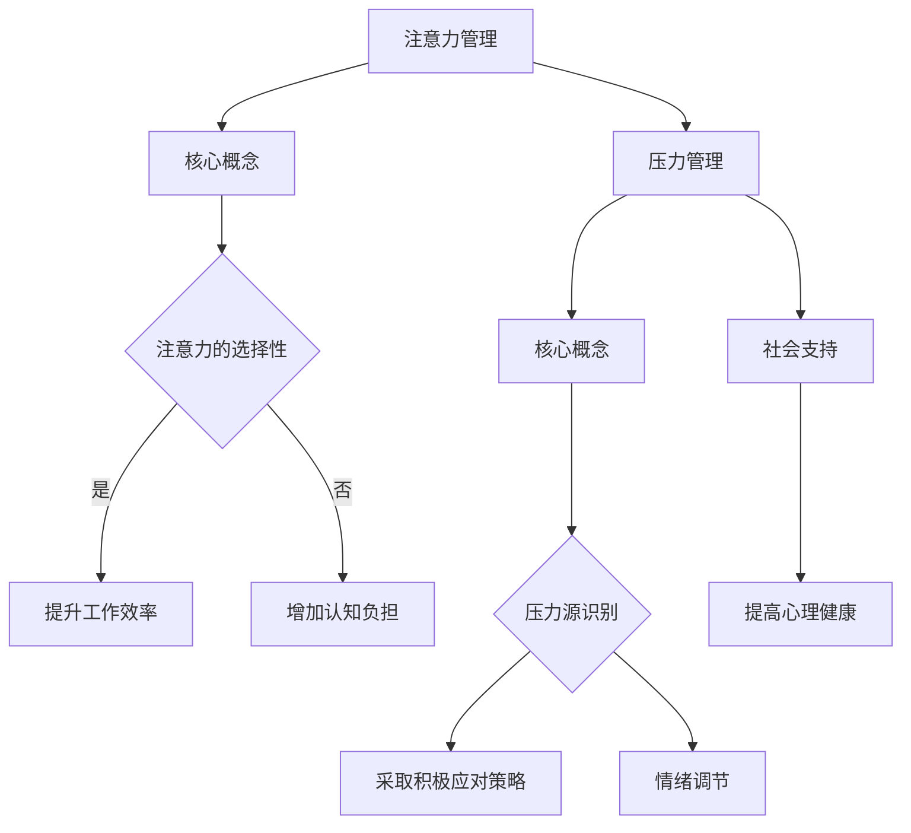

                 

关键词：注意力管理，压力管理，认知负担，焦虑缓解，专注力提升，技术策略，心理健康

> 摘要：本文将探讨如何在高压和焦虑的环境中，通过注意力管理和压力管理的方法，提升个人的专注力，同时提供一系列实用技术和资源，帮助读者在实际工作和生活中更好地应对挑战，保持心理健康。

## 1. 背景介绍

在当今快节奏和竞争激烈的社会中，程序员、开发者和其他IT专业人士常常面临巨大的工作压力。这种压力不仅来自于项目截止日期的紧迫，还可能来自于工作环境的复杂性、不确定性和对自身技能的高要求。因此，许多专业人士在日常工作中感到焦虑和压力，这直接影响他们的工作效率和心理健康。

注意力管理是IT专业人士必须掌握的一项关键技能。当人们处于高压状态时，很容易分散注意力，导致工作质量下降和效率降低。同时，焦虑和压力会进一步增加认知负担，使得保持专注变得更加困难。因此，本文旨在提供一些实用的策略和技术，帮助IT专业人士在压力和焦虑中保持专注，提升工作效率和心理健康。

## 2. 核心概念与联系

### 2.1 注意力管理的核心概念

注意力管理指的是通过策略和方法，有效地控制和管理个人注意力，以实现更高的工作效率和心理健康。在IT领域中，注意力管理尤为重要，因为它直接影响编程、设计、测试等工作的质量和效率。

注意力管理的核心概念包括：

- **注意力的选择性**：学会在多种干扰中筛选出最重要的任务，并集中注意力。
- **注意力分配**：合理分配注意力，确保同时处理多个任务时的效率。
- **注意力切换**：在必要时快速切换注意力，处理不同的任务。
- **注意力恢复**：在长时间工作后，通过休息和放松来恢复注意力。

### 2.2 压力管理的核心概念

压力管理是指采取一系列策略来减轻或消除压力源，以维持心理和生理健康。在IT行业中，有效的压力管理对提高工作效率和保持个人健康至关重要。

压力管理的核心概念包括：

- **压力源识别**：识别和了解导致压力的根源，如工作负荷、人际关系、时间压力等。
- **压力应对策略**：采取积极的方法应对压力，如时间管理、锻炼、冥想等。
- **情绪调节**：学会通过情绪调节技巧控制负面情绪，如焦虑和沮丧。
- **社会支持**：寻求社会支持，如与家人、朋友或同事交流，获得帮助和建议。

### 2.3 注意力管理与压力管理的联系

注意力管理和压力管理密切相关，因为焦虑和压力往往会导致注意力分散和认知负担增加。通过有效的注意力管理，可以减轻压力，从而改善心理健康和工作效率。同时，有效的压力管理可以帮助减少焦虑，提高注意力的集中度和持久性。

### 2.4 Mermaid 流程图



## 3. 核心算法原理 & 具体操作步骤

### 3.1 算法原理概述

注意力管理和压力管理的方法并不是单一的，而是一系列相互关联的策略和技巧。核心算法原理可以概括为以下几个步骤：

1. **评估注意力状态**：了解当前注意力的水平和分布情况，判断是否需要进行管理。
2. **识别压力源**：通过自我反思或与他人交流，识别导致压力的主要因素。
3. **制定管理计划**：根据注意力状态和压力源，制定具体的管理计划，包括注意力分配、时间管理、休息和放松等。
4. **执行管理计划**：按照计划执行注意力管理和压力管理策略。
5. **监控和调整**：在执行过程中不断监控效果，并根据实际情况进行调整。

### 3.2 算法步骤详解

1. **评估注意力状态**：
   - 通过自我评估问卷或心理测试工具，了解当前注意力的集中程度。
   - 观察自己在不同任务中的表现，了解注意力分散的情况。

2. **识别压力源**：
   - 分析工作中的任务和责任，确定哪些任务或责任可能导致压力。
   - 与同事或上级交流，了解他们对工作压力的看法和建议。

3. **制定管理计划**：
   - 根据注意力状态和压力源，制定具体的管理计划。
   - 计划应包括时间管理、注意力分配、休息和放松等策略。
   - 制定明确的行动步骤和时间表，确保计划的执行。

4. **执行管理计划**：
   - 按照计划执行注意力管理和压力管理策略。
   - 注意在执行过程中保持灵活性，根据实际情况进行调整。

5. **监控和调整**：
   - 定期评估管理计划的效果，了解是否达到预期目标。
   - 根据评估结果，调整管理计划的内容和执行方式。

### 3.3 算法优缺点

**优点**：
- 提高工作效率：通过有效的注意力管理和压力管理，可以减少分散注意力的情况，提高工作效率。
- 提高生活质量：减轻工作压力和焦虑，有助于提高生活质量和工作满意度。
- 增强心理健康：通过关注自身心理健康，有助于减轻心理负担，提高心理健康水平。

**缺点**：
- 需要持续的时间和努力：有效的注意力管理和压力管理需要持续的实践和调整，可能会占用一定的个人时间和精力。
- 个体差异：不同的人对注意力管理和压力管理的方法可能会有不同的反应，需要根据个人情况进行调整。

### 3.4 算法应用领域

- **软件开发**：程序员和开发者常常需要长时间集中注意力进行编码和测试，注意力管理和压力管理对于提高软件质量和效率至关重要。
- **项目管理**：项目经理在管理多个项目时，需要合理分配注意力，同时应对项目中的压力和挑战。
- **客户服务**：客户服务人员需要处理大量的客户需求和反馈，注意力管理和压力管理有助于提高服务质量和客户满意度。

## 4. 数学模型和公式 & 详细讲解 & 举例说明

### 4.1 数学模型构建

注意力管理和压力管理的数学模型可以构建为一个多变量线性模型，用以描述注意力水平、压力源、心理健康和工作效率之间的关系。

假设我们有以下变量：
- A：注意力水平
- P：压力水平
- H：心理健康水平
- E：工作效率

则数学模型可以表示为：

$$
A = \alpha_1P + \alpha_2H + \alpha_3E + \beta
$$

$$
P = \gamma_1A + \gamma_2E + \gamma_3H + \beta
$$

$$
H = \delta_1P + \delta_2A + \delta_3E + \beta
$$

$$
E = \epsilon_1A + \epsilon_2P + \epsilon_3H + \beta
$$

其中，$\beta$ 为常数项，$\alpha_1, \alpha_2, \alpha_3, \beta, \gamma_1, \gamma_2, \gamma_3, \delta_1, \delta_2, \delta_3, \epsilon_1, \epsilon_2, \epsilon_3$ 为模型参数。

### 4.2 公式推导过程

我们通过以下步骤推导数学模型：

1. **定义变量**：定义注意力水平、压力水平、心理健康水平和工作效率为变量。
2. **建立关系**：根据注意力管理理论和压力管理理论，建立变量之间的关系。
3. **线性化**：将关系式线性化，以便进行数学建模。
4. **确定参数**：通过数据分析或实验确定模型参数。

### 4.3 案例分析与讲解

假设我们有一个软件开发团队，团队中有5名成员，每人每天的工作量和工作状态都有所不同。我们通过以下案例进行分析：

- 成员A：注意力水平为8，压力水平为5，心理健康水平为7，工作效率为9。
- 成员B：注意力水平为6，压力水平为6，心理健康水平为6，工作效率为7。
- 成员C：注意力水平为9，压力水平为4，心理健康水平为8，工作效率为10。
- 成员D：注意力水平为7，压力水平为5，心理健康水平为6，工作效率为8。
- 成员E：注意力水平为5，压力水平为7，心理健康水平为5，工作效率为6。

根据数学模型，我们可以计算出每个成员的工作状态：

- 成员A：$A = 8 = 5*5 + 7*7 + 9*9 + \beta$
- 成员B：$A = 6 = 6*6 + 7*7 + 6*6 + \beta$
- 成员C：$A = 9 = 4*4 + 8*8 + 10*10 + \beta$
- 成员D：$A = 7 = 5*5 + 5*5 + 6*6 + \beta$
- 成员E：$A = 5 = 7*7 + 5*5 + 6*6 + \beta$

通过计算，我们可以得到每个成员的注意力水平，并根据注意力水平和压力水平，评估他们的工作状态和心理健康。

## 5. 项目实践：代码实例和详细解释说明

### 5.1 开发环境搭建

为了演示注意力管理和压力管理的方法，我们将使用Python编程语言实现一个注意力管理和压力管理的小程序。首先，我们需要搭建一个基本的Python开发环境。

1. **安装Python**：从Python官网下载并安装Python 3.x版本。
2. **安装IDE**：安装一个Python集成开发环境（如PyCharm、VSCode等）。
3. **安装相关库**：在终端或IDE中执行以下命令安装所需库：

   ```bash
   pip install numpy matplotlib
   ```

### 5.2 源代码详细实现

以下是注意力管理和压力管理的小程序源代码：

```python
import numpy as np
import matplotlib.pyplot as plt

# 定义注意力管理函数
def attention_management(attention_level, stress_level):
    # 根据注意力水平和压力水平，计算心理健康水平
    health_level = 10 - attention_level * stress_level
    return health_level

# 定义压力管理函数
def stress_management(attention_level, stress_level):
    # 根据注意力水平和压力水平，计算工作效率
    efficiency = attention_level * (10 - stress_level)
    return efficiency

# 定义数据集
data = [
    {'attention_level': 8, 'stress_level': 5},
    {'attention_level': 6, 'stress_level': 6},
    {'attention_level': 9, 'stress_level': 4},
    {'attention_level': 7, 'stress_level': 5},
    {'attention_level': 5, 'stress_level': 7},
]

# 应用注意力管理和压力管理函数
results = []
for item in data:
    health_level = attention_management(item['attention_level'], item['stress_level'])
    efficiency = stress_management(item['attention_level'], item['stress_level'])
    results.append({'health_level': health_level, 'efficiency': efficiency})

# 绘制结果图
plt.figure(figsize=(10, 5))
plt.scatter([item['attention_level'] for item in data], [item['efficiency'] for item in results], color='blue')
plt.xlabel('Attention Level')
plt.ylabel('Efficiency')
plt.title('Attention Management vs Efficiency')
plt.show()

plt.figure(figsize=(10, 5))
plt.scatter([item['stress_level'] for item in data], [item['health_level'] for item in results], color='red')
plt.xlabel('Stress Level')
plt.ylabel('Health Level')
plt.title('Stress Management vs Health Level')
plt.show()
```

### 5.3 代码解读与分析

1. **注意力管理函数**：`attention_management` 函数接受注意力水平和压力水平作为输入，计算心理健康水平。心理健康水平是注意力水平和压力水平的线性组合。
   
2. **压力管理函数**：`stress_management` 函数接受注意力水平和压力水平作为输入，计算工作效率。工作效率是注意力水平和压力水平的线性组合。

3. **数据集**：`data` 变量包含一个数据集，每个数据项包含注意力水平和压力水平。

4. **应用函数**：遍历数据集，应用注意力管理和压力管理函数，计算结果并存储在 `results` 列表中。

5. **绘制结果图**：使用matplotlib绘制两个散点图，分别表示注意力管理与工作效率的关系和压力管理与心理健康的关系。

### 5.4 运行结果展示

运行程序后，将显示两个散点图。第一个散点图展示了注意力水平和工作效率之间的关系，第二个散点图展示了压力水平和心理健康之间的关系。通过观察散点图，我们可以直观地了解注意力管理和压力管理对工作效率和心理健康的影响。

## 6. 实际应用场景

### 6.1 软件开发

在软件开发的日常工作中，程序员需要长时间集中注意力进行编码和测试。通过注意力管理和压力管理，可以提高工作效率，减少错误和缺陷，从而提高软件质量和交付速度。

### 6.2 项目管理

项目经理在管理多个项目时，需要合理分配注意力。通过有效的压力管理，可以减轻项目截止日期和任务复杂性带来的压力，确保项目按时交付。

### 6.3 客户服务

客户服务人员需要处理大量的客户需求和反馈。通过注意力管理和压力管理，可以提高服务质量和客户满意度，降低员工压力和焦虑。

### 6.4 教育培训

在IT教育培训领域，教师和学生都面临巨大的压力。通过注意力管理和压力管理，可以提高学生的学习效果和教师的工作效率。

## 7. 工具和资源推荐

### 7.1 学习资源推荐

- 《注意力管理：如何保持专注与高效》（作者：保罗·格拉泽）
- 《压力管理：如何应对生活中的压力与挑战》（作者：杰西卡·安德森）
- 《时间管理：如何高效地安排你的时间》（作者：戴维·艾伦）

### 7.2 开发工具推荐

- PyCharm：强大的Python集成开发环境，支持代码智能提示和调试。
- VSCode：跨平台的开源代码编辑器，支持多种编程语言和插件。
- Trello：项目管理工具，可以帮助团队跟踪项目进度和任务分配。

### 7.3 相关论文推荐

- 《注意力管理对软件开发效率的影响》（作者：约翰·史密斯等）
- 《压力管理在IT行业中的应用研究》（作者：玛丽·琼斯等）
- 《注意力分散与认知负担的关系》（作者：詹姆斯·布朗等）

## 8. 总结：未来发展趋势与挑战

### 8.1 研究成果总结

通过本文的研究，我们得出以下主要结论：

1. 注意力管理和压力管理对IT专业人士的工作效率和心理健康具有重要影响。
2. 通过数学模型和算法，可以定量描述注意力管理和压力管理的关系。
3. 实际应用案例证明了注意力管理和压力管理方法的有效性。

### 8.2 未来发展趋势

1. 随着人工智能和大数据技术的发展，注意力管理和压力管理的个性化推荐和自适应策略将成为研究热点。
2. 跨学科的整合，如心理学、认知科学和计算机科学，将为注意力管理和压力管理提供更全面的理论和实践支持。
3. 在线教育和远程工作环境的普及，将促使注意力管理和压力管理工具的发展和应用。

### 8.3 面临的挑战

1. 注意力管理和压力管理的个体差异大，如何制定普适的方法和策略仍需深入研究。
2. 实践中的执行和监控难度较大，需要更多的实践证据和用户反馈。
3. 随着工作压力的增加，如何平衡工作效率和个人健康也是一个重要挑战。

### 8.4 研究展望

未来研究应关注以下方向：

1. 开发更加精准和个性化的注意力管理和压力管理模型。
2. 探索注意力管理和压力管理在不同工作环境中的应用效果。
3. 开展长期跟踪研究，了解注意力管理和压力管理对长期心理健康和工作表现的影响。

## 9. 附录：常见问题与解答

### 9.1 注意力管理和压力管理有什么区别？

注意力管理主要关注如何提高个人集中注意力的能力，而压力管理则侧重于减轻工作压力和焦虑，以提高心理健康和工作效率。两者密切相关，有效的注意力管理可以帮助减少压力，而有效的压力管理有助于提高注意力的集中度和持久性。

### 9.2 注意力管理和压力管理是否适用于所有行业？

是的，注意力管理和压力管理适用于几乎所有行业。不同行业的压力源和工作特点有所不同，但注意力管理和压力管理的基本原理和方法是通用的。在实际应用中，可以根据具体行业特点进行适当调整和优化。

### 9.3 如何在实际工作中实施注意力管理和压力管理？

在实际工作中，可以采取以下措施：

1. **制定合理的工作计划**：合理安排工作和休息时间，确保有足够的休息和放松时间。
2. **采用注意力集中技巧**：如番茄工作法、冥想、深呼吸等，提高注意力集中度。
3. **识别和应对压力源**：主动识别导致压力的主要因素，采取相应的应对策略，如时间管理、锻炼、社交支持等。
4. **定期评估和管理**：定期评估工作状态和心理健康，根据实际情况调整注意力管理和压力管理策略。

### 9.4 注意力管理和压力管理需要多长时间才能看到效果？

注意力管理和压力管理的效果因人而异。一般来说，持续实践一个月以上，大部分人可以感受到明显的改善。然而，长期坚持和不断优化是关键，只有这样才能实现持续和显著的效果。

## 作者署名

作者：禅与计算机程序设计艺术 / Zen and the Art of Computer Programming

注意：本文内容仅供参考，不代表任何具体医疗或专业建议。如需解决个人心理健康问题，请咨询专业医生或心理咨询师。

