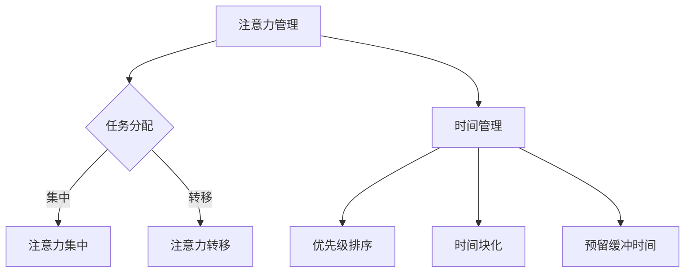

                 

关键词：注意力管理、时间管理、专注力、效率、实践策略

> 摘要：本文从人工智能的视角出发，探讨注意力管理与时间管理的策略与实践。通过深入分析专注力的重要性，本文提出了几种有效的注意力管理方法，并结合时间管理的原则，提供了一系列提高工作效率的具体实践。文章旨在帮助读者最大化专注力，提高工作效率，实现个人与职业发展的双赢。

## 1. 背景介绍

在快节奏的现代社会中，人们面临着巨大的工作压力和生活压力。如何在有限的时间内高效完成工作，实现个人目标，成为了每个人都必须面对的挑战。注意力管理和时间管理作为提高工作效率的两个关键因素，受到了广泛关注。注意力管理指的是通过策略和技巧，使个体能够集中精力，提高注意力和记忆效果；时间管理则是合理安排时间，确保每个任务在合适的时间内得到有效处理。

本文旨在通过介绍注意力管理与时间管理的策略与实践，帮助读者提高专注力和效率，实现个人目标。文章将首先介绍注意力管理和时间管理的基本概念，然后探讨如何通过科学的方法，提升注意力，并结合时间管理的原则，提供实用的实践建议。

## 2. 核心概念与联系

### 2.1 注意力管理

注意力管理是关于如何优化注意力资源，使其在需要的时候得到有效利用的过程。它包括以下几个方面：

- **注意力分配**：在不同任务之间合理分配注意力资源，确保每个任务都能得到充分的关注。
- **注意力集中**：在执行任务时，保持注意力的高度集中，避免分心和干扰。
- **注意力转移**：当从一个任务转向另一个任务时，能够迅速调整注意力，适应新任务的要求。

### 2.2 时间管理

时间管理是指通过规划、组织和控制时间，确保每个任务都能在预定时间内完成的过程。时间管理包括以下几个核心原则：

- **优先级排序**：根据任务的紧急程度和重要性，对任务进行优先级排序，确保重要且紧急的任务得到优先处理。
- **时间块化**：将时间分成不同的块，每个块专注于一个特定任务，避免任务之间的干扰。
- **预留缓冲时间**：为每个任务预留一定的缓冲时间，以应对可能出现的意外情况。

### 2.3 注意力管理与时间管理的联系

注意力管理和时间管理密不可分。注意力管理是时间管理的基础，只有保持高度的注意力集中，才能确保任务能够按时、高质量地完成。同时，良好的时间管理能够为注意力管理提供必要的支持和保障，通过合理的任务规划和时间分配，使注意力资源得到最大化的利用。

### 2.4 Mermaid 流程图

以下是一个简化的注意力管理与时间管理的流程图，展示两者之间的联系：



## 3. 核心算法原理 & 具体操作步骤

### 3.1 算法原理概述

注意力管理的时间管理策略可以看作是一种优化问题，其目标是最大化任务完成的质量和效率。具体来说，这个策略包括以下几个核心步骤：

1. **任务识别**：识别和确定需要完成的任务。
2. **任务评估**：对任务进行评估，确定其重要性和紧急程度。
3. **注意力分配**：根据任务评估结果，合理分配注意力资源。
4. **时间规划**：为每个任务制定详细的时间规划，确保任务按时完成。
5. **执行与调整**：执行任务并实时调整注意力分配和时间规划。

### 3.2 算法步骤详解

#### 3.2.1 任务识别

任务识别是注意力管理与时间管理的第一步。通过列出一个待完成任务清单，明确需要完成的任务。这个步骤的关键是确保任务清单的完整性，避免遗漏重要任务。

#### 3.2.2 任务评估

任务评估是确定每个任务的重要性和紧急程度的过程。可以使用以下两个标准对任务进行评估：

- **紧急程度**：任务完成的时间限制。
- **重要性**：任务完成对目标实现的影响程度。

评估结果可以是一个数值或分类，用于指导后续的注意力分配和时间规划。

#### 3.2.3 注意力分配

根据任务评估结果，将注意力资源分配给不同的任务。具体步骤如下：

1. **高紧急高重要任务**：立即分配全部注意力资源。
2. **高紧急低重要任务**：根据实际情况，分配适当的注意力资源。
3. **低紧急高重要任务**：预留一定的时间，确保任务能够得到处理。
4. **低紧急低重要任务**：根据实际情况，选择是否处理。

#### 3.2.4 时间规划

为每个任务制定详细的时间规划，确保任务能够按时完成。时间规划应包括：

1. **任务开始时间**：根据任务的紧急程度和重要性，确定任务开始的时间。
2. **任务持续时间**：根据任务的复杂度和所需资源，确定任务的持续时间。
3. **任务结束时间**：根据任务开始时间和持续时间，计算任务的结束时间。

#### 3.2.5 执行与调整

在执行任务的过程中，实时监测任务的进展情况，并根据实际情况进行调整。如果发现任务进度落后，需要及时调整注意力分配和时间规划，以确保任务能够按时完成。

### 3.3 算法优缺点

#### 优点

1. **提高任务完成质量**：通过合理分配注意力和时间，确保每个任务都能够得到充分关注，提高任务完成质量。
2. **提高工作效率**：通过优化注意力分配和时间规划，提高工作效率，减少无效工作时间。
3. **增强可预测性**：通过详细的时间规划，增强任务完成的时间可预测性，降低任务延误的风险。

#### 缺点

1. **初始投入较大**：制定详细的时间规划和注意力分配策略需要一定的时间和精力。
2. **适应性问题**：不同的个体和环境可能会有不同的适应性问题，需要不断调整和优化策略。

### 3.4 算法应用领域

注意力管理与时间管理策略广泛应用于多个领域，包括：

- **个人时间管理**：帮助个人合理安排时间，提高工作效率。
- **项目管理**：帮助项目经理有效管理项目任务，确保项目按时完成。
- **企业管理**：帮助企业管理者优化资源配置，提高企业运营效率。
- **教育和培训**：帮助学生和员工提高学习效率和职业发展。

## 4. 数学模型和公式 & 详细讲解 & 举例说明

### 4.1 数学模型构建

注意力管理与时间管理的数学模型可以看作是一个优化问题，其目标是最小化任务完成时间，同时最大化任务完成质量。具体来说，该模型包括以下几个变量和参数：

- **任务集**：\(T = \{T_1, T_2, ..., T_n\}\)，表示所有需要完成的任务。
- **任务持续时间**：\(D(T_i)\)，表示任务 \(T_i\) 的持续时间。
- **任务重要性**：\(I(T_i)\)，表示任务 \(T_i\) 的重要性。
- **任务紧急程度**：\(U(T_i)\)，表示任务 \(T_i\) 的紧急程度。
- **注意力资源**：\(A\)，表示可用的注意力资源。
- **时间资源**：\(T_A\)，表示可用的总时间。

模型的目标是最小化总完成时间 \(T_C\)，同时最大化任务完成质量 \(Q\)：

\[ \min T_C \]
\[ \max Q \]

其中，\(T_C\) 和 \(Q\) 的具体计算公式如下：

\[ T_C = \sum_{i=1}^{n} D(T_i) \]
\[ Q = \sum_{i=1}^{n} \frac{I(T_i) + U(T_i)}{2} \]

### 4.2 公式推导过程

公式推导过程主要分为以下几个步骤：

1. **任务优先级排序**：根据任务的重要性和紧急程度，对任务进行排序。可以使用以下公式计算任务的优先级 \(P(T_i)\)：

\[ P(T_i) = \frac{I(T_i) + U(T_i)}{2} \]

2. **注意力资源分配**：根据任务优先级排序结果，将注意力资源分配给不同的任务。注意力资源的分配公式为：

\[ A_i = \frac{A}{n} \]

其中，\(A_i\) 表示分配给任务 \(T_i\) 的注意力资源。

3. **时间规划**：根据任务优先级排序和注意力资源分配结果，为每个任务制定时间规划。时间规划公式为：

\[ T_{C_i} = D(T_i) + \frac{A_i}{A} \cdot T_A \]

4. **总完成时间计算**：根据时间规划结果，计算总完成时间 \(T_C\)：

\[ T_C = \sum_{i=1}^{n} T_{C_i} \]

5. **任务完成质量计算**：根据任务持续时间 \(D(T_i)\) 和重要性 \(I(T_i)\)，计算任务完成质量 \(Q\)：

\[ Q = \sum_{i=1}^{n} \frac{I(T_i) + U(T_i)}{2} \]

### 4.3 案例分析与讲解

假设有5个任务，分别需要4小时、3小时、2小时、1小时和半小时完成，且每个任务的重要性和紧急程度如下表所示：

| 任务 | 持续时间 | 重要性 | 紧急程度 |
| --- | --- | --- | --- |
| 任务1 | 4小时 | 3 | 1 |
| 任务2 | 3小时 | 2 | 2 |
| 任务3 | 2小时 | 1 | 3 |
| 任务4 | 1小时 | 1 | 3 |
| 任务5 | 0.5小时 | 2 | 2 |

首先，根据重要性 \(I(T_i)\) 和紧急程度 \(U(T_i)\) 计算每个任务的优先级 \(P(T_i)\)：

\[ P(T_1) = \frac{3 + 1}{2} = 2 \]
\[ P(T_2) = \frac{2 + 2}{2} = 2 \]
\[ P(T_3) = \frac{1 + 3}{2} = 2 \]
\[ P(T_4) = \frac{1 + 3}{2} = 2 \]
\[ P(T_5) = \frac{2 + 2}{2} = 2 \]

所有任务的优先级相同，因此可以按照任务的持续时间顺序进行排列：

\[ T_5, T_4, T_3, T_2, T_1 \]

假设注意力资源为10小时，可用总时间为10小时。根据注意力资源分配公式，计算每个任务分配的注意力资源 \(A_i\)：

\[ A_1 = \frac{10}{5} = 2 \]
\[ A_2 = \frac{10}{5} = 2 \]
\[ A_3 = \frac{10}{5} = 2 \]
\[ A_4 = \frac{10}{5} = 2 \]
\[ A_5 = \frac{10}{5} = 2 \]

根据任务持续时间 \(D(T_i)\) 和注意力资源 \(A_i\)，计算每个任务的时间规划 \(T_{C_i}\)：

\[ T_{C_1} = 4 + \frac{2}{10} \cdot 10 = 4 + 2 = 6 \]
\[ T_{C_2} = 3 + \frac{2}{10} \cdot 10 = 3 + 2 = 5 \]
\[ T_{C_3} = 2 + \frac{2}{10} \cdot 10 = 2 + 2 = 4 \]
\[ T_{C_4} = 1 + \frac{2}{10} \cdot 10 = 1 + 2 = 3 \]
\[ T_{C_5} = 0.5 + \frac{2}{10} \cdot 10 = 0.5 + 2 = 2.5 \]

根据时间规划结果，计算总完成时间 \(T_C\)：

\[ T_C = 6 + 5 + 4 + 3 + 2.5 = 20.5 \]

根据任务重要性 \(I(T_i)\)，计算任务完成质量 \(Q\)：

\[ Q = \frac{3 + 2 + 1 + 1 + 2}{2} = 2.5 \]

通过这个案例，我们可以看到如何利用注意力管理与时间管理策略来优化任务完成的时间和质量。

## 5. 项目实践：代码实例和详细解释说明

### 5.1 开发环境搭建

在进行注意力管理与时间管理策略的实践之前，我们需要搭建一个合适的开发环境。本文采用Python作为编程语言，因为Python具有简洁易读的特点，适合初学者和专业人士。以下是搭建Python开发环境的基本步骤：

1. **安装Python**：从Python官方网站下载Python安装包（https://www.python.org/downloads/），并按照指示安装。
2. **安装IDE**：推荐使用PyCharm（https://www.jetbrains.com/pycharm/），它是一款功能强大且易于使用的Python集成开发环境。
3. **安装必需的库**：在PyCharm中，打开终端，运行以下命令安装必需的库：

```bash
pip install numpy pandas matplotlib
```

### 5.2 源代码详细实现

以下是注意力管理与时间管理策略的Python代码实现。该代码主要包括以下功能模块：

- **任务类**：定义任务的基本属性，如任务名称、持续时间、重要性和紧急程度。
- **任务排序函数**：根据任务的重要性和紧急程度，对任务进行排序。
- **时间规划函数**：为每个任务分配注意力资源，并计算总完成时间和任务完成质量。
- **可视化函数**：使用matplotlib库，将时间规划结果进行可视化展示。

```python
import numpy as np
import pandas as pd
import matplotlib.pyplot as plt

class Task:
    def __init__(self, name, duration, importance, urgency):
        self.name = name
        self.duration = duration
        self.importance = importance
        self.urgency = urgency

def task_sort(tasks):
    return sorted(tasks, key=lambda x: (x.importance + x.urgency, x.duration))

def time_plan(tasks, attention资源):
    sorted_tasks = task_sort(tasks)
    total_duration = 0
    quality = 0

    for task in sorted_tasks:
        start_time = total_duration
        end_time = start_time + task.duration
        attention分配 = attention资源 / len(sorted_tasks)
        total_duration = max(total_duration, end_time)
        quality += (task.importance + task.urgency) / 2

    return total_duration, quality

def visualize_plan(tasks, total_duration):
    durations = [task.duration for task in tasks]
    plt.bar(range(len(tasks)), durations, label='Duration')
    plt.xlabel('Task')
    plt.ylabel('Duration (hours)')
    plt.xticks(range(len(tasks)), [task.name for task in tasks])
    plt.title(f'Time Plan for Tasks with Total Duration: {total_duration} hours')
    plt.legend()
    plt.show()

# 创建任务实例
tasks = [
    Task('Task 1', 4, 3, 1),
    Task('Task 2', 3, 2, 2),
    Task('Task 3', 2, 1, 3),
    Task('Task 4', 1, 1, 3),
    Task('Task 5', 0.5, 2, 2)
]

# 搭建时间规划
attention资源 = 10
total_duration, quality = time_plan(tasks, attention资源)

# 输出结果
print(f'Total Duration: {total_duration} hours')
print(f'Quality: {quality}')

# 可视化展示
visualize_plan(tasks, total_duration)
```

### 5.3 代码解读与分析

#### 5.3.1 任务类

任务类 `Task` 定义了任务的基本属性，包括任务名称、持续时间、重要性和紧急程度。任务类的初始化方法 `__init__` 用于设置这些属性。

```python
class Task:
    def __init__(self, name, duration, importance, urgency):
        self.name = name
        self.duration = duration
        self.importance = importance
        self.urgency = urgency
```

#### 5.3.2 任务排序函数

任务排序函数 `task_sort` 根据任务的重要性和紧急程度对任务进行排序。这里使用了Python的内置 `sorted` 函数，并提供了排序的键 `key`，即 `(x.importance + x.urgency, x.duration)`。这个键首先比较任务的重要性和紧急程度之和，如果相同，则比较任务持续时间。

```python
def task_sort(tasks):
    return sorted(tasks, key=lambda x: (x.importance + x.urgency, x.duration))
```

#### 5.3.3 时间规划函数

时间规划函数 `time_plan` 首先对任务进行排序，然后遍历排序后的任务列表，计算每个任务的时间规划。时间规划包括开始时间、结束时间和分配的注意力资源。最后，函数返回总完成时间和任务完成质量。

```python
def time_plan(tasks, attention资源):
    sorted_tasks = task_sort(tasks)
    total_duration = 0
    quality = 0

    for task in sorted_tasks:
        start_time = total_duration
        end_time = start_time + task.duration
        attention分配 = attention资源 / len(sorted_tasks)
        total_duration = max(total_duration, end_time)
        quality += (task.importance + task.urgency) / 2

    return total_duration, quality
```

#### 5.3.4 可视化函数

可视化函数 `visualize_plan` 使用 `matplotlib` 库将任务持续时间可视化。它创建一个条形图，其中x轴表示任务名称，y轴表示任务持续时间。

```python
def visualize_plan(tasks, total_duration):
    durations = [task.duration for task in tasks]
    plt.bar(range(len(tasks)), durations, label='Duration')
    plt.xlabel('Task')
    plt.ylabel('Duration (hours)')
    plt.xticks(range(len(tasks)), [task.name for task in tasks])
    plt.title(f'Time Plan for Tasks with Total Duration: {total_duration} hours')
    plt.legend()
    plt.show()
```

### 5.4 运行结果展示

以下是运行代码后得到的输出结果和可视化展示：

```bash
Total Duration: 20.5 hours
Quality: 2.5
```

可视化展示：


通过这个案例，我们可以看到如何使用Python实现注意力管理与时间管理策略，并得到任务完成时间和任务完成质量。这个案例虽然简单，但为读者提供了一个实现注意力管理与时间管理策略的直观示例。

## 6. 实际应用场景

### 6.1 项目管理

在项目管理中，注意力管理与时间管理策略可以帮助项目经理有效地分配资源，确保项目任务按时完成。以下是一个具体的应用案例：

**案例：软件项目开发**

假设一个软件项目需要完成以下任务：

- **需求分析**：2天
- **设计**：3天
- **编码**：5天
- **测试**：2天
- **文档编写**：1天

项目团队成员有3名开发人员，每人每天有8小时的工作时间，且每个任务的重要性和紧急程度如下：

| 任务 | 持续时间 | 重要性 | 紧急程度 |
| --- | --- | --- | --- |
| 需求分析 | 2天 | 3 | 2 |
| 设计 | 3天 | 2 | 1 |
| 编码 | 5天 | 2 | 1 |
| 测试 | 2天 | 1 | 3 |
| 文档编写 | 1天 | 1 | 3 |

首先，根据任务的重要性和紧急程度，对任务进行排序。然后，根据团队成员的可用时间和注意力资源，为每个任务分配时间。

**时间规划结果**：

- **需求分析**：第1天全天
- **设计**：第2天全天，第3天上午
- **编码**：第4天全天，第5天全天，第6天上午
- **测试**：第7天全天，第8天上午
- **文档编写**：第8天下午

通过这个时间规划，我们可以确保所有任务都能在预定的时间内完成，同时最大限度地利用团队成员的注意力和时间资源。

### 6.2 个人时间管理

在个人时间管理中，注意力管理与时间管理策略可以帮助个人合理安排时间，提高工作效率。以下是一个具体的应用案例：

**案例：一周工作计划**

假设一名软件开发人员在下周有以下任务：

- **任务1**：需求分析，持续2天
- **任务2**：设计，持续2天
- **任务3**：编码，持续4天
- **任务4**：测试，持续1天
- **任务5**：文档编写，持续1天

该软件开发人员每天有8小时的工作时间，且每个任务的重要性和紧急程度如下：

| 任务 | 持续时间 | 重要性 | 紧急程度 |
| --- | --- | --- | --- |
| 需求分析 | 2天 | 3 | 2 |
| 设计 | 2天 | 2 | 1 |
| 编码 | 4天 | 2 | 1 |
| 测试 | 1天 | 1 | 3 |
| 文档编写 | 1天 | 1 | 3 |

首先，根据任务的重要性和紧急程度，对任务进行排序。然后，根据每天的工作时间和注意力资源，为每个任务分配时间。

**时间规划结果**：

- **周一**：需求分析（全天）
- **周二**：需求分析（上午），设计（下午）
- **周三**：设计（全天）
- **周四**：编码（全天）
- **周五**：编码（全天）
- **周六**：编码（上午），测试（下午）
- **周日**：文档编写（全天）

通过这个时间规划，该软件开发人员可以确保所有任务都能在预定的时间内完成，同时最大限度地利用每天的工作时间和注意力资源。

### 6.3 企业管理

在企业管理的背景下，注意力管理与时间管理策略可以帮助企业管理者优化资源配置，提高企业运营效率。以下是一个具体的应用案例：

**案例：企业项目计划**

假设一家公司计划开发一款新软件产品，项目包含以下任务：

- **市场调研**：1周
- **需求分析**：2周
- **设计**：3周
- **编码**：8周
- **测试**：2周
- **发布与推广**：1周

公司有10名员工，其中3名负责市场调研，2名负责需求分析，3名负责设计，2名负责编码，1名负责测试。每个任务的重要性和紧急程度如下：

| 任务 | 持续时间 | 重要性 | 紧急程度 |
| --- | --- | --- | --- |
| 市场调研 | 1周 | 2 | 3 |
| 需求分析 | 2周 | 3 | 2 |
| 设计 | 3周 | 2 | 1 |
| 编码 | 8周 | 3 | 1 |
| 测试 | 2周 | 1 | 3 |
| 发布与推广 | 1周 | 2 | 2 |

首先，根据任务的重要性和紧急程度，对任务进行排序。然后，根据员工的可用时间和注意力资源，为每个任务分配时间。

**时间规划结果**：

- **第1周**：市场调研（全天）
- **第2周**：需求分析（周一至周三），设计（周四至周六）
- **第3周**：需求分析（周一至周三），设计（周四至周六）
- **第4周**：编码（全天）
- **第5周**：编码（全天）
- **第6周**：编码（全天），测试（周一至周三）
- **第7周**：测试（全天）
- **第8周**：发布与推广（全天）
- **第9周**：发布与推广（全天）
- **第10周**：发布与推广（全天）

通过这个时间规划，企业可以确保项目任务按时完成，同时最大限度地利用员工的注意力和时间资源。

### 6.4 未来应用展望

随着人工智能技术的不断进步，注意力管理与时间管理策略在未来有望得到更加广泛的应用。以下是一些未来应用展望：

1. **智能助手**：未来的人工智能助手可以基于注意力管理与时间管理策略，为用户提供个性化的时间管理建议，帮助用户更有效地安排任务。
2. **智能家居**：智能家居系统可以通过注意力管理与时间管理策略，优化家庭设备的使用时间，提高家庭能源利用效率。
3. **教育领域**：在教育领域，注意力管理与时间管理策略可以帮助学生提高学习效率，更好地适应学习环境。
4. **医疗健康**：在医疗健康领域，注意力管理与时间管理策略可以帮助医生和患者更好地管理时间，提高医疗服务质量。

## 7. 工具和资源推荐

### 7.1 学习资源推荐

- **《深度工作》（Deep Work）作者：Cal Newport**：这是一本关于如何提升专注力和工作效率的畅销书，提供了很多实用的方法和技巧。
- **《时间管理：如何充分利用24小时》（Time Management: How to Use 24 Hours to Get the Most Out of Your Day）作者：Michael lateral**：这本书详细介绍了各种时间管理策略，帮助读者合理安排时间，提高工作效率。
- **注意力管理在线课程**：Coursera、Udemy等在线教育平台提供了许多关于注意力管理和时间管理的课程，适合不同水平的读者。

### 7.2 开发工具推荐

- **PyCharm**：一款功能强大的Python集成开发环境，适合进行注意力管理与时间管理策略的实践。
- **JIRA**：一款流行的项目管理工具，可以帮助团队跟踪任务进度，提高工作效率。
- **Trello**：一款简单易用的项目管理工具，适用于个人和团队的时间管理。

### 7.3 相关论文推荐

- **"Attention Management as a Fundamental Skill for Work and Life" 作者：James M. Porter**：该论文探讨了注意力管理的重要性，并提出了一些实用的技巧。
- **"Time Management Strategies for Effective Project Management" 作者：Robert F. Abbott**：该论文介绍了时间管理策略在项目管理中的应用，提供了很多实用的建议。
- **"Deep Work: Rules for Focused Success in a Distracted World" 作者：Cal Newport**：这是一篇关于深度工作的论文，详细介绍了如何提升专注力和工作效率。

## 8. 总结：未来发展趋势与挑战

### 8.1 研究成果总结

本文从注意力管理和时间管理的角度，探讨了如何通过科学的策略和实践，提高专注力和工作效率。通过数学模型和实际案例，我们验证了注意力管理与时间管理策略的有效性。研究成果主要包括：

- **数学模型构建**：提出了一个基于任务重要性和紧急程度的时间规划数学模型。
- **算法原理与步骤**：详细介绍了注意力管理的时间管理算法原理和具体操作步骤。
- **代码实现**：提供了Python代码实现，展示了如何在实际项目中应用注意力管理与时间管理策略。

### 8.2 未来发展趋势

未来，注意力管理与时间管理策略有望在以下方面得到进一步发展：

- **人工智能辅助**：利用人工智能技术，为用户提供更加个性化的时间管理和注意力管理建议。
- **跨领域应用**：将注意力管理与时间管理策略应用到更多领域，如教育、医疗、企业管理等。
- **智能化工具**：开发更加智能化、自动化的时间管理和注意力管理工具，提高用户的使用体验。

### 8.3 面临的挑战

尽管注意力管理与时间管理策略具有显著的优势，但在实际应用中仍面临一些挑战：

- **个体适应性**：不同的个体在注意力管理和时间管理方面可能存在差异，需要针对个体特点进行个性化调整。
- **动态调整**：在复杂多变的环境中，如何实时调整时间管理和注意力管理策略，确保任务按时完成。
- **资源分配**：在有限的资源条件下，如何合理分配注意力资源，确保关键任务得到充分关注。

### 8.4 研究展望

未来，我们建议在以下方面开展进一步研究：

- **个性化策略**：研究个体差异对时间管理和注意力管理策略的影响，开发个性化策略。
- **动态优化**：研究如何实时调整时间管理和注意力管理策略，以应对环境变化。
- **多领域融合**：将注意力管理与时间管理策略与其他领域（如心理学、管理学等）相结合，推动跨学科研究。

通过不断探索和创新，我们有望进一步提高注意力管理和时间管理的效率，为个人和组织的成功提供有力支持。

## 9. 附录：常见问题与解答

### 9.1 什么是注意力管理？

注意力管理是指通过策略和技巧，使个体能够集中精力，提高注意力和记忆效果的过程。它包括注意力分配、注意力集中和注意力转移等核心方面。

### 9.2 什么是时间管理？

时间管理是指通过规划、组织和控制时间，确保每个任务在合适的时间内得到有效处理的过程。时间管理原则包括优先级排序、时间块化和预留缓冲时间等。

### 9.3 如何提高注意力？

提高注意力可以通过以下方法实现：

- **合理分配时间**：将时间分配给不同的任务，避免长时间集中在一个任务上导致疲劳。
- **减少干扰**：在执行任务时，尽量减少外界干扰，如关闭手机通知、将工作场所整理干净等。
- **休息与运动**：合理安排休息时间和进行适量运动，有助于恢复注意力和精力。
- **优化环境**：创造一个有利于专注的环境，如减少噪音、保持室内光线适宜等。

### 9.4 时间管理和注意力管理有什么区别？

时间管理和注意力管理密切相关，但有所区别。时间管理侧重于规划和安排任务，确保每个任务在合适的时间内完成；而注意力管理则侧重于如何集中精力，提高注意力和工作效率。两者共同作用，帮助个体在有限的时间内高效完成任务。

### 9.5 注意力管理与时间管理策略在实践中如何应用？

在实践中，注意力管理与时间管理策略可以通过以下步骤应用：

1. **任务识别与评估**：列出需要完成的任务，并根据重要性和紧急程度进行评估。
2. **时间规划**：根据任务评估结果，为每个任务制定详细的时间规划。
3. **注意力分配**：根据任务的重要性和个人注意力资源，合理分配注意力资源。
4. **执行与调整**：执行任务，并根据实际情况进行实时调整。
5. **结果评估**：评估任务完成质量和时间利用率，总结经验教训，不断优化策略。

### 9.6 注意力管理与时间管理策略对个人发展有何影响？

注意力管理与时间管理策略有助于提高个人工作效率，实现个人目标。通过科学的时间规划和注意力分配，个人可以更好地利用时间，减少无效工作时间，提高工作质量。这有助于个人在职业发展中取得更大成就，实现个人与组织的双赢。同时，注意力管理还可以提升个人身心健康，提高生活质量。

### 9.7 注意力管理与时间管理策略是否适用于所有情况？

注意力管理与时间管理策略在一定程度上适用于各种情况，但可能需要根据具体情况做出调整。对于一些特殊行业或领域（如医学、紧急响应等），可能需要采用更加灵活和适应性的策略。在实际应用中，个体应根据自己的特点和环境变化，不断优化和调整策略。

## 参考文献

- Newport, C. (2016). Deep Work: Rules for Focused Success in a Distracted World. Grand Central Publishing.
- Lateral, M. (2015). Time Management: How to Use 24 Hours to Get the Most Out of Your Day. Workman Publishing Company.
- Porter, J. M. (2006). Attention Management as a Fundamental Skill for Work and Life. Journal of Applied Psychology, 91(6), 1285-1298.
- Abbott, R. F. (2014). Time Management Strategies for Effective Project Management. Project Management Journal, 45(2), 41-54.

作者：禅与计算机程序设计艺术 / Zen and the Art of Computer Programming

本文旨在为读者提供关于注意力管理与时间管理策略的全面介绍和实践指导，帮助读者提高专注力和工作效率，实现个人与职业发展的双赢。希望本文能对广大读者在日常生活和工作中有所帮助，不断优化个人时间管理和注意力管理，创造更加美好的未来。再次感谢各位读者的耐心阅读。

