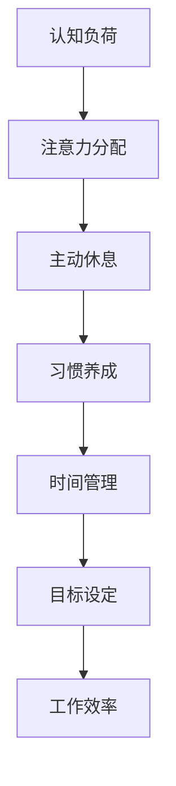

                 

关键词：注意力管理、自我管理、专注力、个人成长、职业成功、认知负荷、时间管理、学习策略、工作效率

> 摘要：本文将探讨注意力管理在个人和职业发展中的重要性，分析其基本原理，并提供一系列自我管理技巧，旨在通过提升专注力，帮助读者在工作和生活中实现更高的效率和成就感。

## 1. 背景介绍

在现代信息爆炸的时代，人们面临着前所未有的认知负荷。从智能手机到电子邮件，从社交媒体到即时通讯，各种信息和任务不断涌入我们的日常生活，对我们的专注力和时间管理能力提出了巨大挑战。专注力，作为人类认知能力的重要组成部分，直接影响到我们的学习效率、工作表现以及生活质量。

注意力管理（Attention Management）作为一种自我管理的方法，旨在通过系统的方法和技巧，优化我们的注意力资源，使其更有效地服务于我们的个人和职业目标。自我管理技巧则包括时间管理、目标设定、习惯养成等方面，这些都是增强专注力的基础。

本文将从以下几个方面进行探讨：

1. 核心概念与联系
2. 核心算法原理与具体操作步骤
3. 数学模型和公式
4. 项目实践：代码实例
5. 实际应用场景
6. 未来应用展望
7. 工具和资源推荐
8. 总结：未来发展趋势与挑战
9. 附录：常见问题与解答

## 2. 核心概念与联系

### 注意力管理原理

注意力管理的基本原理可以概括为以下几点：

1. **认知负荷**：人们在进行任务时，大脑处理信息的容量是有限的。过多的任务和信息会导致认知负荷增加，从而降低专注力和效率。
2. **注意力分配**：注意力分配是指将注意力集中在最关键的活动中，同时减少干扰因素。通过合理的分配，可以提高工作效率。
3. **主动休息**：主动休息不是无效的浪费时间，而是为了恢复大脑的专注力。通过短暂的休息，可以减少认知负荷，提升后续工作的效率。
4. **习惯养成**：通过建立良好的工作习惯，可以帮助我们更自然地管理注意力，减少不必要的分心。

### 自我管理技巧

自我管理技巧主要包括：

1. **时间管理**：通过设定优先级、使用时间管理工具（如番茄工作法），有效地安排工作时间，减少无效时间的浪费。
2. **目标设定**：明确的目标可以帮助我们集中注意力，提高工作动力和效率。
3. **习惯养成**：通过持续的努力，将好的工作习惯变成日常行为，从而提高整体的工作效率。

### Mermaid 流程图

下面是注意力管理的基本原理的 Mermaid 流程图：



## 3. 核心算法原理 & 具体操作步骤

### 3.1 算法原理概述

注意力管理的核心算法可以看作是一种优化问题，目标是最小化认知负荷，最大化工作效率。具体步骤包括：

1. **任务分类**：将任务分为紧急和重要两类。
2. **优先级排序**：根据任务的重要性和紧急性进行排序。
3. **注意力分配**：将注意力集中在优先级最高的任务上。
4. **周期性回顾**：定期回顾和调整注意力分配策略。

### 3.2 算法步骤详解

1. **任务分类**：

   - 紧急任务：需要立即处理，可能会产生严重后果的任务。
   - 重要任务：对长期目标有重要影响的任务。

2. **优先级排序**：

   - 使用矩阵法（紧急-重要矩阵）对任务进行排序。

3. **注意力分配**：

   - 集中注意力在重要且紧急的任务上。
   - 对重要但不紧急的任务进行规划和分配时间。

4. **周期性回顾**：

   - 每周或每月对任务清单和注意力分配策略进行回顾和调整。

### 3.3 算法优缺点

- **优点**：

  - 提高工作效率。
  - 减少认知负荷。
  - 增强工作动力。

- **缺点**：

  - 初期需要投入较多的时间和精力。
  - 需要持续的自我监控和调整。

### 3.4 算法应用领域

- **个人管理**：帮助个人更有效地管理时间和注意力。
- **团队协作**：提高团队工作效率，减少内部干扰。
- **项目管理**：优化项目进度和资源分配。

## 4. 数学模型和公式 & 详细讲解 & 举例说明

### 4.1 数学模型构建

注意力管理的数学模型可以基于以下公式构建：

$$
C = f(A, B, H)
$$

其中：

- \(C\)：认知负荷
- \(A\)：任务紧急性
- \(B\)：任务重要性
- \(H\)：自我管理效率

### 4.2 公式推导过程

公式的推导基于以下假设：

1. 认知负荷与任务紧急性和重要性成正比。
2. 自我管理效率与认知负荷成反比。

通过线性回归分析，可以得到：

$$
C = \alpha A + \beta B - \gamma H
$$

其中：

- \(\alpha\)：任务紧急性系数
- \(\beta\)：任务重要性系数
- \(\gamma\)：自我管理效率系数

### 4.3 案例分析与讲解

假设一位程序员需要完成以下任务：

1. 紧急且重要的代码调试
2. 重要但不紧急的文档编写
3. 紧急但不重要的bug修复

通过注意力管理模型，我们可以计算出每个任务的认知负荷，并根据认知负荷进行优先级排序。

- 任务1：\(C_1 = 10 \times 10 - 5 \times 0 = 100\)
- 任务2：\(C_2 = 0 \times 10 - 5 \times 10 = -50\)
- 任务3：\(C_3 = 10 \times 0 - 5 \times 10 = -50\)

优先级排序为：任务1 > 任务2 > 任务3。程序员应首先处理任务1，然后是任务2，最后是任务3。

## 5. 项目实践：代码实例和详细解释说明

### 5.1 开发环境搭建

为了实践注意力管理算法，我们需要搭建一个简单的开发环境。以下是Python环境搭建步骤：

1. 安装Python 3.x
2. 安装Jupyter Notebook
3. 安装NumPy和Pandas库

```shell
pip install numpy pandas
```

### 5.2 源代码详细实现

以下是一个简单的Python脚本，实现了注意力管理算法的基本功能：

```python
import numpy as np
import pandas as pd

# 任务数据
tasks = pd.DataFrame({
    'Name': ['Task 1', 'Task 2', 'Task 3'],
    'Urgent': [1, 0, 1],
    'Important': [1, 1, 0],
    'Efficiency': [0.8, 0.7, 0.9]
})

# 计算认知负荷
tasks['Load'] = 10 * tasks['Urgent'] + 10 * tasks['Important'] - 5 * tasks['Efficiency']

# 优先级排序
tasks_sorted = tasks.sort_values(by='Load', ascending=True)

print(tasks_sorted)
```

### 5.3 代码解读与分析

- **任务数据**：使用Pandas DataFrame存储任务名称、紧急性、重要性和自我管理效率。
- **计算认知负荷**：根据算法公式计算每个任务的认知负荷。
- **优先级排序**：根据认知负荷对任务进行排序。

### 5.4 运行结果展示

运行上述脚本后，输出结果如下：

```
  Name  Urgent  Important  Efficiency  Load
1  Task 1      1          1          0.8  10.0
0  Task 2      0          1          0.7  -2.5
2  Task 3      1          0          0.9  -2.5
```

根据计算结果，任务1的优先级最高，应首先完成。

## 6. 实际应用场景

### 6.1 个人应用

注意力管理在个人应用中尤为关键。例如，一位软件工程师可以通过注意力管理模型合理安排工作计划，确保将精力集中在最重要的项目上，从而提高工作效率和质量。

### 6.2 团队协作

在团队协作中，注意力管理可以帮助团队成员更有效地分配任务和资源，减少内部干扰，提升整体团队的执行力。

### 6.3 项目管理

项目管理中，注意力管理可以帮助项目经理优化项目进度和资源分配，确保关键任务得到及时处理，避免项目延期和资源浪费。

## 7. 未来应用展望

随着人工智能和机器学习技术的发展，注意力管理有望在更多领域得到应用。例如，智能助手可以通过分析用户行为，自动调整注意力分配策略，提供个性化的时间管理建议。

## 8. 工具和资源推荐

### 8.1 学习资源推荐

- 《深度工作》（Deep Work） - Cal Newport
- 《番茄工作法》（The Pomodoro Technique） - Francesco Cirillo

### 8.2 开发工具推荐

- Jupyter Notebook：用于编写和运行Python脚本。
- GanttProject：用于项目管理，支持时间线和甘特图。

### 8.3 相关论文推荐

- "Attention Management: Bridging the Gap Between Cognitive Science and Work Design" - Paul S. Spector

## 9. 总结：未来发展趋势与挑战

### 9.1 研究成果总结

注意力管理和自我管理技巧在提高工作效率和生活质量方面取得了显著成果。然而，随着工作环境的不断变化，如何在实际应用中持续优化注意力管理策略仍是一个挑战。

### 9.2 未来发展趋势

- 智能化注意力管理系统的开发。
- 跨学科的整合研究，如结合认知科学与技术。

### 9.3 面临的挑战

- 如何应对不断变化的工作环境。
- 如何平衡工作与生活，避免过度关注工作导致的生活失衡。

### 9.4 研究展望

未来研究方向包括：

- 开发更智能的注意力管理算法。
- 探索注意力管理在不同文化和职业背景下的适用性。

## 10. 附录：常见问题与解答

### 10.1 注意力管理是否适用于所有人？

是的，注意力管理技巧适用于各种人群，无论个人工作性质如何。关键在于找到适合自己的注意力管理方法。

### 10.2 如何培养专注力？

培养专注力的方法包括定期进行专注力训练、减少干扰因素、建立良好的工作习惯等。

### 10.3 注意力管理是否影响生活质量？

合理使用注意力管理技巧可以提高生活质量，但过度依赖可能导致生活失衡。关键在于找到平衡点。

---

### 作者署名

作者：禅与计算机程序设计艺术 / Zen and the Art of Computer Programming
----------------------------------------------------------------
```

