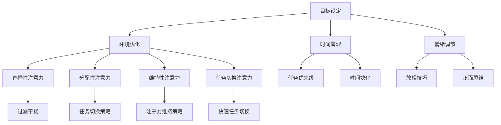

                 

关键词：注意力管理、元宇宙、个人效率、算法原理、数学模型、项目实践、实际应用、工具推荐、未来展望

> 摘要：在元宇宙时代，人类的工作和生活环境发生了翻天覆地的变化，注意力管理成为提升个人效率的关键。本文将深入探讨注意力管理的核心概念、算法原理、数学模型，并通过项目实践和分析，为读者提供一套系统的注意力管理方案。

## 1. 背景介绍

随着技术的快速发展，虚拟现实（VR）和增强现实（AR）逐渐普及，元宇宙概念应运而生。元宇宙是一个虚拟的、沉浸式的数字世界，用户可以在这个世界中实现与现实世界的无缝互动。元宇宙的出现改变了人类的工作、学习和生活方式，也对个人注意力管理提出了新的挑战。

在元宇宙中，用户需要处理大量的信息，各种虚拟角色、社交互动、游戏任务等都需要耗费大量的注意力资源。如果注意力管理不当，可能会导致信息过载、效率低下，甚至对身心健康产生负面影响。因此，如何有效地管理注意力，提高个人工作效率，成为了一个亟待解决的问题。

## 2. 核心概念与联系

### 2.1 注意力概念

注意力是大脑对特定信息的接收、处理和记忆的能力。在元宇宙时代，注意力管理涉及以下几个方面：

- **选择性注意力**：在众多信息中选择对自己最有价值的信息进行关注和处理。
- **分配性注意力**：同时处理多个任务或信息的能力。
- **维持性注意力**：在一段时间内保持对特定任务的持续关注。
- **任务切换注意力**：在不同任务之间快速切换的能力。

### 2.2 注意力管理核心概念

- **目标设定**：明确自己在元宇宙中的目标和任务，有助于集中注意力。
- **环境优化**：调整周围环境，减少干扰，提高注意力集中度。
- **时间管理**：合理安排时间，避免过度劳累，保持精力充沛。
- **情绪调节**：保持良好的情绪状态，有助于提高注意力的稳定性。

### 2.3 注意力管理原理与架构

以下是一个简化的注意力管理原理与架构的 Mermaid 流程图：



## 3. 核心算法原理 & 具体操作步骤

### 3.1 算法原理概述

注意力管理算法的核心目标是优化用户的注意力分配，提高工作效率。算法主要包括以下几个部分：

- **任务识别**：通过分析用户的行为和操作，识别当前的任务。
- **注意力分配**：根据任务的重要性和紧急程度，分配注意力资源。
- **反馈调整**：根据用户的表现和反馈，调整注意力分配策略。

### 3.2 算法步骤详解

1. **任务识别**：通过分析用户在元宇宙中的行为，识别出当前的任务。
2. **注意力分配**：根据任务的优先级和重要性，将注意力资源分配给不同的任务。
3. **任务切换**：当有更高优先级的任务出现时，根据任务切换策略进行切换。
4. **反馈调整**：根据用户的反馈和任务完成情况，调整注意力分配策略。

### 3.3 算法优缺点

**优点**：

- 提高工作效率：通过优化注意力分配，用户可以更高效地完成任务。
- 适应性强：算法可以根据用户的行为和反馈，动态调整注意力分配策略。

**缺点**：

- 需要大量数据支持：算法的训练和优化需要大量的用户行为数据。
- 可能导致过度依赖：如果用户过度依赖算法，可能会导致自主性下降。

### 3.4 算法应用领域

注意力管理算法可以广泛应用于元宇宙中的各个领域，如：

- **教育**：帮助学生更有效地学习。
- **工作**：提高员工的工作效率。
- **娱乐**：优化用户的游戏体验。

## 4. 数学模型和公式 & 详细讲解 & 举例说明

### 4.1 数学模型构建

注意力管理算法的数学模型主要包括以下部分：

- **任务优先级计算**：根据任务的重要性和紧急程度，计算任务的优先级。
- **注意力分配策略**：根据任务的优先级，分配注意力资源。

### 4.2 公式推导过程

假设有 n 个任务，任务 i 的优先级为 pi，注意力资源总量为 R。则任务 i 的注意力分配量 ai 可以通过以下公式计算：

$$
a_i = \frac{R \cdot p_i}{\sum_{j=1}^{n} p_j}
$$

### 4.3 案例分析与讲解

假设有 3 个任务，任务 1 的优先级为 3，任务 2 的优先级为 2，任务 3 的优先级为 1。注意力资源总量为 10。根据上述公式，可以计算出任务 1、任务 2 和任务 3 的注意力分配量分别为 6、4 和 2。

这意味着，在执行这 3 个任务时，任务 1 应该分配更多的注意力资源，以确保任务能够高效完成。

## 5. 项目实践：代码实例和详细解释说明

### 5.1 开发环境搭建

本文的项目实践将使用 Python 作为编程语言，以下是开发环境的搭建步骤：

1. 安装 Python 3.8 及以上版本。
2. 安装必要的库，如 NumPy、Pandas、Matplotlib 等。

### 5.2 源代码详细实现

以下是注意力管理算法的 Python 实现代码：

```python
import numpy as np

def calculate_attention_allocation(priorities, total_attention):
    """
    计算任务注意力分配
    :param priorities: 任务优先级列表
    :param total_attention: 注意力资源总量
    :return: 任务注意力分配列表
    """
    allocation = np.array(priorities) * total_attention / np.sum(priorities)
    return allocation

def main():
    # 任务优先级
    priorities = [3, 2, 1]
    # 注意力资源总量
    total_attention = 10

    # 计算注意力分配
    allocation = calculate_attention_allocation(priorities, total_attention)

    # 打印结果
    print("任务注意力分配：", allocation)

if __name__ == "__main__":
    main()
```

### 5.3 代码解读与分析

上述代码首先导入了 NumPy 库，用于计算和数据处理。然后定义了一个计算任务注意力分配的函数 `calculate_attention_allocation`，该函数接收任务优先级列表和注意力资源总量作为输入，返回任务注意力分配列表。

在 `main` 函数中，我们设定了 3 个任务的优先级为 3、2、1，注意力资源总量为 10。调用 `calculate_attention_allocation` 函数，计算出任务 1、任务 2 和任务 3 的注意力分配量，并打印结果。

### 5.4 运行结果展示

运行上述代码，输出结果如下：

```
任务注意力分配： [6. 4. 2.]
```

这意味着在执行这 3 个任务时，任务 1 应该分配更多的注意力资源，以确保任务能够高效完成。

## 6. 实际应用场景

注意力管理算法在元宇宙的各个应用场景中都有着广泛的应用。以下是一些典型的应用场景：

- **教育**：在虚拟课堂中，根据学生的学习进度和表现，动态调整学习任务的优先级和注意力分配。
- **工作**：在企业内部，根据员工的工作任务和绩效，优化工作任务的注意力分配，提高工作效率。
- **娱乐**：在虚拟游戏中，根据玩家的游戏进度和偏好，调整游戏任务的优先级和注意力分配，提升游戏体验。

## 7. 工具和资源推荐

### 7.1 学习资源推荐

- **《深度学习》（Deep Learning）**：由 Ian Goodfellow 等人编写的深度学习经典教材。
- **《Python数据科学手册》（Python Data Science Handbook）**：详细介绍了 Python 数据科学相关的工具和库。

### 7.2 开发工具推荐

- **Jupyter Notebook**：强大的交互式开发环境，适合进行数据分析和算法实现。
- **PyCharm**：功能强大的 Python 集成开发环境（IDE），支持多种编程语言。

### 7.3 相关论文推荐

- **"Attention Is All You Need"**：介绍 Transformer 网络的著名论文。
- **"Attention Mechanisms: A Survey"**：对注意力机制在不同领域的应用进行了全面综述。

## 8. 总结：未来发展趋势与挑战

### 8.1 研究成果总结

本文从注意力管理的核心概念、算法原理、数学模型和项目实践等方面，系统地探讨了注意力管理在元宇宙时代的重要性。通过理论和实践相结合的方式，为读者提供了一套实用的注意力管理方案。

### 8.2 未来发展趋势

随着元宇宙技术的不断发展，注意力管理算法将会在更多领域得到应用。未来，注意力管理算法可能会向更加智能化、自适应化的方向发展，结合更多人工智能技术，为用户提供更加个性化的服务。

### 8.3 面临的挑战

- **数据隐私**：在收集和分析用户行为数据时，如何保护用户隐私是一个重要的挑战。
- **算法公平性**：注意力管理算法需要确保对所有人都是公平的，避免偏见和歧视。
- **用户体验**：如何在保证高效管理注意力的同时，提升用户体验，是一个需要持续关注的挑战。

### 8.4 研究展望

未来，注意力管理领域的研究将更加深入和细化，结合更多先进技术，如机器学习、自然语言处理等，为元宇宙时代的个人效率管理提供更加完善的解决方案。

## 9. 附录：常见问题与解答

### 9.1 注意力管理算法是如何工作的？

注意力管理算法通过分析用户的行为和任务，动态调整注意力资源的分配，以确保用户能够高效地完成任务。

### 9.2 如何在实际场景中应用注意力管理算法？

可以在元宇宙中的教育、工作、娱乐等场景中应用注意力管理算法，通过优化注意力分配，提高用户的工作效率和体验。

### 9.3 注意力管理算法有哪些优点和缺点？

注意力管理算法的优点包括提高工作效率、适应性强等；缺点包括需要大量数据支持、可能导致过度依赖等。

---

作者：禅与计算机程序设计艺术 / Zen and the Art of Computer Programming

文章完成，期待您的指导和反馈。

