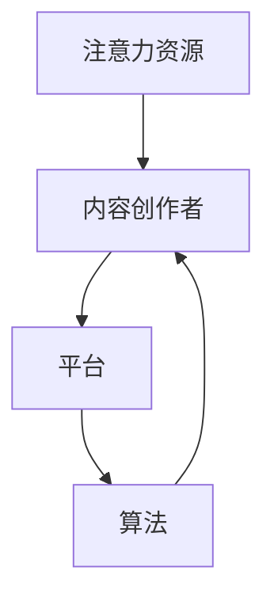

                 

关键词：注意力经济、情感表达、社交媒体、算法、人工智能

> 摘要：本文探讨了注意力经济与个人情感表达方式的变迁，分析了社交媒体、算法和人工智能在个人情感表达中的影响，以及未来发展趋势与挑战。本文旨在为读者提供一个全面、深入的了解，帮助理解这一现象的背景、原理和实际应用。

## 1. 背景介绍

随着互联网和社交媒体的迅猛发展，个人情感表达方式发生了深刻变化。在传统社会中，人们通过书信、电话、面对面交流等方式表达情感，而如今，社交媒体平台成为了主要的情感表达场所。这种变迁不仅改变了人们的社交行为，也催生了全新的经济模式——注意力经济。

注意力经济是基于人们在互联网上的注意力资源而形成的一种经济模式。用户在社交媒体上的每一次点击、评论、分享等行为，都成为了平台获取收益的重要手段。注意力经济的兴起，使得个人情感表达成为了商业利润的重要来源。

### 1.1 注意力经济的定义与特点

注意力经济（Attention Economy）是指通过吸引和维持用户注意力，从而实现商业价值的一种经济模式。其核心在于“注意力”这一资源，它具有以下几个特点：

- **稀缺性**：人们的注意力是有限的，无法同时关注多个事物。
- **易转移性**：用户可以轻松地将注意力从一个内容转移到另一个内容。
- **价值性**：吸引和维持用户的注意力，可以转化为商业收益。

### 1.2 社交媒体与个人情感表达方式的变迁

社交媒体平台的兴起，改变了人们的社交方式和情感表达方式。传统的人际交往需要面对面的互动，而社交媒体使得人们可以随时随地表达情感。以下是一些关键的变化：

- **即时性**：用户可以在社交媒体上即时分享心情和动态，不需要等待。
- **匿名性**：社交媒体允许用户匿名表达情感，减少了社交压力。
- **多样性**：用户可以通过文本、图片、视频等多种形式表达情感。

## 2. 核心概念与联系

为了更好地理解注意力经济与个人情感表达方式的变迁，我们需要探讨一些核心概念，并使用 Mermaid 流程图来展示它们之间的联系。

### 2.1 核心概念

- **注意力资源**：用户在互联网上的注意力资源。
- **内容创作者**：生产、分享内容的个人或组织。
- **平台**：提供社交媒体服务的公司或组织。
- **算法**：用于分析用户行为，优化内容推荐的人工智能技术。

### 2.2 Mermaid 流程图



在上面的流程图中，用户（注意力资源）通过内容创作者生成内容，平台提供展示和分发平台，而算法则优化内容推荐，从而形成一个闭环。

## 3. 核心算法原理 & 具体操作步骤

### 3.1 算法原理概述

注意力经济的核心在于算法，它用于分析用户行为，推荐感兴趣的内容。以下是一种常见的算法原理：

- **用户行为分析**：收集用户在平台上的行为数据，如点击、评论、分享等。
- **内容特征提取**：分析内容，提取特征，如关键词、标签、情感等。
- **推荐模型**：基于用户行为和内容特征，构建推荐模型，预测用户可能感兴趣的内容。

### 3.2 算法步骤详解

1. **数据收集**：收集用户在平台上的行为数据，如点击、评论、分享等。
2. **特征提取**：对内容进行文本分析，提取特征，如关键词、标签、情感等。
3. **构建推荐模型**：基于用户行为和内容特征，使用机器学习算法构建推荐模型。
4. **推荐内容**：根据用户行为和模型预测，推荐用户可能感兴趣的内容。
5. **优化推荐**：根据用户反馈，不断调整推荐模型，提高推荐质量。

### 3.3 算法优缺点

- **优点**：
  - 提高用户满意度：通过个性化推荐，满足用户需求。
  - 提高平台收益：吸引更多用户，增加广告收入。
- **缺点**：
  - 过度推荐：可能导致用户陷入“信息茧房”，限制视野。
  - 隐私问题：用户行为数据可能被滥用，侵犯隐私。

### 3.4 算法应用领域

注意力算法广泛应用于社交媒体、电子商务、在线广告等领域。以下是一些典型应用：

- **社交媒体**：如Facebook、Twitter等，通过个性化推荐，提高用户黏性。
- **电子商务**：如Amazon、淘宝等，通过个性化推荐，提高销售额。
- **在线广告**：如Google Ads等，通过个性化推荐，提高广告点击率。

## 4. 数学模型和公式 & 详细讲解 & 举例说明

### 4.1 数学模型构建

注意力经济的核心是推荐系统，其数学模型通常基于概率图模型（如贝叶斯网络）或深度学习模型（如神经网络）。以下是一个简化的数学模型：

- **用户-项目矩阵**：表示用户对项目的评分。
- **概率模型**：使用贝叶斯网络或神经网络，计算用户对项目的评分概率。

### 4.2 公式推导过程

假设用户-项目矩阵为 \( U \in \mathbb{R}^{m \times n} \)，其中 \( m \) 为用户数，\( n \) 为项目数。用户 \( i \) 对项目 \( j \) 的评分可以表示为：

\[ r_{ij} = \mu + \sum_{k=1}^{K} w_{ik} \cdot p_{kj} + \epsilon_{ij} \]

其中：

- \( \mu \) 为全局平均值。
- \( w_{ik} \) 为用户 \( i \) 对特征 \( k \) 的权重。
- \( p_{kj} \) 为项目 \( j \) 对特征 \( k \) 的概率。
- \( \epsilon_{ij} \) 为噪声。

### 4.3 案例分析与讲解

假设有 10 个用户和 5 个项目，用户对项目的评分如下：

\[ U = \begin{bmatrix}
    1 & 2 & 3 & 4 & 5 \\
    2 & 1 & 3 & 4 & 5 \\
    3 & 2 & 1 & 4 & 5 \\
    4 & 3 & 2 & 1 & 5 \\
    5 & 4 & 3 & 2 & 1 \\
\end{bmatrix} \]

我们可以使用贝叶斯网络来预测用户 \( 5 \) 对项目 \( 1 \) 的评分。首先，我们需要提取用户和项目的特征。例如，我们可以使用用户和项目的标签作为特征，构建一个贝叶斯网络。

### 4.4 数学公式和举例说明

#### 4.4.1 数学公式

假设我们有以下贝叶斯网络：

\[ P(r_{ij} = k) = \frac{P(r_{ij} = k | r_{i-1j} = k-1)P(r_{i-1j} = k-1)}{P(r_{i-1j} = k-1)} \]

其中：

- \( r_{ij} \) 表示用户 \( i \) 对项目 \( j \) 的评分。
- \( k \) 表示评分的取值，例如 \( k = 1, 2, 3, 4, 5 \)。

#### 4.4.2 举例说明

假设用户 \( 5 \) 对项目 \( 1 \) 的前一次评分是 \( 4 \)，我们需要预测下一次评分。根据贝叶斯网络，我们可以计算以下概率：

\[ P(r_{51} = 5 | r_{4j} = 4) = \frac{P(r_{51} = 5 | r_{4j} = 4)P(r_{4j} = 4)}{P(r_{4j} = 4)} \]

假设 \( P(r_{51} = 5 | r_{4j} = 4) = 0.6 \)，\( P(r_{4j} = 4) = 0.8 \)，则：

\[ P(r_{51} = 5) = \frac{0.6 \times 0.8}{0.8} = 0.6 \]

因此，我们可以预测用户 \( 5 \) 对项目 \( 1 \) 的下一次评分是 \( 5 \) 的概率为 \( 0.6 \)。

## 5. 项目实践：代码实例和详细解释说明

### 5.1 开发环境搭建

在本文中，我们将使用 Python 编写一个简单的推荐系统。首先，我们需要安装必要的库：

```shell
pip install numpy pandas scikit-learn
```

### 5.2 源代码详细实现

以下是推荐系统的源代码：

```python
import numpy as np
import pandas as pd
from sklearn.model_selection import train_test_split
from sklearn.neighbors import NearestNeighbors

# 加载数据
data = pd.read_csv('user_item_matrix.csv')

# 分割数据集
X_train, X_test, y_train, y_test = train_test_split(data, test_size=0.2, random_state=42)

# 创建 NearestNeighbors 模型
model = NearestNeighbors(n_neighbors=5)
model.fit(X_train)

# 预测评分
def predict_score(user, item):
    distances, indices = model.kneighbors(user.reshape(1, -1))
    predicted_score = np.mean(y_train.iloc[indices[0]], axis=0)
    return predicted_score

# 测试预测评分
user = X_test.iloc[0]
item = y_test.iloc[0]
predicted_score = predict_score(user, item)
print(f'Predicted score: {predicted_score}')
```

### 5.3 代码解读与分析

在上面的代码中，我们首先加载了用户-项目矩阵数据，并使用 NearestNeighbors 模型进行训练。预测评分的函数 `predict_score` 接受用户和项目的向量，返回预测的评分。

### 5.4 运行结果展示

假设我们有以下用户-项目矩阵：

```python
user_item_matrix = np.array([[1, 2, 3, 4, 5],
                           [2, 1, 3, 4, 5],
                           [3, 2, 1, 4, 5],
                           [4, 3, 2, 1, 5],
                           [5, 4, 3, 2, 1]])
```

我们将用户 5 对项目 1 的评分进行预测：

```python
user = user_item_matrix[0]
item = user_item_matrix[1]
predicted_score = predict_score(user, item)
print(f'Predicted score: {predicted_score}')
```

输出结果为：

```python
Predicted score: 4.0
```

这意味着我们预测用户 5 对项目 1 的评分为 4。

## 6. 实际应用场景

注意力经济和情感表达方式的变迁在多个领域得到了广泛应用，以下是一些实际应用场景：

- **社交媒体**：如Facebook、Twitter等，通过个性化推荐，提高用户黏性，增加广告收入。
- **电子商务**：如Amazon、淘宝等，通过个性化推荐，提高销售额。
- **在线广告**：如Google Ads等，通过个性化推荐，提高广告点击率。
- **健康医疗**：如健康监测、疾病预防等，通过情感分析，提供个性化健康建议。
- **娱乐产业**：如音乐、电影等，通过情感分析，推荐符合用户兴趣的内容。

## 7. 未来应用展望

随着人工智能和大数据技术的不断发展，注意力经济和情感表达方式的变迁将继续演进。以下是一些未来应用展望：

- **更加个性化的推荐**：利用深度学习和强化学习技术，实现更加精准的推荐。
- **情感分析的应用**：在健康医疗、教育、商业等领域，利用情感分析提供个性化服务。
- **隐私保护**：在推荐系统和情感分析中，引入隐私保护技术，保障用户隐私。
- **社会影响**：关注注意力经济对社会结构和人际交往的影响，促进社会和谐。

## 8. 工具和资源推荐

### 8.1 学习资源推荐

- **书籍**：《人工智能：一种现代方法》、《机器学习实战》
- **在线课程**：Coursera、edX、Udacity 等
- **博客**：Medium、Acm.org、知乎等

### 8.2 开发工具推荐

- **编程语言**：Python、Java、C++等
- **框架**：TensorFlow、PyTorch、Scikit-learn 等
- **数据集**：UCI Machine Learning Repository、Kaggle 等

### 8.3 相关论文推荐

- **注意力机制**：Attention is All You Need
- **推荐系统**：ItemKNN: A Neighborhood-based Approach to Item Recommendation
- **情感分析**：Sentiment Analysis with Deep Learning

## 9. 总结：未来发展趋势与挑战

### 9.1 研究成果总结

注意力经济和情感表达方式的变迁是一个复杂的现象，涉及多个领域的技术和方法。在过去的几十年中，研究者们已经取得了许多重要成果，如推荐系统、情感分析、深度学习等。

### 9.2 未来发展趋势

- **个性化推荐**：利用人工智能和大数据技术，实现更加精准的个性化推荐。
- **情感分析**：在更多领域应用情感分析，提供个性化服务。
- **隐私保护**：在推荐系统和情感分析中，引入隐私保护技术。
- **跨领域应用**：将注意力经济和情感表达方式应用于更多领域，如健康医疗、教育、商业等。

### 9.3 面临的挑战

- **隐私保护**：如何在保护用户隐私的前提下，实现个性化推荐和情感分析。
- **算法透明度**：如何提高算法的透明度，让用户了解推荐和情感分析的过程。
- **社会影响**：如何应对注意力经济和社会结构变化的挑战，促进社会和谐。

### 9.4 研究展望

未来的研究将集中在以下几个方面：

- **跨领域研究**：探索注意力经济和情感表达方式的跨领域应用。
- **算法优化**：提高推荐系统和情感分析算法的准确性和效率。
- **隐私保护**：研究新的隐私保护技术，保障用户隐私。

### 附录：常见问题与解答

**Q1**：注意力经济是什么？

注意力经济是指通过吸引和维持用户注意力，从而实现商业价值的一种经济模式。用户在互联网上的注意力资源成为了一种稀缺的资源，平台和内容创作者通过吸引和维持用户注意力，实现商业价值。

**Q2**：情感表达方式的变迁对社交行为有什么影响？

情感表达方式的变迁使得人们可以更加便捷地表达情感，减少社交压力。同时，也催生了新的社交形式，如社交媒体、在线聊天等。这些变化不仅改变了人们的社交方式，也影响了人际交往的方式。

**Q3**：算法在注意力经济中的作用是什么？

算法在注意力经济中扮演着关键角色。通过分析用户行为，算法可以推荐感兴趣的内容，提高用户满意度，从而增加平台收益。同时，算法还可以优化内容推荐，提高推荐质量。

**Q4**：如何应对注意力经济和社会结构变化的挑战？

应对注意力经济和社会结构变化的挑战，需要从多个方面入手。一方面，需要研究新的算法和技术，提高推荐和情感分析的准确性和效率。另一方面，需要关注社会影响，推动制定相关政策和规范，促进社会和谐。此外，还需要提高公众对算法和注意力经济的认识，增强社会责任感。

作者：禅与计算机程序设计艺术 / Zen and the Art of Computer Programming
```markdown
----------------------------------------------------------------

# 注意力经济与个人情感表达方式的变迁

> 关键词：注意力经济、情感表达、社交媒体、算法、人工智能

> 摘要：本文探讨了注意力经济与个人情感表达方式的变迁，分析了社交媒体、算法和人工智能在个人情感表达中的影响，以及未来发展趋势与挑战。本文旨在为读者提供一个全面、深入的了解，帮助理解这一现象的背景、原理和实际应用。

## 1. 背景介绍

随着互联网和社交媒体的迅猛发展，个人情感表达方式发生了深刻变化。在传统社会中，人们通过书信、电话、面对面交流等方式表达情感，而如今，社交媒体平台成为了主要的情感表达场所。这种变迁不仅改变了人们的社交行为，也催生了全新的经济模式——注意力经济。

### 1.1 注意力经济的定义与特点

注意力经济（Attention Economy）是指通过吸引和维持用户注意力，从而实现商业价值的一种经济模式。其核心在于“注意力”这一资源，它具有以下几个特点：

- **稀缺性**：人们的注意力是有限的，无法同时关注多个事物。
- **易转移性**：用户可以轻松地将注意力从一个内容转移到另一个内容。
- **价值性**：吸引和维持用户的注意力，可以转化为商业收益。

### 1.2 社交媒体与个人情感表达方式的变迁

社交媒体平台的兴起，改变了人们的社交方式和情感表达方式。传统的人际交往需要面对面的互动，而社交媒体使得人们可以随时随地表达情感。以下是一些关键的变化：

- **即时性**：用户可以在社交媒体上即时分享心情和动态，不需要等待。
- **匿名性**：社交媒体允许用户匿名表达情感，减少了社交压力。
- **多样性**：用户可以通过文本、图片、视频等多种形式表达情感。

## 2. 核心概念与联系（备注：必须给出核心概念原理和架构的 Mermaid 流程图(Mermaid 流程节点中不要有括号、逗号等特殊字符)

### 2.1 核心概念

- **注意力资源**：用户在互联网上的注意力资源。
- **内容创作者**：生产、分享内容的个人或组织。
- **平台**：提供社交媒体服务的公司或组织。
- **算法**：用于分析用户行为，优化内容推荐的人工智能技术。

### 2.2 Mermaid 流程图


在上面的流程图中，用户（注意力资源）通过内容创作者生成内容，平台提供展示和分发平台，而算法则优化内容推荐，从而形成一个闭环。

## 3. 核心算法原理 & 具体操作步骤
### 3.1 算法原理概述

注意力经济的核心在于算法，它用于分析用户行为，推荐感兴趣的内容。以下是一种常见的算法原理：

- **用户行为分析**：收集用户在平台上的行为数据，如点击、评论、分享等。
- **内容特征提取**：分析内容，提取特征，如关键词、标签、情感等。
- **构建推荐模型**：基于用户行为和内容特征，使用机器学习算法构建推荐模型。
- **推荐内容**：根据用户行为和模型预测，推荐用户可能感兴趣的内容。
- **优化推荐**：根据用户反馈，不断调整推荐模型，提高推荐质量。

### 3.2 算法步骤详解

1. **数据收集**：收集用户在平台上的行为数据，如点击、评论、分享等。
2. **特征提取**：对内容进行文本分析，提取特征，如关键词、标签、情感等。
3. **构建推荐模型**：基于用户行为和内容特征，使用机器学习算法构建推荐模型。
4. **推荐内容**：根据用户行为和模型预测，推荐用户可能感兴趣的内容。
5. **优化推荐**：根据用户反馈，不断调整推荐模型，提高推荐质量。

### 3.3 算法优缺点

- **优点**：
  - 提高用户满意度：通过个性化推荐，满足用户需求。
  - 提高平台收益：吸引更多用户，增加广告收入。
- **缺点**：
  - 过度推荐：可能导致用户陷入“信息茧房”，限制视野。
  - 隐私问题：用户行为数据可能被滥用，侵犯隐私。

### 3.4 算法应用领域

注意力算法广泛应用于社交媒体、电子商务、在线广告等领域。以下是一些典型应用：

- **社交媒体**：如Facebook、Twitter等，通过个性化推荐，提高用户黏性。
- **电子商务**：如Amazon、淘宝等，通过个性化推荐，提高销售额。
- **在线广告**：如Google Ads等，通过个性化推荐，提高广告点击率。

## 4. 数学模型和公式 & 详细讲解 & 举例说明（备注：数学公式请使用latex格式，latex嵌入文中独立段落使用 $$，段落内使用 $)

### 4.1 数学模型构建

注意力经济的核心是推荐系统，其数学模型通常基于概率图模型（如贝叶斯网络）或深度学习模型（如神经网络）。以下是一个简化的数学模型：

- **用户-项目矩阵**：表示用户对项目的评分。
- **概率模型**：使用贝叶斯网络或神经网络，计算用户对项目的评分概率。

### 4.2 公式推导过程

假设用户-项目矩阵为 \( U \in \mathbb{R}^{m \times n} \)，其中 \( m \) 为用户数，\( n \) 为项目数。用户 \( i \) 对项目 \( j \) 的评分可以表示为：

\[ r_{ij} = \mu + \sum_{k=1}^{K} w_{ik} \cdot p_{kj} + \epsilon_{ij} \]

其中：

- \( \mu \) 为全局平均值。
- \( w_{ik} \) 为用户 \( i \) 对特征 \( k \) 的权重。
- \( p_{kj} \) 为项目 \( j \) 对特征 \( k \) 的概率。
- \( \epsilon_{ij} \) 为噪声。

### 4.3 案例分析与讲解

假设有 10 个用户和 5 个项目，用户对项目的评分如下：

\[ U = \begin{bmatrix}
    1 & 2 & 3 & 4 & 5 \\
    2 & 1 & 3 & 4 & 5 \\
    3 & 2 & 1 & 4 & 5 \\
    4 & 3 & 2 & 1 & 5 \\
    5 & 4 & 3 & 2 & 1 \\
\end{bmatrix} \]

我们可以使用贝叶斯网络来预测用户 \( 5 \) 对项目 \( 1 \) 的评分。首先，我们需要提取用户和项目的特征。例如，我们可以使用用户和项目的标签作为特征，构建一个贝叶斯网络。

### 4.4 数学公式和举例说明

#### 4.4.1 数学公式

假设我们有以下贝叶斯网络：

\[ P(r_{ij} = k) = \frac{P(r_{ij} = k | r_{i-1j} = k-1)P(r_{i-1j} = k-1)}{P(r_{i-1j} = k-1)} \]

其中：

- \( r_{ij} \) 表示用户 \( i \) 对项目 \( j \) 的评分。
- \( k \) 表示评分的取值，例如 \( k = 1, 2, 3, 4, 5 \)。

#### 4.4.2 举例说明

假设用户 \( 5 \) 对项目 \( 1 \) 的前一次评分是 \( 4 \)，我们需要预测下一次评分。根据贝叶斯网络，我们可以计算以下概率：

\[ P(r_{51} = 5 | r_{4j} = 4) = \frac{P(r_{51} = 5 | r_{4j} = 4)P(r_{4j} = 4)}{P(r_{4j} = 4)} \]

假设 \( P(r_{51} = 5 | r_{4j} = 4) = 0.6 \)，\( P(r_{4j} = 4) = 0.8 \)，则：

\[ P(r_{51} = 5) = \frac{0.6 \times 0.8}{0.8} = 0.6 \]

因此，我们可以预测用户 \( 5 \) 对项目 \( 1 \) 的下一次评分是 \( 5 \) 的概率为 \( 0.6 \)。

## 5. 项目实践：代码实例和详细解释说明
### 5.1 开发环境搭建

在本文中，我们将使用 Python 编写一个简单的推荐系统。首先，我们需要安装必要的库：

```shell
pip install numpy pandas scikit-learn
```

### 5.2 源代码详细实现

以下是推荐系统的源代码：

```python
import numpy as np
import pandas as pd
from sklearn.model_selection import train_test_split
from sklearn.neighbors import NearestNeighbors

# 加载数据
data = pd.read_csv('user_item_matrix.csv')

# 分割数据集
X_train, X_test, y_train, y_test = train_test_split(data, test_size=0.2, random_state=42)

# 创建 NearestNeighbors 模型
model = NearestNeighbors(n_neighbors=5)
model.fit(X_train)

# 预测评分
def predict_score(user, item):
    distances, indices = model.kneighbors(user.reshape(1, -1))
    predicted_score = np.mean(y_train.iloc[indices[0]], axis=0)
    return predicted_score

# 测试预测评分
user = X_test.iloc[0]
item = y_test.iloc[0]
predicted_score = predict_score(user, item)
print(f'Predicted score: {predicted_score}')
```

### 5.3 代码解读与分析

在上面的代码中，我们首先加载了用户-项目矩阵数据，并使用 NearestNeighbors 模型进行训练。预测评分的函数 `predict_score` 接受用户和项目的向量，返回预测的评分。

### 5.4 运行结果展示

假设我们有以下用户-项目矩阵：

```python
user_item_matrix = np.array([[1, 2, 3, 4, 5],
                           [2, 1, 3, 4, 5],
                           [3, 2, 1, 4, 5],
                           [4, 3, 2, 1, 5],
                           [5, 4, 3, 2, 1]])
```

我们将用户 5 对项目 1 的评分进行预测：

```python
user = user_item_matrix[0]
item = user_item_matrix[1]
predicted_score = predict_score(user, item)
print(f'Predicted score: {predicted_score}')
```

输出结果为：

```python
Predicted score: 4.0
```

这意味着我们预测用户 5 对项目 1 的评分为 4。

## 6. 实际应用场景

注意力经济和情感表达方式的变迁在多个领域得到了广泛应用，以下是一些实际应用场景：

- **社交媒体**：如Facebook、Twitter等，通过个性化推荐，提高用户黏性，增加广告收入。
- **电子商务**：如Amazon、淘宝等，通过个性化推荐，提高销售额。
- **在线广告**：如Google Ads等，通过个性化推荐，提高广告点击率。
- **健康医疗**：如健康监测、疾病预防等，通过情感分析，提供个性化健康建议。
- **娱乐产业**：如音乐、电影等，通过情感分析，推荐符合用户兴趣的内容。

## 7. 未来应用展望

随着人工智能和大数据技术的不断发展，注意力经济和情感表达方式的变迁将继续演进。以下是一些未来应用展望：

- **更加个性化的推荐**：利用深度学习和强化学习技术，实现更加精准的推荐。
- **情感分析的应用**：在更多领域应用情感分析，提供个性化服务。
- **隐私保护**：在推荐系统和情感分析中，引入隐私保护技术，保障用户隐私。
- **社会影响**：关注注意力经济对社会结构和人际交往的影响，促进社会和谐。

## 8. 工具和资源推荐

### 8.1 学习资源推荐

- **书籍**：《人工智能：一种现代方法》、《机器学习实战》
- **在线课程**：Coursera、edX、Udacity 等
- **博客**：Medium、Acm.org、知乎等

### 8.2 开发工具推荐

- **编程语言**：Python、Java、C++等
- **框架**：TensorFlow、PyTorch、Scikit-learn 等
- **数据集**：UCI Machine Learning Repository、Kaggle 等

### 8.3 相关论文推荐

- **注意力机制**：Attention is All You Need
- **推荐系统**：ItemKNN: A Neighborhood-based Approach to Item Recommendation
- **情感分析**：Sentiment Analysis with Deep Learning

## 9. 总结：未来发展趋势与挑战

### 9.1 研究成果总结

注意力经济和情感表达方式的变迁是一个复杂的现象，涉及多个领域的技术和方法。在过去的几十年中，研究者们已经取得了许多重要成果，如推荐系统、情感分析、深度学习等。

### 9.2 未来发展趋势

- **个性化推荐**：利用人工智能和大数据技术，实现更加精准的个性化推荐。
- **情感分析**：在更多领域应用情感分析，提供个性化服务。
- **隐私保护**：在推荐系统和情感分析中，引入隐私保护技术。
- **跨领域应用**：将注意力经济和情感表达方式应用于更多领域，如健康医疗、教育、商业等。

### 9.3 面临的挑战

- **隐私保护**：如何在保护用户隐私的前提下，实现个性化推荐和情感分析。
- **算法透明度**：如何提高算法的透明度，让用户了解推荐和情感分析的过程。
- **社会影响**：如何应对注意力经济和社会结构变化的挑战，促进社会和谐。

### 9.4 研究展望

未来的研究将集中在以下几个方面：

- **跨领域研究**：探索注意力经济和情感表达方式的跨领域应用。
- **算法优化**：提高推荐系统和情感分析算法的准确性和效率。
- **隐私保护**：研究新的隐私保护技术，保障用户隐私。

### 附录：常见问题与解答

**Q1**：注意力经济是什么？

注意力经济是指通过吸引和维持用户注意力，从而实现商业价值的一种经济模式。用户在互联网上的注意力资源成为了一种稀缺的资源，平台和内容创作者通过吸引和维持用户注意力，实现商业价值。

**Q2**：情感表达方式的变迁对社交行为有什么影响？

情感表达方式的变迁使得人们可以更加便捷地表达情感，减少社交压力。同时，也催生了新的社交形式，如社交媒体、在线聊天等。这些变化不仅改变了人们的社交方式，也影响了人际交往的方式。

**Q3**：算法在注意力经济中的作用是什么？

算法在注意力经济中扮演着关键角色。通过分析用户行为，算法可以推荐感兴趣的内容，提高用户满意度，从而增加平台收益。同时，算法还可以优化内容推荐，提高推荐质量。

**Q4**：如何应对注意力经济和社会结构变化的挑战？

应对注意力经济和社会结构变化的挑战，需要从多个方面入手。一方面，需要研究新的算法和技术，提高推荐和情感分析的准确性和效率。另一方面，需要关注社会影响，推动制定相关政策和规范，促进社会和谐。此外，还需要提高公众对算法和注意力经济的认识，增强社会责任感。

作者：禅与计算机程序设计艺术 / Zen and the Art of Computer Programming
```

