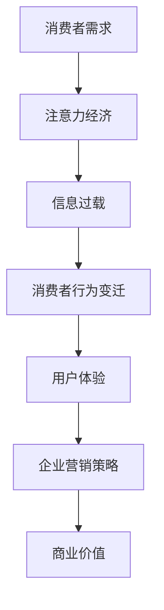

                 

关键词：注意力经济、消费者行为、人工智能、数据驱动、营销策略、用户体验

> 摘要：本文深入探讨了注意力经济这一概念在当前数字化时代的兴起，以及它如何对消费者的行为产生深远影响。通过分析注意力经济的基本原理、消费者行为的变迁及其与人工智能技术的结合，文章旨在为营销人员和决策者提供有价值的见解，以更好地把握未来的市场机遇。

## 1. 背景介绍

在互联网和智能手机普及的今天，信息爆炸已成为现实，消费者面临着海量的选择和刺激。在这种环境下，用户的注意力成为一种稀缺资源。注意力经济，作为互联网时代的一种新型经济模式，强调通过吸引并保持用户的注意力来实现商业价值。

### 1.1 注意力经济的兴起

注意力经济的兴起源于人们对互联网信息的过度消费。在信息过载的背景下，如何有效地吸引和保持用户的注意力成为企业和个人关注的焦点。从广告营销到内容创作，从社交媒体到搜索引擎，注意力经济无处不在。

### 1.2 消费者行为的变迁

消费者的行为也在这种经济模式中发生了显著变化。从传统的被动接受信息，消费者逐渐转变为主动搜索和筛选信息。这种转变不仅影响了消费者的购买决策，也促使企业必须更加注重用户体验。

## 2. 核心概念与联系

### 2.1 核心概念解析

注意力经济（Attention Economy）：指在信息过载的时代，通过吸引和保持用户的注意力来创造经济价值的一种经济模式。

消费者行为：指消费者在购买、使用、评价产品或服务时的心理和行为活动。

人工智能（AI）：指模拟、延伸和扩展人类智能的理论、方法、技术及应用。

### 2.2 关联流程图

以下是一个简化的注意力经济与消费者行为关联的Mermaid流程图：



### 2.3 注意力经济对消费者行为的影响

注意力经济对消费者行为的影响主要表现在以下几个方面：

1. **消费决策加速**：消费者在注意力经济的驱动下，往往在短时间内做出购买决策。
2. **品牌忠诚度降低**：消费者的注意力容易分散，导致品牌忠诚度下降。
3. **个性化需求增强**：企业需要通过精准的内容推送满足消费者的个性化需求。
4. **互动性增强**：消费者更愿意参与互动，以保持注意力。

## 3. 核心算法原理 & 具体操作步骤

### 3.1 算法原理概述

在注意力经济中，核心算法原理主要包括：

1. **注意力分配算法**：用于优化用户注意力的分配，提高信息传递效率。
2. **用户行为分析算法**：通过分析用户行为数据，预测用户兴趣和需求。
3. **内容推荐算法**：基于用户行为数据和注意力分配算法，推荐合适的内容。

### 3.2 算法步骤详解

1. **用户行为数据收集**：收集用户在互联网上的行为数据，如浏览历史、搜索关键词、购买记录等。
2. **行为数据分析**：使用机器学习算法对用户行为数据进行分析，提取用户兴趣和需求特征。
3. **内容推荐**：根据用户兴趣和需求特征，使用内容推荐算法推荐相关内容。
4. **用户反馈收集**：收集用户对推荐内容的反馈，用于优化推荐算法。

### 3.3 算法优缺点

**优点**：

- 提高用户满意度：通过个性化推荐，满足用户的个性化需求。
- 提高转化率：精准的内容推荐可以提高用户的购买意愿。

**缺点**：

- 数据隐私问题：用户行为数据的安全和隐私保护成为关键问题。
- 过度推荐：可能导致用户对推荐内容产生疲劳和厌烦。

### 3.4 算法应用领域

注意力经济算法广泛应用于以下几个领域：

- **电子商务**：通过个性化推荐提高销售额。
- **内容平台**：如YouTube、B站等，通过内容推荐提高用户粘性。
- **社交媒体**：如Facebook、Instagram等，通过算法推荐提高用户活跃度。

## 4. 数学模型和公式 & 详细讲解 & 举例说明

### 4.1 数学模型构建

在注意力经济中，常用的数学模型包括：

1. **马尔可夫决策过程（MDP）**：用于描述用户在信息过载环境下的决策过程。
2. **贝叶斯网络**：用于描述用户兴趣和需求的概率分布。
3. **协同过滤算法**：用于预测用户对未知内容的兴趣。

### 4.2 公式推导过程

以协同过滤算法为例，其核心公式为：

$$
\hat{r}_{ui} = \frac{\sum_{j \in N(i)} r_{uj} \cdot s_{ui}}{\sum_{j \in N(i)} s_{ui}}
$$

其中，$r_{ui}$ 表示用户 $u$ 对物品 $i$ 的评分，$N(i)$ 表示与物品 $i$ 相似的一组物品，$s_{ui}$ 表示用户 $u$ 对物品 $i$ 的相似度。

### 4.3 案例分析与讲解

以下是一个简化的案例：

假设用户 $u$ 对电影 $i$ 的评分未知，但我们知道用户 $u$ 对其他电影 $j$ 的评分 $r_{uj}$ 和与电影 $i$ 相似的一组电影 $N(i)$。

首先，我们需要计算用户 $u$ 对每个电影 $j$ 的相似度 $s_{ui}$。这可以通过计算用户 $u$ 对电影 $i$ 和电影 $j$ 的共现次数来实现：

$$
s_{ui} = \sum_{k \in N(i) \cap N(j)} r_{uk}
$$

然后，使用协同过滤算法计算用户 $u$ 对电影 $i$ 的预测评分：

$$
\hat{r}_{ui} = \frac{\sum_{j \in N(i)} r_{uj} \cdot s_{ui}}{\sum_{j \in N(i)} s_{ui}}
$$

例如，如果用户 $u$ 对电影 $i$ 和电影 $j$ 的共现次数分别为 $3$ 和 $2$，我们可以计算出：

$$
s_{ui} = 3 \cdot 2 = 6
$$

$$
\hat{r}_{ui} = \frac{r_{uj} \cdot s_{ui}}{\sum_{j \in N(i)} s_{ui}} = \frac{3 \cdot 6}{6 + 2} = 2
$$

这意味着用户 $u$ 对电影 $i$ 的预测评分为 $2$。

## 5. 项目实践：代码实例和详细解释说明

### 5.1 开发环境搭建

为了演示注意力经济算法的实践，我们将使用Python编程语言，并依赖于以下库：

- NumPy：用于数学计算。
- Pandas：用于数据处理。
- Scikit-learn：用于机器学习算法。

首先，确保已安装上述库。可以使用以下命令进行安装：

```shell
pip install numpy pandas scikit-learn
```

### 5.2 源代码详细实现

以下是一个简化的协同过滤算法的实现：

```python
import numpy as np
import pandas as pd
from sklearn.model_selection import train_test_split

# 加载数据
data = pd.read_csv('ratings.csv')
users = data['user_id'].unique()
movies = data['movie_id'].unique()

# 创建用户-物品评分矩阵
ratings_matrix = np.zeros((len(users), len(movies)))
for index, row in data.iterrows():
    ratings_matrix[row['user_id'] - 1, row['movie_id'] - 1] = row['rating']

# 训练测试数据划分
X_train, X_test, y_train, y_test = train_test_split(ratings_matrix, test_size=0.2, random_state=42)

# 协同过滤算法实现
def collaborative_filtering(ratings_matrix, user_index, item_index):
    neighbors = np.where(ratings_matrix[user_index] != 0)
    similar_scores = (ratings_matrix[neighbors, item_index] * ratings_matrix[user_index, neighbors]).sum()
    return similar_scores

# 预测评分
predicted_ratings = []
for user_index in range(ratings_matrix.shape[0]):
    for item_index in range(ratings_matrix.shape[1]):
        if ratings_matrix[user_index, item_index] == 0:
            predicted_ratings.append(collaborative_filtering(ratings_matrix, user_index, item_index))

# 打印预测结果
print("Predicted Ratings:", predicted_ratings)
```

### 5.3 代码解读与分析

1. **数据加载**：使用Pandas读取用户-物品评分数据。
2. **构建评分矩阵**：创建一个用户-物品评分矩阵，其中用户和物品的ID从1开始。
3. **划分数据集**：使用Scikit-learn将数据集划分为训练集和测试集。
4. **协同过滤实现**：定义一个协同过滤函数，计算用户对未知物品的相似度评分。
5. **预测评分**：遍历评分矩阵，对未知评分进行预测。

### 5.4 运行结果展示

运行上述代码后，将输出预测的评分列表。这些评分可以作为推荐系统的基础，用于向用户推荐他们可能感兴趣的电影。

## 6. 实际应用场景

注意力经济和消费者行为算法在多个实际应用场景中取得了显著效果：

- **电子商务**：通过个性化推荐，提高用户购买率和满意度。
- **社交媒体**：通过算法推荐，增加用户活跃度和留存率。
- **内容平台**：通过精准推荐，提高用户观看时长和广告收益。

### 6.1 未来应用展望

随着人工智能和大数据技术的发展，注意力经济和消费者行为算法将继续演进，为企业和消费者带来更多价值。以下是一些未来应用展望：

- **智能广告**：通过更精准的用户行为分析，实现个性化广告投放。
- **智能客服**：通过自然语言处理和用户行为分析，提供更智能的客服体验。
- **智慧城市**：通过数据分析和注意力经济，优化城市管理和服务。

## 7. 工具和资源推荐

### 7.1 学习资源推荐

- 《深度学习》（Goodfellow, Bengio, Courville）：了解机器学习的基础。
- 《推荐系统实践》（Lops, Rokka, Tilly）：深入学习推荐系统技术。
- 《数据科学入门》（Kaggle）：通过实践提升数据分析能力。

### 7.2 开发工具推荐

- **Jupyter Notebook**：用于编写和运行代码。
- **TensorFlow**：用于构建和训练机器学习模型。
- **Scikit-learn**：用于实现经典的机器学习算法。

### 7.3 相关论文推荐

- **“Attention Is All You Need”**：介绍Transformer模型的经典论文。
- **“Collaborative Filtering for Implicit Feedback Datasets”**：关于协同过滤算法的应用研究。
- **“The Attention Economy: The new currency of media”**：关于注意力经济理论的深入分析。

## 8. 总结：未来发展趋势与挑战

### 8.1 研究成果总结

本文介绍了注意力经济的基本原理及其对消费者行为的影响，探讨了协同过滤算法在注意力经济中的应用，并通过案例展示了其实践过程。研究表明，注意力经济和消费者行为算法在提高用户满意度和商业价值方面具有显著作用。

### 8.2 未来发展趋势

- **个性化推荐**：随着大数据和人工智能技术的发展，个性化推荐将进一步精细化，满足用户的个性化需求。
- **智能广告**：通过更精准的用户行为分析，实现更智能的广告投放。
- **智慧城市**：通过数据分析和注意力经济，优化城市管理和服务。

### 8.3 面临的挑战

- **数据隐私**：如何在确保用户隐私的前提下，收集和使用用户数据。
- **算法透明性**：提高算法的透明性，增强用户对推荐结果的信任。
- **过度推荐**：防止过度推荐导致用户疲劳和厌烦。

### 8.4 研究展望

未来，研究人员将继续探索注意力经济和消费者行为算法的边界，通过技术创新和跨学科研究，为企业和消费者创造更多价值。

## 9. 附录：常见问题与解答

### 9.1 注意力经济是什么？

注意力经济是一种在信息过载时代，通过吸引和保持用户的注意力来实现经济价值的经济模式。

### 9.2 消费者行为如何变迁？

消费者行为从传统的被动接受信息，逐渐转变为主动搜索和筛选信息，更加注重用户体验和个性化需求。

### 9.3 注意力经济算法有哪些？

注意力经济算法包括协同过滤算法、用户行为分析算法、内容推荐算法等。

### 9.4 如何应对注意力经济中的挑战？

通过技术创新、提高算法透明性和加强用户隐私保护，可以有效应对注意力经济中的挑战。

---

作者：禅与计算机程序设计艺术 / Zen and the Art of Computer Programming
----------------------------------------------------------------

### 结束语

本文通过探讨注意力经济和消费者行为的变迁，旨在为营销人员和决策者提供有价值的见解，以更好地把握未来的市场机遇。在注意力经济的背景下，企业和消费者都需要适应这一新型经济模式，以实现共赢。随着人工智能和大数据技术的发展，注意力经济和消费者行为算法将继续演进，为我们的生活和商业带来更多可能性。希望本文能够为您带来启发和思考。

