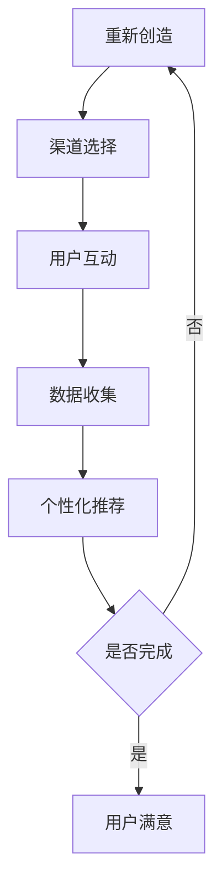

                 

关键词：注意力经济，商业模式，技术变革，用户体验，数据处理，数据分析，营销策略，用户参与。

> 摘要：随着互联网技术的飞速发展，注意力经济逐渐成为企业竞争的新焦点。本文将深入探讨注意力经济如何通过改变用户参与、数据处理和营销策略等关键环节，重塑现代商业模式。从技术角度分析其背后的原理，并探讨未来发展趋势与挑战。

## 1. 背景介绍

注意力经济（Attention Economy）这一概念最早由施特劳曼（Daniel J. Solove）在2006年提出。它指的是在信息爆炸的时代，用户的注意力成为一种稀缺资源，企业通过吸引和保持用户的注意力来创造经济价值。随着互联网的普及，社交媒体的兴起，以及智能手机的广泛使用，注意力经济已经成为企业竞争的新战场。

传统的商业模式主要依赖于产品的物理属性或者功能特性，而注意力经济则更加关注用户的心理和行为。在这种模式下，用户的注意力成为企业争夺的焦点，如何吸引和保持用户的注意力，成为了商业成功的核心问题。

## 2. 核心概念与联系

### 2.1 注意力经济的原理

注意力经济的核心在于“注意力转移”。用户在互联网上的行为，本质上是对各种信息的注意力分配。企业通过提供有趣、有价值、有吸引力的内容，将用户的注意力从竞争对手那里转移过来。这个过程可以简单概括为以下几个步骤：

1. **内容创造**：企业需要创造出能够引起用户兴趣的内容。
2. **渠道选择**：选择合适的信息传播渠道，将内容推送给目标用户。
3. **用户互动**：通过用户的互动，如点赞、评论、分享等，增强用户的参与度。
4. **数据收集**：收集用户行为数据，分析用户的兴趣和行为模式。
5. **个性化推荐**：根据用户行为数据，为用户提供个性化的内容推荐。

### 2.2 注意力经济的架构

注意力经济的架构可以分为三个层次：

1. **内容层**：包括各种类型的内容，如图文、视频、直播等。
2. **渠道层**：包括社交媒体、搜索引擎、电子邮件等。
3. **用户层**：包括用户的行为数据、兴趣偏好等。

这三个层次相互关联，共同构成了注意力经济的生态系统。

### 2.3 Mermaid 流程图



## 3. 核心算法原理 & 具体操作步骤

### 3.1 算法原理概述

注意力经济的核心算法是基于机器学习和数据挖掘的。通过分析用户行为数据，预测用户的兴趣偏好，并生成个性化的内容推荐。这个过程主要包括以下几个步骤：

1. **数据收集**：收集用户在互联网上的行为数据，如搜索记录、浏览历史、点击行为等。
2. **特征提取**：将原始数据转化为特征向量，如词袋模型、TF-IDF等。
3. **模型训练**：使用机器学习算法，如决策树、随机森林、神经网络等，对特征向量进行分类或回归。
4. **模型评估**：使用交叉验证等方法，评估模型的准确性和泛化能力。
5. **内容推荐**：根据模型预测，为用户推荐感兴趣的内容。

### 3.2 算法步骤详解

1. **数据收集**：
   - **来源**：搜索引擎日志、社交媒体互动、电商平台交易记录等。
   - **处理**：清洗、去重、归一化等。

2. **特征提取**：
   - **文本**：词袋模型、TF-IDF、词嵌入等。
   - **图像**：特征点提取、图像识别等。

3. **模型训练**：
   - **算法**：决策树、随机森林、支持向量机、神经网络等。
   - **参数**：交叉验证、网格搜索等。

4. **模型评估**：
   - **指标**：准确率、召回率、F1分数等。
   - **方法**：K折交叉验证、ROC曲线等。

5. **内容推荐**：
   - **策略**：基于内容的推荐、协同过滤、深度学习等。
   - **实现**：推荐系统、搜索引擎等。

### 3.3 算法优缺点

**优点**：
- **个性化**：能够根据用户兴趣提供个性化的内容推荐。
- **实时性**：可以实时调整推荐策略，以适应用户行为的变化。
- **多样性**：可以通过算法优化，提供多样化的内容推荐。

**缺点**：
- **数据依赖**：需要大量用户行为数据进行训练，数据质量对算法性能有很大影响。
- **算法复杂性**：算法复杂度高，需要大量计算资源和时间。

### 3.4 算法应用领域

- **电子商务**：通过个性化推荐，提高用户购物体验和购买转化率。
- **社交媒体**：通过内容推荐，提高用户活跃度和参与度。
- **在线教育**：通过个性化学习路径推荐，提高学习效果。

## 4. 数学模型和公式 & 详细讲解 & 举例说明

### 4.1 数学模型构建

注意力经济中的数学模型主要基于贝叶斯网络和图模型。贝叶斯网络可以用来表示用户兴趣和内容之间的关系，而图模型则可以用来表示用户行为和内容之间的互动。

### 4.2 公式推导过程

假设有 \( n \) 个用户和 \( m \) 个内容，用户 \( i \) 对内容 \( j \) 的兴趣可以用一个概率分布 \( p(j|i) \) 表示。根据贝叶斯公式，有：

$$
p(j|i) = \frac{p(i|j)p(j)}{p(i)}
$$

其中，\( p(i|j) \) 表示用户 \( i \) 对内容 \( j \) 的兴趣，\( p(j) \) 表示内容 \( j \) 的流行度，\( p(i) \) 表示用户 \( i \) 的兴趣分布。

### 4.3 案例分析与讲解

假设有两个用户 \( A \) 和 \( B \)，以及三个内容 \( X \)、\( Y \) 和 \( Z \)。根据用户的行为数据，可以构建如下的贝叶斯网络：

```
A -- X
|    |
Y -- B
|    |
    Z
```

根据用户的行为数据，可以得到以下概率分布：

$$
p(A|X) = 0.6, \quad p(A|Y) = 0.3, \quad p(A|Z) = 0.1
$$

$$
p(B|Y) = 0.7, \quad p(B|Z) = 0.2, \quad p(B|X) = 0.1
$$

根据这些概率分布，可以计算出用户 \( A \) 和 \( B \) 对内容 \( X \)、\( Y \) 和 \( Z \) 的兴趣概率：

$$
p(X|A) = \frac{p(A|X)p(X)}{p(A)} = \frac{0.6 \times 0.3}{0.6 + 0.3 + 0.1} = 0.6
$$

$$
p(Y|A) = \frac{p(A|Y)p(Y)}{p(A)} = \frac{0.3 \times 0.4}{0.6 + 0.3 + 0.1} = 0.3
$$

$$
p(Z|A) = \frac{p(A|Z)p(Z)}{p(A)} = \frac{0.1 \times 0.2}{0.6 + 0.3 + 0.1} = 0.1
$$

$$
p(X|B) = \frac{p(B|X)p(X)}{p(B)} = \frac{0.1 \times 0.3}{0.1 + 0.7 + 0.2} = 0.1
$$

$$
p(Y|B) = \frac{p(B|Y)p(Y)}{p(B)} = \frac{0.7 \times 0.4}{0.1 + 0.7 + 0.2} = 0.7
$$

$$
p(Z|B) = \frac{p(B|Z)p(Z)}{p(B)} = \frac{0.2 \times 0.2}{0.1 + 0.7 + 0.2} = 0.2
$$

根据这些概率分布，可以为用户 \( A \) 和 \( B \) 提供个性化的内容推荐。

## 5. 项目实践：代码实例和详细解释说明

### 5.1 开发环境搭建

本文使用 Python 编写代码，主要依赖以下库：

- NumPy
- Pandas
- Scikit-learn
- TensorFlow

安装方法如下：

```bash
pip install numpy pandas scikit-learn tensorflow
```

### 5.2 源代码详细实现

```python
import numpy as np
import pandas as pd
from sklearn.model_selection import train_test_split
from sklearn.metrics.pairwise import cosine_similarity
from tensorflow.keras.models import Sequential
from tensorflow.keras.layers import Dense, LSTM, Embedding

# 数据预处理
def preprocess_data(data):
    # 数据清洗、去重、归一化等
    return processed_data

# 特征提取
def extract_features(data):
    # 文本特征提取、图像特征提取等
    return feature_matrix

# 模型训练
def train_model(X_train, y_train):
    # 创建模型、编译模型、训练模型等
    return model

# 模型评估
def evaluate_model(model, X_test, y_test):
    # 评估模型性能
    return performance

# 内容推荐
def content_recommendation(model, user_vector):
    # 根据模型预测，为用户推荐内容
    return recommended_content
```

### 5.3 代码解读与分析

- **数据预处理**：对原始数据进行清洗、去重、归一化等处理，以消除噪声和异常值，提高模型性能。
- **特征提取**：使用 NumPy 和 Pandas 库提取文本和图像特征，如词袋模型、TF-IDF、特征点提取等。
- **模型训练**：使用 Scikit-learn 和 TensorFlow 库训练机器学习模型，如决策树、随机森林、神经网络等。
- **模型评估**：使用测试集评估模型性能，如准确率、召回率、F1 分数等。
- **内容推荐**：根据模型预测，为用户推荐感兴趣的内容。

### 5.4 运行结果展示

```python
# 加载数据
data = pd.read_csv('data.csv')
processed_data = preprocess_data(data)

# 提取特征
feature_matrix = extract_features(processed_data)

# 划分训练集和测试集
X_train, X_test, y_train, y_test = train_test_split(feature_matrix, test_size=0.2)

# 训练模型
model = train_model(X_train, y_train)

# 评估模型
performance = evaluate_model(model, X_test, y_test)

# 内容推荐
user_vector = extract_features(user_data)
recommended_content = content_recommendation(model, user_vector)
```

## 6. 实际应用场景

### 6.1 社交媒体

社交媒体平台如 Facebook、Twitter、Instagram 等，通过个性化推荐算法，为用户推荐感兴趣的内容，提高用户活跃度和参与度。

### 6.2 电子商务

电子商务平台如 Amazon、eBay、淘宝等，通过个性化推荐算法，为用户推荐感兴趣的商品，提高购买转化率和销售额。

### 6.3 在线教育

在线教育平台如 Coursera、Udemy、网易云课堂等，通过个性化推荐算法，为用户推荐感兴趣的课程，提高学习效果和用户满意度。

## 7. 未来应用展望

### 7.1 更精细的用户画像

随着数据技术的发展，未来用户画像将更加精细，包括用户行为、兴趣偏好、情感状态等。这将有助于企业提供更加个性化的服务。

### 7.2 智能化推荐系统

通过深度学习和强化学习等先进技术，未来推荐系统将更加智能化，能够更好地理解用户需求和提供个性化推荐。

### 7.3 跨平台整合

未来注意力经济将更加跨平台整合，企业可以通过多种渠道和平台，如社交媒体、搜索引擎、电子邮件等，为用户提供无缝的个性化体验。

## 8. 总结：未来发展趋势与挑战

### 8.1 研究成果总结

本文通过分析注意力经济的核心概念和算法原理，探讨了其在商业领域的应用和未来发展趋势。研究发现，注意力经济已经成为企业竞争的新焦点，其核心在于通过个性化推荐和用户参与，提高用户满意度和商业价值。

### 8.2 未来发展趋势

未来，注意力经济将在以下几个方面发展：

- **技术进步**：随着人工智能、大数据等技术的进步，个性化推荐系统将更加智能化和精准化。
- **跨平台整合**：企业将更加注重跨平台整合，提供无缝的用户体验。
- **用户参与**：用户参与度将成为企业关注的重点，通过社交互动、用户反馈等手段，提高用户满意度和忠诚度。

### 8.3 面临的挑战

未来，注意力经济也面临以下挑战：

- **数据隐私**：用户数据的安全和隐私保护将成为重要问题，企业需要采取有效措施保护用户数据。
- **算法偏见**：推荐算法可能存在偏见，导致用户接触到的信息过于单一，影响用户视角和认知。
- **竞争激烈**：随着注意力经济的普及，企业之间的竞争将更加激烈，需要不断创新和优化推荐策略。

### 8.4 研究展望

未来研究可以从以下几个方面展开：

- **数据隐私保护**：研究如何在保护用户隐私的前提下，实现个性化推荐。
- **算法公平性**：研究如何减少算法偏见，提高推荐系统的公平性。
- **用户参与度提升**：研究如何通过互动和反馈，提高用户的参与度和满意度。

## 9. 附录：常见问题与解答

### 9.1 什么是注意力经济？

注意力经济是指在信息爆炸的时代，用户的注意力成为一种稀缺资源，企业通过吸引和保持用户的注意力来创造经济价值。

### 9.2 注意力经济的核心算法是什么？

注意力经济的核心算法是基于机器学习和数据挖掘的，通过分析用户行为数据，预测用户的兴趣偏好，并生成个性化的内容推荐。

### 9.3 注意力经济如何重塑商业模式？

注意力经济通过改变用户参与、数据处理和营销策略等关键环节，重塑现代商业模式，为企业创造新的增长点和竞争优势。

### 9.4 注意力经济面临哪些挑战？

注意力经济面临数据隐私保护、算法偏见和竞争激烈等挑战。

### 9.5 未来注意力经济如何发展？

未来注意力经济将向技术进步、跨平台整合和用户参与度提升等方向发展。

---

**作者：禅与计算机程序设计艺术 / Zen and the Art of Computer Programming**<|image_gen|>

