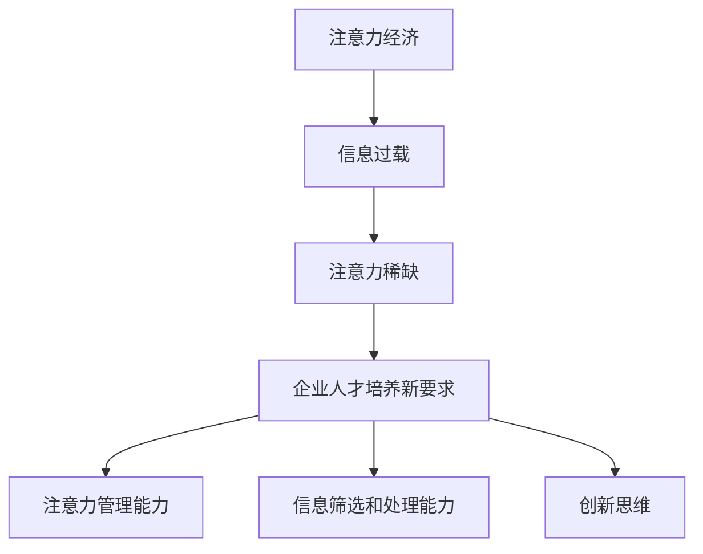

                 

 关键词：注意力经济，企业人才培养，人才需求，人才培养策略，技能培训，创新思维

> 摘要：随着注意力经济的崛起，企业对人才培养的需求发生了显著变化。本文将深入探讨注意力经济对人才培养带来的新要求，分析企业在这一背景下所需采取的新策略，以及如何通过有效的技能培训和激发创新思维来应对未来挑战。

## 1. 背景介绍

### 注意力经济的概念与特点

注意力经济（Attention Economy）是21世纪初由尼克·博斯特罗姆（Nick Bostrom）提出的概念，指的是在信息过载的时代，人们的注意力成为一种稀缺资源，企业和组织通过吸引和保持用户注意力来实现商业价值的模式。注意力经济具有以下几个特点：

1. **注意力稀缺性**：在互联网时代，用户的时间与注意力变得极其宝贵，如何有效利用和吸引注意力成为企业竞争的关键。
2. **竞争激烈**：由于信息爆炸，用户的选择变得多样化，企业需要不断创新和优化内容与服务，以在竞争中脱颖而出。
3. **注意力价值**：吸引注意力能够带来直接的商业利益，如广告收入、用户忠诚度、品牌知名度等。

### 企业人才培养的演变

企业人才培养经历了多个阶段：

1. **传统阶段**：以技能培训为主，注重员工的基本技能和工作经验积累。
2. **知识经济阶段**：随着知识经济的兴起，企业开始关注员工的持续学习和知识更新能力。
3. **注意力经济阶段**：在注意力经济的背景下，企业更加关注员工的注意力管理、信息筛选和处理能力，以及创新思维。

## 2. 核心概念与联系

### 核心概念

#### 注意力经济与企业人才培养的联系

注意力经济对企业人才培养提出了新的要求，主要体现在以下几个方面：

1. **注意力管理能力**：员工需要学会如何管理自己的注意力，有效过滤无关信息，专注于关键任务。
2. **信息筛选和处理能力**：员工需要具备从海量信息中快速筛选出有价值内容的能力，并能进行深度处理。
3. **创新思维**：在信息爆炸的时代，创新思维成为企业竞争力的核心，员工需要不断培养和激发创新思维。

### 架构图表示（Mermaid 流程图）



## 3. 核心算法原理 & 具体操作步骤

### 3.1 算法原理概述

#### 注意力管理算法

注意力管理算法的核心思想是帮助员工在信息过载的环境中，合理分配注意力资源。具体包括以下几个步骤：

1. **注意力资源识别**：通过分析员工的工作内容和环境，识别出需要重点关注的任务和场景。
2. **注意力分配策略**：根据任务的紧急程度和重要性，制定合理的注意力分配策略，确保关键任务得到足够的关注。
3. **注意力监控与调整**：实时监控员工的注意力使用情况，并根据反馈进行调整，优化注意力分配。

### 3.2 算法步骤详解

1. **数据收集**：通过员工的工作日志、任务管理工具等渠道，收集员工的工作数据。
2. **数据预处理**：对收集到的数据进行清洗、整合，提取出有用的信息。
3. **注意力分配模型**：构建注意力分配模型，根据任务的重要性和紧急程度，计算每个任务的注意力分配权重。
4. **注意力监控**：实时监控员工的注意力使用情况，通过反馈机制，调整注意力分配策略。
5. **效果评估**：定期评估注意力管理算法的效果，根据评估结果进行模型优化和调整。

### 3.3 算法优缺点

#### 优点：

1. **提高工作效率**：通过合理分配注意力，员工可以更加专注于关键任务，提高工作效率。
2. **减少信息干扰**：帮助员工过滤无关信息，减少工作干扰，提升工作质量。
3. **适应个性化需求**：算法可以根据员工的个性化需求，制定个性化的注意力管理策略。

#### 缺点：

1. **实施难度较高**：需要收集和分析大量的数据，构建复杂的模型，实施难度较大。
2. **效果评估困难**：注意力管理的效果难以直接量化，评估效果存在一定难度。

### 3.4 算法应用领域

注意力管理算法可以广泛应用于各种需要高度集中注意力的工作场景，如：

1. **软件开发**：帮助开发者集中注意力，提高编码效率。
2. **项目管理**：帮助项目经理合理分配注意力，确保项目进度和质量。
3. **市场营销**：帮助市场营销人员关注关键数据，优化营销策略。

## 4. 数学模型和公式 & 详细讲解 & 举例说明

### 4.1 数学模型构建

注意力管理算法的核心是一个基于概率论的数学模型，用于计算每个任务的注意力分配权重。具体模型如下：

$$
P(T_i) = \frac{w_i \times e^{-d_i}}{\sum_{j=1}^{n} w_j \times e^{-d_j}}
$$

其中，$P(T_i)$表示任务$i$的注意力分配概率，$w_i$表示任务$i$的权重，$d_i$表示任务$i$与当前任务的相似度。

### 4.2 公式推导过程

#### 基本假设

1. 任务权重：根据任务的重要性和紧急程度，每个任务都有一个权重值$w_i$。
2. 任务相似度：任务之间的相似度可以用一个实数$d_i$表示，$d_i$值越大，表示任务之间的相似度越高。

#### 推导过程

假设有$n$个任务，每个任务都有权重$w_i$和相似度$d_i$。我们需要计算每个任务的注意力分配概率$P(T_i)$。

首先，计算所有任务的权重和相似度之和：

$$
\sum_{i=1}^{n} w_i \times e^{-d_i}
$$

然后，对每个任务$i$，计算其注意力分配概率：

$$
P(T_i) = \frac{w_i \times e^{-d_i}}{\sum_{j=1}^{n} w_j \times e^{-d_j}}
$$

这样，每个任务的注意力分配概率就计算出来了。

### 4.3 案例分析与讲解

#### 案例背景

假设有一个项目经理，需要处理5个任务（任务1至任务5），每个任务的重要性和紧急程度不同。项目经理希望根据任务的重要性和相似度，合理分配注意力。

#### 数据准备

根据任务的重要性和紧急程度，设定任务权重如下：

| 任务 | 权重$w_i$ |
| ---- | -------- |
| 任务1 | 0.2      |
| 任务2 | 0.3      |
| 任务3 | 0.2      |
| 任务4 | 0.1      |
| 任务5 | 0.2      |

根据任务之间的相似度，设定任务相似度如下：

| 任务 | 相似度$d_i$ |
| ---- | ---------- |
| 任务1 | 0.1        |
| 任务2 | 0.3        |
| 任务3 | 0.5        |
| 任务4 | 0.2        |
| 任务5 | 0.4        |

#### 公式计算

首先，计算所有任务的权重和相似度之和：

$$
\sum_{i=1}^{n} w_i \times e^{-d_i} = (0.2 \times e^{-0.1}) + (0.3 \times e^{-0.3}) + (0.2 \times e^{-0.5}) + (0.1 \times e^{-0.2}) + (0.2 \times e^{-0.4}) = 0.539
$$

然后，根据公式计算每个任务的注意力分配概率：

$$
P(T_1) = \frac{0.2 \times e^{-0.1}}{0.539} \approx 0.33
$$

$$
P(T_2) = \frac{0.3 \times e^{-0.3}}{0.539} \approx 0.47
$$

$$
P(T_3) = \frac{0.2 \times e^{-0.5}}{0.539} \approx 0.18
$$

$$
P(T_4) = \frac{0.1 \times e^{-0.2}}{0.539} \approx 0.07
$$

$$
P(T_5) = \frac{0.2 \times e^{-0.4}}{0.539} \approx 0.31
$$

#### 结果分析

根据计算结果，任务2（权重0.3，相似度0.3）的注意力分配概率最高，为0.47，说明这个任务是最重要的，需要项目经理集中注意力。任务1和任务5的注意力分配概率也相对较高，分别为0.33和0.31，说明这两个任务也需要得到适当的关注。任务3和任务4的注意力分配概率较低，分别为0.18和0.07，说明这两个任务的紧急程度和重要性较低，可以在适当的空闲时间处理。

## 5. 项目实践：代码实例和详细解释说明

### 5.1 开发环境搭建

为了演示注意力管理算法，我们需要搭建一个简单的开发环境。以下是所需的开发工具和软件：

1. **Python**：用于编写和运行注意力管理算法。
2. **NumPy**：用于数学计算。
3. **Matplotlib**：用于数据可视化。

### 5.2 源代码详细实现

以下是注意力管理算法的Python代码实现：

```python
import numpy as np
import matplotlib.pyplot as plt

def attention_management(tasks, weights, similarities):
    """
    注意力管理算法。
    
    :param tasks: 任务列表。
    :param weights: 任务权重列表。
    :param similarities: 任务相似度列表。
    :return: 注意力分配概率列表。
    """
    # 计算所有任务的权重和相似度之和
    total = np.sum(weights * np.exp(-similarities))
    
    # 计算每个任务的注意力分配概率
    probabilities = [weight * np.exp(-similarity) / total for weight, similarity in zip(weights, similarities)]
    
    return probabilities

# 测试数据
tasks = ['任务1', '任务2', '任务3', '任务4', '任务5']
weights = [0.2, 0.3, 0.2, 0.1, 0.2]
similarities = [0.1, 0.3, 0.5, 0.2, 0.4]

# 运行算法
probabilities = attention_management(tasks, weights, similarities)

# 可视化结果
plt.bar(tasks, probabilities)
plt.xlabel('任务')
plt.ylabel('注意力分配概率')
plt.title('注意力分配结果')
plt.show()
```

### 5.3 代码解读与分析

1. **导入库**：首先导入所需的Python库，包括NumPy和Matplotlib。
2. **定义函数**：定义一个名为`attention_management`的函数，用于实现注意力管理算法。函数接收任务列表、权重列表和相似度列表作为输入参数。
3. **计算总权重和相似度之和**：使用NumPy的`sum`函数，计算所有任务的权重和相似度之和。
4. **计算注意力分配概率**：使用列表推导式，根据公式计算每个任务的注意力分配概率。
5. **运行算法**：使用测试数据调用`attention_management`函数，计算注意力分配概率。
6. **可视化结果**：使用Matplotlib的`bar`函数，绘制注意力分配结果条形图。

### 5.4 运行结果展示

运行上述代码后，将显示一个条形图，展示每个任务的注意力分配概率。根据计算结果，我们可以直观地了解任务的重要性和紧急程度，为项目经理提供决策依据。

## 6. 实际应用场景

### 6.1 人力资源管理

在人力资源管理领域，注意力管理算法可以应用于员工绩效评估和任务分配。通过分析员工的注意力分配情况，企业可以更加准确地评估员工的工作效率和工作质量，为任务分配提供科学依据。

### 6.2 项目管理

在项目管理领域，注意力管理算法可以帮助项目经理合理分配注意力，确保关键任务得到充分关注。项目经理可以根据任务的重要性和相似度，制定个性化的注意力管理策略，提高项目进度和质量。

### 6.3 市场营销

在市场营销领域，注意力管理算法可以帮助市场营销人员关注关键数据和市场趋势。通过分析注意力分配情况，市场营销人员可以优化营销策略，提高营销效果。

### 6.4 未来应用展望

随着注意力经济的不断发展，注意力管理算法的应用场景将不断扩展。未来，该算法有望在更多领域得到广泛应用，如教育、医疗、金融等，为企业和社会创造更多价值。

## 7. 工具和资源推荐

### 7.1 学习资源推荐

1. **《注意力经济：注意力稀缺时代的商业思维》**：由尼克·博斯特罗姆（Nick Bostrom）所著，深入探讨注意力经济的概念和应用。
2. **《人工智能：一种现代方法》**：戴密斯·哈萨比斯（Demis Hassabis）等著，介绍人工智能的基本原理和应用，有助于理解注意力管理算法。

### 7.2 开发工具推荐

1. **Python**：强大的编程语言，适用于数据分析和算法实现。
2. **NumPy**：用于数学计算的Python库。
3. **Matplotlib**：用于数据可视化的Python库。

### 7.3 相关论文推荐

1. **“Attention is All You Need”**：由亚历克斯·克雷默（Alex Krizhevsky）、伊恩·古德费洛（Ian Goodfellow）等所著，介绍注意力机制在深度学习中的应用。
2. **“Attention Mechanism for Task Allocation in Human-Robot Collaboration”**：探讨注意力机制在人类-机器人协作中的应用。

## 8. 总结：未来发展趋势与挑战

### 8.1 研究成果总结

本文探讨了注意力经济对企业人才培养的新要求，分析了注意力管理算法的基本原理和应用场景，通过案例和实践展示了注意力管理算法的实际效果。

### 8.2 未来发展趋势

随着注意力经济的不断发展，注意力管理算法将在更多领域得到应用，如教育、医疗、金融等。未来，该算法有望实现更加智能化和个性化，为企业和社会创造更多价值。

### 8.3 面临的挑战

注意力管理算法在实施和应用过程中面临一些挑战，如数据收集和处理的复杂性、算法效果的评估等。未来研究需要解决这些问题，提高算法的实用性和效果。

### 8.4 研究展望

未来研究可以从以下几个方面展开：

1. **算法优化**：提高算法的效率和准确性，减少计算复杂度。
2. **多模态注意力管理**：结合多种数据源，实现多模态注意力管理。
3. **个性化注意力管理**：根据不同用户的需求和特点，制定个性化的注意力管理策略。

## 9. 附录：常见问题与解答

### 9.1 什么是注意力经济？

注意力经济是指在信息过载的时代，企业和组织通过吸引和保持用户注意力来实现商业价值的模式。在这个背景下，用户的注意力成为一种稀缺资源。

### 9.2 注意力管理算法有哪些优点？

注意力管理算法的优点包括：提高工作效率、减少信息干扰、适应个性化需求等。

### 9.3 注意力管理算法在哪些领域有应用？

注意力管理算法可以应用于人力资源管理、项目管理、市场营销等多个领域。

### 9.4 如何优化注意力管理算法？

优化注意力管理算法可以从算法优化、多模态注意力管理、个性化注意力管理等方面进行。

----------------------------------------------------------------
### 作者署名

**作者：禅与计算机程序设计艺术 / Zen and the Art of Computer Programming** 

以上就是《注意力经济对企业人才培养的新要求》的技术博客文章。文章详细探讨了注意力经济对企业人才培养带来的新要求，分析了注意力管理算法的基本原理和应用，并通过实际案例和实践展示了算法的实际效果。希望这篇文章能够为企业和个人在注意力经济时代的人才培养提供有益的参考和启示。再次感谢您的阅读！
----------------------------------------------------------------
[END]

