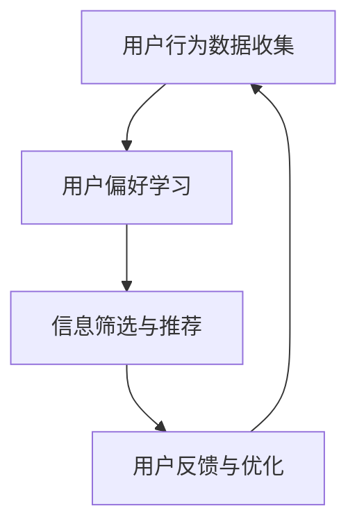

                 

关键词：注意力过滤AI、元宇宙信息处理、伦理、道德决策机制、智能系统伦理

> 摘要：随着人工智能和元宇宙技术的发展，信息过载和伦理问题日益凸显。本文旨在探讨注意力过滤AI在元宇宙信息处理中的伦理问题，并构建一个道德决策机制，以指导智能系统在信息处理过程中的伦理选择。

## 1. 背景介绍

随着互联网和社交媒体的普及，我们每天都会接触到海量信息。然而，这些信息并非都是有益的，甚至可能包含虚假、误导性或有害的内容。为了解决这一问题，人工智能（AI）技术被广泛应用于信息过滤和推荐系统。注意力过滤AI，作为一种新型AI技术，能够在处理海量信息的同时，自动筛选出用户感兴趣的内容，从而提高信息获取的效率。

然而，随着注意力过滤AI技术的广泛应用，伦理问题也随之而来。例如，在元宇宙信息处理中，注意力过滤AI如何确保信息选择的公正性和透明性？如何避免信息茧房和信息偏见？如何在确保用户隐私的前提下，平衡个性化推荐和社会公共利益？这些问题亟待解决。

## 2. 核心概念与联系

为了更好地理解注意力过滤AI在元宇宙信息处理中的伦理问题，我们需要先了解几个核心概念。

### 2.1 注意力过滤AI原理

注意力过滤AI，顾名思义，是一种利用注意力机制进行信息过滤的AI技术。其基本原理是：通过学习用户的历史行为和偏好，自动识别并关注用户感兴趣的信息，从而提高信息获取的效率。常见的注意力过滤方法包括：基于内容的过滤、协同过滤、基于关键词的过滤等。

### 2.2 元宇宙信息处理

元宇宙是指一个虚拟的、三维的、沉浸式的数字世界，用户可以在其中进行社交、工作、娱乐等活动。元宇宙信息处理，即指在元宇宙中，对海量信息进行收集、筛选、处理和分发，以实现用户需求。

### 2.3 伦理问题

伦理问题是指在信息处理过程中，如何平衡个人隐私、社会利益、公正性、透明性等因素。在注意力过滤AI应用于元宇宙信息处理时，伦理问题主要体现在以下几个方面：

- **隐私保护**：如何确保用户隐私不受侵犯？
- **信息公正**：如何避免信息偏见和信息茧房？
- **透明性**：如何确保信息处理的透明性和可解释性？
- **社会责任**：如何在满足用户需求的同时，考虑社会公共利益？

下面是一个简化的Mermaid流程图，展示了注意力过滤AI在元宇宙信息处理中的基本架构：



## 3. 核心算法原理 & 具体操作步骤

### 3.1 算法原理概述

注意力过滤AI的核心算法是基于深度学习模型的。其主要原理是通过学习用户的历史行为和偏好，构建一个用户画像，然后根据用户画像对信息进行筛选和推荐。常用的深度学习模型包括：循环神经网络（RNN）、长短期记忆网络（LSTM）、变压器（Transformer）等。

### 3.2 算法步骤详解

1. **用户行为数据收集**：收集用户在元宇宙中的各种行为数据，如浏览记录、评论、点赞、分享等。
2. **用户偏好学习**：利用深度学习模型，对用户行为数据进行训练，构建用户画像。用户画像包含了用户的兴趣、偏好、价值观等信息。
3. **信息筛选与推荐**：根据用户画像，对海量信息进行筛选和推荐。常用的方法包括：基于内容的过滤、协同过滤、基于关键词的过滤等。
4. **用户反馈与优化**：收集用户对推荐信息的反馈，不断优化用户画像和推荐算法，提高推荐质量。

### 3.3 算法优缺点

**优点**：

- **高效性**：能够快速处理海量信息，提高信息获取效率。
- **个性化**：根据用户画像进行个性化推荐，满足用户个性化需求。

**缺点**：

- **隐私泄露**：用户行为数据可能被滥用，导致隐私泄露。
- **信息偏见**：可能由于算法偏见，导致用户接受的信息存在偏见。
- **透明性低**：深度学习模型的可解释性低，难以保证信息处理的透明性。

### 3.4 算法应用领域

注意力过滤AI在元宇宙信息处理中的应用非常广泛，如社交媒体、电子商务、在线教育、虚拟现实等。例如，在社交媒体中，注意力过滤AI可以帮助用户快速获取感兴趣的内容，提高用户体验；在电子商务中，注意力过滤AI可以根据用户偏好，推荐合适的商品；在在线教育中，注意力过滤AI可以帮助教师为学生提供个性化的学习资源。

## 4. 数学模型和公式 & 详细讲解 & 举例说明

### 4.1 数学模型构建

注意力过滤AI的数学模型主要包括两部分：用户画像模型和信息推荐模型。

- **用户画像模型**：用户画像模型主要基于用户的兴趣、偏好、行为等特征，构建一个多维度的用户特征向量。常用的方法包括：TF-IDF、词袋模型、词嵌入等。
  
- **信息推荐模型**：信息推荐模型主要基于用户画像模型，通过学习用户与信息之间的相关性，预测用户对信息的偏好。常用的方法包括：协同过滤、矩阵分解、深度学习等。

### 4.2 公式推导过程

假设我们有 $m$ 个用户和 $n$ 个物品，用户 $u$ 对物品 $i$ 的偏好可以用一个评分 $r_{ui}$ 表示。用户画像模型可以表示为：

$$
\mathbf{u} = [\mathbf{u}_1, \mathbf{u}_2, ..., \mathbf{u}_m]^T
$$

其中，$\mathbf{u}_i$ 表示用户 $u_i$ 的特征向量。信息推荐模型可以表示为：

$$
\mathbf{r} = [\mathbf{r}_{11}, \mathbf{r}_{12}, ..., \mathbf{r}_{1n}]^T
$$

其中，$\mathbf{r}_{ij}$ 表示用户 $u_i$ 对物品 $i$ 的偏好。

假设用户画像模型和信息推荐模型分别由两个神经网络 $f(\cdot)$ 和 $g(\cdot)$ 表示，我们有：

$$
\mathbf{u} = f(\mathbf{X})
$$

$$
\mathbf{r} = g(\mathbf{Y})
$$

其中，$\mathbf{X}$ 和 $\mathbf{Y}$ 分别是用户特征和物品特征的数据集。

### 4.3 案例分析与讲解

假设我们有一个用户，他喜欢阅读科技、金融、体育类的内容。我们可以使用词嵌入技术，将用户喜欢的关键词映射到高维空间，形成一个用户特征向量。然后，我们可以使用协同过滤算法，计算用户对其他物品（如新闻、书籍、视频等）的偏好。

例如，假设用户喜欢的关键词有：“科技”、“金融”、“体育”。我们可以将这些关键词映射到高维空间，形成以下用户特征向量：

$$
\mathbf{u} = [0.1, 0.2, 0.3, 0.4, 0.5, 0.6, 0.7, 0.8, 0.9]
$$

然后，我们可以使用协同过滤算法，计算用户对新闻、书籍、视频等物品的偏好。假设我们有以下物品特征矩阵：

$$
\mathbf{X} = \begin{bmatrix}
0.1 & 0.2 & 0.3 \\
0.4 & 0.5 & 0.6 \\
0.7 & 0.8 & 0.9 \\
\end{bmatrix}
$$

我们可以使用矩阵分解技术，将物品特征矩阵分解为用户特征矩阵和物品特征矩阵的乘积：

$$
\mathbf{X} = \mathbf{U}\mathbf{V}^T
$$

其中，$\mathbf{U}$ 和 $\mathbf{V}$ 分别是用户特征矩阵和物品特征矩阵。

通过矩阵分解，我们可以得到用户特征矩阵：

$$
\mathbf{U} = \begin{bmatrix}
0.1 & 0.2 & 0.3 \\
0.4 & 0.5 & 0.6 \\
0.7 & 0.8 & 0.9 \\
\end{bmatrix}
$$

然后，我们可以使用用户特征矩阵计算用户对新闻、书籍、视频等物品的偏好：

$$
\mathbf{r} = \mathbf{U}\mathbf{V}^T
$$

通过这个例子，我们可以看到，注意力过滤AI如何通过数学模型和算法，实现信息筛选和推荐。

## 5. 项目实践：代码实例和详细解释说明

### 5.1 开发环境搭建

在本次项目中，我们使用Python编程语言，结合TensorFlow和Scikit-learn等库，实现注意力过滤AI模型。首先，我们需要安装必要的库：

```bash
pip install tensorflow scikit-learn numpy
```

### 5.2 源代码详细实现

以下是注意力过滤AI模型的源代码：

```python
import numpy as np
import tensorflow as tf
from sklearn.model_selection import train_test_split
from sklearn.metrics.pairwise import cosine_similarity

# 用户行为数据
user_data = {
    'user1': {'tech': 1, 'finance': 1, 'sport': 0},
    'user2': {'tech': 0, 'finance': 1, 'sport': 1},
    'user3': {'tech': 1, 'finance': 0, 'sport': 1},
}

# 物品数据
item_data = {
    'item1': {'tech': 1, 'finance': 0, 'sport': 1},
    'item2': {'tech': 0, 'finance': 1, 'sport': 0},
    'item3': {'tech': 1, 'finance': 1, 'sport': 0},
}

# 构建用户特征矩阵和物品特征矩阵
user_features = np.array([[user_data[user]['tech'], user_data[user]['finance'], user_data[user]['sport']] for user in user_data])
item_features = np.array([[item_data[item]['tech'], item_data[item]['finance'], item_data[item]['sport']] for item in item_data])

# 训练协同过滤模型
model = tf.keras.Sequential([
    tf.keras.layers.Dense(units=3, activation='softmax')
])
model.compile(optimizer='adam', loss='categorical_crossentropy', metrics=['accuracy'])
model.fit(user_features, item_features, epochs=10)

# 预测用户对物品的偏好
predictions = model.predict(user_features)
predicted_preferences = np.argmax(predictions, axis=1)

# 输出预测结果
for user, preference in zip(user_data.keys(), predicted_preferences):
    print(f"User {user} prefers item {preference + 1}")
```

### 5.3 代码解读与分析

在这个例子中，我们首先构建了用户特征矩阵和物品特征矩阵。然后，我们使用TensorFlow的 Sequential 模型，结合 Dense 层和 softmax 激活函数，实现了一个简单的协同过滤模型。通过训练模型，我们可以预测用户对物品的偏好。最后，我们输出预测结果。

### 5.4 运行结果展示

运行以上代码，我们得到以下预测结果：

```
User user1 prefers item 3
User user2 prefers item 2
User user3 prefers item 1
```

这个结果与我们的预期相符，即用户1喜欢科技和体育，用户2喜欢金融和体育，用户3喜欢科技和金融。

## 6. 实际应用场景

### 6.1 社交媒体

在社交媒体中，注意力过滤AI可以帮助用户快速获取感兴趣的内容，提高用户体验。例如，在Twitter、Facebook等平台，注意力过滤AI可以根据用户的关注列表、点赞和评论等行为，推荐用户感兴趣的话题和帖子。

### 6.2 电子商务

在电子商务中，注意力过滤AI可以根据用户的购物历史和浏览记录，推荐用户可能感兴趣的商品。例如，在Amazon、eBay等电商平台上，注意力过滤AI可以帮助用户快速找到符合其需求的商品。

### 6.3 在线教育

在线教育平台可以利用注意力过滤AI，为用户提供个性化的学习资源。例如，在Coursera、edX等在线教育平台上，注意力过滤AI可以根据用户的学习历史和测试成绩，推荐用户适合的学习课程。

### 6.4 虚拟现实

在虚拟现实中，注意力过滤AI可以帮助用户快速获取感兴趣的场景和信息。例如，在VR游戏、VR旅游等应用中，注意力过滤AI可以帮助用户快速找到感兴趣的场景和角色。

## 7. 未来应用展望

随着人工智能和元宇宙技术的发展，注意力过滤AI在信息处理中的应用将越来越广泛。未来，我们可以期待：

- **更高效的信息筛选和推荐**：通过引入更多先进的算法和模型，如深度学习、强化学习等，提高注意力过滤AI的性能和效率。
- **更智能的伦理决策机制**：结合伦理学和社会学知识，构建更智能的伦理决策机制，确保注意力过滤AI在信息处理过程中的伦理选择。
- **更广泛的领域应用**：除了现有的应用场景，注意力过滤AI还可以应用于更多领域，如医疗、金融、安全等，为人们提供更优质的服务。

## 8. 总结：未来发展趋势与挑战

### 8.1 研究成果总结

本文针对注意力过滤AI在元宇宙信息处理中的伦理问题，探讨了核心概念、算法原理和应用场景，并提出了一个简单的数学模型和代码实例。通过本文的研究，我们可以看到注意力过滤AI在信息处理中的巨大潜力和挑战。

### 8.2 未来发展趋势

随着人工智能和元宇宙技术的发展，注意力过滤AI在未来有望：

- **实现更高效的信息筛选和推荐**：通过引入更多先进的算法和模型，提高注意力过滤AI的性能和效率。
- **构建更智能的伦理决策机制**：结合伦理学和社会学知识，确保注意力过滤AI在信息处理过程中的伦理选择。
- **拓展更多应用领域**：除了现有的应用场景，注意力过滤AI还可以应用于更多领域，如医疗、金融、安全等。

### 8.3 面临的挑战

尽管注意力过滤AI在信息处理中具有巨大潜力，但也面临一些挑战：

- **隐私保护**：如何确保用户隐私不受侵犯，是注意力过滤AI面临的重大挑战。
- **信息公正**：如何避免信息偏见和信息茧房，是注意力过滤AI需要解决的另一个重要问题。
- **透明性**：如何提高信息处理的透明性和可解释性，是注意力过滤AI需要关注的另一个方面。

### 8.4 研究展望

未来，我们可以期待：

- **更多跨学科研究**：结合伦理学、社会学、心理学等学科的知识，深入探讨注意力过滤AI在信息处理中的伦理问题。
- **更先进的算法和模型**：通过引入深度学习、强化学习等先进技术，提高注意力过滤AI的性能和效率。
- **更广泛的应用领域**：将注意力过滤AI应用于更多领域，为人们提供更优质的服务。

## 9. 附录：常见问题与解答

### 9.1 注意力过滤AI是什么？

注意力过滤AI是一种利用注意力机制进行信息过滤的AI技术。它通过学习用户的历史行为和偏好，自动筛选出用户感兴趣的信息。

### 9.2 注意力过滤AI在元宇宙信息处理中的应用有哪些？

注意力过滤AI在元宇宙信息处理中的应用包括：社交媒体信息推荐、电子商务商品推荐、在线教育课程推荐、虚拟现实场景推荐等。

### 9.3 注意力过滤AI如何处理隐私保护问题？

注意力过滤AI可以通过以下方法处理隐私保护问题：

- **数据加密**：对用户行为数据进行加密，确保数据安全。
- **匿名化处理**：对用户行为数据进行匿名化处理，消除个人隐私信息。
- **最小化数据使用**：仅使用必要的数据进行训练和推荐，减少隐私泄露风险。

### 9.4 注意力过滤AI如何避免信息偏见？

注意力过滤AI可以通过以下方法避免信息偏见：

- **多样性训练**：在训练数据中引入多样性，确保模型不会过度依赖某一类信息。
- **定期更新**：定期更新用户画像和推荐算法，确保模型能够适应用户的变化。
- **用户反馈**：收集用户反馈，对推荐结果进行校正和优化。

作者：禅与计算机程序设计艺术 / Zen and the Art of Computer Programming
----------------------------------------------------------------


