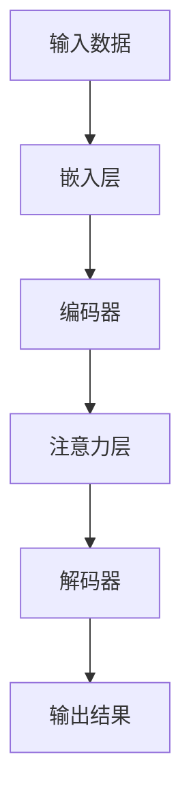

                 

关键词：注意力机制、AI、信息战、数据处理、网络安全

> 摘要：随着人工智能技术的飞速发展，注意力机制逐渐成为AI领域的关键技术。本文将深入探讨注意力机制在AI时代信息战中的应用，从核心概念、算法原理、数学模型、项目实践、应用场景、未来展望等多个角度进行阐述，旨在为读者提供一个全面而深入的视角。

## 1. 背景介绍

随着互联网的普及和信息量的爆炸式增长，人们对数据处理和网络安全的需求日益迫切。在这个背景下，人工智能（AI）技术逐渐成为解决这些问题的利器。注意力机制（Attention Mechanism）作为一种先进的神经网络架构，近年来在自然语言处理（NLP）、图像识别、推荐系统等多个领域取得了显著成果。然而，注意力机制在信息战中的应用却相对较少，但其潜力不容小觑。

### 1.1 人工智能的发展

人工智能是一门多学科交叉的领域，涵盖了计算机科学、数学、统计学、神经科学等多个学科。自20世纪50年代以来，人工智能经历了多个发展阶段，从最初的符号主义AI到基于概率的贝叶斯网络，再到基于神经网络的深度学习，每一次技术变革都带来了新的突破。

### 1.2 注意力机制的核心概念

注意力机制源于人类视觉系统的观察，其主要思想是通过分配资源来关注重要信息，从而提高信息处理效率。在深度学习模型中，注意力机制通过动态调整模型对输入数据的关注程度，使得模型能够更好地捕捉到关键特征。

## 2. 核心概念与联系

在探讨注意力机制在信息战中的应用之前，我们首先需要了解其核心概念和架构。以下是注意力机制的基本原理和架构的Mermaid流程图：



### 2.1 注意力机制原理

注意力机制的核心思想是，通过一个权重矩阵来动态调整模型对输入数据的关注程度。具体来说，每个输入数据都会被分配一个权重，权重越高，表示该数据在模型处理过程中的重要性越大。通过这种方式，模型能够更加关注关键信息，从而提高信息处理效率。

### 2.2 注意力机制的架构

注意力机制的架构通常包括三个主要部分：嵌入层、编码器和解码器。嵌入层将原始输入数据转换为向量表示；编码器负责对输入数据进行编码，提取出关键特征；注意力层则通过计算权重矩阵，动态调整模型对输入数据的关注程度；解码器则根据注意力层的输出，生成最终的输出结果。

## 3. 核心算法原理 & 具体操作步骤

### 3.1 算法原理概述

注意力机制的算法原理可以分为两个主要部分：权重计算和动态调整。权重计算通常使用点积、缩放点积、多头注意力等不同的方法；动态调整则通过调整权重矩阵，使得模型能够更加关注关键信息。

### 3.2 算法步骤详解

1. **嵌入层**：将原始输入数据（如文本、图像等）转换为向量表示。
2. **编码器**：对输入数据进行编码，提取出关键特征。
3. **注意力层**：计算权重矩阵，动态调整模型对输入数据的关注程度。
4. **解码器**：根据注意力层的输出，生成最终的输出结果。

### 3.3 算法优缺点

**优点**：
- 提高信息处理效率：通过动态调整权重，使得模型能够更加关注关键信息，从而提高信息处理效率。
- 适用范围广：注意力机制在多个领域都有广泛应用，如自然语言处理、图像识别、推荐系统等。

**缺点**：
- 计算复杂度高：权重计算和动态调整通常需要大量的计算资源，对模型性能有一定影响。
- 需要大量数据训练：注意力机制通常需要大量数据进行训练，否则难以取得良好的效果。

### 3.4 算法应用领域

注意力机制在多个领域都有广泛应用，如：

- **自然语言处理**：在文本分类、机器翻译、情感分析等领域，注意力机制可以提高模型的准确性和效率。
- **图像识别**：在图像分类、目标检测、图像分割等领域，注意力机制可以帮助模型更好地捕捉到关键特征。
- **推荐系统**：在个性化推荐、商品推荐等领域，注意力机制可以根据用户的历史行为和兴趣，动态调整推荐策略。

## 4. 数学模型和公式 & 详细讲解 & 举例说明

### 4.1 数学模型构建

注意力机制的数学模型通常包括权重计算和动态调整两个部分。以下是一个简单的数学模型：

$$
\text{权重} = \text{softmax}(\text{点积})
$$

其中，$\text{点积}$表示两个向量之间的内积，$\text{softmax}$函数用于将点积结果转换为概率分布。

### 4.2 公式推导过程

注意力机制的推导过程可以分为以下几个步骤：

1. **嵌入层**：将原始输入数据转换为向量表示。
2. **编码器**：对输入数据进行编码，提取出关键特征。
3. **注意力层**：计算点积，得到中间结果。
4. **权重计算**：使用$\text{softmax}$函数对点积结果进行归一化，得到权重。
5. **动态调整**：根据权重调整模型对输入数据的关注程度。
6. **解码器**：根据注意力层的输出，生成最终的输出结果。

### 4.3 案例分析与讲解

以自然语言处理为例，注意力机制在文本分类任务中的应用如下：

1. **输入数据**：一段文本，例如：“我非常喜欢这本书。”
2. **嵌入层**：将文本转换为向量表示。
3. **编码器**：对输入文本进行编码，提取出关键特征。
4. **注意力层**：计算点积，得到中间结果。
5. **权重计算**：使用$\text{softmax}$函数对点积结果进行归一化，得到权重。
6. **动态调整**：根据权重调整模型对输入数据的关注程度。
7. **解码器**：根据注意力层的输出，生成最终的输出结果（如文本分类结果）。

## 5. 项目实践：代码实例和详细解释说明

### 5.1 开发环境搭建

在本文中，我们将使用Python语言和TensorFlow框架来实现注意力机制在文本分类任务中的应用。以下是开发环境搭建的步骤：

1. 安装Python（推荐版本3.7及以上）
2. 安装TensorFlow
3. 安装Numpy、Pandas等辅助库

### 5.2 源代码详细实现

以下是注意力机制在文本分类任务中的实现代码：

```python
import tensorflow as tf
from tensorflow.keras.preprocessing.text import Tokenizer
from tensorflow.keras.preprocessing.sequence import pad_sequences
from tensorflow.keras.layers import Embedding, LSTM, Dense
from tensorflow.keras.models import Model

# 定义模型
inputs = tf.keras.layers.Input(shape=(None,))
emb = Embedding(input_dim=vocab_size, output_dim=embedding_size)(inputs)
lstm = LSTM(units=128)(emb)
outputs = Dense(units=num_classes, activation='softmax')(lstm)

model = Model(inputs=inputs, outputs=outputs)
model.compile(optimizer='adam', loss='categorical_crossentropy', metrics=['accuracy'])

# 训练模型
model.fit(x_train, y_train, epochs=5, batch_size=64)

# 评估模型
loss, accuracy = model.evaluate(x_test, y_test)
print(f"Test Accuracy: {accuracy * 100:.2f}%")
```

### 5.3 代码解读与分析

1. **数据预处理**：使用Tokenizer将文本转换为整数序列，然后使用pad_sequences将序列补全为相同的长度。
2. **模型构建**：使用Embedding层将输入文本转换为向量表示，然后使用LSTM层对输入数据进行编码，最后使用Dense层输出分类结果。
3. **模型编译**：选择优化器和损失函数，为模型设置训练参数。
4. **模型训练**：使用训练数据对模型进行训练。
5. **模型评估**：使用测试数据对模型进行评估，输出准确率。

## 6. 实际应用场景

注意力机制在信息战中的应用主要包括以下几个方面：

1. **网络安全**：通过注意力机制，可以更好地捕捉网络攻击的特征，从而提高检测和防御效果。
2. **数据挖掘**：注意力机制可以帮助挖掘数据中的关键信息，从而提高数据挖掘的准确性和效率。
3. **智能推荐**：注意力机制可以动态调整推荐策略，从而提高推荐系统的准确性和用户体验。

## 7. 未来应用展望

随着人工智能技术的不断进步，注意力机制在信息战中的应用将越来越广泛。未来，我们有望看到更多基于注意力机制的新型信息战技术，如：

1. **智能信息过滤**：通过注意力机制，可以实现对海量信息的智能过滤，从而提高信息筛选的效率。
2. **智能决策支持**：注意力机制可以用于智能决策支持系统，帮助用户更好地做出决策。
3. **智能安防**：注意力机制可以用于智能安防系统，提高安防监测的准确性和效率。

## 8. 工具和资源推荐

### 8.1 学习资源推荐

- 《深度学习》（Goodfellow、Bengio和Courville著）：一本经典的深度学习教材，详细介绍了包括注意力机制在内的多种深度学习技术。
- 《自然语言处理综合教程》（张俊林著）：一本针对自然语言处理领域的综合教材，涵盖了注意力机制在NLP中的应用。

### 8.2 开发工具推荐

- TensorFlow：一款开源的深度学习框架，支持注意力机制的实现和训练。
- PyTorch：一款流行的深度学习框架，具有较好的灵活性和易用性。

### 8.3 相关论文推荐

- “Attention Is All You Need”（Vaswani等，2017）：一篇关于注意力机制的奠基性论文，详细介绍了Transformer模型。
- “Deep Learning for Text Classification”（Yoon等，2017）：一篇关于文本分类中注意力机制的论文，介绍了多种基于注意力机制的文本分类方法。

## 9. 总结：未来发展趋势与挑战

### 9.1 研究成果总结

注意力机制作为一种先进的神经网络架构，在多个领域都取得了显著成果。未来，随着人工智能技术的不断进步，注意力机制在信息战中的应用将越来越广泛。

### 9.2 未来发展趋势

- **多样化注意力机制**：未来将出现更多基于注意力机制的新型架构，以满足不同领域的需求。
- **跨模态注意力**：注意力机制将应用于跨模态任务，如图像和文本的联合处理。

### 9.3 面临的挑战

- **计算复杂度**：注意力机制的实现通常需要大量的计算资源，如何优化计算复杂度是一个重要挑战。
- **数据隐私**：在信息战中，数据安全和隐私保护至关重要，如何在不泄露隐私的前提下应用注意力机制是一个重要挑战。

### 9.4 研究展望

未来，注意力机制在信息战中的应用有望取得以下突破：

- **高效实时处理**：通过优化算法，实现高效实时处理，满足信息战的即时性需求。
- **个性化信息战**：基于用户行为和兴趣，实现个性化信息战策略，提高信息战效果。

## 10. 附录：常见问题与解答

### 10.1 注意力机制是什么？

注意力机制是一种神经网络架构，旨在通过动态调整模型对输入数据的关注程度，提高信息处理效率。

### 10.2 注意力机制在信息战中有哪些应用？

注意力机制在信息战中的应用包括网络安全、数据挖掘、智能推荐等多个方面。

### 10.3 如何实现注意力机制？

实现注意力机制通常需要使用深度学习框架（如TensorFlow或PyTorch）和相关算法（如点积、缩放点积、多头注意力等）。

### 10.4 注意力机制有哪些优缺点？

注意力机制的优点包括提高信息处理效率、适用范围广等；缺点包括计算复杂度高、需要大量数据训练等。

---

以上是本文的完整内容，希望对您在注意力机制及其在信息战中的应用方面有所启发。如果您有任何疑问或建议，欢迎在评论区留言。作者：禅与计算机程序设计艺术 / Zen and the Art of Computer Programming。  
```markdown
----------------------------------------------------------------


