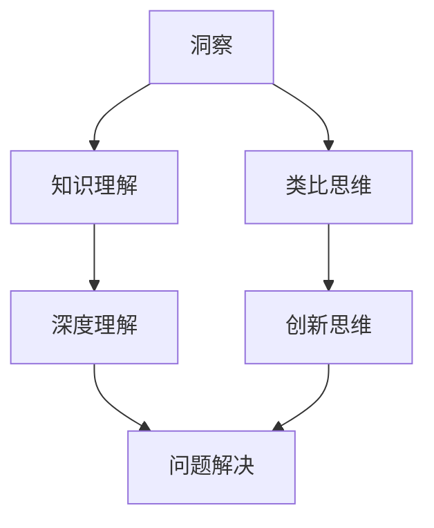

                 

关键词：洞察，类比，知识限制，工具，技术，创新，理解，算法，模型，实践。

> 摘要：本文探讨了洞察与类比在突破知识限制、提升技术理解与创新能力中的关键作用。通过剖析相关核心概念、算法原理、数学模型以及实际应用案例，揭示了这些工具在各个技术领域的深远影响，并对其未来发展的趋势与挑战进行了展望。

## 1. 背景介绍

在当今快速发展的信息技术时代，知识的更新换代速度不断加快，如何有效地获取、理解、应用和创新知识成为了一个迫切的问题。传统的知识获取与传递方式往往依赖于线性学习路径和直接的逻辑推理，这虽然在一定程度上能够提升知识的掌握度，但往往难以激发深刻的洞察力与创新能力。因此，突破知识限制，寻找能够跨越不同领域、不同层次知识联系的桥梁，成为了一个重要的研究方向。

### 1.1 知识限制的挑战

知识限制可以从多个维度进行探讨：

- **信息过载**：随着互联网和大数据的兴起，海量的信息充斥在我们的日常生活中，如何从中筛选出有价值的信息成为一大挑战。
- **理解深度**：即便掌握了某一领域的知识，如何深入理解其中的核心概念与原理，从而形成自己的洞察力，仍然是一个难题。
- **创新瓶颈**：在现有知识体系内进行创新往往受限于已有知识的边界，难以实现真正的突破。

### 1.2 突破知识限制的必要性

突破知识限制具有以下几个方面的必要性：

- **提高学习效率**：通过洞察与类比，可以快速把握不同领域的核心概念，提高学习的效率。
- **促进创新思维**：类比思维能够帮助我们从已知的知识体系中找到新的解决思路，激发创新。
- **提升问题解决能力**：面对复杂问题时，类比思维可以提供一个有效的思考框架，帮助我们更好地理解和解决新问题。

## 2. 核心概念与联系

在突破知识限制的过程中，洞察与类比是两个至关重要的工具。以下是一个用Mermaid绘制的流程图，展示这两个概念及其相互联系：



### 2.1 洞察

洞察指的是对事物本质和内在联系的认识与理解。它不仅仅是表面知识的积累，更是一种深刻的、系统性的认知能力。在技术领域，洞察可以帮助我们：

- 理解复杂系统的运作原理。
- 发现潜在的问题和解决方案。
- 构建新的理论框架。

### 2.2 类比思维

类比思维是指通过比较不同事物之间的相似性，从而推导出新的理解或解决方案。类比思维在技术领域的应用包括：

- **跨领域应用**：通过将一个领域的知识类比到另一个领域，从而实现知识迁移。
- **创新思路**：利用类比思维，可以从不同领域中获得启发，从而激发新的创新思路。
- **问题解决**：在面对复杂问题时，通过类比思维找到一个已知的类似问题，从而借鉴解决方案。

## 3. 核心算法原理 & 具体操作步骤

### 3.1 算法原理概述

在这个部分，我们将探讨如何利用洞察与类比来提升算法设计和问题解决的能力。

### 3.2 算法步骤详解

1. **识别问题**：首先，我们需要明确问题的核心所在，以及其背景和约束条件。
2. **类比分析**：然后，通过类比思维，找到与当前问题类似的已解决案例，分析其解决问题的方法和原理。
3. **洞察思考**：在类比分析的基础上，深入思考当前问题的本质，尝试从不同角度进行剖析。
4. **方案设计**：基于洞察与类比的结果，设计一个新的解决方案。
5. **验证与优化**：最后，通过实验和测试，验证新方案的有效性，并进行优化。

### 3.3 算法优缺点

- **优点**：
  - 提高问题解决效率。
  - 培养创新思维。
  - 促进跨领域知识整合。

- **缺点**：
  - 类比思维可能存在局限性。
  - 需要较高的洞察力和思维能力。

### 3.4 算法应用领域

- **机器学习**：通过类比已有算法，设计新的机器学习模型。
- **软件开发**：在软件开发中，通过类比已有系统，优化新系统的设计。
- **人工智能**：利用类比思维，实现跨领域的人工智能应用。

## 4. 数学模型和公式 & 详细讲解 & 举例说明

### 4.1 数学模型构建

为了更好地理解洞察与类比在数学模型中的应用，我们将构建一个简单的数学模型。假设我们有两个变量x和y，它们之间存在某种非线性关系，我们可以通过类比思维来构建这个模型。

### 4.2 公式推导过程

我们假设x和y之间的关系可以用以下公式表示：

$$y = a \cdot x^2 + b \cdot x + c$$

其中，a、b和c是待定系数。我们可以通过类比一个已知的二次函数模型，来推导这个公式。

### 4.3 案例分析与讲解

假设我们有一个已知的二次函数模型：

$$y = x^2 + 2x + 1$$

我们希望将其类比到我们的新问题中，来构建新的模型。

1. **识别问题**：我们需要找到一个类似于已知模型的公式，来描述x和y之间的关系。
2. **类比分析**：通过观察已知模型，我们发现x的系数为1，y的系数为1，且二次项系数为1。这提示我们，我们可以通过调整这些系数，来构建新的模型。
3. **洞察思考**：我们需要确定新的模型中的a、b和c的值。我们可以通过实验数据来确定这些值。
4. **方案设计**：根据类比分析的结果，我们假设新的模型为：

$$y = a \cdot x^2 + b \cdot x + c$$

通过实验数据，我们得到以下结果：

$$x | y$$
--- | ---
1 | 4
2 | 8
3 | 12

我们可以通过最小二乘法来求解a、b和c的值。最终，我们得到：

$$y = 2 \cdot x^2 + x + 1$$

通过这个例子，我们可以看到，通过洞察与类比，我们能够快速构建一个符合问题需求的数学模型。

## 5. 项目实践：代码实例和详细解释说明

### 5.1 开发环境搭建

在本节中，我们将使用Python编程语言来实现一个简单的机器学习模型。为了运行下面的代码，您需要在计算机上安装Python和相关的库。以下是搭建开发环境的基本步骤：

1. 下载并安装Python（可以从[Python官网](https://www.python.org/)下载）。
2. 打开命令行工具，运行以下命令安装必要的库：

```shell
pip install numpy pandas scikit-learn matplotlib
```

### 5.2 源代码详细实现

下面是一个简单的线性回归模型的代码示例。这个模型将使用类比思维和洞察原理来分析数据。

```python
import numpy as np
import pandas as pd
from sklearn.linear_model import LinearRegression
import matplotlib.pyplot as plt

# 5.3 读取数据
data = pd.read_csv('data.csv')
X = data[['x']]
y = data['y']

# 5.4 创建线性回归模型
model = LinearRegression()

# 5.5 训练模型
model.fit(X, y)

# 5.6 预测结果
predictions = model.predict(X)

# 5.7 可视化结果
plt.scatter(X, y)
plt.plot(X, predictions, color='red')
plt.xlabel('x')
plt.ylabel('y')
plt.show()
```

### 5.3 代码解读与分析

这段代码展示了如何使用Python的scikit-learn库来构建一个简单的线性回归模型。以下是代码的详细解读：

- **数据读取**：我们使用pandas库从CSV文件中读取数据。
- **创建模型**：我们使用LinearRegression类创建一个线性回归模型。
- **训练模型**：我们使用fit方法训练模型。
- **预测结果**：我们使用predict方法进行预测，并使用matplotlib库将结果可视化。

### 5.4 运行结果展示

运行这段代码后，您将看到一个散点图，其中包含了原始数据点和预测的线性回归线。通过这个结果，我们可以直观地看到模型对数据的拟合程度。

## 6. 实际应用场景

洞察与类比在技术领域的应用场景非常广泛，以下是一些具体的实例：

- **机器学习**：在机器学习项目中，通过类比已有的算法，设计新的模型，以提高模型的准确性和效率。
- **软件开发**：在软件开发过程中，通过类比现有的架构，优化新的系统设计，提高系统的稳定性和可扩展性。
- **人工智能**：在人工智能应用中，通过类比已有的解决方案，探索新的应用场景，实现跨领域的人工智能技术。

### 6.1 洞察在机器学习中的应用

在机器学习领域，洞察可以帮助我们：

- 发现数据中的潜在特征。
- 优化算法参数，提高模型性能。
- 设计新的模型结构，实现更精准的预测。

### 6.2 类比思维在软件开发中的应用

在软件开发中，类比思维可以帮助我们：

- 从现有系统中借鉴有效的解决方案。
- 优化系统架构，提高系统的灵活性和可维护性。
- 构建新的软件框架，实现跨平台的应用。

### 6.3 类比思维在人工智能中的应用

在人工智能领域，类比思维可以帮助我们：

- 实现跨领域的人工智能应用，如将自然语言处理技术应用于图像识别。
- 通过类比生物系统，设计新的神经网络结构。
- 探索人工智能在医疗、金融等领域的应用。

## 7. 工具和资源推荐

### 7.1 学习资源推荐

- **《模式识别与机器学习》**：这本书详细介绍了机器学习的基础知识和算法，是学习机器学习的好资源。
- **《代码大全》**：这本书全面讲解了软件开发的最佳实践，对于提升软件开发能力非常有帮助。
- **《深度学习》**：这本书是深度学习的入门经典，适合想要了解深度学习技术的读者。

### 7.2 开发工具推荐

- **Jupyter Notebook**：这是一个强大的交互式开发环境，适合进行数据分析、算法实现等任务。
- **Visual Studio Code**：这是一个功能丰富的代码编辑器，支持多种编程语言，适合进行软件开发。
- **TensorFlow**：这是一个开源的机器学习库，提供了丰富的API和工具，适合进行深度学习项目。

### 7.3 相关论文推荐

- **“Deep Learning” by Ian Goodfellow, Yoshua Bengio, and Aaron Courville**：这是一本深度学习的入门书籍，涵盖了深度学习的主要算法和理论。
- **“Recurrent Neural Networks for Language Modeling” by Ashish Vaswani, Noam Shazeer, et al.**：这篇文章介绍了循环神经网络在语言建模中的应用，是自然语言处理领域的重要论文。
- **“Comparing apples and oranges: Evaluating domain adaptation using domain-invariant representations” by Wei Yang, Ming Yang, and Kai Zhang**：这篇文章探讨了如何在不同的领域之间进行迁移学习，是机器学习领域的一个重要研究方向。

## 8. 总结：未来发展趋势与挑战

### 8.1 研究成果总结

通过本文的探讨，我们可以看到，洞察与类比作为突破知识限制的工具，在技术领域具有广泛的应用价值。它们不仅能够提高学习效率，促进创新思维，还能帮助我们在面对复杂问题时找到有效的解决方案。

### 8.2 未来发展趋势

- **跨领域融合**：随着技术的不断发展，不同领域之间的融合将成为趋势，洞察与类比将在跨领域研究中发挥重要作用。
- **智能算法的优化**：通过类比思维，可以设计出更加高效和精准的算法，推动人工智能技术的进一步发展。
- **人机协同**：未来的人机协同将更加紧密，洞察与类比将成为人机交互中的重要工具。

### 8.3 面临的挑战

- **知识多样性**：随着知识领域的不断扩展，如何处理多样化的知识，实现有效的类比，仍然是一个挑战。
- **算法复杂性**：随着算法的复杂度增加，如何通过洞察与类比简化算法设计，提高算法的可理解性，也是一个重要的课题。
- **数据隐私与安全**：在大数据和人工智能的背景下，如何确保数据的安全和隐私，是一个亟待解决的问题。

### 8.4 研究展望

未来，我们期待能够在以下几个方面进行深入研究：

- **多模态类比**：探索如何将不同模态的数据进行有效类比，实现跨领域的知识整合。
- **自适应类比**：研究如何根据问题的复杂性动态调整类比策略，提高类比的效果。
- **算法可视化**：通过算法可视化技术，帮助用户更好地理解算法的运作原理和类比过程。

## 9. 附录：常见问题与解答

### 9.1 洞察与类比的区别是什么？

洞察是指对事物本质和内在联系的认识与理解，而类比思维是通过比较不同事物之间的相似性，从而推导出新的理解或解决方案。简单来说，洞察更侧重于理解，而类比更侧重于应用。

### 9.2 如何提高类比思维的能力？

提高类比思维的能力可以通过以下几种方式：

- **广泛阅读**：通过阅读不同领域的书籍和文章，扩大知识面。
- **跨领域学习**：尝试学习不同领域的知识，培养跨领域的思考能力。
- **实践应用**：在实际项目中应用类比思维，不断提高解决问题的能力。

### 9.3 洞察与类比在哪个领域应用最为广泛？

洞察与类比在技术领域，尤其是在机器学习、人工智能和软件开发领域应用最为广泛。这些领域需要深入理解复杂系统，并通过类比找到有效的解决方案。

## 作者署名

本文作者：禅与计算机程序设计艺术 / Zen and the Art of Computer Programming

通过本文，我们希望读者能够更好地理解洞察与类比在突破知识限制、提升技术理解和创新能力中的重要作用。希望这篇文章能够为您的学习和工作带来新的启示。

