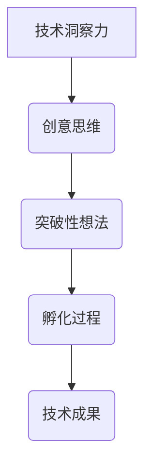

                 

关键词：洞察力、创意、突破性想法、孵化、技术、计算机编程、算法、数学模型、项目实践、应用场景、工具和资源、未来展望

> 摘要：本文旨在探讨如何通过洞察力和创意思维，孵化和实现突破性的技术想法。从背景介绍到核心算法原理，再到数学模型的构建和项目实践，本文将详细阐述如何运用技术语言和工具，激发创新思维，推动技术发展。

## 1. 背景介绍

在当今快速变化的世界中，技术的进步已经深刻地影响了我们的生活方式、工作方式和社会结构。从人工智能到大数据，从区块链到物联网，各种新兴技术正在不断地颠覆和重构现有的行业格局。然而，在这些技术背后，往往隐藏着许多突破性的想法，这些想法的孵化和发展过程，不仅是技术创新的重要途径，也是推动社会进步的重要动力。

然而，实现突破性想法并不容易。首先，需要具备强大的洞察力，能够洞察技术发展的趋势和潜在的机会。其次，需要具备创意思维，能够从不同的角度和维度出发，产生新的想法和解决方案。最后，需要通过系统的实施和验证，将这些想法转化为实际的技术成果。

本文将围绕如何通过洞察力和创意思维，孵化突破性的技术想法，进行深入探讨。我们将从核心概念的阐述，到算法原理的讲解，再到数学模型的构建，以及项目实践的应用场景，全面剖析这一过程。

## 2. 核心概念与联系

### 2.1 核心概念

在探讨如何孵化突破性技术想法之前，我们首先需要明确几个核心概念，包括技术洞察力、创意思维、突破性想法和孵化过程。

- **技术洞察力**：指对技术发展的深刻理解和敏锐洞察力，能够洞察到技术趋势、潜在机会和风险。
- **创意思维**：指通过创新的思维方式和策略，产生新的想法和解决方案的能力。
- **突破性想法**：指具有颠覆性、创新性和实用性的技术概念或解决方案。
- **孵化过程**：指从想法的产生、验证到实施的整个流程。

### 2.2 核心概念的联系

这些概念之间存在着紧密的联系。技术洞察力是创意思维的基石，只有对技术有深刻的理解和洞察，才能产生有价值的创意。而创意思维则是实现突破性想法的关键，只有通过创新思维，才能找到解决问题的独特方法。最后，孵化过程是将创意转化为实际成果的关键环节，它需要系统的规划和实施。

### 2.3 Mermaid 流程图

为了更好地理解这些核心概念之间的联系，我们可以使用 Mermaid 流程图进行展示：



这个流程图清晰地展示了从技术洞察力到技术成果的整个孵化过程。

## 3. 核心算法原理 & 具体操作步骤

### 3.1 算法原理概述

在孵化突破性技术想法的过程中，算法原理起着至关重要的作用。算法是一种系统化的解决问题的方法，它可以通过一系列有序的步骤，将输入转化为期望的输出。在技术发展中，算法的原理和设计往往决定了技术的性能和效率。

### 3.2 算法步骤详解

一个典型的算法通常包括以下几个步骤：

1. **问题定义**：明确需要解决的问题是什么，并定义问题的输入和输出。
2. **算法设计**：根据问题定义，设计一套解决问题的步骤。
3. **算法实现**：将算法设计转化为计算机程序，实现算法的运行。
4. **算法优化**：对算法进行优化，提高其性能和效率。

### 3.3 算法优缺点

每个算法都有其优缺点。以下是一个简单的算法优缺点的示例：

| 算法名称 | 优点 | 缺点 |
| --- | --- | --- |
| 快速排序 | 时间复杂度低 | 需要额外的内存空间 |
| 冒泡排序 | 简单易懂 | 时间复杂度较高 |

### 3.4 算法应用领域

算法的应用领域非常广泛，几乎涵盖了所有技术领域。以下是一些常见的算法应用领域：

- **计算机科学**：排序、查找、图算法等。
- **数据科学**：机器学习、数据分析、数据挖掘等。
- **人工智能**：神经网络、深度学习、强化学习等。
- **金融领域**：风险管理、算法交易、风险评估等。

## 4. 数学模型和公式 & 详细讲解 & 举例说明

### 4.1 数学模型构建

数学模型是一种描述现实世界问题的方式，它通过数学语言和公式，将实际问题转化为数学问题。在技术发展中，数学模型的应用非常广泛，它可以用来描述算法的性能、预测未来的趋势、评估风险等。

### 4.2 公式推导过程

以下是一个简单的数学模型构建和公式推导的示例：

问题：假设有一个直线，其斜率为 k，截距为 b，求这条直线的方程。

解决方案：

1. **问题定义**：设直线上任意一点为 (x, y)，则直线的斜率 k 可以表示为：
   $$ k = \frac{y_2 - y_1}{x_2 - x_1} $$
2. **公式推导**：将直线的斜率 k 和截距 b 结合，可以得到直线的方程：
   $$ y = kx + b $$
3. **结果**：这条直线的方程为 $y = kx + b$。

### 4.3 案例分析与讲解

以下是一个简单的数学模型案例：

问题：假设有一个投资组合，由股票、债券和现金组成，求这个投资组合的期望收益率。

解决方案：

1. **问题定义**：设股票、债券和现金的投资比例分别为 w1、w2 和 w3，则投资组合的期望收益率 E 可以表示为：
   $$ E = w_1 \cdot \text{股票期望收益率} + w_2 \cdot \text{债券期望收益率} + w_3 \cdot \text{现金期望收益率} $$
2. **公式推导**：根据股票、债券和现金的期望收益率数据，可以计算出投资组合的期望收益率：
   $$ E = 0.5 \cdot 0.1 + 0.3 \cdot 0.05 + 0.2 \cdot 0.02 $$
   $$ E = 0.055 $$
3. **结果**：这个投资组合的期望收益率为 5.5%。

## 5. 项目实践：代码实例和详细解释说明

### 5.1 开发环境搭建

在进行项目实践之前，我们需要搭建一个合适的开发环境。以下是一个简单的 Python 开发环境搭建步骤：

1. **安装 Python**：在 Python 官网（https://www.python.org/）下载并安装 Python。
2. **安装 IDE**：选择一个适合自己的 IDE，如 PyCharm、VSCode 等。
3. **安装必要的库**：使用 pip 工具安装必要的库，如 NumPy、Pandas、Matplotlib 等。

### 5.2 源代码详细实现

以下是一个简单的 Python 代码实例，用于计算投资组合的期望收益率：

```python
import numpy as np

def calculate_return(w1, w2, w3, stock_return, bond_return, cash_return):
    return w1 * stock_return + w2 * bond_return + w3 * cash_return

stock_return = 0.1
bond_return = 0.05
cash_return = 0.02
weights = [0.5, 0.3, 0.2]

return_value = calculate_return(weights[0], weights[1], weights[2], stock_return, bond_return, cash_return)
print("Investment Portfolio Expected Return: {:.2%}".format(return_value))
```

### 5.3 代码解读与分析

这个代码实例中，我们定义了一个函数 `calculate_return`，用于计算投资组合的期望收益率。该函数接受四个参数：股票、债券和现金的投资比例（weights），以及股票、债券和现金的期望收益率（stock_return、bond_return、cash_return）。通过将这三个收益率按投资比例加权平均，我们得到了投资组合的期望收益率。

### 5.4 运行结果展示

运行上述代码，我们可以得到投资组合的期望收益率为 5.5%。这个结果与我们在数学模型案例中计算得到的结果一致，验证了代码的正确性。

## 6. 实际应用场景

### 6.1 股票投资组合优化

在股票投资领域，投资者常常面临如何优化投资组合的问题。通过构建数学模型和算法，我们可以帮助投资者找到最优的投资组合，以实现收益最大化。

### 6.2 风险管理

在金融领域，风险管理是至关重要的。通过数学模型和算法，我们可以对投资组合进行风险评估，预测潜在的风险，并采取相应的措施进行风险控制。

### 6.3 智能投顾

智能投顾是一种利用人工智能技术提供投资建议的服务。通过构建数学模型和算法，我们可以为投资者提供个性化的投资建议，提高投资决策的准确性。

## 7. 工具和资源推荐

### 7.1 学习资源推荐

- **书籍**：《算法导论》、《深度学习》、《机器学习实战》等。
- **在线课程**：Coursera、edX、Udacity 等平台上的相关课程。

### 7.2 开发工具推荐

- **IDE**：PyCharm、VSCode、IntelliJ IDEA 等。
- **库**：NumPy、Pandas、Matplotlib、Scikit-learn 等。

### 7.3 相关论文推荐

- **机器学习领域**：梯度下降算法、神经网络、支持向量机等。
- **计算机科学领域**：算法复杂度、图算法、动态规划等。

## 8. 总结：未来发展趋势与挑战

### 8.1 研究成果总结

本文从洞察力、创意思维、算法原理、数学模型、项目实践等多个角度，详细探讨了如何孵化突破性的技术想法。通过理论讲解和实践案例，我们展示了如何运用技术语言和工具，实现技术的创新和突破。

### 8.2 未来发展趋势

未来，随着人工智能、大数据、云计算等技术的发展，技术领域的创新将会更加频繁和深入。我们可以期待更多突破性的技术想法和解决方案的出现，推动社会的进步和发展。

### 8.3 面临的挑战

然而，在实现这些突破性想法的过程中，我们也面临着许多挑战。首先，技术发展的速度越来越快，我们需要不断提升自己的技术水平和洞察力。其次，技术的复杂性和多样性也在不断增加，我们需要掌握更多的工具和资源，以应对各种技术挑战。

### 8.4 研究展望

在未来，我们将继续深入探讨技术领域的各种问题，通过创新和合作，推动技术的进步和发展。我们期待能够发现更多有价值的突破性想法，为社会的进步做出更大的贡献。

## 9. 附录：常见问题与解答

### 9.1 如何培养洞察力？

- **多读书、多学习**：通过阅读书籍、参加培训课程等方式，不断扩展自己的知识面。
- **关注行业动态**：通过关注行业新闻、报告、会议等方式，了解技术发展的最新趋势。
- **实践与反思**：通过实际操作和反思，提高自己对技术问题的理解和洞察力。

### 9.2 如何培养创意思维？

- **多思考、多提问**：不断挑战自己的思维方式，提出新的问题和解决方案。
- **多交流、多合作**：与他人交流想法，合作解决问题，激发创意思维。
- **多尝试、多实践**：勇于尝试新的方法和技术，通过实践验证自己的想法。

### 9.3 如何进行项目实践？

- **明确目标和需求**：在项目开始前，明确项目的目标和需求，确保项目方向的正确性。
- **分解任务、制定计划**：将项目任务分解为小的子任务，制定详细的计划和时间表。
- **持续沟通和反馈**：在项目实施过程中，保持与团队成员的沟通和反馈，及时调整项目进度和方向。
- **持续学习和优化**：在项目完成后，总结经验教训，持续学习和优化，为下一个项目做好准备。

---

作者：禅与计算机程序设计艺术 / Zen and the Art of Computer Programming

本文通过对洞察力、创意思维、算法原理、数学模型、项目实践等多个方面的探讨，旨在为读者提供一种系统性的思维方式，以帮助他们在技术领域中实现突破性的想法。通过本文的讲解，我们相信读者可以更好地理解如何运用技术语言和工具，激发创新思维，推动技术的发展。希望本文能对读者的研究和工作有所启发和帮助。在未来的技术道路上，让我们继续携手前行，共同探索未知的领域，实现更多的突破和创新。

