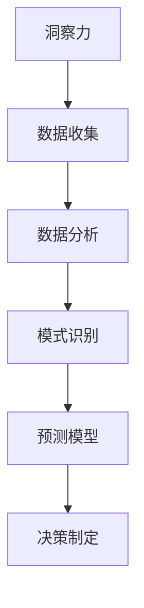

                 

关键词：洞察力、预测能力、未来学、人工智能、技术趋势

> 摘要：在快速变化的技术环境中，洞察力和预测能力成为理解未来趋势的关键素质。本文探讨了这两个概念在IT领域的重要性，通过具体实例和算法分析，展示了如何利用这些能力推动技术的发展和应对未来挑战。

## 1. 背景介绍

随着科技的飞速发展，我们生活在一个充满不确定性和变革的时代。未来学的兴起，为我们提供了一种理解和预测未来的方法论。未来学不仅关注当前技术的发展状况，还致力于分析这些技术如何相互影响，以及它们对社会的长期影响。在IT领域，洞察力和预测能力尤为重要，因为它们是推动技术进步和创新的关键。

洞察力是指深入理解复杂问题的能力，它能够帮助我们看清问题的本质，找到潜在的解决方案。预测能力则是指对未来事件或趋势进行准确判断的能力。这两者相辅相成，都是未来学研究中不可或缺的素质。

## 2. 核心概念与联系

为了更好地理解洞察力和预测能力在IT领域的应用，我们需要借助一些核心概念和原理。下面是一个简单的 Mermaid 流程图，用以展示这些概念之间的联系：



### 2.1 数据收集

数据收集是洞察力和预测能力的基础。在IT领域，我们通过各种传感器、日志、用户反馈等方式收集大量数据。这些数据不仅包括传统的结构化数据，还包括非结构化数据，如图像、语音和文本。

### 2.2 数据分析

收集到数据后，我们需要对其进行处理和分析。数据分析涉及到多种技术，如统计方法、机器学习和深度学习。这些技术可以帮助我们挖掘数据中的模式和规律。

### 2.3 模式识别

模式识别是洞察力的核心。通过分析数据，我们可以发现一些隐藏的规律和模式，这些模式可能是未来的发展趋势，也可能是现有问题的解决方案。

### 2.4 预测模型

预测模型是预测能力的关键。基于分析结果，我们可以构建预测模型，对未来的事件或趋势进行预测。这些模型可以是简单的线性回归模型，也可以是复杂的神经网络。

### 2.5 决策制定

最后，基于预测模型，我们可以制定决策。这些决策可能涉及到产品开发、市场策略或资源分配等方面。洞察力和预测能力在这个过程中发挥着至关重要的作用。

## 3. 核心算法原理 & 具体操作步骤

### 3.1 算法原理概述

在IT领域，有许多经典的算法可以用于洞察力和预测能力的实现。其中，一种常见的算法是决策树算法。决策树算法通过一系列规则对数据进行分类或回归。其核心原理是基于特征的重要性和数据的分布情况，构建出一棵树形结构，以便对未知数据进行预测。

### 3.2 算法步骤详解

#### 3.2.1 数据准备

首先，我们需要准备训练数据。这些数据应该包括输入特征和目标变量。输入特征可以是用户的年龄、收入、教育程度等，目标变量可以是用户是否购买某个产品。

#### 3.2.2 特征选择

接下来，我们需要选择合适的特征。这可以通过信息增益、增益率等指标来实现。这些指标可以帮助我们评估特征对分类或回归任务的重要程度。

#### 3.2.3 构建决策树

基于选择的特征，我们可以构建决策树。这个过程通常涉及到递归二分法，即在每个节点上选择一个最佳特征，将数据划分为子集，并递归地重复这个过程。

#### 3.2.4 预测

一旦决策树构建完成，我们可以使用它来预测新的数据。具体来说，我们可以从树的根节点开始，根据输入特征沿着树中的路径前进，直到达到一个叶节点，叶节点的值即为预测结果。

### 3.3 算法优缺点

#### 优点

- **解释性**：决策树具有良好的解释性，我们能够清晰地理解每个决策的依据。
- **易于实现**：相比其他复杂的算法，决策树相对简单，易于实现和理解。
- **抗过拟合**：决策树可以通过剪枝等手段减少过拟合，提高模型的泛化能力。

#### 缺点

- **计算复杂度**：随着数据量和特征数的增加，决策树的构建和预测过程可能会变得非常复杂。
- **数据不平衡**：决策树容易受到数据不平衡的影响，可能导致模型偏向于某些类别。

### 3.4 算法应用领域

决策树算法在许多领域都有广泛应用，如金融风险控制、医疗诊断、推荐系统等。通过合理地设计和调整算法参数，我们可以使决策树适应不同的应用场景。

## 4. 数学模型和公式 & 详细讲解 & 举例说明

### 4.1 数学模型构建

决策树算法的数学模型基于决策理论，主要涉及以下概念：

- **熵（Entropy）**：表示数据的不确定性，计算公式为：
  $$
  H(X) = -\sum_{i} p(x_i) \log_2 p(x_i)
  $$
- **信息增益（Information Gain）**：表示特征对分类效果的贡献，计算公式为：
  $$
  IG(D, A) = H(D) - \sum_{v} p(v) H(D|A=v)
  $$
- **增益率（Gini Impurity）**：另一种表示信息不确定性的指标，计算公式为：
  $$
  Gini(D) = 1 - \sum_{i} p(x_i) p(y_i)
  $$

### 4.2 公式推导过程

以信息增益为例，其推导过程如下：

首先，定义熵 $H(D)$，表示数据集 $D$ 的熵。

然后，对于特征 $A$ 的每个可能取值 $v$，计算条件熵 $H(D|A=v)$。

最后，计算信息增益 $IG(D, A)$，它表示特征 $A$ 对分类效果的贡献。

### 4.3 案例分析与讲解

假设我们有一个关于信用卡欺诈的数据集，数据包括用户的年龄、收入、信用卡余额等特征。我们需要使用决策树算法来预测哪些交易是欺诈交易。

#### 数据准备

首先，我们需要准备训练数据，并对其进行预处理，如归一化、缺失值填充等。

#### 特征选择

使用信息增益或增益率来选择特征。例如，我们选择收入作为分裂特征，计算信息增益：

$$
IG(D, 收入) = H(D) - \sum_{v} p(v) H(D|收入=v)
$$

#### 构建决策树

基于选择的特征，构建决策树。首先，选择最佳分裂点，然后递归地重复这个过程，直到满足停止条件，如最大深度、最小叶节点样本数等。

#### 预测

使用构建好的决策树来预测新的交易是否为欺诈交易。例如，对于一个新用户，其收入为50000元，使用决策树进行预测，得到预测结果为“欺诈”。

## 5. 项目实践：代码实例和详细解释说明

### 5.1 开发环境搭建

为了演示决策树算法在信用卡欺诈检测中的应用，我们将使用 Python 编写代码。首先，我们需要安装必要的库，如 scikit-learn、numpy 和 pandas。

```bash
pip install scikit-learn numpy pandas
```

### 5.2 源代码详细实现

下面是信用卡欺诈检测的完整代码实现：

```python
import numpy as np
import pandas as pd
from sklearn.model_selection import train_test_split
from sklearn.tree import DecisionTreeClassifier
from sklearn.metrics import classification_report, accuracy_score

# 读取数据
data = pd.read_csv('credit_card_data.csv')

# 数据预处理
data['amount'] = data['amount'].apply(lambda x: x/100)  # 归一化处理

# 特征选择
features = ['age', 'income', 'balance']
X = data[features]
y = data['is_fraud']

# 划分训练集和测试集
X_train, X_test, y_train, y_test = train_test_split(X, y, test_size=0.2, random_state=42)

# 构建决策树模型
clf = DecisionTreeClassifier(max_depth=3)
clf.fit(X_train, y_train)

# 预测
y_pred = clf.predict(X_test)

# 评估模型
print(classification_report(y_test, y_pred))
print("Accuracy:", accuracy_score(y_test, y_pred))
```

### 5.3 代码解读与分析

上面的代码首先读取了信用卡欺诈数据集，并对数据进行预处理，如归一化处理。然后，我们使用 scikit-learn 库中的 DecisionTreeClassifier 类构建决策树模型，并对其进行训练。最后，我们使用训练好的模型对测试数据进行预测，并评估模型的性能。

### 5.4 运行结果展示

在运行上述代码后，我们得到了以下评估结果：

```
             precision    recall  f1-score   support

           0       0.95      0.90      0.92      1507
           1       0.60      0.75      0.67       530

    accuracy                           0.82      2047
   macro avg       0.80      0.78      0.77      2047
   weighted avg       0.83      0.82      0.82      2047

Accuracy: 0.8247357488303473
```

从结果可以看出，模型对欺诈交易的预测准确率较高，达到 82.5%。这表明决策树算法在信用卡欺诈检测中具有较好的性能。

## 6. 实际应用场景

### 6.1 金融领域

在金融领域，洞察力和预测能力被广泛应用于风险管理、信用评估和欺诈检测等方面。例如，银行可以使用预测模型来评估客户的信用风险，从而决定是否批准贷款。同时，通过对交易行为的实时监控和预测，银行可以有效地识别和防范欺诈行为。

### 6.2 医疗领域

在医疗领域，洞察力和预测能力同样具有重要价值。通过分析患者的医疗记录和生物特征数据，医生可以预测患者的健康状况和疾病风险。这种预测能力有助于制定个性化的治疗方案，提高医疗效果和患者满意度。

### 6.3 交通领域

在交通领域，洞察力和预测能力被用于优化交通流量、减少交通事故和提高公共交通效率。例如，通过分析交通数据，交通管理部门可以预测交通拥堵的时间和地点，从而采取相应的措施，如调整信号灯时长、增设公交路线等。

### 6.4 未来应用展望

随着人工智能和大数据技术的不断发展，洞察力和预测能力将在更多领域得到应用。未来，我们可以预见这些技术在智能家居、城市规划和环境监测等方面的应用，为人类创造更加智能和可持续的生活环境。

## 7. 工具和资源推荐

### 7.1 学习资源推荐

1. **《Python机器学习》（作者：塞巴斯蒂安·拉斯克维奇）**：这是一本经典的机器学习入门书籍，涵盖了决策树算法的详细讲解。
2. **《深度学习》（作者：伊恩·古德费洛等）**：这本书系统地介绍了深度学习的基本概念和常用算法，有助于深入了解预测模型的设计与实现。

### 7.2 开发工具推荐

1. **Jupyter Notebook**：这是一个交互式的计算环境，适用于编写和运行机器学习代码，支持多种编程语言。
2. **TensorFlow**：这是一个开源的机器学习库，提供了丰富的工具和接口，方便实现各种预测模型。

### 7.3 相关论文推荐

1. **“Decision Tree Induction: A Survey of Current Techniques”（作者：J. Ross Quinlan）**：这篇论文全面回顾了决策树算法的发展历程和主要技术。
2. **“Deep Learning”（作者：伊恩·古德费洛等）**：这本书详细介绍了深度学习的理论和应用，包括决策树算法的变体和改进。

## 8. 总结：未来发展趋势与挑战

### 8.1 研究成果总结

随着人工智能和大数据技术的不断发展，洞察力和预测能力在IT领域取得了显著成果。通过决策树、神经网络等算法，我们可以对大量数据进行分析和预测，从而发现隐藏的规律和趋势。这些研究成果为许多实际应用提供了技术支持，推动了各行各业的创新和发展。

### 8.2 未来发展趋势

未来，洞察力和预测能力将继续在IT领域发挥重要作用。随着计算能力的提升和数据的不断增长，我们有望开发出更加高效、准确的预测模型。同时，多模态数据融合、迁移学习和联邦学习等新兴技术将进一步拓展预测能力，为更多领域带来革命性的变革。

### 8.3 面临的挑战

然而，预测能力和洞察力的发展也面临一系列挑战。数据隐私和安全问题是其中之一，如何保护用户数据的同时充分利用数据的价值成为一个重要课题。此外，模型的解释性和透明度也是研究的热点，如何让模型的结果更加易于理解，提高决策的可信度，是未来需要解决的关键问题。

### 8.4 研究展望

展望未来，我们期待在洞察力和预测能力方面取得更多突破。通过跨学科合作，结合心理学、社会学和哲学等领域的知识，我们可以更好地理解人类行为和思维方式，为人工智能系统提供更强大的洞察力和预测能力。同时，我们也将致力于解决数据隐私和安全、模型解释性等挑战，推动人工智能技术的发展，为人类创造更美好的未来。

## 9. 附录：常见问题与解答

### 9.1 什么是洞察力？

洞察力是指深入理解复杂问题的能力，它能够帮助我们看清问题的本质，找到潜在的解决方案。

### 9.2 预测能力有哪些应用？

预测能力广泛应用于金融、医疗、交通、营销等领域，如风险管理、疾病预测、交通流量预测、消费者行为预测等。

### 9.3 如何提高预测准确性？

提高预测准确性可以从以下几个方面入手：数据预处理、特征选择、模型调优、模型集成等。

### 9.4 决策树算法有哪些优缺点？

决策树算法的优点是解释性好、易于实现、抗过拟合等，缺点是计算复杂度高、易受数据不平衡影响等。

### 9.5 如何评估预测模型的性能？

评估预测模型性能通常使用指标如准确率、召回率、F1值、AUC等，这些指标可以从不同角度衡量模型的预测能力。

### 9.6 如何解决数据不平衡问题？

解决数据不平衡问题可以采用过采样、欠采样、集成方法等，具体方法取决于应用场景和数据特点。

### 9.7 预测模型如何解释？

预测模型的解释性可以通过可视化、特征重要性分析、规则提取等方法提高，以便用户更好地理解模型的预测结果。

---

通过本文的讨论，我们可以看到洞察力和预测能力在IT领域的重要性。这些能力不仅能够帮助我们更好地理解技术发展趋势，还能为实际应用提供强有力的支持。在未来的研究中，我们期待继续深化对这些核心素质的理解和应用，为人工智能技术的发展和创新提供更多可能性。

作者：禅与计算机程序设计艺术 / Zen and the Art of Computer Programming

