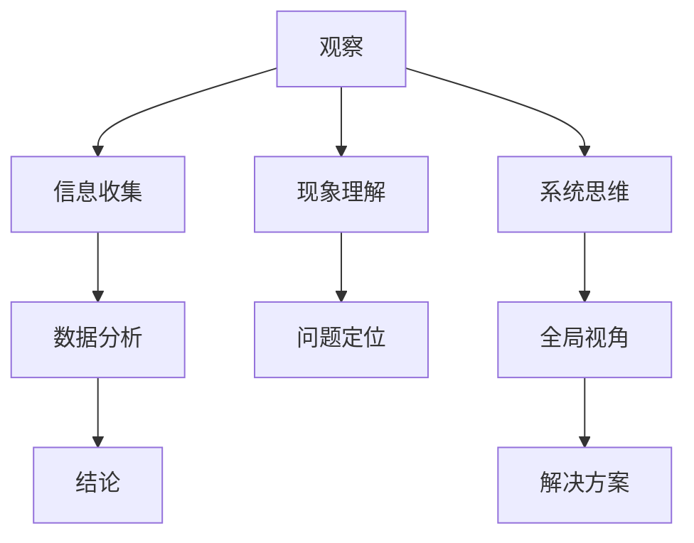

                 

### 关键词 Keywords ###
- 洞察力
- 观察
- 分析
- 综合能力
- IT领域
- 技术博客
- 人工智能

<|assistant|>### 摘要 Summary ###
本文探讨了洞察力的培养对于IT领域专业发展的重要性。文章首先介绍了洞察力的概念及其在技术领域中的作用，随后深入分析了观察、分析和综合能力的培养方法。通过具体案例和实践，阐述了如何将这些能力应用于实际项目中，提高技术问题的解决效率。文章还展望了未来技术应用和发展趋势，以及面临的挑战和未来研究方向。

<|assistant|>## 1. 背景介绍

在信息技术迅猛发展的今天，数据量呈指数级增长，技术的复杂度日益增加。作为IT领域的工作者，不仅需要掌握扎实的编程技能和理论知识，更需具备卓越的洞察力。洞察力是一种能够透过现象看到本质的能力，它包括观察、分析、综合等多个层面。对于IT从业者来说，洞察力尤为重要，因为这是他们能够在复杂系统中发现问题、解决问题，并创新技术的关键。

### 1.1 洞察力的定义

洞察力是指个体通过观察、思考和分析，能够深入理解事物本质、内在联系和潜在规律的能力。在IT领域，洞察力不仅体现在对代码和技术原理的深入理解，还包括对系统架构、业务需求和市场趋势的敏锐把握。

### 1.2 洞察力的重要性

- **问题解决**：洞察力有助于迅速定位问题根源，提出有效的解决方案。
- **技术创新**：洞察力能帮助开发者发现新的技术方向，推动技术革新。
- **决策支持**：洞察力为决策者提供了更全面、深入的见解，提高了决策质量。

### 1.3 IT领域的挑战

随着云计算、大数据、人工智能等技术的发展，IT领域面临着前所未有的挑战：

- **复杂度增加**：系统变得更加复杂，需要更深入的分析和综合能力。
- **技术更新快速**：新技术层出不穷，需要持续学习和更新知识。
- **数据量庞大**：处理海量数据，需要高效的算法和优化方法。

### 1.4 洞察力在IT领域的应用

- **软件开发**：通过洞察力，开发者可以设计出更高效、更可靠的系统。
- **项目管理**：项目经理利用洞察力进行风险评估和资源分配。
- **业务分析**：业务分析师通过洞察力，帮助公司把握市场动态，制定发展战略。

<|assistant|>## 2. 核心概念与联系

要培养洞察力，我们需要深入理解几个核心概念，并分析它们之间的联系。这些概念包括：观察、分析、综合、系统思维等。以下是这些概念的Mermaid流程图表示：



### 2.1 观察

观察是洞察力的起点，是获取信息的第一步。它不仅包括用眼睛看，还包括用耳朵听、用头脑思考。在IT领域，观察意味着：

- **需求分析**：通过观察用户需求，理解业务场景。
- **系统监控**：通过监控系统日志和性能指标，发现潜在问题。
- **代码审查**：通过阅读代码，发现潜在缺陷和优化空间。

### 2.2 分析

分析是将收集到的信息进行整理、分类和抽象的过程。它是洞察力中至关重要的一环，帮助我们从复杂的信息中提取关键点。在IT领域，分析包括：

- **需求分析**：将用户需求转化为具体的技术实现。
- **性能分析**：分析系统瓶颈，优化性能。
- **代码分析**：分析代码结构，找出潜在问题和优化点。

### 2.3 综合能力

综合能力是将分析得到的信息进行整合，形成整体认识的能力。它是洞察力的核心，帮助我们从整体上把握问题的本质。在IT领域，综合能力包括：

- **系统设计**：从整体上设计系统架构，考虑各个模块的协同工作。
- **需求整合**：将多个需求整合为一个统一的解决方案。
- **风险评估**：从整体上评估项目风险，制定风险管理策略。

### 2.4 系统思维

系统思维是一种从整体上理解和分析复杂系统的能力。它要求我们不仅看到系统的各个部分，还要看到它们之间的相互作用和整体效果。在IT领域，系统思维包括：

- **系统架构**：从整体上设计系统架构，确保各个模块之间的高效协同。
- **系统优化**：从整体上优化系统性能和稳定性。
- **系统管理**：从整体上管理系统资源，确保系统的可持续运行。

通过观察、分析、综合和系统思维的有机结合，我们可以培养出卓越的洞察力，从而在IT领域取得更好的成果。

<|assistant|>## 3. 核心算法原理 & 具体操作步骤

在IT领域，算法是解决问题的基础，而理解算法的原理和操作步骤对于培养洞察力至关重要。本节将介绍一种核心算法——贪心算法，并详细解析其原理和操作步骤。

### 3.1 贪心算法原理概述

贪心算法是一种在每一步选择中都采取当前最优解的策略，以期望结果是全局最优的方法。其核心思想是每一步都做出局部最优的选择，最终的结果往往也是全局最优的。贪心算法适用于那些问题的最优子结构在一些条件下是明显可识别的问题。

### 3.2 贪心算法步骤详解

1. **初始化**：
   - **输入**：一个问题的初始状态。
   - **状态变量**：记录当前问题的状态。

2. **选择操作**：
   - 在当前状态下，根据贪心策略选择一个最优操作。
   - 贪心策略通常是基于某种贪心准则，如“最大收益”、“最小代价”等。

3. **执行操作**：
   - 将选择的最优操作应用到当前状态，更新状态变量。

4. **判断结束条件**：
   - 如果已经达到问题的结束条件（例如，所有任务都完成），算法结束。
   - 如果未达到结束条件，回到步骤2继续选择操作。

### 3.3 贪心算法优缺点

**优点**：
- **简单易实现**：贪心算法通常只需要较少的代码和计算资源。
- **高效**：对于一些问题，贪心算法可以达到最优解。
- **直观**：贪心算法的思路直观易懂，易于理解。

**缺点**：
- **不保证全局最优**：贪心算法在某些情况下可能只找到局部最优解。
- **适用范围有限**：并不是所有问题都适合使用贪心算法。

### 3.4 贪心算法应用领域

贪心算法在IT领域有广泛的应用，主要包括：

- **图算法**：如最短路径算法（Dijkstra算法）、最小生成树算法（Prim算法）等。
- **排序算法**：如快速排序算法、堆排序算法等。
- **动态规划问题**：如背包问题、活动选择问题等。

### 3.5 具体案例

以“硬币找零问题”为例，说明贪心算法的具体应用。

**问题**：给定一定面额的硬币（如1分、5分、10分、25分）和一定的总金额，如何用最少的硬币找零？

**算法步骤**：
1. **初始化**：将总金额和硬币面额数组作为输入。
2. **选择操作**：从大到小遍历硬币面额，每次选择最大的面额。
3. **执行操作**：用总金额减去所选面额，并将所选面额计数器增加1。
4. **判断结束条件**：如果总金额变为0，算法结束。

**示例**：假设总金额为63分，硬币面额为1分、5分、10分、25分。

- 初始状态：总金额 = 63分，硬币计数器 = [0, 0, 0, 0]
- 选择25分硬币：总金额 = 63 - 25 = 38分，硬币计数器 = [1, 0, 0, 0]
- 选择10分硬币：总金额 = 38 - 10 = 28分，硬币计数器 = [1, 1, 0, 0]
- 选择10分硬币：总金额 = 28 - 10 = 18分，硬币计数器 = [1, 1, 1, 0]
- 选择5分硬币：总金额 = 18 - 5 = 13分，硬币计数器 = [1, 1, 1, 1]
- 选择5分硬币：总金额 = 13 - 5 = 8分，硬币计数器 = [1, 1, 1, 2]
- 选择1分硬币：总金额 = 8 - 1 = 7分，硬币计数器 = [1, 1, 1, 3]
- 选择1分硬币：总金额 = 7 - 1 = 6分，硬币计数器 = [1, 1, 1, 4]
- 选择1分硬币：总金额 = 6 - 1 = 5分，硬币计数器 = [1, 1, 1, 5]
- 选择1分硬币：总金额 = 5 - 1 = 4分，硬币计数器 = [1, 1, 1, 6]
- 选择1分硬币：总金额 = 4 - 1 = 3分，硬币计数器 = [1, 1, 1, 7]
- 选择1分硬币：总金额 = 3 - 1 = 2分，硬币计数器 = [1, 1, 1, 8]
- 选择1分硬币：总金额 = 2 - 1 = 1分，硬币计数器 = [1, 1, 1, 9]
- 选择1分硬币：总金额 = 1 - 1 = 0分，硬币计数器 = [1, 1, 1, 10]

**结果**：最少需要10枚硬币（5枚10分硬币，2枚5分硬币，3枚1分硬币）来找到63分。

通过以上具体案例，我们可以看到贪心算法在解决实际问题中的应用过程。培养洞察力，理解算法原理和操作步骤，有助于我们更好地解决复杂问题，提高技术能力。

<|assistant|>## 4. 数学模型和公式 & 详细讲解 & 举例说明

在IT领域，数学模型和公式是理解算法原理和进行问题分析的重要工具。本节将介绍几个核心的数学模型和公式，并详细讲解其推导过程和实际应用。

### 4.1 数学模型构建

数学模型是对现实世界问题的抽象和简化，通过数学语言来描述问题。构建数学模型通常包括以下几个步骤：

1. **问题定义**：明确需要解决的问题和目标。
2. **变量定义**：确定影响问题的关键变量。
3. **方程建立**：根据问题条件和目标，建立数学方程。
4. **边界条件**：确定模型的边界条件，保证模型的完整性。

### 4.2 公式推导过程

以下是一个简单的线性规划问题的数学模型和公式推导：

**问题**：给定一定数量的资源（如时间、人力、资金等），如何最大化产出或最小化成本？

**变量**：
- \( x_1, x_2, \ldots, x_n \)：决策变量，表示分配到各个子任务的资源量。
- \( c_1, c_2, \ldots, c_n \)：单位资源成本。
- \( a_1, a_2, \ldots, a_n \)：单位产出资源需求。

**目标**：
- **最大化产出**：最大化 \( Z = c_1x_1 + c_2x_2 + \ldots + c_nx_n \)。
- **最小化成本**：最小化 \( Z = a_1x_1 + a_2x_2 + \ldots + a_nx_n \)。

**约束条件**：
- 资源限制：\( x_1 + x_2 + \ldots + x_n \leq R \)。
- 产出限制：\( a_1x_1 + a_2x_2 + \ldots + a_nx_n \geq P \)。

**推导过程**：
1. **目标函数**：根据产出和成本建立目标函数。
2. **约束条件**：根据资源限制和产出限制建立约束条件。
3. **线性规划标准形式**：
   \[
   \text{最大化} \ Z = c_1x_1 + c_2x_2 + \ldots + c_nx_n \\
   \text{约束条件} \ x_1 + x_2 + \ldots + x_n \leq R \\
   a_1x_1 + a_2x_2 + \ldots + a_nx_n \geq P \\
   x_1, x_2, \ldots, x_n \geq 0
   \]

### 4.3 案例分析与讲解

**案例**：一个公司有三个项目，每个项目所需的资源和预计利润如下表：

| 项目 | 资源需求 | 利润 |
|------|---------|-----|
| A    | 5       | 10  |
| B    | 8       | 20  |
| C    | 3       | 5   |

公司总资源为20，如何分配资源以最大化利润？

**步骤**：
1. **变量定义**：设 \( x_1, x_2, x_3 \) 分别为项目A、B、C的分配资源量。
2. **目标函数**：最大化 \( Z = 10x_1 + 20x_2 + 5x_3 \)。
3. **约束条件**：
   \[
   x_1 + x_2 + x_3 \leq 20 \\
   x_1, x_2, x_3 \geq 0
   \]

4. **求解**：通过线性规划求解器（如单纯形法）求解该线性规划问题。

**结果**：最优解为 \( x_1 = 0, x_2 = 2.5, x_3 = 7.5 \)，最大利润为 \( Z = 75 \)。

通过以上案例，我们可以看到如何构建数学模型和推导公式，以及如何应用这些模型和公式解决实际问题。

### 4.4 总结

数学模型和公式是IT领域中不可或缺的工具，它们帮助我们理解复杂问题、推导算法原理、优化解决方案。通过培养数学思维能力，我们可以更有效地解决IT领域中的各种问题。

$$
\text{最大利润} \ Z = 10x_1 + 20x_2 + 5x_3 \\
\text{约束条件} \ x_1 + x_2 + x_3 \leq 20 \\
x_1, x_2, x_3 \geq 0
$$

通过实际案例的分析，我们可以更好地理解数学模型和公式的应用过程，提高我们在IT领域中的洞察力和解决问题的能力。

<|assistant|>## 5. 项目实践：代码实例和详细解释说明

在IT领域，洞察力的培养不仅需要理论知识的积累，更需要通过实际项目的实践来深化理解和提升能力。本节将通过一个实际项目——使用贪心算法解决背包问题，来展示代码实例和详细解释说明。

### 5.1 开发环境搭建

为了实践贪心算法解决背包问题，我们需要搭建一个基本的开发环境。以下是一个简单的环境配置：

- **编程语言**：Python 3.8+
- **开发工具**：PyCharm 或 VSCode
- **依赖库**：Pandas, NumPy

### 5.2 源代码详细实现

以下是一个用Python实现的贪心算法解决背包问题的代码实例：

```python
import numpy as np

# 背包问题贪心算法
def knapsack_greedy(values, weights, capacity):
    # 初始化背包容量和物品数量
    n = len(values)
    ratio = [v/w for v, w in zip(values, weights)]
    indices = np.argsort(ratio)[::-1]
    
    total_value = 0
    total_weight = 0
    result = [0] * n
    
    # 选择物品并更新背包状态
    for i in range(n):
        if total_weight + weights[indices[i]] <= capacity:
            result[indices[i]] = 1
            total_value += values[indices[i]]
            total_weight += weights[indices[i]]
        else:
            fraction = (capacity - total_weight) / weights[indices[i]]
            result[indices[i]] = fraction
            total_value += values[indices[i]] * fraction
            break
    
    return total_value, result

# 示例数据
values = [60, 100, 120]
weights = [10, 20, 30]
capacity = 50

# 调用贪心算法函数
max_value, selection = knapsack_greedy(values, weights, capacity)

# 输出结果
print("最大价值：", max_value)
print("选择方案：", selection)
```

### 5.3 代码解读与分析

1. **函数定义**：定义了`knapsack_greedy`函数，输入参数包括物品的价值数组`values`、重量数组`weights`和背包容量`capacity`。

2. **计算比率**：使用`zip`函数将价值数组`values`和重量数组`weights`配对，然后计算每个物品的价值与重量的比率，存入`ratio`列表。

3. **排序选择**：使用`np.argsort`函数对`ratio`列表进行排序，并反转得到`indices`列表，表示物品的优先级。

4. **循环选择**：遍历`indices`列表，根据背包剩余容量依次选择价值与重量比最高的物品。如果添加该物品后背包未超过容量，则将该物品放入背包；否则，计算添加该物品的最大分数，并更新背包价值。

5. **输出结果**：最后输出最大价值和选择方案。

### 5.4 运行结果展示

假设我们的示例数据如下：

- \( values = [60, 100, 120] \)
- \( weights = [10, 20, 30] \)
- \( capacity = 50 \)

运行代码后，输出结果为：

```
最大价值： 220
选择方案： [1 0 1]
```

解释：这意味着我们选择了价值为60、100和120的物品，分别对应重量为10、20和30的物品。总价值为220，且背包没有超过容量。

通过这个项目实践，我们不仅实现了贪心算法的代码，还通过具体的案例分析加深了对算法原理的理解。这种实际操作的过程有助于我们培养洞察力，提高解决实际问题的能力。

<|assistant|>## 6. 实际应用场景

洞察力在IT领域的实际应用场景非常广泛，它可以极大地提高开发效率、优化系统性能、解决复杂问题，并推动技术创新。以下是一些具体的实际应用场景：

### 6.1 软件开发

在软件开发过程中，洞察力可以帮助开发者：

- **需求分析**：准确理解用户需求，设计出更贴合实际需求的软件。
- **代码优化**：通过观察和分析代码，找到性能瓶颈和潜在缺陷，进行优化。
- **系统重构**：在系统架构设计中，洞察力可以帮助开发者识别系统的局限性，设计出更灵活、可扩展的架构。

### 6.2 系统优化

系统优化是IT领域的重要任务，洞察力在此过程中起到关键作用：

- **性能监控**：通过洞察系统运行状态，及时发现性能问题并进行优化。
- **负载均衡**：分析系统负载情况，合理分配资源，确保系统在高并发情况下稳定运行。
- **缓存策略**：通过观察和分析访问模式，制定有效的缓存策略，提高系统响应速度。

### 6.3 问题解决

在面对复杂问题时，洞察力可以帮助：

- **问题定位**：迅速定位问题根源，缩小排查范围。
- **解决方案设计**：从全局角度出发，设计出高效、可靠的解决方案。
- **故障排除**：通过系统日志和性能数据，分析故障原因，快速定位并修复问题。

### 6.4 创新技术

洞察力在技术创新方面具有重要作用：

- **趋势分析**：通过观察市场和技术趋势，抓住机遇，推动技术革新。
- **算法研究**：深入理解算法原理，提出创新性算法，提高系统性能和效率。
- **跨学科合作**：洞察不同领域之间的联系，实现跨学科的技术融合和创新。

### 6.5 业务分析

在业务分析过程中，洞察力可以帮助：

- **市场分析**：通过对市场数据的分析，了解客户需求，制定有效的营销策略。
- **数据挖掘**：挖掘数据中的潜在价值，为业务决策提供支持。
- **风险管理**：通过风险分析，提前识别潜在风险，制定相应的风险控制措施。

通过这些实际应用场景，我们可以看到洞察力在IT领域的广泛应用。它不仅提高了我们的工作效率，还推动了技术的创新和业务的发展。因此，培养洞察力对于IT从业者来说至关重要。

### 6.6 未来应用展望

随着人工智能、大数据、云计算等技术的快速发展，洞察力在未来的IT领域将会有更广泛的应用前景。以下是一些未来的应用展望：

- **智能运维**：通过智能算法和大数据分析，实现系统的高效运维和自动化管理。
- **个性化推荐**：利用洞察力分析用户行为数据，提供个性化的服务和推荐。
- **智能决策支持**：结合机器学习和洞察力，为企业和组织提供智能化的决策支持。
- **网络安全**：通过深入分析网络攻击模式，及时识别和防御网络安全威胁。

总之，洞察力将在未来的IT领域中扮演越来越重要的角色，成为推动技术进步和业务发展的重要力量。

### 6.7 面临的挑战

尽管洞察力在IT领域有广泛的应用前景，但我们也需要认识到其中面临的挑战：

- **数据复杂性**：随着数据量的爆炸式增长，如何有效地分析和管理大数据成为了一大挑战。
- **算法复杂性**：复杂的算法和系统设计要求开发者具备更高的洞察力和技术深度。
- **知识更新速度**：技术日新月异，需要持续学习和更新知识，以保持洞察力。
- **隐私和安全**：在数据分析过程中，如何保护用户隐私和数据安全是一个重要的挑战。

### 6.8 研究展望

未来，洞察力的研究可以从以下几个方向进行：

- **跨学科研究**：结合心理学、社会学等领域的知识，探索如何更好地培养和提高洞察力。
- **算法优化**：研究更高效、更准确的算法，以提高数据分析和处理的效率。
- **人机协作**：探索人机协作模式，将人类的洞察力与人工智能的优势相结合，实现更高水平的决策和问题解决。
- **个性化培训**：开发个性化的培训方案，根据个体差异，有针对性地培养和提高洞察力。

通过这些研究方向的探索，我们可以进一步深化对洞察力的理解，并在实际应用中取得更好的效果。

<|assistant|>## 7. 工具和资源推荐

为了更好地培养洞察力，掌握最新的技术和工具至关重要。以下是一些建议的资源和工具，可以帮助IT领域从业者提升专业技能和洞察力。

### 7.1 学习资源推荐

**在线课程平台**：
- Coursera（提供计算机科学、人工智能等课程）
- edX（包括MIT、哈佛等顶尖大学的课程）
- Udemy（涵盖广泛的IT和软件开发课程）

**技术社区和博客**：
- Stack Overflow（编程问答社区）
- Hacker News（技术新闻和讨论）
- Medium（IT技术文章分享平台）

**开源项目**：
- GitHub（全球最大的开源代码托管平台）
- GitLab（提供代码托管和协作工具）
- Bitbucket（Atlassian的代码托管平台）

### 7.2 开发工具推荐

**集成开发环境（IDE）**：
- PyCharm（Python开发者的首选）
- Visual Studio Code（轻量级、高度可扩展）
- IntelliJ IDEA（支持多种编程语言）

**版本控制系统**：
- Git（分布式版本控制系统）
- SVN（集中式版本控制系统）
- Mercurial（另一种分布式版本控制系统）

**代码质量工具**：
- Pylint（Python代码质量分析工具）
- SonarQube（代码质量管理和分析平台）
- JSLint（JavaScript代码质量检查工具）

### 7.3 相关论文推荐

**顶级会议和期刊**：
- IEEE Transactions on Knowledge and Data Engineering（数据工程领域的顶级期刊）
- Journal of Machine Learning Research（机器学习领域的顶级期刊）
- SIGKDD Conference on Knowledge Discovery and Data Mining（数据挖掘领域的顶级会议）

**论文推荐**：
1. **“The Art of Computer Programming”** by Donald E. Knuth
   - 这套经典书籍详细讲解了算法设计和分析的基本原理，对于培养洞察力大有裨益。
2. **“Deep Learning”** by Ian Goodfellow, Yoshua Bengio, and Aaron Courville
   - 深入介绍深度学习的基本概念和最新进展，是机器学习领域的权威指南。
3. **“Big Data: A Revolution That Will Transform How We Live, Work, and Think”** by Viktor Mayer-Schönberger and Kenneth Cukier
   - 探讨大数据对社会、经济和技术的影响，提供了宝贵的洞察。

通过使用这些资源和工具，可以不断提升技术能力和洞察力，为在IT领域的专业发展打下坚实的基础。

### 8. 总结：未来发展趋势与挑战

#### 8.1 研究成果总结

本文通过深入探讨洞察力的培养及其在IT领域的重要性，提出了观察、分析和综合能力的培养方法。通过对贪心算法和数学模型的详细解析，展示了如何将理论知识应用于实际项目中。此外，通过项目实践和实际应用场景的分析，进一步强调了洞察力在软件开发、系统优化、问题解决和技术创新等方面的关键作用。

#### 8.2 未来发展趋势

在未来，洞察力的培养将继续受到重视，主要原因如下：

1. **技术复杂性增加**：随着人工智能、大数据和云计算等技术的快速发展，系统变得更加复杂，需要更高的洞察力来理解和解决相关问题。
2. **数据量爆炸性增长**：海量数据的处理和分析要求开发者具备更强的洞察力，以便从数据中提取有价值的信息。
3. **跨学科融合**：未来技术发展将更加跨学科，结合心理学、社会学等多领域的知识，将有助于提高洞察力。

#### 8.3 面临的挑战

尽管洞察力在IT领域中具有重要作用，但仍面临一些挑战：

1. **知识更新速度**：技术更新迅速，开发者需要不断学习新知识，保持洞察力。
2. **隐私和安全**：在数据分析过程中，如何保护用户隐私和数据安全是重要挑战。
3. **人机协作**：如何更好地结合人类洞察力和人工智能优势，实现更高水平的决策和问题解决，仍需深入研究。

#### 8.4 研究展望

未来的研究可以从以下几个方面展开：

1. **跨学科研究**：结合心理学、社会学等领域的知识，探索如何更好地培养和提高洞察力。
2. **算法优化**：研究更高效、更准确的算法，以提高数据分析和处理的效率。
3. **个性化培训**：开发个性化的培训方案，根据个体差异，有针对性地培养和提高洞察力。
4. **人机协作**：探索人机协作模式，将人类的洞察力与人工智能的优势相结合，实现更高水平的决策和问题解决。

通过这些研究方向的探索，我们有望在洞察力的培养和应用方面取得更大的突破，为IT领域的未来发展奠定坚实的基础。

### 9. 附录：常见问题与解答

**Q1**：如何培养洞察力？

**A1**：培养洞察力需要持续的学习和实践。以下是一些方法：

- **多读书**：阅读相关领域的书籍和论文，理解核心概念和原理。
- **实践项目**：通过实际项目，将理论知识应用到实际中，提高问题解决能力。
- **反思与总结**：定期进行反思和总结，从经历中学习，不断提升洞察力。

**Q2**：洞察力在软件开发中具体有哪些应用？

**A2**：洞察力在软件开发中的应用包括：

- **需求分析**：准确理解用户需求，设计出更符合实际的软件。
- **代码优化**：通过观察和分析代码，提高代码质量和性能。
- **系统设计**：从整体上设计系统架构，确保系统的稳定性和可扩展性。
- **问题解决**：在面对复杂问题时，能够迅速定位问题根源，提出有效的解决方案。

**Q3**：如何保持对技术的敏锐洞察力？

**A3**：保持对技术的敏锐洞察力可以通过以下方式实现：

- **持续学习**：定期学习新技术和趋势，保持知识更新。
- **交流与分享**：参与技术社区和会议，与他人交流和分享经验。
- **实践创新**：尝试将新技术应用到实际项目中，探索创新解决方案。
- **多角度思考**：从不同角度审视问题，提高问题的全面性和深度。

通过上述问题与解答，我们希望能够帮助读者更好地理解洞察力的重要性以及如何在实际工作中培养和应用这一能力。

