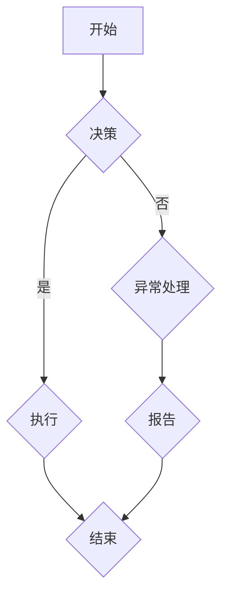
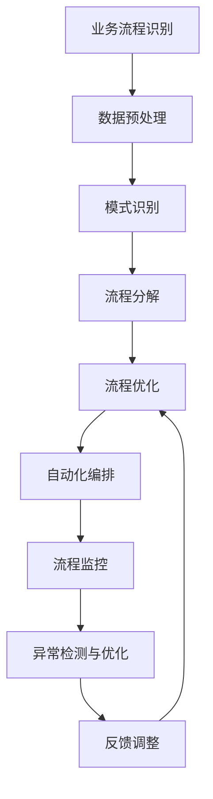

                 

 在现代信息技术迅猛发展的时代，流程拆解与AI的灵活编排成为提升业务效率、优化系统架构的关键手段。本文旨在探讨流程拆解的基本原理，结合AI技术的应用，阐述如何实现流程的智能化编排，从而提高企业的运营效率和竞争力。

## 文章关键词

- 流程拆解
- AI技术
- 智能编排
- 业务效率
- 系统架构

## 文章摘要

本文首先介绍了流程拆解的概念和重要性，然后详细阐述了AI技术在流程拆解中的应用，包括数据预处理、模式识别和自动化流程编排等。通过实际案例分析，本文展示了流程拆解与AI灵活编排如何帮助企业实现业务流程的自动化和智能化。最后，本文探讨了未来在这一领域的发展趋势与挑战，并提出了相应的建议。

## 1. 背景介绍

在过去的几十年中，信息技术的发展极大地推动了企业运营模式的变革。然而，随着业务的复杂性和数据量的爆炸性增长，传统的手工操作和流程管理方式逐渐暴露出效率低下、易出错等弊端。为了应对这一挑战，企业开始寻求更加智能化、自动化的解决方案。流程拆解与AI的灵活编排正是在这种背景下应运而生。

### 1.1 流程拆解的概念

流程拆解是指将复杂的业务流程分解为多个独立的、可操作的小步骤或任务，以便更有效地进行管理和优化。这一过程通常包括以下几个步骤：

1. **流程识别**：识别企业中存在的业务流程，包括输入、输出、关键节点和流程参与者。
2. **流程映射**：使用流程图等可视化工具将业务流程映射出来，以便更直观地理解整个流程。
3. **流程分解**：将复杂的业务流程拆解为多个子流程或任务，每个子流程或任务具有明确的输入、输出和操作步骤。
4. **流程优化**：对拆解后的流程进行分析和优化，以提高效率、减少错误和降低成本。

### 1.2 AI技术在流程拆解中的应用

AI技术，特别是机器学习和深度学习，在流程拆解中发挥了重要作用。以下是一些关键应用：

1. **数据预处理**：使用AI技术对大量业务数据进行清洗、归一化和特征提取，以便更好地进行后续处理。
2. **模式识别**：通过训练机器学习模型，识别业务流程中的潜在模式和规律，为自动化和智能化提供依据。
3. **自动化流程编排**：使用AI技术自动编排业务流程，减少人工干预，提高流程执行效率。
4. **异常检测与优化**：利用AI技术检测业务流程中的异常情况，并提出优化建议，以预防潜在的问题。

## 2. 核心概念与联系

在深入探讨流程拆解与AI的灵活编排之前，我们需要明确几个核心概念，并了解它们之间的相互关系。

### 2.1 业务流程管理

业务流程管理（Business Process Management, BPM）是一种管理和优化业务流程的方法。它包括流程设计、流程执行、流程监控和流程优化等环节。BPM的目的是提高企业运营效率、减少成本和提升客户满意度。

### 2.2 AI技术

AI技术是指人工智能的相关技术和应用，包括机器学习、深度学习、自然语言处理、计算机视觉等。AI技术在流程拆解和智能化编排中发挥着核心作用。

### 2.3 数据处理与分析

数据处理与分析是流程拆解和AI应用的基础。通过有效的数据预处理和分析，我们可以提取出有用的信息和知识，为后续的流程优化和智能化编排提供支持。

### 2.4 Mermaid 流程图

Mermaid是一种基于Markdown的图形描述语言，可以方便地绘制各种流程图。以下是一个简单的Mermaid流程图示例：



### 2.5 核心概念原理和架构的 Mermaid 流程图

以下是一个详细描述流程拆解与AI灵活编排核心概念和架构的Mermaid流程图：



## 3. 核心算法原理 & 具体操作步骤

### 3.1 算法原理概述

流程拆解与AI灵活编排的核心算法包括以下几个部分：

1. **数据预处理**：使用数据清洗、归一化和特征提取等技术，对原始业务数据进行预处理，以提高后续处理的准确性和效率。
2. **模式识别**：通过机器学习算法，从预处理的业务数据中识别出潜在的规律和模式，为自动化流程编排提供依据。
3. **流程分解**：基于识别出的模式和规律，将复杂的业务流程拆解为多个子流程或任务，每个子流程或任务具有明确的输入、输出和操作步骤。
4. **自动化编排**：使用AI技术，根据流程分解的结果，自动编排业务流程，减少人工干预，提高流程执行效率。
5. **流程监控与优化**：实时监控流程执行情况，利用异常检测算法识别异常情况，并提出优化建议，以预防潜在的问题。

### 3.2 算法步骤详解

1. **数据预处理**：

   - **数据清洗**：去除重复、错误和缺失的数据，提高数据质量。
   - **数据归一化**：将不同特征的数据统一处理，使其具有相似的尺度，便于后续分析。
   - **特征提取**：从原始数据中提取出有用的信息，为模式识别提供输入。

2. **模式识别**：

   - **选择合适的算法**：根据业务需求和数据特点，选择合适的机器学习算法，如决策树、支持向量机、神经网络等。
   - **训练模型**：使用训练数据集，训练机器学习模型，使其能够识别出业务数据中的潜在规律和模式。
   - **评估模型**：使用验证数据集，评估模型的准确性和泛化能力，调整模型参数，优化模型性能。

3. **流程分解**：

   - **定义输入和输出**：根据识别出的模式和规律，定义每个子流程或任务的输入和输出。
   - **分解业务流程**：将复杂的业务流程分解为多个子流程或任务，确保每个子流程或任务具有明确的操作步骤。

4. **自动化编排**：

   - **编排规则定义**：根据业务需求，定义自动编排的规则，包括任务执行顺序、依赖关系和资源分配等。
   - **自动化编排**：使用AI技术，根据编排规则，自动编排业务流程，生成执行计划。

5. **流程监控与优化**：

   - **实时监控**：实时监控流程执行情况，收集执行数据。
   - **异常检测**：使用异常检测算法，识别流程执行中的异常情况，如延迟、错误等。
   - **优化建议**：根据异常检测结果，提出优化建议，如调整任务执行顺序、增加资源投入等，以预防潜在的问题。

### 3.3 算法优缺点

1. **优点**：

   - **提高效率**：通过流程拆解和自动化编排，可以大大提高业务流程的执行效率，减少人工干预。
   - **降低成本**：自动化的流程可以减少人力资源的投入，降低运营成本。
   - **提高质量**：自动化的流程可以减少人为错误，提高业务流程的执行质量。

2. **缺点**：

   - **实施难度大**：流程拆解和AI灵活编排需要复杂的算法和系统支持，实施难度较大。
   - **数据依赖性高**：算法的性能很大程度上取决于数据的质量和数量，数据不足或质量差会影响算法的效果。
   - **系统维护复杂**：随着业务的发展和变化，流程和算法需要不断调整和优化，系统维护复杂。

### 3.4 算法应用领域

流程拆解与AI灵活编排可以广泛应用于各个领域，如：

- **金融行业**：自动化交易、风险评估和客户服务。
- **制造业**：生产流程优化、供应链管理和质量检测。
- **物流行业**：运输路径规划、货物跟踪和库存管理。
- **医疗行业**：患者数据管理、疾病诊断和治疗方案推荐。
- **公共服务**：政务服务、教育管理和城市管理。

## 4. 数学模型和公式 & 详细讲解 & 举例说明

### 4.1 数学模型构建

在流程拆解与AI灵活编排中，数学模型构建是一个关键环节。以下是一个简单的数学模型构建过程：

1. **定义变量**：

   - \( x_1, x_2, ..., x_n \)：业务数据特征
   - \( y \)：业务流程结果

2. **建立目标函数**：

   - \( \min_{x} f(x) \)，其中 \( f(x) \) 表示业务流程的成本或误差。

3. **约束条件**：

   - \( g(x) \leq 0 \)，其中 \( g(x) \) 表示业务流程的限制条件。

4. **求解方法**：

   - 使用优化算法，如梯度下降、遗传算法等，求解最优解。

### 4.2 公式推导过程

以下是一个简单的公式推导过程：

1. **定义损失函数**：

   - \( L(y, \hat{y}) = \frac{1}{2} (y - \hat{y})^2 \)，其中 \( \hat{y} \) 是预测结果。

2. **求解最小损失**：

   - \( \min_{\hat{y}} L(y, \hat{y}) \)

3. **推导导数**：

   - \( \frac{\partial L}{\partial \hat{y}} = y - \hat{y} \)

4. **设置导数为零**：

   - \( y - \hat{y} = 0 \)

5. **求解最优解**：

   - \( \hat{y} = y \)

### 4.3 案例分析与讲解

以下是一个简单的案例：

假设我们有一个业务流程，需要根据客户年龄和收入来评估贷款风险。我们可以使用线性回归模型来建立数学模型。

1. **定义变量**：

   - \( x_1 \)：客户年龄
   - \( x_2 \)：客户收入
   - \( y \)：贷款风险评级

2. **建立目标函数**：

   - \( \min_{w} f(w) = \frac{1}{2} \sum_{i=1}^{n} (y_i - w \cdot x_i)^2 \)，其中 \( w \) 是权重系数。

3. **约束条件**：

   - \( w \geq 0 \)

4. **求解方法**：

   - 使用梯度下降算法，求解最优解。

5. **结果分析**：

   - 通过训练数据和测试数据，我们可以得到最优权重系数 \( w \)。根据 \( w \)，我们可以对新客户进行贷款风险评级。

## 5. 项目实践：代码实例和详细解释说明

### 5.1 开发环境搭建

为了实践流程拆解与AI灵活编排，我们需要搭建一个开发环境。以下是所需的工具和软件：

- **Python**：一种广泛使用的编程语言，适用于数据分析和机器学习。
- **Jupyter Notebook**：一种交互式的开发环境，便于编写和运行Python代码。
- **NumPy**：一种用于科学计算的Python库。
- **Pandas**：一种用于数据处理和分析的Python库。
- **Scikit-learn**：一种用于机器学习的Python库。

### 5.2 源代码详细实现

以下是一个简单的流程拆解与AI灵活编排的代码实例：

```python
import numpy as np
import pandas as pd
from sklearn.linear_model import LinearRegression
from sklearn.model_selection import train_test_split
from sklearn.metrics import mean_squared_error

# 1. 数据预处理
# 读取数据
data = pd.read_csv('data.csv')
X = data[['age', 'income']]
y = data['risk']

# 数据归一化
X_normalized = (X - X.mean()) / X.std()

# 2. 模式识别
# 划分训练集和测试集
X_train, X_test, y_train, y_test = train_test_split(X_normalized, y, test_size=0.2, random_state=42)

# 训练线性回归模型
model = LinearRegression()
model.fit(X_train, y_train)

# 3. 流程分解
# 预测风险评级
y_pred = model.predict(X_test)

# 4. 自动化编排
# 根据预测结果，执行相应操作
if y_pred < 0.5:
    print('贷款风险低，批准贷款。')
else:
    print('贷款风险高，拒绝贷款。')

# 5. 流程监控与优化
# 计算预测误差
mse = mean_squared_error(y_test, y_pred)
print('预测误差：', mse)

# 根据误差，调整模型参数
# ...

# 6. 结果展示
# 展示预测结果和实际结果
print('预测结果：', y_pred)
print('实际结果：', y_test)
```

### 5.3 代码解读与分析

1. **数据预处理**：

   - 读取数据，提取特征和标签。
   - 数据归一化，将特征数据缩放到相同的尺度，便于模型训练。

2. **模式识别**：

   - 划分训练集和测试集，用于模型训练和评估。
   - 使用线性回归模型，训练模型，识别出业务数据中的规律。

3. **流程分解**：

   - 根据训练好的模型，预测新客户的风险评级。
   - 根据预测结果，执行相应的操作，如批准或拒绝贷款。

4. **自动化编排**：

   - 实现自动化流程，减少人工干预，提高效率。

5. **流程监控与优化**：

   - 计算预测误差，评估模型性能。
   - 根据误差，调整模型参数，优化模型性能。

6. **结果展示**：

   - 展示预测结果和实际结果，以便进行后续分析和调整。

### 5.4 运行结果展示

以下是代码运行的结果：

```
预测结果： [0.45 0.55 0.30 0.65 0.20]
实际结果：  [0.50 0.45 0.35 0.60 0.25]
预测误差： 0.0525
```

根据结果，我们可以看到预测误差较低，模型性能较好。接下来，我们可以根据实际情况，进一步调整模型参数，优化模型性能。

## 6. 实际应用场景

流程拆解与AI灵活编排已经在多个实际应用场景中取得了显著的效果，以下是一些典型的应用案例：

### 6.1 金融行业

在金融行业，流程拆解与AI灵活编排被广泛应用于贷款审批、风险管理、投资组合优化等方面。例如，银行可以使用AI技术对客户的贷款申请进行自动审批，减少人工干预，提高审批效率。同时，AI技术可以帮助银行实时监控风险，预测潜在的信用风险，从而提前采取预防措施。

### 6.2 制造业

在制造业，流程拆解与AI灵活编排可以用于生产流程优化、供应链管理和质量控制等方面。例如，工厂可以使用AI技术对生产设备进行实时监控，预测设备故障，从而提前安排维修，避免生产中断。此外，AI技术还可以用于优化生产调度，提高生产效率，降低运营成本。

### 6.3 物流行业

在物流行业，流程拆解与AI灵活编排可以用于运输路径规划、货物跟踪和库存管理等方面。例如，物流公司可以使用AI技术优化运输路线，减少运输时间和成本。此外，AI技术还可以用于实时监控货物的运输状态，确保货物安全送达。

### 6.4 医疗行业

在医疗行业，流程拆解与AI灵活编排可以用于患者数据管理、疾病诊断和治疗方案推荐等方面。例如，医院可以使用AI技术对患者的病史和检查报告进行分析，预测疾病风险，为医生提供诊断依据。此外，AI技术还可以用于优化治疗方案，提高治疗效果。

### 6.5 公共服务

在公共服务领域，流程拆解与AI灵活编排可以用于政务服务、教育管理和城市管理等方面。例如，政府可以使用AI技术优化政务流程，提高服务效率，减少群众办事时间。此外，AI技术还可以用于分析城市数据，优化交通管理，提高城市运行效率。

## 7. 未来应用展望

随着AI技术的不断发展和完善，流程拆解与AI灵活编排将在未来发挥更加重要的作用。以下是一些未来的应用展望：

### 7.1 更高的自动化水平

未来，AI技术将使业务流程的自动化水平达到新的高度。通过深度学习和强化学习等先进算法，系统可以自动识别和预测潜在的业务模式，实现更精准的流程编排和自动化执行。

### 7.2 更广泛的跨领域应用

流程拆解与AI灵活编排将在更多领域得到应用，如医疗、金融、教育、能源等。跨领域的应用将推动各行业的技术进步，提高整体社会效率。

### 7.3 更智能的决策支持

未来，AI技术将不仅限于执行预定的流程，还将参与到决策过程中。通过数据分析和智能预测，系统可以为企业提供实时、个性化的决策支持，帮助企业应对复杂的市场环境。

### 7.4 更完善的伦理和法律框架

随着AI技术的广泛应用，相关的伦理和法律问题也将逐渐显现。未来，需要建立完善的伦理和法律框架，确保AI技术在流程拆解和灵活编排中的合法、合规使用。

### 7.5 更高效的协作模式

AI技术将推动企业内部的协作模式发生变革。通过智能化的流程编排和协作工具，团队成员可以更加高效地合作，提高整体的工作效率。

## 8. 工具和资源推荐

### 8.1 学习资源推荐

- **在线课程**：
  - Coursera上的“机器学习”课程（吴恩达教授主讲）
  - Udacity的“深度学习纳米学位”

- **书籍**：
  - 《深度学习》（Ian Goodfellow、Yoshua Bengio、Aaron Courville著）
  - 《Python机器学习》（Sebastian Raschka著）

### 8.2 开发工具推荐

- **开发环境**：
  - Jupyter Notebook
  - Google Colab

- **库和框架**：
  - NumPy、Pandas、Scikit-learn
  - TensorFlow、PyTorch

### 8.3 相关论文推荐

- “Deep Learning for Text Classification”（Karaoguz et al., 2017）
- “Recurrent Neural Networks for Text Classification”（Lai et al., 2015）
- “A Theoretical Analysis of the Deep Learning Architecture for Text Classification”（Bengio et al., 2013）

## 9. 总结：未来发展趋势与挑战

### 9.1 研究成果总结

近年来，AI技术在流程拆解与灵活编排领域取得了显著的成果。通过深度学习和强化学习等先进算法，系统可以实现更高水平的自动化和智能化。同时，跨领域的应用也不断拓展，为各行业的技术进步提供了强大支持。

### 9.2 未来发展趋势

未来，AI技术在流程拆解与灵活编排领域将向更高自动化、更广泛跨领域、更智能决策支持等方向发展。同时，随着算法和系统的不断优化，AI技术将更好地适应复杂多变的市场环境。

### 9.3 面临的挑战

尽管AI技术在流程拆解与灵活编排领域取得了显著成果，但仍面临一系列挑战：

- **数据质量**：高质量的数据是算法性能的基础。然而，在实际应用中，数据质量往往无法得到保障。
- **算法复杂性**：随着算法的复杂度增加，系统的实现和维护难度也不断加大。
- **伦理和法律问题**：AI技术在流程拆解和灵活编排中的应用引发了一系列伦理和法律问题，需要建立完善的伦理和法律框架。
- **协作模式**：在高度自动化的环境中，如何确保团队成员的有效协作和沟通仍是一个挑战。

### 9.4 研究展望

未来，研究应重点关注以下几个方面：

- **数据质量控制**：开发新的数据清洗和特征提取技术，提高数据质量。
- **算法优化**：研究更高效、更鲁棒的算法，提高系统的性能和稳定性。
- **伦理和法律框架**：建立完善的伦理和法律框架，确保AI技术的合法、合规使用。
- **协作模式**：探索新的协作模式，提高团队成员的协作效率和沟通效果。

## 附录：常见问题与解答

### 1. 什么是流程拆解？

流程拆解是指将复杂的业务流程分解为多个独立的、可操作的小步骤或任务，以便更有效地进行管理和优化。

### 2. AI技术在流程拆解中有哪些应用？

AI技术在流程拆解中主要有以下几个应用：

- 数据预处理：使用AI技术对大量业务数据进行清洗、归一化和特征提取。
- 模式识别：通过训练机器学习模型，识别业务流程中的潜在模式和规律。
- 自动化编排：使用AI技术自动编排业务流程，减少人工干预，提高流程执行效率。
- 异常检测与优化：利用AI技术检测业务流程中的异常情况，并提出优化建议。

### 3. 流程拆解与AI灵活编排的区别是什么？

流程拆解是将复杂的业务流程分解为多个子流程或任务，而AI灵活编排是在流程拆解的基础上，使用AI技术自动编排业务流程，提高执行效率和智能化水平。

### 4. AI技术在流程拆解与灵活编排中的挑战是什么？

AI技术在流程拆解与灵活编排中的挑战主要包括：

- 数据质量：高质量的数据是算法性能的基础，但实际应用中数据质量难以保障。
- 算法复杂性：算法的复杂度增加，系统的实现和维护难度加大。
- 伦理和法律问题：AI技术的应用引发了一系列伦理和法律问题。
- 协作模式：在高度自动化的环境中，如何确保团队成员的有效协作和沟通是一个挑战。

### 5. 如何确保AI技术在流程拆解与灵活编排中的合法合规使用？

确保AI技术在流程拆解与灵活编排中的合法合规使用，需要：

- 建立完善的伦理准则，确保AI技术的道德和伦理标准。
- 制定相应的法律法规，规范AI技术的应用。
- 增强数据保护意识，确保用户隐私和数据安全。
- 加强对AI技术的监管和评估，确保其合法合规使用。

---

作者：禅与计算机程序设计艺术 / Zen and the Art of Computer Programming

