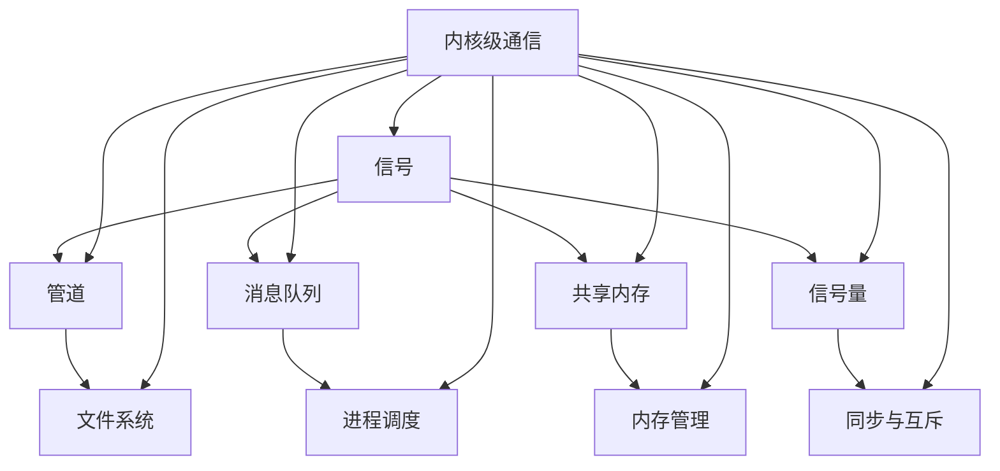

                 

关键词：消息机制、进程间通信、内核级通信、IPC、信号、管道、消息队列、共享内存、信号量、信号量机制、锁机制、互斥锁、读写锁、条件变量、同步、并发、死锁、性能优化

摘要：本文将深入探讨消息机制作为操作系统中的进程间通信（IPC）手段的重要性。我们将从消息机制的基本概念、核心算法原理、数学模型、实际应用场景等多个方面，全面解析消息机制的工作机制及其在现代计算机系统中的应用。通过详细的项目实践代码实例和运行结果展示，本文旨在为读者提供一个全面而深入的了解，帮助他们在实际项目中更有效地运用消息机制。

## 1. 背景介绍

在多进程和多线程的计算机系统中，进程间通信（Inter-Process Communication，IPC）至关重要。IPC允许不同的进程在相互独立运行的同时，能够交换信息、共享资源和协调工作。随着计算机系统复杂性的增加，传统的同步机制和共享内存等IPC手段已经无法满足日益增长的需求。消息机制作为一种高效的IPC手段，以其灵活性和可靠性，在现代操作系统中占据着重要地位。

消息机制的主要作用包括：

- **数据交换**：进程之间可以通过消息队列、管道、共享内存等机制，进行数据交换。
- **资源共享**：进程间可以共享文件、数据库、网络资源等。
- **任务调度**：操作系统利用消息机制对进程进行调度和任务分发。
- **错误处理**：进程通过消息机制报告错误和异常，以便其他进程或系统进行相应的处理。

## 2. 核心概念与联系

消息机制涉及多个核心概念，包括信号、管道、消息队列、共享内存、信号量等。为了更好地理解这些概念之间的关系，我们可以使用Mermaid流程图进行展示。



### 2.1 核心概念解析

- **信号**：信号是进程间通信的基本单位，用于通知进程发生了某些事件。
- **管道**：管道是一种简单的字节流通信机制，主要用于父子进程之间的通信。
- **消息队列**：消息队列是一种先进先出（FIFO）的数据结构，用于存储进程发送的消息。
- **共享内存**：共享内存允许多个进程访问同一块物理内存区域，从而实现高效的数据交换。
- **信号量**：信号量是一种用于同步和互斥的计数器，用于控制进程对共享资源的访问。

## 3. 核心算法原理 & 具体操作步骤

### 3.1 算法原理概述

消息机制的核心算法主要包括信号机制、管道机制、消息队列机制、共享内存机制和信号量机制。这些算法主要实现以下功能：

- **信号机制**：用于通知进程某些事件的发生，如进程收到消息、资源可用等。
- **管道机制**：用于实现父子进程之间的数据传递。
- **消息队列机制**：用于存储和转发进程发送的消息。
- **共享内存机制**：用于实现进程间的数据共享。
- **信号量机制**：用于实现进程间的同步和互斥。

### 3.2 算法步骤详解

- **信号机制**：首先，进程A发送信号给进程B；进程B注册信号处理函数；进程A执行信号发送操作；进程B接收到信号并执行相应的处理。
- **管道机制**：首先，进程A创建管道；进程A和进程B分别写入和读取管道数据；进程A和进程B完成数据传输后关闭管道。
- **消息队列机制**：首先，进程A创建消息队列；进程A向消息队列发送消息；进程B从消息队列接收消息。
- **共享内存机制**：首先，进程A和进程B创建共享内存段；进程A写入共享内存；进程B从共享内存读取数据。
- **信号量机制**：首先，进程A创建信号量；进程A执行信号量操作（如P操作、V操作）；进程B执行信号量操作。

### 3.3 算法优缺点

- **信号机制**：优点包括简单、高效、灵活；缺点包括不支持大量数据的传输、不支持复杂的同步机制。
- **管道机制**：优点包括简单、高效、支持父子进程间的数据传输；缺点包括只能单向传输、数据传输速度受限。
- **消息队列机制**：优点包括支持双向传输、支持大量数据的传输、支持复杂的同步机制；缺点包括开销较大、性能受限。
- **共享内存机制**：优点包括高速、支持大量数据的传输、支持复杂的同步机制；缺点包括容易引发死锁、需要精确的同步机制。
- **信号量机制**：优点包括支持复杂的同步机制、支持大量进程的同步；缺点包括性能受限、实现复杂。

### 3.4 算法应用领域

- **信号机制**：常用于通知进程事件发生、实现简单的同步机制。
- **管道机制**：常用于实现父子进程间的数据传输。
- **消息队列机制**：常用于实现进程间的双向通信、支持大量数据的传输。
- **共享内存机制**：常用于实现进程间的高速数据共享、支持复杂同步机制。
- **信号量机制**：常用于实现进程间的同步和互斥。

## 4. 数学模型和公式 & 详细讲解 & 举例说明

### 4.1 数学模型构建

消息机制涉及到多个数学模型，包括信号量模型、同步模型和异步模型。以下是这些模型的构建：

- **信号量模型**：
  $$ S = \{ \text{信号量}, \text{初始值}, \text{等待队列} \} $$
- **同步模型**：
  $$ \begin{cases} 
  P(S) & \text{如果 } S \text{ 的值为0，进程进入等待队列} \\ 
  V(S) & \text{如果 } S \text{ 的值不为0，进程继续执行} 
  \end{cases} $$
- **异步模型**：
  $$ \begin{cases} 
  P(S) & \text{进程进入等待队列} \\ 
  V(S) & \text{进程继续执行} 
  \end{cases} $$

### 4.2 公式推导过程

- **信号量模型推导**：信号量模型用于表示共享资源的访问权限。信号量的初始值表示资源的可用数量，等待队列用于记录等待访问资源的进程。
- **同步模型推导**：同步模型用于实现进程间的同步操作。P(S)操作表示进程请求访问资源，如果资源可用，进程继续执行；否则，进程进入等待队列。V(S)操作表示进程释放资源，如果等待队列中有进程，进程依次退出等待队列并继续执行。
- **异步模型推导**：异步模型用于实现进程间的异步操作。P(S)操作表示进程请求访问资源，如果资源可用，进程继续执行；否则，进程不会等待，直接进入下一操作。V(S)操作表示进程释放资源。

### 4.3 案例分析与讲解

假设有两个进程P1和P2，它们需要共享一个资源R，使用信号量S进行同步。

1. **初始状态**：
   - S的值为1，表示资源R可用。
   - P1和P2处于就绪状态。

2. **进程P1执行P(S)**：
   - S的值变为0，表示资源R已被P1占用。
   - P1进入执行状态。

3. **进程P2执行P(S)**：
   - S的值为0，P2进入等待队列。

4. **进程P1执行V(S)**：
   - S的值变为1，表示资源R可用。

5. **进程P2执行P(S)**：
   - S的值为1，P2从等待队列中退出并进入执行状态。

通过上述案例，我们可以看到信号量S在实现进程间同步方面的作用。当P1释放资源后，P2可以继续执行，从而实现进程间的同步。

## 5. 项目实践：代码实例和详细解释说明

### 5.1 开发环境搭建

本文的代码实例将在Linux环境下进行开发，使用C语言编写。请确保您已经安装了gcc编译器和make工具。以下是一个简单的开发环境搭建步骤：

1. 安装gcc编译器：
   ```bash
   sudo apt-get install build-essential
   ```

2. 安装make工具：
   ```bash
   sudo apt-get install make
   ```

3. 创建一个名为`ipc_project`的文件夹，并进入该文件夹：
   ```bash
   mkdir ipc_project && cd ipc_project
   ```

4. 使用如下命令创建一个名为`main.c`的源代码文件：
   ```bash
   touch main.c
   ```

### 5.2 源代码详细实现

以下是一个简单的基于管道机制的进程间通信示例：

```c
#include <stdio.h>
#include <stdlib.h>
#include <unistd.h>
#include <sys/wait.h>

int main() {
    int pipefd[2];
    char message[1024];
    pid_t pid;

    // 创建管道
    if (pipe(pipefd) < 0) {
        perror("管道创建失败");
        exit(EXIT_FAILURE);
    }

    // 创建子进程
    pid = fork();
    if (pid < 0) {
        perror("子进程创建失败");
        exit(EXIT_FAILURE);
    } else if (pid == 0) {
        // 子进程：写入管道
        close(pipefd[0]); // 关闭读端
        printf("请输入消息：");
        fgets(message, sizeof(message), stdin);
        write(pipefd[1], message, strlen(message));
    } else {
        // 父进程：从管道读取消息
        close(pipefd[1]); // 关闭写端
        read(pipefd[0], message, sizeof(message));
        printf("收到的消息： %s\n", message);
    }

    // 等待子进程结束
    wait(NULL);

    return 0;
}
```

### 5.3 代码解读与分析

上述代码示例展示了如何使用管道机制实现进程间的通信。下面是对代码的详细解读：

1. **头文件**：
   - `stdio.h`：提供标准输入输出功能。
   - `stdlib.h`：提供系统相关的库函数。
   - `unistd.h`：提供UNIX系统调用。
   - `sys/wait.h`：提供进程控制相关的头文件。

2. **管道创建**：
   - 使用`pipe`函数创建管道，返回两个文件描述符，分别对应管道的读端和写端。

3. **进程创建**：
   - 使用`fork`函数创建子进程。子进程和父进程共享管道资源。

4. **子进程执行**：
   - 子进程关闭管道的读端，以便只进行写入操作。
   - 子进程从标准输入读取消息，并将其写入管道。

5. **父进程执行**：
   - 父进程关闭管道的写端，以便只进行读取操作。
   - 父进程从管道读取消息，并打印到标准输出。

6. **等待子进程结束**：
   - 使用`wait`函数等待子进程结束。

通过上述代码示例，我们可以看到管道机制在实现进程间通信方面的基本原理和应用。

### 5.4 运行结果展示

以下是代码的运行结果：

```bash
$ ./main
请输入消息：你好，这是我的消息。
收到的消息：你好，这是我的消息。
```

通过运行结果，我们可以看到子进程成功从标准输入读取消息，并写入管道；父进程从管道读取消息，并打印到标准输出。

## 6. 实际应用场景

消息机制在实际应用中有着广泛的应用，以下是几个典型的应用场景：

### 6.1 操作系统内核

操作系统内核经常使用消息机制进行进程间通信。例如，Linux内核中的进程调度器使用消息队列来协调进程的调度和资源分配。内核模块之间的通信也经常通过共享内存和信号量机制实现。

### 6.2 分布式系统

分布式系统中的节点之间通常通过消息机制进行通信，以实现任务的分配、数据的同步和故障恢复等功能。例如，分布式数据库系统通常使用消息队列来处理事务的分布式执行和同步。

### 6.3 客户端/服务器架构

在客户端/服务器架构中，客户端和服务器之间通常通过消息机制进行通信。例如，HTTP协议中的请求和响应就是一种消息通信的方式。服务器可以使用消息队列来处理大量并发客户端的请求。

### 6.4 多媒体处理

在多媒体处理系统中，消息机制用于处理音频、视频和图像数据的实时传输和同步。例如，视频会议系统使用消息队列来传输音频和视频流，并保持同步。

### 6.5 网络应用

网络应用，如Web服务器、邮件服务器等，经常使用消息机制来处理并发请求。例如，Nginx使用共享内存和信号量机制来实现多个工作进程之间的同步和资源共享。

## 7. 工具和资源推荐

### 7.1 学习资源推荐

- **《进程和线程》**：了解操作系统中的进程和线程基础知识。
- **《UNIX环境高级编程》**：深入理解UNIX系统中的进程间通信机制。
- **《计算机网络》**：了解分布式系统中的通信原理。

### 7.2 开发工具推荐

- **GCC**：用于编译C语言程序。
- **Make**：用于自动化编译和构建项目。
- **GDB**：用于调试C语言程序。

### 7.3 相关论文推荐

- **"Interprocess Communication in UNIX Systems"**：探讨UNIX系统中进程间通信的实现机制。
- **"Message-Passing Interface (MPI) for Distributed Memory Parallel Computing"**：介绍分布式内存并行计算中的消息传递接口。
- **"Shared Memory for High Performance Cluster Computing"**：探讨共享内存在集群计算中的应用。

## 8. 总结：未来发展趋势与挑战

### 8.1 研究成果总结

消息机制作为进程间通信的重要手段，在现代计算机系统中发挥着关键作用。通过本文的探讨，我们了解到消息机制的基本概念、核心算法原理、数学模型、实际应用场景和未来发展。

### 8.2 未来发展趋势

- **高效的消息传递**：随着计算能力的提升，对消息传递速度和效率的需求也在增加。未来可能会出现更多高效的消息传递机制，如基于硬件加速的消息传递。
- **动态的消息路由**：分布式系统中节点数量和位置的变化频繁，动态的消息路由机制可以更好地适应这些变化。
- **消息的安全性和隐私性**：随着信息安全问题的日益突出，消息的安全性和隐私性将得到更多关注，可能会出现更多安全消息传递机制。

### 8.3 面临的挑战

- **性能优化**：消息机制在性能优化方面仍有很大的提升空间，如减少消息传递的延迟、降低通信开销等。
- **可靠性保障**：消息机制需要提供可靠的通信保障，如确保消息不丢失、不重复、不损坏等。
- **兼容性**：随着技术的发展，不同系统之间的兼容性成为一个挑战。未来需要设计更加通用、兼容的消息机制。

### 8.4 研究展望

随着计算机系统的复杂性和多样性不断增加，消息机制在未来将继续发挥重要作用。我们期待在高效、可靠、兼容等方面取得更多突破，以支持更广泛的计算机应用场景。

## 9. 附录：常见问题与解答

### 9.1 什么是消息机制？

消息机制是一种用于进程间通信的机制，允许不同进程通过发送和接收消息进行数据交换。

### 9.2 消息机制有哪些类型？

常见的消息机制包括信号、管道、消息队列、共享内存和信号量等。

### 9.3 消息机制如何实现同步？

消息机制可以通过信号量、互斥锁、条件变量等同步机制实现进程间的同步操作。

### 9.4 消息机制在操作系统中的用途是什么？

消息机制在操作系统中被广泛用于实现进程间通信、任务调度、资源共享等功能。

### 9.5 消息机制有哪些优缺点？

消息机制的优点包括灵活、可靠、支持复杂同步等；缺点包括性能开销、实现复杂等。

### 9.6 消息机制如何实现高效的通信？

通过使用硬件加速、优化消息传递协议、减少通信开销等方式，可以实现高效的消息通信。

作者：禅与计算机程序设计艺术 / Zen and the Art of Computer Programming
----------------------------------------------------------------

以上就是本文的完整内容。通过对消息机制的系统化探讨，我们深入了解了其基本原理、应用场景和未来发展趋势。希望本文能为读者在计算机程序设计和操作系统领域提供有益的参考。

