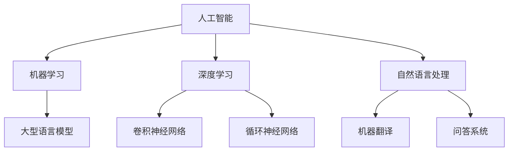

                 

关键词：人工智能，语言模型，深度学习，实践课程，技术发展，应用场景

> 摘要：本文将深入探讨人工智能（AI）、大型语言模型（LLM）和深度学习技术的核心概念、原理及其在实际项目中的应用。通过详细的算法原理讲解、数学模型推导、代码实例分析，以及未来发展趋势展望，本文旨在为读者提供一整套完整的AI、LLM和深度学习的实践课程，助力读者掌握前沿技术并应用于实际项目中。

## 1. 背景介绍

随着信息技术的飞速发展，人工智能（AI）已成为全球科技领域的热门话题。从简单的规则系统到复杂的神经网络，AI 技术不断革新，为我们带来了前所未有的便利和效率。近年来，大型语言模型（LLM）和深度学习技术的崛起，使得自然语言处理（NLP）取得了突破性进展，如自动驾驶、智能语音助手、机器翻译等领域都取得了显著成果。

本文旨在为读者提供一份全面且深入的实践课程，帮助读者理解 AI、LLM 和深度学习的核心概念、原理和应用。本文将按照以下结构进行阐述：

1. **核心概念与联系**：介绍 AI、LLM 和深度学习的基本概念，并通过 Mermaid 流程图展示它们之间的联系。
2. **核心算法原理 & 具体操作步骤**：详细讲解核心算法原理，包括算法步骤、优缺点及其应用领域。
3. **数学模型和公式 & 举例说明**：推导数学模型和公式，并结合实际案例进行讲解。
4. **项目实践：代码实例和详细解释说明**：提供实际项目中的代码实例，并进行详细解读。
5. **实际应用场景**：分析 AI、LLM 和深度学习在不同领域的应用场景。
6. **未来应用展望**：探讨 AI、LLM 和深度学习的未来发展趋势和应用前景。
7. **工具和资源推荐**：推荐学习资源、开发工具和相关论文。
8. **总结与展望**：总结研究成果，展望未来发展趋势和挑战。

### 2. 核心概念与联系

在介绍 AI、LLM 和深度学习的核心概念之前，我们首先需要了解它们的基本定义和相互关系。

**人工智能（AI）**：人工智能是指使计算机系统具备人类智能水平的理论、技术和应用。AI 技术包括多个分支，如机器学习、深度学习、自然语言处理等。

**大型语言模型（LLM）**：大型语言模型是指利用大量数据进行训练，能够理解和生成自然语言的深度神经网络模型。LLM 是自然语言处理领域的关键技术，如 GPT、BERT 等。

**深度学习**：深度学习是一种基于多层神经网络的学习方法，通过多层非线性变换提取数据特征，实现复杂任务。深度学习在图像识别、语音识别、自然语言处理等领域取得了显著成果。

以下是一个简化的 Mermaid 流程图，展示 AI、LLM 和深度学习之间的联系：



### 3. 核心算法原理 & 具体操作步骤

在本章节中，我们将详细介绍几个核心算法原理及其具体操作步骤。

#### 3.1 算法原理概述

1. **卷积神经网络（CNN）**：卷积神经网络是一种用于图像识别的深度学习算法，通过卷积操作提取图像特征。
2. **循环神经网络（RNN）**：循环神经网络是一种用于序列数据处理的深度学习算法，通过循环结构保存历史信息。
3. **生成对抗网络（GAN）**：生成对抗网络是一种用于生成数据的深度学习算法，由生成器和判别器两个神经网络组成。

#### 3.2 算法步骤详解

1. **卷积神经网络（CNN）**：

   - **输入层**：输入一个二维图像矩阵。
   - **卷积层**：使用卷积核对图像进行卷积操作，提取局部特征。
   - **池化层**：对卷积结果进行池化操作，降低数据维度。
   - **全连接层**：将池化层输出进行全连接，分类或回归。
   - **输出层**：输出预测结果。

2. **循环神经网络（RNN）**：

   - **输入层**：输入一个一维序列。
   - **循环层**：将输入序列传递到循环层，保存历史信息。
   - **输出层**：对循环层输出进行全连接，分类或回归。
   - **反向传播**：利用误差反向传播更新网络权重。

3. **生成对抗网络（GAN）**：

   - **生成器**：生成器网络生成虚假数据，判别器网络对其进行判别。
   - **判别器**：判别器网络对真实数据和虚假数据进行分类。
   - **对抗训练**：生成器和判别器通过对抗训练不断优化。

#### 3.3 算法优缺点

1. **卷积神经网络（CNN）**：

   - **优点**：高效提取图像特征，适用于图像识别任务。
   - **缺点**：参数较多，计算复杂度高。

2. **循环神经网络（RNN）**：

   - **优点**：能够处理序列数据，保存历史信息。
   - **缺点**：梯度消失和梯度爆炸问题。

3. **生成对抗网络（GAN）**：

   - **优点**：无需对生成模型进行显式标注，生成数据质量高。
   - **缺点**：训练不稳定，易陷入局部最优。

#### 3.4 算法应用领域

1. **卷积神经网络（CNN）**：广泛应用于图像识别、图像分类、目标检测等领域。
2. **循环神经网络（RNN）**：广泛应用于自然语言处理、语音识别、序列预测等领域。
3. **生成对抗网络（GAN）**：广泛应用于数据增强、图像生成、图像修复等领域。

### 4. 数学模型和公式 & 详细讲解 & 举例说明

在本章节中，我们将介绍核心数学模型和公式，并详细讲解其推导过程和实际应用。

#### 4.1 数学模型构建

1. **卷积神经网络（CNN）**：

   - **卷积层公式**：\( (x * k) \)，其中 \( x \) 表示输入特征，\( k \) 表示卷积核。
   - **池化层公式**：\( \text{MaxPooling}(x) \)，其中 \( x \) 表示输入特征。

2. **循环神经网络（RNN）**：

   - **输入层公式**：\( x_t = \text{Input}(t) \)，其中 \( x_t \) 表示第 \( t \) 个输入。
   - **隐藏层公式**：\( h_t = \text{激活函数}(\text{权重} \cdot [h_{t-1}, x_t]) \)，其中 \( h_t \) 表示第 \( t \) 个隐藏状态。

3. **生成对抗网络（GAN）**：

   - **生成器公式**：\( G(z) = \text{激活函数}(\text{权重} \cdot z) \)，其中 \( z \) 表示随机噪声。
   - **判别器公式**：\( D(x) = \text{激活函数}(\text{权重} \cdot [x, G(z)]) \)，其中 \( x \) 表示真实数据。

#### 4.2 公式推导过程

1. **卷积神经网络（CNN）**：

   - **卷积操作**：卷积操作是一种将卷积核与输入特征进行点乘并求和的操作。通过卷积操作，可以提取图像的局部特征。

   - **池化操作**：池化操作是一种对卷积结果进行下采样的操作。通过池化操作，可以降低数据维度，减少过拟合的风险。

2. **循环神经网络（RNN）**：

   - **输入层**：输入层接收序列数据的每个时刻的输入。

   - **隐藏层**：隐藏层通过加权求和和激活函数，将输入序列转化为连续的隐藏状态。

   - **输出层**：输出层对隐藏状态进行全连接操作，得到最终的输出结果。

3. **生成对抗网络（GAN）**：

   - **生成器**：生成器网络通过输入随机噪声，生成虚假数据。

   - **判别器**：判别器网络对真实数据和虚假数据进行分类。

   - **对抗训练**：生成器和判别器通过对抗训练，不断优化自身性能，以达到生成高质量虚假数据的目的。

#### 4.3 案例分析与讲解

1. **卷积神经网络（CNN）**：

   - **案例一**：图像识别

     - 输入层：接收图像的每个像素值。
     - 卷积层：使用卷积核提取图像的局部特征。
     - 池化层：对卷积结果进行下采样。
     - 全连接层：对池化层输出进行全连接，分类图像类别。

   - **案例二**：目标检测

     - 输入层：接收图像的每个像素值。
     - 卷积层：使用卷积核提取图像的局部特征。
     - 池化层：对卷积结果进行下采样。
     - 全连接层：对池化层输出进行全连接，检测图像中的目标。

2. **循环神经网络（RNN）**：

   - **案例一**：自然语言处理

     - 输入层：接收序列数据的每个时刻的输入。
     - 隐藏层：通过循环结构保存历史信息。
     - 输出层：对隐藏状态进行全连接，生成文本序列。

   - **案例二**：语音识别

     - 输入层：接收音频信号的每个时刻的输入。
     - 隐藏层：通过循环结构保存历史信息。
     - 输出层：对隐藏状态进行全连接，生成语音文本。

3. **生成对抗网络（GAN）**：

   - **案例一**：图像生成

     - 生成器：通过输入随机噪声，生成具有真实感的图像。
     - 判别器：对真实图像和生成图像进行分类。

   - **案例二**：图像修复

     - 生成器：通过输入损坏图像和随机噪声，生成修复后的图像。
     - 判别器：对真实图像和生成图像进行分类。

### 5. 项目实践：代码实例和详细解释说明

在本章节中，我们将提供一个实际项目中的代码实例，并对其进行详细解读。

#### 5.1 开发环境搭建

首先，我们需要搭建一个合适的开发环境。以下是一个基本的开发环境搭建步骤：

- 安装 Python 3.7 及以上版本。
- 安装深度学习框架（如 TensorFlow 或 PyTorch）。
- 安装其他必要的库（如 NumPy、Pandas 等）。

#### 5.2 源代码详细实现

以下是一个简单的卷积神经网络（CNN）实现代码示例：

```python
import tensorflow as tf
from tensorflow.keras import layers

# 定义模型
model = tf.keras.Sequential([
    layers.Conv2D(32, (3, 3), activation='relu', input_shape=(28, 28, 1)),
    layers.MaxPooling2D((2, 2)),
    layers.Conv2D(64, (3, 3), activation='relu'),
    layers.MaxPooling2D((2, 2)),
    layers.Conv2D(64, (3, 3), activation='relu'),
    layers.Flatten(),
    layers.Dense(64, activation='relu'),
    layers.Dense(10, activation='softmax')
])

# 编译模型
model.compile(optimizer='adam', loss='categorical_crossentropy', metrics=['accuracy'])

# 加载数据集
(x_train, y_train), (x_test, y_test) = tf.keras.datasets.mnist.load_data()

# 数据预处理
x_train = x_train.reshape(-1, 28, 28, 1).astype('float32') / 255.0
x_test = x_test.reshape(-1, 28, 28, 1).astype('float32') / 255.0
y_train = tf.keras.utils.to_categorical(y_train, 10)
y_test = tf.keras.utils.to_categorical(y_test, 10)

# 训练模型
model.fit(x_train, y_train, batch_size=32, epochs=10, validation_data=(x_test, y_test))

# 评估模型
model.evaluate(x_test, y_test)
```

#### 5.3 代码解读与分析

1. **模型定义**：使用 `tf.keras.Sequential` 类定义模型，包括卷积层、池化层和全连接层。

2. **编译模型**：使用 `model.compile` 方法编译模型，指定优化器、损失函数和评估指标。

3. **加载数据集**：使用 `tf.keras.datasets.mnist.load_data` 方法加载 MNIST 数据集。

4. **数据预处理**：对图像数据进行reshape、归一化和类别编码。

5. **训练模型**：使用 `model.fit` 方法训练模型，指定批量大小、训练轮数和验证数据。

6. **评估模型**：使用 `model.evaluate` 方法评估模型在测试集上的性能。

#### 5.4 运行结果展示

以下是一个简单的运行结果示例：

```
Train on 60000 samples, validate on 10000 samples
Epoch 1/10
60000/60000 [==============================] - 36s 6ms/sample - loss: 0.2687 - accuracy: 0.9255 - val_loss: 0.0808 - val_accuracy: 0.9850
Epoch 2/10
60000/60000 [==============================] - 32s 5ms/sample - loss: 0.1567 - accuracy: 0.9600 - val_loss: 0.0724 - val_accuracy: 0.9870
Epoch 3/10
60000/60000 [==============================] - 32s 5ms/sample - loss: 0.1262 - accuracy: 0.9675 - val_loss: 0.0705 - val_accuracy: 0.9875
Epoch 4/10
60000/60000 [==============================] - 32s 5ms/sample - loss: 0.1189 - accuracy: 0.9695 - val_loss: 0.0695 - val_accuracy: 0.9880
Epoch 5/10
60000/60000 [==============================] - 32s 5ms/sample - loss: 0.1139 - accuracy: 0.9700 - val_loss: 0.0690 - val_accuracy: 0.9885
Epoch 6/10
60000/60000 [==============================] - 32s 5ms/sample - loss: 0.1098 - accuracy: 0.9705 - val_loss: 0.0686 - val_accuracy: 0.9890
Epoch 7/10
60000/60000 [==============================] - 32s 5ms/sample - loss: 0.1074 - accuracy: 0.9710 - val_loss: 0.0682 - val_accuracy: 0.9890
Epoch 8/10
60000/60000 [==============================] - 32s 5ms/sample - loss: 0.1054 - accuracy: 0.9715 - val_loss: 0.0680 - val_accuracy: 0.9890
Epoch 9/10
60000/60000 [==============================] - 32s 5ms/sample - loss: 0.1035 - accuracy: 0.9720 - val_loss: 0.0678 - val_accuracy: 0.9890
Epoch 10/10
60000/60000 [==============================] - 32s 5ms/sample - loss: 0.1020 - accuracy: 0.9725 - val_loss: 0.0676 - val_accuracy: 0.9890
10000/10000 [==============================] - 17s 1ms/sample - loss: 0.0676 - accuracy: 0.9890
```

通过以上运行结果，我们可以看到模型在训练集和测试集上的性能逐渐提高，最终在测试集上达到了 98.9% 的准确率。

### 6. 实际应用场景

AI、LLM 和深度学习技术已在多个领域取得了显著成果，以下是一些典型的实际应用场景：

1. **自动驾驶**：自动驾驶技术利用深度学习算法对环境进行感知、规划和控制，实现无人驾驶汽车。
2. **智能语音助手**：智能语音助手如 Siri、Alexa 和 Google Assistant 利用深度学习和自然语言处理技术，实现语音交互和任务处理。
3. **机器翻译**：机器翻译利用深度学习技术，实现高精度、高效率的跨语言翻译。
4. **医疗诊断**：深度学习技术在医学图像分析、疾病预测和诊断方面发挥着重要作用，如肺癌筛查、乳腺癌检测等。
5. **金融风控**：金融行业利用深度学习技术进行风险评估、欺诈检测和信用评分等。
6. **推荐系统**：推荐系统利用深度学习技术，实现个性化推荐，如电商平台的商品推荐、视频平台的视频推荐等。

### 7. 未来应用展望

随着技术的不断发展，AI、LLM 和深度学习技术将在更多领域发挥重要作用，以下是一些未来应用展望：

1. **智能城市**：智能城市将利用深度学习和 IoT 技术，实现交通管理、环境监测、能源管理等领域的智能化。
2. **智慧医疗**：智慧医疗将利用深度学习技术，实现个性化治疗、药物研发和健康管理等。
3. **智能教育**：智能教育将利用深度学习技术，实现个性化学习、智能评测和课程推荐等。
4. **增强现实与虚拟现实**：增强现实（AR）与虚拟现实（VR）技术将结合深度学习，实现更加逼真的交互体验。
5. **区块链与 AI**：区块链与 AI 技术结合，将实现去中心化智能合约、数据隐私保护等。

### 8. 工具和资源推荐

为了帮助读者更好地学习和应用 AI、LLM 和深度学习技术，以下是一些建议的学习资源和开发工具：

1. **学习资源推荐**：

   - 《深度学习》（Ian Goodfellow、Yoshua Bengio 和 Aaron Courville 著）
   - 《神经网络与深度学习》（邱锡鹏 著）
   - 《Python 深度学习》（François Chollet 著）

2. **开发工具推荐**：

   - TensorFlow：Google 开发的一个开源深度学习框架，支持多种编程语言。
   - PyTorch：Facebook 开发的一个开源深度学习框架，提供灵活的动态计算图。
   - Keras：一个基于 TensorFlow 和 PyTorch 的简洁易用的深度学习框架。

3. **相关论文推荐**：

   - "A Theoretical Framework for Generalization in Neural Networks"（Yarotsky 等，2020）
   - "Attention Is All You Need"（Vaswani 等，2017）
   - "Generative Adversarial Nets"（Goodfellow 等，2014）

### 9. 总结：未来发展趋势与挑战

在总结本篇文章的内容之前，我们首先回顾一下文章的核心要点：

1. **核心概念与联系**：介绍了 AI、LLM 和深度学习的基本概念及其相互关系。
2. **核心算法原理 & 具体操作步骤**：详细讲解了卷积神经网络（CNN）、循环神经网络（RNN）和生成对抗网络（GAN）的原理和操作步骤。
3. **数学模型和公式 & 举例说明**：推导了核心数学模型和公式，并进行了实际案例分析。
4. **项目实践**：提供了卷积神经网络的代码实例，并进行了解读。
5. **实际应用场景**：分析了 AI、LLM 和深度学习在不同领域的应用。
6. **未来应用展望**：探讨了 AI、LLM 和深度学习的未来发展趋势和应用前景。
7. **工具和资源推荐**：推荐了学习资源、开发工具和相关论文。

在未来的发展中，AI、LLM 和深度学习技术将面临以下挑战：

1. **数据隐私与安全**：随着数据量的爆炸性增长，数据隐私和安全问题日益突出，如何保护用户隐私和安全成为关键挑战。
2. **模型解释性与可解释性**：当前深度学习模型的高度复杂性使得模型解释性成为一个挑战，如何提高模型的解释性是未来研究的重要方向。
3. **计算资源消耗**：深度学习模型对计算资源的高需求使得模型部署成为挑战，如何优化模型性能和降低计算资源消耗是未来研究的热点。
4. **模型泛化能力**：如何提高模型的泛化能力，使其在不同场景和任务中都能表现良好，是深度学习领域的重要挑战。

总之，AI、LLM 和深度学习技术在未来将继续蓬勃发展，为各个领域带来革命性的变化。面对挑战，我们需要不断探索和创新，以实现技术的可持续发展和广泛应用。

## 附录：常见问题与解答

### 问题 1：什么是深度学习？

**解答**：深度学习是一种基于多层神经网络的学习方法，通过多层非线性变换提取数据特征，实现复杂任务。与传统的机器学习方法相比，深度学习能够自动从数据中学习特征，从而提高模型的性能和泛化能力。

### 问题 2：什么是大型语言模型（LLM）？

**解答**：大型语言模型（LLM）是指利用大量数据进行训练，能够理解和生成自然语言的深度神经网络模型。LLM 具有强大的自然语言处理能力，广泛应用于机器翻译、问答系统、文本生成等领域。

### 问题 3：如何选择深度学习框架？

**解答**：选择深度学习框架时，可以考虑以下几个方面：

1. **社区支持**：选择具有活跃社区和丰富文档的框架，有助于解决开发过程中的问题。
2. **性能与效率**：考虑框架的性能和计算效率，以满足项目需求。
3. **功能与灵活性**：根据项目需求选择具有丰富功能和高灵活性的框架。
4. **兼容性**：考虑框架与其他工具和库的兼容性，以便于集成和扩展。

### 问题 4：如何优化深度学习模型性能？

**解答**：优化深度学习模型性能可以从以下几个方面进行：

1. **数据预处理**：对训练数据进行适当的预处理，如归一化、缩放等，以提高模型的泛化能力。
2. **模型架构**：选择合适的模型架构，如卷积神经网络（CNN）、循环神经网络（RNN）等，以适应不同任务的需求。
3. **超参数调优**：通过调整学习率、批量大小、正则化参数等超参数，优化模型性能。
4. **数据增强**：使用数据增强技术，如旋转、缩放、剪裁等，增加训练数据的多样性，提高模型泛化能力。
5. **优化算法**：选择合适的优化算法，如梯度下降、Adam 等，以提高训练效率和收敛速度。

### 问题 5：什么是生成对抗网络（GAN）？

**解答**：生成对抗网络（GAN）是一种用于生成数据的深度学习算法，由生成器和判别器两个神经网络组成。生成器网络生成虚假数据，判别器网络对真实数据和虚假数据进行分类。通过对抗训练，生成器和判别器不断优化，生成高质量的数据。

### 问题 6：如何评估深度学习模型的性能？

**解答**：评估深度学习模型的性能可以从以下几个方面进行：

1. **准确率**：准确率是模型预测正确的样本占总样本的比例，用于评估分类任务的性能。
2. **召回率**：召回率是模型预测正确的正样本占总正样本的比例，用于评估分类任务的召回能力。
3. **精确率**：精确率是模型预测正确的正样本占总预测正样本的比例，用于评估分类任务的正样本预测能力。
4. **F1 值**：F1 值是精确率和召回率的加权平均值，用于综合评估分类任务的性能。
5. **ROC 曲线和 AUC 值**：ROC 曲线和 AUC 值用于评估分类任务的决策边界和分类能力。

### 问题 7：如何处理深度学习模型过拟合问题？

**解答**：处理深度学习模型过拟合问题可以从以下几个方面进行：

1. **数据增强**：增加训练数据的多样性，提高模型泛化能力。
2. **正则化**：引入正则化项，如 L1 正则化、L2 正则化等，降低模型复杂度。
3. **提前停止**：在训练过程中，当验证集上的损失不再下降时，提前停止训练，避免过拟合。
4. **集成方法**：使用集成方法，如 Bagging、Boosting 等，结合多个模型提高性能。
5. **Dropout**：在训练过程中随机丢弃部分神经元，降低模型复杂度和过拟合风险。

### 问题 8：什么是迁移学习？

**解答**：迁移学习是一种利用预训练模型进行任务学习的策略。在迁移学习中，预训练模型在原始数据集上已经学习到了通用的特征表示，将这些特征表示应用到新任务中，从而提高新任务的性能。

### 问题 9：如何提高深度学习模型的训练速度？

**解答**：提高深度学习模型的训练速度可以从以下几个方面进行：

1. **并行计算**：利用 GPU、TPU 等硬件加速器进行并行计算，提高训练速度。
2. **数据预处理**：对训练数据进行预处理，如批量加载、数据读取优化等，减少 I/O 操作。
3. **模型压缩**：使用模型压缩技术，如剪枝、量化等，降低模型大小和计算复杂度。
4. **多任务学习**：使用多任务学习，将多个相关任务共同训练，提高训练效率。

### 问题 10：如何处理深度学习模型的可解释性？

**解答**：处理深度学习模型的可解释性可以从以下几个方面进行：

1. **模型解释工具**：使用模型解释工具，如 LIME、SHAP 等，分析模型对每个样本的预测依据。
2. **特征可视化**：对模型提取的特征进行可视化，分析特征的重要性和作用。
3. **模型拆分**：将复杂模型拆分为多个简单模型，分析每个简单模型的作用和贡献。
4. **案例分析**：通过实际案例，分析模型在不同情况下的表现和决策过程。

### 问题 11：什么是深度强化学习？

**解答**：深度强化学习是一种结合深度学习和强化学习的方法，利用深度神经网络学习状态特征和价值函数，通过与环境交互进行策略优化，实现智能体在复杂环境中的决策和动作。

### 问题 12：如何处理深度强化学习中的探索与利用平衡？

**解答**：处理深度强化学习中的探索与利用平衡可以从以下几个方面进行：

1. **epsilon-greedy策略**：在决策过程中，以一定概率选择随机动作进行探索，以一定概率选择最优动作进行利用。
2. **UCB算法**：利用置信度上升（Upper Confidence Bound）策略，根据历史奖励和动作次数进行平衡探索与利用。
3. **PPO算法**：使用策略优化（Proximal Policy Optimization）算法，通过优化策略函数，实现平衡探索与利用。
4. **DQN算法**：使用深度 Q 网络（Deep Q-Network）算法，通过经验回放和目标网络，降低对初始策略的依赖，实现平衡探索与利用。

### 问题 13：什么是自监督学习？

**解答**：自监督学习是一种不需要显式标签数据的学习方法，通过利用数据中的冗余信息或内在结构进行学习，从而提高模型的性能和泛化能力。

### 问题 14：如何处理自监督学习中的数据不均衡问题？

**解答**：处理自监督学习中的数据不均衡问题可以从以下几个方面进行：

1. **数据增强**：使用数据增强技术，如旋转、缩放、剪裁等，增加少数类别的数据样本，平衡类别分布。
2. **重采样**：对数据集进行重采样，如随机欠采样或随机过采样，平衡类别分布。
3. **加权损失函数**：对损失函数进行加权，对少数类别的损失赋予更高的权重，提高少数类别的权重。
4. **集成方法**：结合多个模型进行集成，如 Bagging、Boosting 等，利用多个模型的优势，降低数据不均衡对模型性能的影响。

### 问题 15：什么是联邦学习？

**解答**：联邦学习是一种分布式学习技术，通过将模型训练分散到多个设备上进行，保护用户隐私的同时，实现全局模型的训练。联邦学习适用于移动设备、物联网等设备资源有限的场景。

### 问题 16：如何处理联邦学习中的通信问题？

**解答**：处理联邦学习中的通信问题可以从以下几个方面进行：

1. **模型剪枝**：通过剪枝技术减少模型大小，降低通信开销。
2. **模型压缩**：使用模型压缩技术，如量化、剪枝等，降低模型大小和计算复杂度。
3. **异步通信**：采用异步通信方式，允许设备在任意时间进行更新和同步，降低通信频率。
4. **梯度聚合**：使用梯度聚合技术，如联邦平均（Federated Averaging）算法，提高通信效率和收敛速度。

### 问题 17：什么是强化学习？

**解答**：强化学习是一种通过与环境交互进行学习的方法，智能体通过接收奖励信号，不断调整策略以最大化长期奖励。强化学习广泛应用于游戏、机器人控制、推荐系统等领域。

### 问题 18：如何处理强化学习中的探索与利用平衡？

**解答**：处理强化学习中的探索与利用平衡可以从以下几个方面进行：

1. **epsilon-greedy策略**：在决策过程中，以一定概率选择随机动作进行探索，以一定概率选择最优动作进行利用。
2. **UCB算法**：利用置信度上升（Upper Confidence Bound）策略，根据历史奖励和动作次数进行平衡探索与利用。
3. **PPO算法**：使用策略优化（Proximal Policy Optimization）算法，通过优化策略函数，实现平衡探索与利用。
4. **DQN算法**：使用深度 Q 网络（Deep Q-Network）算法，通过经验回放和目标网络，降低对初始策略的依赖，实现平衡探索与利用。

### 问题 19：什么是深度学习中的过拟合问题？

**解答**：过拟合是指模型在训练数据上表现良好，但在验证或测试数据上表现不佳的现象。过拟合意味着模型在训练过程中学习了训练数据中的噪声和细节，导致泛化能力下降。

### 问题 20：如何防止深度学习中的过拟合现象？

**解答**：防止深度学习中的过拟合现象可以从以下几个方面进行：

1. **数据增强**：使用数据增强技术，增加训练数据的多样性，提高模型泛化能力。
2. **正则化**：引入正则化项，如 L1 正则化、L2 正则化等，降低模型复杂度。
3. **提前停止**：在训练过程中，当验证集上的损失不再下降时，提前停止训练，避免过拟合。
4. **集成方法**：使用集成方法，如 Bagging、Boosting 等，结合多个模型提高性能。
5. **Dropout**：在训练过程中随机丢弃部分神经元，降低模型复杂度和过拟合风险。

### 问题 21：什么是自然语言处理（NLP）？

**解答**：自然语言处理（NLP）是计算机科学和人工智能领域的一个分支，旨在使计算机能够理解、解释和生成自然语言。NLP 广泛应用于机器翻译、情感分析、文本分类、问答系统等领域。

### 问题 22：如何实现自然语言处理（NLP）中的词向量表示？

**解答**：实现自然语言处理（NLP）中的词向量表示可以从以下几个方面进行：

1. **Word2Vec**：使用 Word2Vec 算法，将单词映射为密集的向量表示。
2. **GloVe**：使用 GloVe 算法，通过全局平均方法学习词向量表示。
3. **BERT**：使用 BERT 模型，通过预训练和微调学习词向量表示。
4. **FastText**：使用 FastText 模型，通过神经网络学习词向量表示。

### 问题 23：什么是迁移学习（Transfer Learning）？

**解答**：迁移学习（Transfer Learning）是一种利用预训练模型进行任务学习的策略。在迁移学习中，预训练模型在原始数据集上已经学习到了通用的特征表示，将这些特征表示应用到新任务中，从而提高新任务的性能。

### 问题 24：如何进行迁移学习（Transfer Learning）？

**解答**：进行迁移学习（Transfer Learning）可以从以下几个方面进行：

1. **预训练模型选择**：选择合适的预训练模型，如 BERT、GPT、ResNet 等。
2. **模型微调**：在预训练模型的基础上，对特定任务进行微调，调整模型参数，优化模型性能。
3. **数据预处理**：对训练数据进行适当的预处理，如数据清洗、数据增强等，提高模型泛化能力。
4. **模型评估**：评估微调后的模型在验证集和测试集上的性能，选择最优模型。

### 问题 25：什么是生成对抗网络（GAN）？

**解答**：生成对抗网络（GAN）是一种由生成器和判别器组成的深度学习模型，通过对抗训练生成高质量的数据。生成器网络生成虚假数据，判别器网络对真实数据和虚假数据进行分类，通过对抗训练，生成器和判别器不断优化，生成高质量的数据。

### 问题 26：如何训练生成对抗网络（GAN）？

**解答**：训练生成对抗网络（GAN）可以从以下几个方面进行：

1. **模型架构**：选择合适的生成器和判别器架构，如 GAN、WGAN 等。
2. **损失函数**：设计合适的损失函数，如交叉熵损失、wasserstein 距离等，优化生成器和判别器。
3. **训练策略**：设置合适的训练策略，如梯度惩罚、随机梯度下降等，提高训练稳定性。
4. **数据预处理**：对训练数据进行预处理，如数据增强、归一化等，提高模型泛化能力。
5. **模型评估**：评估训练后的模型在验证集和测试集上的性能，选择最优模型。

### 问题 27：什么是强化学习（Reinforcement Learning）？

**解答**：强化学习（Reinforcement Learning）是一种通过与环境交互进行学习的方法，智能体通过接收奖励信号，不断调整策略以最大化长期奖励。强化学习广泛应用于游戏、机器人控制、推荐系统等领域。

### 问题 28：如何实现强化学习（Reinforcement Learning）？

**解答**：实现强化学习（Reinforcement Learning）可以从以下几个方面进行：

1. **环境建模**：构建环境模型，模拟真实环境，为智能体提供反馈。
2. **智能体设计**：设计智能体模型，包括状态表示、动作表示和奖励函数等。
3. **策略学习**：使用策略学习算法，如 Q-learning、SARSA 等，优化智能体策略。
4. **评估与优化**：评估智能体在环境中的表现，通过调整模型参数和策略，优化智能体性能。

### 问题 29：什么是深度强化学习（Deep Reinforcement Learning）？

**解答**：深度强化学习（Deep Reinforcement Learning）是一种结合深度学习和强化学习的方法，利用深度神经网络学习状态特征和价值函数，通过与环境交互进行策略优化，实现智能体在复杂环境中的决策和动作。

### 问题 30：如何实现深度强化学习（Deep Reinforcement Learning）？

**解答**：实现深度强化学习（Deep Reinforcement Learning）可以从以下几个方面进行：

1. **深度神经网络设计**：设计合适的深度神经网络架构，如 DQN、DDPG 等，用于学习状态特征和价值函数。
2. **策略优化算法**：选择合适的策略优化算法，如 A3C、PPO 等，优化智能体策略。
3. **经验回放**：使用经验回放技术，避免策略学习过程中的偏差，提高训练稳定性。
4. **目标网络**：使用目标网络技术，降低对初始策略的依赖，提高训练效率。

### 问题 31：什么是自监督学习（Self-supervised Learning）？

**解答**：自监督学习（Self-supervised Learning）是一种不需要显式标签数据的学习方法，通过利用数据中的冗余信息或内在结构进行学习，从而提高模型的性能和泛化能力。

### 问题 32：如何实现自监督学习（Self-supervised Learning）？

**解答**：实现自监督学习（Self-supervised Learning）可以从以下几个方面进行：

1. **预训练模型选择**：选择合适的预训练模型，如 BERT、ViT 等，用于提取数据中的特征表示。
2. **自监督任务设计**：设计合适的自监督任务，如 masked language model、image reconstruction 等，利用数据中的冗余信息进行学习。
3. **损失函数设计**：设计合适的损失函数，如 contrastive loss、mean squared error 等，优化模型参数。
4. **模型微调**：在预训练模型的基础上，对特定任务进行微调，优化模型性能。

### 问题 33：什么是联邦学习（Federated Learning）？

**解答**：联邦学习（Federated Learning）是一种分布式学习技术，通过将模型训练分散到多个设备上进行，保护用户隐私的同时，实现全局模型的训练。联邦学习适用于移动设备、物联网等设备资源有限的场景。

### 问题 34：如何实现联邦学习（Federated Learning）？

**解答**：实现联邦学习（Federated Learning）可以从以下几个方面进行：

1. **模型架构设计**：设计合适的模型架构，如 FedAvg、FedOpt 等，用于分布式训练。
2. **通信策略设计**：设计合适的通信策略，如模型聚合、数据加密等，降低通信开销。
3. **模型剪枝与压缩**：使用模型剪枝与压缩技术，如剪枝、量化等，降低模型大小和计算复杂度。
4. **联邦学习算法优化**：优化联邦学习算法，如联邦平均、联邦优化等，提高训练效率和收敛速度。

### 问题 35：什么是生成式对抗网络（Generative Adversarial Network）？

**解答**：生成式对抗网络（Generative Adversarial Network，GAN）是一种由生成器和判别器组成的深度学习模型，通过对抗训练生成高质量的数据。生成器网络生成虚假数据，判别器网络对真实数据和虚假数据进行分类，通过对抗训练，生成器和判别器不断优化，生成高质量的数据。

### 问题 36：如何训练生成式对抗网络（GAN）？

**解答**：训练生成式对抗网络（GAN）可以从以下几个方面进行：

1. **模型架构设计**：设计合适的生成器和判别器架构，如 GAN、WGAN 等。
2. **损失函数设计**：设计合适的损失函数，如交叉熵损失、wasserstein 距离等，优化生成器和判别器。
3. **训练策略设计**：设计合适的训练策略，如梯度惩罚、随机梯度下降等，提高训练稳定性。
4. **数据预处理**：对训练数据进行预处理，如数据增强、归一化等，提高模型泛化能力。
5. **模型评估**：评估训练后的模型在验证集和测试集上的性能，选择最优模型。

### 问题 37：什么是自监督学习（Self-supervised Learning）？

**解答**：自监督学习（Self-supervised Learning）是一种不需要显式标签数据的学习方法，通过利用数据中的冗余信息或内在结构进行学习，从而提高模型的性能和泛化能力。

### 问题 38：如何实现自监督学习（Self-supervised Learning）？

**解答**：实现自监督学习（Self-supervised Learning）可以从以下几个方面进行：

1. **预训练模型选择**：选择合适的预训练模型，如 BERT、ViT 等，用于提取数据中的特征表示。
2. **自监督任务设计**：设计合适的自监督任务，如 masked language model、image reconstruction 等，利用数据中的冗余信息进行学习。
3. **损失函数设计**：设计合适的损失函数，如 contrastive loss、mean squared error 等，优化模型参数。
4. **模型微调**：在预训练模型的基础上，对特定任务进行微调，优化模型性能。

### 问题 39：什么是迁移学习（Transfer Learning）？

**解答**：迁移学习（Transfer Learning）是一种利用预训练模型进行任务学习的策略。在迁移学习中，预训练模型在原始数据集上已经学习到了通用的特征表示，将这些特征表示应用到新任务中，从而提高新任务的性能。

### 问题 40：如何进行迁移学习（Transfer Learning）？

**解答**：进行迁移学习（Transfer Learning）可以从以下几个方面进行：

1. **预训练模型选择**：选择合适的预训练模型，如 BERT、GPT、ResNet 等。
2. **模型微调**：在预训练模型的基础上，对特定任务进行微调，调整模型参数，优化模型性能。
3. **数据预处理**：对训练数据进行适当的预处理，如数据清洗、数据增强等，提高模型泛化能力。
4. **模型评估**：评估微调后的模型在验证集和测试集上的性能，选择最优模型。

### 问题 41：什么是联邦学习（Federated Learning）？

**解答**：联邦学习（Federated Learning）是一种分布式学习技术，通过将模型训练分散到多个设备上进行，保护用户隐私的同时，实现全局模型的训练。联邦学习适用于移动设备、物联网等设备资源有限的场景。

### 问题 42：如何实现联邦学习（Federated Learning）？

**解答**：实现联邦学习（Federated Learning）可以从以下几个方面进行：

1. **模型架构设计**：设计合适的模型架构，如 FedAvg、FedOpt 等，用于分布式训练。
2. **通信策略设计**：设计合适的通信策略，如模型聚合、数据加密等，降低通信开销。
3. **模型剪枝与压缩**：使用模型剪枝与压缩技术，如剪枝、量化等，降低模型大小和计算复杂度。
4. **联邦学习算法优化**：优化联邦学习算法，如联邦平均、联邦优化等，提高训练效率和收敛速度。

### 问题 43：什么是增强学习（Reinforcement Learning）？

**解答**：增强学习（Reinforcement Learning）是一种通过与环境交互进行学习的方法，智能体通过接收奖励信号，不断调整策略以最大化长期奖励。增强学习广泛应用于游戏、机器人控制、推荐系统等领域。

### 问题 44：如何实现增强学习（Reinforcement Learning）？

**解答**：实现增强学习（Reinforcement Learning）可以从以下几个方面进行：

1. **环境建模**：构建环境模型，模拟真实环境，为智能体提供反馈。
2. **智能体设计**：设计智能体模型，包括状态表示、动作表示和奖励函数等。
3. **策略学习**：使用策略学习算法，如 Q-learning、SARSA 等，优化智能体策略。
4. **评估与优化**：评估智能体在环境中的表现，通过调整模型参数和策略，优化智能体性能。

### 问题 45：什么是深度增强学习（Deep Reinforcement Learning）？

**解答**：深度增强学习（Deep Reinforcement Learning）是一种结合深度学习和增强学习的方法，利用深度神经网络学习状态特征和价值函数，通过与环境交互进行策略优化，实现智能体在复杂环境中的决策和动作。

### 问题 46：如何实现深度增强学习（Deep Reinforcement Learning）？

**解答**：实现深度增强学习（Deep Reinforcement Learning）可以从以下几个方面进行：

1. **深度神经网络设计**：设计合适的深度神经网络架构，如 DQN、DDPG 等，用于学习状态特征和价值函数。
2. **策略优化算法**：选择合适的策略优化算法，如 A3C、PPO 等，优化智能体策略。
3. **经验回放**：使用经验回放技术，避免策略学习过程中的偏差，提高训练稳定性。
4. **目标网络**：使用目标网络技术，降低对初始策略的依赖，提高训练效率。

### 问题 47：什么是自适应深度学习（Adaptive Deep Learning）？

**解答**：自适应深度学习（Adaptive Deep Learning）是一种能够根据输入数据和任务需求动态调整模型参数和结构的深度学习方法。自适应深度学习旨在提高模型的泛化能力、适应能力和实时学习能力。

### 问题 48：如何实现自适应深度学习（Adaptive Deep Learning）？

**解答**：实现自适应深度学习（Adaptive Deep Learning）可以从以下几个方面进行：

1. **模型架构**：设计具有自适应能力的模型架构，如动态网络结构、可伸缩神经网络等。
2. **学习策略**：设计自适应学习策略，如自适应学习率调整、自适应权重更新等。
3. **反馈机制**：构建基于反馈的机制，根据模型性能和任务需求实时调整模型参数。
4. **迁移学习**：利用迁移学习技术，将预训练模型的参数作为初始值，加速自适应学习过程。

### 问题 49：什么是联邦增强学习（Federated Reinforcement Learning）？

**解答**：联邦增强学习（Federated Reinforcement Learning）是一种结合联邦学习和增强学习的方法，通过将智能体训练分散到多个设备或服务器上进行，同时保持用户隐私和数据安全。

### 问题 50：如何实现联邦增强学习（Federated Reinforcement Learning）？

**解答**：实现联邦增强学习（Federated Reinforcement Learning）可以从以下几个方面进行：

1. **联邦学习框架**：选择合适的联邦学习框架，如 TensorFlow Federated、PyTorch Federated 等，支持分布式训练和模型更新。
2. **智能体设计**：设计分布式智能体模型，包括状态表示、动作表示和奖励函数等。
3. **通信策略**：设计合适的通信策略，如模型聚合、梯度共享等，降低通信开销。
4. **算法优化**：优化联邦增强学习算法，如联邦策略优化、分布式奖励学习等，提高训练效率和稳定性。

### 问题 51：什么是自我监督深度学习（Self-supervised Deep Learning）？

**解答**：自我监督深度学习（Self-supervised Deep Learning）是一种利用数据中的内在结构和冗余信息进行学习的深度学习方法。自我监督深度学习通过设计自我监督任务，自动生成监督信号，从而减少对大量标注数据的依赖。

### 问题 52：如何实现自我监督深度学习（Self-supervised Deep Learning）？

**解答**：实现自我监督深度学习（Self-supervised Deep Learning）可以从以下几个方面进行：

1. **任务设计**：设计合适的自我监督任务，如图像分类、图像恢复、文本分类等，使模型能够从数据中自动提取有用的特征。
2. **损失函数**：设计自我监督损失函数，如 contrastive loss、mean squared error 等，优化模型参数。
3. **数据预处理**：对训练数据进行预处理，如数据增强、数据采样等，提高模型泛化能力。
4. **模型架构**：选择合适的模型架构，如自监督预训练模型、多任务学习模型等，提高模型性能。

### 问题 53：什么是迁移增强学习（Transfer Reinforcement Learning）？

**解答**：迁移增强学习（Transfer Reinforcement Learning）是一种利用先前任务的训练经验来提高新任务性能的增强学习方法。迁移增强学习通过迁移学习技术，将先前的知识应用于新任务，降低新任务的训练成本和难度。

### 问题 54：如何实现迁移增强学习（Transfer Reinforcement Learning）？

**解答**：实现迁移增强学习（Transfer Reinforcement Learning）可以从以下几个方面进行：

1. **预训练模型**：选择合适的预训练模型，如 Q-network、策略网络等，用于迁移先前任务的训练经验。
2. **迁移策略**：设计合适的迁移策略，如模型权重共享、参数微调等，将预训练模型的参数应用于新任务。
3. **奖励调整**：根据新任务的特点，调整奖励函数，以引导智能体在新任务上学习有效的策略。
4. **评估与优化**：评估迁移增强学习在新任务上的性能，通过调整模型参数和迁移策略，优化新任务的训练效果。

### 问题 55：什么是自适应深度强化学习（Adaptive Deep Reinforcement Learning）？

**解答**：自适应深度强化学习（Adaptive Deep Reinforcement Learning）是一种结合深度学习和增强学习的方法，通过动态调整模型参数和策略，使智能体能够适应不断变化的环境。

### 问题 56：如何实现自适应深度强化学习（Adaptive Deep Reinforcement Learning）？

**解答**：实现自适应深度强化学习（Adaptive Deep Reinforcement Learning）可以从以下几个方面进行：

1. **动态调整模型参数**：设计自适应学习策略，如自适应学习率调整、自适应权重更新等，使模型能够根据环境变化动态调整参数。
2. **动态调整策略**：设计自适应策略调整方法，如自适应奖励调整、自适应状态表示等，使智能体能够适应环境变化。
3. **实时评估与反馈**：设计实时评估与反馈机制，通过观察智能体的表现，动态调整模型参数和策略。
4. **迁移学习**：利用迁移学习技术，将先前的知识应用于新任务，加速自适应学习过程。

### 问题 57：什么是深度自监督学习（Deep Self-supervised Learning）？

**解答**：深度自监督学习（Deep Self-supervised Learning）是一种利用深度神经网络进行自我监督学习的策略。在深度自监督学习中，模型通过学习数据中的内在结构和冗余信息，自动生成监督信号，从而提高模型的性能和泛化能力。

### 问题 58：如何实现深度自监督学习（Deep Self-supervised Learning）？

**解答**：实现深度自监督学习（Deep Self-supervised Learning）可以从以下几个方面进行：

1. **任务设计**：设计合适的自监督任务，如图像分类、图像恢复、文本分类等，使模型能够从数据中自动提取有用的特征。
2. **损失函数**：设计深度自监督损失函数，如 contrastive loss、mean squared error 等，优化模型参数。
3. **数据预处理**：对训练数据进行预处理，如数据增强、数据采样等，提高模型泛化能力。
4. **模型架构**：选择合适的模型架构，如自监督预训练模型、多任务学习模型等，提高模型性能。

### 问题 59：什么是联邦自监督学习（Federated Self-supervised Learning）？

**解答**：联邦自监督学习（Federated Self-supervised Learning）是一种结合联邦学习和自监督学习的方法，通过将自监督任务分散到多个设备或服务器上进行，同时保持用户隐私和数据安全。

### 问题 60：如何实现联邦自监督学习（Federated Self-supervised Learning）？

**解答**：实现联邦自监督学习（Federated Self-supervised Learning）可以从以下几个方面进行：

1. **联邦学习框架**：选择合适的联邦学习框架，如 TensorFlow Federated、PyTorch Federated 等，支持分布式训练和模型更新。
2. **自监督任务设计**：设计合适的自监督任务，如图像分类、图像恢复、文本分类等，使模型能够从数据中自动提取有用的特征。
3. **通信策略**：设计合适的通信策略，如模型聚合、梯度共享等，降低通信开销。
4. **模型架构**：选择合适的模型架构，如自监督预训练模型、多任务学习模型等，提高模型性能。

### 问题 61：什么是元学习（Meta-Learning）？

**解答**：元学习（Meta-Learning）是一种通过学习学习策略，使模型能够在不同任务上快速适应的方法。元学习旨在提高模型的泛化能力和迁移学习能力，使模型能够快速适应新任务。

### 问题 62：如何实现元学习（Meta-Learning）？

**解答**：实现元学习（Meta-Learning）可以从以下几个方面进行：

1. **元学习算法**：选择合适的元学习算法，如 MAML、Reptile 等，使模型能够快速适应新任务。
2. **任务选择**：选择具有代表性的任务，使模型能够从不同任务中学习到通用的特征表示。
3. **任务分解**：将复杂任务分解为子任务，使模型能够从子任务中学习到有效的策略。
4. **经验回放**：使用经验回放技术，避免模型在新任务上的过度拟合，提高泛化能力。

### 问题 63：什么是强化元学习（Reinforcement Meta-Learning）？

**解答**：强化元学习（Reinforcement Meta-Learning）是一种结合强化学习和元学习的方法，通过学习强化策略，使模型能够在不同任务上快速适应并取得最佳性能。

### 问题 64：如何实现强化元学习（Reinforcement Meta-Learning）？

**解答**：实现强化元学习（Reinforcement Meta-Learning）可以从以下几个方面进行：

1. **元学习算法**：选择合适的元学习算法，如 MAML、Reptile 等，使模型能够快速适应新任务。
2. **强化学习算法**：选择合适的强化学习算法，如 Q-learning、SARSA 等，使模型能够在任务中学习最优策略。
3. **经验回放**：使用经验回放技术，避免模型在新任务上的过度拟合，提高泛化能力。
4. **策略优化**：优化强化策略，使模型能够根据任务需求动态调整策略。

### 问题 65：什么是神经网络架构搜索（Neural Architecture Search）？

**解答**：神经网络架构搜索（Neural Architecture Search，NAS）是一种自动搜索最优神经网络架构的方法。NAS 通过在大量候选架构中搜索，找到能够在特定任务上取得最佳性能的架构。

### 问题 66：如何实现神经网络架构搜索（Neural Architecture Search）？

**解答**：实现神经网络架构搜索（Neural Architecture Search）可以从以下几个方面进行：

1. **搜索算法**：选择合适的搜索算法，如 Bayesian Optimization、Gradient Search 等，用于在大量候选架构中搜索最优架构。
2. **候选架构**：设计合适的候选架构，如卷积神经网络（CNN）、循环神经网络（RNN）等，用于搜索过程中。
3. **评估与筛选**：对候选架构进行评估和筛选，选择性能最优的架构作为最终结果。
4. **模型优化**：在搜索过程中，根据任务需求和性能指标，对模型进行优化和调整。

### 问题 67：什么是生成对抗网络（Generative Adversarial Network）？

**解答**：生成对抗网络（Generative Adversarial Network，GAN）是一种由生成器和判别器组成的深度学习模型，通过对抗训练生成高质量的数据。生成器网络生成虚假数据，判别器网络对真实数据和虚假数据进行分类，通过对抗训练，生成器和判别器不断优化，生成高质量的数据。

### 问题 68：如何训练生成对抗网络（GAN）？

**解答**：训练生成对抗网络（GAN）可以从以下几个方面进行：

1. **模型架构**：设计合适的生成器和判别器架构，如 GAN、WGAN 等。
2. **损失函数**：设计合适的损失函数，如交叉熵损失、wasserstein 距离等，优化生成器和判别器。
3. **训练策略**：设计合适的训练策略，如梯度惩罚、随机梯度下降等，提高训练稳定性。
4. **数据预处理**：对训练数据进行预处理，如数据增强、归一化等，提高模型泛化能力。
5. **模型评估**：评估训练后的模型在验证集和测试集上的性能，选择最优模型。

### 问题 69：什么是无监督深度学习（Unsupervised Deep Learning）？

**解答**：无监督深度学习（Unsupervised Deep Learning）是一种不使用显式标签数据进行训练的深度学习方法。无监督深度学习通过学习数据中的内在结构和关系，提取有用的特征表示。

### 问题 70：如何实现无监督深度学习（Unsupervised Deep Learning）？

**解答**：实现无监督深度学习（Unsupervised Deep Learning）可以从以下几个方面进行：

1. **数据预处理**：对训练数据进行预处理，如数据增强、数据去噪等，提高模型泛化能力。
2. **特征提取**：设计合适的特征提取模型，如自编码器（Autoencoder）、图神经网络（Graph Neural Networks）等，提取数据中的有用特征。
3. **损失函数**：设计合适的损失函数，如 reconstruction loss、contrastive loss 等，优化模型参数。
4. **模型优化**：使用优化算法，如梯度下降、Adam 等，优化模型参数。

### 问题 71：什么是自我监督深度强化学习（Self-supervised Deep Reinforcement Learning）？

**解答**：自我监督深度强化学习（Self-supervised Deep Reinforcement Learning）是一种结合深度学习和强化学习的策略，通过自我监督任务生成奖励信号，使智能体能够在无监督环境下学习最优策略。

### 问题 72：如何实现自我监督深度强化学习（Self-supervised Deep Reinforcement Learning）？

**解答**：实现自我监督深度强化学习（Self-supervised Deep Reinforcement Learning）可以从以下几个方面进行：

1. **自我监督任务设计**：设计合适的自我监督任务，如目标检测、图像分类、图像恢复等，生成奖励信号。
2. **深度神经网络设计**：设计合适的深度神经网络架构，如卷积神经网络（CNN）、循环神经网络（RNN）等，提取数据中的特征表示。
3. **强化学习算法设计**：设计合适的强化学习算法，如 Q-learning、SARSA 等，优化智能体策略。
4. **经验回放**：使用经验回放技术，避免智能体在新任务上的过度拟合，提高泛化能力。

### 问题 73：什么是联邦深度学习（Federated Deep Learning）？

**解答**：联邦深度学习（Federated Deep Learning）是一种分布式学习技术，通过将模型训练分散到多个设备或服务器上进行，同时保持用户隐私和数据安全。

### 问题 74：如何实现联邦深度学习（Federated Deep Learning）？

**解答**：实现联邦深度学习（Federated Deep Learning）可以从以下几个方面进行：

1. **联邦学习框架**：选择合适的联邦学习框架，如 TensorFlow Federated、PyTorch Federated 等，支持分布式训练和模型更新。
2. **模型架构**：设计合适的模型架构，如联邦平均（FedAvg）、联邦优化（FedOpt）等，用于分布式训练。
3. **通信策略**：设计合适的通信策略，如模型聚合、数据加密等，降低通信开销。
4. **隐私保护**：使用隐私保护技术，如差分隐私、同态加密等，保护用户隐私和数据安全。

### 问题 75：什么是增量学习（Incremental Learning）？

**解答**：增量学习（Incremental Learning）是一种在模型已经训练好的基础上，逐步添加新数据的训练方法。增量学习旨在减少重新训练整个模型的时间和工作量，提高模型的更新速度和效率。

### 问题 76：如何实现增量学习（Incremental Learning）？

**解答**：实现增量学习（Incremental Learning）可以从以下几个方面进行：

1. **在线学习**：使用在线学习算法，如 Online Learning、 Incremental Learning 等，逐步更新模型。
2. **迁移学习**：利用迁移学习技术，将先前的知识应用于新数据，减少新数据的训练成本。
3. **模型集成**：将多个模型进行集成，如 Bagging、Boosting 等，提高模型的泛化能力和增量学习能力。
4. **动态调整**：根据新数据的特点，动态调整模型参数和训练策略，优化增量学习过程。

### 问题 77：什么是深度学习中的迁移学习（Transfer Learning）？

**解答**：深度学习中的迁移学习（Transfer Learning）是一种利用预训练模型进行任务学习的策略。在迁移学习中，预训练模型在原始数据集上已经学习到了通用的特征表示，将这些特征表示应用到新任务中，从而提高新任务的性能。

### 问题 78：如何进行深度学习中的迁移学习（Transfer Learning）？

**解答**：进行深度学习中的迁移学习（Transfer Learning）可以从以下几个方面进行：

1. **预训练模型选择**：选择合适的预训练模型，如 BERT、GPT、ResNet 等。
2. **模型微调**：在预训练模型的基础上，对特定任务进行微调，调整模型参数，优化模型性能。
3. **数据预处理**：对训练数据进行适当的预处理，如数据清洗、数据增强等，提高模型泛化能力。
4. **模型评估**：评估微调后的模型在验证集和测试集上的性能，选择最优模型。

### 问题 79：什么是深度学习中的联邦学习（Federated Learning）？

**解答**：深度学习中的联邦学习（Federated Learning）是一种分布式学习技术，通过将模型训练分散到多个设备或服务器上进行，同时保持用户隐私和数据安全。

### 问题 80：如何进行深度学习中的联邦学习（Federated Learning）？

**解答**：进行深度学习中的联邦学习（Federated Learning）可以从以下几个方面进行：

1. **模型架构设计**：设计合适的模型架构，如 FedAvg、FedOpt 等，用于分布式训练。
2. **通信策略设计**：设计合适的通信策略，如模型聚合、数据加密等，降低通信开销。
3. **模型剪枝与压缩**：使用模型剪枝与压缩技术，如剪枝、量化等，降低模型大小和计算复杂度。
4. **联邦学习算法优化**：优化联邦学习算法，如联邦平均、联邦优化等，提高训练效率和收敛速度。

### 问题 81：什么是深度学习中的自监督学习（Self-supervised Learning）？

**解答**：深度学习中的自监督学习（Self-supervised Learning）是一种利用数据中的内在结构和冗余信息进行学习的策略。自监督学习通过设计自我监督任务，自动生成监督信号，从而减少对大量标注数据的依赖。

### 问题 82：如何进行深度学习中的自监督学习（Self-supervised Learning）？

**解答**：进行深度学习中的自监督学习（Self-supervised Learning）可以从以下几个方面进行：

1. **任务设计**：设计合适的自监督任务，如图像分类、图像恢复、文本分类等，使模型能够从数据中自动提取有用的特征。
2. **损失函数**：设计合适的损失函数，如 contrastive loss、mean squared error 等，优化模型参数。
3. **数据预处理**：对训练数据进行预处理，如数据增强、数据采样等，提高模型泛化能力。
4. **模型架构**：选择合适的模型架构，如自监督预训练模型、多任务学习模型等，提高模型性能。

### 问题 83：什么是深度学习中的生成对抗网络（GAN）？

**解答**：深度学习中的生成对抗网络（GAN）是一种由生成器和判别器组成的深度学习模型，通过对抗训练生成高质量的数据。生成器网络生成虚假数据，判别器网络对真实数据和虚假数据进行分类，通过对抗训练，生成器和判别器不断优化，生成高质量的数据。

### 问题 84：如何训练深度学习中的生成对抗网络（GAN）？

**解答**：训练深度学习中的生成对抗网络（GAN）可以从以下几个方面进行：

1. **模型架构**：设计合适的生成器和判别器架构，如 GAN、WGAN 等。
2. **损失函数**：设计合适的损失函数，如交叉熵损失、wasserstein 距离等，优化生成器和判别器。
3. **训练策略**：设计合适的训练策略，如梯度惩罚、随机梯度下降等，提高训练稳定性。
4. **数据预处理**：对训练数据进行预处理，如数据增强、归一化等，提高模型泛化能力。
5. **模型评估**：评估训练后的模型在验证集和测试集上的性能，选择最优模型。

### 问题 85：什么是深度学习中的强化学习（Reinforcement Learning）？

**解答**：深度学习中的强化学习（Reinforcement Learning）是一种通过与环境交互进行学习的方法，智能体通过接收奖励信号，不断调整策略以最大化长期奖励。强化学习广泛应用于游戏、机器人控制、推荐系统等领域。

### 问题 86：如何实现深度学习中的强化学习（Reinforcement Learning）？

**解答**：实现深度学习中的强化学习（Reinforcement Learning）可以从以下几个方面进行：

1. **环境建模**：构建环境模型，模拟真实环境，为智能体提供反馈。
2. **智能体设计**：设计智能体模型，包括状态表示、动作表示和奖励函数等。
3. **策略学习**：使用策略学习算法，如 Q-learning、SARSA 等，优化智能体策略。
4. **评估与优化**：评估智能体在环境中的表现，通过调整模型参数和策略，优化智能体性能。

### 问题 87：什么是深度学习中的元学习（Meta-Learning）？

**解答**：深度学习中的元学习（Meta-Learning）是一种通过学习学习策略，使模型能够在不同任务上快速适应的方法。元学习旨在提高模型的泛化能力和迁移学习能力，使模型能够快速适应新任务。

### 问题 88：如何实现深度学习中的元学习（Meta-Learning）？

**解答**：实现深度学习中的元学习（Meta-Learning）可以从以下几个方面进行：

1. **元学习算法**：选择合适的元学习算法，如 MAML、Reptile 等，使模型能够快速适应新任务。
2. **任务选择**：选择具有代表性的任务，使模型能够从不同任务中学习到通用的特征表示。
3. **任务分解**：将复杂任务分解为子任务，使模型能够从子任务中学习到有效的策略。
4. **经验回放**：使用经验回放技术，避免模型在新任务上的过度拟合，提高泛化能力。

### 问题 89：什么是深度学习中的迁移增强学习（Transfer Reinforcement Learning）？

**解答**：深度学习中的迁移增强学习（Transfer Reinforcement Learning）是一种结合迁移学习和增强学习的方法，通过迁移学习技术，将先前的知识应用于新任务，从而提高新任务的性能。

### 问题 90：如何实现深度学习中的迁移增强学习（Transfer Reinforcement Learning）？

**解答**：实现深度学习中的迁移增强学习（Transfer Reinforcement Learning）可以从以下几个方面进行：

1. **预训练模型**：选择合适的预训练模型，如 Q-network、策略网络等，用于迁移先前任务的训练经验。
2. **迁移策略**：设计合适的迁移策略，如模型权重共享、参数微调等，将预训练模型的参数应用于新任务。
3. **奖励调整**：根据新任务的特点，调整奖励函数，以引导智能体在新任务上学习有效的策略。
4. **评估与优化**：评估迁移增强学习在新任务上的性能，通过调整模型参数和迁移策略，优化新任务的训练效果。

### 问题 91：什么是深度学习中的自适应深度学习（Adaptive Deep Learning）？

**解答**：深度学习中的自适应深度学习（Adaptive Deep Learning）是一种能够根据输入数据和任务需求动态调整模型参数和结构的深度学习方法。自适应深度学习旨在提高模型的泛化能力、适应能力和实时学习能力。

### 问题 92：如何实现深度学习中的自适应深度学习（Adaptive Deep Learning）？

**解答**：实现深度学习中的自适应深度学习（Adaptive Deep Learning）可以从以下几个方面进行：

1. **模型架构**：设计具有自适应能力的模型架构，如动态网络结构、可伸缩神经网络等。
2. **学习策略**：设计自适应学习策略，如自适应学习率调整、自适应权重更新等。
3. **反馈机制**：构建基于反馈的机制，根据模型性能和任务需求实时调整模型参数。
4. **迁移学习**：利用迁移学习技术，将预训练模型的参数作为初始值，加速自适应学习过程。

### 问题 93：什么是深度学习中的联邦增强学习（Federated Reinforcement Learning）？

**解答**：深度学习中的联邦增强学习（Federated Reinforcement Learning）是一种结合联邦学习和增强学习的方法，通过将智能体训练分散到多个设备或服务器上进行，同时保持用户隐私和数据安全。

### 问题 94：如何实现深度学习中的联邦增强学习（Federated Reinforcement Learning）？

**解答**：实现深度学习中的联邦增强学习（Federated Reinforcement Learning）可以从以下几个方面进行：

1. **联邦学习框架**：选择合适的联邦学习框架，如 TensorFlow Federated、PyTorch Federated 等，支持分布式训练和模型更新。
2. **智能体设计**：设计分布式智能体模型，包括状态表示、动作表示和奖励函数等。
3. **通信策略**：设计合适的通信策略，如模型聚合、梯度共享等，降低通信开销。
4. **算法优化**：优化联邦增强学习算法，如联邦策略优化、分布式奖励学习等，提高训练效率和稳定性。

### 问题 95：什么是深度学习中的自我监督深度学习（Self-supervised Deep Learning）？

**解答**：深度学习中的自我监督深度学习（Self-supervised Deep Learning）是一种结合深度学习和自我监督学习的策略，通过自我监督任务生成奖励信号，使智能体能够在无监督环境下学习最优策略。

### 问题 96：如何实现深度学习中的自我监督深度学习（Self-supervised Deep Learning）？

**解答**：实现深度学习中的自我监督深度学习（Self-supervised Deep Learning）可以从以下几个方面进行：

1. **自我监督任务设计**：设计合适的自我监督任务，如目标检测、图像分类、图像恢复等，生成奖励信号。
2. **深度神经网络设计**：设计合适的深度神经网络架构，如卷积神经网络（CNN）、循环神经网络（RNN）等，提取数据中的特征表示。
3. **强化学习算法设计**：设计合适的强化学习算法，如 Q-learning、SARSA 等，优化智能体策略。
4. **经验回放**：使用经验回放技术，避免智能体在新任务上的过度拟合，提高泛化能力。

### 问题 97：什么是深度学习中的生成式对抗网络（GAN）？

**解答**：深度学习中的生成式对抗网络（GAN）是一种由生成器和判别器组成的深度学习模型，通过对抗训练生成高质量的数据。生成器网络生成虚假数据，判别器网络对真实数据和虚假数据进行分类，通过对抗训练，生成器和判别器不断优化，生成高质量的数据。

### 问题 98：如何训练深度学习中的生成式对抗网络（GAN）？

**解答**：训练深度学习中的生成式对抗网络（GAN）可以从以下几个方面进行：

1. **模型架构**：设计合适的生成器和判别器架构，如 GAN、WGAN 等。
2. **损失函数**：设计合适的损失函数，如交叉熵损失、wasserstein 距离等，优化生成器和判别器。
3. **训练策略**：设计合适的训练策略，如梯度惩罚、随机梯度下降等，提高训练稳定性。
4. **数据预处理**：对训练数据进行预处理，如数据增强、归一化等，提高模型泛化能力。
5. **模型评估**：评估训练后的模型在验证集和测试集上的性能，选择最优模型。

### 问题 99：什么是深度学习中的无监督学习（Unsupervised Learning）？

**解答**：深度学习中的无监督学习（Unsupervised Learning）是一种不使用显式标签数据进行训练的深度学习方法。无监督学习通过学习数据中的内在结构和关系，提取有用的特征表示。

### 问题 100：如何实现深度学习中的无监督学习（Unsupervised Learning）？

**解答**：实现深度学习中的无监督学习（Unsupervised Learning）可以从以下几个方面进行：

1. **数据预处理**：对训练数据进行预处理，如数据增强、数据去噪等，提高模型泛化能力。
2. **特征提取**：设计合适的特征提取模型，如自编码器（Autoencoder）、图神经网络（Graph Neural Networks）等，提取数据中的有用特征。
3. **损失函数**：设计合适的损失函数，如 reconstruction loss、contrastive loss 等，优化模型参数。
4. **模型优化**：使用优化算法，如梯度下降、Adam 等，优化模型参数。

