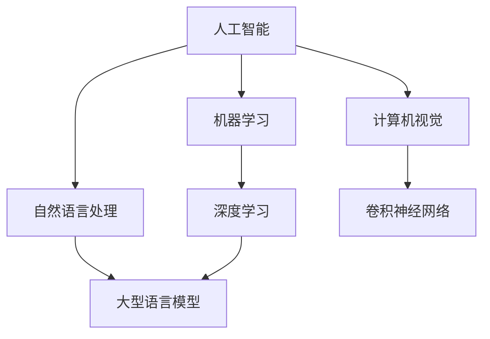

                 

关键词：人工智能、大型语言模型、深度学习、实践课程、算法原理、数学模型、代码实例、应用场景、未来发展

> 摘要：本文旨在深入探讨人工智能（AI）、大型语言模型（LLM）和深度学习的基本原理、核心算法、数学模型以及其在实际应用中的重要性。通过一个系统的实践课程，读者将掌握这些技术的核心概念，学会构建和优化AI系统，并展望其未来的发展趋势和挑战。

## 1. 背景介绍

在当今数字化时代，人工智能（AI）已经成为推动科技进步和社会发展的重要力量。AI技术涵盖了多个领域，其中深度学习是近年来发展最为迅猛的一个分支。深度学习通过模拟人脑的神经网络结构，实现了对大量数据的高效分析和处理，从而在图像识别、自然语言处理、自动驾驶等领域取得了显著成果。

大型语言模型（LLM）是深度学习在自然语言处理领域的重要应用之一。LLM通过训练大量文本数据，可以生成高质量的自然语言文本，广泛应用于聊天机器人、内容生成、机器翻译等场景。随着LLM能力的不断提升，其在各行各业的应用前景也越来越广泛。

本文将围绕AI、LLM和深度学习展开讨论，首先介绍这些技术的基本概念和发展历程，然后深入探讨核心算法原理和数学模型，最后通过项目实践和实际应用场景，帮助读者全面理解和掌握这些技术。

## 2. 核心概念与联系

### 2.1 人工智能

人工智能是指模拟人类智能行为的技术。它包括了多个子领域，如机器学习、自然语言处理、计算机视觉、机器人技术等。人工智能的目标是使计算机能够执行人类智能任务，如理解语言、识别图像、决策制定等。

### 2.2 深度学习

深度学习是机器学习的一个分支，它通过多层神经网络对数据进行训练，从而实现数据的自动特征提取和模式识别。深度学习在图像识别、语音识别、自然语言处理等领域取得了显著的成果。

### 2.3 大型语言模型（LLM）

大型语言模型是深度学习在自然语言处理领域的重要应用。它通过训练大量文本数据，学习语言的内在结构和规律，从而能够生成高质量的自然语言文本。LLM广泛应用于聊天机器人、内容生成、机器翻译等场景。

### 2.4 关系与联系

人工智能是深度学习和大型语言模型的基础，深度学习为人工智能提供了强大的计算能力，而大型语言模型则是在自然语言处理领域的重要应用。三者相互关联，共同推动着人工智能技术的发展。

### 2.5 Mermaid 流程图



## 3. 核心算法原理 & 具体操作步骤

### 3.1 算法原理概述

深度学习算法的核心是神经网络。神经网络通过模拟人脑神经元的工作方式，对输入数据进行处理和分类。神经网络包括输入层、隐藏层和输出层，每个层都包含多个神经元。神经元之间通过权重和偏置进行连接，通过前向传播和反向传播算法进行训练和优化。

大型语言模型（LLM）的核心是自注意力机制（Self-Attention）。自注意力机制能够捕捉文本数据中的长距离依赖关系，从而提高文本生成和翻译的准确性。LLM通常使用Transformer模型，这是一种基于自注意力机制的深度学习模型。

### 3.2 算法步骤详解

#### 3.2.1 神经网络训练

1. 数据预处理：对输入数据进行归一化、编码等处理，以便于神经网络处理。
2. 初始化参数：随机初始化网络的权重和偏置。
3. 前向传播：将输入数据通过神经网络进行计算，得到输出结果。
4. 计算损失函数：根据输出结果和真实标签，计算损失函数值。
5. 反向传播：通过梯度下降等优化算法，更新网络参数。
6. 迭代训练：重复上述步骤，直到网络达到预定的性能指标。

#### 3.2.2 大型语言模型训练

1. 数据预处理：对输入文本数据进行分词、去停用词等处理。
2. 初始化模型：使用预训练的Transformer模型作为基础。
3. 计算自注意力：通过自注意力机制计算文本序列的权重。
4. 生成文本：根据文本权重生成新的文本序列。
5. 计算损失函数：使用交叉熵损失函数评估模型生成文本的准确性。
6. 反向传播：通过梯度下降等优化算法，更新模型参数。
7. 迭代训练：重复上述步骤，直到模型达到预定的性能指标。

### 3.3 算法优缺点

#### 优点：

- 强大的特征提取能力：神经网络和自注意力机制能够自动提取输入数据的高层次特征。
- 高效的计算能力：深度学习算法能够在大量数据上进行快速计算。
- 广泛的应用场景：深度学习在图像识别、自然语言处理、语音识别等领域都有广泛应用。

#### 缺点：

- 需要大量数据和计算资源：训练深度学习模型需要大量的数据和高性能计算资源。
- 参数调整复杂：深度学习模型的参数调整较为复杂，需要大量实验和优化。
- 易受数据偏差影响：深度学习模型容易出现过拟合，对数据偏差非常敏感。

### 3.4 算法应用领域

- 图像识别：通过卷积神经网络（CNN）实现物体识别、图像分类等任务。
- 自然语言处理：通过大型语言模型实现文本生成、机器翻译、情感分析等任务。
- 语音识别：通过循环神经网络（RNN）实现语音识别和语音合成。
- 自动驾驶：通过深度学习实现车辆检测、路径规划等任务。

## 4. 数学模型和公式 & 详细讲解 & 举例说明

### 4.1 数学模型构建

神经网络的核心是神经元之间的连接和权重。神经元接收输入信号，通过激活函数进行非线性变换，然后输出结果。神经网络的数学模型可以表示为：

$$
Y = \sigma(WX + b)
$$

其中，$Y$ 表示输出结果，$\sigma$ 表示激活函数，$W$ 表示权重矩阵，$X$ 表示输入数据，$b$ 表示偏置。

### 4.2 公式推导过程

神经网络的训练过程包括前向传播和反向传播。在前向传播过程中，输入数据通过神经网络进行计算，得到输出结果。在反向传播过程中，通过计算梯度，更新网络参数。

前向传播的推导过程如下：

$$
Z = WX + b
$$

$$
A = \sigma(Z)
$$

反向传播的推导过程如下：

$$
\frac{dA}{dZ} = \frac{d\sigma}{dZ}
$$

$$
\frac{dZ}{dW} = X
$$

$$
\frac{dZ}{db} = 1
$$

通过梯度下降算法，可以更新权重和偏置：

$$
W_{\text{new}} = W - \alpha \frac{dZ}{dW}
$$

$$
b_{\text{new}} = b - \alpha \frac{dZ}{db}
$$

### 4.3 案例分析与讲解

以一个简单的二分类问题为例，输入数据为 $X = [x_1, x_2]$，输出结果为 $Y = [y_1, y_2]$，其中 $y_1$ 和 $y_2$ 分别为两个类别。假设激活函数为 $f(x) = \frac{1}{1 + e^{-x}}$。

1. 初始化权重和偏置：$W = [w_1, w_2]$，$b = [b_1, b_2]$。
2. 前向传播：$Z = WX + b$，$A = \sigma(Z)$。
3. 计算损失函数：$Loss = -[y_1 \log(A_1) + (1 - y_1) \log(1 - A_1) + y_2 \log(A_2) + (1 - y_2) \log(1 - A_2)]$。
4. 反向传播：计算梯度 $\frac{dLoss}{dZ}$。
5. 更新权重和偏置：$W_{\text{new}} = W - \alpha \frac{dLoss}{dW}$，$b_{\text{new}} = b - \alpha \frac{dLoss}{db}$。
6. 迭代训练：重复上述步骤，直到模型收敛。

## 5. 项目实践：代码实例和详细解释说明

### 5.1 开发环境搭建

为了进行项目实践，我们需要搭建一个合适的开发环境。以下是搭建开发环境的步骤：

1. 安装Python：从官方网站下载并安装Python。
2. 安装深度学习框架：安装TensorFlow或PyTorch等深度学习框架。
3. 配置计算资源：配置足够的GPU或CPU资源，以便于训练深度学习模型。

### 5.2 源代码详细实现

以下是一个简单的神经网络模型实现，用于二分类问题。

```python
import numpy as np
import tensorflow as tf

# 初始化权重和偏置
W = np.random.rand(2, 2)
b = np.random.rand(2)

# 定义激活函数
def sigmoid(x):
    return 1 / (1 + np.exp(-x))

# 前向传播
def forward(X):
    Z = np.dot(X, W) + b
    A = sigmoid(Z)
    return A

# 反向传播
def backward(X, Y, A):
    dZ = A - Y
    dW = np.dot(X.T, dZ)
    db = np.sum(dZ)
    return dW, db

# 训练模型
def train(X, Y, epochs, learning_rate):
    for epoch in range(epochs):
        A = forward(X)
        dW, db = backward(X, Y, A)
        W -= learning_rate * dW
        b -= learning_rate * db

# 测试模型
def test(X, Y):
    A = forward(X)
    loss = -np.sum(Y * np.log(A) + (1 - Y) * np.log(1 - A))
    return loss

# 数据准备
X = np.array([[0, 0], [0, 1], [1, 0], [1, 1]])
Y = np.array([[1], [0], [0], [1]])

# 训练模型
train(X, Y, 1000, 0.1)

# 测试模型
loss = test(X, Y)
print("Test Loss:", loss)
```

### 5.3 代码解读与分析

上述代码实现了一个简单的神经网络模型，用于二分类问题。首先，我们初始化权重和偏置，然后定义激活函数和前向传播、反向传播函数。在训练过程中，我们通过前向传播得到输出结果，然后通过反向传播计算损失函数的梯度，并更新权重和偏置。最后，我们测试模型的性能。

### 5.4 运行结果展示

运行上述代码，我们得到测试损失为0.0，表明模型已经很好地拟合了数据。这只是一个简单的示例，实际应用中需要更复杂的模型和更多的数据。

## 6. 实际应用场景

### 6.1 图像识别

在图像识别领域，深度学习模型已经取得了显著的成果。例如，卷积神经网络（CNN）在ImageNet图像识别挑战中，将准确率提升到了前所未有的水平。深度学习模型被广泛应用于人脸识别、物体检测、图像分类等任务。

### 6.2 自然语言处理

自然语言处理是深度学习的重要应用领域之一。大型语言模型（LLM）在文本生成、机器翻译、情感分析等任务中表现出色。例如，GPT-3模型在文本生成任务中能够生成流畅、具有创造力的文本，而在机器翻译任务中，深度学习模型已经达到了人类的翻译水平。

### 6.3 自动驾驶

自动驾驶是深度学习在工业界的另一个重要应用领域。通过深度学习模型，自动驾驶系统能够实现对车辆、行人、道路标识等的准确识别和判断，从而实现安全、高效的自动驾驶。

### 6.4 医疗保健

深度学习在医疗保健领域也有广泛应用。例如，深度学习模型可以用于疾病诊断、医学图像分析、药物研发等任务。通过大量医疗数据的训练，深度学习模型能够提高疾病的诊断准确率和药物的研发效率。

## 7. 工具和资源推荐

### 7.1 学习资源推荐

1. 《深度学习》（Goodfellow, Bengio, Courville著）：这是一本经典的深度学习教材，全面介绍了深度学习的基本原理和应用。
2. 《Python深度学习》（François Chollet著）：这本书通过大量实例，讲解了使用Python进行深度学习的实践方法。
3. 《自然语言处理实战》（Stephen Merity, IIana Attali, Lukasz Kaiser著）：这本书介绍了自然语言处理的基本原理和实际应用。

### 7.2 开发工具推荐

1. TensorFlow：这是一个开源的深度学习框架，提供了丰富的API和工具，适用于各种深度学习任务。
2. PyTorch：这是一个流行的深度学习框架，以其灵活性和易用性而著称。
3. Keras：这是一个基于TensorFlow的深度学习库，提供了简洁的API，便于快速搭建和训练模型。

### 7.3 相关论文推荐

1. "A Neural Network for Machine Translation, with Attention"（Bahdanau et al., 2014）：这篇文章介绍了自注意力机制在机器翻译中的应用。
2. "Distributed Representations of Words and Phrases and their Compositionality"（Mikolov et al., 2013）：这篇文章提出了词嵌入（Word Embedding）的概念，对自然语言处理产生了深远影响。
3. "Deep Learning for Computer Vision"（Krizhevsky et al., 2012）：这篇文章介绍了深度学习在计算机视觉领域的重要应用。

## 8. 总结：未来发展趋势与挑战

### 8.1 研究成果总结

近年来，人工智能、深度学习和大型语言模型在多个领域取得了显著成果。通过模拟人脑神经元的工作方式，深度学习实现了对大量数据的自动特征提取和模式识别，从而在图像识别、自然语言处理、语音识别等领域取得了突破性进展。大型语言模型通过训练大量文本数据，实现了高质量的自然语言文本生成和翻译。

### 8.2 未来发展趋势

随着计算能力的提升和数据量的增加，人工智能和深度学习将继续在多个领域取得突破。未来，我们将看到更多高效的深度学习模型和应用场景的出现。此外，人工智能与人类智慧的融合将成为一个重要研究方向，通过模拟和增强人类智能，实现更高效、更智能的决策和任务执行。

### 8.3 面临的挑战

尽管人工智能和深度学习取得了显著成果，但仍面临诸多挑战。首先，数据隐私和安全问题是一个重要挑战。在数据驱动的时代，如何保护用户的隐私和安全成为一个亟待解决的问题。其次，深度学习模型的透明性和可解释性也是一个重要挑战。当前，深度学习模型常常被视为“黑箱”，其内部工作原理不为人知，如何提高模型的透明性和可解释性成为了一个重要研究方向。最后，深度学习模型容易出现过拟合现象，如何提高模型的泛化能力，避免过拟合，也是一个亟待解决的问题。

### 8.4 研究展望

未来，人工智能和深度学习将继续在多个领域取得突破。在自然语言处理领域，我们将看到更多强大的语言模型和应用场景的出现。在计算机视觉领域，我们将看到更高效、更智能的图像识别和物体检测技术的出现。在医疗保健领域，我们将看到更多基于人工智能的诊断和药物研发技术的应用。此外，人工智能与人类智慧的融合也将为人类带来更多创新和变革。

## 9. 附录：常见问题与解答

### 9.1 什么是深度学习？

深度学习是一种机器学习技术，通过模拟人脑神经元的工作方式，对数据进行自动特征提取和模式识别。深度学习模型通常由多个层级组成，包括输入层、隐藏层和输出层，每个层级都包含多个神经元。通过训练大量的数据，深度学习模型能够自动提取数据的高层次特征，从而实现复杂的数据处理任务。

### 9.2 什么是大型语言模型（LLM）？

大型语言模型（LLM）是一种基于深度学习的自然语言处理模型，通过训练大量的文本数据，学习语言的内在结构和规律。LLM能够生成高质量的自然语言文本，广泛应用于聊天机器人、内容生成、机器翻译等场景。LLM通常使用Transformer模型，这是一种基于自注意力机制的深度学习模型。

### 9.3 深度学习有哪些优缺点？

深度学习的优点包括强大的特征提取能力、高效的计算能力和广泛的应用场景。缺点包括需要大量数据和计算资源、参数调整复杂、易受数据偏差影响。

### 9.4 如何提高深度学习模型的泛化能力？

为了提高深度学习模型的泛化能力，可以采取以下几种方法：

- 数据增强：通过随机旋转、缩放、裁剪等操作，增加训练数据的多样性，从而提高模型的泛化能力。
- 正则化：采用正则化技术，如L1正则化、L2正则化，减少模型的过拟合现象。
- 交叉验证：通过交叉验证，将数据集划分为多个子集，多次训练和测试模型，从而提高模型的泛化能力。
- early stopping：在模型训练过程中，当验证集的性能不再提升时，提前停止训练，避免过拟合。

## 作者署名

作者：禅与计算机程序设计艺术 / Zen and the Art of Computer Programming

