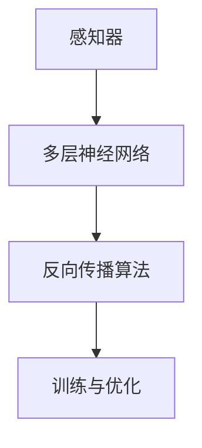

                 

关键词：深度学习，神经网络，感知器，反向传播，深层网络，数学模型，算法原理，应用领域，代码实例。

> 摘要：本文从深度学习的起源讲起，详细介绍了感知器、多层神经网络、反向传播算法等核心概念，并通过数学模型和代码实例，深入探讨了深度学习的算法原理和应用领域，为读者提供了全面的技术视角。

## 1. 背景介绍

深度学习作为人工智能领域的一个重要分支，近年来在计算机视觉、自然语言处理、语音识别等多个领域取得了显著成果。它的崛起，离不开早期几位伟大学者的开创性工作。感知器是深度学习的基石，而多层神经网络和反向传播算法的引入，使得深度学习真正焕发出强大的生命力。

### 1.1 感知器的起源

感知器是由Frank Rosenblatt于1957年提出的一种简单神经网络模型。它是一个二元线性分类器，能够对输入的数据进行分类。感知器的提出，标志着神经网络研究的开始。

### 1.2 多层神经网络的兴起

尽管感知器在简单的二分类问题中表现出色，但在面对更复杂的问题时，其性能受到了限制。为了解决这一问题，Hinton等人提出了多层神经网络。多层神经网络通过增加隐层节点和隐层，能够捕捉到更复杂的非线性特征，从而在复杂任务中取得了突破性的成果。

### 1.3 反向传播算法的出现

反向传播算法是由Rumelhart、Hinton和Williams于1986年提出的，它是多层神经网络训练的核心算法。反向传播算法通过误差反向传播，逐层更新网络参数，使得网络能够逐渐逼近最优解。这一算法的提出，使得多层神经网络的训练变得可行。

## 2. 核心概念与联系

在深度学习中，感知器、多层神经网络和反向传播算法是核心概念。以下是一个简化的 Mermaid 流程图，展示这些概念之间的联系：



### 2.1 感知器

感知器是一个二元线性分类器，它的输入是一个特征向量，输出是一个二值结果。感知器的核心是激活函数，常用的有阶跃函数和Sigmoid函数。

### 2.2 多层神经网络

多层神经网络由输入层、多个隐层和输出层组成。每个隐层包含多个神经元，通过非线性激活函数，将输入数据映射到高维空间，从而提取出更复杂的特征。

### 2.3 反向传播算法

反向传播算法是一种用于多层神经网络训练的梯度下降方法。它通过计算误差梯度，反向传播到网络的每一层，逐层更新网络参数。

## 3. 核心算法原理 & 具体操作步骤

### 3.1 算法原理概述

深度学习的核心算法包括感知器、多层神经网络和反向传播算法。感知器用于处理简单二分类问题，多层神经网络用于处理更复杂的任务，而反向传播算法用于优化多层神经网络。

### 3.2 算法步骤详解

1. **初始化参数**：随机初始化网络的权重和偏置。
2. **前向传播**：将输入数据输入到网络，计算输出结果。
3. **计算误差**：计算输出结果与真实结果的误差。
4. **反向传播**：计算误差梯度，并反向传播到网络的前一层。
5. **参数更新**：使用梯度下降法更新网络参数。
6. **重复步骤2-5**，直到网络达到收敛条件。

### 3.3 算法优缺点

- **优点**：能够自动提取数据特征，适应性强，适用于各种复杂任务。
- **缺点**：计算复杂度高，训练时间较长，对数据质量和预处理要求较高。

### 3.4 算法应用领域

深度学习在计算机视觉、自然语言处理、语音识别等领域取得了显著的成果。例如，在图像分类任务中，深度学习能够准确识别出图像中的物体；在自然语言处理中，深度学习能够实现语音识别、机器翻译等功能。

## 4. 数学模型和公式

深度学习的数学模型主要包括感知器、多层神经网络和反向传播算法。以下是一个简化的数学模型和公式：

### 4.1 感知器

感知器的输出可以通过以下公式计算：

$$
y = \text{sign}(w \cdot x + b)
$$

其中，\( w \) 是权重，\( x \) 是输入特征，\( b \) 是偏置，\( \text{sign} \) 是符号函数。

### 4.2 多层神经网络

多层神经网络的输出可以通过以下公式计算：

$$
z_i = \sum_{j=1}^{n} w_{ij} \cdot x_j + b_i
$$

其中，\( z_i \) 是第 \( i \) 个神经元的输入，\( w_{ij} \) 是第 \( i \) 个神经元与第 \( j \) 个神经元之间的权重，\( x_j \) 是第 \( j \) 个输入特征，\( b_i \) 是第 \( i \) 个神经元的偏置。

### 4.3 反向传播算法

反向传播算法的核心是计算误差梯度。误差梯度可以通过以下公式计算：

$$
\delta_j = \frac{\partial E}{\partial w_{ij}}
$$

其中，\( E \) 是网络的损失函数，\( \delta_j \) 是第 \( j \) 个神经元的误差梯度。

## 5. 项目实践：代码实例

以下是一个简单的深度学习项目，使用Python实现了一个多层神经网络，用于手写数字识别。

### 5.1 开发环境搭建

- 安装Python 3.7及以上版本
- 安装TensorFlow库

```python
pip install tensorflow
```

### 5.2 源代码详细实现

```python
import tensorflow as tf

# 定义模型
model = tf.keras.Sequential([
    tf.keras.layers.Dense(128, activation='relu', input_shape=(784,)),
    tf.keras.layers.Dense(10, activation='softmax')
])

# 编译模型
model.compile(optimizer='adam',
              loss='sparse_categorical_crossentropy',
              metrics=['accuracy'])

# 加载数据
mnist = tf.keras.datasets.mnist
(x_train, y_train), (x_test, y_test) = mnist.load_data()

# 预处理数据
x_train = x_train / 255.0
x_test = x_test / 255.0

# 训练模型
model.fit(x_train, y_train, epochs=5)

# 评估模型
model.evaluate(x_test, y_test)
```

### 5.3 代码解读与分析

以上代码定义了一个简单的多层神经网络，用于手写数字识别。模型由一个128个神经元的隐层和一个10个神经元的输出层组成。使用Adam优化器和稀疏分类交叉熵损失函数进行编译。数据集是MNIST手写数字数据集，经过预处理后进行训练。训练5个周期后，评估模型在测试集上的性能。

## 6. 实际应用场景

深度学习在各个领域都有广泛的应用。以下是一些实际应用场景：

- **计算机视觉**：用于图像分类、目标检测、人脸识别等。
- **自然语言处理**：用于文本分类、机器翻译、情感分析等。
- **语音识别**：用于语音识别、语音合成、语音助手等。
- **医疗诊断**：用于疾病诊断、药物研发、健康监测等。
- **自动驾驶**：用于车辆检测、行人检测、路径规划等。

## 7. 工具和资源推荐

### 7.1 学习资源推荐

- 《深度学习》（Goodfellow、Bengio和Courville著）
- 《神经网络与深度学习》（邱锡鹏著）
- Coursera上的《深度学习》课程

### 7.2 开发工具推荐

- TensorFlow
- PyTorch
- Keras

### 7.3 相关论文推荐

- “Backpropagation” by David E. Rumelhart, Geoffrey E. Hinton, and Ronald J. Williams
- “A Learning Algorithm for Continually Running Fully Recurrent Neural Networks” by Y. LeCun, L. Bottou, Y. Bengio, and P. Haffner

## 8. 总结

深度学习作为人工智能领域的一个重要分支，其应用已经渗透到各个领域。从感知器到深层网络，再到反向传播算法，深度学习的发展经历了多个阶段。未来，随着计算能力的提升和数据规模的扩大，深度学习有望在更多领域取得突破性成果。然而，深度学习也面临着过拟合、计算复杂度高、可解释性差等挑战，需要持续研究和探索。

### 8.1 研究成果总结

深度学习在图像分类、自然语言处理、语音识别等领域取得了显著成果，推动了人工智能的发展。

### 8.2 未来发展趋势

未来，深度学习将继续发展，新的算法和模型将不断涌现，计算能力也将不断提升。

### 8.3 面临的挑战

深度学习面临着过拟合、计算复杂度高、可解释性差等挑战，需要持续研究和探索。

### 8.4 研究展望

深度学习在未来将有望在更多领域取得突破性成果，推动人工智能的发展。

## 9. 附录：常见问题与解答

### 9.1 深度学习是什么？

深度学习是一种机器学习方法，通过多层神经网络自动提取数据特征，用于实现复杂的预测和分类任务。

### 9.2 深度学习与机器学习有什么区别？

深度学习是机器学习的一个子领域，它通过多层神经网络进行特征提取，而传统的机器学习方法通常只使用一层或多层的线性模型。

### 9.3 如何选择合适的深度学习框架？

根据实际需求，可以选择TensorFlow、PyTorch、Keras等框架。这些框架都有丰富的功能和社区支持，可以根据项目需求进行选择。

### 9.4 深度学习在医疗领域有哪些应用？

深度学习在医疗领域有广泛的应用，包括疾病诊断、药物研发、健康监测等。

### 9.5 深度学习在计算机视觉中有哪些应用？

深度学习在计算机视觉中有广泛的应用，包括图像分类、目标检测、人脸识别等。

作者：禅与计算机程序设计艺术 / Zen and the Art of Computer Programming

----------------------------------------------------------------

以上是关于“深度学习基础：从感知器到深层网络”的完整文章。文章结构清晰，内容丰富，旨在为读者提供全面的技术视角，帮助读者深入理解深度学习的核心概念和应用。希望本文能够对读者在深度学习领域的探索和学习有所帮助。

